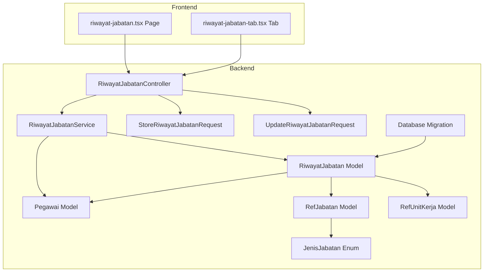
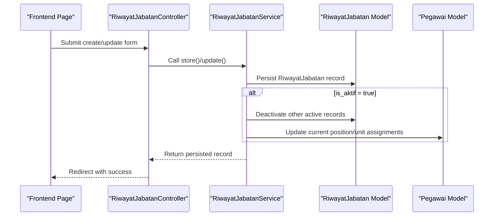
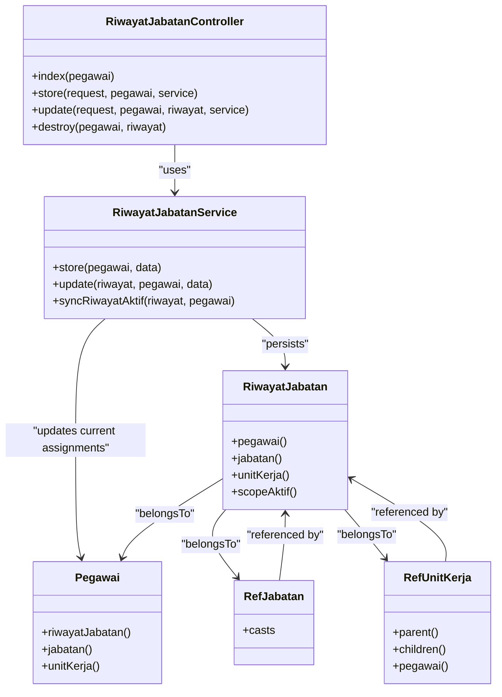
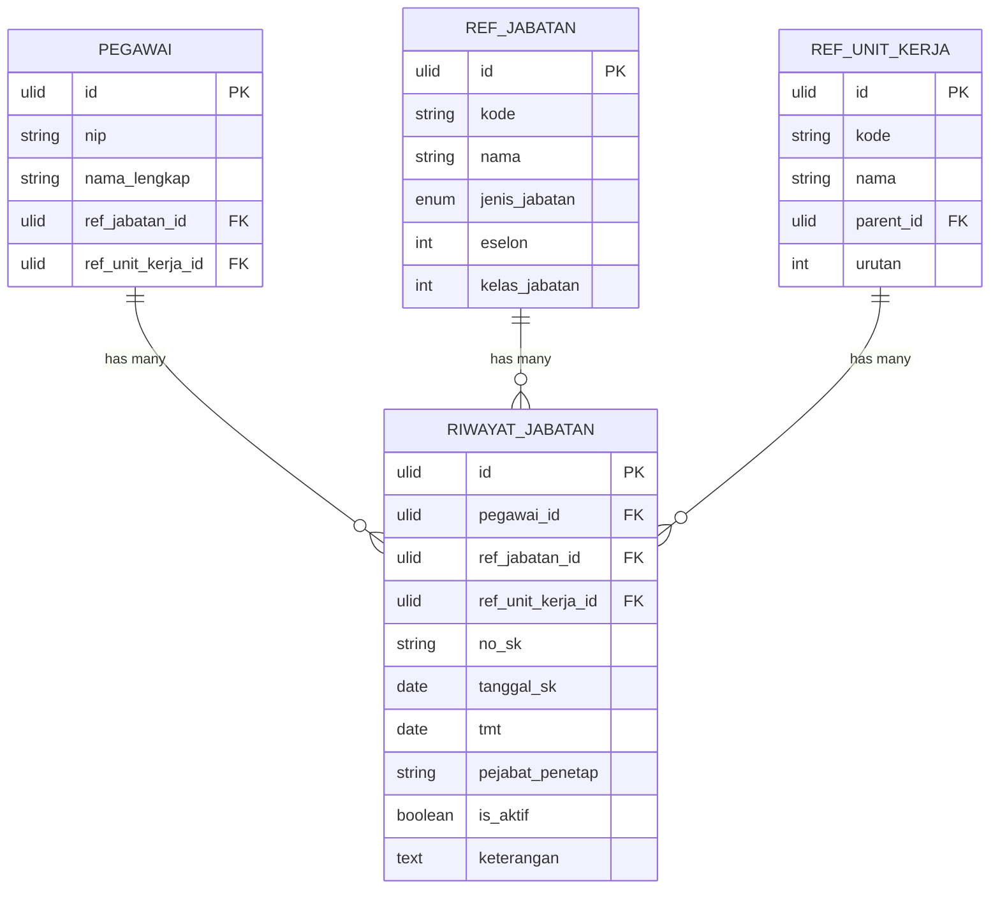

# Position Change Tracking (Riwayat Jabatan)

<cite>
**Referenced Files in This Document**
- [RiwayatJabatanController.php](file://app/Http/Controllers/Kepegawaian/RiwayatJabatanController.php)
- [RiwayatJabatanService.php](file://app/Services/RiwayatJabatanService.php)
- [RiwayatJabatan.php](file://app/Models/RiwayatJabatan.php)
- [Pegawai.php](file://app/Models/Pegawai.php)
- [RefJabatan.php](file://app/Models/RefJabatan.php)
- [RefUnitKerja.php](file://app/Models/RefUnitKerja.php)
- [JenisJabatan.php](file://app/Enums/JenisJabatan.php)
- [StoreRiwayatJabatanRequest.php](file://app/Http/Requests/Kepegawaian/StoreRiwayatJabatanRequest.php)
- [UpdateRiwayatJabatanRequest.php](file://app/Http/Requests/Kepegawaian/UpdateRiwayatJabatanRequest.php)
- [2026_03_15_030540_create_riwayat_jabatan_table.php](file://database/migrations/2026_03_15_030540_create_riwayat_jabatan_table.php)
- [riwayat-jabatan.tsx](file://resources/js/pages/kepegawaian/pegawai/riwayat-jabatan.tsx)
- [riwayat-jabatan-tab.tsx](file://resources/js/components/pegawai-tabs/riwayat-jabatan-tab.tsx)
- [RiwayatJabatanTest.php](file://tests/Feature/Kepegawaian/RiwayatJabatanTest.php)
- [RiwayatJabatanFactory.php](file://database/factories/RiwayatJabatanFactory.php)
</cite>

## Table of Contents
1. [Introduction](#introduction)
2. [Project Structure](#project-structure)
3. [Core Components](#core-components)
4. [Architecture Overview](#architecture-overview)
5. [Detailed Component Analysis](#detailed-component-analysis)
6. [Dependency Analysis](#dependency-analysis)
7. [Performance Considerations](#performance-considerations)
8. [Troubleshooting Guide](#troubleshooting-guide)
9. [Conclusion](#conclusion)
10. [Appendices](#appendices)

## Introduction
This document explains the Position Change Tracking system (Riwayat Jabatan) that records and manages employee position transitions within the organizational hierarchy. It focuses on the implementation of RiwayatJabatanController, including position assignment logic, unit transfer procedures, and leadership role management. It documents validation rules for position types (JenisJabatan), unit assignments (RefUnitKerja), and the hierarchical synchronization workflow. Practical examples illustrate position change timelines, organizational chart updates, and reporting relationships. It also covers the relationship between position categories (fungsional, struktural, pelaksana) and their impact on career progression, along with scenarios such as temporary assignments, acting positions, and position reclassification. Guidance is provided for frontend component design to visualize position history and organizational structure mapping.

## Project Structure
The Position Change Tracking system spans backend controllers, services, models, requests, migrations, and frontend pages/components. The controller orchestrates data retrieval and persistence, the service encapsulates transactional logic and synchronization, the models define relations and casts, the requests enforce validation, and the frontend renders the UI with Inertia.js.

**Diagram sources**
- [RiwayatJabatanController.php:18-105](file://app/Http/Controllers/Kepegawaian/RiwayatJabatanController.php#L18-L105)
- [RiwayatJabatanService.php:9-49](file://app/Services/RiwayatJabatanService.php#L9-L49)
- [RiwayatJabatan.php:11-58](file://app/Models/RiwayatJabatan.php#L11-L58)
- [Pegawai.php:24-137](file://app/Models/Pegawai.php#L24-L137)
- [RefJabatan.php:11-34](file://app/Models/RefJabatan.php#L11-L34)
- [RefUnitKerja.php:12-48](file://app/Models/RefUnitKerja.php#L12-L48)
- [JenisJabatan.php:5-19](file://app/Enums/JenisJabatan.php#L5-L19)
- [StoreRiwayatJabatanRequest.php:7-47](file://app/Http/Requests/Kepegawaian/StoreRiwayatJabatanRequest.php#L7-L47)
- [UpdateRiwayatJabatanRequest.php:7-47](file://app/Http/Requests/Kepegawaian/UpdateRiwayatJabatanRequest.php#L7-L47)
- [2026_03_15_030540_create_riwayat_jabatan_table.php:14-27](file://database/migrations/2026_03_15_030540_create_riwayat_jabatan_table.php#L14-L27)
- [riwayat-jabatan.tsx:102-505](file://resources/js/pages/kepegawaian/pegawai/riwayat-jabatan.tsx#L102-L505)
- [riwayat-jabatan-tab.tsx:8-54](file://resources/js/components/pegawai-tabs/riwayat-jabatan-tab.tsx#L8-L54)

**Section sources**
- [RiwayatJabatanController.php:18-105](file://app/Http/Controllers/Kepegawaian/RiwayatJabatanController.php#L18-L105)
- [RiwayatJabatanService.php:9-49](file://app/Services/RiwayatJabatanService.php#L9-L49)
- [RiwayatJabatan.php:11-58](file://app/Models/RiwayatJabatan.php#L11-L58)
- [Pegawai.php:24-137](file://app/Models/Pegawai.php#L24-L137)
- [RefJabatan.php:11-34](file://app/Models/RefJabatan.php#L11-L34)
- [RefUnitKerja.php:12-48](file://app/Models/RefUnitKerja.php#L12-L48)
- [JenisJabatan.php:5-19](file://app/Enums/JenisJabatan.php#L5-L19)
- [StoreRiwayatJabatanRequest.php:7-47](file://app/Http/Requests/Kepegawaian/StoreRiwayatJabatanRequest.php#L7-L47)
- [UpdateRiwayatJabatanRequest.php:7-47](file://app/Http/Requests/Kepegawaian/UpdateRiwayatJabatanRequest.php#L7-L47)
- [2026_03_15_030540_create_riwayat_jabatan_table.php:14-27](file://database/migrations/2026_03_15_030540_create_riwayat_jabatan_table.php#L14-L27)
- [riwayat-jabatan.tsx:102-505](file://resources/js/pages/kepegawaian/pegawai/riwayat-jabatan.tsx#L102-L505)
- [riwayat-jabatan-tab.tsx:8-54](file://resources/js/components/pegawai-tabs/riwayat-jabatan-tab.tsx#L8-L54)

## Core Components
- RiwayatJabatanController: Handles index, store, update, and destroy actions for position history. It authorizes access, loads related data, and prepares references for the frontend.
- RiwayatJabatanService: Encapsulates transactional creation and updates, and synchronizes active position assignments to the Pegawai record.
- RiwayatJabatan Model: Represents a single position assignment with foreign keys to Pegawai, RefJabatan, and RefUnitKerja, and supports soft deletes.
- Pegawai Model: Holds current position and unit assignments and defines relations to RiwayatJabatan.
- RefJabatan Model: Stores position definitions including the position category (JenisJabatan).
- RefUnitKerja Model: Stores organizational units with hierarchical parent-child relationships.
- Request Validators: Enforce validation rules for creating and updating position history entries.
- Frontend Pages/Components: Render the position history UI, support CRUD operations, and display current assignments.

**Section sources**
- [RiwayatJabatanController.php:18-105](file://app/Http/Controllers/Kepegawaian/RiwayatJabatanController.php#L18-L105)
- [RiwayatJabatanService.php:9-49](file://app/Services/RiwayatJabatanService.php#L9-L49)
- [RiwayatJabatan.php:11-58](file://app/Models/RiwayatJabatan.php#L11-L58)
- [Pegawai.php:24-137](file://app/Models/Pegawai.php#L24-L137)
- [RefJabatan.php:11-34](file://app/Models/RefJabatan.php#L11-L34)
- [RefUnitKerja.php:12-48](file://app/Models/RefUnitKerja.php#L12-L48)
- [StoreRiwayatJabatanRequest.php:7-47](file://app/Http/Requests/Kepegawaian/StoreRiwayatJabatanRequest.php#L7-L47)
- [UpdateRiwayatJabatanRequest.php:7-47](file://app/Http/Requests/Kepegawaian/UpdateRiwayatJabatanRequest.php#L7-L47)
- [riwayat-jabatan.tsx:102-505](file://resources/js/pages/kepegawaian/pegawai/riwayat-jabatan.tsx#L102-L505)
- [riwayat-jabaten-tab.tsx:8-54](file://resources/js/components/pegawai-tabs/riwayat-jabatan-tab.tsx#L8-L54)

## Architecture Overview
The system follows a layered architecture:
- Presentation Layer: Inertia.js pages and React components render the UI and submit forms.
- Application Layer: Controllers coordinate requests, apply authorization, and delegate persistence to services.
- Domain Layer: Services encapsulate business logic for creating/updating position history and synchronizing active assignments.
- Persistence Layer: Models define relations and casts; migrations define schema and constraints.

**Diagram sources**
- [RiwayatJabatanController.php:76-93](file://app/Http/Controllers/Kepegawaian/RiwayatJabatanController.php#L76-L93)
- [RiwayatJabatanService.php:11-48](file://app/Services/RiwayatJabatanService.php#L11-L48)
- [RiwayatJabatan.php:17-27](file://app/Models/RiwayatJabatan.php#L17-L27)
- [Pegawai.php:74-82](file://app/Models/Pegawai.php#L74-L82)

## Detailed Component Analysis

### RiwayatJabatanController
Responsibilities:
- Index action loads a specific Pegawai, eager-loads related Jabatan and UnitKerja, and fetches ordered RiwayatJabatan with related references. It exposes URLs for editing/deleting entries and provides reference lists for dropdowns.
- Store action validates input via StoreRiwayatJabatanRequest, authorizes access, and delegates persistence to RiwayatJabatanService.
- Update action validates input via UpdateRiwayatJabatanRequest, ensures ownership, and delegates updates to the service.
- Destroy action authorizes access, verifies ownership, and deletes the record.

Key behaviors:
- Authorization gates ensure only authorized users can view or update a Pegawai’s records.
- Ordering prioritizes active assignments first, then latest TMT and SK date.
- References for positions and units are provided for UI population.

**Section sources**
- [RiwayatJabatanController.php:20-74](file://app/Http/Controllers/Kepegawaian/RiwayatJabatanController.php#L20-L74)
- [RiwayatJabatanController.php:76-93](file://app/Http/Controllers/Kepegawaian/RiwayatJabatanController.php#L76-L93)
- [RiwayatJabatanController.php:95-104](file://app/Http/Controllers/Kepegawaian/RiwayatJabatanController.php#L95-L104)

### RiwayatJabatanService
Responsibilities:
- Transactional creation and updates of RiwayatJabatan records.
- Active assignment synchronization: when a record is marked active, the service deactivates other active records for the same Pegawai and updates the Pegawai’s current position and unit assignments.

Important logic:
- syncRiwayatAktif updates all sibling records to is_aktif=false and sets the Pegawai’s ref_jabatan_id and ref_unit_kerja_id to the active record’s values.

**Section sources**
- [RiwayatJabatanService.php:11-48](file://app/Services/RiwayatJabatanService.php#L11-L48)

### RiwayatJabatan Model
Responsibilities:
- Defines fillable attributes for position history entries.
- Casts dates and booleans for accurate handling.
- Provides belongsTo relations to Pegawai, RefJabatan, and RefUnitKerja.
- Includes a scope for filtering active records.

Constraints:
- Foreign keys reference Pegawai, RefJabatan, and RefUnitKerja with optional deletion behavior.
- Soft deletes enable historical preservation.

**Section sources**
- [RiwayatJabatan.php:17-27](file://app/Models/RiwayatJabatan.php#L17-L27)
- [RiwayatJabatan.php:39-57](file://app/Models/RiwayatJabatan.php#L39-L57)
- [2026_03_15_030540_create_riwayat_jabatan_table.php:16-18](file://database/migrations/2026_03_15_030540_create_riwayat_jabatan_table.php#L16-L18)

### Pegawai Model
Responsibilities:
- Holds current position (ref_jabatan_id) and unit (ref_unit_kerja_id) assignments.
- Defines relations to RiwayatJabatan and other personal/employment records.
- The service writes to these fields when a RiwayatJabatan becomes active.

**Section sources**
- [Pegawai.php:74-82](file://app/Models/Pegawai.php#L74-L82)
- [RiwayatJabatanService.php:44-47](file://app/Services/RiwayatJabatanService.php#L44-L47)

### RefJabatan and JenisJabatan
Responsibilities:
- RefJabatan stores position definitions including jenis_jabatan (fungsional, struktural, pelaksana), eselon, and kelas_jabatan.
- JenisJabatan enum provides typed values and labels for position categories.

Impact on career progression:
- Different categories influence classification, hierarchy level (eselon), and job family alignment.
- Career advancement often depends on matching position category and grade to organizational needs.

**Section sources**
- [RefJabatan.php:18-32](file://app/Models/RefJabatan.php#L18-L32)
- [JenisJabatan.php:5-19](file://app/Enums/JenisJabatan.php#L5-L19)

### RefUnitKerja
Responsibilities:
- Stores organizational units with hierarchical parent-child relationships.
- Supports ordering via urutan and provides children() relation for tree traversal.

Unit transfer procedures:
- Changing a RiwayatJabatan’s ref_unit_kerja_id updates the associated unit assignment.
- When combined with marking a record active, the Pegawai’s current unit assignment is updated accordingly.

**Section sources**
- [RefUnitKerja.php:19-47](file://app/Models/RefUnitKerja.php#L19-L47)

### Validation Rules and Hierarchical Workflows
Validation rules enforced by form requests:
- ref_jabatan_id and ref_unit_kerja_id are optional but must be valid ULIDs and exist in their respective reference tables.
- no_sk, tanggal_sk, and tmt are required and must be strings/dates.
- is_aktif is required and must be boolean.
- Additional constraints ensure maximum lengths and textual formats.

Hierarchical approval workflows:
- The system does not implement explicit approval steps in the controller/service. Approval logic would typically be external to this module and could be integrated via middleware or policy checks. The existing authorization gates ensure only authorized users can perform updates.

**Section sources**
- [StoreRiwayatJabatanRequest.php:14-46](file://app/Http/Requests/Kepegawaian/StoreRiwayatJabatanRequest.php#L14-L46)
- [UpdateRiwayatJabatanRequest.php:14-46](file://app/Http/Requests/Kepegawaian/UpdateRiwayatJabatanRequest.php#L14-L46)

### Practical Examples

#### Position Change Timeline
- Scenario: An employee receives a new position effective 2025-03-01 with a dated SK.
- Outcome: A new RiwayatJabatan record is created with is_aktif=true, triggering synchronization that deactivates prior active records and updates the Pegawai’s current position and unit.

**Section sources**
- [RiwayatJabatanTest.php:39-58](file://tests/Feature/Kepegawaian/RiwayatJabatanTest.php#L39-L58)
- [RiwayatJabatanTest.php:60-94](file://tests/Feature/Kepegawaian/RiwayatJabatanTest.php#L60-L94)

#### Organizational Chart Updates
- Scenario: Employee transfers from Unit A to Unit B.
- Outcome: A new RiwayatJabatan record assigns the employee to Unit B with is_aktif=true; the service updates the Pegawai’s current unit assignment.

**Section sources**
- [RiwayatJabatanService.php:37-48](file://app/Services/RiwayatJabatanService.php#L37-L48)
- [RefUnitKerja.php:39-47](file://app/Models/RefUnitKerja.php#L39-L47)

#### Reporting Relationships
- Scenario: A supervisor’s position changes from one unit to another.
- Outcome: The supervisor’s current unit assignment updates automatically when their active RiwayatJabatan is modified, ensuring reporting lines reflect the correct organizational unit.

**Section sources**
- [Pegawai.php:79-81](file://app/Models/Pegawai.php#L79-L81)
- [RiwayatJabatanService.php:44-47](file://app/Services/RiwayatJabatanService.php#L44-L47)

#### Temporary Assignments and Acting Positions
- Concept: Use is_aktif=false for temporary or acting assignments while maintaining historical records. Only one record should be active at a time; the service enforces this.
- Impact: Current position and unit assignments remain unchanged until an active record is designated.

**Section sources**
- [RiwayatJabatanService.php:37-48](file://app/Services/RiwayatJabatanService.php#L37-L48)
- [RiwayatJabatan.php:54-57](file://app/Models/RiwayatJabatan.php#L54-L57)

#### Position Reclassification
- Concept: Reclassify a position by changing ref_jabatan_id to a different RefJabatan entry while keeping is_aktif=true to update the current classification.
- Impact: The Pegawai’s current position category and grade update accordingly.

**Section sources**
- [RefJabatan.php:18-32](file://app/Models/RefJabatan.php#L18-L32)
- [RiwayatJabatanService.php:44-47](file://app/Services/RiwayatJabatanService.php#L44-L47)

### Frontend Component Design Guidance

#### Position History Visualization
- Use riwayat-jabatan.tsx to render a responsive table with columns for position, unit, SK number/date, TMT, and status.
- Provide actions to create, edit, and delete entries with confirmation dialogs.
- Display current position and unit prominently for quick reference.

**Section sources**
- [riwayat-jabatan.tsx:175-331](file://resources/js/pages/kepegawaian/pegawai/riwayat-jabatan.tsx#L175-L331)
- [riwayat-jabatan.tsx:333-502](file://resources/js/pages/kepegawaian/pegawai/riwayat-jabatan.tsx#L333-L502)

#### Organizational Structure Mapping
- Use riwayat-jabatan-tab.tsx to present a compact summary in the employee detail view.
- Link to the full history page for detailed management.
- Display badges for active/inactive status and include sorting by TMT and SK date.

**Section sources**
- [riwayat-jabatan-tab.tsx:8-54](file://resources/js/components/pegawai-tabs/riwayat-jabatan-tab.tsx#L8-L54)

## Dependency Analysis
The following diagram shows key dependencies among components:

**Diagram sources**
- [RiwayatJabatanController.php:18-105](file://app/Http/Controllers/Kepegawaian/RiwayatJabatanController.php#L18-L105)
- [RiwayatJabatanService.php:9-49](file://app/Services/RiwayatJabatanService.php#L9-L49)
- [RiwayatJabatan.php:11-58](file://app/Models/RiwayatJabatan.php#L11-L58)
- [Pegawai.php:24-137](file://app/Models/Pegawai.php#L24-L137)
- [RefJabatan.php:11-34](file://app/Models/RefJabatan.php#L11-L34)
- [RefUnitKerja.php:12-48](file://app/Models/RefUnitKerja.php#L12-L48)

**Section sources**
- [RiwayatJabatanController.php:18-105](file://app/Http/Controllers/Kepegawaian/RiwayatJabatanController.php#L18-L105)
- [RiwayatJabatanService.php:9-49](file://app/Services/RiwayatJabatanService.php#L9-L49)
- [RiwayatJabatan.php:11-58](file://app/Models/RiwayatJabatan.php#L11-L58)
- [Pegawai.php:24-137](file://app/Models/Pegawai.php#L24-L137)
- [RefJabatan.php:11-34](file://app/Models/RefJabatan.php#L11-L34)
- [RefUnitKerja.php:12-48](file://app/Models/RefUnitKerja.php#L12-L48)

## Performance Considerations
- Use eager loading in the index action to minimize N+1 queries when loading related Jabatan and UnitKerja.
- Keep the active assignment synchronization within a transaction to avoid partial state.
- Consider indexing foreign keys (pegawai_id, ref_jabatan_id, ref_unit_kerja_id) for improved query performance.
- Paginate long histories on the frontend if needed to reduce payload sizes.

## Troubleshooting Guide
Common issues and resolutions:
- Duplicate active records: Ensure only one RiwayatJabatan per Pegawai is active at a time; the service automatically deactivates others when a new record becomes active.
- Ownership errors: The controller verifies that the RiwayatJabatan belongs to the requested Pegawai; mismatch results in a 404 response.
- Validation failures: Review form request rules for required fields and formats; fix input accordingly.
- Soft-deleted records: Deletion marks records as deleted; use appropriate queries to restore if needed.

**Section sources**
- [RiwayatJabatanController.php:89-99](file://app/Http/Controllers/Kepegawaian/RiwayatJabatanController.php#L89-L99)
- [RiwayatJabatanService.php:37-48](file://app/Services/RiwayatJabatanService.php#L37-L48)
- [StoreRiwayatJabatanRequest.php:14-46](file://app/Http/Requests/Kepegawaian/StoreRiwayatJabatanRequest.php#L14-L46)
- [UpdateRiwayatJabatanRequest.php:14-46](file://app/Http/Requests/Kepegawaian/UpdateRiwayatJabatanRequest.php#L14-L46)
- [RiwayatJabatanTest.php:128-145](file://tests/Feature/Kepegawaian/RiwayatJabatanTest.php#L128-L145)

## Conclusion
The Position Change Tracking system provides a robust foundation for managing employee position transitions. The controller coordinates UI and persistence, the service enforces active assignment synchronization, and the models define clear relationships and constraints. Validation rules ensure data integrity, while the frontend offers intuitive controls for managing position histories. By leveraging the active assignment mechanism and hierarchical organization models, the system supports accurate organizational chart updates and career progression tracking.

## Appendices

### Database Schema Overview

**Diagram sources**
- [2026_03_15_030540_create_riwayat_jabatan_table.php:14-27](file://database/migrations/2026_03_15_030540_create_riwayat_jabatan_table.php#L14-L27)
- [Pegawai.php:30-39](file://app/Models/Pegawai.php#L30-L39)
- [RefJabatan.php:18-24](file://app/Models/RefJabatan.php#L18-L24)
- [RefUnitKerja.php:19-24](file://app/Models/RefUnitKerja.php#L19-L24)

### Example Test Cases
- Creating an active position history updates current assignments.
- Creating a second active record deactivates the first and updates current assignments.
- Updating a record to active deactivates the previous active record and updates current assignments.
- Deleting a record soft-deletes it while preserving history.

**Section sources**
- [RiwayatJabatanTest.php:39-58](file://tests/Feature/Kepegawaian/RiwayatJabatanTest.php#L39-L58)
- [RiwayatJabatanTest.php:60-94](file://tests/Feature/Kepegawaian/RiwayatJabatanTest.php#L60-L94)
- [RiwayatJabatanTest.php:96-126](file://tests/Feature/Kepegawaian/RiwayatJabatanTest.php#L96-L126)
- [RiwayatJabatanTest.php:128-145](file://tests/Feature/Kepegawaian/RiwayatJabatanTest.php#L128-L145)