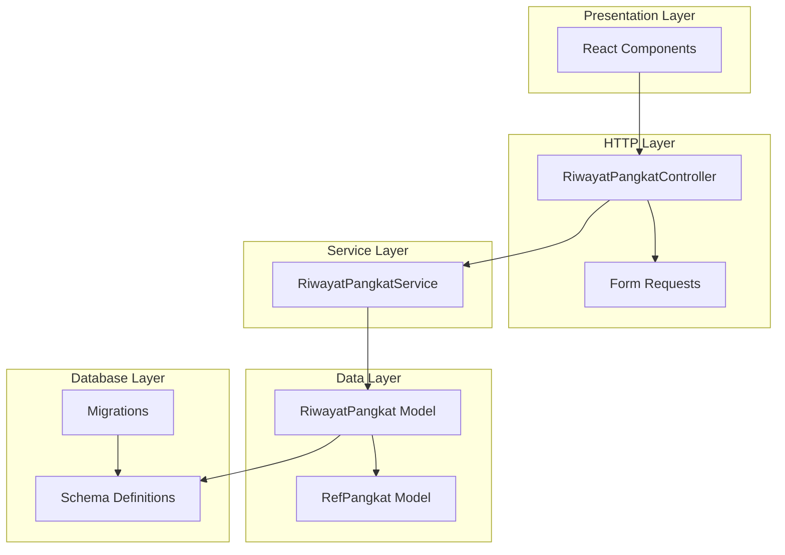
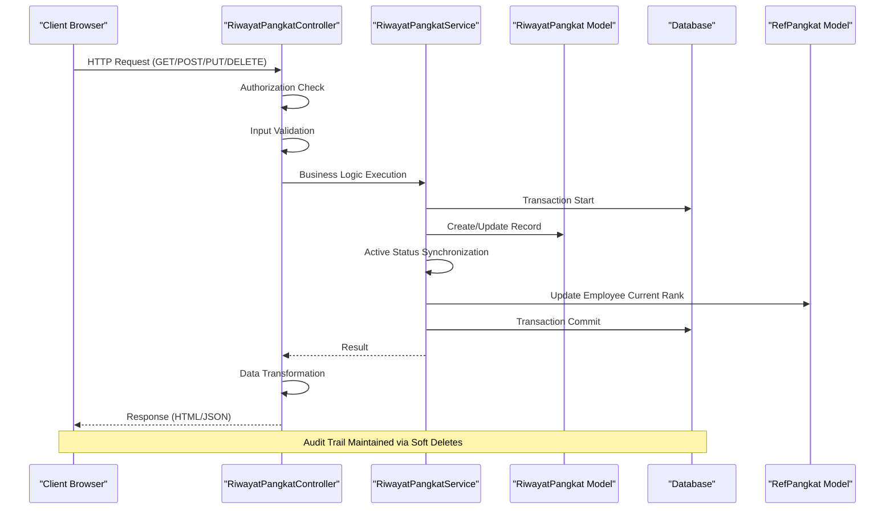
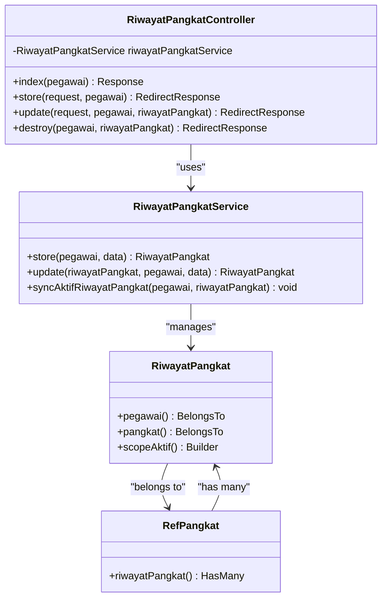
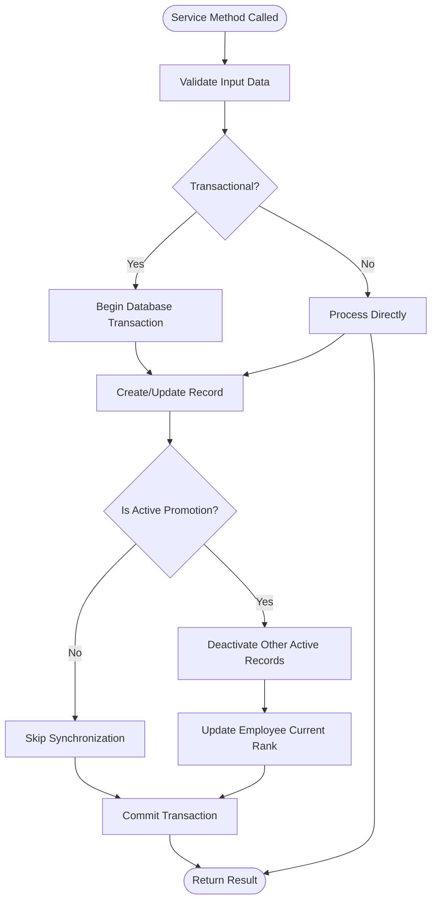
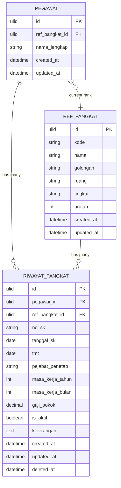
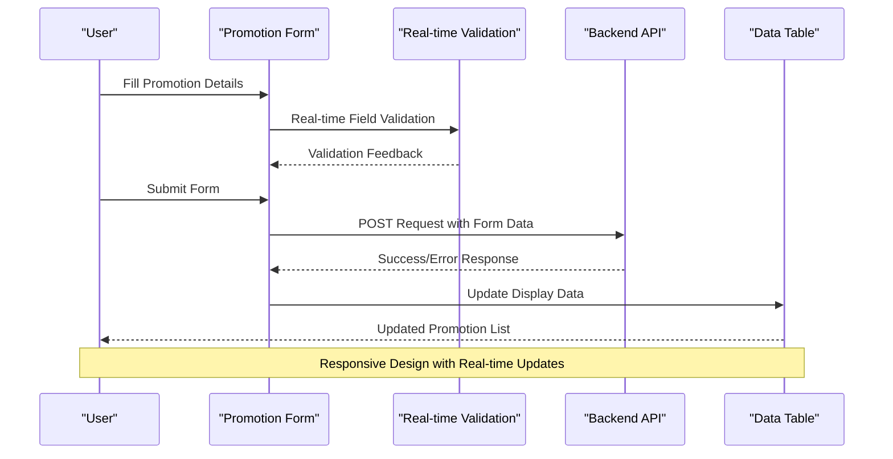
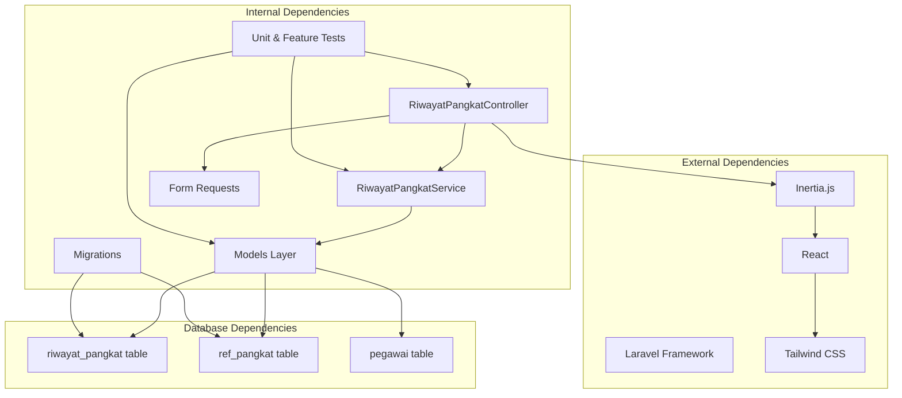

# Rank Advancement Management (Riwayat Pangkat)

<cite>
**Referenced Files in This Document**
- [RiwayatPangkatController.php](file://app/Http/Controllers/Kepegawaian/RiwayatPangkatController.php)
- [RiwayatPangkatService.php](file://app/Services/RiwayatPangkatService.php)
- [RiwayatPangkat.php](file://app/Models/RiwayatPangkat.php)
- [RefPangkat.php](file://app/Models/RefPangkat.php)
- [StoreRiwayatPangkatRequest.php](file://app/Http/Requests/Kepegawaian/StoreRiwayatPangkatRequest.php)
- [UpdateRiwayatPangkatRequest.php](file://app/Http/Requests/Kepegawaian/UpdateRiwayatPangkatRequest.php)
- [riwayat-pangkat.tsx](file://resources/js/pages/kepegawaian/pegawai/riwayat-pangkat.tsx)
- [2026_03_15_031012_create_riwayat_pangkat_table.php](file://database/migrations/2026_03_15_031012_create_riwayat_pangkat_table.php)
- [2026_03_15_022210_create_ref_pangkats_table.php](file://database/migrations/2026_03_15_022210_create_ref_pangkats_table.php)
- [web.php](file://routes/web.php)
- [RiwayatPangkatTest.php](file://tests/Feature/Kepegawaian/RiwayatPangkatTest.php)
- [RiwayatPangkatServiceTest.php](file://tests/Unit/Services/RiwayatPangkatServiceTest.php)
- [KenaikanPangkatMonitoringService.php](file://app/Services/KenaikanPangkatMonitoringService.php)
</cite>

## Table of Contents
1. [Introduction](#introduction)
2. [Project Structure](#project-structure)
3. [Core Components](#core-components)
4. [Architecture Overview](#architecture-overview)
5. [Detailed Component Analysis](#detailed-component-analysis)
6. [Dependency Analysis](#dependency-analysis)
7. [Performance Considerations](#performance-considerations)
8. [Troubleshooting Guide](#troubleshooting-guide)
9. [Conclusion](#conclusion)

## Introduction
This document provides comprehensive technical documentation for the Rank Advancement Management system, focusing on the Riwayat Pangkat (rank advancement) module. It explains the complete implementation of the RiwayatPangkatController, including CRUD operations, validation rules, and service layer integration. It also documents the masa kerja (service years) calculation algorithms, tmt (date of assumption) validation, and gaji pokok (basic salary) management. Practical examples demonstrate promotion timeline tracking, seniority calculations, and rank progression validation. The document covers the relationship between RefPangkat reference data and actual promotion records, common scenarios like multiple promotions, retroactive adjustments, and promotion eligibility criteria. Guidance is included for frontend form handling, data visualization, and audit trail maintenance.

## Project Structure
The Riwayat Pangkat module follows a layered architecture with clear separation of concerns:
- HTTP Layer: Controllers handle incoming requests and coordinate responses
- Service Layer: Business logic encapsulated in dedicated services
- Data Layer: Eloquent models with relationships and validation
- Presentation Layer: React components with Inertia.js for frontend interactions
- Validation Layer: Form Request classes for input validation
- Database Layer: Migrations defining schema and constraints

**Diagram sources**
- [RiwayatPangkatController.php:17-118](file://app/Http/Controllers/Kepegawaian/RiwayatPangkatController.php#L17-L118)
- [RiwayatPangkatService.php:9-55](file://app/Services/RiwayatPangkatService.php#L9-L55)
- [RiwayatPangkat.php:11-59](file://app/Models/RiwayatPangkat.php#L11-L59)
- [RefPangkat.php:10-34](file://app/Models/RefPangkat.php#L10-L34)

**Section sources**
- [RiwayatPangkatController.php:17-118](file://app/Http/Controllers/Kepegawaian/RiwayatPangkatController.php#L17-L118)
- [web.php:65-104](file://routes/web.php#L65-L104)

## Core Components
The Riwayat Pangkat system consists of several interconnected components working together to manage civil servant rank promotions:

### Controller Layer
The RiwayatPangkatController serves as the primary entry point, implementing standard CRUD operations with authorization and data transformation:
- Index action: Lists promotion records with active status prioritization
- Store action: Creates new promotion records with transactional safety
- Update action: Modifies existing records with validation
- Destroy action: Soft deletes promotion records

### Service Layer
The RiwayatPangkatService encapsulates business logic with transactional guarantees:
- Transactional operations for data consistency
- Active record synchronization logic
- Automatic promotion status management

### Model Layer
The RiwayatPangkat model defines the core data structure with comprehensive relationships:
- Belongs to Pegawai (employee)
- Belongs to RefPangkat (rank reference)
- Soft delete support for audit trails
- Active status scoping

### Frontend Integration
The React component provides a comprehensive interface for managing promotion records with real-time validation and responsive design.

**Section sources**
- [RiwayatPangkatController.php:17-118](file://app/Http/Controllers/Kepegawaian/RiwayatPangkatController.php#L17-L118)
- [RiwayatPangkatService.php:9-55](file://app/Services/RiwayatPangkatService.php#L9-L55)
- [RiwayatPangkat.php:11-59](file://app/Models/RiwayatPangkat.php#L11-L59)

## Architecture Overview
The Riwayat Pangkat system implements a clean architecture with clear boundaries between layers:

**Diagram sources**
- [RiwayatPangkatController.php:87-116](file://app/Http/Controllers/Kepegawaian/RiwayatPangkatController.php#L87-L116)
- [RiwayatPangkatService.php:11-53](file://app/Services/RiwayatPangkatService.php#L11-L53)
- [RiwayatPangkat.php:44-52](file://app/Models/RiwayatPangkat.php#L44-L52)

The architecture ensures:
- **Transaction Safety**: All database operations are wrapped in transactions
- **Active Status Consistency**: Only one active promotion record per employee
- **Audit Trail**: Soft deletes preserve historical data
- **Authorization**: Role-based access control at controller level

## Detailed Component Analysis

### RiwayatPangkatController Implementation
The controller implements comprehensive CRUD operations with robust authorization and data transformation:

**Diagram sources**
- [RiwayatPangkatController.php:17-118](file://app/Http/Controllers/Kepegawaian/RiwayatPangkatController.php#L17-L118)
- [RiwayatPangkatService.php:9-55](file://app/Services/RiwayatPangkatService.php#L9-L55)
- [RiwayatPangkat.php:11-59](file://app/Models/RiwayatPangkat.php#L11-L59)
- [RefPangkat.php:10-34](file://app/Models/RefPangkat.php#L10-L34)

#### CRUD Operations Analysis
The controller implements four primary operations with specific behaviors:

**Index Operation**: Retrieves and transforms promotion data with prioritization logic
- Loads employee with current rank information
- Queries promotion records ordered by active status, date, and creation time
- Transforms data for frontend consumption with URL generation for actions

**Store Operation**: Creates new promotion records with validation
- Validates input through Form Request classes
- Creates record with transactional safety
- Synchronizes active status automatically

**Update Operation**: Modifies existing records
- Validates authorization and ownership
- Updates record with transactional safety
- Synchronizes active status if changed

**Destroy Operation**: Handles soft deletion
- Validates authorization and ownership
- Performs soft delete maintaining audit trail

#### Validation Rules Implementation
The system implements comprehensive validation through Form Request classes:

**Store Validation Rules**:
- Required fields: no_sk, tanggal_sk, tmt
- Optional fields: pejabat_penetap, keterangan
- Service years: masa_kerja_tahun (integer, min 0), masa_kerja_bulan (integer, 0-11)
- Salary: gaji_pokok (numeric, min 0)
- Status: is_aktif (boolean)
- Rank reference: ref_pangkat_id (exists in ref_pangkat table)

**Update Validation Rules**: Mirror store rules with authorization check

**Section sources**
- [RiwayatPangkatController.php:21-116](file://app/Http/Controllers/Kepegawaian/RiwayatPangkatController.php#L21-L116)
- [StoreRiwayatPangkatRequest.php:15-50](file://app/Http/Requests/Kepegawaian/StoreRiwayatPangkatRequest.php#L15-L50)
- [UpdateRiwayatPangkatRequest.php:19-54](file://app/Http/Requests/Kepegawaian/UpdateRiwayatPangkatRequest.php#L19-L54)

### Service Layer Integration
The RiwayatPangkatService provides transactional business logic with automatic status synchronization:

**Diagram sources**
- [RiwayatPangkatService.php:11-53](file://app/Services/RiwayatPangkatService.php#L11-L53)

#### Active Status Synchronization Logic
The service implements critical business logic for maintaining single active promotion per employee:

**Automatic Deactivation**: When a new promotion record is marked as active, all other active records for the same employee are automatically deactivated.

**Employee Rank Update**: The employee's current rank (ref_pangkat_id) is updated to match the newly activated promotion.

**Transaction Safety**: All synchronization operations occur within database transactions to ensure atomicity.

**Section sources**
- [RiwayatPangkatService.php:39-53](file://app/Services/RiwayatPangkatService.php#L39-L53)

### Data Model Relationships
The system implements comprehensive data modeling with clear relationships:

**Diagram sources**
- [RiwayatPangkat.php:17-52](file://app/Models/RiwayatPangkat.php#L17-L52)
- [RefPangkat.php:17-31](file://app/Models/RefPangkat.php#L17-L31)
- [2026_03_15_031012_create_riwayat_pangkat_table.php:14-29](file://database/migrations/2026_03_15_031012_create_riwayat_pangkat_table.php#L14-L29)
- [2026_03_15_022210_create_ref_pangkats_table.php:14-24](file://database/migrations/2026_03_15_022210_create_ref_pangkats_table.php#L14-L24)

#### Masa Kerja Calculation Algorithms
The system implements precise masa kerja (service years) calculation through structured data entry:

**Input Structure**: 
- masa_kerja_tahun: Integer value representing completed years
- masa_kerja_bulan: Integer value (0-11) representing additional months

**Validation Logic**:
- Year validation: Minimum 0, no upper limit
- Month validation: Strict range 0-11 (enforced by database constraint)
- Summation: Total service years = years + (months/12)

**Display Logic**: Frontend presents formatted service years combining years and months for user-friendly display.

#### TMT (Date of Assumption) Validation
The system implements comprehensive TMT validation ensuring temporal consistency:

**Required Field**: TMT must be provided for all promotion records
**Date Validation**: Ensures valid date format and logical consistency
**Temporal Ordering**: Prevents future assumptions and maintains chronological order
**Integration**: Works with monitoring services for promotion eligibility calculations

#### Gaji Pokok Management
The system manages basic salary data with precision:

**Data Type**: Decimal with 12 digits and 2 decimal places for currency accuracy
**Validation**: Non-negative values with appropriate precision
**Display**: Formatted currency display in frontend components
**Audit Trail**: Historical salary changes maintained through versioning

**Section sources**
- [RiwayatPangkat.php:31-42](file://app/Models/RiwayatPangkat.php#L31-L42)
- [2026_03_15_031012_create_riwayat_pangkat_table.php:22-25](file://database/migrations/2026_03_15_031012_create_riwayat_pangkat_table.php#L22-L25)

### Frontend Implementation
The React component provides comprehensive user interface with sophisticated form handling:

**Diagram sources**
- [riwayat-pangkat.tsx:161-174](file://resources/js/pages/kepegawaian/pegawai/riwayat-pangkat.tsx#L161-L174)

#### Form Handling Features
The frontend implements sophisticated form handling:
- Real-time validation feedback
- Automatic data transformation for API compatibility
- Responsive dialog-based form interface
- Comprehensive error handling and user guidance

#### Data Visualization
The system provides rich data visualization:
- Structured table display with sorting capabilities
- Status indicators with color-coded badges
- Interactive action buttons for record management
- Responsive design for various screen sizes

**Section sources**
- [riwayat-pangkat.tsx:113-525](file://resources/js/pages/kepegawaian/pegawai/riwayat-pangkat.tsx#L113-L525)

## Dependency Analysis

**Diagram sources**
- [RiwayatPangkatController.php:5-15](file://app/Http/Controllers/Kepegawaian/RiwayatPangkatController.php#L5-L15)
- [RiwayatPangkatService.php:5-7](file://app/Services/RiwayatPangkatService.php#L5-L7)
- [2026_03_15_031012_create_riwayat_pangkat_table.php:14-29](file://database/migrations/2026_03_15_031012_create_riwayat_pangkat_table.php#L14-L29)

### Component Coupling Analysis
The system demonstrates low coupling and high cohesion:
- **Controller-Service Coupling**: Loose coupling through dependency injection
- **Service-Model Coupling**: Clean separation with explicit interfaces
- **Frontend-Backend Coupling**: Well-defined API contracts via Inertia.js
- **Database Coupling**: Clear foreign key relationships with proper constraints

### Circular Dependencies
The system avoids circular dependencies through:
- Clear directional data flow (Frontend → Controller → Service → Model)
- Explicit dependency declarations
- Separation of concerns at architectural boundaries

**Section sources**
- [web.php:65-104](file://routes/web.php#L65-L104)
- [RiwayatPangkatController.php:19](file://app/Http/Controllers/Kepegawaian/RiwayatPangkatController.php#L19)

## Performance Considerations
The Riwayat Pangkat system implements several performance optimization strategies:

### Database Optimization
- **Indexing Strategy**: Proper indexing on frequently queried columns (pegawai_id, ref_pangkat_id, is_aktif, tmt)
- **Query Optimization**: Efficient eager loading of relationships to prevent N+1 queries
- **Soft Delete Efficiency**: Minimal overhead through soft delete implementation
- **Transaction Management**: Batch operations within transactions for data consistency

### Frontend Performance
- **Lazy Loading**: Component-based architecture with efficient rendering
- **State Management**: Optimized state updates to minimize re-renders
- **Responsive Design**: Mobile-first approach reducing layout thrashing
- **Caching Strategy**: Strategic caching of reference data (RefPangkat options)

### Scalability Considerations
- **Horizontal Scaling**: Stateless controllers supporting load balancing
- **Database Scaling**: Proper indexing and query patterns supporting growth
- **API Design**: RESTful endpoints designed for scalability
- **Monitoring Ready**: Built-in audit trail supporting operational monitoring

## Troubleshooting Guide

### Common Issues and Solutions

**Issue**: Multiple active promotions for single employee
**Solution**: The system automatically deactivates older active records when new ones are marked as active. Check the syncAktifRiwayatPangkat method for implementation details.

**Issue**: Promotion record not appearing in employee's current rank
**Solution**: Verify that the is_aktif flag is properly set and that the employee's ref_pangkat_id is updated. Check the synchronization logic in the service layer.

**Issue**: Validation errors on form submission
**Solution**: Review the Form Request validation rules and ensure all required fields meet the specified constraints. Check frontend validation feedback for specific error messages.

**Issue**: Audit trail inconsistencies
**Solution**: Soft deletes maintain historical data. Verify that deleted_at timestamps are properly recorded and that queries exclude soft-deleted records appropriately.

### Debugging Strategies
- **Database Level**: Use database queries to inspect record states and relationships
- **Service Level**: Add logging around transaction boundaries and synchronization logic
- **Controller Level**: Enable request/response logging for debugging
- **Frontend Level**: Use browser developer tools for network inspection and state debugging

**Section sources**
- [RiwayatPangkatService.php:39-53](file://app/Services/RiwayatPangkatService.php#L39-L53)
- [RiwayatPangkatTest.php:70-152](file://tests/Feature/Kepegawaian/RiwayatPangkatTest.php#L70-L152)

## Conclusion
The Rank Advancement Management system provides a comprehensive, robust solution for civil servant rank promotion management. The implementation demonstrates strong architectural principles with clear separation of concerns, comprehensive validation, and transactional safety. The system effectively handles complex business requirements including active status synchronization, audit trail maintenance, and temporal consistency. The frontend provides an intuitive user experience while maintaining data integrity through comprehensive validation and real-time feedback. The modular design supports future enhancements and maintains scalability for growing organizational needs.

The system successfully addresses key requirements:
- **Complete CRUD Operations**: Full lifecycle management of promotion records
- **Business Logic Integrity**: Automatic status synchronization and temporal consistency
- **Data Validation**: Comprehensive input validation with user-friendly error messages
- **Audit Trail**: Complete historical tracking through soft delete implementation
- **User Experience**: Intuitive interface with responsive design and real-time feedback
- **Performance**: Optimized queries and efficient data handling for scalability

This implementation serves as a solid foundation for advanced features such as promotion eligibility calculations, automated promotion scheduling, and comprehensive reporting capabilities.