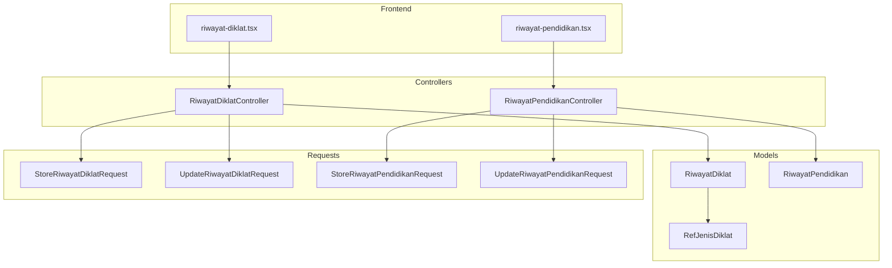
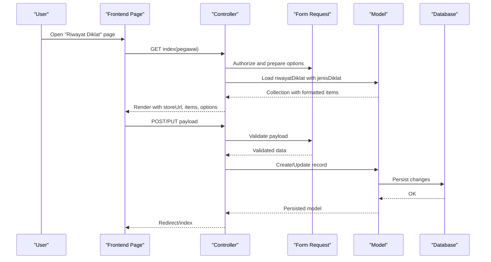
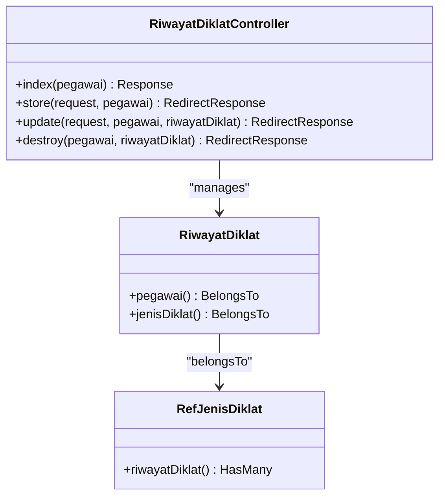
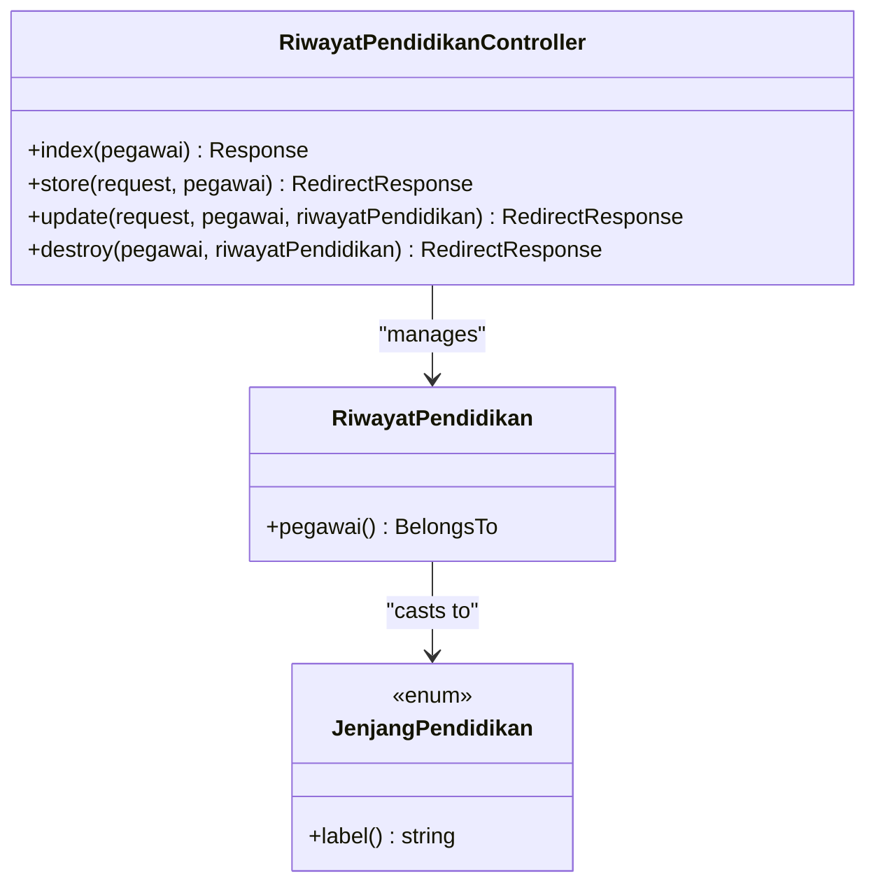
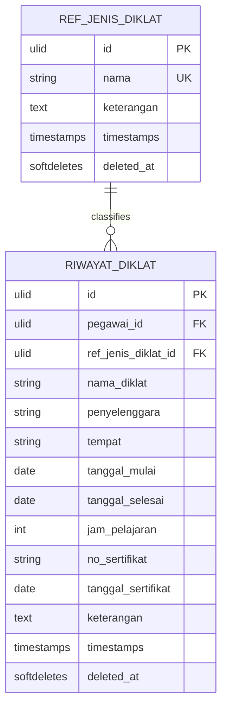
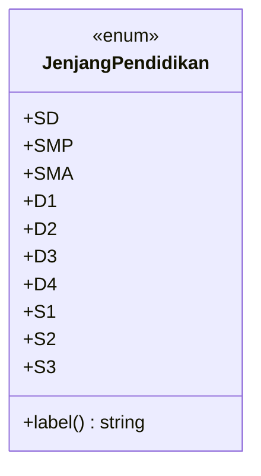
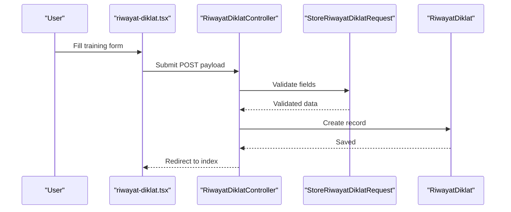
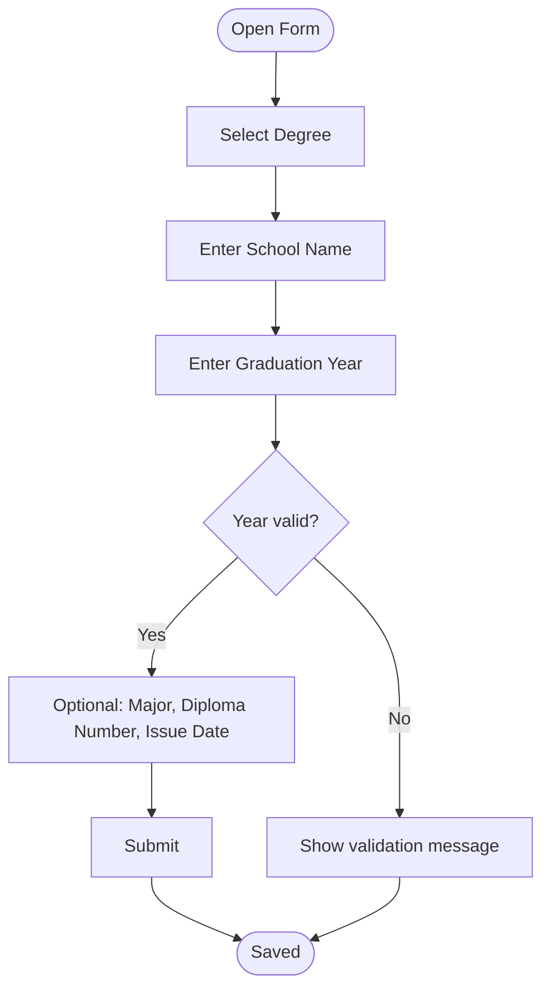
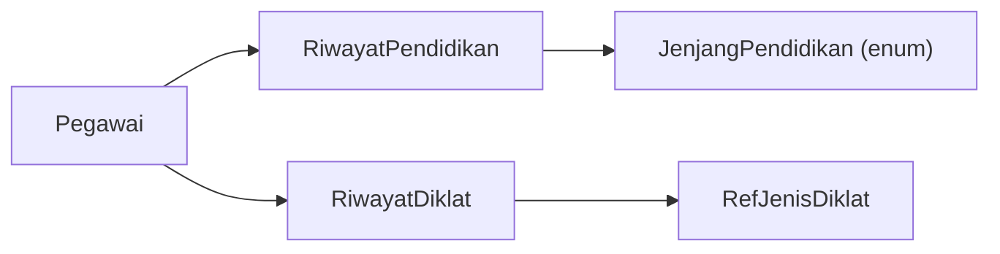
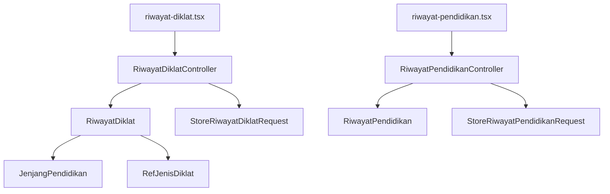

# Training and Education Records (Riwayat Diklat & Riwayat Pendidikan)

<cite>
**Referenced Files in This Document**
- [RiwayatDiklatController.php](file://app/Http/Controllers/Kepegawaian/RiwayatDiklatController.php)
- [RiwayatPendidikanController.php](file://app/Http/Controllers/Kepegawaian/RiwayatPendidikanController.php)
- [StoreRiwayatDiklatRequest.php](file://app/Http/Requests/Kepegawaian/StoreRiwayatDiklatRequest.php)
- [UpdateRiwayatDiklatRequest.php](file://app/Http/Requests/Kepegawaian/UpdateRiwayatDiklatRequest.php)
- [StoreRiwayatPendidikanRequest.php](file://app/Http/Requests/Kepegawaian/StoreRiwayatPendidikanRequest.php)
- [UpdateRiwayatPendidikanRequest.php](file://app/Http/Requests/Kepegawaian/UpdateRiwayatPendidikanRequest.php)
- [RiwayatDiklat.php](file://app/Models/RiwayatDiklat.php)
- [RiwayatPendidikan.php](file://app/Models/RiwayatPendidikan.php)
- [RefJenisDiklat.php](file://app/Models/RefJenisDiklat.php)
- [JenjangPendidikan.php](file://app/Enums/JenjangPendidikan.php)
- [riwayat-diklat.tsx](file://resources/js/pages/kepegawaian/pegawai/riwayat-diklat.tsx)
- [riwayat-pendidikan.tsx](file://resources/js/pages/kepegawaian/pegawai/riwayat-pendidikan.tsx)
- [2026_03_15_030821_create_riwayat_pendidikan_table.php](file://database/migrations/2026_03_15_030821_create_riwayat_pendidikan_table.php)
- [2026_03_15_030915_create_riwayat_diklat_table.php](file://database/migrations/2026_03_15_030915_create_riwayat_diklat_table.php)
- [2026_03_15_022210_create_ref_jenis_diklats_table.php](file://database/migrations/2026_03_15_022210_create_ref_jenis_diklats_table.php)
- [RefJenisDiklatSeeder.php](file://database/seeders/RefJenisDiklatSeeder.php)
</cite>

## Table of Contents
1. [Introduction](#introduction)
2. [Project Structure](#project-structure)
3. [Core Components](#core-components)
4. [Architecture Overview](#architecture-overview)
5. [Detailed Component Analysis](#detailed-component-analysis)
6. [Dependency Analysis](#dependency-analysis)
7. [Performance Considerations](#performance-considerations)
8. [Troubleshooting Guide](#troubleshooting-guide)
9. [Conclusion](#conclusion)
10. [Appendices](#appendices)

## Introduction
This document explains the Training and Education Records system for documenting professional development and educational qualifications. It focuses on:
- Implementation details of RiwayatDiklatController and RiwayatPendidikanController
- Course validation, institution verification, and credential recognition workflows
- RefJenisDiklat classification system and educational degree hierarchies
- Continuing education requirements and competency-based training
- Practical examples for training completion tracking, academic qualification validation, and professional certification management
- Relationship between formal education (pendidikan) and professional training (diklat)
- Guidance on frontend form design, document attachment handling, and academic calendar integration

## Project Structure
The system is organized around controllers, models, form requests, enums, frontend pages, and database migrations/seeders. The controllers expose Inertia-rendered pages for listing, creating, updating, and deleting records. Models define Eloquent relationships and attribute casting. Form requests enforce validation rules. Frontend pages provide interactive forms and tables.

**Diagram sources**
- [RiwayatDiklatController.php:16-91](file://app/Http/Controllers/Kepegawaian/RiwayatDiklatController.php#L16-L91)
- [RiwayatPendidikanController.php:16-92](file://app/Http/Controllers/Kepegawaian/RiwayatPendidikanController.php#L16-L92)
- [RiwayatDiklat.php:10-50](file://app/Models/RiwayatDiklat.php#L10-L50)
- [RiwayatPendidikan.php:11-41](file://app/Models/RiwayatPendidikan.php#L11-L41)
- [RefJenisDiklat.php:10-28](file://app/Models/RefJenisDiklat.php#L10-L28)
- [StoreRiwayatDiklatRequest.php:8-48](file://app/Http/Requests/Kepegawaian/StoreRiwayatDiklatRequest.php#L8-L48)
- [UpdateRiwayatDiklatRequest.php:1-5](file://app/Http/Requests/Kepegawaian/UpdateRiwayatDiklatRequest.php#L1-L5)
- [StoreRiwayatPendidikanRequest.php:10-52](file://app/Http/Requests/Kepegawaian/StoreRiwayatPendidikanRequest.php#L10-L52)
- [UpdateRiwayatPendidikanRequest.php:1-5](file://app/Http/Requests/Kepegawaian/UpdateRiwayatPendidikanRequest.php#L1-L5)
- [riwayat-diklat.tsx:103-497](file://resources/js/pages/kepegawaian/pegawai/riwayat-diklat.tsx#L103-L497)
- [riwayat-pendidikan.tsx:91-440](file://resources/js/pages/kepegawaian/pegawai/riwayat-pendidikan.tsx#L91-L440)

**Section sources**
- [RiwayatDiklatController.php:16-91](file://app/Http/Controllers/Kepegawaian/RiwayatDiklatController.php#L16-L91)
- [RiwayatPendidikanController.php:16-92](file://app/Http/Controllers/Kepegawaian/RiwayatPendidikanController.php#L16-L92)
- [riwayat-diklat.tsx:103-497](file://resources/js/pages/kepegawaian/pegawai/riwayat-diklat.tsx#L103-L497)
- [riwayat-pendidikan.tsx:91-440](file://resources/js/pages/kepegawaian/pegawai/riwayat-pendidikan.tsx#L91-L440)

## Core Components
- RiwayatDiklatController: Manages professional training records with classification via RefJenisDiklat, date range validation, and certificate metadata.
- RiwayatPendidikanController: Manages formal education records with degree hierarchy from JenjangPendidikan enum and year validation.
- Models: RiwayatDiklat and RiwayatPendidikan encapsulate attributes, casting, soft deletes, and belongs-to relationships.
- Requests: Strong validation rules for required fields, date ranges, numeric bounds, and enum constraints.
- Frontend Pages: Interactive dialogs and tables for CRUD operations with Inertia navigation.

Key implementation highlights:
- Authorization gates ensure only authorized users can view/update records.
- Soft deletes enable safe record archival.
- Enum casting ensures consistent degree representation.
- Foreign key constraints maintain referential integrity for classifications.

**Section sources**
- [RiwayatDiklatController.php:18-59](file://app/Http/Controllers/Kepegawaian/RiwayatDiklatController.php#L18-L59)
- [RiwayatPendidikanController.php:18-59](file://app/Http/Controllers/Kepegawaian/RiwayatPendidikanController.php#L18-L59)
- [RiwayatDiklat.php:16-39](file://app/Models/RiwayatDiklat.php#L16-L39)
- [RiwayatPendidikan.php:17-35](file://app/Models/RiwayatPendidikan.php#L17-L35)
- [StoreRiwayatDiklatRequest.php:20-34](file://app/Http/Requests/Kepegawaian/StoreRiwayatDiklatRequest.php#L20-L34)
- [StoreRiwayatPendidikanRequest.php:25-35](file://app/Http/Requests/Kepegawaian/StoreRiwayatPendidikanRequest.php#L25-L35)

## Architecture Overview
The system follows a layered MVC pattern with Inertia rendering:
- Controllers orchestrate authorization, request validation, model persistence, and response composition.
- Models define domain entities and relationships.
- Requests enforce validation rules and localized messages.
- Frontend pages render lists and modals, submitting via Inertia router methods.

**Diagram sources**
- [RiwayatDiklatController.php:18-68](file://app/Http/Controllers/Kepegawaian/RiwayatDiklatController.php#L18-L68)
- [StoreRiwayatDiklatRequest.php:20-34](file://app/Http/Requests/Kepegawaian/StoreRiwayatDiklatRequest.php#L20-L34)
- [RiwayatDiklat.php:41-49](file://app/Models/RiwayatDiklat.php#L41-L49)
- [riwayat-diklat.tsx:151-164](file://resources/js/pages/kepegawaian/pegawai/riwayat-diklat.tsx#L151-L164)

**Section sources**
- [RiwayatDiklatController.php:18-68](file://app/Http/Controllers/Kepegawaian/RiwayatDiklatController.php#L18-L68)
- [riwayat-diklat.tsx:151-164](file://resources/js/pages/kepegawaian/pegawai/riwayat-diklat.tsx#L151-L164)

## Detailed Component Analysis

### RiwayatDiklatController
Responsibilities:
- Index: Renders training records with associated classification, ordered by start date desc, and provides classification options.
- Store/Update/Delete: Apply authorization, validation, and persistence with redirects.

Validation and constraints:
- Required fields: diklat name, organizer, start/end dates.
- Date range: end date must be after or equal to start date.
- Optional fields: place, hours, certificate number/date, and notes.
- Classification: optional foreign key to RefJenisDiklat.

Authorization:
- Uses policy gates to authorize view/update actions per pegawai.

**Diagram sources**
- [RiwayatDiklatController.php:16-91](file://app/Http/Controllers/Kepegawaian/RiwayatDiklatController.php#L16-L91)
- [RiwayatDiklat.php:41-49](file://app/Models/RiwayatDiklat.php#L41-L49)
- [RefJenisDiklat.php:10-28](file://app/Models/RefJenisDiklat.php#L10-L28)

**Section sources**
- [RiwayatDiklatController.php:18-90](file://app/Http/Controllers/Kepegawaian/RiwayatDiklatController.php#L18-L90)
- [StoreRiwayatDiklatRequest.php:20-34](file://app/Http/Requests/Kepegawaian/StoreRiwayatDiklatRequest.php#L20-L34)

### RiwayatPendidikanController
Responsibilities:
- Index: Renders education records ordered by graduation year desc, then by diploma date and creation timestamp, and provides degree options from enum cases.
- Store/Update/Delete: Apply authorization, validation, and persistence.

Validation and constraints:
- Required fields: degree (enum), school name, graduation year (4-digit integer within allowed range), and optionally major, diploma number, diploma date, and notes.
- Degree enum: enforced via Rule::enum with JenjangPendidikan.

Authorization:
- Uses policy gates to authorize view/update actions per pegawai.

**Diagram sources**
- [RiwayatPendidikanController.php:16-92](file://app/Http/Controllers/Kepegawaian/RiwayatPendidikanController.php#L16-L92)
- [RiwayatPendidikan.php:28-34](file://app/Models/RiwayatPendidikan.php#L28-L34)
- [JenjangPendidikan.php:5-33](file://app/Enums/JenjangPendidikan.php#L5-L33)

**Section sources**
- [RiwayatPendidikanController.php:18-91](file://app/Http/Controllers/Kepegawaian/RiwayatPendidikanController.php#L18-L91)
- [StoreRiwayatPendidikanRequest.php:25-35](file://app/Http/Requests/Kepegawaian/StoreRiwayatPendidikanRequest.php#L25-L35)

### RefJenisDiklat Classification System
Purpose:
- Classifies training programs (e.g., pre-appointment, leadership levels, functional, technical) to support categorization and reporting.

Implementation:
- Reference table with unique name and optional description.
- RiwayatDiklat optionally references RefJenisDiklat via foreign key.

**Diagram sources**
- [2026_03_15_022210_create_ref_jenis_diklats_table.php:14-20](file://database/migrations/2026_03_15_022210_create_ref_jenis_diklats_table.php#L14-L20)
- [2026_03_15_030915_create_riwayat_diklat_table.php:14-29](file://database/migrations/2026_03_15_030915_create_riwayat_diklat_table.php#L14-L29)
- [RefJenisDiklatSeeder.php:15-26](file://database/seeders/RefJenisDiklatSeeder.php#L15-L26)

**Section sources**
- [RefJenisDiklat.php:17-20](file://app/Models/RefJenisDiklat.php#L17-L20)
- [RiwayatDiklat.php:46-49](file://app/Models/RiwayatDiklat.php#L46-L49)
- [RefJenisDiklatSeeder.php:15-26](file://database/seeders/RefJenisDiklatSeeder.php#L15-L26)

### Educational Degree Hierarchies
Degree levels:
- Enumerated values represent primary to doctorate levels (SD, SMP, SMA, D1–D4, S1–S3).

Presentation:
- Labels are derived from enum method for UI display.

**Diagram sources**
- [JenjangPendidikan.php:5-33](file://app/Enums/JenjangPendidikan.php#L5-L33)

**Section sources**
- [JenjangPendidikan.php:7-32](file://app/Enums/JenjangPendidikan.php#L7-L32)
- [StoreRiwayatPendidikanRequest.php:28](file://app/Http/Requests/Kepegawaian/StoreRiwayatPendidikanRequest.php#L28)

### Continuing Education Requirements
- Hours tracking: optional integer field for total learning hours supports CEU/credit tracking.
- Certificate metadata: optional certificate number and issue date enable verification workflows.
- Date range validation: ensures logical progression of training periods.

**Section sources**
- [RiwayatDiklat.php:33-36](file://app/Models/RiwayatDiklat.php#L33-L36)
- [StoreRiwayatDiklatRequest.php:29-31](file://app/Http/Requests/Kepegawaian/StoreRiwayatDiklatRequest.php#L29-L31)

### Competency-Based Training Programs
- Classification via RefJenisDiklat allows grouping by competency domains (e.g., functional, technical).
- Optional hours and certificate fields support competency demonstration and assessment.

**Section sources**
- [RiwayatDiklat.php:46-49](file://app/Models/RiwayatDiklat.php#L46-L49)
- [RefJenisDiklatSeeder.php:16-20](file://database/seeders/RefJenisDiklatSeeder.php#L16-L20)

### Practical Examples

#### Training Completion Tracking
- Add a training record with start/end dates and optional hours/certificate.
- Use RefJenisDiklat to categorize by competency or leadership level.
- View chronological list sorted by start date descending.

**Diagram sources**
- [riwayat-diklat.tsx:151-164](file://resources/js/pages/kepegawaian/pegawai/riwayat-diklat.tsx#L151-L164)
- [RiwayatDiklatController.php:61-68](file://app/Http/Controllers/Kepegawaian/RiwayatDiklatController.php#L61-L68)
- [StoreRiwayatDiklatRequest.php:20-34](file://app/Http/Requests/Kepegawaian/StoreRiwayatDiklatRequest.php#L20-L34)

#### Academic Qualification Validation
- Select degree from enum options; ensure school name and graduation year are valid.
- Optionally attach diploma number and issue date for verification.

**Diagram sources**
- [riwayat-pendidikan.tsx:306-331](file://resources/js/pages/kepegawaian/pegawai/riwayat-pendidikan.tsx#L306-L331)
- [StoreRiwayatPendidikanRequest.php:25-35](file://app/Http/Requests/Kepegawaian/StoreRiwayatPendidikanRequest.php#L25-L35)

#### Professional Certification Management
- Record certificate number and issue date for each training.
- Use classification to group certifications by category.

**Section sources**
- [RiwayatDiklat.php:24-27](file://app/Models/RiwayatDiklat.php#L24-L27)
- [StoreRiwayatDiklatRequest.php:30-31](file://app/Http/Requests/Kepegawaian/StoreRiwayatDiklatRequest.php#L30-L31)

### Relationship Between Formal Education and Professional Training
- Formal education (pendidikan) captures degrees and institutions.
- Professional training (diklat) captures courses, organizers, and certificates.
- Both support audit trails via timestamps and soft deletes.
- Classification and degree enums provide structured vocabularies for reporting.

**Diagram sources**
- [RiwayatPendidikan.php:37-40](file://app/Models/RiwayatPendidikan.php#L37-L40)
- [RiwayatDiklat.php:41-49](file://app/Models/RiwayatDiklat.php#L41-L49)
- [JenjangPendidikan.php:5-33](file://app/Enums/JenjangPendidikan.php#L5-L33)

**Section sources**
- [RiwayatPendidikan.php:37-40](file://app/Models/RiwayatPendidikan.php#L37-L40)
- [RiwayatDiklat.php:41-49](file://app/Models/RiwayatDiklat.php#L41-L49)

### Common Scenarios

#### Overseas Education Recognition
- Capture institution name and country in school name or place fields.
- Use classification categories to distinguish domestic vs. international programs.
- Attach supporting documents via separate document management if needed.

**Section sources**
- [RiwayatPendidikanController.php:37-41](file://app/Http/Controllers/Kepegawaian/RiwayatPendidikanController.php#L37-L41)
- [RiwayatDiklatController.php:38-40](file://app/Http/Controllers/Kepegawaian/RiwayatDiklatController.php#L38-L40)

#### Online Course Validation
- Record course name, platform/organizer, period, and optional hours.
- Include certificate number and issue date for verifiable completion.

**Section sources**
- [StoreRiwayatDiklatRequest.php:22-31](file://app/Http/Requests/Kepegawaian/StoreRiwayatDiklatRequest.php#L22-L31)
- [RiwayatDiklat.php:24-27](file://app/Models/RiwayatDiklat.php#L24-L27)

#### Competency-Based Training Programs
- Assign appropriate RefJenisDiklat category (e.g., functional, technical).
- Track hours and outcomes to support competency assessments.

**Section sources**
- [RefJenisDiklatSeeder.php:16-20](file://database/seeders/RefJenisDiklatSeeder.php#L16-L20)
- [StoreRiwayatDiklatRequest.php:29](file://app/Http/Requests/Kepegawaian/StoreRiwayatDiklatRequest.php#L29)

### Frontend Form Design Guidance
- Use controlled components with state mapping for all inputs.
- Convert numeric fields to numbers before submission; convert dates to ISO strings.
- Provide clear labels and placeholders; display validation messages returned by backend.
- Use dialogs for create/edit; confirm deletions before invoking delete.

**Section sources**
- [riwayat-diklat.tsx:64-101](file://resources/js/pages/kepegawaian/pegawai/riwayat-diklat.tsx#L64-L101)
- [riwayat-pendidikan.tsx:61-89](file://resources/js/pages/kepegawaian/pegawai/riwayat-pendidikan.tsx#L61-L89)

### Document Attachment Handling
- Current models do not include a dedicated document attachment field.
- To support attachments, extend models with file metadata fields and integrate with existing document management where available.

**Section sources**
- [RiwayatDiklat.php:16-28](file://app/Models/RiwayatDiklat.php#L16-L28)
- [RiwayatPendidikan.php:17-26](file://app/Models/RiwayatPendidikan.php#L17-L26)

### Academic Calendar Integration
- Use start and end dates to align training with academic terms.
- Optional hours help track semester/trimester credits.

**Section sources**
- [StoreRiwayatDiklatRequest.php:27-28](file://app/Http/Requests/Kepegawaian/StoreRiwayatDiklatRequest.php#L27-L28)
- [RiwayatDiklat.php:33-36](file://app/Models/RiwayatDiklat.php#L33-L36)

## Dependency Analysis
Controllers depend on:
- Models for persistence and relationships
- Requests for validation
- Enums for typed degree values
- Frontend pages for user interaction

**Diagram sources**
- [RiwayatDiklatController.php:6-14](file://app/Http/Controllers/Kepegawaian/RiwayatDiklatController.php#L6-L14)
- [RiwayatPendidikanController.php:5-14](file://app/Http/Controllers/Kepegawaian/RiwayatPendidikanController.php#L5-L14)
- [RiwayatDiklat.php:41-49](file://app/Models/RiwayatDiklat.php#L41-L49)
- [RiwayatPendidikan.php:28-34](file://app/Models/RiwayatPendidikan.php#L28-L34)
- [riwayat-diklat.tsx:103-497](file://resources/js/pages/kepegawaian/pegawai/riwayat-diklat.tsx#L103-L497)
- [riwayat-pendidikan.tsx:91-440](file://resources/js/pages/kepegawaian/pegawai/riwayat-pendidikan.tsx#L91-L440)

**Section sources**
- [RiwayatDiklatController.php:6-14](file://app/Http/Controllers/Kepegawaian/RiwayatDiklatController.php#L6-L14)
- [RiwayatPendidikanController.php:5-14](file://app/Http/Controllers/Kepegawaian/RiwayatPendidikanController.php#L5-L14)

## Performance Considerations
- Index queries use eager loading and ordering; ensure database indexes on foreign keys and frequently queried columns.
- Soft deletes add a deleted_at column; consider indexing for frequent restoration/search scenarios.
- Frontend pagination is not implemented; for large datasets, consider server-side pagination.

[No sources needed since this section provides general guidance]

## Troubleshooting Guide
Common issues and resolutions:
- Validation errors on training records: ensure required fields are filled, dates are valid and sequential, and classification exists.
- Validation errors on education records: ensure degree is selected from enum options and year is a 4-digit number within allowed range.
- Authorization failures: verify user permissions for viewing/updating target pegawai records.

**Section sources**
- [StoreRiwayatDiklatRequest.php:36-47](file://app/Http/Requests/Kepegawaian/StoreRiwayatDiklatRequest.php#L36-L47)
- [StoreRiwayatPendidikanRequest.php:38-51](file://app/Http/Requests/Kepegawaian/StoreRiwayatPendidikanRequest.php#L38-L51)
- [RiwayatDiklatController.php:20, 72-74](file://app/Http/Controllers/Kepegawaian/RiwayatDiklatController.php#L20,L72-L74)
- [RiwayatPendidikanController.php:20, 73-75](file://app/Http/Controllers/Kepegawaian/RiwayatPendidikanController.php#L20,L73-L75)

## Conclusion
The Training and Education Records system provides robust controllers, models, and validation for managing professional training and formal education. The RefJenisDiklat classification and JenjangPendidikan enum enable structured categorization and reporting. With optional hours and certificate metadata, the system supports continuing education and competency-based training. The frontend pages offer intuitive forms and tables for efficient data entry and maintenance.

[No sources needed since this section summarizes without analyzing specific files]

## Appendices

### Database Schema References
- Riwayat pendidikan table definition and constraints
- Riwayat diklat table definition and constraints
- Ref jenis diklat table definition and constraints

**Section sources**
- [2026_03_15_030821_create_riwayat_pendidikan_table.php:14-26](file://database/migrations/2026_03_15_030821_create_riwayat_pendidikan_table.php#L14-L26)
- [2026_03_15_030915_create_riwayat_diklat_table.php:14-29](file://database/migrations/2026_03_15_030915_create_riwayat_diklat_table.php#L14-L29)
- [2026_03_15_022210_create_ref_jenis_diklats_table.php:14-20](file://database/migrations/2026_03_15_022210_create_ref_jenis_diklats_table.php#L14-L20)