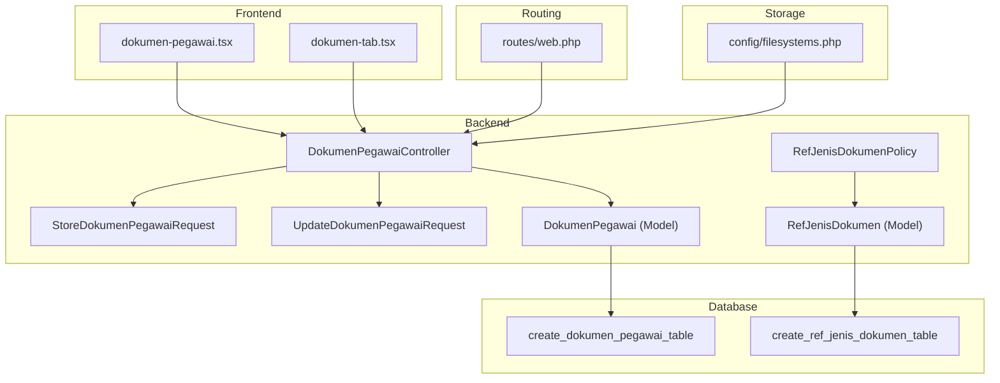
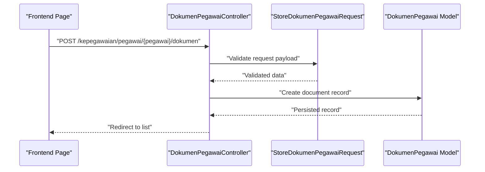
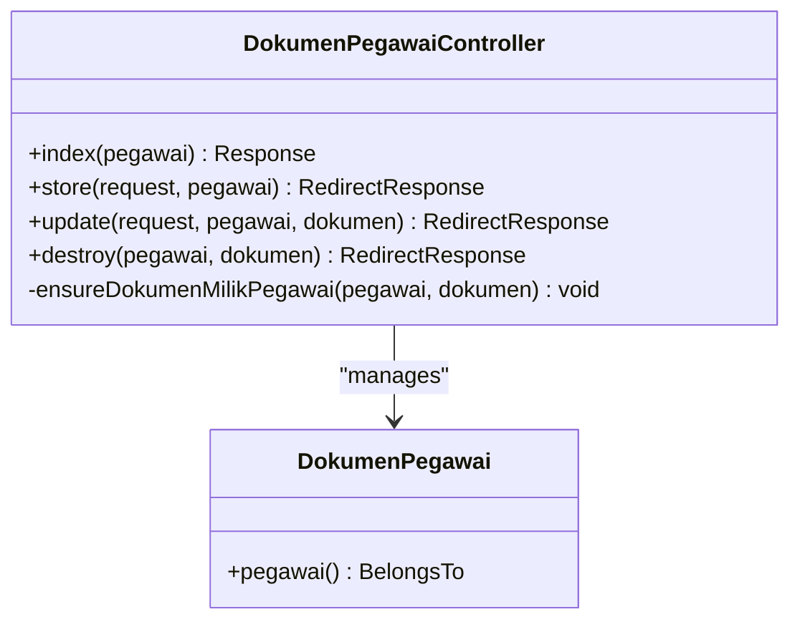
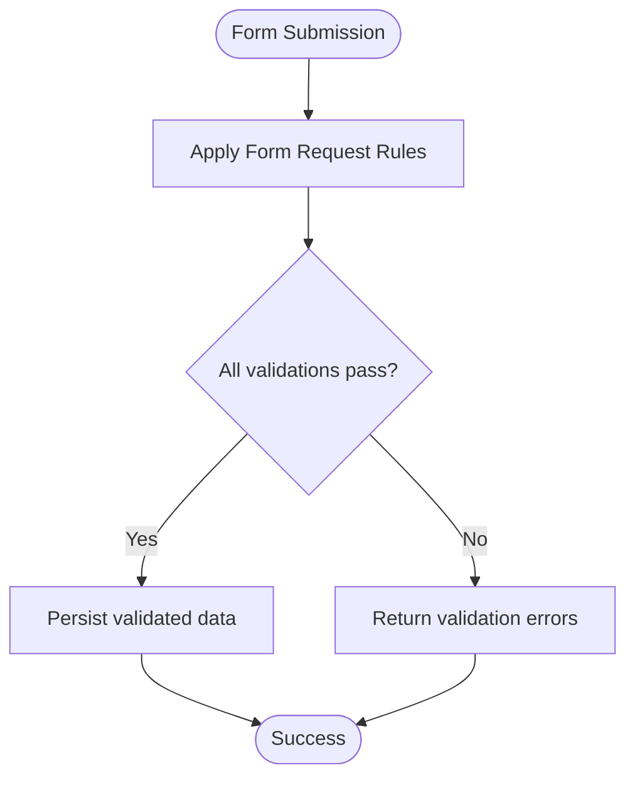
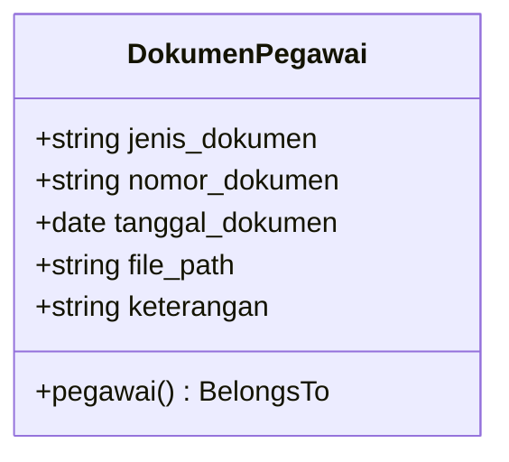
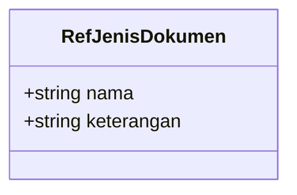
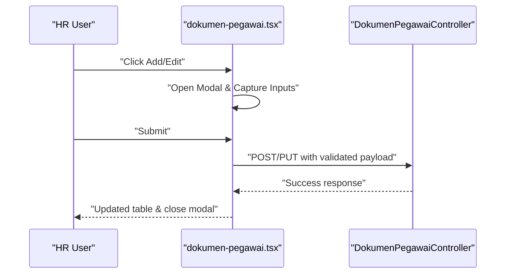
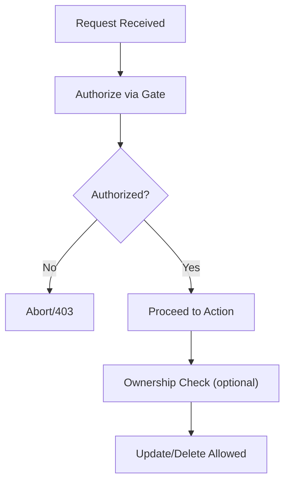
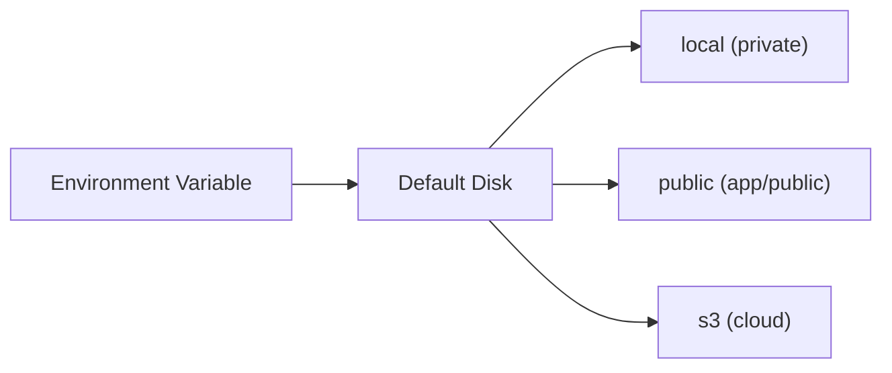
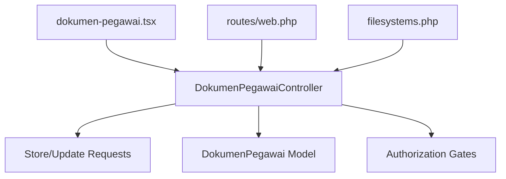

# Document Management

<cite>
**Referenced Files in This Document**
- [DokumenPegawaiController.php](file://app/Http/Controllers/Kepegawaian/DokumenPegawaiController.php)
- [StoreDokumenPegawaiRequest.php](file://app/Http/Requests/Kepegawaian/StoreDokumenPegawaiRequest.php)
- [UpdateDokumenPegawaiRequest.php](file://app/Http/Requests/Kepegawaian/UpdateDokumenPegawaiRequest.php)
- [DokumenPegawai.php](file://app/Models/DokumenPegawai.php)
- [RefJenisDokumen.php](file://app/Models/RefJenisDokumen.php)
- [2026_03_15_032846_create_dokumen_pegawai_table.php](file://database/migrations/2026_03_15_032846_create_dokumen_pegawai_table.php)
- [2026_03_15_162757_create_ref_jenis_dokumen_table.php](file://database/migrations/2026_03_15_162757_create_ref_jenis_dokumen_table.php)
- [dokumen-pegawai.tsx](file://resources/js/pages/kepegawaian/pegawai/dokumen-pegawai.tsx)
- [dokumen-tab.tsx](file://resources/js/components/pegawai-tabs/dokumen-tab.tsx)
- [web.php](file://routes/web.php)
- [filesystems.php](file://config/filesystems.php)
- [kepegawaian.php](file://config/kepegawaian.php)
- [RefJenisDokumenPolicy.php](file://app/Policies/RefJenisDokumenPolicy.php)
</cite>

## Table of Contents
1. [Introduction](#introduction)
2. [Project Structure](#project-structure)
3. [Core Components](#core-components)
4. [Architecture Overview](#architecture-overview)
5. [Detailed Component Analysis](#detailed-component-analysis)
6. [Dependency Analysis](#dependency-analysis)
7. [Performance Considerations](#performance-considerations)
8. [Troubleshooting Guide](#troubleshooting-guide)
9. [Conclusion](#conclusion)
10. [Appendices](#appendices)

## Introduction
This document explains the Document Management system for storing, validating, and retrieving employee-related documents. It covers the upload workflow, validation rules, metadata management, supported storage backends, and access control. It also describes how documents relate to employee records and career milestones, and provides practical guidance for common issues such as upload failures, validation errors, storage quotas, and versioning.

## Project Structure
The Document Management feature spans backend controllers and requests, Eloquent models and migrations, frontend pages and components, routing, and storage configuration. The following diagram shows the primary building blocks and their relationships.

**Diagram sources**
- [DokumenPegawaiController.php:15-91](file://app/Http/Controllers/Kepegawaian/DokumenPegawaiController.php#L15-L91)
- [StoreDokumenPegawaiRequest.php:7-35](file://app/Http/Requests/Kepegawaian/StoreDokumenPegawaiRequest.php#L7-L35)
- [UpdateDokumenPegawaiRequest.php:5-5](file://app/Http/Requests/Kepegawaian/UpdateDokumenPegawaiRequest.php#L5-L5)
- [DokumenPegawai.php:10-37](file://app/Models/DokumenPegawai.php#L10-L37)
- [RefJenisDokumen.php:10-28](file://app/Models/RefJenisDokumen.php#L10-L28)
- [2026_03_15_032846_create_dokumen_pegawai_table.php:11-21](file://database/migrations/2026_03_15_032846_create_dokumen_pegawai_table.php#L11-L21)
- [2026_03_15_162757_create_ref_jenis_dokumen_table.php:11-17](file://database/migrations/2026_03_15_162757_create_ref_jenis_dokumen_table.php#L11-L17)
- [dokumen-pegawai.tsx:86-401](file://resources/js/pages/kepegawaian/pegawai/dokumen-pegawai.tsx#L86-L401)
- [dokumen-tab.tsx:8-51](file://resources/js/components/pegawai-tabs/dokumen-tab.tsx#L8-L51)
- [web.php:93-97](file://routes/web.php#L93-L97)
- [filesystems.php:16-63](file://config/filesystems.php#L16-L63)

**Section sources**
- [DokumenPegawaiController.php:15-91](file://app/Http/Controllers/Kepegawaian/DokumenPegawaiController.php#L15-L91)
- [dokumen-pegawai.tsx:86-401](file://resources/js/pages/kepegawaian/pegawai/dokumen-pegawai.tsx#L86-L401)
- [web.php:93-97](file://routes/web.php#L93-L97)

## Core Components
- Controller: Handles listing, creating, updating, and deleting employee documents; enforces access control per employee.
- Form Requests: Define validation rules and messages for document creation and updates.
- Model: Represents document records with typed attributes and belongs-to relationship to employee.
- Reference Model: Optional reference for document types maintained separately.
- Frontend Pages/Components: Provide CRUD UI for document entries and file path display.
- Routing: Exposes REST endpoints for document management under the kepegawaian namespace.
- Storage Configuration: Defines local and cloud storage disks for file storage integration.

**Section sources**
- [DokumenPegawaiController.php:15-91](file://app/Http/Controllers/Kepegawaian/DokumenPegawaiController.php#L15-L91)
- [StoreDokumenPegawaiRequest.php:7-35](file://app/Http/Requests/Kepegawaian/StoreDokumenPegawaiRequest.php#L7-L35)
- [DokumenPegawai.php:10-37](file://app/Models/DokumenPegawai.php#L10-L37)
- [RefJenisDokumen.php:10-28](file://app/Models/RefJenisDokumen.php#L10-L28)
- [dokumen-pegawai.tsx:86-401](file://resources/js/pages/kepegawaian/pegawai/dokumen-pegawai.tsx#L86-L401)
- [web.php:93-97](file://routes/web.php#L93-L97)
- [filesystems.php:16-63](file://config/filesystems.php#L16-L63)

## Architecture Overview
The system follows a layered architecture:
- Presentation Layer: Inertia-driven React page renders the document list and form.
- Application Layer: Controller orchestrates requests, applies authorization, and delegates persistence.
- Domain Layer: Eloquent model encapsulates document metadata and relationships.
- Persistence Layer: Database schema stores document records and optional reference types.
- Infrastructure Layer: Storage configuration supports local and cloud backends.

**Diagram sources**
- [DokumenPegawaiController.php:53-60](file://app/Http/Controllers/Kepegawaian/DokumenPegawaiController.php#L53-L60)
- [StoreDokumenPegawaiRequest.php:14-23](file://app/Http/Requests/Kepegawaian/StoreDokumenPegawaiRequest.php#L14-L23)
- [DokumenPegawai.php:16-23](file://app/Models/DokumenPegawai.php#L16-L23)

## Detailed Component Analysis

### Backend Controller: DokumenPegawaiController
Responsibilities:
- Load employee with associated documents, sorted by type and date.
- Authorize access for viewing/updating employee records.
- Create, update, and delete document records.
- Enforce ownership checks to prevent cross-employee mutations.

Key behaviors:
- Index action loads nested documents and prepares UI-ready data.
- Store action validates input via form request and persists a new record.
- Update and Destroy actions enforce authorization and ownership.
- Uses gates for authorization and ensures the target document belongs to the given employee.

**Diagram sources**
- [DokumenPegawaiController.php:15-91](file://app/Http/Controllers/Kepegawaian/DokumenPegawaiController.php#L15-L91)
- [DokumenPegawai.php:33-36](file://app/Models/DokumenPegawai.php#L33-L36)

**Section sources**
- [DokumenPegawaiController.php:17-90](file://app/Http/Controllers/Kepegawaian/DokumenPegawaiController.php#L17-L90)

### Validation: StoreDokumenPegawaiRequest and UpdateDokumenPegawaiRequest
Validation rules define constraints for document metadata:
- Required and length-limited fields for document type and number.
- Optional date field for document date.
- Optional string path for file location.
- Optional free-text description.

Messages provide localized feedback for common violations.

**Diagram sources**
- [StoreDokumenPegawaiRequest.php:14-34](file://app/Http/Requests/Kepegawaian/StoreDokumenPegawaiRequest.php#L14-L34)

**Section sources**
- [StoreDokumenPegawaiRequest.php:14-34](file://app/Http/Requests/Kepegawaian/StoreDokumenPegawaiRequest.php#L14-L34)
- [UpdateDokumenPegawaiRequest.php:5-5](file://app/Http/Requests/Kepegawaian/UpdateDokumenPegawaiRequest.php#L5-L5)

### Data Model: DokumenPegawai
Fields and casting:
- Employee foreign key, document type, number, date, file path, and description.
- Date casting for document date and soft-deletes support.
- Relationship to employee model.

**Diagram sources**
- [DokumenPegawai.php:16-36](file://app/Models/DokumenPegawai.php#L16-L36)

**Section sources**
- [DokumenPegawai.php:16-36](file://app/Models/DokumenPegawai.php#L16-L36)
- [2026_03_15_032846_create_dokumen_pegawai_table.php:11-21](file://database/migrations/2026_03_15_032846_create_dokumen_pegawai_table.php#L11-L21)

### Reference Model: RefJenisDokumen
Purpose:
- Maintain a curated list of supported document types with optional descriptions.
- Can be used to drive selection in forms and policy enforcement.

**Diagram sources**
- [RefJenisDokumen.php:17-20](file://app/Models/RefJenisDokumen.php#L17-L20)

**Section sources**
- [RefJenisDokumen.php:17-20](file://app/Models/RefJenisDokumen.php#L17-L20)
- [2026_03_15_162757_create_ref_jenis_dokumen_table.php:11-17](file://database/migrations/2026_03_15_162757_create_ref_jenis_dokumen_table.php#L11-L17)

### Frontend: dokumen-pegawai.tsx
Features:
- Displays employee summary and a sortable, filterable table of documents.
- Provides a modal form for adding and editing document entries.
- Supports file path display as a clickable link when present.
- Uses Inertia router for optimistic updates and redirects.

**Diagram sources**
- [dokumen-pegawai.tsx:113-144](file://resources/js/pages/kepegawaian/pegawai/dokumen-pegawai.tsx#L113-L144)
- [DokumenPegawaiController.php:53-74](file://app/Http/Controllers/Kepegawaian/DokumenPegawaiController.php#L53-L74)

**Section sources**
- [dokumen-pegawai.tsx:86-401](file://resources/js/pages/kepegawaian/pegawai/dokumen-pegawai.tsx#L86-L401)

### Access Control and Policies
- Controller uses gates to authorize view/update actions against employee records.
- Ownership enforcement ensures users can only modify documents linked to their own employee context.
- Reference document types are governed by a generic reference policy class.

**Diagram sources**
- [DokumenPegawaiController.php:19-89](file://app/Http/Controllers/Kepegawaian/DokumenPegawaiController.php#L19-L89)
- [RefJenisDokumenPolicy.php:9-42](file://app/Policies/RefJenisDokumenPolicy.php#L9-L42)

**Section sources**
- [DokumenPegawaiController.php:19-89](file://app/Http/Controllers/Kepegawaian/DokumenPegawaiController.php#L19-L89)
- [RefJenisDokumenPolicy.php:9-42](file://app/Policies/RefJenisDokumenPolicy.php#L9-L42)

### Storage Integration
- Local disk: Private storage for sensitive documents.
- Public disk: For publicly accessible assets.
- S3-compatible disk: For cloud storage integration.
- Default disk is configurable via environment variable.

**Diagram sources**
- [filesystems.php:16-63](file://config/filesystems.php#L16-L63)

**Section sources**
- [filesystems.php:16-63](file://config/filesystems.php#L16-L63)

## Dependency Analysis
- Controller depends on:
  - Form requests for validation.
  - Eloquent model for persistence.
  - Gate for authorization.
  - Inertia for rendering.
- Model depends on:
  - Database schema for column definitions and constraints.
- Frontend depends on:
  - Controller endpoints and Inertia props.
- Routing binds:
  - Resource routes for document CRUD under kepegawaian namespace.

**Diagram sources**
- [DokumenPegawaiController.php:53-90](file://app/Http/Controllers/Kepegawaian/DokumenPegawaiController.php#L53-L90)
- [web.php:93-97](file://routes/web.php#L93-L97)
- [filesystems.php:16-63](file://config/filesystems.php#L16-L63)

**Section sources**
- [web.php:93-97](file://routes/web.php#L93-L97)
- [DokumenPegawaiController.php:53-90](file://app/Http/Controllers/Kepegawaian/DokumenPegawaiController.php#L53-L90)

## Performance Considerations
- Prefer soft deletes for auditability and safe recovery.
- Indexes on foreign keys and frequently queried columns (e.g., employee ID) improve query performance.
- Pagination and lazy loading of attachments reduce initial payload sizes.
- Use CDN or cloud storage for large files to offload server bandwidth.
- Minimize concurrent uploads and apply rate limiting at the API gateway level.

## Troubleshooting Guide
Common issues and resolutions:
- Upload failures
  - Validate request payload against form request rules.
  - Confirm controller authorization and ownership checks pass.
  - Ensure the frontend sends the correct endpoint and method.
  - Check storage disk availability and permissions.
- Validation errors
  - Review localized messages returned by form requests.
  - Confirm field lengths and formats match schema constraints.
- Storage quota management
  - Track total file sizes per employee and enforce limits at the application layer.
  - Use cloud storage quotas and lifecycle policies to manage costs.
- Document versioning
  - Store multiple entries for the same document type to maintain history.
  - Add a version field or timestamp to distinguish revisions.
- Access control
  - Verify gate policies and ownership checks are invoked before mutating data.
  - Confirm user roles and permissions align with intended access patterns.

**Section sources**
- [StoreDokumenPegawaiRequest.php:25-34](file://app/Http/Requests/Kepegawaian/StoreDokumenPegawaiRequest.php#L25-L34)
- [DokumenPegawaiController.php:53-90](file://app/Http/Controllers/Kepegawaian/DokumenPegawaiController.php#L53-L90)
- [filesystems.php:16-63](file://config/filesystems.php#L16-L63)

## Conclusion
The Document Management system provides a robust foundation for storing employee documents with strong validation, clear metadata fields, and flexible storage backends. By leveraging authorization gates, ownership checks, and a clean separation of concerns across controller, model, request, and UI layers, the system supports scalable document workflows aligned with HR processes and compliance needs.

## Appendices

### Data Validation Rules Summary
- Document type: required, string, max 100 characters.
- Document number: nullable, string, max 100 characters.
- Document date: nullable, valid date.
- File path: nullable, string, max 500 characters.
- Description: nullable, text.

**Section sources**
- [StoreDokumenPegawaiRequest.php:14-34](file://app/Http/Requests/Kepegawaian/StoreDokumenPegawaiRequest.php#L14-L34)

### Supported Storage Backends
- Local private storage for sensitive documents.
- Local public storage for shared assets.
- S3-compatible cloud storage for scalability and backup.

**Section sources**
- [filesystems.php:31-63](file://config/filesystems.php#L31-L63)

### Configuration Options
- Default disk: controlled by FILESYSTEM_DISK environment variable.
- HMAC secret for external integrations: ATTENDANCE_HMAC_SECRET in kepegawaian config.

**Section sources**
- [filesystems.php:16-16](file://config/filesystems.php#L16-L16)
- [kepegawaian.php:15-15](file://config/kepegawaian.php#L15-L15)

### Relationships with Employee Records and Career Milestones
- Documents belong to employees via foreign key, enabling per-employee organization.
- Document types can be mapped to career milestones (e.g., SK CPNS, SK PNS, SK Pangkat, SK Jabatan) for audit trails and compliance reporting.

**Section sources**
- [DokumenPegawai.php:16-23](file://app/Models/DokumenPegawai.php#L16-L23)
- [2026_03_15_032846_create_dokumen_pegawai_table.php:13-13](file://database/migrations/2026_03_15_032846_create_dokumen_pegawai_table.php#L13-L13)
- [dokumen-pegawai.tsx:72-84](file://resources/js/pages/kepegawaian/pegawai/dokumen-pegawai.tsx#L72-L84)