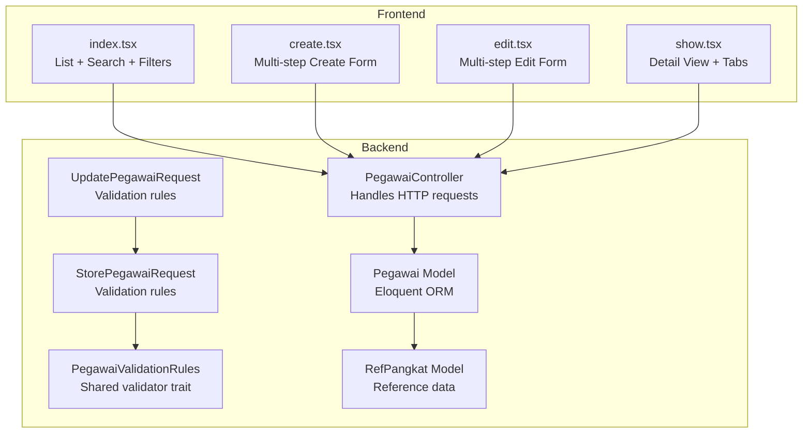
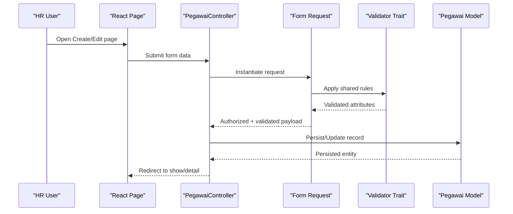
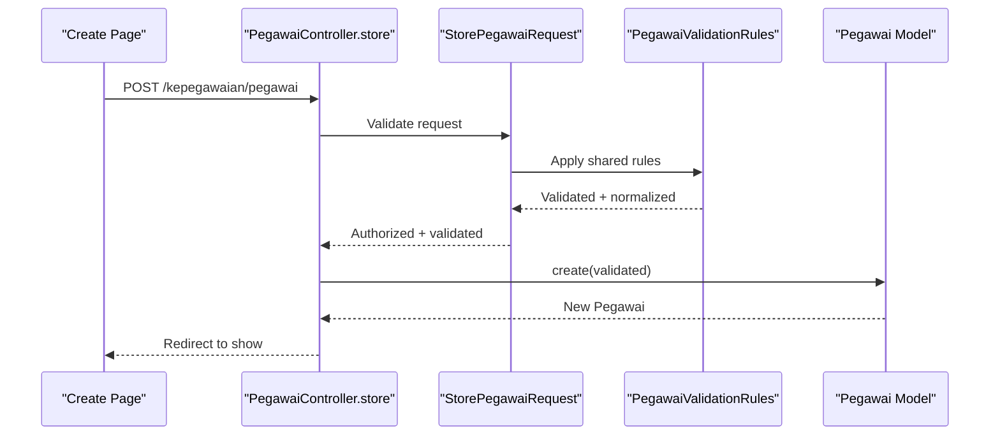
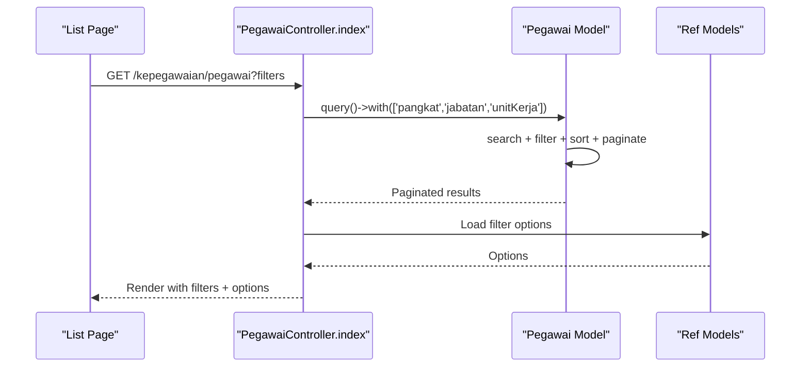
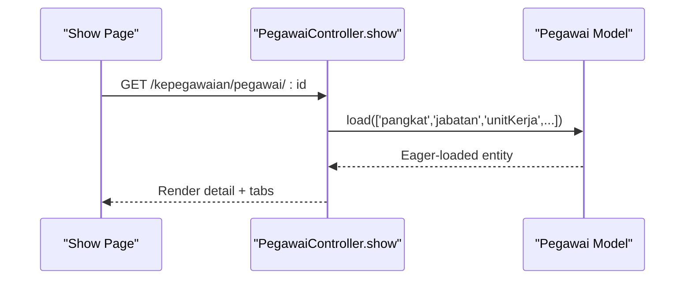
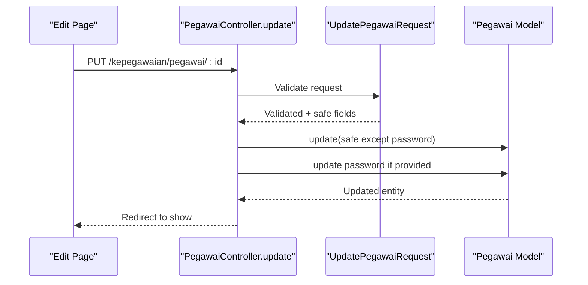
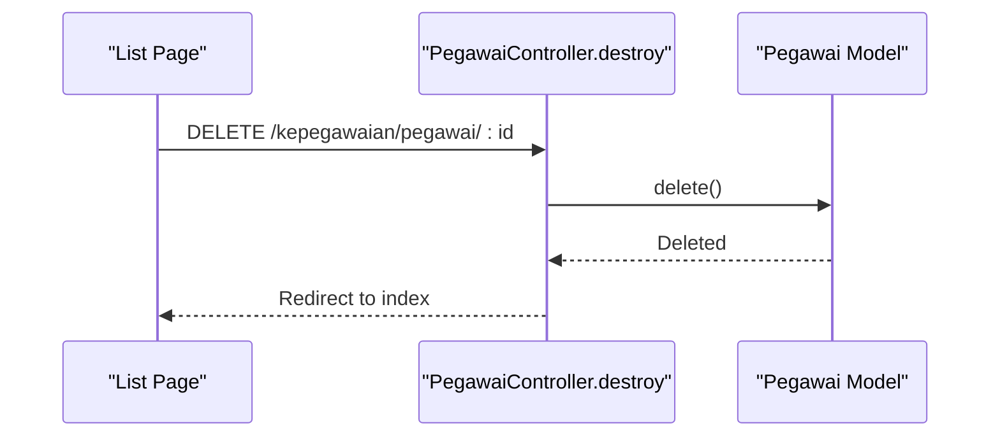
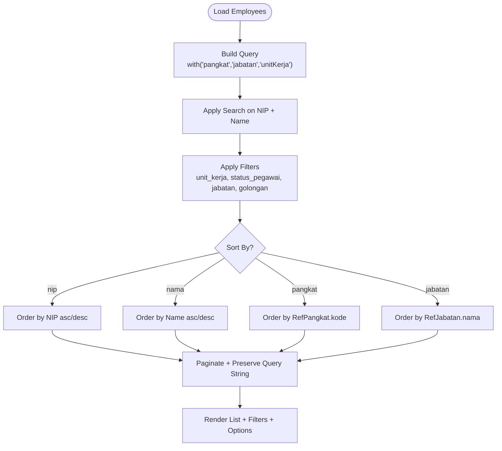
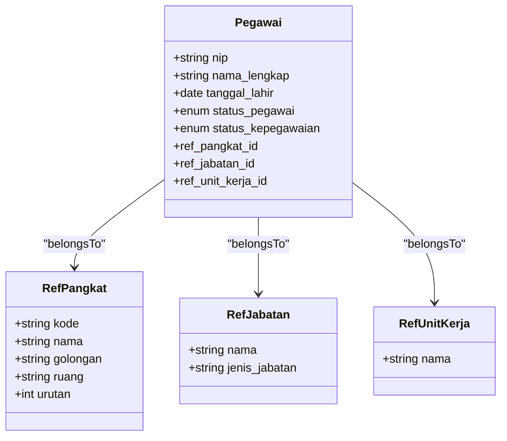
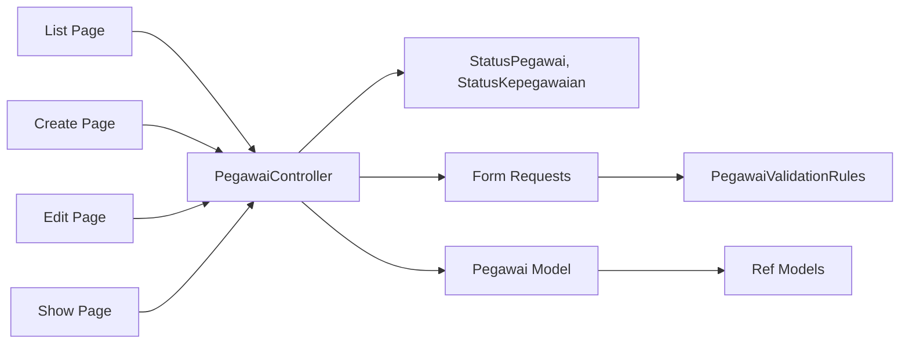

# Employee Data Management

<cite>
**Referenced Files in This Document**
- [PegawaiController.php](file://app/Http/Controllers/Kepegawaian/PegawaiController.php)
- [Pegawai.php](file://app/Models/Pegawai.php)
- [StorePegawaiRequest.php](file://app/Http/Requests/Kepegawaian/StorePegawaiRequest.php)
- [UpdatePegawaiRequest.php](file://app/Http/Requests/Kepegawaian/UpdatePegawaiRequest.php)
- [PegawaiValidationRules.php](file://app/Concerns/PegawaiValidationRules.php)
- [index.tsx](file://resources/js/pages/kepegawaian/pegawai/index.tsx)
- [create.tsx](file://resources/js/pages/kepegawaian/pegawai/create.tsx)
- [edit.tsx](file://resources/js/pages/kepegawaian/pegawai/edit.tsx)
- [show.tsx](file://resources/js/pages/kepegawaian/pegawai/show.tsx)
- [StatusPegawai.php](file://app/Enums/StatusPegawai.php)
- [StatusKepegawaian.php](file://app/Enums/StatusKepegawaian.php)
- [RefPangkat.php](file://app/Models/RefPangkat.php)
</cite>

## Table of Contents
1. [Introduction](#introduction)
2. [Project Structure](#project-structure)
3. [Core Components](#core-components)
4. [Architecture Overview](#architecture-overview)
5. [Detailed Component Analysis](#detailed-component-analysis)
6. [Dependency Analysis](#dependency-analysis)
7. [Performance Considerations](#performance-considerations)
8. [Troubleshooting Guide](#troubleshooting-guide)
9. [Conclusion](#conclusion)

## Introduction
This document explains the Employee Data Management subsystem with a focus on CRUD operations, validation, search and filtering, and display patterns. It covers how employees are created, viewed, updated, and deleted, how form requests enforce validation rules, how enums govern allowed values, and how frontend components render and interact with employee data. It also documents configuration options for employee statuses, reference data integration, sorting mechanisms, and relationships with related models such as pangkat (rank), jabatan (position), and unit kerja (work unit). Guidance is included for handling common issues like duplicate NIP validation, data consistency checks, and error handling strategies.

## Project Structure
The subsystem spans backend PHP controllers and models, form request validators, and frontend React pages/components. The controller orchestrates listing, creating, updating, viewing, and deleting employees. The model defines attributes, casts, relations, scopes, and helpers. Validators enforce business rules and enum constraints. Frontend pages implement multi-step forms, search/filter UI, and tabbed detail views.

**Diagram sources**
- [PegawaiController.php:25-224](file://app/Http/Controllers/Kepegawaian/PegawaiController.php#L25-L224)
- [Pegawai.php:24-209](file://app/Models/Pegawai.php#L24-L209)
- [StorePegawaiRequest.php:10-51](file://app/Http/Requests/Kepegawaian/StorePegawaiRequest.php#L10-L51)
- [UpdatePegawaiRequest.php:7-32](file://app/Http/Requests/Kepegawaian/UpdatePegawaiRequest.php#L7-L32)
- [PegawaiValidationRules.php:14-78](file://app/Concerns/PegawaiValidationRules.php#L14-L78)
- [index.tsx:1-487](file://resources/js/pages/kepegawaian/pegawai/index.tsx#L1-L487)
- [create.tsx:1-603](file://resources/js/pages/kepegawaian/pegawai/create.tsx#L1-L603)
- [edit.tsx:1-646](file://resources/js/pages/kepegawaian/pegawai/edit.tsx#L1-L646)
- [show.tsx:1-102](file://resources/js/pages/kepegawaian/pegawai/show.tsx#L1-L102)
- [RefPangkat.php:10-34](file://app/Models/RefPangkat.php#L10-L34)

**Section sources**
- [PegawaiController.php:25-224](file://app/Http/Controllers/Kepegawaian/PegawaiController.php#L25-L224)
- [Pegawai.php:24-209](file://app/Models/Pegawai.php#L24-L209)
- [StorePegawaiRequest.php:10-51](file://app/Http/Requests/Kepegawaian/StorePegawaiRequest.php#L10-L51)
- [UpdatePegawaiRequest.php:7-32](file://app/Http/Requests/Kepegawaian/UpdatePegawaiRequest.php#L7-L32)
- [PegawaiValidationRules.php:14-78](file://app/Concerns/PegawaiValidationRules.php#L14-L78)
- [index.tsx:1-487](file://resources/js/pages/kepegawaian/pegawai/index.tsx#L1-L487)
- [create.tsx:1-603](file://resources/js/pages/kepegawaian/pegawai/create.tsx#L1-L603)
- [edit.tsx:1-646](file://resources/js/pages/kepegawaian/pegawai/edit.tsx#L1-L646)
- [show.tsx:1-102](file://resources/js/pages/kepegawaian/pegawai/show.tsx#L1-L102)
- [RefPangkat.php:10-34](file://app/Models/RefPangkat.php#L10-L34)

## Core Components
- Controller: Implements index, create, store, show, edit, update, and destroy actions. Applies authorization, search/filter/sort, eager loading, and paginated rendering.
- Model: Defines fillable attributes, enum casts, soft deletes, relations to reference models and history tables, scopes, and helpers.
- Form Requests: Centralize validation rules and messages for create/update, leveraging shared validator trait.
- Frontend Pages: Provide multi-step forms for create/edit, a searchable/filterable list with sortable columns, and a detail view with tabs.

Key responsibilities:
- Create: Validates incoming data and persists a new employee record.
- Read: Lists employees with search, filter, and sort; shows detailed view with related data.
- Update: Validates and updates employee records, optionally changing the password.
- Delete: Removes an employee with authorization checks.

**Section sources**
- [PegawaiController.php:25-224](file://app/Http/Controllers/Kepegawaian/PegawaiController.php#L25-L224)
- [Pegawai.php:24-209](file://app/Models/Pegawai.php#L24-L209)
- [StorePegawaiRequest.php:10-51](file://app/Http/Requests/Kepegawaian/StorePegawaiRequest.php#L10-L51)
- [UpdatePegawaiRequest.php:7-32](file://app/Http/Requests/Kepegawaian/UpdatePegawaiRequest.php#L7-L32)
- [PegawaiValidationRules.php:14-78](file://app/Concerns/PegawaiValidationRules.php#L14-L78)
- [index.tsx:1-487](file://resources/js/pages/kepegawaian/pegawai/index.tsx#L1-L487)
- [create.tsx:1-603](file://resources/js/pages/kepegawaian/pegawai/create.tsx#L1-L603)
- [edit.tsx:1-646](file://resources/js/pages/kepegawaian/pegawai/edit.tsx#L1-L646)
- [show.tsx:1-102](file://resources/js/pages/kepegawaian/pegawai/show.tsx#L1-L102)

## Architecture Overview
The system follows a layered MVC pattern with explicit separation of concerns:
- HTTP layer: Controllers handle routing and orchestrate data retrieval and persistence.
- Domain layer: Models encapsulate business logic, relations, and scopes.
- Validation layer: Form requests and traits define strict validation rules and messages.
- Presentation layer: Inertia-driven React pages render lists, forms, and details.

**Diagram sources**
- [PegawaiController.php:141-210](file://app/Http/Controllers/Kepegawaian/PegawaiController.php#L141-L210)
- [StorePegawaiRequest.php:10-51](file://app/Http/Requests/Kepegawaian/StorePegawaiRequest.php#L10-L51)
- [UpdatePegawaiRequest.php:7-32](file://app/Http/Requests/Kepegawaian/UpdatePegawaiRequest.php#L7-L32)
- [PegawaiValidationRules.php:14-78](file://app/Concerns/PegawaiValidationRules.php#L14-L78)
- [Pegawai.php:24-209](file://app/Models/Pegawai.php#L24-L209)

## Detailed Component Analysis

### CRUD Workflows

#### Create Employee
- Backend: Controller action authorizes and delegates to the store method, which creates a new employee using validated data.
- Validation: Form request enforces required fields, enum constraints, and uniqueness rules (including NIP and email).
- Frontend: Multi-step form organizes fields into logical groups and displays validation errors per field.

**Diagram sources**
- [PegawaiController.php:141-148](file://app/Http/Controllers/Kepegawaian/PegawaiController.php#L141-L148)
- [StorePegawaiRequest.php:10-51](file://app/Http/Requests/Kepegawaian/StorePegawaiRequest.php#L10-L51)
- [PegawaiValidationRules.php:14-78](file://app/Concerns/PegawaiValidationRules.php#L14-L78)
- [Pegawai.php:24-209](file://app/Models/Pegawai.php#L24-L209)

**Section sources**
- [PegawaiController.php:118-148](file://app/Http/Controllers/Kepegawaian/PegawaiController.php#L118-L148)
- [StorePegawaiRequest.php:10-51](file://app/Http/Requests/Kepegawaian/StorePegawaiRequest.php#L10-L51)
- [PegawaiValidationRules.php:14-78](file://app/Concerns/PegawaiValidationRules.php#L14-L78)
- [create.tsx:1-603](file://resources/js/pages/kepegawaian/pegawai/create.tsx#L1-L603)

#### View Employee List
- Backend: Controller builds queries with search, filter, and sort support, eager loads related reference data, and paginates results.
- Frontend: Toolbar provides search and filter controls; sortable headers trigger re-query; pagination links navigate pages.

**Diagram sources**
- [PegawaiController.php:30-113](file://app/Http/Controllers/Kepegawaian/PegawaiController.php#L30-L113)
- [Pegawai.php:24-209](file://app/Models/Pegawai.php#L24-L209)
- [index.tsx:1-487](file://resources/js/pages/kepegawaian/pegawai/index.tsx#L1-L487)

**Section sources**
- [PegawaiController.php:30-113](file://app/Http/Controllers/Kepegawaian/PegawaiController.php#L30-L113)
- [index.tsx:1-487](file://resources/js/pages/kepegawaian/pegawai/index.tsx#L1-L487)

#### Show Employee Detail
- Backend: Controller loads employee with related data (pangkat, jabatan, unitKerja, histories, family, awards, penalties, documents).
- Frontend: Detail view presents summary and delegates detailed tabs to specialized components.

**Diagram sources**
- [PegawaiController.php:153-170](file://app/Http/Controllers/Kepegawaian/PegawaiController.php#L153-L170)
- [Pegawai.php:24-209](file://app/Models/Pegawai.php#L24-L209)
- [show.tsx:1-102](file://resources/js/pages/kepegawaian/pegawai/show.tsx#L1-L102)

**Section sources**
- [PegawaiController.php:153-170](file://app/Http/Controllers/Kepegawaian/PegawaiController.php#L153-L170)
- [show.tsx:1-102](file://resources/js/pages/kepegawaian/pegawai/show.tsx#L1-L102)

#### Update Employee
- Backend: Controller authorizes, validates, updates base fields, and conditionally updates password.
- Frontend: Multi-step form pre-fills existing data and submits to the server.

**Diagram sources**
- [PegawaiController.php:199-210](file://app/Http/Controllers/Kepegawaian/PegawaiController.php#L199-L210)
- [UpdatePegawaiRequest.php:7-32](file://app/Http/Requests/Kepegawaian/UpdatePegawaiRequest.php#L7-L32)
- [edit.tsx:1-646](file://resources/js/pages/kepegawaian/pegawai/edit.tsx#L1-L646)

**Section sources**
- [PegawaiController.php:175-210](file://app/Http/Controllers/Kepegawaian/PegawaiController.php#L175-L210)
- [UpdatePegawaiRequest.php:7-32](file://app/Http/Requests/Kepegawaian/UpdatePegawaiRequest.php#L7-L32)
- [edit.tsx:1-646](file://resources/js/pages/kepegawaian/pegawai/edit.tsx#L1-L646)

#### Delete Employee
- Backend: Controller authorizes and deletes the employee, then redirects to the list.

**Diagram sources**
- [PegawaiController.php:215-222](file://app/Http/Controllers/Kepegawaian/PegawaiController.php#L215-L222)

**Section sources**
- [PegawaiController.php:215-222](file://app/Http/Controllers/Kepegawaian/PegawaiController.php#L215-L222)

### Data Validation and Enum-Based Field Validation
- Shared validator trait centralizes rules for NIP/email uniqueness, enum enforcement, and field constraints.
- Create request applies shared rules and adds custom messages for clarity.
- Update request extends create rules and adds optional password confirmation.

Validation highlights:
- NIP: size 18, digits only, unique across employees.
- Email: unique across employees.
- Enums: enforced via enum casting and validator rules.
- Foreign keys: ulid format and exists in reference tables.

**Section sources**
- [PegawaiValidationRules.php:14-78](file://app/Concerns/PegawaiValidationRules.php#L14-L78)
- [StorePegawaiRequest.php:10-51](file://app/Http/Requests/Kepegawaian/StorePegawaiRequest.php#L10-L51)
- [UpdatePegawaiRequest.php:7-32](file://app/Http/Requests/Kepegawaian/UpdatePegawaiRequest.php#L7-L32)
- [Pegawai.php:46-65](file://app/Models/Pegawai.php#L46-L65)

### Frontend Form Handling and Display Patterns
- Multi-step forms split data entry across three logical steps: personal info, contact/address, and employment details.
- Enum selects render human-friendly labels from enum arrays.
- Reference selects populate dropdowns from backend-provided options.
- List page supports live search, filter chips, and sortable columns with direction indicators.
- Detail page uses tabs to organize related data sections.

**Section sources**
- [create.tsx:1-603](file://resources/js/pages/kepegawaian/pegawai/create.tsx#L1-L603)
- [edit.tsx:1-646](file://resources/js/pages/kepegawaian/pegawai/edit.tsx#L1-L646)
- [index.tsx:1-487](file://resources/js/pages/kepegawaian/pegawai/index.tsx#L1-L487)
- [show.tsx:1-102](file://resources/js/pages/kepegawaian/pegawai/show.tsx#L1-L102)

### Search, Filtering, Sorting, and Configuration Options
- Search: Full-text search across NIP and name.
- Filters: By unit kerja, status_pegawai, jabatan, and golongan (via pangkat kode).
- Sorting: By name, NIP, pangkat, and jabatan with ascending/descending direction.
- Configuration: StatusPegawai and StatusKepegawaian enums define allowed values and labels.

**Diagram sources**
- [PegawaiController.php:44-79](file://app/Http/Controllers/Kepegawaian/PegawaiController.php#L44-L79)
- [index.tsx:150-250](file://resources/js/pages/kepegawaian/pegawai/index.tsx#L150-L250)

**Section sources**
- [PegawaiController.php:30-113](file://app/Http/Controllers/Kepegawaian/PegawaiController.php#L30-L113)
- [index.tsx:1-487](file://resources/js/pages/kepegawaian/pegawai/index.tsx#L1-L487)
- [StatusPegawai.php:5-24](file://app/Enums/StatusPegawai.php#L5-L24)
- [StatusKepegawaian.php:5-20](file://app/Enums/StatusKepegawaian.php#L5-L20)

### Relationships with Related Models
- Employee belongs to reference models: pangkat (RefPangkat), jabatan (RefJabatan), unitKerja (RefUnitKerja).
- Employee has many of various history and supporting models (riwayatJabatan, riwayatPangkat, riwayatPendidikan, riwayatDiklat, keluarga, penghargaan, hukumanDisiplin, dokumenPegawai).
- Employee authenticates as a user with IAM roles and permissions.

**Diagram sources**
- [Pegawai.php:69-82](file://app/Models/Pegawai.php#L69-L82)
- [RefPangkat.php:10-34](file://app/Models/RefPangkat.php#L10-L34)

**Section sources**
- [Pegawai.php:67-137](file://app/Models/Pegawai.php#L67-L137)
- [RefPangkat.php:10-34](file://app/Models/RefPangkat.php#L10-L34)

## Dependency Analysis
- Controller depends on:
  - Enums for status values and labels.
  - Form requests for validation.
  - Models for querying, relations, and scopes.
  - Inertia for rendering.
- Frontend pages depend on:
  - Backend-provided props (employee data, filter options, enums).
  - UI components for forms, tables, and dialogs.
  - Routing helpers for navigation.

**Diagram sources**
- [PegawaiController.php:25-224](file://app/Http/Controllers/Kepegawaian/PegawaiController.php#L25-L224)
- [StatusPegawai.php:5-24](file://app/Enums/StatusPegawai.php#L5-L24)
- [StatusKepegawaian.php:5-20](file://app/Enums/StatusKepegawaian.php#L5-L20)
- [StorePegawaiRequest.php:10-51](file://app/Http/Requests/Kepegawaian/StorePegawaiRequest.php#L10-L51)
- [PegawaiValidationRules.php:14-78](file://app/Concerns/PegawaiValidationRules.php#L14-L78)
- [Pegawai.php:24-209](file://app/Models/Pegawai.php#L24-L209)
- [index.tsx:1-487](file://resources/js/pages/kepegawaian/pegawai/index.tsx#L1-L487)
- [create.tsx:1-603](file://resources/js/pages/kepegawaian/pegawai/create.tsx#L1-L603)
- [edit.tsx:1-646](file://resources/js/pages/kepegawaian/pegawai/edit.tsx#L1-L646)
- [show.tsx:1-102](file://resources/js/pages/kepegawaian/pegawai/show.tsx#L1-L102)

**Section sources**
- [PegawaiController.php:25-224](file://app/Http/Controllers/Kepegawaian/PegawaiController.php#L25-L224)
- [Pegawai.php:24-209](file://app/Models/Pegawai.php#L24-L209)
- [index.tsx:1-487](file://resources/js/pages/kepegawaian/pegawai/index.tsx#L1-L487)
- [create.tsx:1-603](file://resources/js/pages/kepegawaian/pegawai/create.tsx#L1-L603)
- [edit.tsx:1-646](file://resources/js/pages/kepegawaian/pegawai/edit.tsx#L1-L646)
- [show.tsx:1-102](file://resources/js/pages/kepegawaian/pegawai/show.tsx#L1-L102)

## Performance Considerations
- Use eager loading to avoid N+1 queries when rendering lists and details.
- Apply database indexes on frequently filtered/sorted columns (e.g., NIP, name, foreign keys).
- Paginate results to limit memory usage on large datasets.
- Normalize enum values and leverage enum casting to reduce string comparisons.
- Defer heavy computations to background jobs if needed (e.g., bulk updates).

## Troubleshooting Guide
Common issues and resolutions:
- Duplicate NIP:
  - Symptom: Validation error indicating NIP already registered.
  - Resolution: Ensure NIP is unique; validator enforces uniqueness during create/update.
- Duplicate Email:
  - Symptom: Validation error indicating email already registered.
  - Resolution: Ensure email uniqueness; validator enforces uniqueness during create/update.
- Invalid Enum Values:
  - Symptom: Validation errors for fields like gender, religion, marital status, blood type, employment status, or civil service status.
  - Resolution: Use only allowed enum values; frontend selects map enum cases to display labels.
- Invalid Reference Selections:
  - Symptom: Validation errors for ref_pangkat_id, ref_jabatan_id, or ref_unit_kerja_id.
  - Resolution: Ensure selected ULIDs exist in reference tables; controller validates existence.
- Password Update:
  - Symptom: Password not changing after update.
  - Resolution: Provide password confirmation; controller updates hashed password only when present.

**Section sources**
- [StorePegawaiRequest.php:32-49](file://app/Http/Requests/Kepegawaian/StorePegawaiRequest.php#L32-L49)
- [UpdatePegawaiRequest.php:20-30](file://app/Http/Requests/Kepegawaian/UpdatePegawaiRequest.php#L20-L30)
- [PegawaiValidationRules.php:52-76](file://app/Concerns/PegawaiValidationRules.php#L52-L76)
- [PegawaiController.php:205-207](file://app/Http/Controllers/Kepegawaian/PegawaiController.php#L205-L207)

## Conclusion
The Employee Data Management subsystem integrates robust validation, clear search/filter/sort capabilities, and intuitive frontend forms to support efficient HR operations. By leveraging enum-based validation, shared validator traits, and well-defined model relations, the system ensures data consistency and usability. Developers can extend functionality by adding new validations, expanding filter options, or introducing additional related models while maintaining alignment with existing patterns.