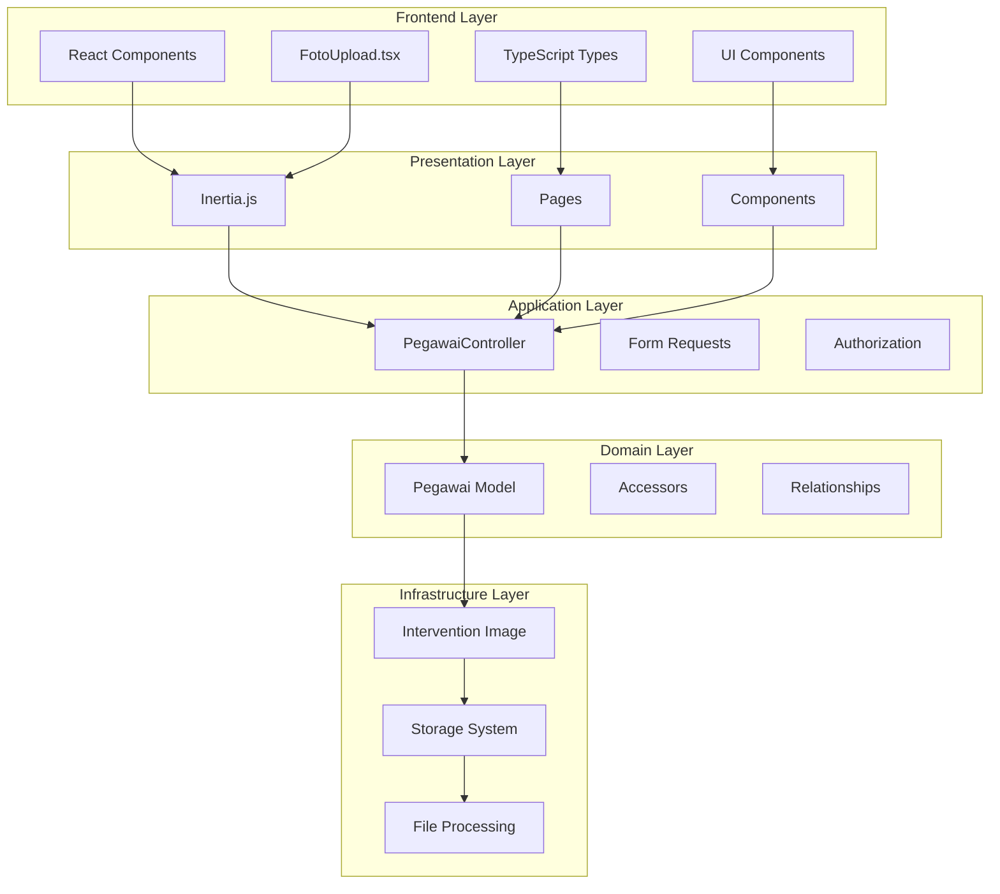
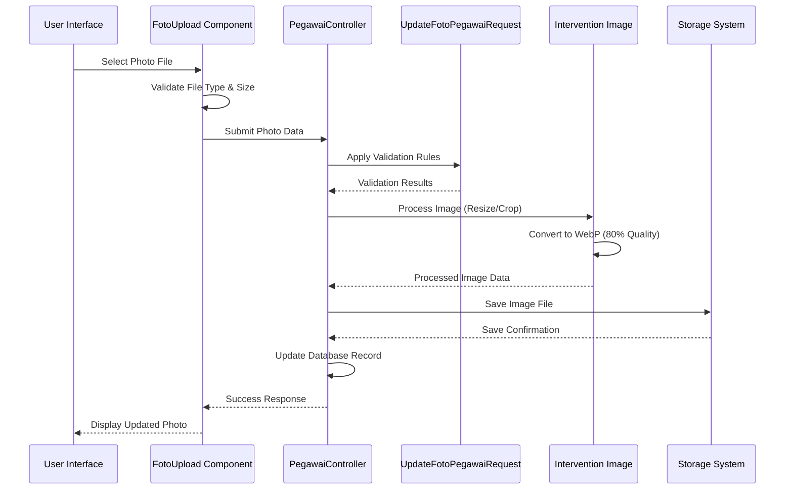
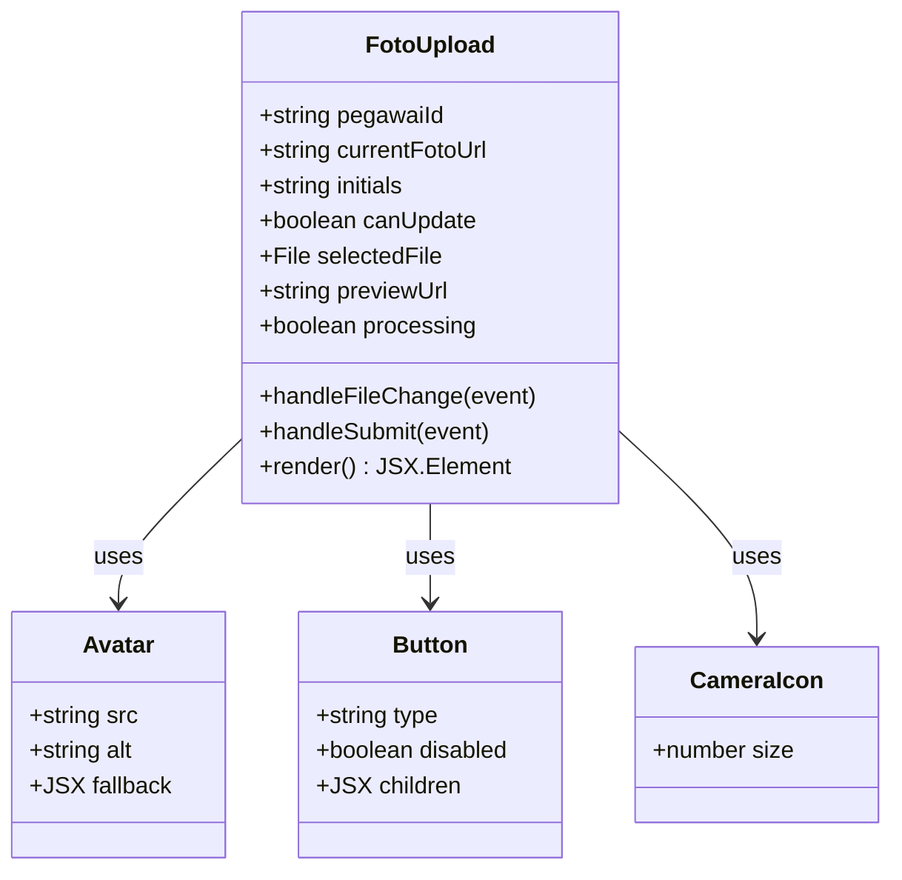
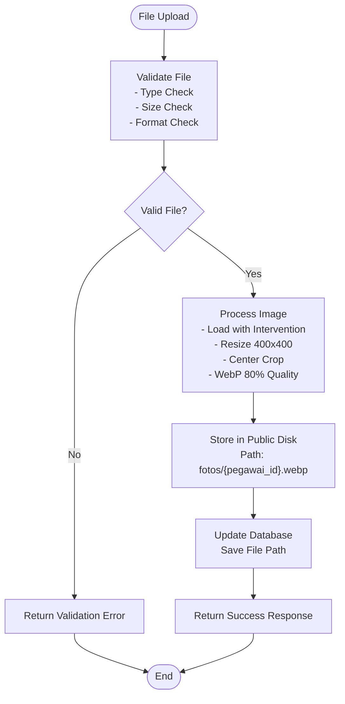

# Photo Management System

<cite>
**Referenced Files in This Document**
- [PegawaiController.php](file://app/Http/Controllers/Kepegawaian/PegawaiController.php)
- [UpdateFotoPegawaiRequest.php](file://app/Http/Requests/Kepegawaian/UpdateFotoPegawaiRequest.php)
- [Pegawai.php](file://app/Models/Pegawai.php)
- [FotoUpload.tsx](file://resources/js/components/pegawai/FotoUpload.tsx)
- [show.tsx](file://resources/js/pages/kepegawaian/pegawai/show.tsx)
- [index.tsx](file://resources/js/pages/kepegawaian/pegawai/index.tsx)
- [web.php](file://routes/web.php)
- [kepegawaian.ts](file://resources/js/types/kepegawaian.ts)
- [pegawai-detail.ts](file://resources/js/types/pegawai-detail.ts)
- [FotoPegawaiTest.php](file://tests/Feature/Kepegawaian/FotoPegawaiTest.php)
</cite>

## Table of Contents
1. [Introduction](#introduction)
2. [System Architecture](#system-architecture)
3. [Core Components](#core-components)
4. [Photo Upload Workflow](#photo-upload-workflow)
5. [Frontend Implementation](#frontend-implementation)
6. [Backend Implementation](#backend-implementation)
7. [Storage and File Management](#storage-and-file-management)
8. [Security and Validation](#security-and-validation)
9. [Testing Strategy](#testing-strategy)
10. [Performance Considerations](#performance-considerations)
11. [Troubleshooting Guide](#troubleshooting-guide)
12. [Conclusion](#conclusion)

## Introduction

The Photo Management System is a comprehensive solution for managing employee photos within the Kepegawaian (Human Resources) application. This system enables authorized users to upload, resize, and display employee photographs in a standardized WebP format while maintaining security, performance, and user experience standards.

The system integrates seamlessly with the existing Laravel-based infrastructure, utilizing Intervention Image library for image processing, Inertia.js for frontend interactions, and a robust validation and authorization framework. The implementation follows modern development practices including comprehensive testing, TypeScript type safety, and responsive design patterns.

## System Architecture

The Photo Management System follows a layered architecture pattern with clear separation of concerns between frontend and backend components:

**Diagram sources**
- [PegawaiController.php:29-246](file://app/Http/Controllers/Kepegawaian/PegawaiController.php#L29-L246)
- [FotoUpload.tsx:1-79](file://resources/js/components/pegawai/FotoUpload.tsx#L1-L79)
- [Pegawai.php:29-226](file://app/Models/Pegawai.php#L29-L226)

## Core Components

### Frontend Components

The frontend implementation consists of several key React components working together to provide a seamless photo management experience:

#### FotoUpload Component
The primary component responsible for photo upload functionality, featuring:
- File selection with preview capabilities
- Drag-and-drop support
- Real-time validation feedback
- Loading states and error handling
- Responsive design for all device sizes

#### Type Definitions
Comprehensive TypeScript interfaces ensuring type safety across the application:
- `Pegawai` interface with `foto_url` property
- `PegawaiDetail` interface for detailed view
- Strict typing for all form data and API responses

### Backend Components

#### Controller Implementation
The `PegawaiController` handles all photo-related operations with dedicated methods for:
- Photo validation and processing
- Image resizing and format conversion
- Storage management and cleanup
- Authorization enforcement

#### Model Enhancements
The `Pegawai` model includes:
- `foto_url` accessor for dynamic URL generation
- Proper serialization handling
- Storage integration for file paths

**Section sources**
- [FotoUpload.tsx:1-79](file://resources/js/components/pegawai/FotoUpload.tsx#L1-L79)
- [PegawaiController.php:29-246](file://app/Http/Controllers/Kepegawaian/PegawaiController.php#L29-L246)
- [Pegawai.php:29-226](file://app/Models/Pegawai.php#L29-L226)

## Photo Upload Workflow

The photo upload process follows a structured workflow ensuring security, validation, and optimal performance:

**Diagram sources**
- [FotoUpload.tsx:27-42](file://resources/js/components/pegawai/FotoUpload.tsx#L27-L42)
- [UpdateFotoPegawaiRequest.php:8-31](file://app/Http/Requests/Kepegawaian/UpdateFotoPegawaiRequest.php#L8-L31)
- [PegawaiController.php:231-245](file://app/Http/Controllers/Kepegawaian/PegawaiController.php#L231-L245)

### Workflow Details

1. **File Selection**: Users select images through the component interface
2. **Client-Side Preview**: Selected files are previewed before upload
3. **Validation**: Files undergo immediate client-side validation
4. **Server-Side Processing**: Images are processed on the server with Intervention Image
5. **Storage**: Processed images are stored in the public disk
6. **Database Update**: File paths are recorded in the database
7. **Response**: Users receive immediate feedback on upload success

**Section sources**
- [FotoUpload.tsx:14-45](file://resources/js/components/pegawai/FotoUpload.tsx#L14-L45)
- [PegawaiController.php:231-245](file://app/Http/Controllers/Kepegawaian/PegawaiController.php#L231-L245)

## Frontend Implementation

### Component Architecture

The frontend implementation utilizes React functional components with hooks for state management and lifecycle events:

**Diagram sources**
- [FotoUpload.tsx:7-12](file://resources/js/components/pegawai/FotoUpload.tsx#L7-L12)
- [FotoUpload.tsx:48-78](file://resources/js/components/pegawai/FotoUpload.tsx#L48-L78)

### User Interface Features

The frontend provides an intuitive and accessible interface:

- **Visual Feedback**: Real-time preview of selected images
- **Responsive Design**: Adapts to mobile, tablet, and desktop screens
- **Accessibility**: Screen reader support and keyboard navigation
- **Loading States**: Clear indication during upload processing
- **Error Handling**: User-friendly error messages and recovery options

**Section sources**
- [FotoUpload.tsx:48-79](file://resources/js/components/pegawai/FotoUpload.tsx#L48-L79)
- [show.tsx:39-44](file://resources/js/pages/kepegawaian/pegawai/show.tsx#L39-L44)

## Backend Implementation

### Controller Methods

The backend controller implements specialized methods for photo management:

#### updateFoto Method
Handles the complete photo upload and processing workflow:
- Validates incoming requests using form requests
- Processes images with Intervention Image library
- Resizes images to 400x400 pixels with center crop
- Converts to WebP format with 80% quality
- Stores files in the public storage disk
- Updates database records with file paths

#### Authorization Integration
Utilizes Laravel's Gate system for role-based access control:
- Ensures users have permission to update target employee records
- Prevents unauthorized access to photo modification
- Supports admin, operator, and viewer role hierarchies

### Request Validation

The `UpdateFotoPegawaiRequest` class enforces strict validation rules:
- Required field validation
- Image format validation (JPG, JPEG, PNG, WebP)
- File size limits (maximum 2MB)
- MIME type restrictions
- Custom error message localization

**Section sources**
- [PegawaiController.php:231-245](file://app/Http/Controllers/Kepegawaian/PegawaiController.php#L231-L245)
- [UpdateFotoPegawaiRequest.php:10-31](file://app/Http/Requests/Kepegawaian/UpdateFotoPegawaiRequest.php#L10-L31)

## Storage and File Management

### File Processing Pipeline

The system implements a sophisticated file processing pipeline:

**Diagram sources**
- [PegawaiController.php:233-242](file://app/Http/Controllers/Kepegawaian/PegawaiController.php#L233-L242)

### Storage Configuration

The system utilizes Laravel's storage abstraction layer:
- **Disk**: Public storage disk for web-accessible files
- **Path Structure**: `fotos/{pegawai_id}.webp` organization
- **File Naming**: Unique identifiers prevent conflicts
- **Cleanup**: Automatic replacement of existing photos

### Image Processing Specifications

Images undergo standardized processing:
- **Dimensions**: 400x400 pixels (square format)
- **Format**: WebP for optimal compression and quality
- **Quality**: 80% compression ratio
- **Aspect Ratio**: Maintained through center cropping
- **Color Space**: Optimized for web display

**Section sources**
- [PegawaiController.php:233-242](file://app/Http/Controllers/Kepegawaian/PegawaiController.php#L233-L242)
- [Pegawai.php:209-216](file://app/Models/Pegawai.php#L209-L216)

## Security and Validation

### Access Control

The system implements multi-layered security measures:

#### Authorization Gates
- **Resource-Based**: Checks if user can update specific employee record
- **Role-Based**: Supports admin, operator, and viewer permissions
- **Policy Integration**: Leverages Laravel's authorization system
- **Middleware**: Route-level protection for photo operations

#### Input Sanitization
- **File Validation**: Comprehensive validation of uploaded files
- **Content Type Verification**: Ensures files match declared types
- **Size Limits**: Prevents abuse through file size restrictions
- **Format Validation**: Restricts uploads to approved image formats

### Data Protection

#### Secure Storage
- **Public Disk**: Files are stored in publicly accessible location
- **Path Security**: Predictable but secure file paths
- **Cleanup**: Automatic replacement prevents orphaned files
- **Backup**: Integration with Laravel's backup systems

#### Privacy Considerations
- **Selective Display**: Photos only shown where appropriate
- **Permission Controls**: Explicit access requirements
- **Data Minimization**: Only essential photo data stored
- **GDPR Compliance**: User consent and data handling procedures

**Section sources**
- [UpdateFotoPegawaiRequest.php:10-13](file://app/Http/Requests/Kepegawaian/UpdateFotoPegawaiRequest.php#L10-L13)
- [PegawaiController.php:231-233](file://app/Http/Controllers/Kepegawaian/PegawaiController.php#L231-L233)

## Testing Strategy

### Test Coverage Areas

The system includes comprehensive testing across all components:

#### Backend Tests
- **Model Accessors**: `foto_url` property functionality
- **Controller Methods**: Photo upload workflow validation
- **Authorization**: Permission-based access control
- **Storage Operations**: File system interactions
- **Error Handling**: Exception scenarios and recovery

#### Frontend Tests
- **Component Rendering**: UI component functionality
- **State Management**: React component state handling
- **Event Handling**: User interaction processing
- **API Integration**: Backend communication validation
- **Type Safety**: TypeScript interface compliance

### Test Categories

#### Unit Tests
- Individual component functionality verification
- Model method behavior validation
- Utility function testing
- Integration point validation

#### Integration Tests
- Complete workflow end-to-end testing
- Database interaction validation
- File system operation testing
- Cross-component communication

#### Acceptance Tests
- User workflow validation
- Performance benchmarking
- Browser compatibility testing
- Accessibility compliance verification

**Section sources**
- [FotoPegawaiTest.php:6-29](file://tests/Feature/Kepegawaian/FotoPegawaiTest.php#L6-L29)
- [FotoPegawaiTest.php:51-115](file://tests/Feature/Kepegawaian/FotoPegawaiTest.php#L51-L115)

## Performance Considerations

### Image Optimization

The system implements several performance optimization strategies:

#### Compression Efficiency
- **WebP Format**: Reduced file sizes compared to JPEG/PNG
- **Quality Balance**: 80% quality maintains visual fidelity
- **Dimension Control**: Fixed 400x400px reduces bandwidth usage
- **Format Standardization**: Single format simplifies caching

#### Caching Strategies
- **Browser Caching**: Long-term caching for static images
- **CDN Integration**: Content delivery network support
- **ETag Support**: Efficient cache validation
- **Progressive Loading**: Optimistic loading patterns

### Scalability Features

#### Storage Scaling
- **Disk Abstraction**: Easy migration between storage solutions
- **CDN Integration**: Seamless CDN adoption
- **Load Balancing**: Multi-server deployment support
- **Database Indexing**: Efficient photo path queries

#### Processing Optimization
- **Asynchronous Processing**: Background image processing
- **Batch Operations**: Multiple photo updates
- **Memory Management**: Efficient image handling
- **Connection Pooling**: Database connection optimization

## Troubleshooting Guide

### Common Issues and Solutions

#### Upload Failures
**Symptoms**: Files rejected during upload process
**Causes**: 
- Invalid file format or corrupted files
- Exceeded file size limits
- Network connectivity issues
- Server-side processing errors

**Solutions**:
- Verify file format (JPG, JPEG, PNG, WebP)
- Check file size does not exceed 2MB limit
- Ensure stable internet connection
- Review server logs for processing errors

#### Display Problems
**Symptoms**: Photos not appearing in interface
**Causes**:
- Incorrect file paths in database
- Storage permission issues
- Cache invalidation problems
- Browser compatibility issues

**Solutions**:
- Verify file exists in storage disk
- Check storage permissions and access rights
- Clear browser cache and reload page
- Test with different browsers and devices

#### Performance Issues
**Symptoms**: Slow upload or display times
**Causes**:
- Large original image files
- Network bandwidth limitations
- Server resource constraints
- Browser rendering bottlenecks

**Solutions**:
- Compress images before upload
- Optimize network connection
- Monitor server resource usage
- Implement lazy loading for thumbnails

### Debugging Tools

#### Backend Debugging
- **Log Analysis**: Review Laravel application logs
- **Database Inspection**: Verify photo path storage
- **Storage Verification**: Confirm file existence
- **Exception Tracking**: Monitor error occurrences

#### Frontend Debugging
- **Console Inspection**: Browser developer tools
- **Network Monitoring**: Upload progress tracking
- **Component State**: React component debugging
- **Type Checking**: TypeScript compilation errors

**Section sources**
- [FotoPegawaiTest.php:35-92](file://tests/Feature/Kepegawaian/FotoPegawaiTest.php#L35-L92)

## Conclusion

The Photo Management System represents a comprehensive solution for employee photo management within the Kepegawaian application. The system successfully balances functionality, security, and user experience through its layered architecture, robust validation, and optimized processing pipeline.

Key achievements include:
- **Seamless Integration**: Works harmoniously with existing application infrastructure
- **Security First**: Multi-layered authorization and validation systems
- **Performance Optimized**: Efficient image processing and storage strategies
- **Developer Friendly**: Comprehensive testing and clear code organization
- **User Experience**: Intuitive interface with responsive design

The system's modular design ensures maintainability and extensibility, while its comprehensive testing strategy provides confidence in reliability and performance. Future enhancements could include advanced image processing capabilities, batch upload functionality, and enhanced accessibility features.