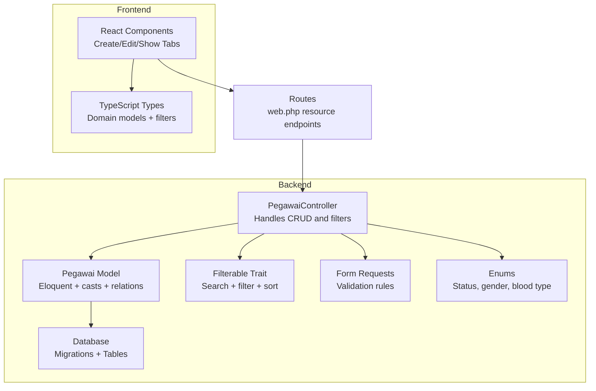
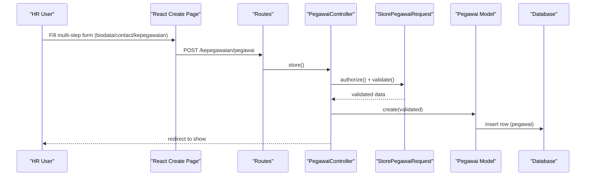
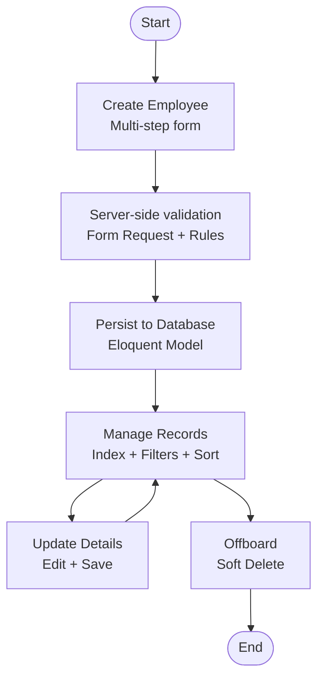
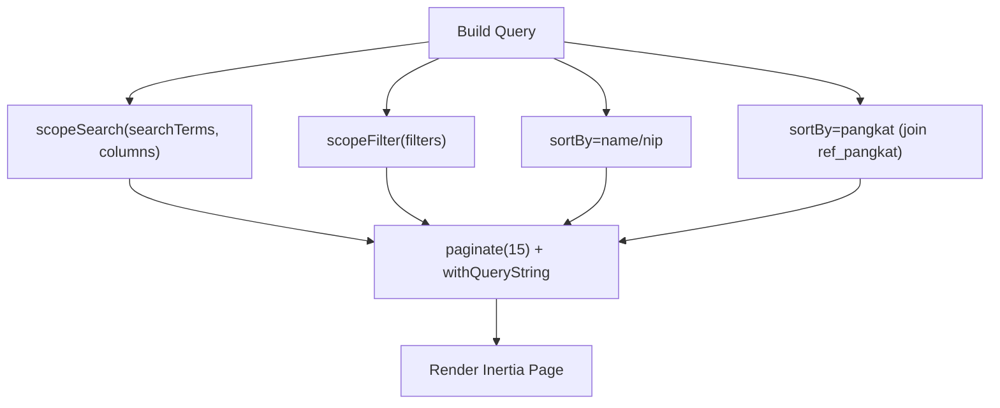
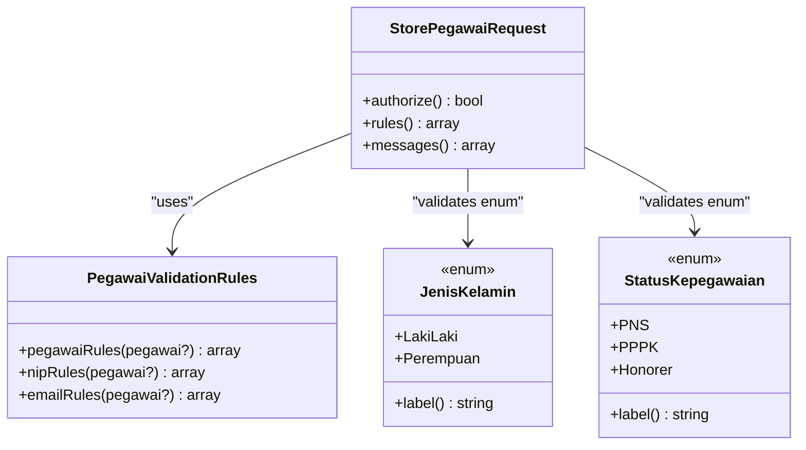
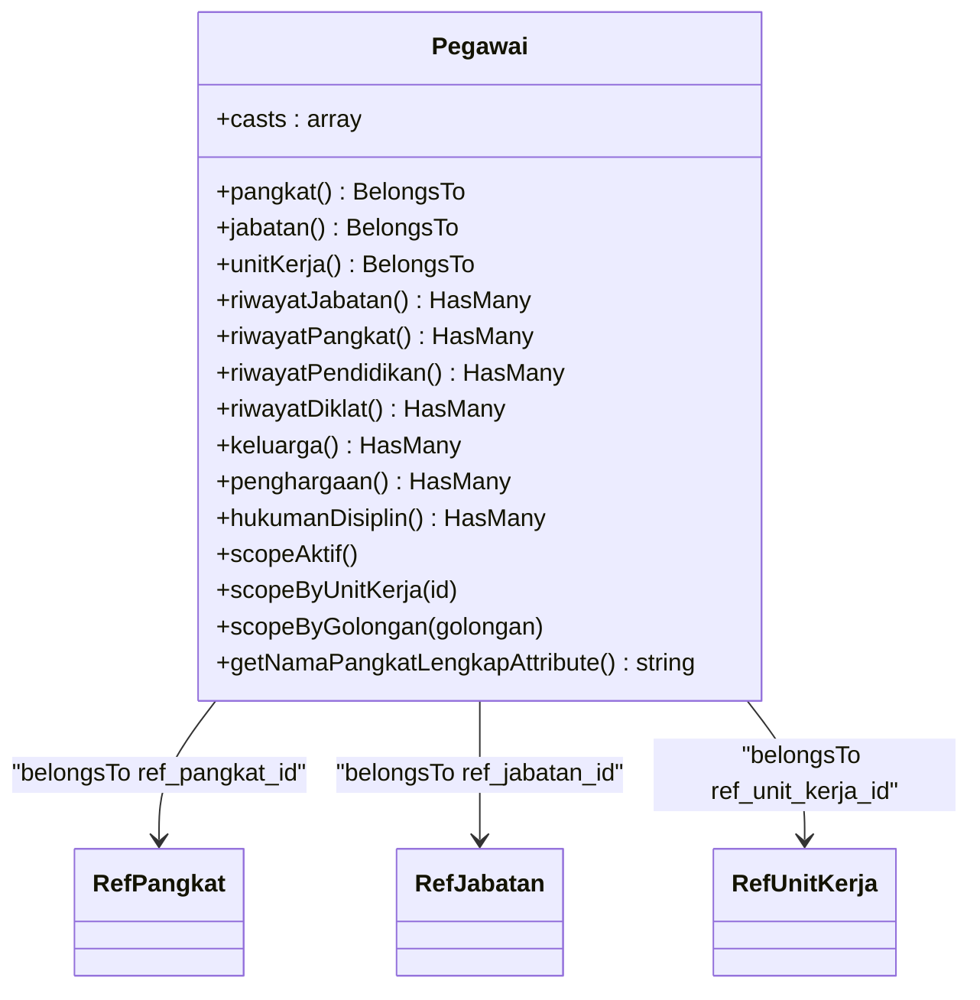
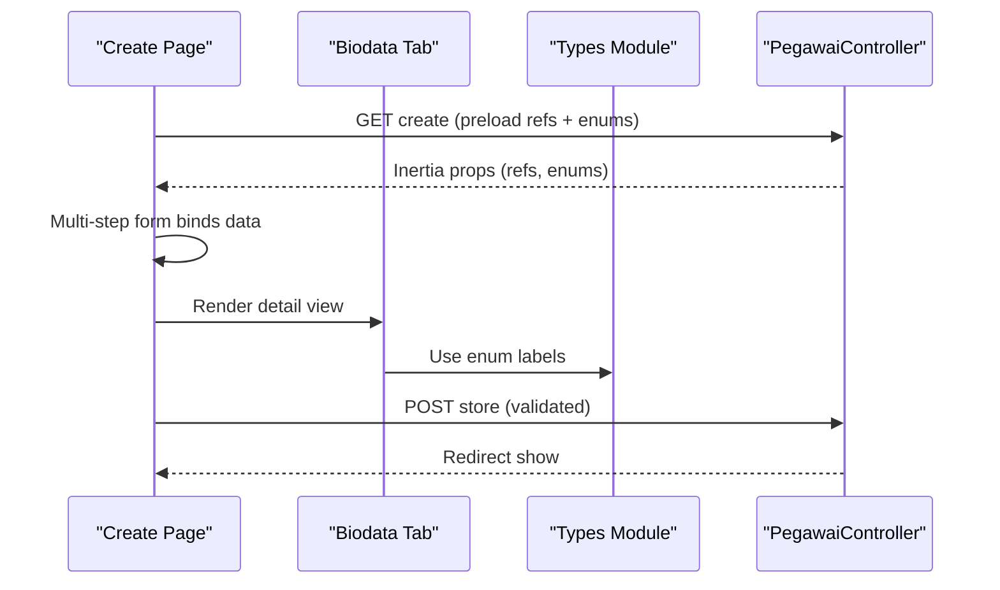
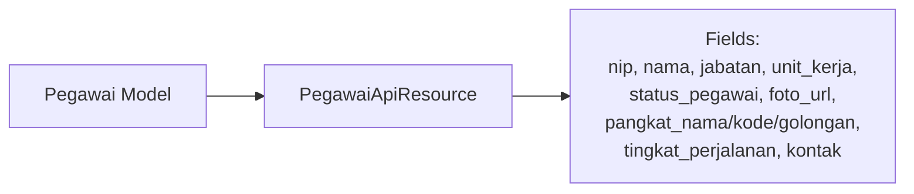
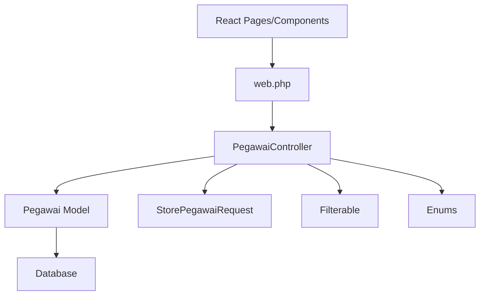

# Employee Management System

<cite>
**Referenced Files in This Document**
- [Pegawai.php](file://app/Models/Pegawai.php)
- [PegawaiController.php](file://app/Http/Controllers/Kepegawaian/PegawaiController.php)
- [Filterable.php](file://app/Traits/Filterable.php)
- [PegawaiValidationRules.php](file://app/Concerns/PegawaiValidationRules.php)
- [StorePegawaiRequest.php](file://app/Http/Requests/Kepegawaian/StorePegawaiRequest.php)
- [PegawaiApiResource.php](file://app/Http/Resources/PegawaiApiResource.php)
- [2026_03_15_024651_create_pegawai_table.php](file://database/migrations/2026_03_15_024651_create_pegawai_table.php)
- [web.php](file://routes/web.php)
- [create.tsx](file://resources/js/pages/kepegawaian/pegawai/create.tsx)
- [biodata-tab.tsx](file://resources/js/components/pegawai-tabs/biodata-tab.tsx)
- [kepegawaian.ts](file://resources/js/types/kepegawaian.ts)
- [JenisKelamin.php](file://app/Enums/JenisKelamin.php)
- [StatusKepegawaian.php](file://app/Enums/StatusKepegawaian.php)
</cite>

## Table of Contents
1. [Introduction](#introduction)
2. [Project Structure](#project-structure)
3. [Core Components](#core-components)
4. [Architecture Overview](#architecture-overview)
5. [Detailed Component Analysis](#detailed-component-analysis)
6. [Dependency Analysis](#dependency-analysis)
7. [Performance Considerations](#performance-considerations)
8. [Troubleshooting Guide](#troubleshooting-guide)
9. [Conclusion](#conclusion)
10. [Appendices](#appendices)

## Introduction
This document explains the Employee Management System with a focus on centralized employee record management for pegawai (employees). It covers the complete lifecycle from onboarding to offboarding, including CRUD operations, search and filtering, data validation via enum classes, Eloquent model relationships, form request validation, and frontend component integration. The system uses NIP (National Identity Number), biodata (personal information), and riwayat (career history) as core data concepts.

## Project Structure
The system follows a layered architecture:
- Backend: Laravel application with Eloquent models, controllers, form requests, traits, and enums.
- Frontend: Inertia.js + React SPA rendering server-side rendered pages and managing forms.
- Routing: Web routes define resourceful endpoints for employee management and related modules.

**Diagram sources**
- [PegawaiController.php:1-224](file://app/Http/Controllers/Kepegawaian/PegawaiController.php#L1-L224)
- [Pegawai.php:1-209](file://app/Models/Pegawai.php#L1-L209)
- [Filterable.php:1-48](file://app/Traits/Filterable.php#L1-L48)
- [StorePegawaiRequest.php:1-51](file://app/Http/Requests/Kepegawaian/StorePegawaiRequest.php#L1-L51)
- [2026_03_15_024651_create_pegawai_table.php:1-59](file://database/migrations/2026_03_15_024651_create_pegawai_table.php#L1-L59)
- [web.php:1-139](file://routes/web.php#L1-L139)
- [create.tsx:1-603](file://resources/js/pages/kepegawaian/pegawai/create.tsx#L1-L603)
- [kepegawaian.ts:1-249](file://resources/js/types/kepegawaian.ts#L1-L249)

**Section sources**
- [web.php:35-63](file://routes/web.php#L35-L63)
- [PegawaiController.php:25-113](file://app/Http/Controllers/Kepegawaian/PegawaiController.php#L25-L113)

## Core Components
- Eloquent Model (Pegawai): Centralized employee record with typed casts, soft deletes, and rich relationships to reference tables and career history.
- Controller (PegawaiController): Implements index/search/filter/sort, create/store, show, edit/update, and delete.
- Validation: Form requests and shared validation rules enforce business constraints and enum compliance.
- Frontend: Multi-step form for data entry, tabbed detail view for biodata and career history, and TypeScript types mirroring backend enums.

**Section sources**
- [Pegawai.php:24-209](file://app/Models/Pegawai.php#L24-L209)
- [PegawaiController.php:25-224](file://app/Http/Controllers/Kepegawaian/PegawaiController.php#L25-L224)
- [PegawaiValidationRules.php:14-78](file://app/Concerns/PegawaiValidationRules.php#L14-L78)
- [StorePegawaiRequest.php:10-51](file://app/Http/Requests/Kepegawaian/StorePegawaiRequest.php#L10-L51)
- [create.tsx:44-603](file://resources/js/pages/kepegawaian/pegawai/create.tsx#L44-L603)
- [biodata-tab.tsx:17-220](file://resources/js/components/pegawai-tabs/biodata-tab.tsx#L17-L220)
- [kepegawaian.ts:6-88](file://resources/js/types/kepegawaian.ts#L6-L88)

## Architecture Overview
The system integrates Laravel backend with Inertia.js frontend:
- Controllers render Inertia pages with preloaded references and enum options.
- Frontend components submit forms to resource endpoints.
- Models encapsulate data typing, relationships, scopes, and accessors.
- Shared traits provide reusable search/filter/sort logic.
- Enums ensure consistent validation and display across backend and frontend.

**Diagram sources**
- [web.php:36-37](file://routes/web.php#L36-L37)
- [PegawaiController.php:141-148](file://app/Http/Controllers/Kepegawaian/PegawaiController.php#L141-L148)
- [StorePegawaiRequest.php:17-30](file://app/Http/Requests/Kepegawaian/StorePegawaiRequest.php#L17-L30)
- [Pegawai.php:30-39](file://app/Models/Pegawai.php#L30-L39)
- [2026_03_15_024651_create_pegawai_table.php:14-48](file://database/migrations/2026_03_15_024651_create_pegawai_table.php#L14-L48)

## Detailed Component Analysis

### Employee Lifecycle Management
- Onboarding: Create new employee records with multi-step form covering personal info, contact details, and employment data.
- Active Management: View, search, filter, and sort employees; update personal and employment details.
- Offboarding: Soft-delete employees via the delete action.

**Diagram sources**
- [create.tsx:53-93](file://resources/js/pages/kepegawaian/pegawai/create.tsx#L53-L93)
- [StorePegawaiRequest.php:17-30](file://app/Http/Requests/Kepegawaian/StorePegawaiRequest.php#L17-L30)
- [Pegawai.php:30-39](file://app/Models/Pegawai.php#L30-L39)
- [PegawaiController.php:141-222](file://app/Http/Controllers/Kepegawaian/PegawaiController.php#L141-L222)

**Section sources**
- [PegawaiController.php:118-148](file://app/Http/Controllers/Kepegawaian/PegawaiController.php#L118-L148)
- [PegawaiController.php:153-222](file://app/Http/Controllers/Kepegawaian/PegawaiController.php#L153-L222)

### Search and Filtering Capabilities
- Search: Full-text search across NIP and name fields.
- Filters: By unit, status, position, and grade.
- Sorting: By name, NIP, or grade with dynamic joins for related fields.

**Diagram sources**
- [Filterable.php:9-47](file://app/Traits/Filterable.php#L9-L47)
- [PegawaiController.php:44-79](file://app/Http/Controllers/Kepegawaian/PegawaiController.php#L44-L79)

**Section sources**
- [Filterable.php:7-48](file://app/Traits/Filterable.php#L7-L48)
- [PegawaiController.php:44-113](file://app/Http/Controllers/Kepegawaian/PegawaiController.php#L44-L113)

### Data Validation Through Enum Classes
- Enum enforcement ensures only valid values are accepted for gender, religion, marital status, blood type, employment status, and employment type.
- Unique constraints for NIP and email prevent duplicates.
- Regex and size constraints for NIP guarantee numeric 18-digit identifiers.

**Diagram sources**
- [StorePegawaiRequest.php:10-51](file://app/Http/Requests/Kepegawaian/StorePegawaiRequest.php#L10-L51)
- [PegawaiValidationRules.php:14-78](file://app/Concerns/PegawaiValidationRules.php#L14-L78)
- [JenisKelamin.php:5-18](file://app/Enums/JenisKelamin.php#L5-L18)
- [StatusKepegawaian.php:5-20](file://app/Enums/StatusKepegawaian.php#L5-L20)

**Section sources**
- [PegawaiValidationRules.php:16-76](file://app/Concerns/PegawaiValidationRules.php#L16-L76)
- [StorePegawaiRequest.php:27-49](file://app/Http/Requests/Kepegawaian/StorePegawaiRequest.php#L27-L49)

### Eloquent Model Relationships and Typed Casting
- Typed casts convert raw database values to PHP enums and dates.
- Rich relationships connect to reference tables (pangkat, jabatan, unit kerja) and career history collections.
- Scopes enable common queries like active employees and filtering by unit or grade.
- Accessors enrich presentation data (e.g., formatted rank name).

**Diagram sources**
- [Pegawai.php:46-137](file://app/Models/Pegawai.php#L46-L137)
- [Pegawai.php:179-208](file://app/Models/Pegawai.php#L179-L208)

**Section sources**
- [Pegawai.php:46-65](file://app/Models/Pegawai.php#L46-L65)
- [Pegawai.php:69-137](file://app/Models/Pegawai.php#L69-L137)
- [Pegawai.php:179-208](file://app/Models/Pegawai.php#L179-L208)

### Frontend Component Integration
- Multi-step form organizes data entry across three logical sections: biodata, contact/address, and employment details.
- Enum selects render backend enum values consistently labeled on the frontend.
- Detail tabs present structured views for biodata and career history.
- TypeScript types mirror backend enums and model shapes for type safety.

**Diagram sources**
- [create.tsx:18-49](file://resources/js/pages/kepegawaian/pegawai/create.tsx#L18-L49)
- [create.tsx:53-93](file://resources/js/pages/kepegawaian/pegawai/create.tsx#L53-L93)
- [biodata-tab.tsx:17-75](file://resources/js/components/pegawai-tabs/biodata-tab.tsx#L17-L75)
- [kepegawaian.ts:6-88](file://resources/js/types/kepegawaian.ts#L6-L88)
- [PegawaiController.php:118-136](file://app/Http/Controllers/Kepegawaian/PegawaiController.php#L118-L136)

**Section sources**
- [create.tsx:44-603](file://resources/js/pages/kepegawaian/pegawai/create.tsx#L44-L603)
- [biodata-tab.tsx:17-220](file://resources/js/components/pegawai-tabs/biodata-tab.tsx#L17-L220)
- [kepegawaian.ts:183-249](file://resources/js/types/kepegawaian.ts#L183-L249)

### API Resource Transformation
- API resource transforms employee data for external consumers, renaming fields and enriching with derived values like formatted rank and travel level.

**Diagram sources**
- [PegawaiApiResource.php:19-61](file://app/Http/Resources/PegawaiApiResource.php#L19-L61)
- [Pegawai.php:30-39](file://app/Models/Pegawai.php#L30-L39)

**Section sources**
- [PegawaiApiResource.php:26-61](file://app/Http/Resources/PegawaiApiResource.php#L26-L61)

## Dependency Analysis
- Controllers depend on models, traits, form requests, and enums.
- Models depend on traits and reference tables.
- Frontend depends on routes, controller-provided props, and TypeScript types.
- Routes define resource endpoints for employee management.

**Diagram sources**
- [PegawaiController.php:13-23](file://app/Http/Controllers/Kepegawaian/PegawaiController.php#L13-L23)
- [web.php:36-37](file://routes/web.php#L36-L37)
- [Pegawai.php:11-26](file://app/Models/Pegawai.php#L11-L26)

**Section sources**
- [web.php:35-63](file://routes/web.php#L35-L63)
- [PegawaiController.php:25-113](file://app/Http/Controllers/Kepegawaian/PegawaiController.php#L25-L113)

## Performance Considerations
- Use eager loading for related data in index and show actions to avoid N+1 queries.
- Apply database indexes on frequently filtered columns (e.g., NIP, email, foreign keys).
- Paginate results with query string preservation for consistent UX.
- Leverage scopes and joins judiciously; consider denormalized summary fields for complex reporting.

## Troubleshooting Guide
Common issues and resolutions:
- Duplicate NIP or email: Validation enforces uniqueness; adjust input or check existing records.
- Invalid enum values: Ensure frontend selections match backend enum cases.
- Search not returning results: Confirm searchable columns and whitespace trimming.
- Sorting by grade: Use the dedicated join-based sort path for accurate ordering.

**Section sources**
- [StorePegawaiRequest.php:32-49](file://app/Http/Requests/Kepegawaian/StorePegawaiRequest.php#L32-L49)
- [PegawaiValidationRules.php:52-76](file://app/Concerns/PegawaiValidationRules.php#L52-L76)
- [Filterable.php:9-47](file://app/Traits/Filterable.php#L9-L47)
- [PegawaiController.php:59-76](file://app/Http/Controllers/Kepegawaian/PegawaiController.php#L59-L76)

## Conclusion
The Employee Management System centralizes pegawai data with robust validation, rich relationships, and a modern frontend integration. It supports the full lifecycle from onboarding to offboarding, with powerful search, filtering, and sorting capabilities. The use of enums and typed casting ensures data integrity, while the modular architecture enables maintainability and scalability.

## Appendices

### Practical Examples

- Employee Data Entry
  - Navigate to the create page, fill the multi-step form (biodata, contact, employment), and submit to persist the record.
  - Reference: [create.tsx:53-93](file://resources/js/pages/kepegawaian/pegawai/create.tsx#L53-L93), [PegawaiController.php:141-148](file://app/Http/Controllers/Kepegawaian/PegawaiController.php#L141-L148)

- Search Functionality
  - Use the index page to search by NIP/name and filter by unit, status, position, and grade.
  - Reference: [PegawaiController.php:44-113](file://app/Http/Controllers/Kepegawaian/PegawaiController.php#L44-L113), [Filterable.php:9-47](file://app/Traits/Filterable.php#L9-L47)

- Record Updates
  - Edit an employee’s details on the edit page and save changes; optional password updates supported.
  - Reference: [PegawaiController.php:175-210](file://app/Http/Controllers/Kepegawaian/PegawaiController.php#L175-L210)

- Employee Lifecycle
  - Onboarding: Create new record.
  - Active Management: View, search, filter, sort.
  - Offboarding: Soft delete via delete action.
  - Reference: [PegawaiController.php:153-222](file://app/Http/Controllers/Kepegawaian/PegawaiController.php#L153-L222)

### Database Schema Highlights
- Table: pegawai with unique NIP and email, foreign keys to reference tables, and soft deletes.
- References: ref_pangkat, ref_jabatan, ref_unit_kerja.
- Career history: riwayat_jabatan, riwayat_pangkat, riwayat_pendidikan, riwayat_diklat, keluarga, penghargaan, hukuman_disiplin, dokumen_pegawai.

**Section sources**
- [2026_03_15_024651_create_pegawai_table.php:14-48](file://database/migrations/2026_03_15_024651_create_pegawai_table.php#L14-L48)