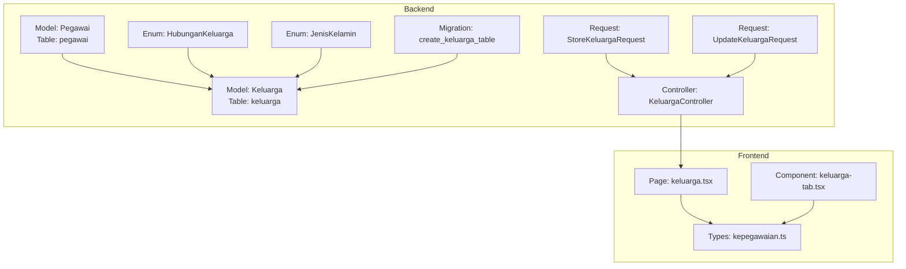
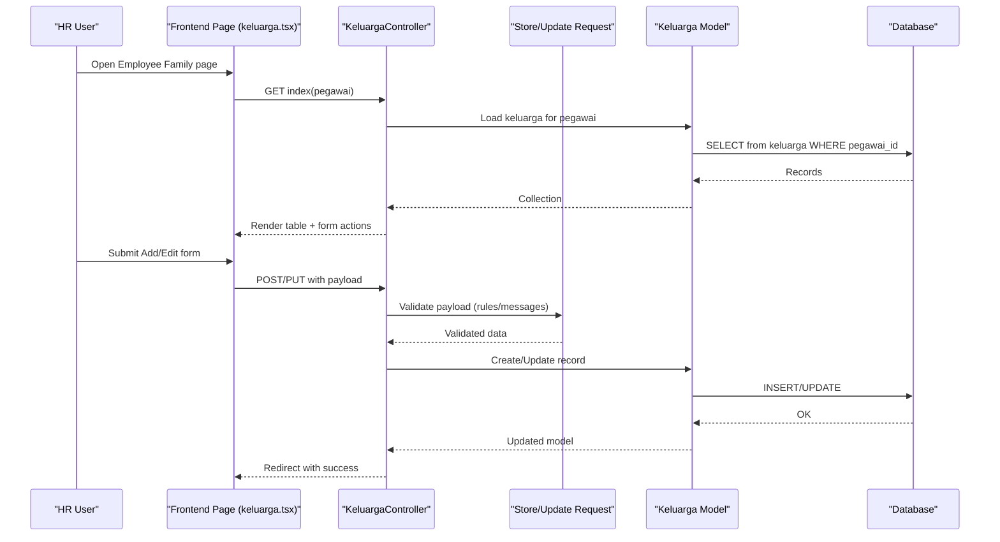
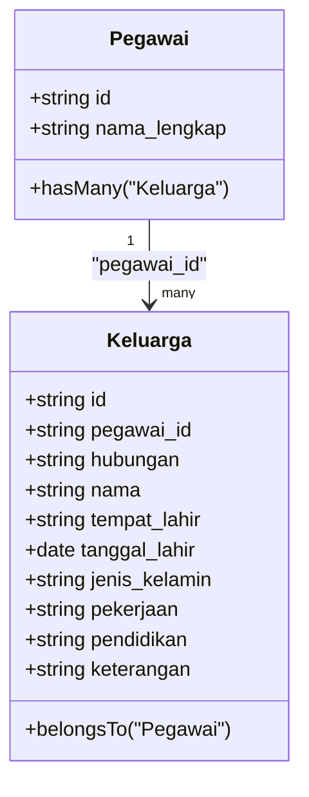
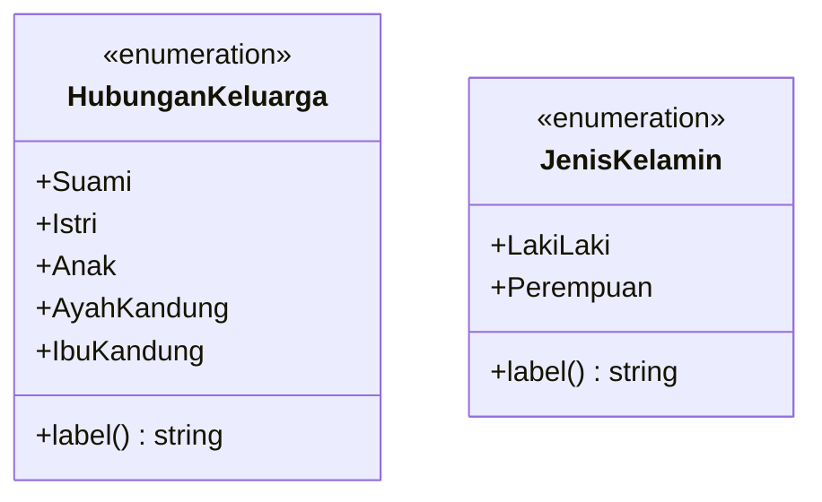
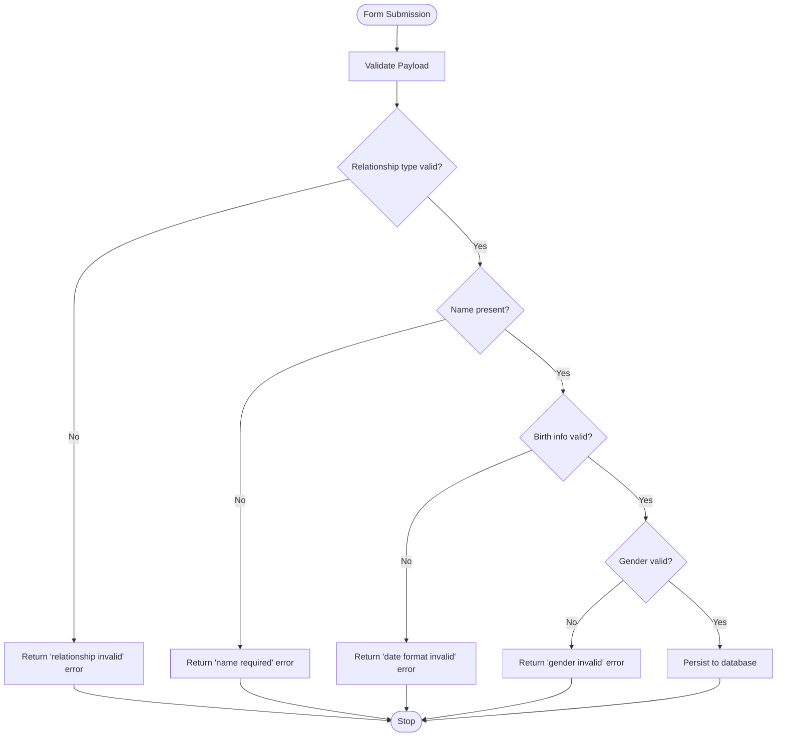
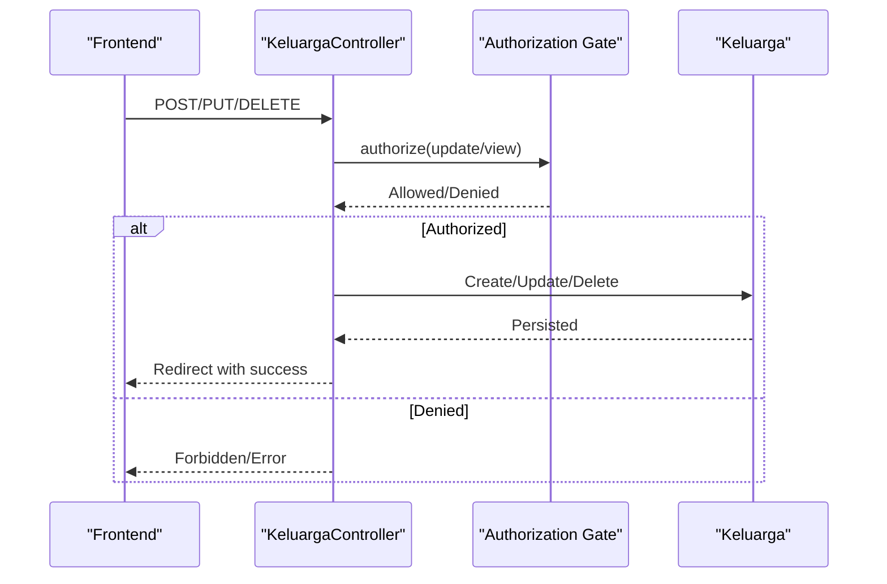
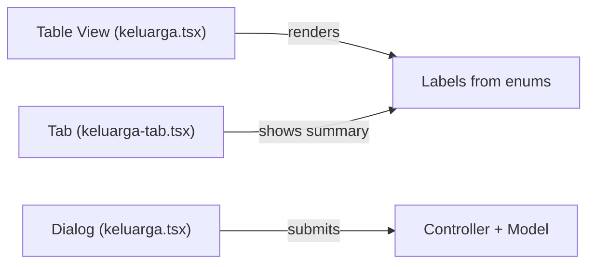
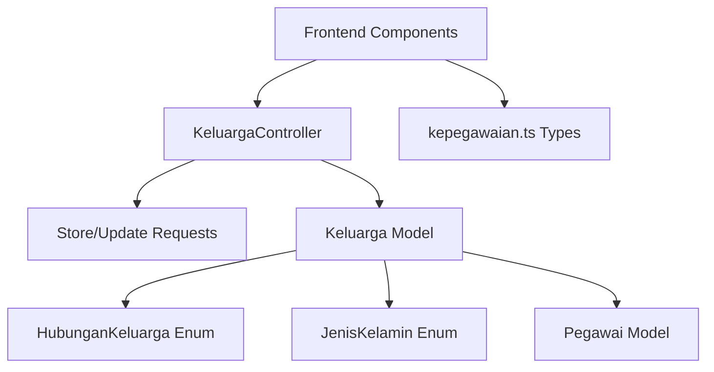

# Family and Personal Data

<cite>
**Referenced Files in This Document**
- [Keluarga.php](file://app/Models/Keluarga.php)
- [Pegawai.php](file://app/Models/Pegawai.php)
- [HubunganKeluarga.php](file://app/Enums/HubunganKeluarga.php)
- [JenisKelamin.php](file://app/Enums/JenisKelamin.php)
- [StoreKeluargaRequest.php](file://app/Http/Requests/Kepegawaian/StoreKeluargaRequest.php)
- [UpdateKeluargaRequest.php](file://app/Http/Requests/Kepegawaian/UpdateKeluargaRequest.php)
- [KeluargaController.php](file://app/Http/Controllers/Kepegawaian/KeluargaController.php)
- [2026_03_15_032415_create_keluarga_table.php](file://database/migrations/2026_03_15_032415_create_keluarga_table.php)
- [keluarga.tsx](file://resources/js/pages/kepegawaian/pegawai/keluarga.tsx)
- [keluarga-tab.tsx](file://resources/js/components/pegawai-tabs/keluarga-tab.tsx)
- [kepegawaian.ts](file://resources/js/types/kepegawaian.ts)
- [KeluargaTest.php](file://tests/Feature/Kepegawaian/KeluargaTest.php)
</cite>

## Table of Contents
1. [Introduction](#introduction)
2. [Project Structure](#project-structure)
3. [Core Components](#core-components)
4. [Architecture Overview](#architecture-overview)
5. [Detailed Component Analysis](#detailed-component-analysis)
6. [Dependency Analysis](#dependency-analysis)
7. [Performance Considerations](#performance-considerations)
8. [Troubleshooting Guide](#troubleshooting-guide)
9. [Conclusion](#conclusion)
10. [Appendices](#appendices)

## Introduction
This document explains the Family and Personal Data management system for employees. It covers how family relationships are modeled, validated, stored, and displayed. The system supports tracking spouses, children, and parents as family members, with optional personal details such as place and date of birth, gender, occupation, education, and notes. It also documents the relationship types supported, validation rules, UI patterns, and how family data integrates with employee records. Guidance is included for HR staff and developers to implement custom logic around family relationships, dependency calculations, and benefit integrations.

## Project Structure
The family data module spans backend Eloquent models and enums, form requests for validation, controller actions, database migrations, and frontend React components with TypeScript types.

**Diagram sources**
- [Keluarga.php:12-44](file://app/Models/Keluarga.php#L12-L44)
- [Pegawai.php:124-127](file://app/Models/Pegawai.php#L124-L127)
- [HubunganKeluarga.php:5-23](file://app/Enums/HubunganKeluarga.php#L5-L23)
- [JenisKelamin.php:5-17](file://app/Enums/JenisKelamin.php#L5-L17)
- [StoreKeluargaRequest.php:10-46](file://app/Http/Requests/Kepegawaian/StoreKeluargaRequest.php#L10-L46)
- [UpdateKeluargaRequest.php:10-46](file://app/Http/Requests/Kepegawaian/UpdateKeluargaRequest.php#L10-L46)
- [KeluargaController.php:15-90](file://app/Http/Controllers/Kepegawaian/KeluargaController.php#L15-L90)
- [2026_03_15_032415_create_keluarga_table.php:14-27](file://database/migrations/2026_03_15_032415_create_keluarga_table.php#L14-L27)
- [keluarga.tsx:105-477](file://resources/js/pages/kepegawaian/pegawai/keluarga.tsx#L105-L477)
- [keluarga-tab.tsx:7-42](file://resources/js/components/pegawai-tabs/keluarga-tab.tsx#L7-L42)
- [kepegawaian.ts:90-104](file://resources/js/types/kepegawaian.ts#L90-L104)

**Section sources**
- [Keluarga.php:12-44](file://app/Models/Keluarga.php#L12-L44)
- [Pegawai.php:124-127](file://app/Models/Pegawai.php#L124-L127)
- [HubunganKeluarga.php:5-23](file://app/Enums/HubunganKeluarga.php#L5-L23)
- [JenisKelamin.php:5-17](file://app/Enums/JenisKelamin.php#L5-L17)
- [StoreKeluargaRequest.php:10-46](file://app/Http/Requests/Kepegawaian/StoreKeluargaRequest.php#L10-L46)
- [UpdateKeluargaRequest.php:10-46](file://app/Http/Requests/Kepegawaian/UpdateKeluargaRequest.php#L10-L46)
- [KeluargaController.php:15-90](file://app/Http/Controllers/Kepegawaian/KeluargaController.php#L15-L90)
- [2026_03_15_032415_create_keluarga_table.php:14-27](file://database/migrations/2026_03_15_032415_create_keluarga_table.php#L14-L27)
- [keluarga.tsx:105-477](file://resources/js/pages/kepegawaian/pegawai/keluarga.tsx#L105-L477)
- [keluarga-tab.tsx:7-42](file://resources/js/components/pegawai-tabs/keluarga-tab.tsx#L7-L42)
- [kepegawaian.ts:90-104](file://resources/js/types/kepegawaian.ts#L90-L104)

## Core Components
- Model: Keluarga
  - Stores family member details linked to an employee via foreign key.
  - Casts relationship type and gender to enums, date fields to dates, and soft-deleted timestamps.
  - Defines belongs-to relationship to Pegawai.
- Model: Pegawai
  - Defines has-many relationship to Keluarga.
- Enums:
  - HubunganKeluarga: Supported relationship types (Spouse, Child, Parent).
  - JenisKelamin: Gender values with label mapping.
- Requests:
  - StoreKeluargaRequest and UpdateKeluargaRequest define validation rules for family member attributes.
- Controller: KeluargaController
  - Handles listing, creating, updating, and soft-deleting family members.
  - Enforces authorization and ensures records belong to the target employee.
- Frontend:
  - Page component renders the family table, edit/create dialog, and handles CRUD actions.
  - Tab component displays a compact summary in the employee detail view.
  - Types define frontend-safe enumerations mirroring backend enums.

**Section sources**
- [Keluarga.php:12-44](file://app/Models/Keluarga.php#L12-L44)
- [Pegawai.php:124-127](file://app/Models/Pegawai.php#L124-L127)
- [HubunganKeluarga.php:5-23](file://app/Enums/HubunganKeluarga.php#L5-L23)
- [JenisKelamin.php:5-17](file://app/Enums/JenisKelamin.php#L5-L17)
- [StoreKeluargaRequest.php:10-46](file://app/Http/Requests/Kepegawaian/StoreKeluargaRequest.php#L10-L46)
- [UpdateKeluargaRequest.php:10-46](file://app/Http/Requests/Kepegawaian/UpdateKeluargaRequest.php#L10-L46)
- [KeluargaController.php:15-90](file://app/Http/Controllers/Kepegawaian/KeluargaController.php#L15-L90)
- [keluarga.tsx:105-477](file://resources/js/pages/kepegawaian/pegawai/keluarga.tsx#L105-L477)
- [keluarga-tab.tsx:7-42](file://resources/js/components/pegawai-tabs/keluarga-tab.tsx#L7-L42)
- [kepegawaian.ts:90-104](file://resources/js/types/kepegawaian.ts#L90-L104)

## Architecture Overview
End-to-end flow for managing family data:

**Diagram sources**
- [KeluargaController.php:17-53](file://app/Http/Controllers/Kepegawaian/KeluargaController.php#L17-L53)
- [StoreKeluargaRequest.php:17-29](file://app/Http/Requests/Kepegawaian/StoreKeluargaRequest.php#L17-L29)
- [UpdateKeluargaRequest.php:17-29](file://app/Http/Requests/Kepegawaian/UpdateKeluargaRequest.php#L17-L29)
- [Keluarga.php:18-38](file://app/Models/Keluarga.php#L18-L38)
- [2026_03_15_032415_create_keluarga_table.php:14-27](file://database/migrations/2026_03_15_032415_create_keluarga_table.php#L14-L27)

## Detailed Component Analysis

### Data Model and Relationships
- Keluarga model
  - Fillable fields include relationship type, name, place/date of birth, gender, occupation, education, and notes.
  - Relationship type and gender are cast to enums; date fields are cast to date; soft-deleted timestamps are handled.
  - Belongs-to Pegawai via foreign key.
- Pegawai model
  - Has-many Keluarga via foreign key.
- Database migration
  - Creates the keluarga table with ulid primary key, foreign key to pegawai, and nullable fields for optional details.

**Diagram sources**
- [Pegawai.php:124-127](file://app/Models/Pegawai.php#L124-L127)
- [Keluarga.php:18-43](file://app/Models/Keluarga.php#L18-L43)
- [2026_03_15_032415_create_keluarga_table.php:14-27](file://database/migrations/2026_03_15_032415_create_keluarga_table.php#L14-L27)

**Section sources**
- [Keluarga.php:12-44](file://app/Models/Keluarga.php#L12-L44)
- [Pegawai.php:124-127](file://app/Models/Pegawai.php#L124-L127)
- [2026_03_15_032415_create_keluarga_table.php:14-27](file://database/migrations/2026_03_15_032415_create_keluarga_table.php#L14-L27)

### Relationship Types and Gender Enumerations
- Supported family relationship types:
  - Spouse (Suami/Istri)
  - Child (Anak)
  - Parents (AyahKandung/IbuKandung)
- Gender options:
  - Male, Female
- Labels:
  - Enums provide human-readable labels for UI rendering.

**Diagram sources**
- [HubunganKeluarga.php:5-23](file://app/Enums/HubunganKeluarga.php#L5-L23)
- [JenisKelamin.php:5-17](file://app/Enums/JenisKelamin.php#L5-L17)

**Section sources**
- [HubunganKeluarga.php:5-23](file://app/Enums/HubunganKeluarga.php#L5-L23)
- [JenisKelamin.php:5-17](file://app/Enums/JenisKelamin.php#L5-L17)
- [kepegawaian.ts:90-104](file://resources/js/types/kepegawaian.ts#L90-L104)

### Data Validation Rules
Validation rules for adding and editing family members:
- Required fields:
  - Relationship type (must be one of supported values)
  - Full name
- Optional fields:
  - Place of birth, date of birth (date format), gender, occupation, education, notes
- Messages:
  - Clear user-facing messages for each validation failure.

**Diagram sources**
- [StoreKeluargaRequest.php:17-29](file://app/Http/Requests/Kepegawaian/StoreKeluargaRequest.php#L17-L29)
- [UpdateKeluargaRequest.php:17-29](file://app/Http/Requests/Kepegawaian/UpdateKeluargaRequest.php#L17-L29)

**Section sources**
- [StoreKeluargaRequest.php:17-46](file://app/Http/Requests/Kepegawaian/StoreKeluargaRequest.php#L17-L46)
- [UpdateKeluargaRequest.php:17-46](file://app/Http/Requests/Kepegawaian/UpdateKeluargaRequest.php#L17-L46)
- [KeluargaTest.php:158-168](file://tests/Feature/Kepegawaian/KeluargaTest.php#L158-L168)

### Controller Behavior and Authorization
- Index action:
  - Authorizes access to the employee resource.
  - Returns paginated and ordered family members with computed labels and URLs for updates/deletes.
- Store action:
  - Validates input via form request.
  - Creates a new family member under the specified employee.
- Update action:
  - Validates input.
  - Ensures the record belongs to the employee before updating.
- Destroy action:
  - Ensures belonging, then performs soft delete.

**Diagram sources**
- [KeluargaController.php:17-90](file://app/Http/Controllers/Kepegawaian/KeluargaController.php#L17-L90)

**Section sources**
- [KeluargaController.php:17-90](file://app/Http/Controllers/Kepegawaian/KeluargaController.php#L17-L90)

### Data Display Patterns
- Page-level table:
  - Shows relationship type with label, name, gender, place/date of birth, occupation, and education.
  - Provides inline actions to edit or delete.
- Edit/Create dialog:
  - Selects relationship type from predefined options.
  - Inputs optional details and submits via POST or PUT.
- Employee detail tab:
  - Compact table with columns for name, relationship, gender, date of birth, and occupation.

**Diagram sources**
- [keluarga.tsx:203-304](file://resources/js/pages/kepegawaian/pegawai/keluarga.tsx#L203-L304)
- [keluarga.tsx:307-474](file://resources/js/pages/kepegawaian/pegawai/keluarga.tsx#L307-L474)
- [keluarga-tab.tsx:7-42](file://resources/js/components/pegawai-tabs/keluarga-tab.tsx#L7-L42)

**Section sources**
- [keluarga.tsx:203-304](file://resources/js/pages/kepegawaian/pegawai/keluarga.tsx#L203-L304)
- [keluarga.tsx:307-474](file://resources/js/pages/kepegawaian/pegawai/keluarga.tsx#L307-L474)
- [keluarga-tab.tsx:7-42](file://resources/js/components/pegawai-tabs/keluarga-tab.tsx#L7-L42)

### Configuration Options and Extensibility
- Relationship types:
  - Defined centrally in the HubunganKeluarga enum. Extend by adding cases and updating UI options.
- Gender options:
  - Defined in JenisKelamin enum; mirror in frontend types.
- Validation rules:
  - Centralized in form requests; modify to add new constraints or change messages.
- Display labels:
  - Enums expose label() methods; ensure frontend types align.

Implementation pointers:
- To add a new relationship type, update the enum and the frontend options mapping.
- To adjust validation rules, modify the form request rules and messages.
- To change display labels, update enum label() and frontend label maps.

**Section sources**
- [HubunganKeluarga.php:5-23](file://app/Enums/HubunganKeluarga.php#L5-L23)
- [JenisKelamin.php:5-17](file://app/Enums/JenisKelamin.php#L5-L17)
- [StoreKeluargaRequest.php:17-46](file://app/Http/Requests/Kepegawaian/StoreKeluargaRequest.php#L17-L46)
- [UpdateKeluargaRequest.php:17-46](file://app/Http/Requests/Kepegawaian/UpdateKeluargaRequest.php#L17-L46)
- [kepegawaian.ts:90-104](file://resources/js/types/kepegawaian.ts#L90-L104)

### Integration with Employee Records and Benefits
- Employee-Family linkage:
  - Each family member belongs to a single employee via foreign key.
- Benefit calculations:
  - The codebase does not implement benefit calculation logic; however, family data can be used as input for external systems or custom business logic.
  - Recommended approach: compute dependency status and benefit eligibility in a service layer that consumes the family data and applies policy rules.

[No sources needed since this section provides general guidance]

## Dependency Analysis
- Backend dependencies:
  - Controller depends on form requests for validation and on the model for persistence.
  - Model depends on enums for casting and on the employee model for relationships.
  - Migration defines the schema and foreign key constraints.
- Frontend dependencies:
  - Page component depends on types for safe typing and on enums for options and labels.
  - Tab component depends on types and controller-managed URLs.

**Diagram sources**
- [KeluargaController.php:5-14](file://app/Http/Controllers/Kepegawaian/KeluargaController.php#L5-L14)
- [StoreKeluargaRequest.php:5-8](file://app/Http/Requests/Kepegawaian/StoreKeluargaRequest.php#L5-L8)
- [UpdateKeluargaRequest.php:5-8](file://app/Http/Requests/Kepegawaian/UpdateKeluargaRequest.php#L5-L8)
- [Keluarga.php:5-7](file://app/Models/Keluarga.php#L5-L7)
- [Pegawai.php:24-26](file://app/Models/Pegawai.php#L24-L26)
- [kepegawaian.ts:90-104](file://resources/js/types/kepegawaian.ts#L90-L104)

**Section sources**
- [KeluargaController.php:5-14](file://app/Http/Controllers/Kepegawaian/KeluargaController.php#L5-L14)
- [StoreKeluargaRequest.php:5-8](file://app/Http/Requests/Kepegawaian/StoreKeluargaRequest.php#L5-L8)
- [UpdateKeluargaRequest.php:5-8](file://app/Http/Requests/Kepegawaian/UpdateKeluargaRequest.php#L5-L8)
- [Keluarga.php:5-7](file://app/Models/Keluarga.php#L5-L7)
- [Pegawai.php:24-26](file://app/Models/Pegawai.php#L24-L26)
- [kepegawaian.ts:90-104](file://resources/js/types/kepegawaian.ts#L90-L104)

## Performance Considerations
- Indexing:
  - Consider adding an index on the foreign key column for frequent queries by employee.
- Sorting and filtering:
  - The controller orders by relationship type and name; keep ordering minimal to avoid heavy sorts on large datasets.
- Soft deletes:
  - Soft-deleted records are excluded by default; ensure queries leverage this to avoid scanning deleted rows.
- Frontend rendering:
  - Paginate or virtualize long lists if family sizes grow significantly.

[No sources needed since this section provides general guidance]

## Troubleshooting Guide
Common issues and resolutions:
- Duplicate family member entries:
  - The system does not enforce uniqueness constraints by default. If duplicates are undesirable, add database-level unique constraints or application-level checks before insert/update.
- Relationship validation errors:
  - Ensure the submitted relationship type matches one of the supported enum values. Validation messages will indicate invalid values.
- Gender validation errors:
  - Gender must match enum values; otherwise, validation fails.
- Authorization failures:
  - Accessing another employee’s family data triggers authorization denial. Ensure the logged-in user has permission to view/update the target employee.
- Soft delete behavior:
  - Deletes are soft deletes; if records appear missing, check for trashed records.

Evidence and tests:
- Validation failures for invalid relationship type are covered by feature tests.
- Soft delete behavior is verified by tests.
- Access control is enforced by controller authorization gates.

**Section sources**
- [KeluargaTest.php:158-168](file://tests/Feature/Kepegawaian/KeluargaTest.php#L158-L168)
- [KeluargaTest.php:141-156](file://tests/Feature/Kepegawaian/KeluargaTest.php#L141-L156)
- [KeluargaController.php:19, 57, 66, 77:19-19](file://app/Http/Controllers/Kepegawaian/KeluargaController.php#L19-L19)
- [KeluargaController.php:86-89](file://app/Http/Controllers/Kepegawaian/KeluargaController.php#L86-L89)

## Conclusion
The Family and Personal Data module provides a robust foundation for tracking family relationships, validating inputs, and displaying family details alongside employee records. Its design leverages enums for consistency, form requests for validation, and a clear separation between backend models/controllers and frontend components. While benefit calculations are not implemented here, the structured data model and enums enable straightforward extension for dependency and benefit logic.

[No sources needed since this section summarizes without analyzing specific files]

## Appendices

### Concrete Examples from the Codebase
- Family member addition form:
  - Frontend dialog selects relationship type and captures optional details; submission uses POST to store endpoint.
  - Reference: [keluarga.tsx:307-474](file://resources/js/pages/kepegawaian/pegawai/keluarga.tsx#L307-L474)
- Relationship verification process:
  - Backend validates relationship type against enum; invalid values trigger validation errors.
  - References: [StoreKeluargaRequest.php:20](file://app/Http/Requests/Kepegawaian/StoreKeluargaRequest.php#L20), [KeluargaTest.php:158-168](file://tests/Feature/Kepegawaian/KeluargaTest.php#L158-L168)
- Data display patterns:
  - Table view shows relationship labels, names, and details; edit/delete actions are available per row.
  - References: [keluarga.tsx:203-304](file://resources/js/pages/kepegawaian/pegawai/keluarga.tsx#L203-L304), [keluarga-tab.tsx:7-42](file://resources/js/components/pegawai-tabs/keluarga-tab.tsx#L7-L42)

### Configuration Options Summary
- Relationship types:
  - Supported values: Spouse, Child, Parents.
  - Update by extending enum and frontend options.
- Age validation rules:
  - No built-in age validation; implement custom rules in form requests or services.
- Dependency calculations:
  - Not implemented in this module; integrate with external logic or services.

**Section sources**
- [HubunganKeluarga.php:7-11](file://app/Enums/HubunganKeluarga.php#L7-L11)
- [StoreKeluargaRequest.php:23](file://app/Http/Requests/Kepegawaian/StoreKeluargaRequest.php#L23)
- [kepegawaian.ts:92-97](file://resources/js/types/kepegawaian.ts#L92-L97)