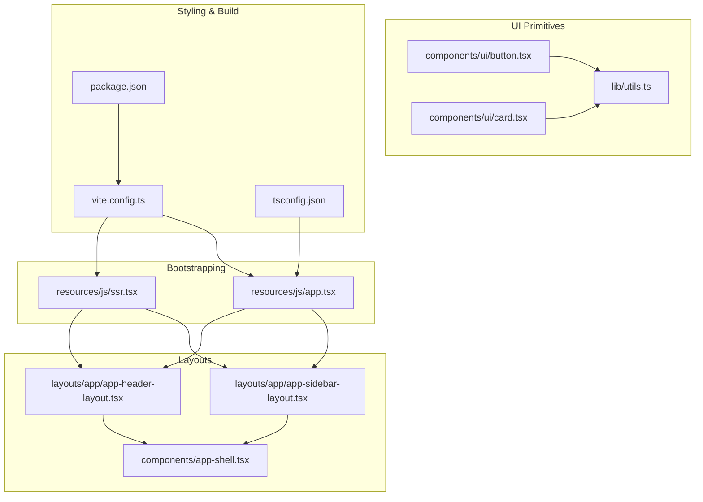
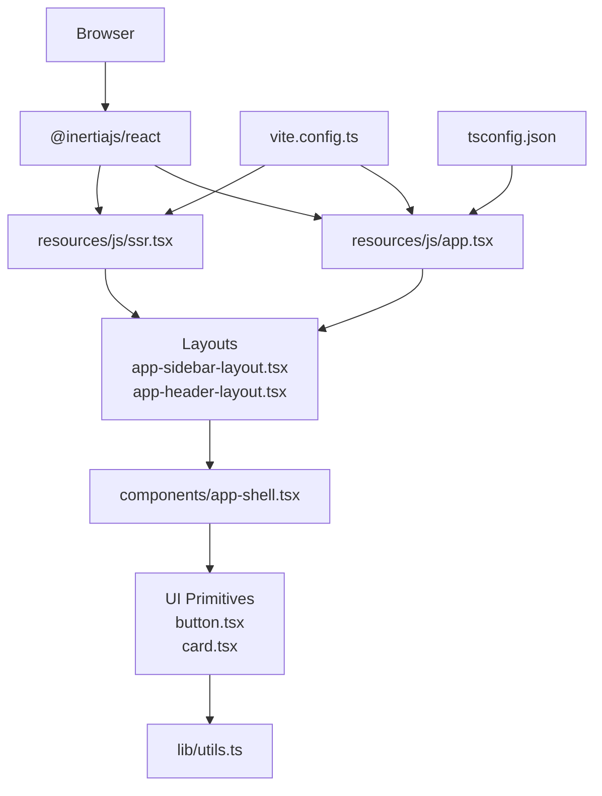
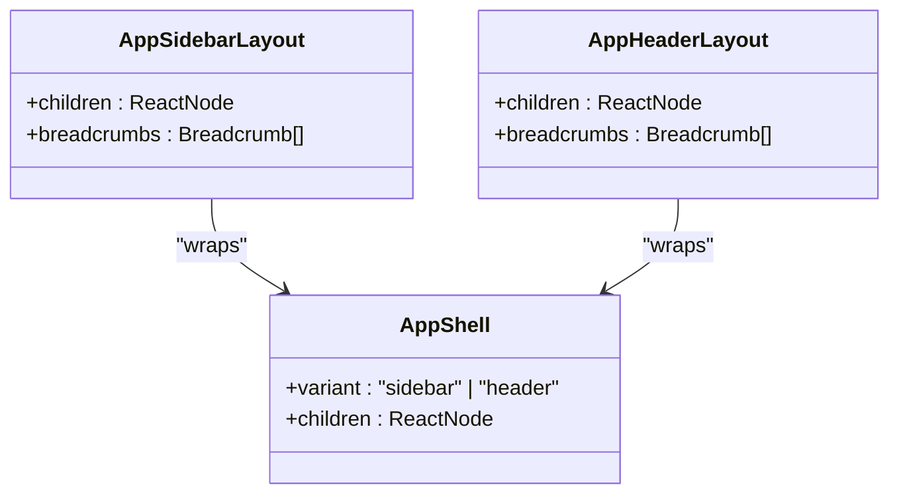
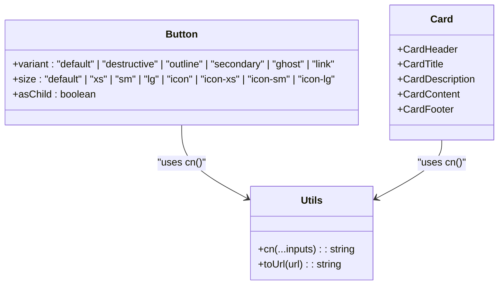
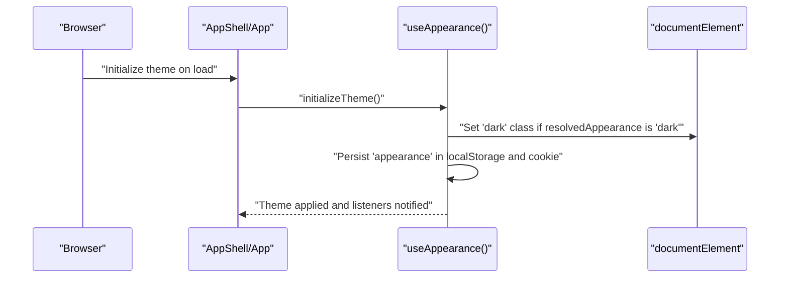
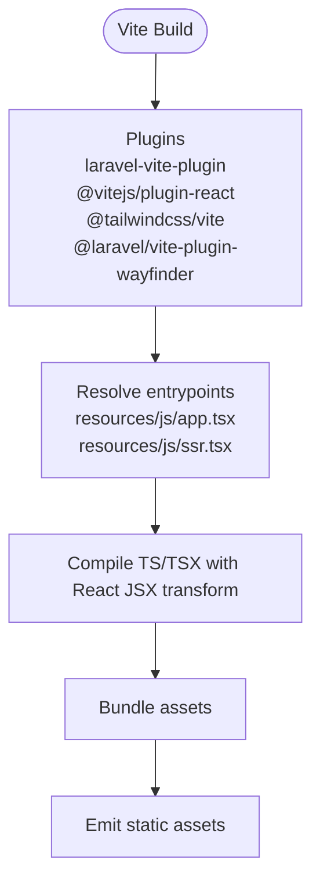
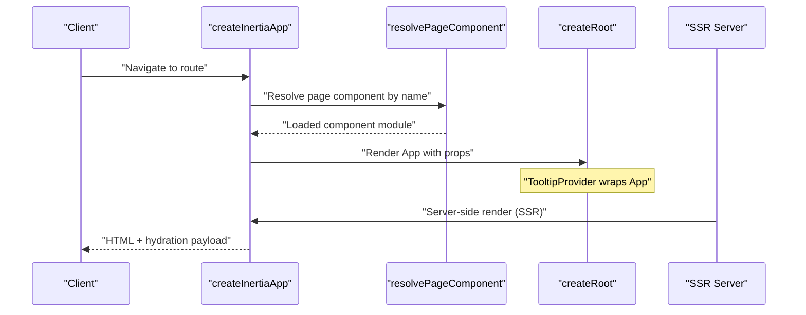
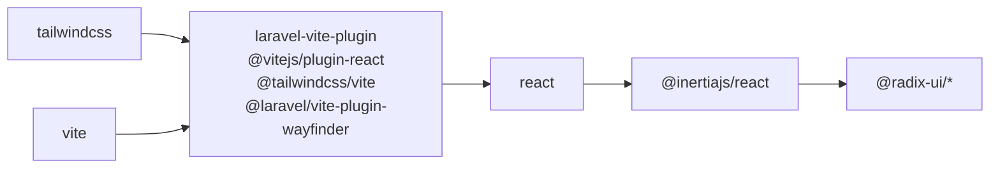

# Frontend Architecture

<cite>
**Referenced Files in This Document**
- [app.tsx](file://resources/js/app.tsx)
- [ssr.tsx](file://resources/js/ssr.tsx)
- [vite.config.ts](file://vite.config.ts)
- [package.json](file://package.json)
- [tsconfig.json](file://tsconfig.json)
- [app-shell.tsx](file://resources/js/components/app-shell.tsx)
- [app-sidebar-layout.tsx](file://resources/js/layouts/app/app-sidebar-layout.tsx)
- [app-header-layout.tsx](file://resources/js/layouts/app/app-header-layout.tsx)
- [button.tsx](file://resources/js/components/ui/button.tsx)
- [card.tsx](file://resources/js/components/ui/card.tsx)
- [utils.ts](file://resources/js/lib/utils.ts)
- [use-appearance.tsx](file://resources/js/hooks/use-appearance.tsx)
- [index.ts](file://resources/js/types/index.ts)
</cite>

## Table of Contents
1. [Introduction](#introduction)
2. [Project Structure](#project-structure)
3. [Core Components](#core-components)
4. [Architecture Overview](#architecture-overview)
5. [Detailed Component Analysis](#detailed-component-analysis)
6. [Dependency Analysis](#dependency-analysis)
7. [Performance Considerations](#performance-considerations)
8. [Troubleshooting Guide](#troubleshooting-guide)
9. [Conclusion](#conclusion)
10. [Appendices](#appendices)

## Introduction
This document explains the modern frontend architecture built with React and TypeScript, styled via Tailwind CSS, and integrated with Laravel through Inertia.js. It covers the component hierarchy, layout system, state management patterns, UI primitive library, build system, styling approach, and server-side rendering integration. The goal is to provide both conceptual guidance for frontend developers and technical depth for React specialists.

## Project Structure
The frontend is organized around three pillars:
- Application bootstrap and SSR setup
- Layouts and shell abstractions
- UI primitives and shared utilities

**Diagram sources**
- [app.tsx:1-36](file://resources/js/app.tsx#L1-L36)
- [ssr.tsx:1-28](file://resources/js/ssr.tsx#L1-L28)
- [app-sidebar-layout.tsx:1-21](file://resources/js/layouts/app/app-sidebar-layout.tsx#L1-L21)
- [app-header-layout.tsx:1-17](file://resources/js/layouts/app/app-header-layout.tsx#L1-L17)
- [app-shell.tsx:1-22](file://resources/js/components/app-shell.tsx#L1-L22)
- [button.tsx:1-65](file://resources/js/components/ui/button.tsx#L1-L65)
- [card.tsx:1-69](file://resources/js/components/ui/card.tsx#L1-L69)
- [utils.ts:1-13](file://resources/js/lib/utils.ts#L1-L13)
- [vite.config.ts:1-28](file://vite.config.ts#L1-L28)
- [package.json:1-77](file://package.json#L1-L77)
- [tsconfig.json:1-122](file://tsconfig.json#L1-L122)

**Section sources**
- [app.tsx:1-36](file://resources/js/app.tsx#L1-L36)
- [ssr.tsx:1-28](file://resources/js/ssr.tsx#L1-L28)
- [vite.config.ts:1-28](file://vite.config.ts#L1-L28)
- [package.json:1-77](file://package.json#L1-L77)
- [tsconfig.json:1-122](file://tsconfig.json#L1-L122)

## Core Components
- Application bootstrap: Initializes Inertia, resolves page components, renders the root, and sets up global providers.
- Layout system: Provides reusable layouts for sidebar and header variants, backed by a shell abstraction.
- UI primitives: A cohesive set of headless UI components built with Radix UI and styled via Tailwind, using class merging utilities.
- Utilities: Shared helpers for class composition and URL normalization.
- Appearance hook: Centralized theme management supporting system preference, persistence, and SSR.

Key implementation references:
- Bootstrapping and rendering: [app.tsx:11-32](file://resources/js/app.tsx#L11-L32)
- SSR setup: [ssr.tsx:9-27](file://resources/js/ssr.tsx#L9-L27)
- Layout composition: [app-sidebar-layout.tsx:7-20](file://resources/js/layouts/app/app-sidebar-layout.tsx#L7-L20), [app-header-layout.tsx:6-16](file://resources/js/layouts/app/app-header-layout.tsx#L6-L16)
- Shell abstraction: [app-shell.tsx:11-21](file://resources/js/components/app-shell.tsx#L11-L21)
- UI primitives: [button.tsx:7-39](file://resources/js/components/ui/button.tsx#L7-L39), [card.tsx:5-66](file://resources/js/components/ui/card.tsx#L5-L66)
- Utilities: [utils.ts:6-12](file://resources/js/lib/utils.ts#L6-L12)
- Appearance management: [use-appearance.tsx:90-115](file://resources/js/hooks/use-appearance.tsx#L90-L115)

**Section sources**
- [app.tsx:1-36](file://resources/js/app.tsx#L1-L36)
- [ssr.tsx:1-28](file://resources/js/ssr.tsx#L1-L28)
- [app-sidebar-layout.tsx:1-21](file://resources/js/layouts/app/app-sidebar-layout.tsx#L1-L21)
- [app-header-layout.tsx:1-17](file://resources/js/layouts/app/app-header-layout.tsx#L1-L17)
- [app-shell.tsx:1-22](file://resources/js/components/app-shell.tsx#L1-L22)
- [button.tsx:1-65](file://resources/js/components/ui/button.tsx#L1-L65)
- [card.tsx:1-69](file://resources/js/components/ui/card.tsx#L1-L69)
- [utils.ts:1-13](file://resources/js/lib/utils.ts#L1-L13)
- [use-appearance.tsx:1-116](file://resources/js/hooks/use-appearance.tsx#L1-L116)

## Architecture Overview
The frontend architecture integrates React with Inertia.js to deliver a seamless client-side experience while leveraging Laravel for routing, middleware, and SSR. The build pipeline uses Vite with plugins for React, Tailwind CSS, and Laravel integration. UI primitives are designed for composability and customization, while the layout system ensures consistent navigation and content areas.

**Diagram sources**
- [app.tsx:1-36](file://resources/js/app.tsx#L1-L36)
- [ssr.tsx:1-28](file://resources/js/ssr.tsx#L1-L28)
- [app-sidebar-layout.tsx:1-21](file://resources/js/layouts/app/app-sidebar-layout.tsx#L1-L21)
- [app-header-layout.tsx:1-17](file://resources/js/layouts/app/app-header-layout.tsx#L1-L17)
- [app-shell.tsx:1-22](file://resources/js/components/app-shell.tsx#L1-L22)
- [button.tsx:1-65](file://resources/js/components/ui/button.tsx#L1-L65)
- [card.tsx:1-69](file://resources/js/components/ui/card.tsx#L1-L69)
- [utils.ts:1-13](file://resources/js/lib/utils.ts#L1-L13)
- [vite.config.ts:1-28](file://vite.config.ts#L1-L28)
- [tsconfig.json:1-122](file://tsconfig.json#L1-L122)

## Detailed Component Analysis

### Layout System
The layout system provides two primary variants:
- Sidebar layout: Uses a sidebar provider and content area with a header bar and breadcrumbs.
- Header layout: Uses a top header and content area without a sidebar.

**Diagram sources**
- [app-shell.tsx:6-21](file://resources/js/components/app-shell.tsx#L6-L21)
- [app-sidebar-layout.tsx:7-20](file://resources/js/layouts/app/app-sidebar-layout.tsx#L7-L20)
- [app-header-layout.tsx:6-16](file://resources/js/layouts/app/app-header-layout.tsx#L6-L16)

Practical usage examples:
- Sidebar layout pattern: [app-sidebar-layout.tsx:7-20](file://resources/js/layouts/app/app-sidebar-layout.tsx#L7-L20)
- Header layout pattern: [app-header-layout.tsx:6-16](file://resources/js/layouts/app/app-header-layout.tsx#L6-L16)

**Section sources**
- [app-shell.tsx:1-22](file://resources/js/components/app-shell.tsx#L1-L22)
- [app-sidebar-layout.tsx:1-21](file://resources/js/layouts/app/app-sidebar-layout.tsx#L1-L21)
- [app-header-layout.tsx:1-17](file://resources/js/layouts/app/app-header-layout.tsx#L1-L17)

### UI Primitive Library
The UI primitives are built with Radix UI under the hood and styled with Tailwind CSS. They use a variant system and a shared class merging utility for consistent styling and composition.

**Diagram sources**
- [button.tsx:7-39](file://resources/js/components/ui/button.tsx#L7-L39)
- [card.tsx:5-66](file://resources/js/components/ui/card.tsx#L5-L66)
- [utils.ts:6-12](file://resources/js/lib/utils.ts#L6-L12)

Implementation details:
- Variants and sizes for buttons: [button.tsx:7-39](file://resources/js/components/ui/button.tsx#L7-L39)
- Card composition: [card.tsx:5-66](file://resources/js/components/ui/card.tsx#L5-L66)
- Class merging utility: [utils.ts:6-8](file://resources/js/lib/utils.ts#L6-L8)
- URL normalization utility: [utils.ts:10-12](file://resources/js/lib/utils.ts#L10-L12)

**Section sources**
- [button.tsx:1-65](file://resources/js/components/ui/button.tsx#L1-L65)
- [card.tsx:1-69](file://resources/js/components/ui/card.tsx#L1-L69)
- [utils.ts:1-13](file://resources/js/lib/utils.ts#L1-L13)

### Hook-Based State Management
The appearance hook demonstrates a centralized, external-store-like pattern for managing theme preferences across client and SSR contexts.

**Diagram sources**
- [use-appearance.tsx:73-88](file://resources/js/hooks/use-appearance.tsx#L73-L88)
- [app-shell.tsx:11-21](file://resources/js/components/app-shell.tsx#L11-L21)

Key behaviors:
- System preference detection and persistence
- SSR cookie synchronization
- Real-time updates via subscribers

**Section sources**
- [use-appearance.tsx:1-116](file://resources/js/hooks/use-appearance.tsx#L1-L116)
- [app-shell.tsx:1-22](file://resources/js/components/app-shell.tsx#L1-L22)

### Build System and Styling Approach
The build system leverages Vite with plugins for React, Tailwind CSS, and Laravel integration. TypeScript configuration enforces strictness and path aliases. The styling approach combines Tailwind utilities with a class merging strategy for predictable overrides.

**Diagram sources**
- [vite.config.ts:7-27](file://vite.config.ts#L7-L27)
- [package.json:5-14](file://package.json#L5-L14)
- [tsconfig.json:110-115](file://tsconfig.json#L110-L115)

**Section sources**
- [vite.config.ts:1-28](file://vite.config.ts#L1-L28)
- [package.json:1-77](file://package.json#L1-L77)
- [tsconfig.json:1-122](file://tsconfig.json#L1-L122)

### Inertia.js Integration
Inertia bridges the Laravel backend with React frontends. The application resolves page components dynamically and renders them with React root and SSR support.

**Diagram sources**
- [app.tsx:11-32](file://resources/js/app.tsx#L11-L32)
- [ssr.tsx:9-27](file://resources/js/ssr.tsx#L9-L27)

**Section sources**
- [app.tsx:1-36](file://resources/js/app.tsx#L1-L36)
- [ssr.tsx:1-28](file://resources/js/ssr.tsx#L1-L28)

## Dependency Analysis
The frontend stack relies on a small set of core libraries and a curated plugin ecosystem. Dependencies are declared in package.json, while Vite orchestrates the build and development experience.

**Diagram sources**
- [package.json:32-67](file://package.json#L32-L67)
- [vite.config.ts:8-23](file://vite.config.ts#L8-L23)

**Section sources**
- [package.json:1-77](file://package.json#L1-L77)
- [vite.config.ts:1-28](file://vite.config.ts#L1-L28)

## Performance Considerations
- Prefer component-level lazy loading and code splitting via Inertia’s dynamic page resolution.
- Use the variant system in UI primitives to minimize custom CSS and leverage shared styles.
- Keep class merging minimal to reduce bundle size; consolidate repeated utility classes.
- Utilize SSR for initial page loads to improve perceived performance and SEO.
- Monitor theme switching costs; the appearance hook is optimized to avoid unnecessary re-renders.

## Troubleshooting Guide
Common issues and remedies:
- Theme not persisting across reloads: Verify localStorage and cookie handling in the appearance hook initialization and update flows.
  - Reference: [use-appearance.tsx:73-88](file://resources/js/hooks/use-appearance.tsx#L73-L88), [use-appearance.tsx:101-112](file://resources/js/hooks/use-appearance.tsx#L101-L112)
- SSR mismatch after hydration: Ensure SSR and client-side providers align (e.g., TooltipProvider wrapping App).
  - Reference: [app.tsx:21-27](file://resources/js/app.tsx#L21-L27), [ssr.tsx:19-25](file://resources/js/ssr.tsx#L19-L25)
- Tailwind utilities not applying: Confirm Tailwind CSS is enabled and configured in Vite; verify class merging utility usage.
  - Reference: [vite.config.ts:19-19](file://vite.config.ts#L19-L19), [utils.ts:6-8](file://resources/js/lib/utils.ts#L6-L8)
- TypeScript errors in JSX: Ensure tsconfig JSX settings and module resolution are correct.
  - Reference: [tsconfig.json:110-115](file://tsconfig.json#L110-L115), [tsconfig.json:30-30](file://tsconfig.json#L30-L30)

**Section sources**
- [use-appearance.tsx:73-112](file://resources/js/hooks/use-appearance.tsx#L73-L112)
- [app.tsx:18-27](file://resources/js/app.tsx#L18-L27)
- [ssr.tsx:19-25](file://resources/js/ssr.tsx#L19-L25)
- [vite.config.ts:19-19](file://vite.config.ts#L19-L19)
- [utils.ts:6-8](file://resources/js/lib/utils.ts#L6-L8)
- [tsconfig.json:110-115](file://tsconfig.json#L110-L115)

## Conclusion
This frontend architecture combines React and TypeScript with Tailwind CSS and Inertia.js to deliver a maintainable, scalable, and developer-friendly user interface. The layout system and UI primitives promote consistency and reuse, while the appearance hook and SSR setup ensure a smooth user experience across environments. The build system and strict TypeScript configuration provide reliability and predictability.

## Appendices
- Practical examples:
  - Using the button primitive with variants and sizes: [button.tsx:41-62](file://resources/js/components/ui/button.tsx#L41-L62)
  - Composing a card with header, title, description, content, and footer: [card.tsx:5-66](file://resources/js/components/ui/card.tsx#L5-L66)
  - Applying a layout variant in a page:
    - Sidebar layout: [app-sidebar-layout.tsx:7-20](file://resources/js/layouts/app/app-sidebar-layout.tsx#L7-L20)
    - Header layout: [app-header-layout.tsx:6-16](file://resources/js/layouts/app/app-header-layout.tsx#L6-L16)
- Type system:
  - Centralized type re-exports: [index.ts:1-6](file://resources/js/types/index.ts#L1-L6)