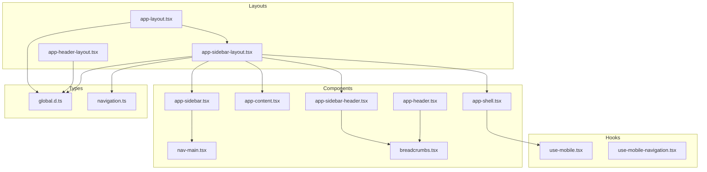
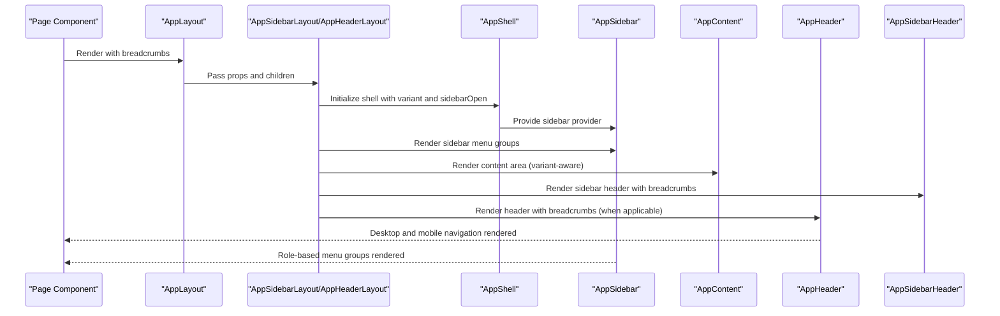
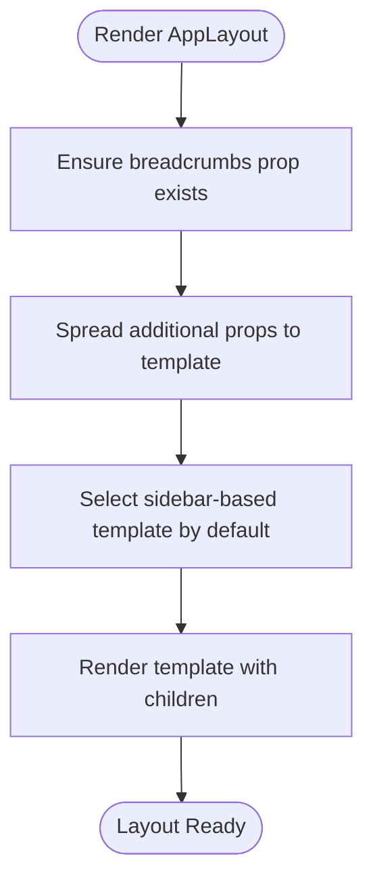
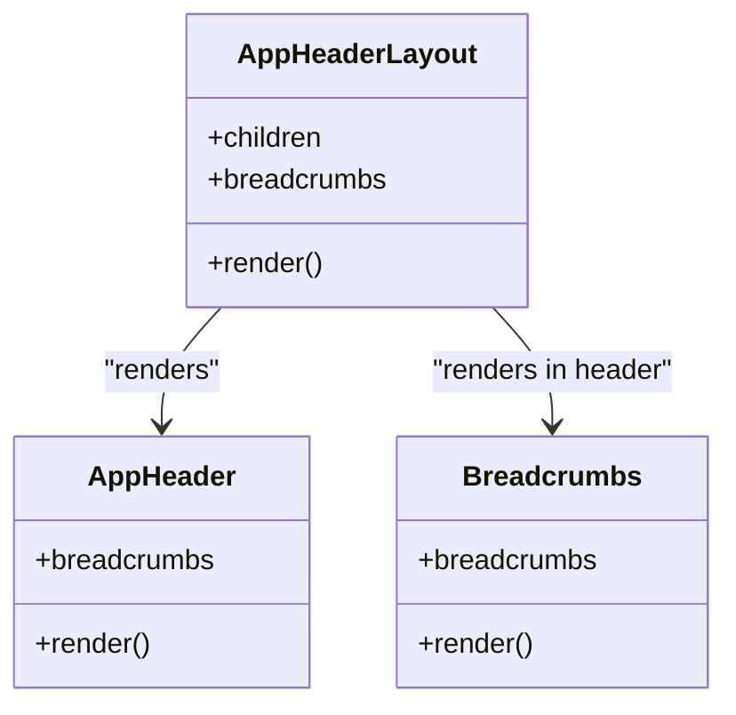
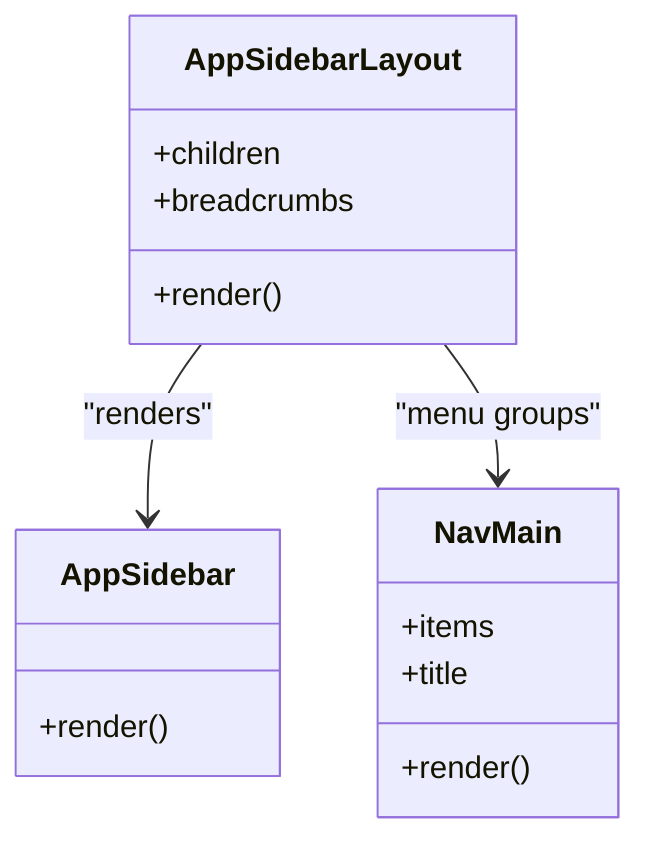
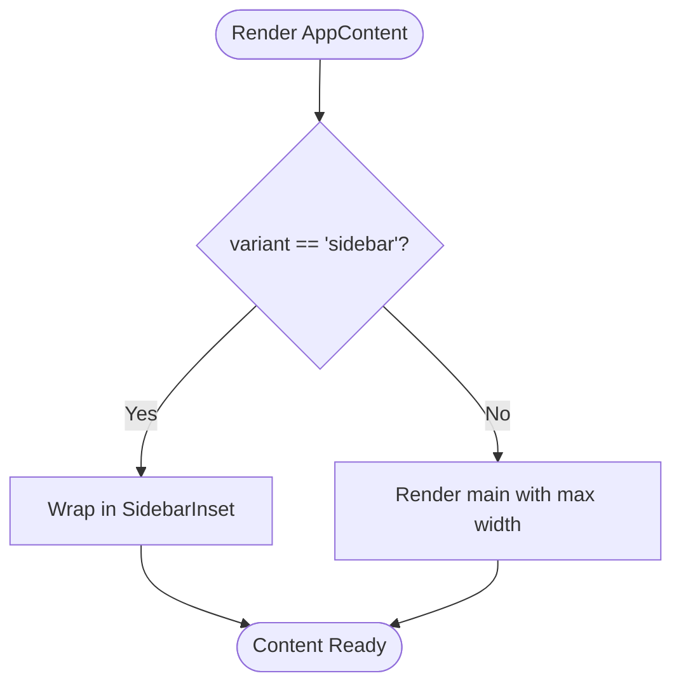
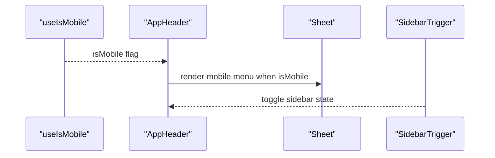
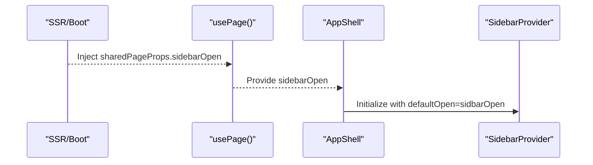
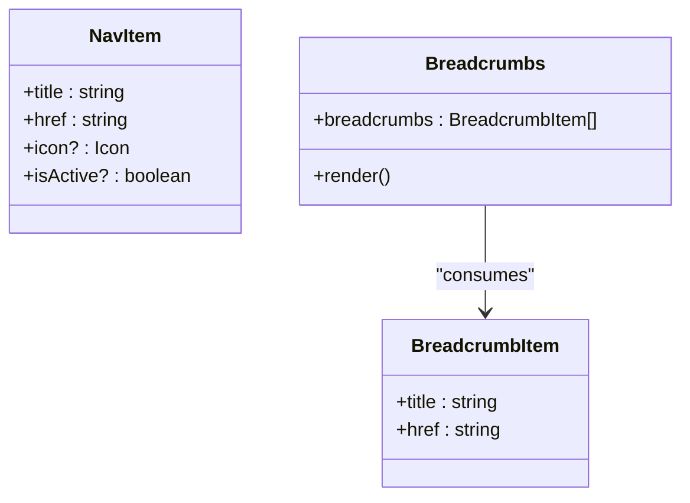
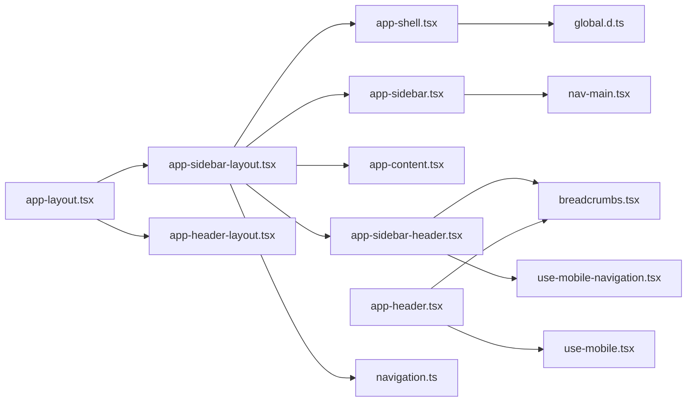

# Application Layouts

<cite>
**Referenced Files in This Document**
- [app-layout.tsx](file://resources/js/layouts/app-layout.tsx)
- [app-header-layout.tsx](file://resources/js/layouts/app/app-header-layout.tsx)
- [app-sidebar-layout.tsx](file://resources/js/layouts/app/app-sidebar-layout.tsx)
- [app-shell.tsx](file://resources/js/components/app-shell.tsx)
- [app-content.tsx](file://resources/js/components/app-content.tsx)
- [app-header.tsx](file://resources/js/components/app-header.tsx)
- [app-sidebar.tsx](file://resources/js/components/app-sidebar.tsx)
- [app-sidebar-header.tsx](file://resources/js/components/app-sidebar-header.tsx)
- [nav-main.tsx](file://resources/js/components/nav-main.tsx)
- [breadcrumbs.tsx](file://resources/js/components/breadcrumbs.tsx)
- [use-mobile.tsx](file://resources/js/hooks/use-mobile.tsx)
- [use-mobile-navigation.tsx](file://resources/js/hooks/use-mobile-navigation.tsx)
- [global.d.ts](file://resources/js/types/global.d.ts)
- [navigation.ts](file://resources/js/types/navigation.ts)
</cite>

## Table of Contents
1. [Introduction](#introduction)
2. [Project Structure](#project-structure)
3. [Core Components](#core-components)
4. [Architecture Overview](#architecture-overview)
5. [Detailed Component Analysis](#detailed-component-analysis)
6. [Dependency Analysis](#dependency-analysis)
7. [Performance Considerations](#performance-considerations)
8. [Troubleshooting Guide](#troubleshooting-guide)
9. [Conclusion](#conclusion)

## Introduction
This document describes the Application Layouts subsystem that orchestrates the main application shell, header navigation, sidebar menu, and content areas. It explains how layouts are composed, how props are inherited and passed down, how breadcrumbs integrate, and how responsive behavior and navigation state are managed. It also covers role-based conditional rendering, mobile navigation patterns, theme integration via shared page props, layout persistence, and performance optimization for layout transitions.

## Project Structure
The layout system is organized under resources/js/layouts and resources/js/components, with supporting types and hooks under resources/js/types and resources/js/hooks. The main entry for application layouts is app-layout.tsx, which delegates to a sidebar-based template. Header and sidebar variants are provided as separate layout templates.

**Diagram sources**
- [app-layout.tsx:1-9](file://resources/js/layouts/app-layout.tsx#L1-L9)
- [app-header-layout.tsx:1-17](file://resources/js/layouts/app/app-header-layout.tsx#L1-L17)
- [app-sidebar-layout.tsx:1-21](file://resources/js/layouts/app/app-sidebar-layout.tsx#L1-L21)
- [app-shell.tsx:1-22](file://resources/js/components/app-shell.tsx#L1-L22)
- [app-content.tsx:1-23](file://resources/js/components/app-content.tsx#L1-L23)
- [app-header.tsx:1-188](file://resources/js/components/app-header.tsx#L1-L188)
- [app-sidebar.tsx:1-162](file://resources/js/components/app-sidebar.tsx#L1-L162)
- [app-sidebar-header.tsx:1-19](file://resources/js/components/app-sidebar-header.tsx#L1-L19)
- [nav-main.tsx:1-43](file://resources/js/components/nav-main.tsx#L1-L43)
- [breadcrumbs.tsx:1-51](file://resources/js/components/breadcrumbs.tsx#L1-L51)
- [global.d.ts:1-13](file://resources/js/types/global.d.ts#L1-L13)
- [navigation.ts:1-20](file://resources/js/types/navigation.ts#L1-L20)
- [use-mobile.tsx:1-37](file://resources/js/hooks/use-mobile.tsx#L1-L37)
- [use-mobile-navigation.tsx:1-11](file://resources/js/hooks/use-mobile-navigation.tsx#L1-L11)

**Section sources**
- [app-layout.tsx:1-9](file://resources/js/layouts/app-layout.tsx#L1-L9)
- [app-header-layout.tsx:1-17](file://resources/js/layouts/app/app-header-layout.tsx#L1-L17)
- [app-sidebar-layout.tsx:1-21](file://resources/js/layouts/app/app-sidebar-layout.tsx#L1-L21)

## Core Components
- AppLayout (app-layout.tsx): Thin wrapper that forwards breadcrumbs and other props to the sidebar-based template.
- AppHeaderLayout (app-header-layout.tsx): Header-only layout variant that renders header and content inside a header-oriented shell.
- AppSidebarLayout (app-sidebar-layout.tsx): Sidebar-based layout variant that renders sidebar, content inset, and a sidebar-specific header with breadcrumbs.
- AppShell (app-shell.tsx): Provides the shell container with variant-aware rendering and sidebar provider initialization using shared page props.
- AppContent (app-content.tsx): Variant-aware content container; uses SidebarInset for sidebar variant and a standard main element for header variant.
- AppHeader (app-header.tsx): Desktop and mobile navigation bar with logo, desktop navigation menu, search affordance, and user menu with avatar fallback.
- AppSidebar (app-sidebar.tsx): Collapsible sidebar with role-based conditional menu groups and a footer user panel.
- AppSidebarHeader (app-sidebar-header.tsx): Sidebar header with breadcrumb and trigger to toggle sidebar.
- NavMain (nav-main.tsx): Renders grouped navigation items with active-state detection.
- Breadcrumbs (breadcrumbs.tsx): Renders breadcrumb trail with links and current page indicator.
- Types: Global page props include shared auth and sidebarOpen state; navigation types define NavItem and BreadcrumbItem shapes.
- Hooks: useIsMobile detects viewport breakpoints; useMobileNavigation restores body pointer-events after mobile navigation.

**Section sources**
- [app-layout.tsx:1-9](file://resources/js/layouts/app-layout.tsx#L1-L9)
- [app-header-layout.tsx:1-17](file://resources/js/layouts/app/app-header-layout.tsx#L1-L17)
- [app-sidebar-layout.tsx:1-21](file://resources/js/layouts/app/app-sidebar-layout.tsx#L1-L21)
- [app-shell.tsx:1-22](file://resources/js/components/app-shell.tsx#L1-L22)
- [app-content.tsx:1-23](file://resources/js/components/app-content.tsx#L1-L23)
- [app-header.tsx:1-188](file://resources/js/components/app-header.tsx#L1-L188)
- [app-sidebar.tsx:1-162](file://resources/js/components/app-sidebar.tsx#L1-L162)
- [app-sidebar-header.tsx:1-19](file://resources/js/components/app-sidebar-header.tsx#L1-L19)
- [nav-main.tsx:1-43](file://resources/js/components/nav-main.tsx#L1-L43)
- [breadcrumbs.tsx:1-51](file://resources/js/components/breadcrumbs.tsx#L1-L51)
- [global.d.ts:1-13](file://resources/js/types/global.d.ts#L1-L13)
- [navigation.ts:1-20](file://resources/js/types/navigation.ts#L1-L20)
- [use-mobile.tsx:1-37](file://resources/js/hooks/use-mobile.tsx#L1-L37)
- [use-mobile-navigation.tsx:1-11](file://resources/js/hooks/use-mobile-navigation.tsx#L1-L11)

## Architecture Overview
The layout architecture follows a composition pattern:
- A top-level AppLayout selects a template variant (sidebar-based by default).
- Each template composes AppShell, which sets up the sidebar provider and variant-specific container.
- Content areas are variant-aware: sidebar variant uses SidebarInset; header variant uses a centered main container.
- Navigation is split into header (desktop/mobile) and sidebar (persistent) with role-based visibility.
- Breadcrumbs are integrated either in the header or sidebar header depending on the template.

**Diagram sources**
- [app-layout.tsx:1-9](file://resources/js/layouts/app-layout.tsx#L1-L9)
- [app-sidebar-layout.tsx:1-21](file://resources/js/layouts/app/app-sidebar-layout.tsx#L1-L21)
- [app-header-layout.tsx:1-17](file://resources/js/layouts/app/app-header-layout.tsx#L1-L17)
- [app-shell.tsx:1-22](file://resources/js/components/app-shell.tsx#L1-L22)
- [app-sidebar.tsx:1-162](file://resources/js/components/app-sidebar.tsx#L1-L162)
- [app-content.tsx:1-23](file://resources/js/components/app-content.tsx#L1-L23)
- [app-header.tsx:1-188](file://resources/js/components/app-header.tsx#L1-L188)
- [app-sidebar-header.tsx:1-19](file://resources/js/components/app-sidebar-header.tsx#L1-L19)

## Detailed Component Analysis

### AppLayout Composition and Props Inheritance
- AppLayout receives breadcrumbs and spreads additional props to the selected template.
- The default template is the sidebar-based layout, ensuring breadcrumbs and sidebarOpen are consistently provided.

**Diagram sources**
- [app-layout.tsx:1-9](file://resources/js/layouts/app-layout.tsx#L1-L9)

**Section sources**
- [app-layout.tsx:1-9](file://resources/js/layouts/app-layout.tsx#L1-L9)

### Header Layout with Navigation and Breadcrumbs
- AppHeaderLayout composes AppShell with header variant, AppHeader, and AppContent with header variant.
- AppHeader provides:
  - Mobile navigation via Sheet with a compact menu.
  - Desktop navigation using NavigationMenu with active-state underline.
  - Search affordance and user menu with avatar fallback.
  - Conditional breadcrumb bar when breadcrumbs length > 1.

**Diagram sources**
- [app-header-layout.tsx:1-17](file://resources/js/layouts/app/app-header-layout.tsx#L1-L17)
- [app-header.tsx:1-188](file://resources/js/components/app-header.tsx#L1-L188)
- [breadcrumbs.tsx:1-51](file://resources/js/components/breadcrumbs.tsx#L1-L51)

**Section sources**
- [app-header-layout.tsx:1-17](file://resources/js/layouts/app/app-header-layout.tsx#L1-L17)
- [app-header.tsx:1-188](file://resources/js/components/app-header.tsx#L1-L188)
- [breadcrumbs.tsx:1-51](file://resources/js/components/breadcrumbs.tsx#L1-L51)

### Sidebar Layout with Menu Structure and Role-Based Visibility
- AppSidebarLayout composes AppShell with sidebar variant, AppSidebar, AppContent with sidebar variant, and AppSidebarHeader.
- AppSidebar builds menu groups conditionally based on user permissions:
  - Main items (Dashboard, Self-service, Settings)
  - Kepegawaian group (conditional on permission)
  - Monitoring group (conditional on permission)
  - Referensi group (conditional on permissions)
  - IAM group (conditional on permission)
- NavMain renders grouped items with active-state detection using parent URL matching.

**Diagram sources**
- [app-sidebar-layout.tsx:1-21](file://resources/js/layouts/app/app-sidebar-layout.tsx#L1-L21)
- [app-sidebar.tsx:1-162](file://resources/js/components/app-sidebar.tsx#L1-L162)
- [nav-main.tsx:1-43](file://resources/js/components/nav-main.tsx#L1-L43)

**Section sources**
- [app-sidebar-layout.tsx:1-21](file://resources/js/layouts/app/app-sidebar-layout.tsx#L1-L21)
- [app-sidebar.tsx:1-162](file://resources/js/components/app-sidebar.tsx#L1-L162)
- [nav-main.tsx:1-43](file://resources/js/components/nav-main.tsx#L1-L43)

### Content Area Management and Variants
- AppContent switches behavior based on variant:
  - Sidebar variant wraps children in SidebarInset for proper spacing and scrolling.
  - Header variant uses a centered main element with max width and padding.
- AppShell manages variant selection and initializes the sidebar provider with sidebarOpen from shared page props.

**Diagram sources**
- [app-content.tsx:1-23](file://resources/js/components/app-content.tsx#L1-L23)
- [app-shell.tsx:1-22](file://resources/js/components/app-shell.tsx#L1-L22)

**Section sources**
- [app-content.tsx:1-23](file://resources/js/components/app-content.tsx#L1-L23)
- [app-shell.tsx:1-22](file://resources/js/components/app-shell.tsx#L1-L22)

### Responsive Behavior and Mobile Navigation Patterns
- useIsMobile detects viewport width below 768px using matchMedia and syncs with React’s useSyncExternalStore.
- AppHeader integrates a Sheet-based mobile menu that renders main navigation items and respects pointer-events cleanup via useMobileNavigation.
- AppSidebarHeader includes a SidebarTrigger to toggle the sidebar on small screens.

**Diagram sources**
- [use-mobile.tsx:1-37](file://resources/js/hooks/use-mobile.tsx#L1-L37)
- [app-header.tsx:1-188](file://resources/js/components/app-header.tsx#L1-L188)
- [app-sidebar-header.tsx:1-19](file://resources/js/components/app-sidebar-header.tsx#L1-L19)

**Section sources**
- [use-mobile.tsx:1-37](file://resources/js/hooks/use-mobile.tsx#L1-L37)
- [app-header.tsx:1-188](file://resources/js/components/app-header.tsx#L1-L188)
- [app-sidebar-header.tsx:1-19](file://resources/js/components/app-sidebar-header.tsx#L1-L19)

### Navigation State Management and Persistence
- Shared page props include sidebarOpen, which AppShell reads to initialize the SidebarProvider with the persisted open state.
- Global typing extends InertiaConfig to include sharedPageProps with sidebarOpen, enabling server-side hydration of layout state.

**Diagram sources**
- [global.d.ts:1-13](file://resources/js/types/global.d.ts#L1-L13)
- [app-shell.tsx:1-22](file://resources/js/components/app-shell.tsx#L1-L22)

**Section sources**
- [global.d.ts:1-13](file://resources/js/types/global.d.ts#L1-L13)
- [app-shell.tsx:1-22](file://resources/js/components/app-shell.tsx#L1-L22)

### Breadcrumb Integration
- Breadcrumbs are rendered in two places:
  - AppHeader: conditional bar below the header when breadcrumbs length > 1.
  - AppSidebarHeader: within the sidebar header alongside the trigger.
- BreadcrumbItem and NavItem types define the shape of navigation data.

**Diagram sources**
- [breadcrumbs.tsx:1-51](file://resources/js/components/breadcrumbs.tsx#L1-L51)
- [navigation.ts:1-20](file://resources/js/types/navigation.ts#L1-L20)

**Section sources**
- [breadcrumbs.tsx:1-51](file://resources/js/components/breadcrumbs.tsx#L1-L51)
- [navigation.ts:1-20](file://resources/js/types/navigation.ts#L1-L20)

### Theme Integration
- Theme-aware styles are applied via Tailwind classes and component variants (e.g., dark mode classes on interactive elements).
- Active states and hover effects use theme-appropriate colors for light/dark modes.

**Section sources**
- [app-header.tsx:1-188](file://resources/js/components/app-header.tsx#L1-L188)
- [app-sidebar.tsx:1-162](file://resources/js/components/app-sidebar.tsx#L1-L162)

### Layout Switching Examples
- Switching from header-only to sidebar-based layout is achieved by selecting the respective template in AppLayout or page-level composition.
- To switch, replace the template import and pass the same breadcrumbs and children.

**Section sources**
- [app-layout.tsx:1-9](file://resources/js/layouts/app-layout.tsx#L1-L9)
- [app-header-layout.tsx:1-17](file://resources/js/layouts/app/app-header-layout.tsx#L1-L17)
- [app-sidebar-layout.tsx:1-21](file://resources/js/layouts/app/app-sidebar-layout.tsx#L1-L21)

### Conditional Rendering Based on User Roles
- AppSidebar constructs menu groups using permission checks:
  - hasPermission for single permission checks.
  - hasAnyPermission for multiple optional permissions.
- Groups include Kepegawaian, Monitoring, Referensi, and IAM based on granted permissions.

**Section sources**
- [app-sidebar.tsx:1-162](file://resources/js/components/app-sidebar.tsx#L1-L162)

### Mobile Navigation Patterns
- Sheet-based mobile menu in AppHeader collapses navigation into a left-side drawer on small screens.
- useMobileNavigation restores body pointer-events after closing the drawer.
- useIsMobile determines breakpoint behavior.

**Section sources**
- [app-header.tsx:1-188](file://resources/js/components/app-header.tsx#L1-L188)
- [use-mobile-navigation.tsx:1-11](file://resources/js/hooks/use-mobile-navigation.tsx#L1-L11)
- [use-mobile.tsx:1-37](file://resources/js/hooks/use-mobile.tsx#L1-L37)

## Dependency Analysis
The layout system exhibits clear separation of concerns:
- Layouts depend on components for shell, content, header, sidebar, and breadcrumbs.
- Components depend on UI primitives and shared types.
- Hooks encapsulate responsive behavior and DOM manipulation.
- Types define the contract for shared page props and navigation data.

**Diagram sources**
- [app-layout.tsx:1-9](file://resources/js/layouts/app-layout.tsx#L1-L9)
- [app-sidebar-layout.tsx:1-21](file://resources/js/layouts/app/app-sidebar-layout.tsx#L1-L21)
- [app-header-layout.tsx:1-17](file://resources/js/layouts/app/app-header-layout.tsx#L1-L17)
- [app-shell.tsx:1-22](file://resources/js/components/app-shell.tsx#L1-L22)
- [app-content.tsx:1-23](file://resources/js/components/app-content.tsx#L1-L23)
- [app-header.tsx:1-188](file://resources/js/components/app-header.tsx#L1-L188)
- [app-sidebar.tsx:1-162](file://resources/js/components/app-sidebar.tsx#L1-L162)
- [app-sidebar-header.tsx:1-19](file://resources/js/components/app-sidebar-header.tsx#L1-L19)
- [nav-main.tsx:1-43](file://resources/js/components/nav-main.tsx#L1-L43)
- [breadcrumbs.tsx:1-51](file://resources/js/components/breadcrumbs.tsx#L1-L51)
- [global.d.ts:1-13](file://resources/js/types/global.d.ts#L1-L13)
- [navigation.ts:1-20](file://resources/js/types/navigation.ts#L1-L20)
- [use-mobile.tsx:1-37](file://resources/js/hooks/use-mobile.tsx#L1-L37)
- [use-mobile-navigation.tsx:1-11](file://resources/js/hooks/use-mobile-navigation.tsx#L1-L11)

**Section sources**
- [app-layout.tsx:1-9](file://resources/js/layouts/app-layout.tsx#L1-L9)
- [app-sidebar-layout.tsx:1-21](file://resources/js/layouts/app/app-sidebar-layout.tsx#L1-L21)
- [app-header-layout.tsx:1-17](file://resources/js/layouts/app/app-header-layout.tsx#L1-L17)
- [app-shell.tsx:1-22](file://resources/js/components/app-shell.tsx#L1-L22)
- [app-content.tsx:1-23](file://resources/js/components/app-content.tsx#L1-L23)
- [app-header.tsx:1-188](file://resources/js/components/app-header.tsx#L1-L188)
- [app-sidebar.tsx:1-162](file://resources/js/components/app-sidebar.tsx#L1-L162)
- [app-sidebar-header.tsx:1-19](file://resources/js/components/app-sidebar-header.tsx#L1-L19)
- [nav-main.tsx:1-43](file://resources/js/components/nav-main.tsx#L1-L43)
- [breadcrumbs.tsx:1-51](file://resources/js/components/breadcrumbs.tsx#L1-L51)
- [global.d.ts:1-13](file://resources/js/types/global.d.ts#L1-L13)
- [navigation.ts:1-20](file://resources/js/types/navigation.ts#L1-L20)
- [use-mobile.tsx:1-37](file://resources/js/hooks/use-mobile.tsx#L1-L37)
- [use-mobile-navigation.tsx:1-11](file://resources/js/hooks/use-mobile-navigation.tsx#L1-L11)

## Performance Considerations
- Prefer variant-aware components (AppContent) to avoid unnecessary re-renders when switching between header and sidebar layouts.
- Keep breadcrumbs arrays minimal to reduce DOM nodes in the header breadcrumb bar.
- Use conditional rendering for menu groups in AppSidebar to avoid rendering unused navigation items.
- Leverage useIsMobile to gate heavy mobile-only UI to small viewports.
- Persist sidebarOpen via shared page props to prevent layout shifts on initial render.

[No sources needed since this section provides general guidance]

## Troubleshooting Guide
- Breadcrumbs not visible in header:
  - Ensure breadcrumbs array has more than one item; the header breadcrumb bar is only rendered when length > 1.
- Sidebar not respecting open state:
  - Confirm sidebarOpen is present in shared page props and passed to AppShell.
- Mobile menu not closing properly:
  - Verify useMobileNavigation is called after closing the Sheet to restore body pointer-events.
- Active states not highlighting:
  - Ensure NavMain uses isCurrentOrParentUrl and that NavItem hrefs match current route.

**Section sources**
- [app-header.tsx:1-188](file://resources/js/components/app-header.tsx#L1-L188)
- [app-sidebar.tsx:1-162](file://resources/js/components/app-sidebar.tsx#L1-L162)
- [app-sidebar-header.tsx:1-19](file://resources/js/components/app-sidebar-header.tsx#L1-L19)
- [nav-main.tsx:1-43](file://resources/js/components/nav-main.tsx#L1-L43)
- [global.d.ts:1-13](file://resources/js/types/global.d.ts#L1-L13)

## Conclusion
The Application Layouts subsystem provides a flexible, responsive, and theme-aware foundation for the application. Through composition patterns, variant-aware components, and role-based navigation, it supports both header-centric and sidebar-centric experiences. Shared page props enable layout persistence, while hooks manage responsive behavior and mobile navigation. The architecture balances maintainability and performance, with clear boundaries between layout templates, shell containers, navigation, and content areas.