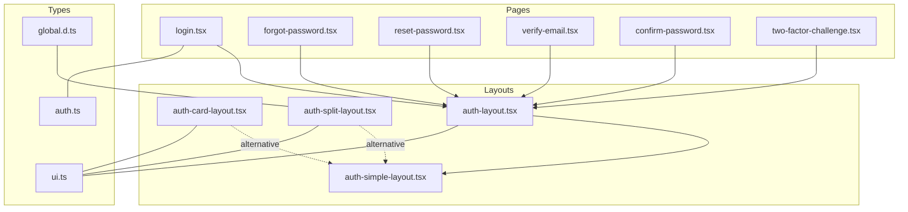
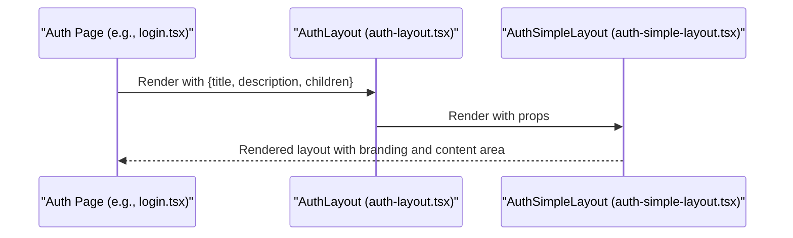
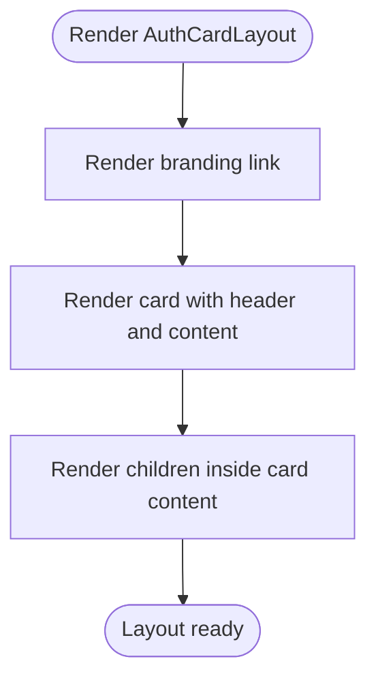
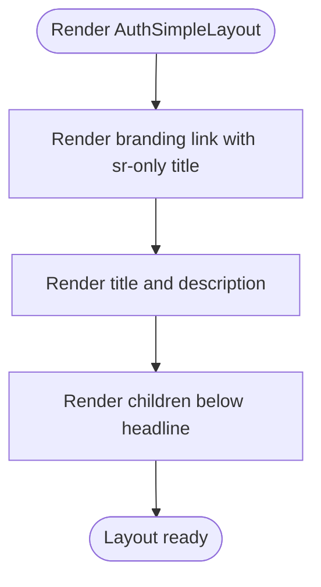
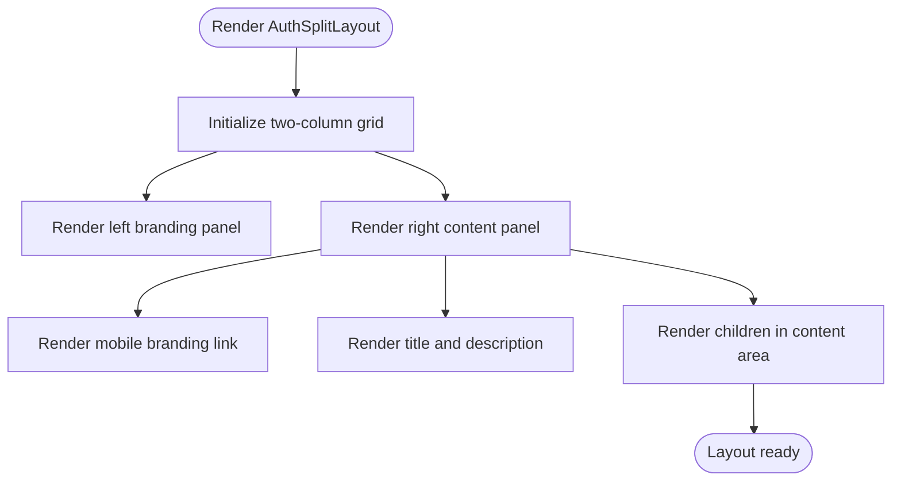
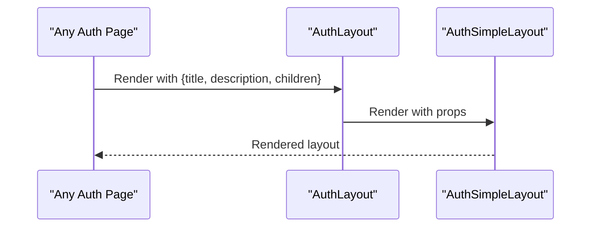
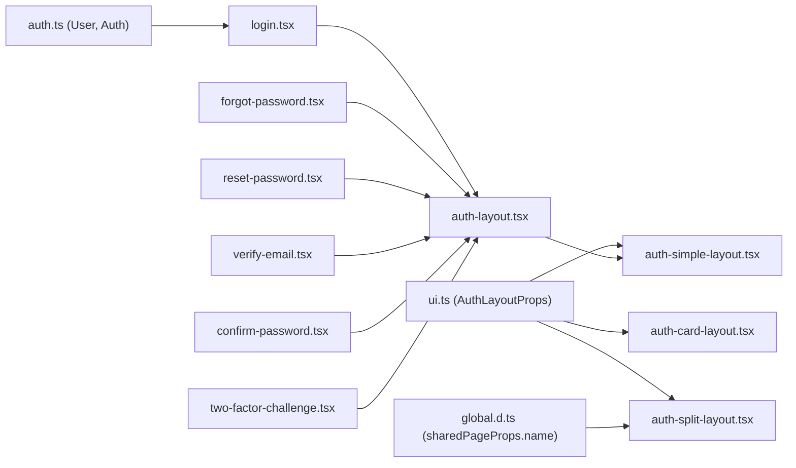

# Authentication Layouts

<cite>
**Referenced Files in This Document**
- [auth-card-layout.tsx](file://resources/js/layouts/auth/auth-card-layout.tsx)
- [auth-simple-layout.tsx](file://resources/js/layouts/auth/auth-simple-layout.tsx)
- [auth-split-layout.tsx](file://resources/js/layouts/auth/auth-split-layout.tsx)
- [auth-layout.tsx](file://resources/js/layouts/auth-layout.tsx)
- [login.tsx](file://resources/js/pages/auth/login.tsx)
- [forgot-password.tsx](file://resources/js/pages/auth/forgot-password.tsx)
- [reset-password.tsx](file://resources/js/pages/auth/reset-password.tsx)
- [verify-email.tsx](file://resources/js/pages/auth/verify-email.tsx)
- [confirm-password.tsx](file://resources/js/pages/auth/confirm-password.tsx)
- [two-factor-challenge.tsx](file://resources/js/pages/auth/two-factor-challenge.tsx)
- [auth.ts](file://resources/js/types/auth.ts)
- [global.d.ts](file://resources/js/types/global.d.ts)
- [ui.ts](file://resources/js/types/ui.ts)
</cite>

## Table of Contents
1. [Introduction](#introduction)
2. [Project Structure](#project-structure)
3. [Core Components](#core-components)
4. [Architecture Overview](#architecture-overview)
5. [Detailed Component Analysis](#detailed-component-analysis)
6. [Dependency Analysis](#dependency-analysis)
7. [Performance Considerations](#performance-considerations)
8. [Troubleshooting Guide](#troubleshooting-guide)
9. [Conclusion](#conclusion)

## Introduction
This document describes the Authentication Layouts subsystem that standardizes the presentation of authentication pages across the application. It defines three layout patterns:
- Card-based layout: a centered card container suitable for modal-like forms and compact authentication experiences.
- Simple layout: a minimal, single-column layout ideal for straightforward authentication flows.
- Split layout: a dual-panel layout with a branding panel and a content panel, optimized for larger screens.

Each layout exposes a consistent props interface, manages responsive behavior via Tailwind classes, and integrates with authentication components and error handling patterns. The document also outlines layout selection criteria, mobile responsiveness, accessibility considerations, and integration patterns with authentication flows.

## Project Structure
The authentication layouts are located under the layouts/auth directory and are consumed by pages under resources/js/pages/auth. The props interface is standardized via a shared type definition.

**Diagram sources**
- [auth-card-layout.tsx:1-49](file://resources/js/layouts/auth/auth-card-layout.tsx#L1-L49)
- [auth-simple-layout.tsx:1-39](file://resources/js/layouts/auth/auth-simple-layout.tsx#L1-L39)
- [auth-split-layout.tsx:1-45](file://resources/js/layouts/auth/auth-split-layout.tsx#L1-L45)
- [auth-layout.tsx:1-19](file://resources/js/layouts/auth/auth-layout.tsx#L1-L19)
- [login.tsx:1-106](file://resources/js/pages/auth/login.tsx#L1-L106)
- [forgot-password.tsx:1-69](file://resources/js/pages/auth/forgot-password.tsx#L1-L69)
- [reset-password.tsx:1-93](file://resources/js/pages/auth/reset-password.tsx#L1-L93)
- [verify-email.tsx:1-45](file://resources/js/pages/auth/verify-email.tsx#L1-L45)
- [confirm-password.tsx:1-50](file://resources/js/pages/auth/confirm-password.tsx#L1-L50)
- [two-factor-challenge.tsx:1-132](file://resources/js/pages/auth/two-factor-challenge.tsx#L1-L132)
- [ui.ts:11-16](file://resources/js/types/ui.ts#L11-L16)
- [auth.ts:1-27](file://resources/js/types/auth.ts#L1-L27)
- [global.d.ts:1-12](file://resources/js/types/global.d.ts#L1-L12)

**Section sources**
- [auth-card-layout.tsx:1-49](file://resources/js/layouts/auth/auth-card-layout.tsx#L1-L49)
- [auth-simple-layout.tsx:1-39](file://resources/js/layouts/auth/auth-simple-layout.tsx#L1-L39)
- [auth-split-layout.tsx:1-45](file://resources/js/layouts/auth/auth-split-layout.tsx#L1-L45)
- [auth-layout.tsx:1-19](file://resources/js/layouts/auth/auth-layout.tsx#L1-L19)
- [ui.ts:11-16](file://resources/js/types/ui.ts#L11-L16)
- [global.d.ts:1-12](file://resources/js/types/global.d.ts#L1-L12)

## Core Components
This section documents the three layout components, their props, responsive behavior, and content area management.

- AuthCardLayout
  - Purpose: Presents authentication content inside a bordered card with centered alignment and spacing.
  - Props:
    - children: ReactNode
    - title: string
    - description: string
    - name: string (optional)
  - Responsive behavior:
    - Full viewport height and centering on small screens.
    - Horizontal padding increases on medium screens.
    - Card header and content padding optimized for readability.
  - Content area management:
    - Branding link at the top.
    - Card container holds title, description, and child form elements.

- AuthSimpleLayout
  - Purpose: Minimal, single-column layout with centered branding and headline.
  - Props:
    - children: ReactNode
    - title: string
    - description: string
  - Responsive behavior:
    - Centered column with constrained width on small screens.
    - Background color theme applied consistently.
  - Content area management:
    - Branding link with visually hidden title for accessibility.
    - Title and description aligned centrally.
    - Children rendered beneath the headline.

- AuthSplitLayout
  - Purpose: Dual-panel layout with a branding panel and a content panel.
  - Props:
    - children: ReactNode
    - title: string
    - description: string
  - Responsive behavior:
    - Two-column grid on large screens.
    - Branding panel hidden on small screens; content panel adapts.
    - Mobile-friendly adjustments for smaller devices.
  - Content area management:
    - Left branding panel with app name and logo.
    - Right content panel with mobile branding link and form content.

- AuthLayout (Wrapper)
  - Purpose: Thin wrapper that delegates to the simple layout by default, allowing future customization to switch layouts per route or context.
  - Props:
    - children: ReactNode
    - title: string
    - description: string
  - Behavior:
    - Renders the simple layout template with provided props.

**Section sources**
- [auth-card-layout.tsx:13-48](file://resources/js/layouts/auth/auth-card-layout.tsx#L13-L48)
- [auth-simple-layout.tsx:6-38](file://resources/js/layouts/auth/auth-simple-layout.tsx#L6-L38)
- [auth-split-layout.tsx:6-44](file://resources/js/layouts/auth/auth-split-layout.tsx#L6-L44)
- [auth-layout.tsx:3-18](file://resources/js/layouts/auth/auth-layout.tsx#L3-L18)

## Architecture Overview
The authentication pages render within a layout that standardizes branding, spacing, and responsive behavior. Pages pass localized title and description strings to the layout, while the layout renders the page’s form components.

**Diagram sources**
- [login.tsx:19-24](file://resources/js/pages/auth/login.tsx#L19-L24)
- [auth-layout.tsx:3-18](file://resources/js/layouts/auth/auth-layout.tsx#L3-L18)
- [auth-simple-layout.tsx:6-38](file://resources/js/layouts/auth/auth-simple-layout.tsx#L6-L38)

## Detailed Component Analysis

### AuthCardLayout
- Props interface:
  - children: ReactNode
  - title: string
  - description: string
  - name: string (optional)
- Content area management:
  - Top branding link with icon.
  - Card with centered header (title and description) and padded content area.
- Responsive behavior:
  - Full viewport height and vertical centering.
  - Horizontal padding increases on medium screens.
  - Max-width constraint for the card container.
- Accessibility:
  - Uses semantic heading and description elements within the card.
- Integration:
  - Suitable for short, contained forms such as password confirmation or quick actions.

**Diagram sources**
- [auth-card-layout.tsx:22-47](file://resources/js/layouts/auth/auth-card-layout.tsx#L22-L47)

**Section sources**
- [auth-card-layout.tsx:13-48](file://resources/js/layouts/auth/auth-card-layout.tsx#L13-L48)

### AuthSimpleLayout
- Props interface:
  - children: ReactNode
  - title: string
  - description: string
- Content area management:
  - Branding link with visually hidden title for assistive technologies.
  - Centralized title and description.
  - Children rendered as the primary content area.
- Responsive behavior:
  - Constrained width column on small screens.
  - Background theme applied for contrast and readability.
- Accessibility:
  - Screen-reader-only span for the brand link text.
  - Clear heading hierarchy and descriptive text.
- Integration:
  - Default choice for most authentication pages due to simplicity and consistency.

**Diagram sources**
- [auth-simple-layout.tsx:11-37](file://resources/js/layouts/auth/auth-simple-layout.tsx#L11-L37)

**Section sources**
- [auth-simple-layout.tsx:6-38](file://resources/js/layouts/auth/auth-simple-layout.tsx#L6-L38)

### AuthSplitLayout
- Props interface:
  - children: ReactNode
  - title: string
  - description: string
- Content area management:
  - Left panel with branding and app name.
  - Right panel with mobile branding link and content area.
- Responsive behavior:
  - Two-column grid on large screens.
  - Branding panel hidden on small screens; right panel adapts.
  - Mobile-specific branding link for easy navigation.
- Accessibility:
  - Branding remains accessible via mobile link.
- Integration:
  - Best for complex flows or branded experiences where space allows.

**Diagram sources**
- [auth-split-layout.tsx:13-43](file://resources/js/layouts/auth/auth-split-layout.tsx#L13-L43)

**Section sources**
- [auth-split-layout.tsx:6-44](file://resources/js/layouts/auth/auth-split-layout.tsx#L6-L44)

### AuthLayout Wrapper
- Purpose: Delegates rendering to the simple layout by default, enabling centralized control over layout selection.
- Props:
  - children: ReactNode
  - title: string
  - description: string
- Behavior:
  - Passes props to the simple layout template.

**Diagram sources**
- [auth-layout.tsx:3-18](file://resources/js/layouts/auth/auth-layout.tsx#L3-L18)
- [auth-simple-layout.tsx:6-38](file://resources/js/layouts/auth/auth-simple-layout.tsx#L6-L38)

**Section sources**
- [auth-layout.tsx:1-19](file://resources/js/layouts/auth/auth-layout.tsx#L1-L19)

## Dependency Analysis
The authentication pages depend on the shared layout types and props interface. The split layout consumes the shared page props to display the application name.

**Diagram sources**
- [auth.ts:1-27](file://resources/js/types/auth.ts#L1-L27)
- [ui.ts:11-16](file://resources/js/types/ui.ts#L11-L16)
- [global.d.ts:1-12](file://resources/js/types/global.d.ts#L1-L12)
- [auth-simple-layout.tsx:1-39](file://resources/js/layouts/auth/auth-simple-layout.tsx#L1-L39)
- [auth-card-layout.tsx:1-49](file://resources/js/layouts/auth/auth-card-layout.tsx#L1-L49)
- [auth-split-layout.tsx:1-45](file://resources/js/layouts/auth/auth-split-layout.tsx#L1-L45)
- [auth-layout.tsx:1-19](file://resources/js/layouts/auth/auth-layout.tsx#L1-L19)
- [login.tsx:1-106](file://resources/js/pages/auth/login.tsx#L1-L106)
- [forgot-password.tsx:1-69](file://resources/js/pages/auth/forgot-password.tsx#L1-L69)
- [reset-password.tsx:1-93](file://resources/js/pages/auth/reset-password.tsx#L1-L93)
- [verify-email.tsx:1-45](file://resources/js/pages/auth/verify-email.tsx#L1-L45)
- [confirm-password.tsx:1-50](file://resources/js/pages/auth/confirm-password.tsx#L1-L50)
- [two-factor-challenge.tsx:1-132](file://resources/js/pages/auth/two-factor-challenge.tsx#L1-L132)

**Section sources**
- [ui.ts:11-16](file://resources/js/types/ui.ts#L11-L16)
- [global.d.ts:1-12](file://resources/js/types/global.d.ts#L1-L12)
- [auth.ts:1-27](file://resources/js/types/auth.ts#L1-L27)

## Performance Considerations
- Prefer the simple layout for most pages to minimize DOM complexity and improve perceived performance.
- Use the card layout for short, contained forms to reduce scroll distance and keep focus tight.
- Reserve the split layout for scenarios where the extra panel improves comprehension and reduces cognitive load, understanding the cost of rendering two panels.
- Keep children components lightweight and avoid heavy computations in layout boundaries.

## Troubleshooting Guide
- Title and description not visible:
  - Ensure the page passes title and description to the layout.
  - Verify the layout receives the props and renders them.
- Branding not appearing:
  - Confirm the branding link is present in the layout and the route resolves correctly.
- Responsive issues on small screens:
  - Check Tailwind breakpoints and padding classes in the layout.
  - Validate that the split layout collapses appropriately on small screens.
- Accessibility concerns:
  - Ensure screen-reader-only text is present for branding links.
  - Verify heading hierarchy and descriptive text are used consistently.
- Error handling display:
  - Pages commonly render status messages and input errors; ensure the layout does not wrap or obscure these elements.
  - For two-factor challenge, confirm toggling between OTP and recovery modes updates title and description accordingly.

**Section sources**
- [login.tsx:19-24](file://resources/js/pages/auth/login.tsx#L19-L24)
- [forgot-password.tsx:13-18](file://resources/js/pages/auth/forgot-password.tsx#L13-L18)
- [reset-password.tsx:16-21](file://resources/js/pages/auth/reset-password.tsx#L16-L21)
- [verify-email.tsx:10-15](file://resources/js/pages/auth/verify-email.tsx#L10-L15)
- [confirm-password.tsx:10-15](file://resources/js/pages/auth/confirm-password.tsx#L10-L15)
- [two-factor-challenge.tsx:16-40](file://resources/js/pages/auth/two-factor-challenge.tsx#L16-L40)

## Conclusion
The Authentication Layouts subsystem provides a consistent, accessible, and responsive foundation for authentication pages. Choose the simple layout for straightforward flows, the card layout for compact modal-like experiences, and the split layout for branded dual-panel designs. The shared props interface and integration patterns enable predictable behavior across pages, while responsive and accessibility guidelines ensure usability across devices and assistive technologies.