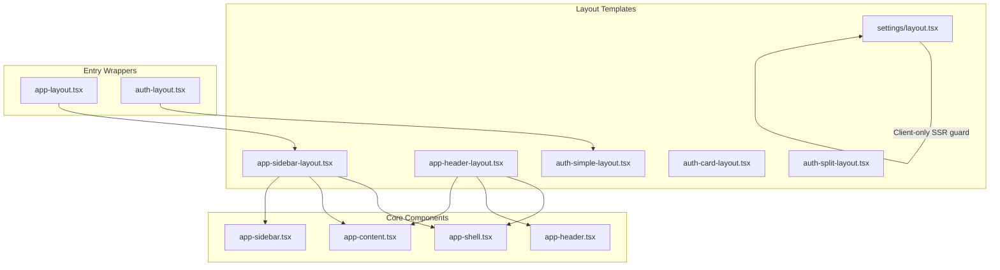
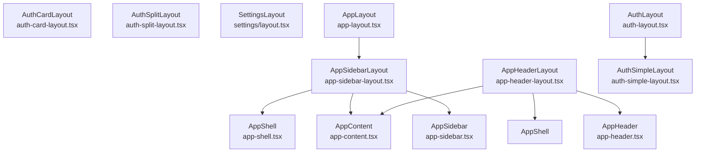
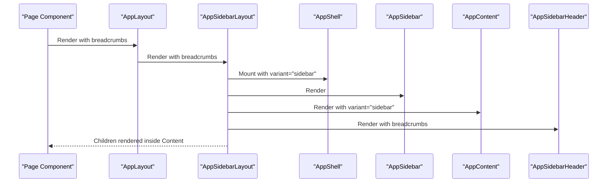
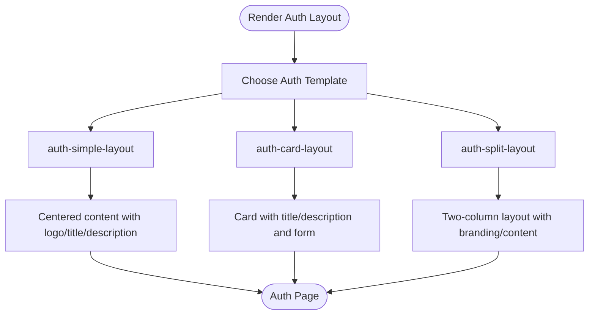
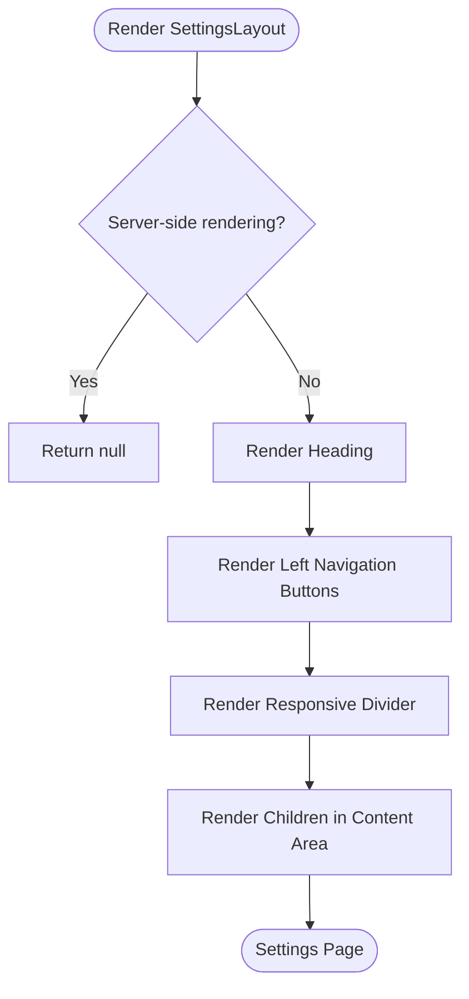
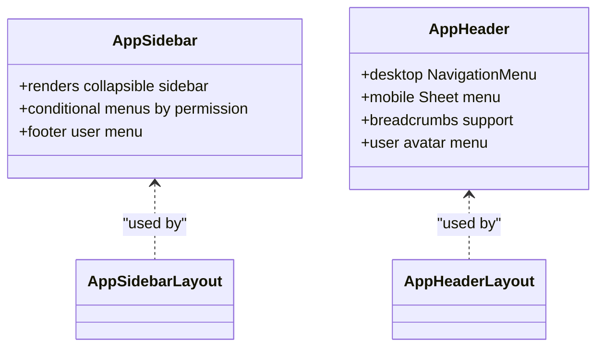
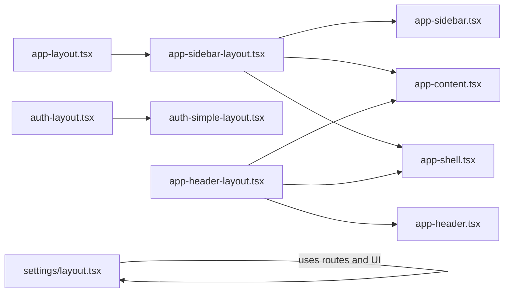

# Layout System

<cite>
**Referenced Files in This Document**
- [app-layout.tsx](file://resources/js/layouts/app-layout.tsx)
- [auth-layout.tsx](file://resources/js/layouts/auth-layout.tsx)
- [settings/layout.tsx](file://resources/js/layouts/settings/layout.tsx)
- [app-sidebar-layout.tsx](file://resources/js/layouts/app/app-sidebar-layout.tsx)
- [app-header-layout.tsx](file://resources/js/layouts/app/app-header-layout.tsx)
- [auth-simple-layout.tsx](file://resources/js/layouts/auth/auth-simple-layout.tsx)
- [auth-card-layout.tsx](file://resources/js/layouts/auth/auth-card-layout.tsx)
- [auth-split-layout.tsx](file://resources/js/layouts/auth/auth-split-layout.tsx)
- [app-shell.tsx](file://resources/js/components/app-shell.tsx)
- [app-content.tsx](file://resources/js/components/app-content.tsx)
- [app-sidebar.tsx](file://resources/js/components/app-sidebar.tsx)
- [app-header.tsx](file://resources/js/components/app-header.tsx)
- [index.ts](file://resources/js/types/index.ts)
</cite>

## Table of Contents
1. [Introduction](#introduction)
2. [Project Structure](#project-structure)
3. [Core Components](#core-components)
4. [Architecture Overview](#architecture-overview)
5. [Detailed Component Analysis](#detailed-component-analysis)
6. [Dependency Analysis](#dependency-analysis)
7. [Performance Considerations](#performance-considerations)
8. [Troubleshooting Guide](#troubleshooting-guide)
9. [Conclusion](#conclusion)
10. [Appendices](#appendices)

## Introduction
This document explains the Layout System that powers multi-layered layouts across authentication, application, and settings pages. It covers the layout hierarchy, header and sidebar components, responsive behavior, navigation patterns, composition patterns, props interfaces, content area management, layout switching, conditional rendering, responsive design, state management, theme integration, and mobile navigation. It also provides guidelines for creating new layouts and maintaining consistency across page types.

## Project Structure
The layout system is organized by domain:
- Application layouts: app-sidebar-layout and app-header-layout compose the main application shell with sidebar or header variants.
- Authentication layouts: auth-simple-layout, auth-card-layout, and auth-split-layout provide distinct auth presentation patterns.
- Settings layout: a dedicated settings layout with a left-hand navigation and content area.
- Core components: app-shell, app-content, app-sidebar, and app-header implement shared layout primitives and responsive behavior.

**Diagram sources**
- [app-layout.tsx:1-9](file://resources/js/layouts/app-layout.tsx#L1-L9)
- [auth-layout.tsx:1-19](file://resources/js/layouts/auth-layout.tsx#L1-L19)
- [app-sidebar-layout.tsx:1-21](file://resources/js/layouts/app/app-sidebar-layout.tsx#L1-L21)
- [app-header-layout.tsx:1-17](file://resources/js/layouts/app/app-header-layout.tsx#L1-L17)
- [auth-simple-layout.tsx:1-39](file://resources/js/layouts/auth/auth-simple-layout.tsx#L1-L39)
- [auth-card-layout.tsx:1-49](file://resources/js/layouts/auth/auth-card-layout.tsx#L1-L49)
- [auth-split-layout.tsx:1-45](file://resources/js/layouts/auth/auth-split-layout.tsx#L1-L45)
- [settings/layout.tsx:1-84](file://resources/js/layouts/settings/layout.tsx#L1-L84)
- [app-shell.tsx:1-22](file://resources/js/components/app-shell.tsx#L1-L22)
- [app-content.tsx:1-23](file://resources/js/components/app-content.tsx#L1-L23)
- [app-sidebar.tsx:1-162](file://resources/js/components/app-sidebar.tsx#L1-L162)
- [app-header.tsx:1-188](file://resources/js/components/app-header.tsx#L1-L188)

**Section sources**
- [app-layout.tsx:1-9](file://resources/js/layouts/app-layout.tsx#L1-L9)
- [auth-layout.tsx:1-19](file://resources/js/layouts/auth-layout.tsx#L1-L19)
- [app-sidebar-layout.tsx:1-21](file://resources/js/layouts/app/app-sidebar-layout.tsx#L1-L21)
- [app-header-layout.tsx:1-17](file://resources/js/layouts/app/app-header-layout.tsx#L1-L17)
- [auth-simple-layout.tsx:1-39](file://resources/js/layouts/auth/auth-simple-layout.tsx#L1-L39)
- [auth-card-layout.tsx:1-49](file://resources/js/layouts/auth/auth-card-layout.tsx#L1-L49)
- [auth-split-layout.tsx:1-45](file://resources/js/layouts/auth/auth-split-layout.tsx#L1-L45)
- [settings/layout.tsx:1-84](file://resources/js/layouts/settings/layout.tsx#L1-L84)
- [app-shell.tsx:1-22](file://resources/js/components/app-shell.tsx#L1-L22)
- [app-content.tsx:1-23](file://resources/js/components/app-content.tsx#L1-L23)
- [app-sidebar.tsx:1-162](file://resources/js/components/app-sidebar.tsx#L1-L162)
- [app-header.tsx:1-188](file://resources/js/components/app-header.tsx#L1-L188)

## Core Components
- AppShell: Provides the root container with variant-aware behavior. For sidebar variant, it wraps children with a SidebarProvider and defaultOpen state from page props. For header variant, it renders a simple columnar container.
- AppContent: Renders the main content area. For sidebar variant, it uses SidebarInset; for header variant, it centers content within a max-width container.
- AppSidebar: Implements the persistent sidebar with collapsible behavior, conditional navigation items based on user permissions, and a footer user menu.
- AppHeader: Implements desktop and mobile navigation, breadcrumbs, and user menu with avatar fallback.

Key props interfaces:
- AppLayoutProps: Accepts children and breadcrumbs for application layouts.
- AuthLayoutProps: Accepts children, title, and description for auth layouts.
- BreadcrumbItem: Defines breadcrumb entries for header layout.
- NavItem: Defines navigation items with title, href, and optional icon.

**Section sources**
- [app-shell.tsx:1-22](file://resources/js/components/app-shell.tsx#L1-L22)
- [app-content.tsx:1-23](file://resources/js/components/app-content.tsx#L1-L23)
- [app-sidebar.tsx:1-162](file://resources/js/components/app-sidebar.tsx#L1-L162)
- [app-header.tsx:1-188](file://resources/js/components/app-header.tsx#L1-L188)
- [index.ts:1-6](file://resources/js/types/index.ts#L1-L6)

## Architecture Overview
The layout system composes reusable building blocks into three primary families:
- Application layouts: app-sidebar-layout and app-header-layout wrap AppShell, AppContent, and either AppSidebar or AppHeader respectively.
- Authentication layouts: auth-simple-layout, auth-card-layout, and auth-split-layout encapsulate auth-specific presentation and branding.
- Settings layout: settings/layout.tsx provides a client-rendered settings panel with a left navigation and content area.

**Diagram sources**
- [app-sidebar-layout.tsx:1-21](file://resources/js/layouts/app/app-sidebar-layout.tsx#L1-L21)
- [app-header-layout.tsx:1-17](file://resources/js/layouts/app/app-header-layout.tsx#L1-L17)
- [auth-simple-layout.tsx:1-39](file://resources/js/layouts/auth/auth-simple-layout.tsx#L1-L39)
- [auth-card-layout.tsx:1-49](file://resources/js/layouts/auth/auth-card-layout.tsx#L1-L49)
- [auth-split-layout.tsx:1-45](file://resources/js/layouts/auth/auth-split-layout.tsx#L1-L45)
- [settings/layout.tsx:1-84](file://resources/js/layouts/settings/layout.tsx#L1-L84)
- [app-shell.tsx:1-22](file://resources/js/components/app-shell.tsx#L1-L22)
- [app-content.tsx:1-23](file://resources/js/components/app-content.tsx#L1-L23)
- [app-sidebar.tsx:1-162](file://resources/js/components/app-sidebar.tsx#L1-L162)
- [app-header.tsx:1-188](file://resources/js/components/app-header.tsx#L1-L188)
- [app-layout.tsx:1-9](file://resources/js/layouts/app-layout.tsx#L1-L9)
- [auth-layout.tsx:1-19](file://resources/js/layouts/auth-layout.tsx#L1-L19)

## Detailed Component Analysis

### Application Layout Family
- app-sidebar-layout: Creates a sidebar-based layout by composing AppShell, AppSidebar, AppContent, and AppSidebarHeader. Breadcrumbs are passed down to the header component.
- app-header-layout: Creates a header-based layout by composing AppShell, AppHeader, and AppContent. Breadcrumbs are passed to the header.
- app-layout wrapper: Thin wrapper around app-sidebar-layout that forwards breadcrumbs and other props.

**Diagram sources**
- [app-layout.tsx:1-9](file://resources/js/layouts/app-layout.tsx#L1-L9)
- [app-sidebar-layout.tsx:1-21](file://resources/js/layouts/app/app-sidebar-layout.tsx#L1-L21)
- [app-shell.tsx:1-22](file://resources/js/components/app-shell.tsx#L1-L22)
- [app-sidebar.tsx:1-162](file://resources/js/components/app-sidebar.tsx#L1-L162)
- [app-content.tsx:1-23](file://resources/js/components/app-content.tsx#L1-L23)

**Section sources**
- [app-sidebar-layout.tsx:1-21](file://resources/js/layouts/app/app-sidebar-layout.tsx#L1-L21)
- [app-header-layout.tsx:1-17](file://resources/js/layouts/app/app-header-layout.tsx#L1-L17)
- [app-layout.tsx:1-9](file://resources/js/layouts/app-layout.tsx#L1-L9)

### Authentication Layout Family
- auth-simple-layout: Minimal centered layout with logo link, title, description, and child content. Suitable for straightforward auth flows.
- auth-card-layout: Card-based layout with title and description inside a bordered card, ideal for forms requiring elevated focus.
- auth-split-layout: Two-column split layout with branding on the left and content on the right, responsive for mobile and desktop.

**Diagram sources**
- [auth-simple-layout.tsx:1-39](file://resources/js/layouts/auth/auth-simple-layout.tsx#L1-L39)
- [auth-card-layout.tsx:1-49](file://resources/js/layouts/auth/auth-card-layout.tsx#L1-L49)
- [auth-split-layout.tsx:1-45](file://resources/js/layouts/auth/auth-split-layout.tsx#L1-L45)

**Section sources**
- [auth-simple-layout.tsx:1-39](file://resources/js/layouts/auth/auth-simple-layout.tsx#L1-L39)
- [auth-card-layout.tsx:1-49](file://resources/js/layouts/auth/auth-card-layout.tsx#L1-L49)
- [auth-split-layout.tsx:1-45](file://resources/js/layouts/auth/auth-split-layout.tsx#L1-L45)

### Settings Layout
- settings/layout.tsx: Client-only SSR guard ensures layout renders only on the client. It renders a heading, a left navigation (Profile, Security, Appearance), a responsive divider, and a content area for children. Uses a current-url helper to highlight active navigation items.

**Diagram sources**
- [settings/layout.tsx:1-84](file://resources/js/layouts/settings/layout.tsx#L1-L84)

**Section sources**
- [settings/layout.tsx:1-84](file://resources/js/layouts/settings/layout.tsx#L1-L84)

### Header and Sidebar Components
- AppSidebar: Collapsible sidebar with conditional navigation menus based on user permissions. Includes main navigation, kepegawaian, monitoring, referensi, and IAM sections. Footer contains user menu.
- AppHeader: Desktop navigation via NavigationMenu and mobile navigation via Sheet. Displays breadcrumbs when applicable and includes user avatar with initials fallback.

**Diagram sources**
- [app-sidebar.tsx:1-162](file://resources/js/components/app-sidebar.tsx#L1-L162)
- [app-header.tsx:1-188](file://resources/js/components/app-header.tsx#L1-L188)

**Section sources**
- [app-sidebar.tsx:1-162](file://resources/js/components/app-sidebar.tsx#L1-L162)
- [app-header.tsx:1-188](file://resources/js/components/app-header.tsx#L1-L188)

### Layout Composition Patterns and Props Interfaces
- Composition pattern: Each layout template composes AppShell, AppContent, and either AppSidebar or AppHeader. Application wrappers (app-layout.tsx, auth-layout.tsx) forward props to their respective templates.
- Props interfaces:
  - AppLayoutProps: children and breadcrumbs for application layouts.
  - AuthLayoutProps: children, title, description for auth layouts.
  - BreadcrumbItem and NavItem types define structure for breadcrumbs and navigation.

**Section sources**
- [app-layout.tsx:1-9](file://resources/js/layouts/app-layout.tsx#L1-L9)
- [auth-layout.tsx:1-19](file://resources/js/layouts/auth-layout.tsx#L1-L19)
- [index.ts:1-6](file://resources/js/types/index.ts#L1-L6)

### Content Area Management
- AppContent variant selection: For sidebar variant, uses SidebarInset to integrate with the sidebar provider. For header variant, centers content within a max-width container with rounded corners and spacing.
- Settings content area: Uses a two-column layout on large screens and a single column on smaller screens, with a responsive separator.

**Section sources**
- [app-content.tsx:1-23](file://resources/js/components/app-content.tsx#L1-L23)
- [settings/layout.tsx:46-81](file://resources/js/layouts/settings/layout.tsx#L46-L81)

### Responsive Behavior and Navigation Patterns
- Sidebar behavior: AppShell reads sidebarOpen from page props to set defaultOpen for the sidebar provider. AppSidebar is collapsible to icon mode.
- Header navigation: Desktop uses NavigationMenu; mobile uses Sheet with a left-side drawer. Breadcrumbs appear below the header when present.
- Settings navigation: Ghost buttons with Link asChild provide accessible navigation with current-state highlighting.

**Section sources**
- [app-shell.tsx:1-22](file://resources/js/components/app-shell.tsx#L1-L22)
- [app-sidebar.tsx:1-162](file://resources/js/components/app-sidebar.tsx#L1-L162)
- [app-header.tsx:1-188](file://resources/js/components/app-header.tsx#L1-L188)
- [settings/layout.tsx:52-70](file://resources/js/layouts/settings/layout.tsx#L52-L70)

### Conditional Rendering and Layout Switching
- Conditional menus: AppSidebar conditionally renders sections based on user permissions.
- Variant switching: AppShell switches behavior based on variant prop; AppContent adapts layout accordingly.
- Auth layout switching: auth-simple-layout, auth-card-layout, and auth-split-layout provide different presentation modes.

**Section sources**
- [app-sidebar.tsx:58-124](file://resources/js/components/app-sidebar.tsx#L58-L124)
- [app-shell.tsx:11-21](file://resources/js/components/app-shell.tsx#L11-L21)
- [app-content.tsx:9-22](file://resources/js/components/app-content.tsx#L9-L22)
- [auth-simple-layout.tsx:1-39](file://resources/js/layouts/auth/auth-simple-layout.tsx#L1-L39)
- [auth-card-layout.tsx:1-49](file://resources/js/layouts/auth/auth-card-layout.tsx#L1-L49)
- [auth-split-layout.tsx:1-45](file://resources/js/layouts/auth/auth-split-layout.tsx#L1-L45)

### Theme Integration and Mobile Navigation
- Theming: Uses Tailwind utilities and CSS variables for light/dark themes. AppHeader and AppSidebar use theme-aware colors and backgrounds.
- Mobile navigation: Sheet-based drawer for mobile with logo header and simplified navigation list.

**Section sources**
- [app-header.tsx:56-100](file://resources/js/components/app-header.tsx#L56-L100)
- [app-header.tsx:101-142](file://resources/js/components/app-header.tsx#L101-L142)
- [app-header.tsx:144-176](file://resources/js/components/app-header.tsx#L144-L176)
- [app-sidebar.tsx:127-159](file://resources/js/components/app-sidebar.tsx#L127-L159)

## Dependency Analysis
The layout system exhibits low coupling and high cohesion:
- Layout templates depend on core components (AppShell, AppContent, AppSidebar, AppHeader).
- Application wrappers depend on layout templates.
- Auth layouts are standalone and independent of core components except for routing helpers.
- Settings layout depends on routing helpers and UI primitives.

**Diagram sources**
- [app-layout.tsx:1-9](file://resources/js/layouts/app-layout.tsx#L1-L9)
- [auth-layout.tsx:1-19](file://resources/js/layouts/auth-layout.tsx#L1-L19)
- [app-sidebar-layout.tsx:1-21](file://resources/js/layouts/app/app-sidebar-layout.tsx#L1-L21)
- [app-header-layout.tsx:1-17](file://resources/js/layouts/app/app-header-layout.tsx#L1-L17)
- [auth-simple-layout.tsx:1-39](file://resources/js/layouts/auth/auth-simple-layout.tsx#L1-L39)
- [app-shell.tsx:1-22](file://resources/js/components/app-shell.tsx#L1-L22)
- [app-content.tsx:1-23](file://resources/js/components/app-content.tsx#L1-L23)
- [app-sidebar.tsx:1-162](file://resources/js/components/app-sidebar.tsx#L1-L162)
- [app-header.tsx:1-188](file://resources/js/components/app-header.tsx#L1-L188)
- [settings/layout.tsx:1-84](file://resources/js/layouts/settings/layout.tsx#L1-L84)

**Section sources**
- [app-layout.tsx:1-9](file://resources/js/layouts/app-layout.tsx#L1-L9)
- [auth-layout.tsx:1-19](file://resources/js/layouts/auth-layout.tsx#L1-L19)
- [app-sidebar-layout.tsx:1-21](file://resources/js/layouts/app/app-sidebar-layout.tsx#L1-L21)
- [app-header-layout.tsx:1-17](file://resources/js/layouts/app/app-header-layout.tsx#L1-L17)
- [auth-simple-layout.tsx:1-39](file://resources/js/layouts/auth/auth-simple-layout.tsx#L1-L39)
- [app-shell.tsx:1-22](file://resources/js/components/app-shell.tsx#L1-L22)
- [app-content.tsx:1-23](file://resources/js/components/app-content.tsx#L1-L23)
- [app-sidebar.tsx:1-162](file://resources/js/components/app-sidebar.tsx#L1-L162)
- [app-header.tsx:1-188](file://resources/js/components/app-header.tsx#L1-L188)
- [settings/layout.tsx:1-84](file://resources/js/layouts/settings/layout.tsx#L1-L84)

## Performance Considerations
- Client-only SSR guard in settings layout prevents unnecessary server rendering and improves hydration performance.
- Sidebar defaultOpen is derived from page props, avoiding re-computation and ensuring consistent initial state.
- Conditional rendering of navigation sections reduces DOM size and improves perceived performance.

[No sources needed since this section provides general guidance]

## Troubleshooting Guide
- Settings layout not visible: Verify client-side rendering conditions and ensure the client check passes.
- Sidebar not opening/closing: Confirm sidebarOpen prop is present in page props and SidebarProvider receives the correct defaultOpen value.
- Active navigation highlighting: Ensure useCurrentUrl is used consistently and href values match route helpers.

**Section sources**
- [settings/layout.tsx:34-37](file://resources/js/layouts/settings/layout.tsx#L34-L37)
- [app-shell.tsx:11-21](file://resources/js/components/app-shell.tsx#L11-L21)
- [app-header.tsx:119-138](file://resources/js/components/app-header.tsx#L119-L138)

## Conclusion
The Layout System provides a modular, responsive, and permission-aware foundation for authentication, application, and settings pages. By composing AppShell, AppContent, AppSidebar, and AppHeader, it supports both sidebar and header variants while maintaining consistent navigation patterns, breadcrumbs, and theme integration. The settings layout demonstrates client-only rendering and responsive composition. New layouts should follow the established composition patterns, leverage permission-based conditional rendering, and maintain responsive behavior across devices.

[No sources needed since this section summarizes without analyzing specific files]

## Appendices

### Guidelines for Creating New Layouts
- Choose a base template: Use app-sidebar-layout for persistent sidebar experiences or app-header-layout for header-focused experiences.
- Compose core components: Always include AppShell, AppContent, and either AppSidebar or AppHeader.
- Forward props: Pass breadcrumbs and other props appropriately to child components.
- Respect SSR: Use client-side checks for layouts that rely on client-only features.
- Maintain responsive behavior: Ensure mobile navigation and breakpoints are handled consistently.
- Integrate permissions: Conditionally render navigation sections based on user permissions.
- Keep consistency: Align with existing patterns for breadcrumbs, navigation, and theming.

[No sources needed since this section provides general guidance]