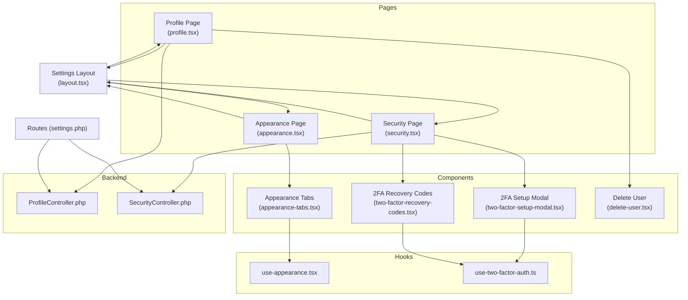
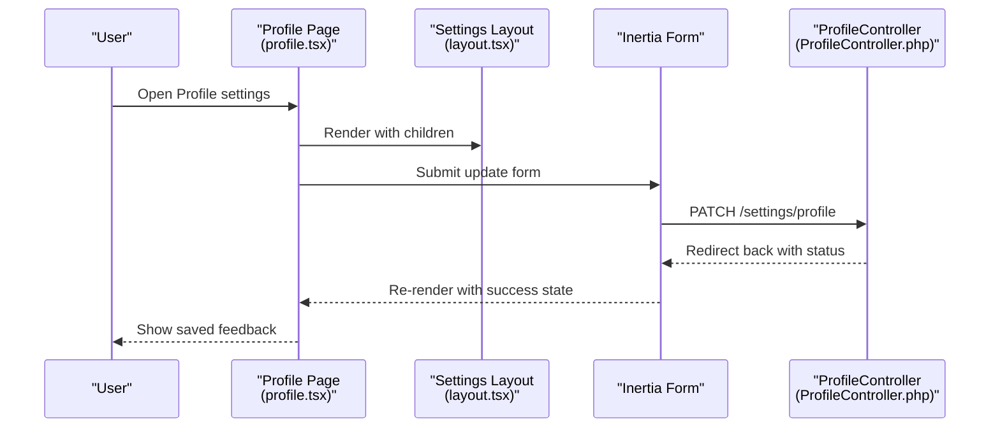
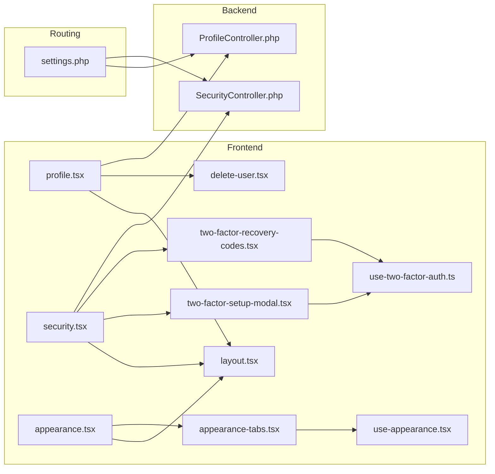

# Settings Layouts

<cite>
**Referenced Files in This Document**
- [layout.tsx](file://resources/js/layouts/settings/layout.tsx)
- [profile.tsx](file://resources/js/pages/settings/profile.tsx)
- [security.tsx](file://resources/js/pages/settings/security.tsx)
- [appearance.tsx](file://resources/js/pages/settings/appearance.tsx)
- [ProfileController.php](file://app/Http/Controllers/Settings/ProfileController.php)
- [SecurityController.php](file://app/Http/Controllers/Settings/SecurityController.php)
- [appearance-tabs.tsx](file://resources/js/components/appearance-tabs.tsx)
- [use-appearance.tsx](file://resources/js/hooks/use-appearance.tsx)
- [use-two-factor-auth.ts](file://resources/js/hooks/use-two-factor-auth.ts)
- [two-factor-setup-modal.tsx](file://resources/js/components/two-factor-setup-modal.tsx)
- [two-factor-recovery-codes.tsx](file://resources/js/components/two-factor-recovery-codes.tsx)
- [delete-user.tsx](file://resources/js/components/delete-user.tsx)
- [settings.php](file://routes/settings.php)
</cite>

## Table of Contents
1. [Introduction](#introduction)
2. [Project Structure](#project-structure)
3. [Core Components](#core-components)
4. [Architecture Overview](#architecture-overview)
5. [Detailed Component Analysis](#detailed-component-analysis)
6. [Dependency Analysis](#dependency-analysis)
7. [Performance Considerations](#performance-considerations)
8. [Accessibility Compliance](#accessibility-compliance)
9. [Responsive Design](#responsive-design)
10. [Integration with Authentication State](#integration-with-authentication-state)
11. [Troubleshooting Guide](#troubleshooting-guide)
12. [Conclusion](#conclusion)

## Introduction
This document describes the Settings Layouts subsystem responsible for organizing profile management, security configuration, and appearance customization pages. The layout is optimized for form-heavy content with a persistent sidebar navigation and a flexible content area. It integrates tightly with Inertia.js forms, validation feedback, and persistence mechanisms while maintaining accessibility and responsive design.

## Project Structure
The Settings Layouts subsystem spans React pages, a shared settings layout, supporting components, hooks, and backend controllers:

- Pages: profile, security, and appearance settings
- Shared layout: sidebar navigation and content area
- Supporting components: appearance tabs, two-factor setup, recovery codes, and account deletion
- Hooks: appearance and two-factor authentication state management
- Backend controllers: profile and security operations
- Routes: authentication-protected endpoints for settings

**Diagram sources**
- [layout.tsx:31-83](file://resources/js/layouts/settings/layout.tsx#L31-L83)
- [profile.tsx:38-147](file://resources/js/pages/settings/profile.tsx#L38-L147)
- [security.tsx:59-259](file://resources/js/pages/settings/security.tsx#L59-L259)
- [appearance.tsx:23-32](file://resources/js/pages/settings/appearance.tsx#L23-L32)
- [appearance-tabs.tsx:8-45](file://resources/js/components/appearance-tabs.tsx#L8-L45)
- [two-factor-setup-modal.tsx:243-348](file://resources/js/components/two-factor-setup-modal.tsx#L243-L348)
- [two-factor-recovery-codes.tsx:21-164](file://resources/js/components/two-factor-recovery-codes.tsx#L21-L164)
- [delete-user.tsx:19-120](file://resources/js/components/delete-user.tsx#L19-L120)
- [ProfileController.php:15-60](file://app/Http/Controllers/Settings/ProfileController.php#L15-L60)
- [SecurityController.php:15-58](file://app/Http/Controllers/Settings/SecurityController.php#L15-L58)
- [settings.php:7-24](file://routes/settings.php#L7-L24)

**Section sources**
- [layout.tsx:13-29](file://resources/js/layouts/settings/layout.tsx#L13-L29)
- [profile.tsx:38-147](file://resources/js/pages/settings/profile.tsx#L38-L147)
- [security.tsx:59-259](file://resources/js/pages/settings/security.tsx#L59-L259)
- [appearance.tsx:23-32](file://resources/js/pages/settings/appearance.tsx#L23-L32)
- [ProfileController.php:20-59](file://app/Http/Controllers/Settings/ProfileController.php#L20-L59)
- [SecurityController.php:31-57](file://app/Http/Controllers/Settings/SecurityController.php#L31-L57)
- [settings.php:7-24](file://routes/settings.php#L7-L24)

## Core Components
- Settings Layout: Provides a responsive two-column layout with a vertical navigation sidebar and a content area for settings pages. It highlights the active navigation item and renders children passed from individual settings pages.
- Profile Page: Presents a form to update name and email, handles email verification messaging, and includes account deletion controls.
- Security Page: Manages password updates, optional two-factor authentication (2FA) enable/disable, and displays recovery codes. Integrates with 2FA setup modal and recovery codes component.
- Appearance Page: Renders appearance customization via appearance tabs that control light/dark/system modes.
- Supporting Components: Appearance tabs, 2FA setup modal, recovery codes display, and delete account dialog.
- Hooks: Appearance hook manages persisted theme selection and system preference; 2FA hook manages QR code, secret key, and recovery codes fetching.
- Controllers: ProfileController handles profile editing, updating, and deletion; SecurityController handles security editing, password updates, and 2FA state.

**Section sources**
- [layout.tsx:31-83](file://resources/js/layouts/settings/layout.tsx#L31-L83)
- [profile.tsx:23-149](file://resources/js/pages/settings/profile.tsx#L23-L149)
- [security.tsx:33-262](file://resources/js/pages/settings/security.tsx#L33-L262)
- [appearance.tsx:16-35](file://resources/js/pages/settings/appearance.tsx#L16-L35)
- [appearance-tabs.tsx:8-45](file://resources/js/components/appearance-tabs.tsx#L8-L45)
- [use-appearance.tsx:90-115](file://resources/js/hooks/use-appearance.tsx#L90-L115)
- [use-two-factor-auth.ts:33-107](file://resources/js/hooks/use-two-factor-auth.ts#L33-L107)
- [two-factor-setup-modal.tsx:243-348](file://resources/js/components/two-factor-setup-modal.tsx#L243-L348)
- [two-factor-recovery-codes.tsx:21-164](file://resources/js/components/two-factor-recovery-codes.tsx#L21-L164)
- [delete-user.tsx:19-120](file://resources/js/components/delete-user.tsx#L19-L120)
- [ProfileController.php:20-59](file://app/Http/Controllers/Settings/ProfileController.php#L20-L59)
- [SecurityController.php:31-57](file://app/Http/Controllers/Settings/SecurityController.php#L31-L57)

## Architecture Overview
The settings subsystem follows a layered pattern:
- Presentation Layer: Pages and components render forms and UI elements.
- Layout Layer: SettingsLayout provides consistent navigation and content framing.
- Integration Layer: Inertia forms connect frontend components to backend controllers.
- State Management: Hooks manage appearance and 2FA state locally and via server requests.
- Backend Layer: Controllers process validated requests and return appropriate responses.

**Diagram sources**
- [profile.tsx:46-51](file://resources/js/pages/settings/profile.tsx#L46-L51)
- [layout.tsx:39-82](file://resources/js/layouts/settings/layout.tsx#L39-L82)
- [ProfileController.php:31-42](file://app/Http/Controllers/Settings/ProfileController.php#L31-L42)

**Section sources**
- [profile.tsx:46-51](file://resources/js/pages/settings/profile.tsx#L46-L51)
- [layout.tsx:39-82](file://resources/js/layouts/settings/layout.tsx#L39-L82)
- [ProfileController.php:31-42](file://app/Http/Controllers/Settings/ProfileController.php#L31-L42)

## Detailed Component Analysis

### Settings Layout
The Settings Layout defines a responsive structure:
- Navigation sidebar with three items: Profile, Security, and Appearance.
- Active item highlighting using URL matching.
- Content area with constrained width for readability.
- Responsive breakpoint switching from stacked to side-by-side layout.

Props interface:
- children: ReactNode to render page-specific content.

Content area management:
- Uses a section container to group page content vertically.
- Applies spacing and max-width constraints for optimal readability.

Integration with settings components:
- Consumed by profile, security, and appearance pages to provide consistent navigation and layout.

**Section sources**
- [layout.tsx:13-29](file://resources/js/layouts/settings/layout.tsx#L13-L29)
- [layout.tsx:31-83](file://resources/js/layouts/settings/layout.tsx#L31-L83)

### Profile Settings Page
Purpose:
- Allow users to update personal information (name, email).
- Handle email verification state and resending verification links.
- Provide account deletion flow.

Form validation display:
- Displays field-level errors for name and email.
- Shows verification status messages and resend link when email is unverified.

Save operation handling:
- Submits via Inertia form to the backend controller.
- Preserves scroll position for better UX.
- Shows success feedback after saving.

Settings persistence:
- Backend persists updates and resets email verification when email changes.
- Redirects back to the profile edit route.

Integration with authentication state:
- Reads user data from Inertia props.
- Conditionally shows verification messaging based on MustVerifyEmail contract.

**Section sources**
- [profile.tsx:46-143](file://resources/js/pages/settings/profile.tsx#L46-L143)
- [ProfileController.php:20-42](file://app/Http/Controllers/Settings/ProfileController.php#L20-L42)

### Security Settings Page
Purpose:
- Update passwords with current password confirmation.
- Manage two-factor authentication (enable/disable) with QR code and manual setup key.
- Display and regenerate recovery codes.

Form validation display:
- Focuses on the relevant field when validation errors occur (current password, new password, confirm password).
- Resets form fields on success or error per configured options.

Save operation handling:
- Updates password via dedicated endpoint.
- Enables/disables 2FA and confirms via modal flow.

Settings persistence:
- 2FA state stored server-side; appearance and other preferences stored client-side via cookies/local storage.

Integration with authentication state:
- Uses middleware to require password confirmation for accessing security settings when enabled.
- Checks feature flags for managing 2FA and whether confirmation is required.

**Section sources**
- [security.tsx:67-167](file://resources/js/pages/settings/security.tsx#L67-L167)
- [SecurityController.php:31-57](file://app/Http/Controllers/Settings/SecurityController.php#L31-L57)
- [use-two-factor-auth.ts:33-107](file://resources/js/hooks/use-two-factor-auth.ts#L33-L107)
- [two-factor-setup-modal.tsx:243-348](file://resources/js/components/two-factor-setup-modal.tsx#L243-L348)
- [two-factor-recovery-codes.tsx:21-164](file://resources/js/components/two-factor-recovery-codes.tsx#L21-L164)

### Appearance Settings Page
Purpose:
- Present appearance customization controls.
- Delegate theme selection to appearance tabs component.

Integration with appearance system:
- Uses appearance tabs to switch between light, dark, and system themes.
- Persists theme choice in local storage and cookie for SSR compatibility.

**Section sources**
- [appearance.tsx:23-32](file://resources/js/pages/settings/appearance.tsx#L23-L32)
- [appearance-tabs.tsx:8-45](file://resources/js/components/appearance-tabs.tsx#L8-L45)
- [use-appearance.tsx:90-115](file://resources/js/hooks/use-appearance.tsx#L90-L115)

### Supporting Components and Hooks

#### Appearance Tabs Component
- Provides a tabbed interface for selecting appearance modes.
- Delegates updates to the appearance hook.

**Section sources**
- [appearance-tabs.tsx:8-45](file://resources/js/components/appearance-tabs.tsx#L8-L45)
- [use-appearance.tsx:90-115](file://resources/js/hooks/use-appearance.tsx#L90-L115)

#### Two-Factor Authentication Hook
- Fetches QR code SVG and secret key for setup.
- Retrieves recovery codes and exposes error handling.
- Manages setup data lifecycle and clears errors.

**Section sources**
- [use-two-factor-auth.ts:33-107](file://resources/js/hooks/use-two-factor-auth.ts#L33-L107)

#### Two-Factor Setup Modal
- Guides users through scanning QR code or entering manual setup key.
- Handles verification step with 6-digit OTP input.
- Manages modal state transitions and error display.

**Section sources**
- [two-factor-setup-modal.tsx:243-348](file://resources/js/components/two-factor-setup-modal.tsx#L243-L348)

#### Two-Factor Recovery Codes
- Toggles visibility of recovery codes.
- Allows regenerating codes and fetching them on demand.
- Provides accessible presentation and error handling.

**Section sources**
- [two-factor-recovery-codes.tsx:21-164](file://resources/js/components/two-factor-recovery-codes.tsx#L21-L164)

#### Delete User Component
- Presents a confirmation dialog for account deletion.
- Requires password confirmation before proceeding.
- Integrates with profile controller destroy action.

**Section sources**
- [delete-user.tsx:19-120](file://resources/js/components/delete-user.tsx#L19-L120)
- [ProfileController.php:47-59](file://app/Http/Controllers/Settings/ProfileController.php#L47-L59)

## Dependency Analysis
The settings subsystem exhibits clear separation of concerns:
- Pages depend on the Settings Layout and relevant components.
- Components depend on hooks for state management.
- Controllers encapsulate backend logic and integrate with Inertia responses.
- Routes define authentication and authorization boundaries.

**Diagram sources**
- [profile.tsx:38-147](file://resources/js/pages/settings/profile.tsx#L38-L147)
- [security.tsx:59-259](file://resources/js/pages/settings/security.tsx#L59-L259)
- [appearance.tsx:23-32](file://resources/js/pages/settings/appearance.tsx#L23-L32)
- [layout.tsx:39-82](file://resources/js/layouts/settings/layout.tsx#L39-L82)
- [appearance-tabs.tsx:8-45](file://resources/js/components/appearance-tabs.tsx#L8-L45)
- [two-factor-setup-modal.tsx:243-348](file://resources/js/components/two-factor-setup-modal.tsx#L243-L348)
- [two-factor-recovery-codes.tsx:21-164](file://resources/js/components/two-factor-recovery-codes.tsx#L21-L164)
- [delete-user.tsx:19-120](file://resources/js/components/delete-user.tsx#L19-L120)
- [ProfileController.php:20-59](file://app/Http/Controllers/Settings/ProfileController.php#L20-L59)
- [SecurityController.php:31-57](file://app/Http/Controllers/Settings/SecurityController.php#L31-L57)
- [settings.php:7-24](file://routes/settings.php#L7-L24)

**Section sources**
- [settings.php:7-24](file://routes/settings.php#L7-L24)
- [ProfileController.php:20-59](file://app/Http/Controllers/Settings/ProfileController.php#L20-L59)
- [SecurityController.php:31-57](file://app/Http/Controllers/Settings/SecurityController.php#L31-L57)

## Performance Considerations
- Minimize re-renders by leveraging Inertia form options (preserve scroll, reset on success/error).
- Defer heavy operations (QR code generation, recovery codes retrieval) to user actions.
- Use local storage and cookies for appearance persistence to avoid repeated server requests.
- Keep content area widths constrained to reduce layout thrashing on smaller screens.

## Accessibility Compliance
- Semantic headings and labels for form fields.
- Screen-reader-only headings for page landmarks.
- Focus management for validation errors and modals.
- Proper contrast and color scheme support for light/dark modes.
- ARIA attributes for dialogs, lists, and interactive elements.
- Keyboard navigation support for all interactive components.

## Responsive Design
- Sidebar navigation stacks below content on small screens.
- Content area uses max-width constraints for readability.
- Buttons and inputs adapt to screen sizes with appropriate spacing.
- Modals and dialogs scale appropriately on mobile devices.

## Integration with Authentication State
- Routes enforce authentication and email verification where applicable.
- Controllers check feature flags for 2FA management and confirmation requirements.
- Pages consume Inertia props to conditionally render sections (e.g., email verification, 2FA enable/disable).
- Middleware ensures secure access to sensitive operations.

**Section sources**
- [settings.php:7-24](file://routes/settings.php#L7-L24)
- [SecurityController.php:20-26](file://app/Http/Controllers/Settings/SecurityController.php#L20-L26)

## Troubleshooting Guide
Common issues and resolutions:
- Validation errors not visible: Ensure form options include error handling and focus management.
- 2FA setup fails silently: Check network requests for QR code and secret key endpoints; verify server-side state.
- Recovery codes not showing: Trigger fetch on visibility toggle or initial load.
- Theme not persisting: Confirm local storage and cookie updates; verify SSR initialization.
- Account deletion not working: Validate password confirmation and route permissions.

**Section sources**
- [security.tsx:78-86](file://resources/js/pages/settings/security.tsx#L78-L86)
- [two-factor-setup-modal.tsx:41-92](file://resources/js/components/two-factor-setup-modal.tsx#L41-L92)
- [two-factor-recovery-codes.tsx:30-51](file://resources/js/components/two-factor-recovery-codes.tsx#L30-L51)
- [use-appearance.tsx:101-112](file://resources/js/hooks/use-appearance.tsx#L101-L112)
- [delete-user.tsx:66-114](file://resources/js/components/delete-user.tsx#L66-L114)

## Conclusion
The Settings Layouts subsystem provides a cohesive, accessible, and responsive foundation for profile, security, and appearance management. Its modular design enables easy extension and maintenance while ensuring consistent user experiences across form-heavy settings pages. Integration with Inertia forms, backend controllers, and state management hooks delivers robust functionality with clear separation of concerns.