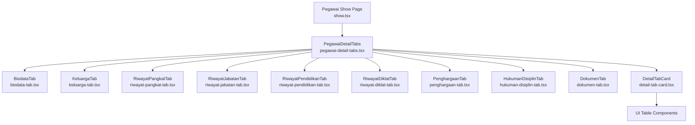
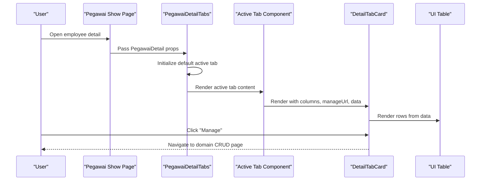
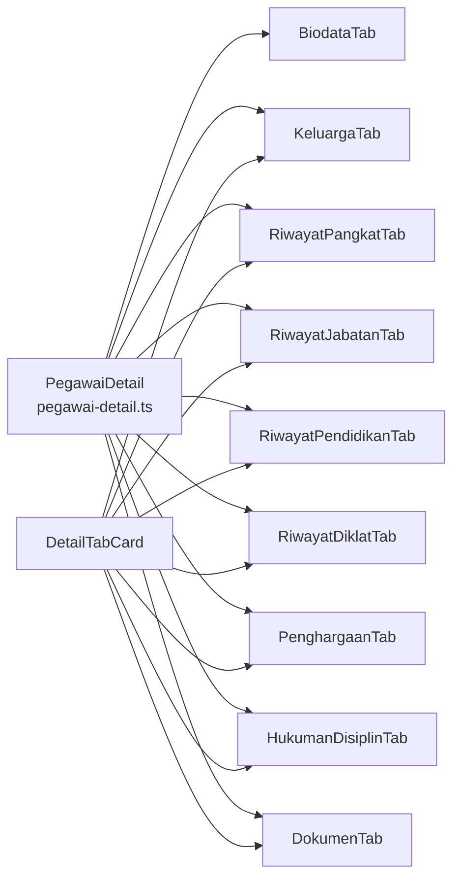

# Employee Tabs System

<cite>
**Referenced Files in This Document**
- [index.ts](file://resources/js/components/pegawai-tabs/index.ts)
- [pegawai-detail-tabs.tsx](file://resources/js/components/pegawai-detail-tabs.tsx)
- [show.tsx](file://resources/js/pages/kepegawaian/pegawai/show.tsx)
- [pegawai-detail.ts](file://resources/js/types/pegawai-detail.ts)
- [detail-tab-card.tsx](file://resources/js/components/pegawai-tabs/detail-tab-card.tsx)
- [biodata-tab.tsx](file://resources/js/components/pegawai-tabs/biodata-tab.tsx)
- [keluarga-tab.tsx](file://resources/js/components/pegawai-tabs/keluarga-tab.tsx)
- [riwayat-pangkat-tab.tsx](file://resources/js/components/pegawai-tabs/riwayat-pangkat-tab.tsx)
- [riwayat-jabatan-tab.tsx](file://resources/js/components/pegawai-tabs/riwayat-jabatan-tab.tsx)
- [riwayat-pendidikan-tab.tsx](file://resources/js/components/pegawai-tabs/riwayat-pendidikan-tab.tsx)
- [riwayat-diklat-tab.tsx](file://resources/js/components/pegawai-tabs/riwayat-diklat-tab.tsx)
- [penghargaan-tab.tsx](file://resources/js/components/pegawai-tabs/penghargaan-tab.tsx)
- [hukuman-disiplin-tab.tsx](file://resources/js/components/pegawai-tabs/hukuman-disiplin-tab.tsx)
- [dokumen-tab.tsx](file://resources/js/components/pegawai-tabs/dokumen-tab.tsx)
</cite>

## Table of Contents
1. [Introduction](#introduction)
2. [Project Structure](#project-structure)
3. [Core Components](#core-components)
4. [Architecture Overview](#architecture-overview)
5. [Detailed Component Analysis](#detailed-component-analysis)
6. [Dependency Analysis](#dependency-analysis)
7. [Performance Considerations](#performance-considerations)
8. [Troubleshooting Guide](#troubleshooting-guide)
9. [Conclusion](#conclusion)

## Introduction
This document describes the Employee Tabs System that organizes civil servant information across multiple specialized tabs. It covers the tab navigation pattern, data loading strategies, form integration, and state synchronization between tabs. The system is built with React and Inertia.js, using a shared employee data model to render structured displays consistently across tabs.

## Project Structure
The Employee Tabs System is composed of:
- A central tab container that orchestrates navigation and content rendering
- Individual tab components for each domain area (personal info, career history, documents, etc.)
- A reusable card component for consistent presentation of tabbed data
- A strongly typed employee data model that defines the shape of loaded data

**Diagram sources**
- [show.tsx:11-101](file://resources/js/pages/kepegawaian/pegawai/show.tsx#L11-L101)
- [pegawai-detail-tabs.tsx:15-79](file://resources/js/components/pegawai-detail-tabs.tsx#L15-L79)
- [detail-tab-card.tsx:31-79](file://resources/js/components/pegawai-tabs/detail-tab-card.tsx#L31-L79)

**Section sources**
- [index.ts:1-11](file://resources/js/components/pegawai-tabs/index.ts#L1-L11)
- [pegawai-detail-tabs.tsx:15-79](file://resources/js/components/pegawai-detail-tabs.tsx#L15-L79)
- [show.tsx:11-101](file://resources/js/pages/kepegawaian/pegawai/show.tsx#L11-L101)

## Core Components
- PegawaiDetailTabs: Central tab container that manages tab selection and renders the appropriate tab content. It initializes with "Biodata" selected by default and provides a horizontal scrollable tab list for accessibility on smaller screens.
- DetailTabCard: A reusable card wrapper that standardizes tab content presentation, including a header with title, description, and a "Manage" action link, plus a table body for tab-specific lists.
- Individual Tab Components: Specialized components for each domain area, each consuming the shared PegawaiDetail type and rendering domain-specific tables via DetailTabCard.

Key integration points:
- The parent page passes the complete employee dataset to the tab container.
- Each tab reads from the shared dataset and renders domain-specific rows.
- Manage links route to dedicated CRUD pages for each domain.

**Section sources**
- [pegawai-detail-tabs.tsx:15-79](file://resources/js/components/pegawai-detail-tabs.tsx#L15-L79)
- [detail-tab-card.tsx:31-79](file://resources/js/components/pegawai-tabs/detail-tab-card.tsx#L31-L79)
- [pegawai-detail.ts:19-121](file://resources/js/types/pegawai-detail.ts#L19-L121)

## Architecture Overview
The system follows a unidirectional data flow:
- Data enters via the parent page (employee show page) and is passed down as props.
- The tab container orchestrates UI state (active tab).
- Each tab component renders its portion of the data using a shared card/table abstraction.
- Navigation actions (e.g., "Manage") integrate with backend routes through controller helpers.

**Diagram sources**
- [show.tsx:97](file://resources/js/pages/kepegawaian/pegawai/show.tsx#L97)
- [pegawai-detail-tabs.tsx:17-79](file://resources/js/components/pegawai-detail-tabs.tsx#L17-L79)
- [detail-tab-card.tsx:48-50](file://resources/js/components/pegawai-tabs/detail-tab-card.tsx#L48-L50)

## Detailed Component Analysis

### Biodata Tab
Purpose: Displays personal and employment-related information in a two-column grid layout.
- Personal info section: birthplace and date, gender, religion, marital status, blood type, address.
- Contact and account section: phone, email, system account linkage.
- Employment info section: employment status badges, status of service, dates (CPNS/PNS), entry date, and various ID numbers and insurance numbers.

Rendering strategy:
- Uses a responsive grid layout to optimize space on mobile and desktop.
- Displays labels and values with muted secondary text for labels and medium-weight values.

Integration:
- Consumes the PegawaiDetail type for all fields.
- No external CRUD integration in this tab; it is read-only.

**Section sources**
- [biodata-tab.tsx:17-220](file://resources/js/components/pegawai-tabs/biodata-tab.tsx#L17-L220)
- [pegawai-detail.ts:19-49](file://resources/js/types/pegawai-detail.ts#L19-L49)

### Detail Tab Card (Reusable Wrapper)
Purpose: Provides a standardized card layout for tabbed content.
- Header: title, description, and a "Manage" button linking to the domain's CRUD page.
- Body: a table with configurable columns and dynamic rows.
- Empty state: displays a centered message when the dataset is empty.

Props interface:
- title: string
- description: string
- manageUrl: string
- columns: string[]
- emptyMessage: string
- isEmpty: boolean
- colSpan: number
- children: ReactNode

Rendering strategy:
- Uses a table with a fixed header row and dynamic body rows.
- Applies a centered empty state cell spanning all columns.

**Section sources**
- [detail-tab-card.tsx:20-79](file://resources/js/components/pegawai-tabs/detail-tab-card.tsx#L20-L79)

### Family Tab
Purpose: Lists family members associated with the employee.
- Columns: Name, Relationship, Gender, Date of Birth, Occupation.
- Empty state: "No family data yet."
- Manage link routes to the family domain CRUD page.

Rendering strategy:
- Uses DetailTabCard to present a table of family entries.
- Iterates over the keluarga array from PegawaiDetail.

**Section sources**
- [keluarga-tab.tsx:7-42](file://resources/js/components/pegawai-tabs/keluarga-tab.tsx#L7-L42)
- [pegawai-detail.ts:54-61](file://resources/js/types/pegawai-detail.ts#L54-L61)

### Career Progression Tabs

#### Riwayat Pangkat (Career Grade History)
Purpose: Displays grade promotions with effective dates, length of service, and active status.
- Columns: Grade/Step, Effective Date (TMT), Length of Service, Order Number, Status.
- Empty state: "No grade history yet."
- Manage link routes to the grade history CRUD page.

Rendering strategy:
- Uses DetailTabCard with a table row per grade entry.
- Shows active status with a badge color indicator.

**Section sources**
- [riwayat-pangkat-tab.tsx:8-57](file://resources/js/components/pegawai-tabs/riwayat-pangkat-tab.tsx#L8-L57)
- [pegawai-detail.ts:62-71](file://resources/js/types/pegawai-detail.ts#L62-L71)

#### Riwayat Jabatan (Position History)
Purpose: Displays position assignments with department and active status.
- Columns: Position, Department, Effective Date (TMT), Order Number, Status.
- Empty state: "No position history yet."
- Manage link routes to the position history CRUD page.

Rendering strategy:
- Uses DetailTabCard with a table row per position entry.
- Shows active status with a badge color indicator.

**Section sources**
- [riwayat-jabatan-tab.tsx:8-54](file://resources/js/components/pegawai-tabs/riwayat-jabatan-tab.tsx#L8-L54)
- [pegawai-detail.ts:72-80](file://resources/js/types/pegawai-detail.ts#L72-L80)

#### Riwayat Pendidikan (Education History)
Purpose: Displays formal education with level, institution, major, and graduation year.
- Columns: Level, Institution, Major, Graduation Year.
- Empty state: "No education history yet."
- Manage link routes to the education history CRUD page.

Rendering strategy:
- Uses DetailTabCard with a table row per education entry.
- Translates education level enums to human-readable labels.

**Section sources**
- [riwayat-pendidikan-tab.tsx:8-42](file://resources/js/components/pegawai-tabs/riwayat-pendidikan-tab.tsx#L8-L42)
- [pegawai-detail.ts:81-87](file://resources/js/types/pegawai-detail.ts#L81-L87)

#### Riwayat Diklat (Training History)
Purpose: Displays training and courses attended with duration and scheduling.
- Columns: Course Name, Type, Sponsor, Duration, Hours.
- Empty state: "No training history yet."
- Manage link routes to the training history CRUD page.

Rendering strategy:
- Uses DetailTabCard with a table row per training entry.
- Formats start/end dates and optional duration in hours.

**Section sources**
- [riwayat-diklat-tab.tsx:7-45](file://resources/js/components/pegawai-tabs/riwayat-diklat-tab.tsx#L7-L45)
- [pegawai-detail.ts:88-96](file://resources/js/types/pegawai-detail.ts#L88-L96)

### Awards Tab
Purpose: Lists awards received by the employee.
- Columns: Award Name, Type, Year, Order Number.
- Empty state: "No award data yet."
- Manage link routes to the awards CRUD page.

Rendering strategy:
- Uses DetailTabCard with a table row per award entry.
- Includes order date as a secondary line under order number.

**Section sources**
- [penghargaan-tab.tsx:7-43](file://resources/js/components/pegawai-tabs/penghargaan-tab.tsx#L7-L43)
- [pegawai-detail.ts:97-104](file://resources/js/types/pegawai-detail.ts#L97-L104)

### Disciplinary Sanctions Tab
Purpose: Displays disciplinary sanctions with validity periods and order numbers.
- Columns: Type, Violation, Effective From, Effective Until, Order Number.
- Empty state: "No disciplinary records yet."
- Manage link routes to the sanctions CRUD page.

Rendering strategy:
- Uses DetailTabCard with a table row per sanction entry.
- Indicates ongoing sanctions when the end date is null.

**Section sources**
- [hukuman-disiplin-tab.tsx:7-47](file://resources/js/components/pegawai-tabs/hukuman-disiplin-tab.tsx#L7-L47)
- [pegawai-detail.ts:105-113](file://resources/js/types/pegawai-detail.ts#L105-L113)

### Documents Tab
Purpose: Lists digital documents associated with the employee.
- Columns: Document Type, Number, Date, File Status.
- Empty state: "No documents yet."
- Manage link routes to the documents CRUD page.

Rendering strategy:
- Uses DetailTabCard with a table row per document entry.
- Shows a badge indicating whether a file is attached.

**Section sources**
- [dokumen-tab.tsx:8-51](file://resources/js/components/pegawai-tabs/dokumen-tab.tsx#L8-L51)
- [pegawai-detail.ts:114-120](file://resources/js/types/pegawai-detail.ts#L114-L120)

### Tab Navigation Pattern
- Default tab: "Biodata"
- Horizontal scrolling list for small screens
- Each trigger maps to a TabsContent with the corresponding tab component
- Manage buttons navigate to dedicated CRUD pages for each domain

**Section sources**
- [pegawai-detail-tabs.tsx:17-79](file://resources/js/components/pegawai-detail-tabs.tsx#L17-L79)

## Dependency Analysis
The tab system is organized around a single data source (PegawaiDetail) and a shared card abstraction. Each tab depends on:
- The shared data model for field access
- The DetailTabCard for consistent UI
- A controller helper to compute manage URLs

**Diagram sources**
- [pegawai-detail.ts:19-121](file://resources/js/types/pegawai-detail.ts#L19-L121)
- [detail-tab-card.tsx:31-79](file://resources/js/components/pegawai-tabs/detail-tab-card.tsx#L31-L79)

**Section sources**
- [pegawai-detail.ts:19-121](file://resources/js/types/pegawai-detail.ts#L19-L121)
- [detail-tab-card.tsx:31-79](file://resources/js/components/pegawai-tabs/detail-tab-card.tsx#L31-L79)

## Performance Considerations
- Prefer server-side pagination for large arrays (family, education, training, awards, sanctions, documents) to reduce initial payload and DOM rendering cost.
- Virtualize long tables using libraries like react-window or @tanstack/react-table for improved scrolling performance.
- Memoize tab components with React.memo to avoid re-rendering when unrelated tabs are active.
- Lazy-load tab content using dynamic imports for infrequently accessed tabs to reduce initial bundle size.
- Debounce or batch updates when integrating forms that modify shared data to minimize re-renders.
- Use stable keys for table rows (preferably item IDs) to improve React reconciliation performance.

## Troubleshooting Guide
Common issues and resolutions:
- Empty data rendering: Ensure isEmpty checks align with the presence of arrays in PegawaiDetail. Confirm that manage URLs are computed correctly using the provided controller helpers.
- Misaligned columns: Verify that colSpan matches the number of columns defined for each tab.
- Broken navigation: Confirm that manageUrl values resolve to valid backend routes.
- Missing labels: Ensure enum label maps are imported and applied for fields like education level, gender, religion, and marital status.

**Section sources**
- [keluarga-tab.tsx:8-19](file://resources/js/components/pegawai-tabs/keluarga-tab.tsx#L8-L19)
- [riwayat-pangkat-tab.tsx:9-20](file://resources/js/components/pegawai-tabs/riwayat-pangkat-tab.tsx#L9-L20)
- [riwayat-jabatan-tab.tsx:9-20](file://resources/js/components/pegawai-tabs/riwayat-jabatan-tab.tsx#L9-L20)
- [riwayat-pendidikan-tab.tsx:9-20](file://resources/js/components/pegawai-tabs/riwayat-pendidikan-tab.tsx#L9-L20)
- [riwayat-diklat-tab.tsx:8-19](file://resources/js/components/pegawai-tabs/riwayat-diklat-tab.tsx#L8-L19)
- [penghargaan-tab.tsx:8-19](file://resources/js/components/pegawai-tabs/penghargaan-tab.tsx#L8-L19)
- [hukuman-disiplin-tab.tsx:8-19](file://resources/js/components/pegawai-tabs/hukuman-disiplin-tab.tsx#L8-L19)
- [dokumen-tab.tsx:9-20](file://resources/js/components/pegawai-tabs/dokumen-tab.tsx#L9-L20)

## Conclusion
The Employee Tabs System provides a scalable, maintainable, and user-friendly way to present complex employee data. By centralizing navigation in a single container, standardizing content presentation with a reusable card component, and leveraging a strong data model, the system supports efficient browsing and seamless integration with domain-specific CRUD flows. Adopting the recommended performance and UX practices will further enhance usability for large datasets and complex employee records.