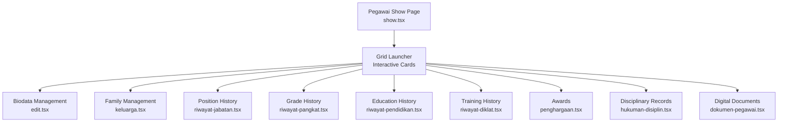
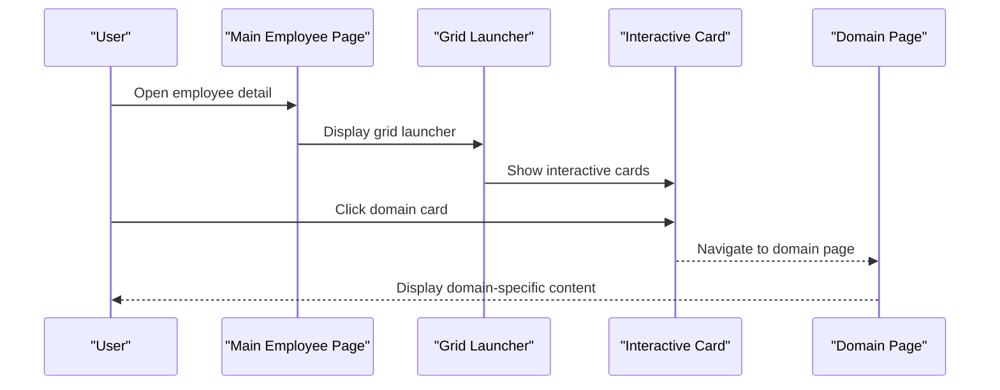

# Employee Tabs System

<cite>
**Referenced Files in This Document**
- [show.tsx](file://resources/js/pages/kepegawaian/pegawai/show.tsx)
- [detail.tsx](file://resources/js/pages/self-service/detail.tsx)
- [pegawai-detail.ts](file://resources/js/types/pegawai-detail.ts)
</cite>

## Update Summary
**Changes Made**
- Removed all documentation sections covering the legacy tab-based system
- Updated architecture overview to reflect the new grid-based launcher approach
- Revised component analysis to focus on the current navigation pattern
- Updated diagrams to show the new menu-based interface instead of tabbed interface
- Removed references to tab components that no longer exist

## Table of Contents
1. [Introduction](#introduction)
2. [Project Structure](#project-structure)
3. [Core Components](#core-components)
4. [Architecture Overview](#architecture-overview)
5. [Detailed Component Analysis](#detailed-component-analysis)
6. [Navigation Patterns](#navigation-patterns)
7. [Performance Considerations](#performance-considerations)
8. [Conclusion](#conclusion)

## Introduction
This document describes the Employee Interface System that provides a modern, grid-based launcher for accessing civil servant information and management functions. The system has evolved from a legacy tab-based interface to a streamlined navigation approach that presents domain-specific management areas through interactive cards with icons and descriptions.

**Important Note**: The legacy tab-based employee detail interface has been completely eliminated. All pegawai-detail-tabs components and tab implementations were removed in favor of a more efficient grid-based navigation system.

## Project Structure
The Employee Interface System is composed of:
- A main employee detail page with a retro-styled grid launcher
- Individual domain-specific pages for each management area
- A comprehensive employee data model that defines the shape of loaded data
- Controller helpers for navigation between different management domains

**Diagram sources**
- [show.tsx:110-203](file://resources/js/pages/kepegawaian/pegawai/show.tsx#L110-L203)
- [detail.tsx:108-200](file://resources/js/pages/self-service/detail.tsx#L108-L200)

**Section sources**
- [show.tsx:110-203](file://resources/js/pages/kepegawaian/pegawai/show.tsx#L110-L203)
- [detail.tsx:108-200](file://resources/js/pages/self-service/detail.tsx#L108-L200)

## Core Components
The system now uses a grid-based launcher approach with interactive cards:

- **Grid Launcher**: A responsive grid layout displaying domain-specific management areas as clickable cards with icons and descriptions
- **Interactive Cards**: Each card represents a management domain with visual styling and hover effects
- **Controller Helpers**: Navigation utilities that generate proper URLs for each domain-specific page
- **Comprehensive Data Model**: The PegawaiDetail type provides all necessary data for both the main page and individual domain pages

Key integration points:
- The main page displays a profile header with basic employee information
- Each card links to the corresponding domain management page
- The system maintains consistent navigation patterns across different contexts (admin vs self-service)

**Section sources**
- [show.tsx:47-103](file://resources/js/pages/kepegawaian/pegawai/show.tsx#L47-L103)
- [detail.tsx:45-100](file://resources/js/pages/self-service/detail.tsx#L45-L100)
- [pegawai-detail.ts:19-122](file://resources/js/types/pegawai-detail.ts#L19-L122)

## Architecture Overview
The system follows a simplified navigation pattern:
- The main page displays a profile header with essential employee information
- A grid launcher presents all management domains as interactive cards
- Each card navigates to the corresponding domain-specific page
- The system maintains consistent styling and navigation patterns across contexts

**Diagram sources**
- [show.tsx:110-203](file://resources/js/pages/kepegawaian/pegawai/show.tsx#L110-L203)
- [detail.tsx:108-200](file://resources/js/pages/self-service/detail.tsx#L108-L200)

## Detailed Component Analysis

### Main Employee Page Layout
Purpose: Displays essential employee information and serves as the central hub for all management activities.
- Profile header: photo, initials, full name, NIP, current position, unit, and rank
- Action buttons: back to employee list and edit data
- Grid launcher: interactive cards for all management domains

Rendering strategy:
- Uses a card-based layout with drop-shadow styling for visual depth
- Responsive design adapts to different screen sizes
- Consistent styling with hover effects and transitions

**Section sources**
- [show.tsx:47-103](file://resources/js/pages/kepegawaian/pegawai/show.tsx#L47-L103)

### Grid Launcher System
Purpose: Presents all management domains as interactive cards with visual indicators.
- Retro-styled cards with colored borders and shadows
- Icon representations for each domain
- Descriptive text explaining each management area
- Hover animations and visual feedback

Domain coverage:
- **Biodata Pribadi**: Personal and contact information management
- **Keluarga**: Family member management and synchronization
- **Riwayat Jabatan**: Position assignment history
- **Riwayat Pangkat**: Grade promotion history
- **Pendidikan**: Educational background and qualifications
- **Riwayat Diklat**: Training and certification records
- **Penghargaan**: Awards and recognition history
- **Hukuman Disiplin**: Disciplinary record management
- **Dokumen Digital**: Digital document archive and management

**Section sources**
- [show.tsx:110-203](file://resources/js/pages/kepegawaian/pegawai/show.tsx#L110-L203)
- [detail.tsx:108-200](file://resources/js/pages/self-service/detail.tsx#L108-L200)

### Navigation Pattern
- **Consistent Styling**: All cards use the same visual design with different accent colors
- **Icon Integration**: Each domain has a representative emoji/icon
- **Descriptive Text**: Clear explanations of what each management area handles
- **Responsive Grid**: Adapts from 1 column on mobile to 3 columns on desktop
- **Hover Effects**: Cards lift and shift on hover for better interactivity

**Section sources**
- [show.tsx:110-203](file://resources/js/pages/kepegawaian/pegawai/show.tsx#L110-L203)
- [detail.tsx:108-200](file://resources/js/pages/self-service/detail.tsx#L108-L200)

## Navigation Patterns
The system uses a simplified navigation approach:
- **Direct Links**: Each card contains a complete navigation link
- **Controller Helpers**: URLs are generated using controller helper functions
- **Context Awareness**: Different contexts (admin vs self-service) share the same navigation structure
- **Visual Hierarchy**: Cards are organized by importance and usage frequency

**Section sources**
- [show.tsx:114-196](file://resources/js/pages/kepegawaian/pegawai/show.tsx#L114-L196)
- [detail.tsx:112-193](file://resources/js/pages/self-service/detail.tsx#L112-L193)

## Performance Considerations
- **Reduced Complexity**: Eliminating tabs reduces component complexity and potential performance bottlenecks
- **Faster Initial Load**: Grid launcher loads faster than tabbed interface with lazy-loaded content
- **Simplified State Management**: Single-page navigation eliminates tab state synchronization issues
- **Better Mobile Experience**: Grid layout adapts better to mobile screen constraints
- **Cache Efficiency**: Direct navigation reduces unnecessary component re-renders

## Conclusion
The Employee Interface System has successfully evolved from a complex tab-based architecture to a streamlined grid-based launcher. This new approach provides better user experience through simplified navigation, improved visual design, and reduced complexity. The system maintains all functionality while offering a more intuitive and accessible interface for managing civil servant information across all domains.

The elimination of the legacy tab system represents a significant improvement in maintainability and user experience, while preserving all essential functionality through direct navigation to domain-specific management pages.