# Kepegawaian-Specific Components

<cite>
**Referenced Files in This Document**
- [crud-form-card.tsx](file://resources/js/components/kepegawaian/crud-form-card.tsx)
- [crud-table.tsx](file://resources/js/components/kepegawaian/crud-table.tsx)
- [data-table-toolbar.tsx](file://resources/js/components/kepegawaian/data-table-toolbar.tsx)
- [multi-step-form.tsx](file://resources/js/components/kepegawaian/multi-step-form.tsx)
- [enum-select.tsx](file://resources/js/components/kepegawaian/enum-select.tsx)
- [index.tsx](file://resources/js/pages/kepegawaian/pegawai/index.tsx)
- [create.tsx](file://resources/js/pages/kepegawaian/pegawai/create.tsx)
- [edit.tsx](file://resources/js/pages/kepegawaian/pegawai/edit.tsx)
- [kepegawaian.ts](file://resources/js/types/kepegawaian.ts)
- [PegawaiApiController.php](file://app/Http/Controllers/Api/PegawaiApiController.php)
- [Pegawai.php](file://app/Models/Pegawai.php)
- [PegawaiValidationRules.php](file://app/Concerns/PegawaiValidationRules.php)
- [StorePegawaiRequest.php](file://app/Http/Requests/Kepegawaian/StorePegawaiRequest.php)
- [Agama.php](file://app/Enums/Agama.php)
- [JenisKelamin.php](file://app/Enums/JenisKelamin.php)
- [StatusKepegawaian.php](file://app/Enums/StatusKepegawaian.php)
- [StatusPegawai.php](file://app/Enums/StatusPegawai.php)
</cite>

## Table of Contents
1. [Introduction](#introduction)
2. [Project Structure](#project-structure)
3. [Core Components](#core-components)
4. [Architecture Overview](#architecture-overview)
5. [Detailed Component Analysis](#detailed-component-analysis)
6. [Dependency Analysis](#dependency-analysis)
7. [Performance Considerations](#performance-considerations)
8. [Accessibility Compliance](#accessibility-compliance)
9. [Responsive Design](#responsive-design)
10. [Troubleshooting Guide](#troubleshooting-guide)
11. [Conclusion](#conclusion)

## Introduction
This document describes Kepegawaian-specific UI components designed for civil servant management workflows. It covers:
- CRUD form cards for employee data entry
- Advanced filtering and sorting tables
- Data table toolbars with bulk actions
- Multi-step forms for complex workflows
- Enum select components for standardized data entry

It explains component composition patterns, form validation integration, data binding strategies, and state management. Practical usage examples, prop interfaces, and backend API integration are included. Accessibility, responsiveness, and HR UX considerations are addressed.

## Project Structure
The Kepegawaian domain spans TypeScript/React frontend components and Laravel backend services:
- Frontend components live under resources/js/components/kepegawaian
- Pages under resources/js/pages/kepegawaian implement workflows
- Types under resources/js/types define shared interfaces
- Backend controllers and models under app/Http/Controllers and app/Models
- Enums under app/Enums define standardized values

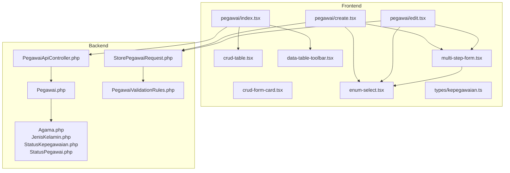

**Diagram sources**
- [index.tsx:1-487](file://resources/js/pages/kepegawaian/pegawai/index.tsx#L1-L487)
- [create.tsx:1-603](file://resources/js/pages/kepegawaian/pegawai/create.tsx#L1-L603)
- [edit.tsx:1-646](file://resources/js/pages/kepegawaian/pegawai/edit.tsx#L1-L646)
- [crud-form-card.tsx:1-63](file://resources/js/components/kepegawaian/crud-form-card.tsx#L1-L63)
- [crud-table.tsx:1-96](file://resources/js/components/kepegawaian/crud-table.tsx#L1-L96)
- [data-table-toolbar.tsx:1-119](file://resources/js/components/kepegawaian/data-table-toolbar.tsx#L1-L119)
- [multi-step-form.tsx:1-129](file://resources/js/components/kepegawaian/multi-step-form.tsx#L1-L129)
- [enum-select.tsx:1-60](file://resources/js/components/kepegawaian/enum-select.tsx#L1-L60)
- [kepegawaian.ts:1-249](file://resources/js/types/kepegawaian.ts#L1-L249)
- [PegawaiApiController.php:1-112](file://app/Http/Controllers/Api/PegawaiApiController.php#L1-L112)
- [Pegawai.php:1-209](file://app/Models/Pegawai.php#L1-L209)
- [PegawaiValidationRules.php:1-78](file://app/Concerns/PegawaiValidationRules.php#L1-L78)
- [StorePegawaiRequest.php:1-51](file://app/Http/Requests/Kepegawaian/StorePegawaiRequest.php#L1-L51)
- [Agama.php:1-26](file://app/Enums/Agama.php#L1-L26)
- [JenisKelamin.php:1-18](file://app/Enums/JenisKelamin.php#L1-L18)
- [StatusKepegawaian.php:1-20](file://app/Enums/StatusKepegawaian.php#L1-L20)
- [StatusPegawai.php:1-24](file://app/Enums/StatusPegawai.php#L1-L24)

**Section sources**
- [index.tsx:1-487](file://resources/js/pages/kepegawaian/pegawai/index.tsx#L1-L487)
- [kepegawaian.ts:1-249](file://resources/js/types/kepegawaian.ts#L1-L249)

## Core Components
This section documents the five Kepegawaian-specific components and their roles.

- CRUD Form Card
  - Purpose: Encapsulates a form inside a card with title, description, and action buttons
  - Key props: title, description, children, onSubmit, onCancel, submitLabel, cancelLabel, isEditing, processing
  - Behavior: Renders a form with a primary submit button and optional cancel button; disables buttons during processing

- CRUD Table
  - Purpose: Renders tabular data with inline edit/delete actions
  - Key props: columns (array of {key, header, cell, className}), data, onEdit, onDelete, emptyMessage, getItemId
  - Behavior: Accepts a generic type T; renders a header row and maps data rows; includes an action column with Edit/Delete buttons

- Data Table Toolbar
  - Purpose: Provides search input and filter selects for table data
  - Key props: searchValue, onSearchChange, searchPlaceholder, filters (array of filter descriptors), showClear, onClear, className
  - Behavior: Grid layout for filters; supports clearing active filters; search debounced via caller logic

- Multi-Step Form
  - Purpose: Guides users through complex forms across multiple logical steps
  - Key props: steps (labels), currentStep, children, onNext, onPrev, onSubmit, isLastStep, isFirstStep, processing, title
  - Behavior: Progress indicator with completion markers; step navigation controls; disables controls during processing

- Enum Select
  - Purpose: Standardized selection for enum-like values with labels
  - Key props: options (array of {value, label?, name?}), value, onChange, placeholder, error, disabled, label, id
  - Behavior: Renders a labeled select; displays error message below when provided

**Section sources**
- [crud-form-card.tsx:1-63](file://resources/js/components/kepegawaian/crud-form-card.tsx#L1-L63)
- [crud-table.tsx:1-96](file://resources/js/components/kepegawaian/crud-table.tsx#L1-L96)
- [data-table-toolbar.tsx:1-119](file://resources/js/components/kepegawaian/data-table-toolbar.tsx#L1-L119)
- [multi-step-form.tsx:1-129](file://resources/js/components/kepegawaian/multi-step-form.tsx#L1-L129)
- [enum-select.tsx:1-60](file://resources/js/components/kepegawaian/enum-select.tsx#L1-L60)

## Architecture Overview
The Kepegawaian components integrate with backend APIs and shared types to support HR workflows.

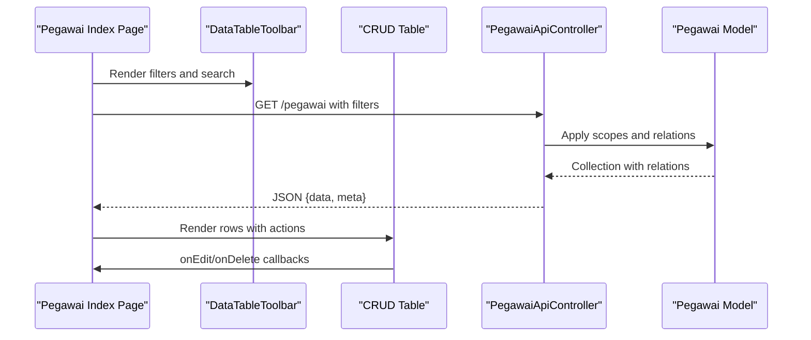

**Diagram sources**
- [index.tsx:279-486](file://resources/js/pages/kepegawaian/pegawai/index.tsx#L279-L486)
- [data-table-toolbar.tsx:38-118](file://resources/js/components/kepegawaian/data-table-toolbar.tsx#L38-L118)
- [crud-table.tsx:28-95](file://resources/js/components/kepegawaian/crud-table.tsx#L28-L95)
- [PegawaiApiController.php:52-110](file://app/Http/Controllers/Api/PegawaiApiController.php#L52-L110)
- [Pegawai.php:179-196](file://app/Models/Pegawai.php#L179-L196)

## Detailed Component Analysis

### CRUD Form Card
- Composition pattern: Stateless functional component receiving props and rendering a Card with a form
- Data binding: Children receive and manage form state; parent supplies onSubmit and optional onCancel
- State management: Controlled via props; processing flag disables actions
- Accessibility: Uses semantic form elements; submit/cancel buttons appropriately labeled

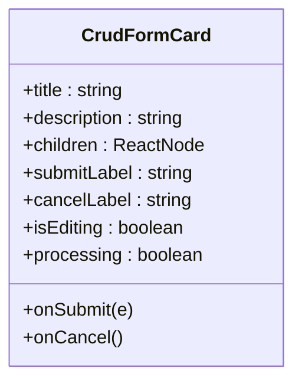

**Diagram sources**
- [crud-form-card.tsx:11-33](file://resources/js/components/kepegawaian/crud-form-card.tsx#L11-L33)

**Section sources**
- [crud-form-card.tsx:1-63](file://resources/js/components/kepegawaian/crud-form-card.tsx#L1-L63)

### CRUD Table
- Composition pattern: Generic component accepting columns and data; delegates rendering to cell functions
- Data binding: getItemId ensures stable keys; onEdit/onDelete callbacks invoked with item
- State management: Caller manages data and actions; component remains presentational
- Accessibility: Proper table semantics; action buttons styled and sized consistently

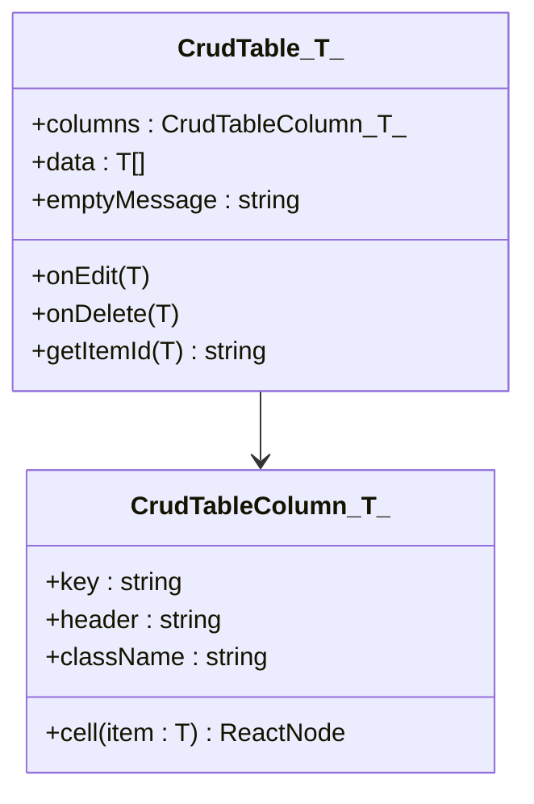

**Diagram sources**
- [crud-table.tsx:12-35](file://resources/js/components/kepegawaian/crud-table.tsx#L12-L35)

**Section sources**
- [crud-table.tsx:1-96](file://resources/js/components/kepegawaian/crud-table.tsx#L1-L96)

### Data Table Toolbar
- Composition pattern: Composite toolbar with search and multiple filter selects
- Data binding: Filters are arrays of descriptors with value/options and onChange handlers
- State management: Caller maintains searchValue and applies debounce; toolbar updates controlled inputs
- Bulk actions: Clear filters button; caller implements bulk operations via URL params

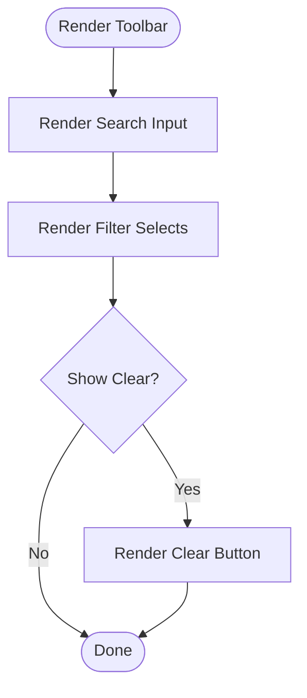

**Diagram sources**
- [data-table-toolbar.tsx:38-118](file://resources/js/components/kepegawaian/data-table-toolbar.tsx#L38-L118)

**Section sources**
- [data-table-toolbar.tsx:1-119](file://resources/js/components/kepegawaian/data-table-toolbar.tsx#L1-L119)

### Multi-Step Form
- Composition pattern: Container with progress bar and navigation controls
- Data binding: Steps and currentStep drive UI; children render step content
- State management: Caller tracks currentStep and invokes onNext/onPrev/onSubmit
- UX: Progress indicator reflects completion; disables controls during processing

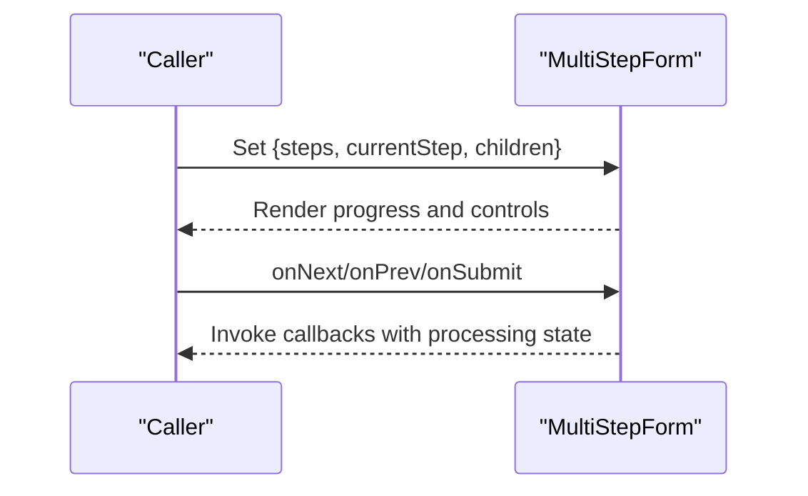

**Diagram sources**
- [multi-step-form.tsx:26-128](file://resources/js/components/kepegawaian/multi-step-form.tsx#L26-L128)

**Section sources**
- [multi-step-form.tsx:1-129](file://resources/js/components/kepegawaian/multi-step-form.tsx#L1-L129)

### Enum Select
- Composition pattern: Reusable select with optional label and error messaging
- Data binding: Options mapped to SelectItems; onChange updates parent state
- Validation integration: Caller passes error messages; component highlights invalid state

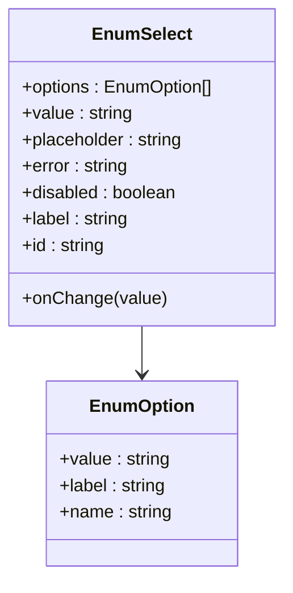

**Diagram sources**
- [enum-select.tsx:11-37](file://resources/js/components/kepegawaian/enum-select.tsx#L11-L37)

**Section sources**
- [enum-select.tsx:1-60](file://resources/js/components/kepegawaian/enum-select.tsx#L1-L60)

### Employee Management Workflows

#### Employee List with Filtering and Sorting
- The index page composes DataTableToolbar and a custom table implementation
- Filters include search, golongan/pangkat, jabatan, unit kerja, and status pegawai
- Sorting toggles direction per column; clears page to reset pagination
- Empty states reflect active filters vs. initial state

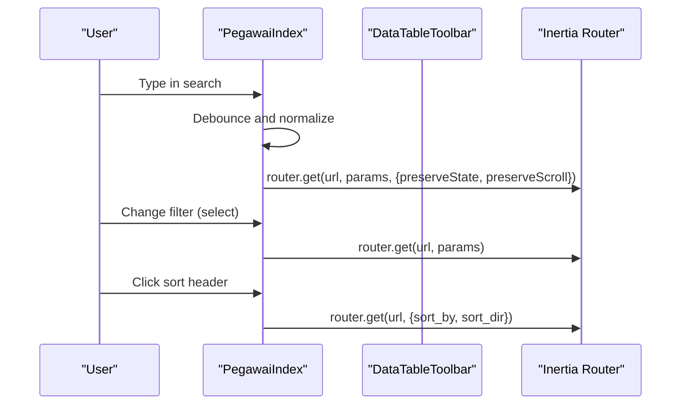

**Diagram sources**
- [index.tsx:91-249](file://resources/js/pages/kepegawaian/pegawai/index.tsx#L91-L249)
- [data-table-toolbar.tsx:38-118](file://resources/js/components/kepegawaian/data-table-toolbar.tsx#L38-L118)

**Section sources**
- [index.tsx:1-487](file://resources/js/pages/kepegawaian/pegawai/index.tsx#L1-L487)

#### Employee Creation with Multi-Step Form
- The create page uses MultiStepForm with three steps: Biodata, Contact & Address, Kepegawaian
- EnumSelect components bind to backend enum lists; Select components bind to reference lists
- Form state managed via Inertia useForm; submission posts to backend

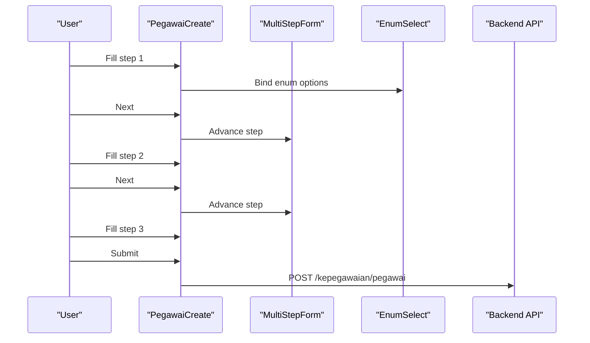

**Diagram sources**
- [create.tsx:44-117](file://resources/js/pages/kepegawaian/pegawai/create.tsx#L44-L117)
- [multi-step-form.tsx:26-128](file://resources/js/components/kepegawaian/multi-step-form.tsx#L26-L128)
- [enum-select.tsx:28-59](file://resources/js/components/kepegawaian/enum-select.tsx#L28-L59)

**Section sources**
- [create.tsx:1-603](file://resources/js/pages/kepegawaian/pegawai/create.tsx#L1-L603)

#### Employee Update with Multi-Step Form
- The edit page mirrors the creation workflow but initializes form state from existing data
- Same enum and reference bindings; submission PUTs to backend

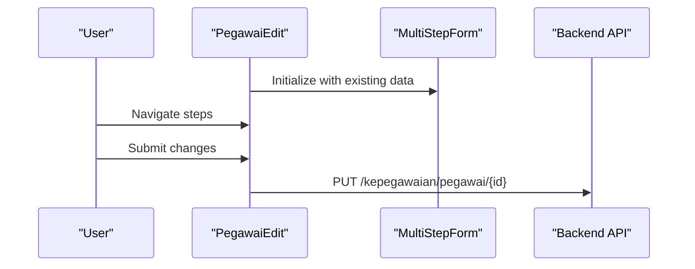

**Diagram sources**
- [edit.tsx:63-116](file://resources/js/pages/kepegawaian/pegawai/edit.tsx#L63-L116)
- [multi-step-form.tsx:26-128](file://resources/js/components/kepegawaian/multi-step-form.tsx#L26-L128)

**Section sources**
- [edit.tsx:1-646](file://resources/js/pages/kepegawaian/pegawai/edit.tsx#L1-L646)

### Backend API Integration
- Employee search and batch lookup are handled by the PegawaiApiController
- Supports single lookup by NIP and batch lookup by array of NIPs
- Supports search by name with optional status filter and pagination metadata

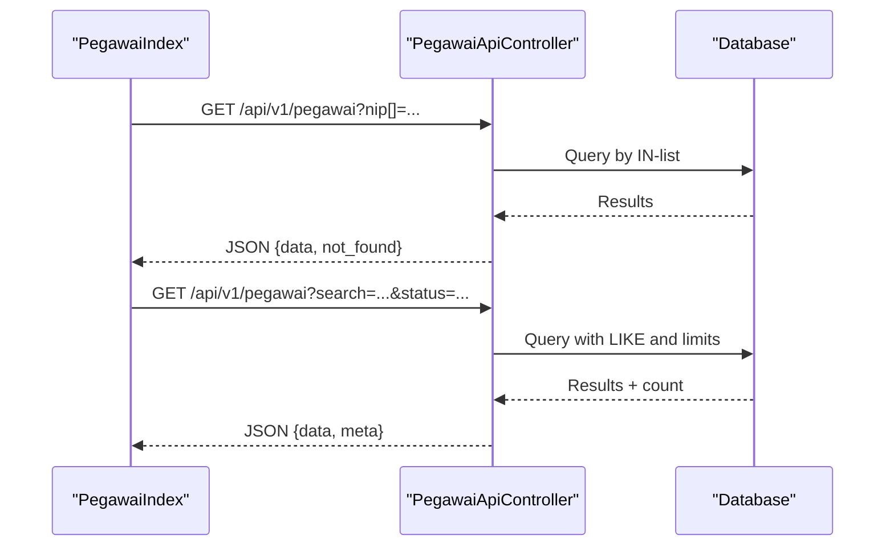

**Diagram sources**
- [PegawaiApiController.php:52-110](file://app/Http/Controllers/Api/PegawaiApiController.php#L52-L110)

**Section sources**
- [PegawaiApiController.php:1-112](file://app/Http/Controllers/Api/PegawaiApiController.php#L1-L112)

### Form Validation Integration
- Frontend types mirror backend enums and model attributes
- Validation rules centralized in PegawaiValidationRules trait
- Form requests enforce authorization and validation messages
- EnumSelect integrates with backend enum lists to ensure valid selections

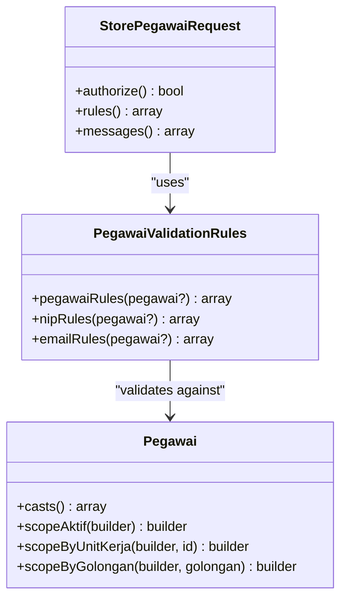

**Diagram sources**
- [StorePegawaiRequest.php:10-30](file://app/Http/Requests/Kepegawaian/StorePegawaiRequest.php#L10-L30)
- [PegawaiValidationRules.php:14-49](file://app/Concerns/PegawaiValidationRules.php#L14-L49)
- [Pegawai.php:46-64](file://app/Models/Pegawai.php#L46-L64)

**Section sources**
- [kepegawaian.ts:1-249](file://resources/js/types/kepegawaian.ts#L1-L249)
- [PegawaiValidationRules.php:1-78](file://app/Concerns/PegawaiValidationRules.php#L1-L78)
- [StorePegawaiRequest.php:1-51](file://app/Http/Requests/Kepegawaian/StorePegawaiRequest.php#L1-L51)
- [Pegawai.php:1-209](file://app/Models/Pegawai.php#L1-L209)
- [Agama.php:1-26](file://app/Enums/Agama.php#L1-L26)
- [JenisKelamin.php:1-18](file://app/Enums/JenisKelamin.php#L1-L18)
- [StatusKepegawaian.php:1-20](file://app/Enums/StatusKepegawaian.php#L1-L20)
- [StatusPegawai.php:1-24](file://app/Enums/StatusPegawai.php#L1-L24)

## Dependency Analysis
- Frontend depends on shared types for consistent typing across pages and components
- Pages depend on components for UI composition and on backend APIs for data
- Components are decoupled from backend specifics; they rely on props and callbacks
- Backend enforces validation and model casting; enums ensure consistent values

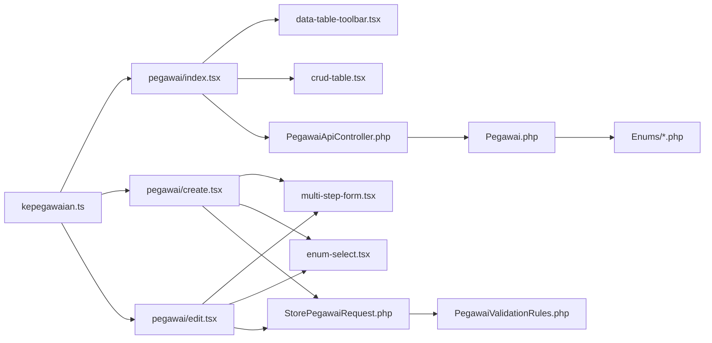

**Diagram sources**
- [kepegawaian.ts:1-249](file://resources/js/types/kepegawaian.ts#L1-L249)
- [index.tsx:1-487](file://resources/js/pages/kepegawaian/pegawai/index.tsx#L1-L487)
- [create.tsx:1-603](file://resources/js/pages/kepegawaian/pegawai/create.tsx#L1-L603)
- [edit.tsx:1-646](file://resources/js/pages/kepegawaian/pegawai/edit.tsx#L1-L646)
- [data-table-toolbar.tsx:1-119](file://resources/js/components/kepegawaian/data-table-toolbar.tsx#L1-L119)
- [crud-table.tsx:1-96](file://resources/js/components/kepegawaian/crud-table.tsx#L1-L96)
- [multi-step-form.tsx:1-129](file://resources/js/components/kepegawaian/multi-step-form.tsx#L1-L129)
- [enum-select.tsx:1-60](file://resources/js/components/kepegawaian/enum-select.tsx#L1-L60)
- [PegawaiApiController.php:1-112](file://app/Http/Controllers/Api/PegawaiApiController.php#L1-L112)
- [StorePegawaiRequest.php:1-51](file://app/Http/Requests/Kepegawaian/StorePegawaiRequest.php#L1-L51)
- [PegawaiValidationRules.php:1-78](file://app/Concerns/PegawaiValidationRules.php#L1-L78)
- [Pegawai.php:1-209](file://app/Models/Pegawai.php#L1-L209)
- [Agama.php:1-26](file://app/Enums/Agama.php#L1-L26)
- [JenisKelamin.php:1-18](file://app/Enums/JenisKelamin.php#L1-L18)
- [StatusKepegawaian.php:1-20](file://app/Enums/StatusKepegawaian.php#L1-L20)
- [StatusPegawai.php:1-24](file://app/Enums/StatusPegawai.php#L1-L24)

**Section sources**
- [kepegawaian.ts:1-249](file://resources/js/types/kepegawaian.ts#L1-L249)
- [index.tsx:1-487](file://resources/js/pages/kepegawaian/pegawai/index.tsx#L1-L487)
- [create.tsx:1-603](file://resources/js/pages/kepegawaian/pegawai/create.tsx#L1-L603)
- [edit.tsx:1-646](file://resources/js/pages/kepegawaian/pegawai/edit.tsx#L1-L646)

## Performance Considerations
- Debounced search input reduces unnecessary network requests
- Pagination metadata enables efficient loading of large datasets
- Column-based filtering minimizes server-side joins by using indexed foreign keys
- Multi-step forms reduce initial payload and improve perceived performance
- Generic table component avoids re-rendering overhead by delegating data to caller

## Accessibility Compliance
- Semantic HTML: Forms, tables, and buttons use native elements
- Labels: EnumSelect and inputs include labels and ids for screen readers
- Focus management: Buttons and selects maintain keyboard navigability
- ARIA: No explicit aria-* attributes; relies on semantic markup and proper labeling
- Color contrast: Components use theme-safe variants; error states use destructive palette

## Responsive Design
- Grid-based layouts adapt to mobile and desktop widths
- Toolbars stack vertically on small screens and align horizontally on larger screens
- Tables use horizontal scrolling containers for narrow viewports
- Step indicators scale appropriately across breakpoints

## Troubleshooting Guide
- Validation errors: EnumSelect displays error messages; ensure options match backend enum values
- API failures: Check network tab for 4xx/5xx responses; verify HMAC signature and Sanctum auth
- Filtering issues: Confirm filter keys match backend query parameters; ensure select values are valid ids
- Multi-step navigation: Ensure currentStep boundaries and processing flags are respected
- Data binding: Verify useForm state keys align with backend field names and enum slugs

**Section sources**
- [enum-select.tsx:38-58](file://resources/js/components/kepegawaian/enum-select.tsx#L38-L58)
- [PegawaiValidationRules.php:16-49](file://app/Concerns/PegawaiValidationRules.php#L16-L49)
- [StorePegawaiRequest.php:32-49](file://app/Http/Requests/Kepegawaian/StorePegawaiRequest.php#L32-L49)

## Conclusion
The Kepegawaian components provide a cohesive, reusable foundation for civil servant management workflows. They emphasize:
- Clear separation of concerns between presentational components and page logic
- Strong typing and standardized enums for predictable data entry
- Robust filtering, sorting, and pagination for scalable data management
- Multi-step forms for complex, multi-domain data capture
- Seamless integration with backend APIs and validation

These patterns enable maintainable, accessible, and responsive HR applications tailored to the needs of Pengadilan Agama Penajam.