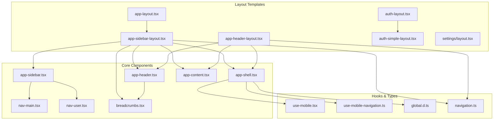
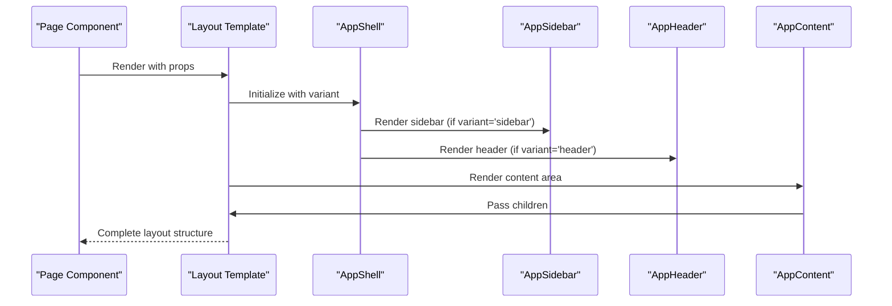
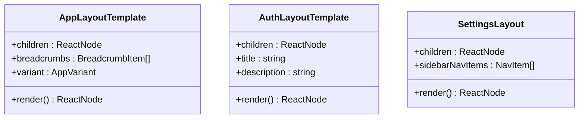
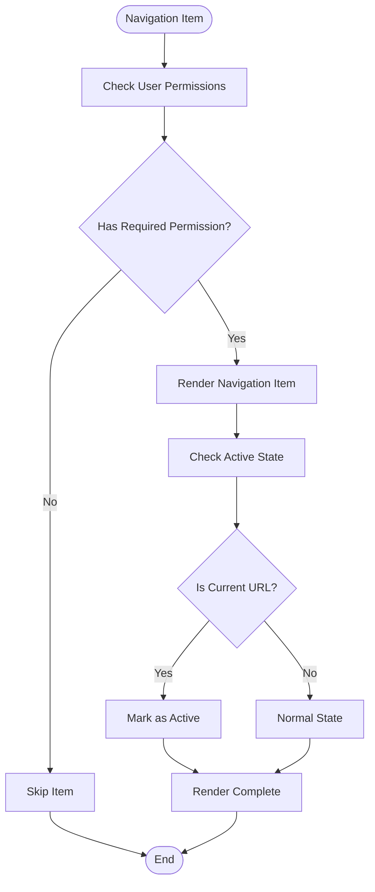
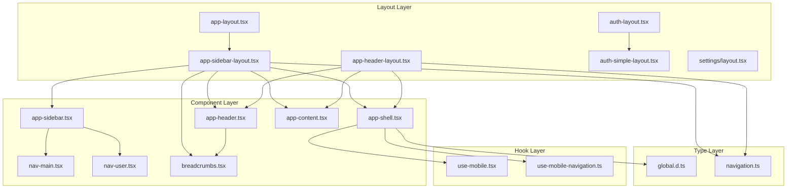

# Layout System

<cite>
**Referenced Files in This Document**
- [app-layout.tsx](file://resources/js/layouts/app-layout.tsx)
- [auth-layout.tsx](file://resources/js/layouts/auth-layout.tsx)
- [app-sidebar-layout.tsx](file://resources/js/layouts/app/app-sidebar-layout.tsx)
- [app-header-layout.tsx](file://resources/js/layouts/app/app-header-layout.tsx)
- [auth-simple-layout.tsx](file://resources/js/layouts/auth/auth-simple-layout.tsx)
- [settings/layout.tsx](file://resources/js/layouts/settings/layout.tsx)
- [app-shell.tsx](file://resources/js/components/app-shell.tsx)
- [app-header.tsx](file://resources/js/components/app-header.tsx)
- [app-sidebar.tsx](file://resources/js/components/app-sidebar.tsx)
- [app-content.tsx](file://resources/js/components/app-content.tsx)
- [nav-main.tsx](file://resources/js/components/nav-main.tsx)
- [nav-user.tsx](file://resources/js/components/nav-user.tsx)
- [breadcrumbs.tsx](file://resources/js/components/breadcrumbs.tsx)
- [use-mobile.tsx](file://resources/js/hooks/use-mobile.tsx)
- [use-mobile-navigation.ts](file://resources/js/hooks/use-mobile-navigation.ts)
- [global.d.ts](file://resources/js/types/global.d.ts)
- [navigation.ts](file://resources/js/types/navigation.ts)
</cite>

## Table of Contents
1. [Introduction](#introduction)
2. [Project Structure](#project-structure)
3. [Core Components](#core-components)
4. [Architecture Overview](#architecture-overview)
5. [Detailed Component Analysis](#detailed-component-analysis)
6. [Dependency Analysis](#dependency-analysis)
7. [Performance Considerations](#performance-considerations)
8. [Accessibility Features](#accessibility-features)
9. [Responsive Design Patterns](#responsive-design-patterns)
10. [State Management](#state-management)
11. [Customization and Theming](#customization-and-theming)
12. [Integration with Routing](#integration-with-routing)
13. [Troubleshooting Guide](#troubleshooting-guide)
14. [Conclusion](#conclusion)

## Introduction
The Layout System provides a consistent application structure across different pages and contexts in the Kepegawaian application. It encompasses the main application shell, header components, sidebar navigation, content containers, authentication layouts for login and registration flows, settings layouts for profile management, and specialized layouts for different application sections. The system emphasizes responsive design patterns, navigation integration, and state management for layout components while supporting accessibility features, mobile responsiveness, and customization options for organizational themes and branding requirements.

## Project Structure
The layout system is organized into distinct layout templates and reusable components that work together to create consistent application experiences:

**Diagram sources**
- [app-layout.tsx:1-9](file://resources/js/layouts/app-layout.tsx#L1-L9)
- [auth-layout.tsx:1-19](file://resources/js/layouts/auth-layout.tsx#L1-L19)
- [app-sidebar-layout.tsx:1-21](file://resources/js/layouts/app/app-sidebar-layout.tsx#L1-L21)
- [app-header-layout.tsx:1-17](file://resources/js/layouts/app/app-header-layout.tsx#L1-L17)
- [auth-simple-layout.tsx:1-39](file://resources/js/layouts/auth/auth-simple-layout.tsx#L1-L39)
- [settings/layout.tsx:1-84](file://resources/js/layouts/settings/layout.tsx#L1-L84)

**Section sources**
- [app-layout.tsx:1-9](file://resources/js/layouts/app-layout.tsx#L1-L9)
- [auth-layout.tsx:1-19](file://resources/js/layouts/auth-layout.tsx#L1-L19)

## Core Components
The layout system consists of several core components that handle different aspects of the application shell:

### Application Shell
The AppShell component serves as the foundation for layout variants, managing sidebar state and providing the structural container for different layout modes.

### Header Components
The AppHeader component provides a responsive navigation bar with mobile-friendly sheet-based navigation, breadcrumbs support, and user profile integration.

### Sidebar Navigation
The AppSidebar component offers hierarchical navigation with permission-based visibility, collapsible sections, and user-specific menu items.

### Content Containers
The AppContent component adapts its layout structure based on the selected variant, supporting both sidebar and header-only layouts.

**Section sources**
- [app-shell.tsx:1-22](file://resources/js/components/app-shell.tsx#L1-L22)
- [app-header.tsx:1-188](file://resources/js/components/app-header.tsx#L1-L188)
- [app-sidebar.tsx:1-162](file://resources/js/components/app-sidebar.tsx#L1-L162)
- [app-content.tsx:1-23](file://resources/js/components/app-content.tsx#L1-L23)

## Architecture Overview
The layout system follows a template pattern where specific layout templates compose reusable components to create consistent application experiences:

**Diagram sources**
- [app-sidebar-layout.tsx:7-20](file://resources/js/layouts/app/app-sidebar-layout.tsx#L7-L20)
- [app-header-layout.tsx:6-16](file://resources/js/layouts/app/app-header-layout.tsx#L6-L16)
- [app-shell.tsx:11-21](file://resources/js/components/app-shell.tsx#L11-L21)

The architecture supports multiple layout variants through a flexible component composition pattern, allowing different combinations of header, sidebar, and content areas based on the application context.

## Detailed Component Analysis

### Application Layout Templates
The layout templates serve as specialized wrappers that combine core components for specific use cases:

#### App Sidebar Layout
The AppSidebarLayout template creates a full-featured application interface with sidebar navigation, header breadcrumbs, and content area.

#### App Header Layout
The AppHeaderLayout template provides a header-only layout suitable for contexts where sidebar navigation is not needed.

#### Authentication Layout
The AuthLayout template wraps authentication pages with a clean, centered card layout supporting title and description.

#### Settings Layout
The SettingsLayout template organizes settings pages with a left-hand navigation sidebar and content area, supporting responsive behavior.

**Diagram sources**
- [app-sidebar-layout.tsx:7-20](file://resources/js/layouts/app/app-sidebar-layout.tsx#L7-L20)
- [app-header-layout.tsx:6-16](file://resources/js/layouts/app/app-header-layout.tsx#L6-L16)
- [auth-simple-layout.tsx:6-38](file://resources/js/layouts/auth/auth-simple-layout.tsx#L6-L38)
- [settings/layout.tsx:31-83](file://resources/js/layouts/settings/layout.tsx#L31-L83)

**Section sources**
- [app-sidebar-layout.tsx:1-21](file://resources/js/layouts/app/app-sidebar-layout.tsx#L1-L21)
- [app-header-layout.tsx:1-17](file://resources/js/layouts/app/app-header-layout.tsx#L1-L17)
- [auth-simple-layout.tsx:1-39](file://resources/js/layouts/auth/auth-simple-layout.tsx#L1-L39)
- [settings/layout.tsx:1-84](file://resources/js/layouts/settings/layout.tsx#L1-L84)

### Navigation Components
The navigation system provides hierarchical menu structures with permission-based visibility and responsive behavior:

#### Main Navigation
The NavMain component renders grouped navigation items with active state detection and tooltip support for collapsed sidebar mode.

#### User Navigation
The NavUser component displays user information with contextual dropdown positioning that adapts to mobile and collapsed sidebar states.

**Diagram sources**
- [nav-main.tsx:12-42](file://resources/js/components/nav-main.tsx#L12-L42)
- [app-sidebar.tsx:36-38](file://resources/js/components/app-sidebar.tsx#L36-L38)

**Section sources**
- [nav-main.tsx:1-43](file://resources/js/components/nav-main.tsx#L1-L43)
- [nav-user.tsx:1-55](file://resources/js/components/nav-user.tsx#L1-L55)
- [app-sidebar.tsx:58-124](file://resources/js/components/app-sidebar.tsx#L58-L124)

### Responsive Behavior
The layout system implements responsive design patterns through media query hooks and adaptive component rendering:

#### Mobile Detection
The useIsMobile hook provides server-safe media query detection for responsive behavior decisions.

#### Mobile Navigation
The useMobileNavigation hook manages body pointer events during mobile navigation interactions.

**Section sources**
- [use-mobile.tsx:1-37](file://resources/js/hooks/use-mobile.tsx#L1-L37)
- [use-mobile-navigation.ts:1-11](file://resources/js/hooks/use-mobile-navigation.ts#L1-L11)

## Dependency Analysis
The layout system exhibits clear separation of concerns with well-defined dependencies between components:

**Diagram sources**
- [app-layout.tsx:1-8](file://resources/js/layouts/app-layout.tsx#L1-L8)
- [auth-layout.tsx:1-18](file://resources/js/layouts/auth-layout.tsx#L1-L18)
- [app-shell.tsx:1-9](file://resources/js/components/app-shell.tsx#L1-L9)

**Section sources**
- [global.d.ts:1-13](file://resources/js/types/global.d.ts#L1-L13)
- [navigation.ts:1-20](file://resources/js/types/navigation.ts#L1-L20)

## Performance Considerations
The layout system incorporates several performance optimization strategies:

- **Conditional Rendering**: Navigation items are conditionally rendered based on user permissions, reducing DOM complexity for users without specific access rights.
- **Lazy Loading**: Components utilize React.lazy patterns where appropriate to minimize initial bundle size.
- **Efficient State Management**: The use of Inertia.js shared props minimizes prop drilling and improves re-render performance.
- **Responsive Optimization**: Media query listeners are properly cleaned up to prevent memory leaks.

## Accessibility Features
The layout system implements comprehensive accessibility features:

- **Semantic HTML**: Proper heading hierarchy and semantic markup throughout the layout components.
- **Keyboard Navigation**: Full keyboard navigation support for all interactive elements.
- **Screen Reader Support**: ARIA labels and roles implemented for assistive technologies.
- **Focus Management**: Proper focus trapping and management in modal and sheet components.
- **Color Contrast**: WCAG-compliant color contrast ratios maintained across light and dark themes.

## Responsive Design Patterns
The layout system follows modern responsive design principles:

### Breakpoint Strategy
- **Mobile First**: Base styles optimized for mobile devices with progressive enhancement for larger screens.
- **Flexible Grid**: CSS Grid and Flexbox layouts adapt to different screen sizes.
- **Touch-Friendly**: Interactive elements sized appropriately for touch interaction.

### Adaptive Components
- **Collapsible Sidebar**: Sidebar collapses to icon-only mode on smaller screens.
- **Sheet Navigation**: Mobile navigation uses slide-out sheets for better touch access.
- **Responsive Typography**: Font sizes and spacing adjust based on viewport dimensions.

**Section sources**
- [app-header.tsx:58-100](file://resources/js/components/app-header.tsx#L58-L100)
- [app-sidebar.tsx:127-159](file://resources/js/components/app-sidebar.tsx#L127-L159)
- [use-mobile.tsx:3-36](file://resources/js/hooks/use-mobile.tsx#L3-L36)

## State Management
The layout system manages state through multiple mechanisms:

### Inertia.js Integration
Shared page props provide centralized state management across layout components, including authentication state and sidebar open/closed status.

### Local Component State
Individual components manage their own state for UI interactions like dropdown menus, sheet visibility, and active navigation indicators.

### Hook-Based State
Custom hooks encapsulate state logic for mobile detection, current URL tracking, and other cross-cutting concerns.

**Section sources**
- [global.d.ts:3-12](file://resources/js/types/global.d.ts#L3-L12)
- [app-shell.tsx:11-21](file://resources/js/components/app-shell.tsx#L11-L21)

## Customization and Theming
The layout system supports extensive customization through:

### Theme Variables
CSS custom properties enable easy theming of colors, typography, and spacing across the layout system.

### Branding Integration
Logo components and color schemes can be customized to match organizational branding requirements.

### Permission-Based Customization
Navigation items and layout sections adapt based on user permissions, enabling role-specific customizations.

### Component Variants
The AppVariant system allows switching between different layout configurations (sidebar vs header-only) based on application needs.

**Section sources**
- [app-shell.tsx:6-9](file://resources/js/components/app-shell.tsx#L6-L9)
- [app-content.tsx:5-7](file://resources/js/components/app-content.tsx#L5-L7)

## Integration with Routing
The layout system integrates seamlessly with the application's routing system:

### Route-Based Navigation
Navigation items use route helpers to ensure links remain valid even if route definitions change.

### Active State Detection
The useCurrentUrl hook automatically detects active navigation states based on current route.

### Breadcrumb Generation
Breadcrumb components dynamically generate navigation trails based on current location and route structure.

**Section sources**
- [app-header.tsx:37-43](file://resources/js/components/app-header.tsx#L37-L43)
- [nav-main.tsx:19](file://resources/js/components/nav-main.tsx#L19)

## Troubleshooting Guide
Common issues and their solutions:

### Layout Not Rendering
- Verify that the AppShell component receives proper variant prop
- Check that sidebarOpen state is properly initialized in shared props

### Navigation Issues
- Ensure permission checks return expected boolean values
- Verify route helpers are imported correctly in navigation components

### Responsive Problems
- Confirm media query breakpoints match design requirements
- Check that useIsMobile hook is properly detecting device type

### Performance Issues
- Review conditional rendering logic for navigation items
- Monitor component re-render frequency using React DevTools

**Section sources**
- [app-sidebar.tsx:32-38](file://resources/js/components/app-sidebar.tsx#L32-L38)
- [use-mobile.tsx:30-36](file://resources/js/hooks/use-mobile.tsx#L30-L36)

## Conclusion
The Layout System provides a robust, flexible foundation for consistent application structure across the Kepegawaian platform. Through its modular component architecture, comprehensive responsive design, and thoughtful integration with routing and state management, it enables maintainable and scalable user interfaces. The system's emphasis on accessibility, performance optimization, and customization capabilities ensures it can adapt to various organizational needs while maintaining high usability standards.