# React Component System

<cite>
**Referenced Files in This Document**
- [button.tsx](file://resources/js/components/ui/button.tsx)
- [input.tsx](file://resources/js/components/ui/input.tsx)
- [card.tsx](file://resources/js/components/ui/card.tsx)
- [table.tsx](file://resources/js/components/ui/table.tsx)
- [dialog.tsx](file://resources/js/components/ui/dialog.tsx)
- [number-ticker.tsx](file://resources/js/components/ui/number-ticker.tsx)
- [blur-fade.tsx](file://resources/js/components/ui/blur-fade.tsx)
- [border-beam.tsx](file://resources/js/components/ui/border-beam.tsx)
- [shimmer-button.tsx](file://resources/js/components/ui/shimmer-button.tsx)
- [particles.tsx](file://resources/js/components/ui/particles.tsx)
- [crud-form-card.tsx](file://resources/js/components/kepegawaian/crud-form-card.tsx)
- [crud-table.tsx](file://resources/js/components/kepegawaian/crud-table.tsx)
- [data-table-toolbar.tsx](file://resources/js/components/kepegawaian/data-table-toolbar.tsx)
- [multi-step-form.tsx](file://resources/js/components/kepegawaian/multi-step-form.tsx)
- [enum-select.tsx](file://resources/js/components/kepegawaian/enum-select.tsx)
- [pegawai-create.tsx](file://resources/js/pages/kepegawaian/pegawai/create.tsx)
- [pegawai-index.tsx](file://resources/js/pages/kepegawaian/pegawai/index.tsx)
- [app-shell.tsx](file://resources/js/components/app-shell.tsx)
- [utils.ts](file://resources/js/lib/utils.ts)
- [ui-types.ts](file://resources/js/types/ui.ts)
</cite>

## Update Summary
**Changes Made**
- Added comprehensive Magic UI component integration documentation
- Updated Core Components section to include 5 new animation-capable components
- Enhanced Architecture Overview to reflect motion/react library integration
- Added detailed component analysis for NumberTicker, BlurFade, BorderBeam, ShimmerButton, and Particles
- Updated dependency analysis to include motion library
- Expanded performance considerations for animated components

## Table of Contents
1. [Introduction](#introduction)
2. [Project Structure](#project-structure)
3. [Core Components](#core-components)
4. [Architecture Overview](#architecture-overview)
5. [Detailed Component Analysis](#detailed-component-analysis)
6. [Dependency Analysis](#dependency-analysis)
7. [Performance Considerations](#performance-considerations)
8. [Troubleshooting Guide](#troubleshooting-guide)
9. [Conclusion](#conclusion)
10. [Appendices](#appendices)

## Introduction
This document describes the React Component System used in the kepegawaian application. It focuses on the modular component architecture built with Radix UI primitives and custom kepegawaian-specific components, now enhanced with comprehensive Magic UI component integration. The system emphasizes composability, reusability, and accessibility through shared UI primitives (buttons, inputs, cards, tables, dialogs), Magic UI animation components (NumberTicker, BlurFade, BorderBeam, ShimmerButton, Particles), and domain-specific building blocks (CRUD form cards, data tables, multi-step forms, and employee tabs). Practical usage patterns, prop interfaces, state management integration via Inertia, and accessibility features are covered to guide consistent extension and maintenance of the component library.

## Project Structure
The component system is organized by feature domains:
- UI primitives under resources/js/components/ui (Radix-based wrappers, Magic UI animation components, and variants)
- Kepegawaian-specific components under resources/js/components/kepegawaian
- Page-level usage under resources/js/pages
- Shared utilities under resources/js/lib/utils.ts
- Type definitions under resources/js/types

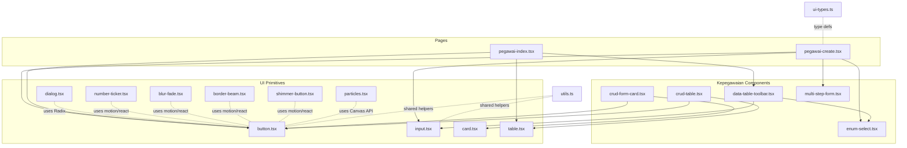

**Diagram sources**
- [button.tsx:1-65](file://resources/js/components/ui/button.tsx#L1-L65)
- [input.tsx:1-22](file://resources/js/components/ui/input.tsx#L1-L22)
- [card.tsx:1-69](file://resources/js/components/ui/card.tsx#L1-L69)
- [table.tsx:1-115](file://resources/js/components/ui/table.tsx#L1-L115)
- [dialog.tsx:1-134](file://resources/js/components/ui/dialog.tsx#L1-L134)
- [number-ticker.tsx:1-73](file://resources/js/components/ui/number-ticker.tsx#L1-L73)
- [blur-fade.tsx:1-93](file://resources/js/components/ui/blur-fade.tsx#L1-L93)
- [border-beam.tsx:1-106](file://resources/js/components/ui/border-beam.tsx#L1-L106)
- [shimmer-button.tsx:1-97](file://resources/js/components/ui/shimmer-button.tsx#L1-L97)
- [particles.tsx:1-320](file://resources/js/components/ui/particles.tsx#L1-L320)
- [crud-form-card.tsx:1-63](file://resources/js/components/kepegawaian/crud-form-card.tsx#L1-L63)
- [crud-table.tsx:1-96](file://resources/js/components/kepegawaian/crud-table.tsx#L1-L96)
- [data-table-toolbar.tsx:1-119](file://resources/js/components/kepegawaian/data-table-toolbar.tsx#L1-L119)
- [multi-step-form.tsx:1-129](file://resources/js/components/kepegawaian/multi-step-form.tsx#L1-L129)
- [enum-select.tsx:1-60](file://resources/js/components/kepegawaian/enum-select.tsx#L1-L60)
- [pegawai-create.tsx:1-603](file://resources/js/pages/kepegawaian/pegawai/create.tsx#L1-L603)
- [pegawai-index.tsx:1-487](file://resources/js/pages/kepegawaian/pegawai/index.tsx#L1-L487)
- [utils.ts:1-13](file://resources/js/lib/utils.ts#L1-L13)
- [ui-types.ts:1-17](file://resources/js/types/ui.ts#L1-L17)

**Section sources**
- [button.tsx:1-65](file://resources/js/components/ui/button.tsx#L1-L65)
- [input.tsx:1-22](file://resources/js/components/ui/input.tsx#L1-L22)
- [card.tsx:1-69](file://resources/js/components/ui/card.tsx#L1-L69)
- [table.tsx:1-115](file://resources/js/components/ui/table.tsx#L1-L115)
- [dialog.tsx:1-134](file://resources/js/components/ui/dialog.tsx#L1-L134)
- [number-ticker.tsx:1-73](file://resources/js/components/ui/number-ticker.tsx#L1-L73)
- [blur-fade.tsx:1-93](file://resources/js/components/ui/blur-fade.tsx#L1-L93)
- [border-beam.tsx:1-106](file://resources/js/components/ui/border-beam.tsx#L1-L106)
- [shimmer-button.tsx:1-97](file://resources/js/components/ui/shimmer-button.tsx#L1-L97)
- [particles.tsx:1-320](file://resources/js/components/ui/particles.tsx#L1-L320)
- [crud-form-card.tsx:1-63](file://resources/js/components/kepegawaian/crud-form-card.tsx#L1-L63)
- [crud-table.tsx:1-96](file://resources/js/components/kepegawaian/crud-table.tsx#L1-L96)
- [data-table-toolbar.tsx:1-119](file://resources/js/components/kepegawaian/data-table-toolbar.tsx#L1-L119)
- [multi-step-form.tsx:1-129](file://resources/js/components/kepegawaian/multi-step-form.tsx#L1-L129)
- [enum-select.tsx:1-60](file://resources/js/components/kepegawaian/enum-select.tsx#L1-L60)
- [pegawai-create.tsx:1-603](file://resources/js/pages/kepegawaian/pegawai/create.tsx#L1-L603)
- [pegawai-index.tsx:1-487](file://resources/js/pages/kepegawaian/pegawai/index.tsx#L1-L487)
- [utils.ts:1-13](file://resources/js/lib/utils.ts#L1-L13)
- [ui-types.ts:1-17](file://resources/js/types/ui.ts#L1-L17)

## Core Components
This section documents the foundational UI primitives and kepegawaian-specific components that form the backbone of the system, now enhanced with Magic UI animation components.

### Traditional UI Primitives
- **Button**
  - Purpose: Unified action control with variants and sizes.
  - Variants: default, destructive, outline, secondary, ghost, link.
  - Sizes: default, xs, sm, lg, icon, icon-xs, icon-sm, icon-lg.
  - Accessibility: Focus-visible ring, aria-invalid integration, SVG pointer events preserved.
  - Composition: Uses Slot for asChild pattern to wrap anchor-like elements.

- **Input**
  - Purpose: Text input with focus-visible ring, disabled states, and aria-invalid support.
  - Accessibility: Inherits focus-visible ring and destructive ring on invalid state.

- **Card**
  - Purpose: Container with header/title/description/content/footer segments.
  - Composition: Provides semantic slots for structured card layouts.

- **Table**
  - Purpose: Scrollable responsive table container with header/body/footer/row/cell/head/caption helpers.
  - Accessibility: Hover and selected states; checkbox-aware alignment.

- **Dialog**
  - Purpose: Modal overlay with portal, close button, and header/footer slots.
  - Accessibility: Overlay animation, close button with screen reader label.

### Magic UI Animation Components
- **NumberTicker**
  - Purpose: Animated number counter with spring physics and decimal formatting.
  - Features: Spring animation, configurable direction (up/down), delay, decimal places.
  - Dependencies: motion/react library for animation.
  - Props: value, startValue, direction, delay, decimalPlaces.

- **BlurFade**
  - Purpose: Smooth blur/fade entrance animation with directional movement.
  - Features: Directional animation (up/down/left/right), configurable blur distance, in-view detection.
  - Dependencies: motion/react library with useInView hook.
  - Props: children, className, variant, duration, delay, offset, direction, inView, inViewMargin, blur.

- **BorderBeam**
  - Purpose: Animated border beam effect with gradient colors and continuous motion.
  - Features: Configurable size, duration, colors, reverse direction, initial offset.
  - Dependencies: motion/react library for continuous animation.
  - Props: size, duration, delay, colorFrom, colorTo, transition, className, style, reverse, initialOffset, borderWidth.

- **ShimmerButton**
  - Purpose: Animated button with shimmer effect and gradient background.
  - Features: Customizable shimmer color/size/duration, border radius, background color.
  - Dependencies: motion/react library for animation effects.
  - Props: shimmerColor, shimmerSize, borderRadius, shimmerDuration, background, className, children.

- **Particles**
  - Purpose: Interactive particle system with mouse interaction and canvas rendering.
  - Features: Configurable quantity, staticity/ease, size, color, velocity vectors.
  - Dependencies: Canvas API with requestAnimationFrame for smooth animation.
  - Props: className, quantity, staticity, ease, size, refresh, color, vx, vy.

### Kepegawaian-Specific Components
- **CRUD Form Card**
  - Purpose: Encapsulates form UI with title, description, actions, and processing state.
  - Props: title, description, children, onSubmit, onCancel, submitLabel, cancelLabel, isEditing, processing.

- **CRUD Table**
  - Purpose: Generic table with edit/delete actions per row and customizable columns.
  - Props: columns (key, header, cell, className), data, onEdit, onDelete, emptyMessage, getItemId.

- **Data Table Toolbar**
  - Purpose: Search box and filter selectors with clear controls.
  - Props: searchValue, onSearchChange, searchPlaceholder, filters, showClear, onClear, className.

- **Multi-Step Form**
  - Purpose: Progress-indicated wizard with navigation controls and processing state.
  - Props: steps, currentStep, children, onNext, onPrev, onSubmit, isLastStep, isFirstStep, processing, title.

- **Enum Select**
  - Purpose: Select component specialized for enum-style options with label/error support.
  - Props: options, value, onChange, placeholder, error, disabled, label, id.

**Section sources**
- [button.tsx:1-65](file://resources/js/components/ui/button.tsx#L1-L65)
- [input.tsx:1-22](file://resources/js/components/ui/input.tsx#L1-L22)
- [card.tsx:1-69](file://resources/js/components/ui/card.tsx#L1-L69)
- [table.tsx:1-115](file://resources/js/components/ui/table.tsx#L1-L115)
- [dialog.tsx:1-134](file://resources/js/components/ui/dialog.tsx#L1-L134)
- [number-ticker.tsx:1-73](file://resources/js/components/ui/number-ticker.tsx#L1-L73)
- [blur-fade.tsx:1-93](file://resources/js/components/ui/blur-fade.tsx#L1-L93)
- [border-beam.tsx:1-106](file://resources/js/components/ui/border-beam.tsx#L1-L106)
- [shimmer-button.tsx:1-97](file://resources/js/components/ui/shimmer-button.tsx#L1-L97)
- [particles.tsx:1-320](file://resources/js/components/ui/particles.tsx#L1-L320)
- [crud-form-card.tsx:1-63](file://resources/js/components/kepegawaian/crud-form-card.tsx#L1-L63)
- [crud-table.tsx:1-96](file://resources/js/components/kepegawaian/crud-table.tsx#L1-L96)
- [data-table-toolbar.tsx:1-119](file://resources/js/components/kepegawaian/data-table-toolbar.tsx#L1-L119)
- [multi-step-form.tsx:1-129](file://resources/js/components/kepegawaian/multi-step-form.tsx#L1-L129)
- [enum-select.tsx:1-60](file://resources/js/components/kepegawaian/enum-select.tsx#L1-L60)

## Architecture Overview
The component architecture follows a layered approach with enhanced animation capabilities:
- **Primitive layer**: Radix UI-based wrappers with Tailwind-based variants, Magic UI animation components, and shared utilities.
- **Domain layer**: Kepegawaian-specific components that compose primitives for common workflows.
- **Page layer**: Pages orchestrate state, fetch data, and render domain components with optional animation enhancements.
- **Utility layer**: Shared helpers for class merging and URL normalization.

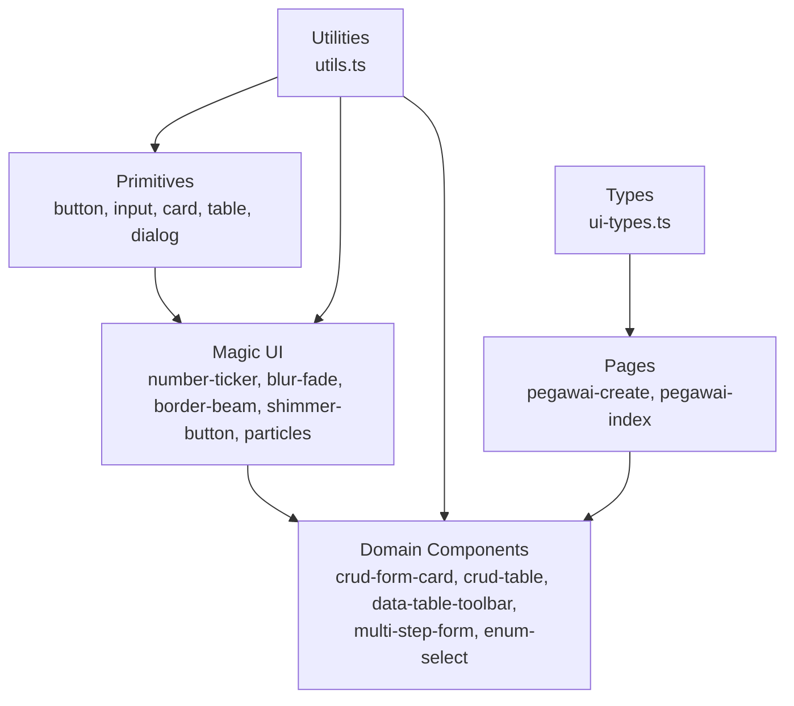

**Diagram sources**
- [button.tsx:1-65](file://resources/js/components/ui/button.tsx#L1-L65)
- [input.tsx:1-22](file://resources/js/components/ui/input.tsx#L1-L22)
- [card.tsx:1-69](file://resources/js/components/ui/card.tsx#L1-L69)
- [table.tsx:1-115](file://resources/js/components/ui/table.tsx#L1-L115)
- [dialog.tsx:1-134](file://resources/js/components/ui/dialog.tsx#L1-L134)
- [number-ticker.tsx:1-73](file://resources/js/components/ui/number-ticker.tsx#L1-L73)
- [blur-fade.tsx:1-93](file://resources/js/components/ui/blur-fade.tsx#L1-L93)
- [border-beam.tsx:1-106](file://resources/js/components/ui/border-beam.tsx#L1-L106)
- [shimmer-button.tsx:1-97](file://resources/js/components/ui/shimmer-button.tsx#L1-L97)
- [particles.tsx:1-320](file://resources/js/components/ui/particles.tsx#L1-L320)
- [crud-form-card.tsx:1-63](file://resources/js/components/kepegawaian/crud-form-card.tsx#L1-L63)
- [crud-table.tsx:1-96](file://resources/js/components/kepegawaian/crud-table.tsx#L1-L96)
- [data-table-toolbar.tsx:1-119](file://resources/js/components/kepegawaian/data-table-toolbar.tsx#L1-L119)
- [multi-step-form.tsx:1-129](file://resources/js/components/kepegawaian/multi-step-form.tsx#L1-L129)
- [enum-select.tsx:1-60](file://resources/js/components/kepegawaian/enum-select.tsx#L1-L60)
- [pegawai-create.tsx:1-603](file://resources/js/pages/kepegawaian/pegawai/create.tsx#L1-L603)
- [pegawai-index.tsx:1-487](file://resources/js/pages/kepegawaian/pegawai/index.tsx#L1-L487)
- [utils.ts:1-13](file://resources/js/lib/utils.ts#L1-L13)
- [ui-types.ts:1-17](file://resources/js/types/ui.ts#L1-L17)

## Detailed Component Analysis

### Button Component
- Implementation highlights
  - Uses class-variance-authority for variant and size variants.
  - Supports asChild via Radix Slot to render anchors while preserving semantics.
  - Focus-visible ring and destructive ring on invalid states.
  - SVG sizing and pointer-event handling for nested icons.
- Accessibility
  - Focus-visible ring and aria-invalid integration.
  - Proper role and labeling for icon-only buttons.

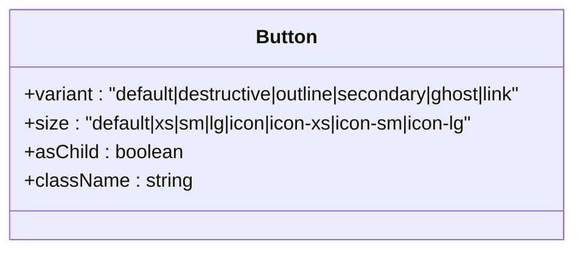

**Diagram sources**
- [button.tsx:7-39](file://resources/js/components/ui/button.tsx#L7-L39)

**Section sources**
- [button.tsx:1-65](file://resources/js/components/ui/button.tsx#L1-L65)

### Input Component
- Implementation highlights
  - Focus-visible ring and destructive ring on invalid state.
  - Disabled state handling and consistent typography.
- Accessibility
  - Inherits focus-visible ring and aria-invalid styling.

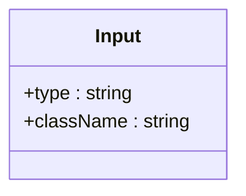

**Diagram sources**
- [input.tsx:5-18](file://resources/js/components/ui/input.tsx#L5-L18)

**Section sources**
- [input.tsx:1-22](file://resources/js/components/ui/input.tsx#L1-L22)

### Card Component Family
- Implementation highlights
  - Structured segments: Card, CardHeader, CardTitle, CardDescription, CardContent, CardFooter.
  - Semantic data-slot attributes for testing and styling hooks.
- Composition patterns
  - Used extensively by CRUD Form Card to encapsulate forms.

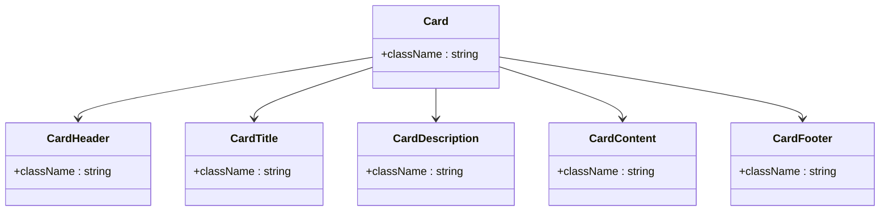

**Diagram sources**
- [card.tsx:5-66](file://resources/js/components/ui/card.tsx#L5-L66)

**Section sources**
- [card.tsx:1-69](file://resources/js/components/ui/card.tsx#L1-L69)

### Table Component Family
- Implementation highlights
  - Scrollable container with responsive behavior.
  - Row hover and selection states; checkbox-aware alignment.
- Composition patterns
  - Used by CRUD Table and page-level tables.

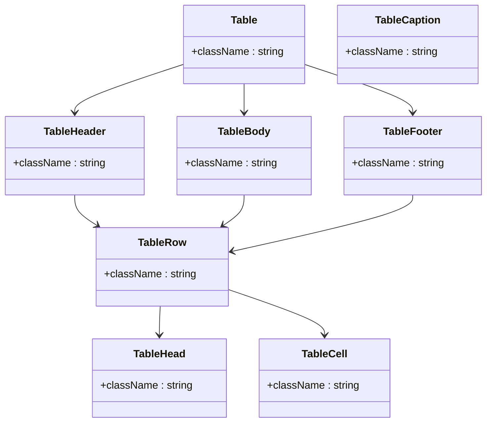

**Diagram sources**
- [table.tsx:5-103](file://resources/js/components/ui/table.tsx#L5-L103)

**Section sources**
- [table.tsx:1-115](file://resources/js/components/ui/table.tsx#L1-L115)

### Dialog Component
- Implementation highlights
  - Portal-based overlay with animations.
  - Close button with screen reader label.
- Accessibility
  - Overlay animation, close button with aria-label.

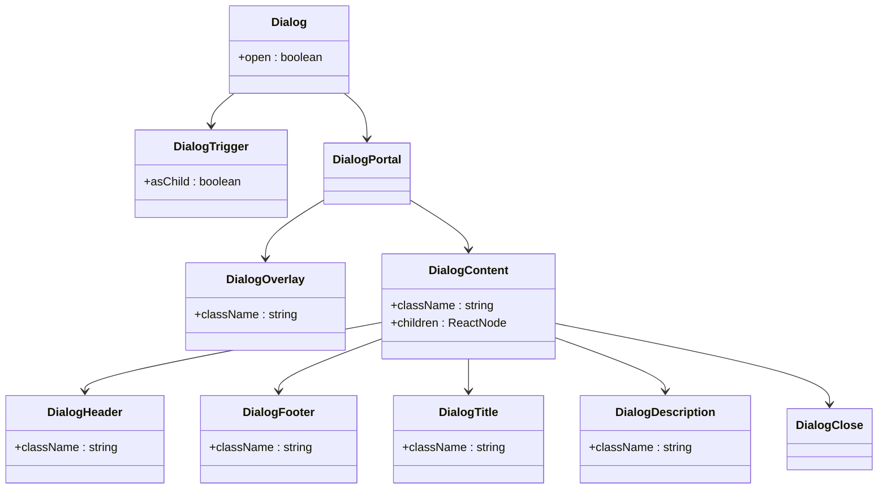

**Diagram sources**
- [dialog.tsx:7-132](file://resources/js/components/ui/dialog.tsx#L7-L132)

**Section sources**
- [dialog.tsx:1-134](file://resources/js/components/ui/dialog.tsx#L1-L134)

### NumberTicker Component
- Implementation highlights
  - Uses motion/react library for spring animation and in-view detection.
  - Configurable decimal places with Intl.NumberFormat for localization.
  - Delayed animation trigger with timeout mechanism.
  - Direction control (up/down) with different starting positions.
- Performance considerations
  - Uses useInView hook for lazy loading animation.
  - Spring physics for smooth numeric transitions.
  - Efficient value formatting with decimal precision control.

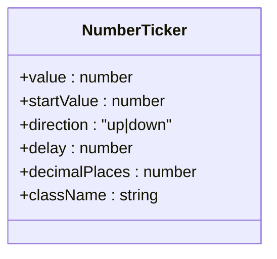

**Diagram sources**
- [number-ticker.tsx:6-22](file://resources/js/components/ui/number-ticker.tsx#L6-L22)

**Section sources**
- [number-ticker.tsx:1-73](file://resources/js/components/ui/number-ticker.tsx#L1-L73)

### BlurFade Component
- Implementation highlights
  - Uses AnimatePresence for enter/exit animations and motion for variants.
  - Configurable direction (up/down/left/right) with offset-based positioning.
  - Dynamic blur filter transitions with configurable blur distance.
  - In-view detection with customizable margins for triggering animations.
- Animation features
  - Smooth opacity and blur transitions.
  - Directional movement with configurable offset.
  - Customizable duration and delay for staggered animations.

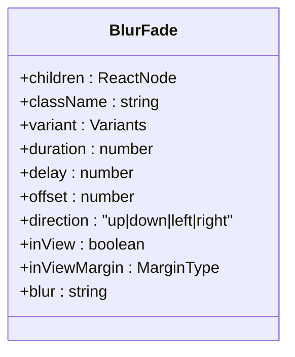

**Diagram sources**
- [blur-fade.tsx:13-44](file://resources/js/components/ui/blur-fade.tsx#L13-L44)

**Section sources**
- [blur-fade.tsx:1-93](file://resources/js/components/ui/blur-fade.tsx#L1-L93)

### BorderBeam Component
- Implementation highlights
  - Creates animated border beam with gradient colors using motion/react.
  - Configurable size, duration, and color gradient from colorFrom to colorTo.
  - Continuous animation with infinite repeat and linear easing.
  - Reverse direction support and configurable initial offset.
- Visual effects
  - Gradient color transitions from colorFrom to colorTo.
  - Circular motion along rectangle path with configurable size.
  - Smooth continuous animation with customizable timing.

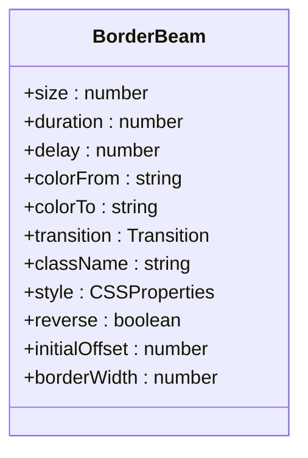

**Diagram sources**
- [border-beam.tsx:5-64](file://resources/js/components/ui/border-beam.tsx#L5-L64)

**Section sources**
- [border-beam.tsx:1-106](file://resources/js/components/ui/border-beam.tsx#L1-L106)

### ShimmerButton Component
- Implementation highlights
  - Custom CSS variables for configurable shimmer effects.
  - Conic gradient animation for realistic shimmer appearance.
  - Hover and active state animations with shadow transitions.
  - Backdrop and highlight layers for depth effect.
- Styling features
  - Configurable shimmer color, size, and duration.
  - Customizable border radius and background color.
  - Responsive design with transform-gpu for hardware acceleration.
  - Active state translation for press feedback.

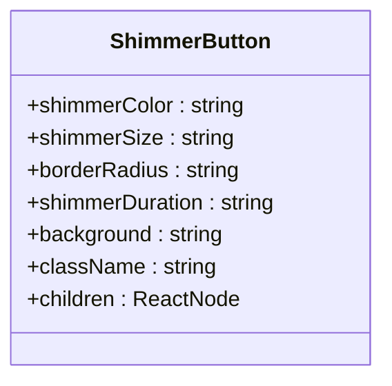

**Diagram sources**
- [shimmer-button.tsx:5-31](file://resources/js/components/ui/shimmer-button.tsx#L5-L31)

**Section sources**
- [shimmer-button.tsx:1-97](file://resources/js/components/ui/shimmer-button.tsx#L1-L97)

### Particles Component
- Implementation highlights
  - Canvas-based particle system with mouse interaction.
  - Configurable particle count, staticity, and easing.
  - Hex color conversion to RGB for particle coloring.
  - RequestAnimationFrame for smooth animation loop.
- Interactive features
  - Mouse position tracking with global event listeners.
  - Particle attraction/repulsion based on mouse proximity.
  - Dynamic alpha blending near canvas edges.
  - Configurable velocity vectors for particle movement.

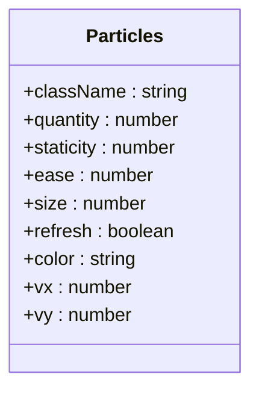

**Diagram sources**
- [particles.tsx:36-89](file://resources/js/components/ui/particles.tsx#L36-L89)

**Section sources**
- [particles.tsx:1-320](file://resources/js/components/ui/particles.tsx#L1-L320)

### CRUD Form Card
- Purpose: Encapsulate form UI with standardized actions and processing state.
- Props interface
  - title: string
  - description: string
  - children: ReactNode
  - onSubmit: (e: React.FormEvent) => void
  - onCancel?: () => void
  - submitLabel?: string
  - cancelLabel?: string
  - isEditing?: boolean
  - processing?: boolean

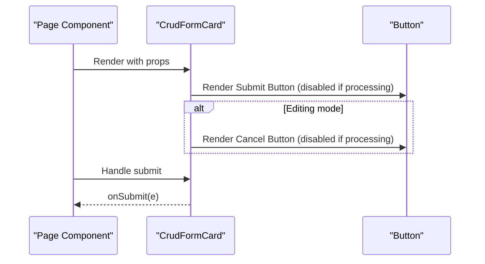

**Diagram sources**
- [crud-form-card.tsx:23-62](file://resources/js/components/kepegawaian/crud-form-card.tsx#L23-L62)
- [button.tsx:41-62](file://resources/js/components/ui/button.tsx#L41-L62)

**Section sources**
- [crud-form-card.tsx:1-63](file://resources/js/components/kepegawaian/crud-form-card.tsx#L1-L63)

### CRUD Table
- Purpose: Generic table with edit/delete actions and customizable columns.
- Props interface
  - columns: Array of { key, header, cell(item), className? }
  - data: Array of items
  - onEdit: (item) => void
  - onDelete: (item) => void
  - emptyMessage?: string
  - getItemId: (item) => string

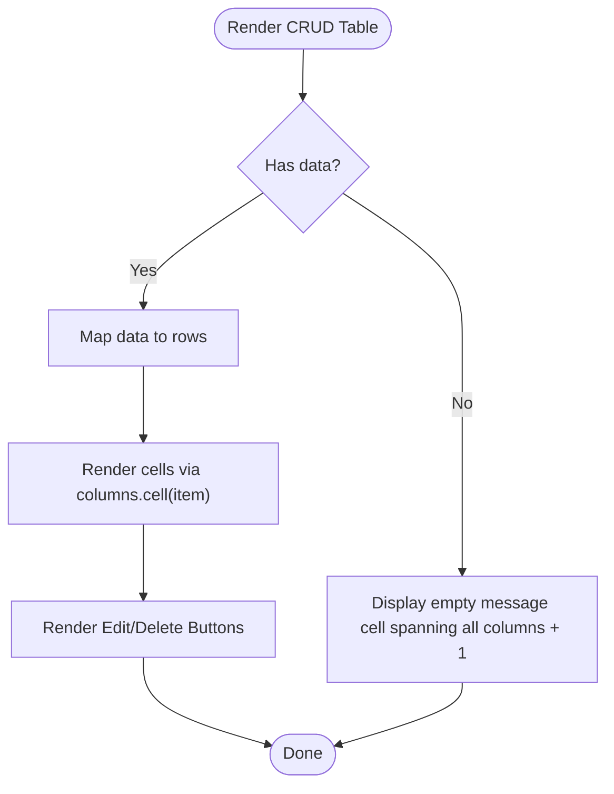

**Diagram sources**
- [crud-table.tsx:28-95](file://resources/js/components/kepegawaian/crud-table.tsx#L28-L95)
- [table.tsx:53-90](file://resources/js/components/ui/table.tsx#L53-L90)
- [button.tsx:41-62](file://resources/js/components/ui/button.tsx#L41-L62)

**Section sources**
- [crud-table.tsx:1-96](file://resources/js/components/kepegawaian/crud-table.tsx#L1-L96)

### Data Table Toolbar
- Purpose: Unified search and filter controls with clear action.
- Props interface
  - searchValue: string
  - onSearchChange: (value: string) => void
  - searchPlaceholder?: string
  - filters: Array of { key, label, placeholder, value, options, onChange }
  - showClear: boolean
  - onClear: () => void
  - className?: string

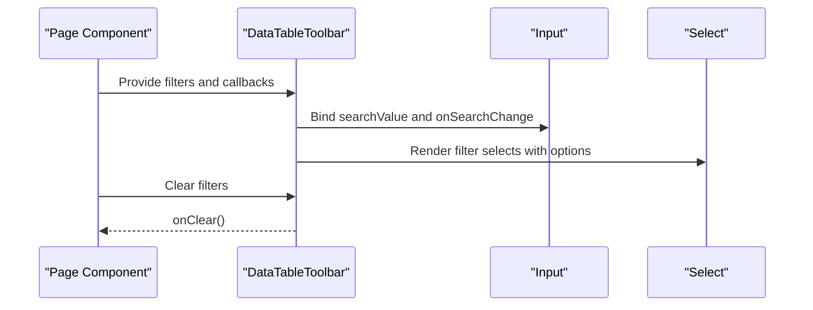

**Diagram sources**
- [data-table-toolbar.tsx:38-118](file://resources/js/components/kepegawaian/data-table-toolbar.tsx#L38-L118)
- [input.tsx:5-18](file://resources/js/components/ui/input.tsx#L5-L18)
- [enum-select.tsx:28-59](file://resources/js/components/kepegawaian/enum-select.tsx#L28-L59)

**Section sources**
- [data-table-toolbar.tsx:1-119](file://resources/js/components/kepegawaian/data-table-toolbar.tsx#L1-L119)

### Multi-Step Form
- Purpose: Wizard with progress bar and navigation controls.
- Props interface
  - steps: string[]
  - currentStep: number
  - children: React.ReactNode
  - onNext?: () => void
  - onPrev?: () => void
  - onSubmit?: () => void
  - isLastStep: boolean
  - isFirstStep: boolean
  - processing?: boolean
  - title?: string

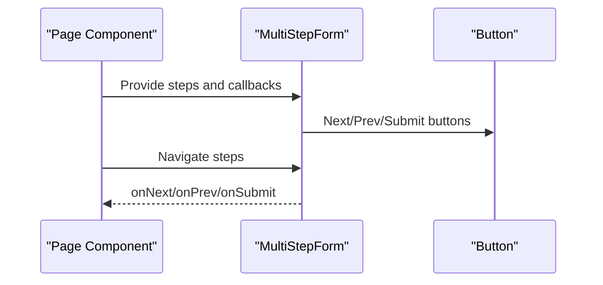

**Diagram sources**
- [multi-step-form.tsx:26-128](file://resources/js/components/kepegawaian/multi-step-form.tsx#L26-L128)
- [button.tsx:41-62](file://resources/js/components/ui/button.tsx#L41-L62)

**Section sources**
- [multi-step-form.tsx:1-129](file://resources/js/components/kepegawaian/multi-step-form.tsx#L1-L129)

### Enum Select
- Purpose: Specialized select for enum-style options with label and error messaging.
- Props interface
  - options: Array of { value, label?, name? }
  - value?: string
  - onChange: (value: string) => void
  - placeholder?: string
  - error?: string
  - disabled?: boolean
  - label?: string
  - id?: string

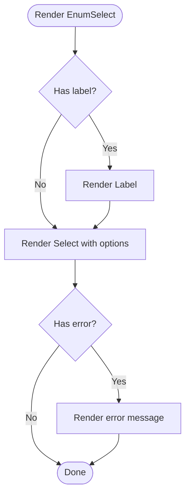

**Diagram sources**
- [enum-select.tsx:28-59](file://resources/js/components/kepegawaian/enum-select.tsx#L28-L59)

**Section sources**
- [enum-select.tsx:1-60](file://resources/js/components/kepegawaian/enum-select.tsx#L1-L60)

### Page-Level Usage Examples

#### Employee Create Page
- Composes MultiStepForm, EnumSelect, Input, Textarea, and Select to build a multi-step creation form.
- Integrates with Inertia useForm for state management and submission.
- Demonstrates error display and conditional rendering per step.

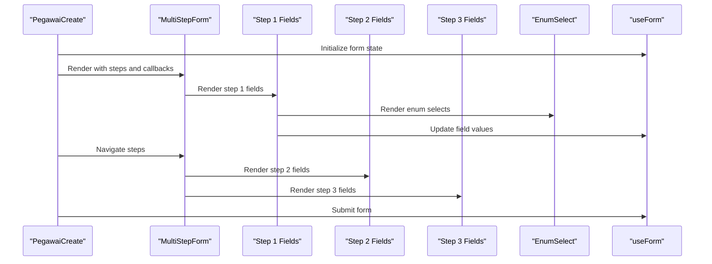

**Diagram sources**
- [pegawai-create.tsx:44-602](file://resources/js/pages/kepegawaian/pegawai/create.tsx#L44-L602)
- [multi-step-form.tsx:26-128](file://resources/js/components/kepegawaian/multi-step-form.tsx#L26-L128)
- [enum-select.tsx:28-59](file://resources/js/components/kepegawaian/enum-select.tsx#L28-L59)
- [input.tsx:5-18](file://resources/js/components/ui/input.tsx#L5-L18)

**Section sources**
- [pegawai-create.tsx:1-603](file://resources/js/pages/kepegawaian/pegawai/create.tsx#L1-L603)

#### Employee Index Page
- Renders a paginated table with DataTableToolbar for filtering and sorting.
- Uses Badge for status indicators and Button for actions.
- Implements debounced search and filter persistence via Inertia router.

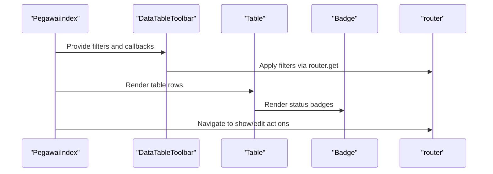

**Diagram sources**
- [pegawai-index.tsx:91-486](file://resources/js/pages/kepegawaian/pegawai/index.tsx#L91-L486)
- [data-table-toolbar.tsx:38-118](file://resources/js/components/kepegawaian/data-table-toolbar.tsx#L38-L118)
- [table.tsx:5-103](file://resources/js/components/ui/table.tsx#L5-L103)

**Section sources**
- [pegawai-index.tsx:1-487](file://resources/js/pages/kepegawaian/pegawai/index.tsx#L1-L487)

## Dependency Analysis
- **Internal dependencies**
  - All components depend on shared utilities (cn) for class merging.
  - Pages depend on domain components; domain components depend on primitives.
  - Magic UI components depend on motion/react library for animations.
- **External dependencies**
  - Radix UI for accessible base components (Dialog, Slot).
  - Lucide icons for UI affordances.
  - Inertia for client-side routing and form state.
  - **motion/react** for advanced animation capabilities in Magic UI components.
  - Canvas API for interactive particle system.

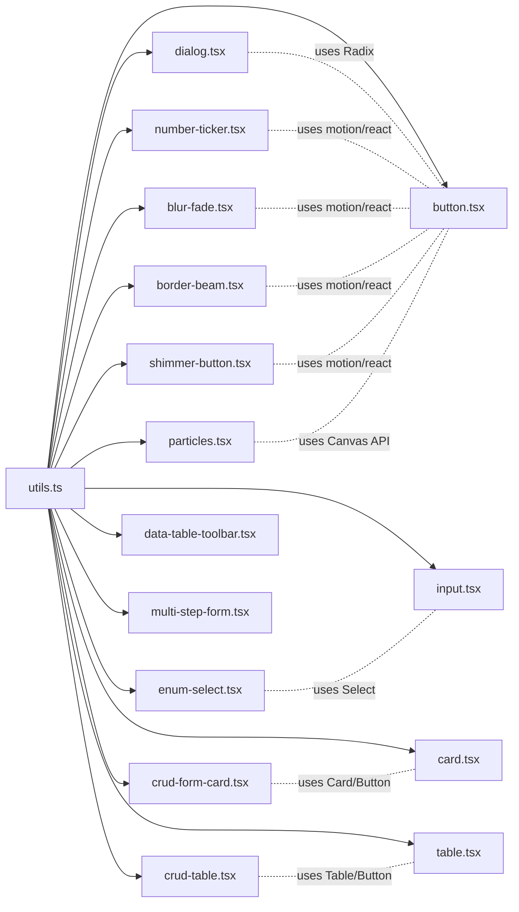

**Diagram sources**
- [utils.ts:6-8](file://resources/js/lib/utils.ts#L6-L8)
- [button.tsx:1-6](file://resources/js/components/ui/button.tsx#L1-L6)
- [input.tsx:3-5](file://resources/js/components/ui/input.tsx#L3-L5)
- [card.tsx:3-4](file://resources/js/components/ui/card.tsx#L3-L4)
- [table.tsx:3-4](file://resources/js/components/ui/table.tsx#L3-L4)
- [dialog.tsx:1-6](file://resources/js/components/ui/dialog.tsx#L1-L6)
- [number-ticker.tsx:1-4](file://resources/js/components/ui/number-ticker.tsx#L1-L4)
- [blur-fade.tsx:1-9](file://resources/js/components/ui/blur-fade.tsx#L1-L9)
- [border-beam.tsx:1-3](file://resources/js/components/ui/border-beam.tsx#L1-L3)
- [shimmer-button.tsx:1-3](file://resources/js/components/ui/shimmer-button.tsx#L1-L3)
- [particles.tsx:1-8](file://resources/js/components/ui/particles.tsx#L1-L8)
- [crud-form-card.tsx:2-9](file://resources/js/components/kepegawaian/crud-form-card.tsx#L2-L9)
- [crud-table.tsx:2-10](file://resources/js/components/kepegawaian/crud-table.tsx#L2-L10)
- [data-table-toolbar.tsx:3-12](file://resources/js/components/kepegawaian/data-table-toolbar.tsx#L3-L12)
- [multi-step-form.tsx:3-11](file://resources/js/components/kepegawaian/multi-step-form.tsx#L3-L11)
- [enum-select.tsx:2-9](file://resources/js/components/kepegawaian/enum-select.tsx#L2-L9)

**Section sources**
- [utils.ts:1-13](file://resources/js/lib/utils.ts#L1-L13)
- [button.tsx:1-65](file://resources/js/components/ui/button.tsx#L1-L65)
- [input.tsx:1-22](file://resources/js/components/ui/input.tsx#L1-L22)
- [card.tsx:1-69](file://resources/js/components/ui/card.tsx#L1-L69)
- [table.tsx:1-115](file://resources/js/components/ui/table.tsx#L1-L115)
- [dialog.tsx:1-134](file://resources/js/components/ui/dialog.tsx#L1-L134)
- [number-ticker.tsx:1-73](file://resources/js/components/ui/number-ticker.tsx#L1-L73)
- [blur-fade.tsx:1-93](file://resources/js/components/ui/blur-fade.tsx#L1-L93)
- [border-beam.tsx:1-106](file://resources/js/components/ui/border-beam.tsx#L1-L106)
- [shimmer-button.tsx:1-97](file://resources/js/components/ui/shimmer-button.tsx#L1-L97)
- [particles.tsx:1-320](file://resources/js/components/ui/particles.tsx#L1-L320)
- [crud-form-card.tsx:1-63](file://resources/js/components/kepegawaian/crud-form-card.tsx#L1-L63)
- [crud-table.tsx:1-96](file://resources/js/components/kepegawaian/crud-table.tsx#L1-L96)
- [data-table-toolbar.tsx:1-119](file://resources/js/components/kepegawaian/data-table-toolbar.tsx#L1-L119)
- [multi-step-form.tsx:1-129](file://resources/js/components/kepegawaian/multi-step-form.tsx#L1-L129)
- [enum-select.tsx:1-60](file://resources/js/components/kepegawaian/enum-select.tsx#L1-L60)

## Performance Considerations
- **Traditional components**
  - Prefer memoization for derived data (e.g., computed options) to avoid unnecessary renders.
  - Debounce search inputs to reduce server requests during typing.
  - Use virtualization for very large tables if performance becomes an issue.
  - Keep component trees shallow and avoid deep nesting of heavy wrappers.
  - Reuse shared utilities (cn) to minimize class computation overhead.
- **Animation components**
  - Magic UI components leverage useInView hooks for lazy loading, reducing initial load.
  - Spring animations use efficient motion values with damping/stiffness configuration.
  - BlurFade components use AnimatePresence for optimal enter/exit transitions.
  - BorderBeam uses continuous animation with configurable duration and easing.
  - ShimmerButton utilizes CSS variables and transform-gpu for hardware acceleration.
  - Particles component implements requestAnimationFrame with cleanup on unmount.
- **Accessibility and performance balance**
  - Respect prefers-reduced-motion media queries for animation-heavy components.
  - Use component-level lazy loading for complex animations.
  - Implement proper cleanup for event listeners and animation frames.
  - Consider component mounting/unmounting strategies for resource-intensive animations.

## Troubleshooting Guide
- **Button disabled states**
  - Ensure processing flag disables submit/cancel buttons to prevent duplicate submissions.
- **Input validation**
  - Use aria-invalid and destructive ring styles to indicate invalid states.
- **Dialog accessibility**
  - Ensure close button has a screen reader label and focus trapping is handled by Radix.
- **Table responsiveness**
  - Wrap tables in scroll containers and ensure proper cell alignment for checkboxes.
- **Form state**
  - Use Inertia useForm to manage controlled inputs and clear errors after successful submission.
- **Animation component issues**
  - **NumberTicker**: Ensure value prop changes trigger animation; check decimalPlaces configuration.
  - **BlurFade**: Verify in-view detection works with proper container dimensions; adjust inViewMargin if needed.
  - **BorderBeam**: Check colorFrom/colorTo values are valid CSS colors; adjust duration for desired speed.
  - **ShimmerButton**: Ensure CSS variables are properly defined; verify conic gradient syntax.
  - **Particles**: Monitor canvas resize events; check mouse position tracking; verify devicePixelRatio handling.
- **Performance optimization**
  - Use React.memo for frequently re-rendered animation components.
  - Implement proper cleanup in useEffect hooks for animation components.
  - Consider disabling animations for users with motion sensitivity preferences.

**Section sources**
- [button.tsx:1-65](file://resources/js/components/ui/button.tsx#L1-L65)
- [input.tsx:1-22](file://resources/js/components/ui/input.tsx#L1-L22)
- [dialog.tsx:1-134](file://resources/js/components/ui/dialog.tsx#L1-L134)
- [table.tsx:1-115](file://resources/js/components/ui/table.tsx#L1-L115)
- [number-ticker.tsx:1-73](file://resources/js/components/ui/number-ticker.tsx#L1-L73)
- [blur-fade.tsx:1-93](file://resources/js/components/ui/blur-fade.tsx#L1-L93)
- [border-beam.tsx:1-106](file://resources/js/components/ui/border-beam.tsx#L1-L106)
- [shimmer-button.tsx:1-97](file://resources/js/components/ui/shimmer-button.tsx#L1-L97)
- [particles.tsx:1-320](file://resources/js/components/ui/particles.tsx#L1-L320)
- [pegawai-create.tsx:1-603](file://resources/js/pages/kepegawaian/pegawai/create.tsx#L1-L603)

## Conclusion
The React Component System leverages Radix UI primitives, Tailwind variants, and comprehensive Magic UI animation components to deliver accessible, reusable, and visually engaging UI components. The addition of NumberTicker, BlurFade, BorderBeam, ShimmerButton, and Particles components enhances the system's animation capabilities while maintaining the existing architectural principles. Kepegawaian-specific components continue to encapsulate common workflows like CRUD forms, multi-step wizards, and data tables. By composing primitives, Magic UI components, and domain components consistently, the system ensures maintainability, accessibility, and scalability across the application while providing rich visual experiences.

## Appendices

### Prop Interfaces Summary
- **Button**
  - variant: "default|destructive|outline|secondary|ghost|link"
  - size: "default|xs|sm|lg|icon|icon-xs|icon-sm|icon-lg"
  - asChild: boolean
- **Input**
  - type: string
- **Card family**
  - className: string
- **Table family**
  - className: string
- **Dialog family**
  - className: string, children: ReactNode
- **NumberTicker**
  - value: number, startValue: number, direction: "up|down", delay: number, decimalPlaces: number, className: string
- **BlurFade**
  - children: ReactNode, className: string, variant: Variants, duration: number, delay: number, offset: number, direction: "up|down|left|right", inView: boolean, inViewMargin: MarginType, blur: string
- **BorderBeam**
  - size: number, duration: number, delay: number, colorFrom: string, colorTo: string, transition: Transition, className: string, style: CSSProperties, reverse: boolean, initialOffset: number, borderWidth: number
- **ShimmerButton**
  - shimmerColor: string, shimmerSize: string, borderRadius: string, shimmerDuration: string, background: string, className: string, children: ReactNode
- **Particles**
  - className: string, quantity: number, staticity: number, ease: number, size: number, refresh: boolean, color: string, vx: number, vy: number
- **CRUD Form Card**
  - title: string, description: string, children: ReactNode, onSubmit: Function, onCancel?: Function, submitLabel?: string, cancelLabel?: string, isEditing?: boolean, processing?: boolean
- **CRUD Table**
  - columns: Array<{ key: string, header: string, cell: Function, className?: string }>, data: Array<any>, onEdit: Function, onDelete: Function, emptyMessage?: string, getItemId: Function
- **Data Table Toolbar**
  - searchValue: string, onSearchChange: Function, searchPlaceholder?: string, filters: Array<{ key: string, label: string, placeholder: string, value: string|null, options: Array<{value: string,label: string}>, onChange: Function }>, showClear: boolean, onClear: Function, className?: string
- **Multi-Step Form**
  - steps: string[], currentStep: number, children: React.ReactNode, onNext?: Function, onPrev?: Function, onSubmit?: Function, isLastStep: boolean, isFirstStep: boolean, processing?: boolean, title?: string
- **Enum Select**
  - options: Array<{ value: string, label?: string, name?: string }>, value?: string, onChange: Function, placeholder?: string, error?: string, disabled?: boolean, label?: string, id?: string

**Section sources**
- [button.tsx:41-62](file://resources/js/components/ui/button.tsx#L41-L62)
- [input.tsx:5-18](file://resources/js/components/ui/input.tsx#L5-L18)
- [card.tsx:5-66](file://resources/js/components/ui/card.tsx#L5-L66)
- [table.tsx:5-103](file://resources/js/components/ui/table.tsx#L5-L103)
- [dialog.tsx:7-132](file://resources/js/components/ui/dialog.tsx#L7-L132)
- [number-ticker.tsx:6-22](file://resources/js/components/ui/number-ticker.tsx#L6-L22)
- [blur-fade.tsx:13-44](file://resources/js/components/ui/blur-fade.tsx#L13-L44)
- [border-beam.tsx:5-64](file://resources/js/components/ui/border-beam.tsx#L5-L64)
- [shimmer-button.tsx:5-31](file://resources/js/components/ui/shimmer-button.tsx#L5-L31)
- [particles.tsx:36-89](file://resources/js/components/ui/particles.tsx#L36-L89)
- [crud-form-card.tsx:11-21](file://resources/js/components/kepegawaian/crud-form-card.tsx#L11-L21)
- [crud-table.tsx:12-26](file://resources/js/components/kepegawaian/crud-table.tsx#L12-L26)
- [data-table-toolbar.tsx:16-36](file://resources/js/components/kepegawaian/data-table-toolbar.tsx#L16-L36)
- [multi-step-form.tsx:13-24](file://resources/js/components/kepegawaian/multi-step-form.tsx#L13-L24)
- [enum-select.tsx:17-26](file://resources/js/components/kepegawaian/enum-select.tsx#L17-L26)

### Integration Patterns
- **State management**
  - Use Inertia useForm for controlled form inputs and submission.
  - Manage local UI state (e.g., currentStep) with useState.
- **Routing**
  - Use Inertia router for navigation and filter persistence.
- **Accessibility**
  - Provide labels for selects and inputs; ensure focus management and keyboard navigation.
  - Respect prefers-reduced-motion media queries for animation-heavy components.
- **Theming and utilities**
  - Use cn for class merging and consistent spacing.
- **Animation integration**
  - Combine BlurFade with NumberTicker for staggered content entry.
  - Use BorderBeam to create visual emphasis around important elements.
  - Implement Particles as background decoration with proper cleanup.
  - Style ShimmerButton components consistently with theme variables.

**Section sources**
- [pegawai-create.tsx:53-93](file://resources/js/pages/kepegawaian/pegawai/create.tsx#L53-L93)
- [pegawai-index.tsx:101-129](file://resources/js/pages/kepegawaian/pegawai/index.tsx#L101-L129)
- [utils.ts:6-8](file://resources/js/lib/utils.ts#L6-L8)
- [ui-types.ts:4-16](file://resources/js/types/ui.ts#L4-L16)