# React Component System

<cite>
**Referenced Files in This Document**
- [button.tsx](file://resources/js/components/ui/button.tsx)
- [input.tsx](file://resources/js/components/ui/input.tsx)
- [card.tsx](file://resources/js/components/ui/card.tsx)
- [table.tsx](file://resources/js/components/ui/table.tsx)
- [dialog.tsx](file://resources/js/components/ui/dialog.tsx)
- [number-ticker.tsx](file://resources/js/components/ui/number-ticker.tsx)
- [blur-fade.tsx](file://resources/js/components/ui/blur-fade.tsx)
- [border-beam.tsx](file://resources/js/components/ui/border-beam.tsx)
- [shimmer-button.tsx](file://resources/js/components/ui/shimmer-button.tsx)
- [particles.tsx](file://resources/js/components/ui/particles.tsx)
- [flash-messages.tsx](file://resources/js/components/flash-messages.tsx)
- [crud-form-card.tsx](file://resources/js/components/kepegawaian/crud-form-card.tsx)
- [crud-table.tsx](file://resources/js/components/kepegawaian/crud-table.tsx)
- [data-table-toolbar.tsx](file://resources/js/components/kepegawaian/data-table-toolbar.tsx)
- [multi-step-form.tsx](file://resources/js/components/kepegawaian/multi-step-form.tsx)
- [enum-select.tsx](file://resources/js/components/kepegawaian/enum-select.tsx)
- [pegawai-create.tsx](file://resources/js/pages/kepegawaian/pegawai/create.tsx)
- [pegawai-index.tsx](file://resources/js/pages/kepegawaian/pegawai/index.tsx)
- [app-shell.tsx](file://resources/js/components/app-shell.tsx)
- [utils.ts](file://resources/js/lib/utils.ts)
- [ui-types.ts](file://resources/js/types/ui.ts)
- [PendidikanBarChart.tsx](file://resources/js/components/dashboard/PendidikanBarChart.tsx)
- [GolonganBarChart.tsx](file://resources/js/components/dashboard/GolonganBarChart.tsx)
- [JenisKelaminPieChart.tsx](file://resources/js/components/dashboard/JenisKelaminPieChart.tsx)
- [DashboardHeavySection.tsx](file://resources/js/components/dashboard/DashboardHeavySection.tsx)
- [DashboardStatService.php](file://app/Services/DashboardStatService.php)
- [use-dashboard-stats.ts](file://resources/js/hooks/use-dashboard-stats.ts)
- [app-sidebar-layout.tsx](file://resources/js/layouts/app/app-sidebar-layout.tsx)
</cite>

## Update Summary
**Changes Made**
- Added comprehensive documentation for the new FlashMessages component for global success/error messaging
- Updated Core Components section to include retro-neobrutalism styling system with consistent border-2 and shadow-[4px_4px_0_rgba(0,0,0,1)] patterns
- Enhanced styling documentation to reflect the new retro-neobrutalism design system
- Added detailed component analysis for FlashMessages with animation and positioning features
- Updated architecture diagrams to include the new messaging system
- Expanded styling patterns documentation with concrete examples of the new design system
- Integrated FlashMessages component into the layout system

## Table of Contents
1. [Introduction](#introduction)
2. [Project Structure](#project-structure)
3. [Core Components](#core-components)
4. [Architecture Overview](#architecture-overview)
5. [Detailed Component Analysis](#detailed-component-analysis)
6. [Retro-Neobrutalism Styling System](#retro-neobrutalism-styling-system)
7. [Dependency Analysis](#dependency-analysis)
8. [Performance Considerations](#performance-considerations)
9. [Troubleshooting Guide](#troubleshooting-guide)
10. [Conclusion](#conclusion)
11. [Appendices](#appendices)

## Introduction
This document describes the React Component System used in the kepegawaian application. It focuses on the modular component architecture built with Radix UI primitives and custom kepegawaian-specific components, now enhanced with a comprehensive retro-neobrutalism styling system and global messaging capabilities. The system emphasizes composability, reusability, and accessibility through shared UI primitives (buttons, inputs, cards, tables, dialogs), Magic UI animation components (NumberTicker, BlurFade, BorderBeam, ShimmerButton, Particles), and domain-specific building blocks (CRUD form cards, data tables, multi-step forms, and employee tabs). The recent addition of the FlashMessages component provides centralized success/error notifications, while the retro-neobrutalism design system establishes consistent visual patterns using border-2 and shadow-[4px_4px_0_rgba(0,0,0,1)] conventions throughout the interface.

## Project Structure
The component system is organized by feature domains with enhanced retro-neobrutalism styling:
- UI primitives under resources/js/components/ui (Radix-based wrappers with retro-neobrutalism styling)
- Kepegawaian-specific components under resources/js/components/kepegawaian
- Dashboard visualization components under resources/js/components/dashboard (Recharts-based charts)
- Messaging system under resources/js/components/flash-messages.tsx
- Layout integration under resources/js/layouts/app/app-sidebar-layout.tsx
- Page-level usage under resources/js/pages
- Shared utilities under resources/js/lib/utils.ts
- Type definitions under resources/js/types

```mermaid
graph TB
subgraph "UI Primitives"
BTN["button.tsx"]
INP["input.tsx"]
CARD["card.tsx"]
TABLE["table.tsx"]
DLG["dialog.tsx"]
NT["number-ticker.tsx"]
BF["blur-fade.tsx"]
BB["border-beam.tsx"]
SB["shimmer-button.tsx"]
PRT["particles.tsx"]
FM["flash-messages.tsx"]
end
subgraph "Kepegawaian Components"
CFC["crud-form-card.tsx"]
CTBL["crud-table.tsx"]
DTT["data-table-toolbar.tsx"]
MSF["multi-step-form.tsx"]
ENUMSEL["enum-select.tsx"]
end
subgraph "Dashboard Visualization"
PBC["PendidikanBarChart.tsx"]
GBC["GolonganBarChart.tsx"]
JKPC["JenisKelaminPieChart.tsx"]
DBHS["DashboardHeavySection.tsx"]
end
subgraph "Layout Integration"
ASL["app-sidebar-layout.tsx"]
end
subgraph "Pages"
PCREATE["pegawai-create.tsx"]
PINDEX["pegawai-index.tsx"]
end
UTIL["utils.ts"]
TYPES["ui-types.ts"]
ASL --> FM
PCREATE --> MSF
PCREATE --> ENUMSEL
PCREATE --> INP
PCREATE --> BTN
PINDEX --> DTT
PINDEX --> TABLE
PINDEX --> BTN
CFC --> BTN
CFC --> CARD
CTBL --> TABLE
CTBL --> BTN
DTT --> INP
DTT --> ENUMSEL
DLG -. uses Radix .- BTN
NT -. uses motion/react .- BTN
BF -. uses motion/react .- BTN
BB -. uses motion/react .- BTN
SB -. uses motion/react .- BTN
PRT -. uses Canvas API .- BTN
FM -. uses motion/react .- BTN
PBC -. uses Recharts .- BTN
GBC -. uses Recharts .- BTN
JKPC -. uses Recharts .- BTN
UTIL -. shared helpers .- BTN
UTIL -. shared helpers .- INP
TYPES -. type defs .- PCREATE
```

**Diagram sources**
- [button.tsx:1-61](file://resources/js/components/ui/button.tsx#L1-L61)
- [input.tsx:1-22](file://resources/js/components/ui/input.tsx#L1-L22)
- [card.tsx:1-69](file://resources/js/components/ui/card.tsx#L1-L69)
- [table.tsx:1-115](file://resources/js/components/ui/table.tsx#L1-L115)
- [dialog.tsx:1-134](file://resources/js/components/ui/dialog.tsx#L1-L134)
- [number-ticker.tsx:1-73](file://resources/js/components/ui/number-ticker.tsx#L1-L73)
- [blur-fade.tsx:1-93](file://resources/js/components/ui/blur-fade.tsx#L1-L93)
- [border-beam.tsx:1-106](file://resources/js/components/ui/border-beam.tsx#L1-L106)
- [shimmer-button.tsx:1-97](file://resources/js/components/ui/shimmer-button.tsx#L1-L97)
- [particles.tsx:1-320](file://resources/js/components/ui/particles.tsx#L1-L320)
- [flash-messages.tsx:1-76](file://resources/js/components/flash-messages.tsx#L1-L76)
- [crud-form-card.tsx:1-63](file://resources/js/components/kepegawaian/crud-form-card.tsx#L1-L63)
- [crud-table.tsx:1-96](file://resources/js/components/kepegawaian/crud-table.tsx#L1-L96)
- [data-table-toolbar.tsx:1-119](file://resources/js/components/kepegawaian/data-table-toolbar.tsx#L1-L119)
- [multi-step-form.tsx:1-129](file://resources/js/components/kepegawaian/multi-step-form.tsx#L1-L129)
- [enum-select.tsx:1-60](file://resources/js/components/kepegawaian/enum-select.tsx#L1-L60)
- [PendidikanBarChart.tsx:1-79](file://resources/js/components/dashboard/PendidikanBarChart.tsx#L1-L79)
- [GolonganBarChart.tsx:1-77](file://resources/js/components/dashboard/GolonganBarChart.tsx#L1-L77)
- [JenisKelaminPieChart.tsx:1-71](file://resources/js/components/dashboard/JenisKelaminPieChart.tsx#L1-L71)
- [DashboardHeavySection.tsx:1-159](file://resources/js/components/dashboard/DashboardHeavySection.tsx#L1-L159)
- [pegawai-create.tsx:1-603](file://resources/js/pages/kepegawaian/pegawai/create.tsx#L1-L603)
- [pegawai-index.tsx:1-487](file://resources/js/pages/kepegawaian/pegawai/index.tsx#L1-L487)
- [utils.ts:1-13](file://resources/js/lib/utils.ts#L1-L13)
- [ui-types.ts:1-17](file://resources/js/types/ui.ts#L1-L17)
- [app-sidebar-layout.tsx:1-23](file://resources/js/layouts/app/app-sidebar-layout.tsx#L1-L23)

**Section sources**
- [button.tsx:1-61](file://resources/js/components/ui/button.tsx#L1-L61)
- [input.tsx:1-22](file://resources/js/components/ui/input.tsx#L1-L22)
- [card.tsx:1-69](file://resources/js/components/ui/card.tsx#L1-L69)
- [table.tsx:1-115](file://resources/js/components/ui/table.tsx#L1-L115)
- [dialog.tsx:1-134](file://resources/js/components/ui/dialog.tsx#L1-L134)
- [number-ticker.tsx:1-73](file://resources/js/components/ui/number-ticker.tsx#L1-L73)
- [blur-fade.tsx:1-93](file://resources/js/components/ui/blur-fade.tsx#L1-L93)
- [border-beam.tsx:1-106](file://resources/js/components/ui/border-beam.tsx#L1-L106)
- [shimmer-button.tsx:1-97](file://resources/js/components/ui/shimmer-button.tsx#L1-L97)
- [particles.tsx:1-320](file://resources/js/components/ui/particles.tsx#L1-L320)
- [flash-messages.tsx:1-76](file://resources/js/components/flash-messages.tsx#L1-L76)
- [crud-form-card.tsx:1-63](file://resources/js/components/kepegawaian/crud-form-card.tsx#L1-L63)
- [crud-table.tsx:1-96](file://resources/js/components/kepegawaian/crud-table.tsx#L1-L96)
- [data-table-toolbar.tsx:1-119](file://resources/js/components/kepegawaian/data-table-toolbar.tsx#L1-L119)
- [multi-step-form.tsx:1-129](file://resources/js/components/kepegawaian/multi-step-form.tsx#L1-L129)
- [enum-select.tsx:1-60](file://resources/js/components/kepegawaian/enum-select.tsx#L1-L60)
- [PendidikanBarChart.tsx:1-79](file://resources/js/components/dashboard/PendidikanBarChart.tsx#L1-L79)
- [GolonganBarChart.tsx:1-77](file://resources/js/components/dashboard/GolonganBarChart.tsx#L1-L77)
- [JenisKelaminPieChart.tsx:1-71](file://resources/js/components/dashboard/JenisKelaminPieChart.tsx#L1-L71)
- [DashboardHeavySection.tsx:1-159](file://resources/js/components/dashboard/DashboardHeavySection.tsx#L1-L159)
- [pegawai-create.tsx:1-603](file://resources/js/pages/kepegawaian/pegawai/create.tsx#L1-L603)
- [pegawai-index.tsx:1-487](file://resources/js/pages/kepegawaian/pegawai/index.tsx#L1-L487)
- [utils.ts:1-13](file://resources/js/lib/utils.ts#L1-L13)
- [ui-types.ts:1-17](file://resources/js/types/ui.ts#L1-L17)
- [app-sidebar-layout.tsx:1-23](file://resources/js/layouts/app/app-sidebar-layout.tsx#L1-L23)

## Core Components
This section documents the foundational UI primitives and kepegawaian-specific components that form the backbone of the system, now enhanced with the retro-neobrutalism styling system and global messaging capabilities.

### Traditional UI Primitives with Retro-Neobrutalism Styling
- **Button**
  - Purpose: Unified action control with variants and sizes using consistent retro-neobrutalism styling.
  - Variants: default, destructive, outline, secondary, ghost, link.
  - Sizes: default, xs, sm, lg, icon, icon-xs, icon-sm, icon-lg.
  - Styling Pattern: Uses border-2 border-foreground with shadow-[2px_2px_0_rgba(0,0,0,1)] for pressed state, transforms for 3D effect.
  - Accessibility: Focus-visible ring, aria-invalid integration, SVG pointer events preserved.

- **Input**
  - Purpose: Text input with focus-visible ring, disabled states, and aria-invalid support using retro-styling.
  - Styling Pattern: border-2 border-foreground with shadow-[2px_2px_0_rgba(0,0,0,1)] and transform for pressed state.
  - Accessibility: Inherits focus-visible ring and destructive ring on invalid state.

- **Card**
  - Purpose: Container with header/title/description/content/footer segments using retro-neobrutalism styling.
  - Styling Pattern: border-2 border-foreground with shadow-[4px_4px_0_rgba(0,0,0,1)] for 3D effect.
  - Composition: Provides semantic slots for structured card layouts.

- **Select**
  - Purpose: Dropdown component with content panel using retro-styling.
  - Styling Pattern: border-2 border-foreground with shadow-[4px_4px_0_rgba(0,0,0,1)] for content panel.
  - Composition: Complex structure with trigger, content, items, and scroll buttons.

- **Dialog**
  - Purpose: Modal overlay with portal, close button, and header/footer slots.
  - Accessibility: Overlay animation, close button with screen reader label.

### Magic UI Animation Components
- **NumberTicker**
  - Purpose: Animated number counter with spring physics and decimal formatting.
  - Features: Spring animation, configurable direction (up/down), delay, decimal places.
  - Dependencies: motion/react library for animation.
  - Props: value, startValue, direction, delay, decimalPlaces.

- **BlurFade**
  - Purpose: Smooth blur/fade entrance animation with directional movement.
  - Features: Directional animation (up/down/left/right), configurable blur distance, in-view detection.
  - Dependencies: motion/react library with useInView hook.
  - Props: children, className, variant, duration, delay, offset, direction, inView, inViewMargin, blur.

- **BorderBeam**
  - Purpose: Animated border beam effect with gradient colors and continuous motion.
  - Features: Configurable size, duration, colors, reverse direction, initial offset.
  - Dependencies: motion/react library for continuous animation.
  - Props: size, duration, delay, colorFrom, colorTo, transition, className, style, reverse, initialOffset, borderWidth.

- **ShimmerButton**
  - Purpose: Animated button with shimmer effect and gradient background.
  - Features: Customizable shimmer color/size/duration, border radius, background color.
  - Dependencies: motion/react library for animation effects.
  - Props: shimmerColor, shimmerSize, borderRadius, shimmerDuration, background, className, children.

- **Particles**
  - Purpose: Interactive particle system with mouse interaction and canvas rendering.
  - Features: Configurable quantity, staticity/ease, size, color, velocity vectors.
  - Dependencies: Canvas API with requestAnimationFrame for smooth animation.
  - Props: className, quantity, staticity, ease, size, refresh, color, vx, vy.

### Global Messaging System
- **FlashMessages**
  - Purpose: Centralized success/error notification system with automatic dismissal.
  - Features: Automatic detection of flash messages from Inertia props, 4-second auto-dismiss, duplicate prevention, manual dismiss.
  - Styling Pattern: Fixed positioning with border-2 border-black and shadow-[4px_4px_0_rgba(0,0,0,1)].
  - Animation: Uses motion/react for smooth enter/exit animations with staggered positioning.

### Dashboard Visualization Components
- **PendidikanBarChart**
  - Purpose: Vertical bar chart displaying educational distribution statistics.
  - Features: Responsive design, custom tooltips with percentage display, vertical layout.
  - Dependencies: Recharts library for professional chart rendering.
  - Props: data (array of PendidikanItem with pendidikan, count, percentage).
  - Data format: Educational level labels with employee counts and percentages.

- **GolonganBarChart**
  - Purpose: Horizontal bar chart showing rank distribution across different ranks.
  - Features: Color-coded bars, dynamic color assignment, interactive tooltips.
  - Dependencies: Recharts library with custom color palette.
  - Props: data (array of GolonganItem with golongan, count, percentage).
  - Data format: Rank categories with employee counts and percentage distribution.

- **JenisKelaminPieChart**
  - Purpose: Pie chart visualization of gender distribution among employees.
  - Features: Custom label rendering, color-coded segments, legend support.
  - Dependencies: Recharts library with predefined color scheme.
  - Props: data (array of JenisKelaminItem with label, total, percentage).
  - Data format: Gender categories with employee totals and percentage breakdowns.

### Kepegawaian-Specific Components
- **CRUD Form Card**
  - Purpose: Encapsulates form UI with title, description, actions, and processing state.
  - Props: title, description, children, onSubmit, onCancel, submitLabel, cancelLabel, isEditing, processing.

- **CRUD Table**
  - Purpose: Generic table with edit/delete actions per row and customizable columns.
  - Props: columns (key, header, cell, className), data, onEdit, onDelete, emptyMessage, getItemId.

- **Data Table Toolbar**
  - Purpose: Search box and filter selectors with clear controls using retro-styling.
  - Styling Pattern: border-2 border-foreground with shadow-[4px_4px_0_rgba(0,0,0,1)].
  - Props: searchValue, onSearchChange, searchPlaceholder, filters, showClear, onClear, className.

- **Multi-Step Form**
  - Purpose: Progress-indicated wizard with navigation controls and processing state.
  - Props: steps, currentStep, children, onNext, onPrev, onSubmit, isLastStep, isFirstStep, processing, title.

- **Enum Select**
  - Purpose: Select component specialized for enum-style options with label/error support.
  - Props: options, value, onChange, placeholder, error, disabled, label, id.

**Section sources**
- [button.tsx:1-61](file://resources/js/components/ui/button.tsx#L1-L61)
- [input.tsx:1-22](file://resources/js/components/ui/input.tsx#L1-L22)
- [card.tsx:1-69](file://resources/js/components/ui/card.tsx#L1-L69)
- [table.tsx:1-115](file://resources/js/components/ui/table.tsx#L1-L115)
- [dialog.tsx:1-134](file://resources/js/components/ui/dialog.tsx#L1-L134)
- [number-ticker.tsx:1-73](file://resources/js/components/ui/number-ticker.tsx#L1-L73)
- [blur-fade.tsx:1-93](file://resources/js/components/ui/blur-fade.tsx#L1-L93)
- [border-beam.tsx:1-106](file://resources/js/components/ui/border-beam.tsx#L1-L106)
- [shimmer-button.tsx:1-97](file://resources/js/components/ui/shimmer-button.tsx#L1-L97)
- [particles.tsx:1-320](file://resources/js/components/ui/particles.tsx#L1-L320)
- [flash-messages.tsx:1-76](file://resources/js/components/flash-messages.tsx#L1-L76)
- [PendidikanBarChart.tsx:1-79](file://resources/js/components/dashboard/PendidikanBarChart.tsx#L1-L79)
- [GolonganBarChart.tsx:1-77](file://resources/js/components/dashboard/GolonganBarChart.tsx#L1-L77)
- [JenisKelaminPieChart.tsx:1-71](file://resources/js/components/dashboard/JenisKelaminPieChart.tsx#L1-L71)
- [crud-form-card.tsx:1-63](file://resources/js/components/kepegawaian/crud-form-card.tsx#L1-L63)
- [crud-table.tsx:1-96](file://resources/js/components/kepegawaian/crud-table.tsx#L1-L96)
- [data-table-toolbar.tsx:1-119](file://resources/js/components/kepegawaian/data-table-toolbar.tsx#L1-L119)
- [multi-step-form.tsx:1-129](file://resources/js/components/kepegawaian/multi-step-form.tsx#L1-L129)
- [enum-select.tsx:1-60](file://resources/js/components/kepegawaian/enum-select.tsx#L1-L60)

## Architecture Overview
The component architecture follows a layered approach with enhanced retro-neobrutalism styling and global messaging:
- **Primitive layer**: Radix UI-based wrappers with Tailwind-based variants, retro-styled with consistent border-2 and shadow patterns, Magic UI animation components, and shared utilities.
- **Domain layer**: Kepegawaian-specific components that compose primitives for common workflows.
- **Messaging layer**: Global FlashMessages component for centralized success/error notifications.
- **Visualization layer**: Dashboard components with Recharts integration for interactive data visualization.
- **Page layer**: Pages orchestrate state, fetch data, and render domain components with optional animation enhancements.
- **Utility layer**: Shared helpers for class merging and URL normalization.

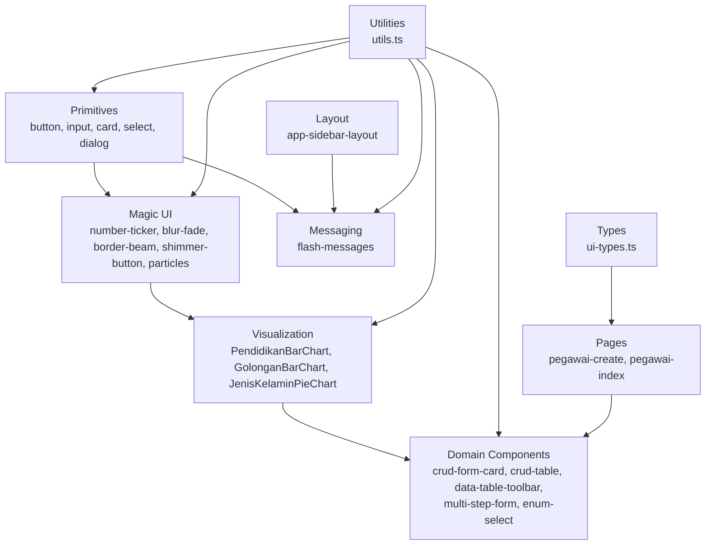

**Diagram sources**
- [button.tsx:1-61](file://resources/js/components/ui/button.tsx#L1-L61)
- [input.tsx:1-22](file://resources/js/components/ui/input.tsx#L1-L22)
- [card.tsx:1-69](file://resources/js/components/ui/card.tsx#L1-L69)
- [table.tsx:1-115](file://resources/js/components/ui/table.tsx#L1-L115)
- [dialog.tsx:1-134](file://resources/js/components/ui/dialog.tsx#L1-L134)
- [number-ticker.tsx:1-73](file://resources/js/components/ui/number-ticker.tsx#L1-L73)
- [blur-fade.tsx:1-93](file://resources/js/components/ui/blur-fade.tsx#L1-L93)
- [border-beam.tsx:1-106](file://resources/js/components/ui/border-beam.tsx#L1-L106)
- [shimmer-button.tsx:1-97](file://resources/js/components/ui/shimmer-button.tsx#L1-L97)
- [particles.tsx:1-320](file://resources/js/components/ui/particles.tsx#L1-L320)
- [flash-messages.tsx:1-76](file://resources/js/components/flash-messages.tsx#L1-L76)
- [PendidikanBarChart.tsx:1-79](file://resources/js/components/dashboard/PendidikanBarChart.tsx#L1-L79)
- [GolonganBarChart.tsx:1-77](file://resources/js/components/dashboard/GolonganBarChart.tsx#L1-L77)
- [JenisKelaminPieChart.tsx:1-71](file://resources/js/components/dashboard/JenisKelaminPieChart.tsx#L1-L71)
- [crud-form-card.tsx:1-63](file://resources/js/components/kepegawaian/crud-form-card.tsx#L1-L63)
- [crud-table.tsx:1-96](file://resources/js/components/kepegawaian/crud-table.tsx#L1-L96)
- [data-table-toolbar.tsx:1-119](file://resources/js/components/kepegawaian/data-table-toolbar.tsx#L1-L119)
- [multi-step-form.tsx:1-129](file://resources/js/components/kepegawaian/multi-step-form.tsx#L1-L129)
- [enum-select.tsx:1-60](file://resources/js/components/kepegawaian/enum-select.tsx#L1-L60)
- [pegawai-create.tsx:1-603](file://resources/js/pages/kepegawaian/pegawai/create.tsx#L1-L603)
- [pegawai-index.tsx:1-487](file://resources/js/pages/kepegawaian/pegawai/index.tsx#L1-L487)
- [utils.ts:1-13](file://resources/js/lib/utils.ts#L1-L13)
- [ui-types.ts:1-17](file://resources/js/types/ui.ts#L1-L17)
- [app-sidebar-layout.tsx:1-23](file://resources/js/layouts/app/app-sidebar-layout.tsx#L1-L23)

## Detailed Component Analysis

### Button Component
- Implementation highlights
  - Uses class-variance-authority for variant and size variants.
  - Supports asChild via Radix Slot to render anchors while preserving semantics.
  - Focus-visible ring and destructive ring on invalid states.
  - SVG sizing and pointer-event handling for nested icons.
  - **Updated**: Now uses retro-neobrutalism styling with border-2 border-foreground and shadow-[2px_2px_0_rgba(0,0,0,1)].
- Accessibility
  - Focus-visible ring and aria-invalid integration.
  - Proper role and labeling for icon-only buttons.

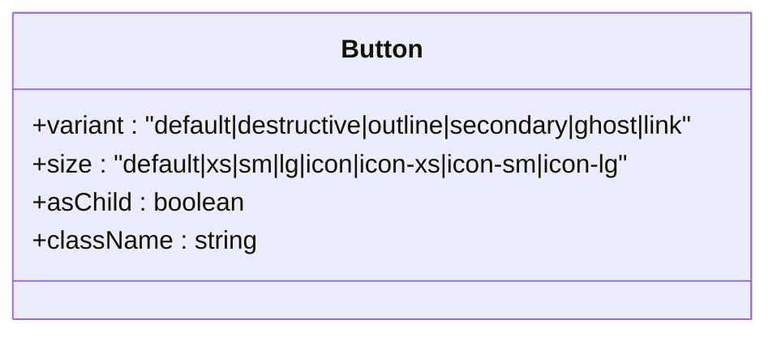

**Diagram sources**
- [button.tsx:7-39](file://resources/js/components/ui/button.tsx#L7-L39)

**Section sources**
- [button.tsx:1-61](file://resources/js/components/ui/button.tsx#L1-L61)

### Input Component
- Implementation highlights
  - Focus-visible ring and destructive ring on invalid state.
  - Disabled state handling and consistent typography.
  - **Updated**: Now uses retro-styling with border-2 border-foreground and shadow-[2px_2px_0_rgba(0,0,0,1)].
- Accessibility
  - Inherits focus-visible ring and aria-invalid styling.

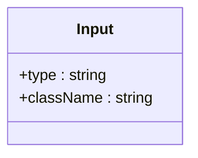

**Diagram sources**
- [input.tsx:5-18](file://resources/js/components/ui/input.tsx#L5-L18)

**Section sources**
- [input.tsx:1-22](file://resources/js/components/ui/input.tsx#L1-L22)

### Card Component Family
- Implementation highlights
  - Structured segments: Card, CardHeader, CardTitle, CardDescription, CardContent, CardFooter.
  - Semantic data-slot attributes for testing and styling hooks.
  - **Updated**: Now uses retro-styling with border-2 border-foreground and shadow-[4px_4px_0_rgba(0,0,0,1)].
- Composition patterns
  - Used extensively by CRUD Form Card to encapsulate forms.

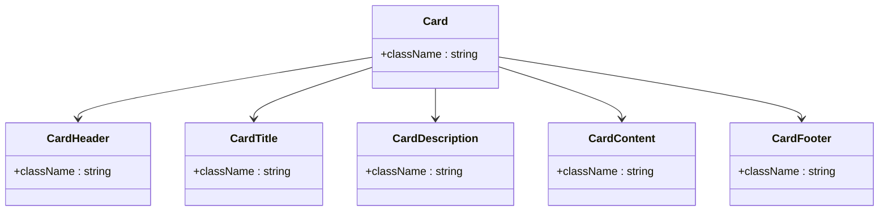

**Diagram sources**
- [card.tsx:5-66](file://resources/js/components/ui/card.tsx#L5-L66)

**Section sources**
- [card.tsx:1-69](file://resources/js/components/ui/card.tsx#L1-L69)

### Select Component Family
- Implementation highlights
  - Complex structure with Trigger, Content, Item, and Scroll buttons.
  - Portal-based content rendering with retro-styling.
  - **Updated**: Content panel uses border-2 border-foreground and shadow-[4px_4px_0_rgba(0,0,0,1)].
- Composition patterns
  - Used by Data Table Toolbar and Enum Select components.

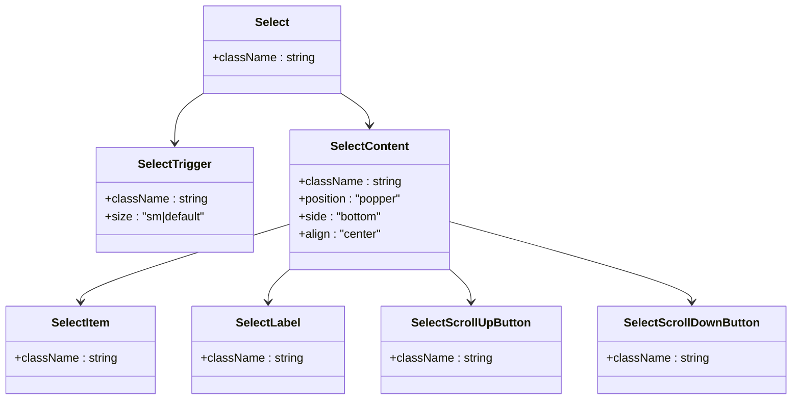

**Diagram sources**
- [select.tsx:25-91](file://resources/js/components/ui/select.tsx#L25-L91)

**Section sources**
- [select.tsx:1-194](file://resources/js/components/ui/select.tsx#L1-L194)

### Dialog Component
- Implementation highlights
  - Portal-based overlay with animations.
  - Close button with screen reader label.
- Accessibility
  - Overlay animation, close button with aria-label.

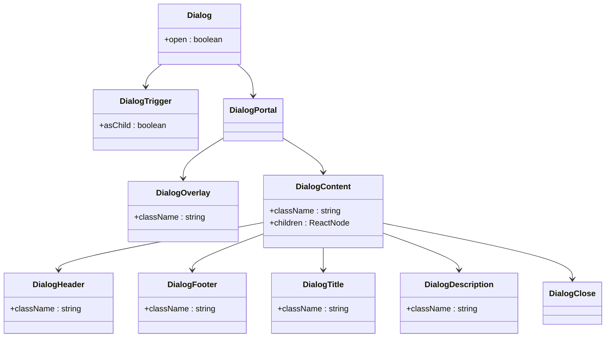

**Diagram sources**
- [dialog.tsx:7-132](file://resources/js/components/ui/dialog.tsx#L7-L132)

**Section sources**
- [dialog.tsx:1-134](file://resources/js/components/ui/dialog.tsx#L1-L134)

### FlashMessages Component
- Implementation highlights
  - **New**: Centralized global messaging system using Inertia flash properties.
  - Automatic detection of success and error messages from usePage().
  - Duplicate prevention using timestamp-based deduplication.
  - 4-second auto-dismiss timer with manual dismiss option.
  - Staggered positioning with AnimatePresence for smooth entry/exit.
  - **Updated**: Uses retro-styling with border-2 border-black and shadow-[4px_4px_0_rgba(0,0,0,1)].
- Integration patterns
  - Automatically integrated into AppSidebarLayout as a fixed-position component.
  - Uses motion/react for smooth animations with staggered delays.
  - Supports both success and error message types with appropriate icons.

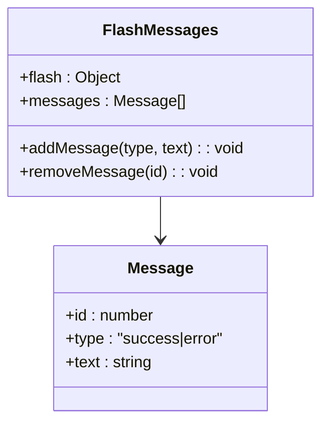

**Diagram sources**
- [flash-messages.tsx:6-41](file://resources/js/components/flash-messages.tsx#L6-L41)

**Section sources**
- [flash-messages.tsx:1-76](file://resources/js/components/flash-messages.tsx#L1-L76)

### PendidikanBarChart Component
- Implementation highlights
  - Uses Recharts library for professional bar chart rendering.
  - Vertical bar chart with educational level categories on Y-axis.
  - Custom tooltip with employee count and percentage display.
  - Responsive container with dynamic height calculation.
  - Custom styling with gradient blue color (#6366f1) and rounded bar ends.
- Data requirements
  - Expects array of PendidikanItem with pendidikan (level label), count (employee number), and percentage.
  - Automatically calculates chart height based on number of education levels.
- Interaction features
  - Hover tooltips showing exact count and percentage.
  - Click-through to underlying data for detailed analysis.
  - Responsive design adapts to container width and height.

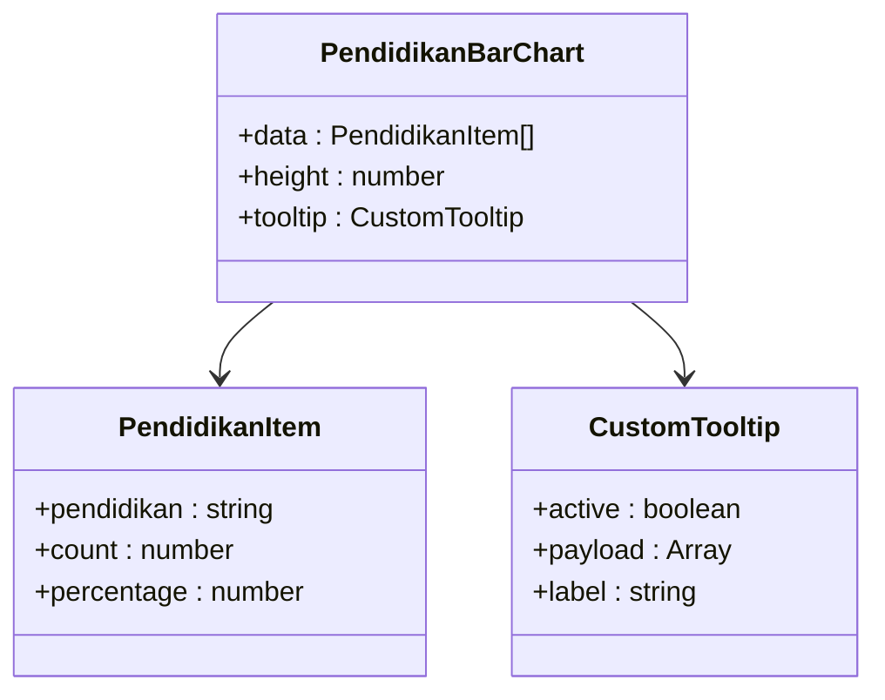

**Diagram sources**
- [PendidikanBarChart.tsx:11-19](file://resources/js/components/dashboard/PendidikanBarChart.tsx#L11-L19)
- [PendidikanBarChart.tsx:21-31](file://resources/js/components/dashboard/PendidikanBarChart.tsx#L21-L31)

**Section sources**
- [PendidikanBarChart.tsx:1-79](file://resources/js/components/dashboard/PendidikanBarChart.tsx#L1-L79)

### GolonganBarChart Component
- Implementation highlights
  - Uses Recharts library for horizontal bar chart visualization.
  - Color-coded bars with predefined color palette for different ranks.
  - Dynamic color assignment using modulo operator for unlimited rank categories.
  - Custom tooltip with employee count and percentage information.
  - Fixed height container with consistent 200px height.
- Data requirements
  - Expects array of GolonganItem with golongan (rank category), count (employee number), and percentage.
  - Automatically assigns colors from predefined palette based on rank order.
- Visual features
  - Professional bar styling with consistent color scheme.
  - Interactive tooltips with detailed percentage breakdown.
  - Responsive design with fixed aspect ratio.

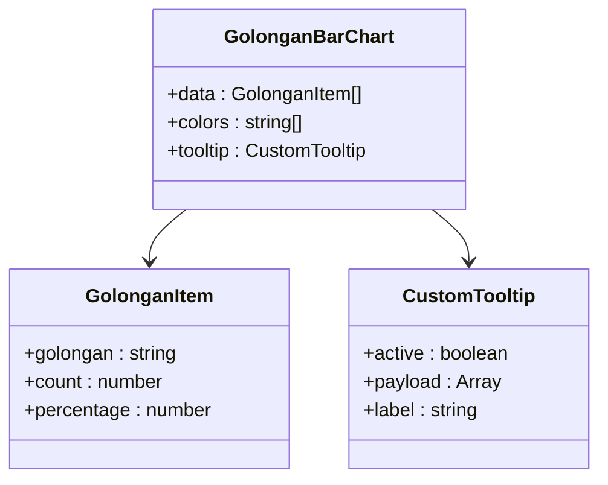

**Diagram sources**
- [GolonganBarChart.tsx:11-19](file://resources/js/components/dashboard/GolonganBarChart.tsx#L11-L19)
- [GolonganBarChart.tsx:23-33](file://resources/js/components/dashboard/GolonganBarChart.tsx#L23-L33)

**Section sources**
- [GolonganBarChart.tsx:1-77](file://resources/js/components/dashboard/GolonganBarChart.tsx#L1-L77)

### JenisKelaminPieChart Component
- Implementation highlights
  - Uses Recharts library for pie chart visualization.
  - Custom color scheme with blue for male and pink for female.
  - Dynamic color fallback for unexpected gender categories.
  - Custom label rendering showing gender label and percentage.
  - Responsive container with fixed 240px height.
- Data requirements
  - Expects array of JenisKelaminItem with label (gender category), total (employee count), and percentage.
  - Automatically maps predefined labels to colors or falls back to default palette.
- Visual features
  - Inner radius creates donut-style pie chart appearance.
  - Custom padding angles for better visual separation.
  - Legend support for gender categories.
  - Tooltips with formatted employee count display.

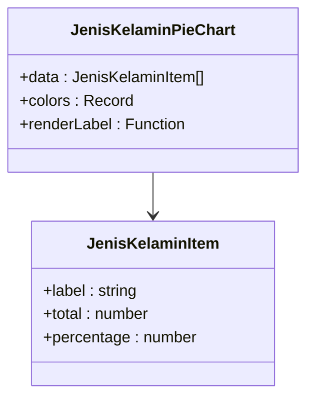

**Diagram sources**
- [JenisKelaminPieChart.tsx:11-19](file://resources/js/components/dashboard/JenisKelaminPieChart.tsx#L11-L19)
- [JenisKelaminPieChart.tsx:21-25](file://resources/js/components/dashboard/JenisKelaminPieChart.tsx#L21-L25)

**Section sources**
- [JenisKelaminPieChart.tsx:1-71](file://resources/js/components/dashboard/JenisKelaminPieChart.tsx#L1-L71)

### NumberTicker Component
- Implementation highlights
  - Uses motion/react library for spring animation and in-view detection.
  - Configurable decimal places with Intl.NumberFormat for localization.
  - Delayed animation trigger with timeout mechanism.
  - Direction control (up/down) with different starting positions.
- Performance considerations
  - Uses useInView hook for lazy loading animation.
  - Spring physics for smooth numeric transitions.
  - Efficient value formatting with decimal precision control.

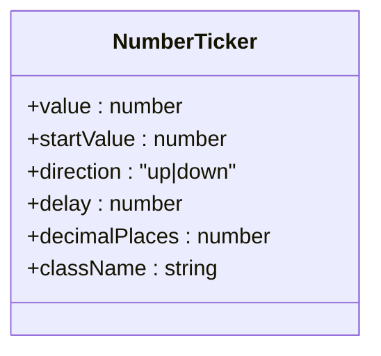

**Diagram sources**
- [number-ticker.tsx:6-22](file://resources/js/components/ui/number-ticker.tsx#L6-L22)

**Section sources**
- [number-ticker.tsx:1-73](file://resources/js/components/ui/number-ticker.tsx#L1-L73)

### BlurFade Component
- Implementation highlights
  - Uses AnimatePresence for enter/exit animations and motion for variants.
  - Configurable direction (up/down/left/right) with offset-based positioning.
  - Dynamic blur filter transitions with configurable blur distance.
  - In-view detection with customizable margins for triggering animations.
- Animation features
  - Smooth opacity and blur transitions.
  - Directional movement with configurable offset.
  - Customizable duration and delay for staggered animations.

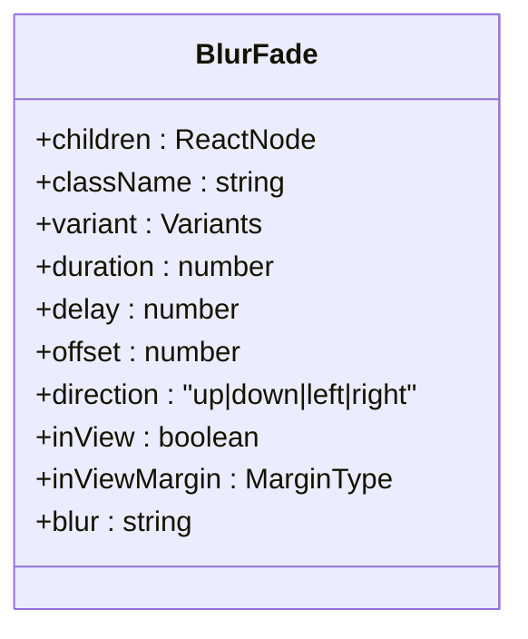

**Diagram sources**
- [blur-fade.tsx:13-44](file://resources/js/components/ui/blur-fade.tsx#L13-L44)

**Section sources**
- [blur-fade.tsx:1-93](file://resources/js/components/ui/blur-fade.tsx#L1-L93)

### BorderBeam Component
- Implementation highlights
  - Creates animated border beam with gradient colors using motion/react.
  - Configurable size, duration, and color gradient from colorFrom to colorTo.
  - Continuous animation with infinite repeat and linear easing.
  - Reverse direction support and configurable initial offset.
- Visual effects
  - Gradient color transitions from colorFrom to colorTo.
  - Circular motion along rectangle path with configurable size.
  - Smooth continuous animation with customizable timing.

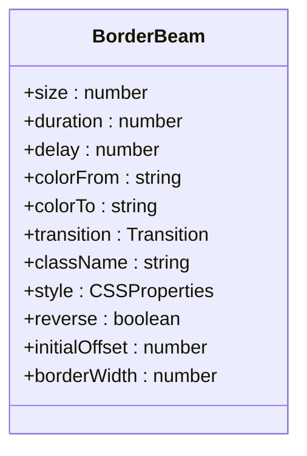

**Diagram sources**
- [border-beam.tsx:5-64](file://resources/js/components/ui/border-beam.tsx#L5-L64)

**Section sources**
- [border-beam.tsx:1-106](file://resources/js/components/ui/border-beam.tsx#L1-L106)

### ShimmerButton Component
- Implementation highlights
  - Custom CSS variables for configurable shimmer effects.
  - Conic gradient animation for realistic shimmer appearance.
  - Hover and active state animations with shadow transitions.
  - Backdrop and highlight layers for depth effect.
- Styling features
  - Configurable shimmer color, size, and duration.
  - Customizable border radius and background color.
  - Responsive design with transform-gpu for hardware acceleration.
  - Active state translation for press feedback.

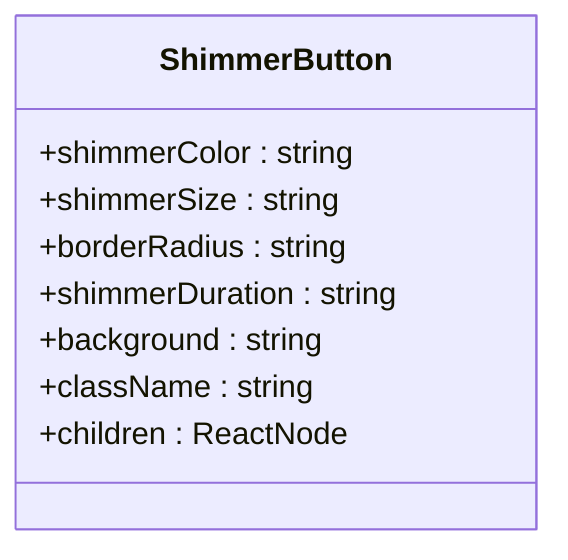

**Diagram sources**
- [shimmer-button.tsx:5-31](file://resources/js/components/ui/shimmer-button.tsx#L5-L31)

**Section sources**
- [shimmer-button.tsx:1-97](file://resources/js/components/ui/shimmer-button.tsx#L1-L97)

### Particles Component
- Implementation highlights
  - Canvas-based particle system with mouse interaction.
  - Configurable particle count, staticity, and easing.
  - Hex color conversion to RGB for particle coloring.
  - RequestAnimationFrame for smooth animation loop.
- Interactive features
  - Mouse position tracking with global event listeners.
  - Particle attraction/repulsion based on mouse proximity.
  - Dynamic alpha blending near canvas edges.
  - Configurable velocity vectors for particle movement.

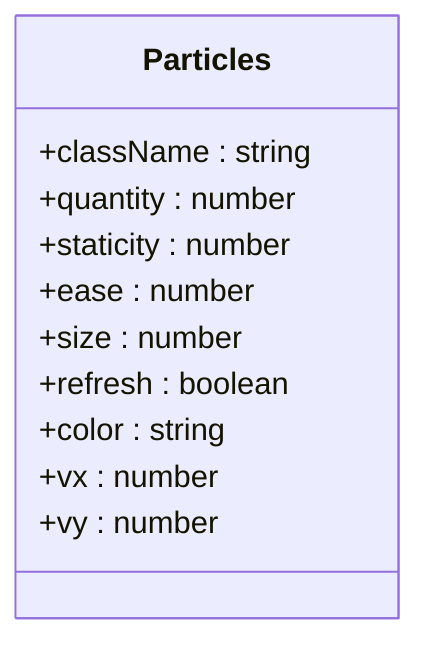

**Diagram sources**
- [particles.tsx:36-89](file://resources/js/components/ui/particles.tsx#L36-L89)

**Section sources**
- [particles.tsx:1-320](file://resources/js/components/ui/particles.tsx#L1-L320)

### CRUD Form Card
- Purpose: Encapsulate form UI with standardized actions and processing state.
- Props interface
  - title: string
  - description: string
  - children: ReactNode
  - onSubmit: (e: React.FormEvent) => void
  - onCancel?: () => void
  - submitLabel?: string
  - cancelLabel?: string
  - isEditing?: boolean
  - processing?: boolean

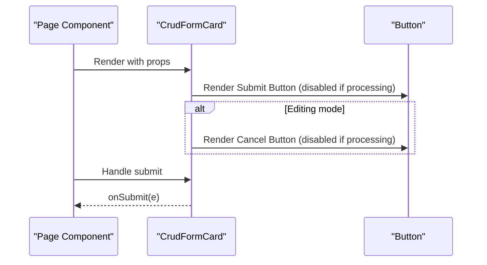

**Diagram sources**
- [crud-form-card.tsx:23-62](file://resources/js/components/kepegawaian/crud-form-card.tsx#L23-L62)
- [button.tsx:41-62](file://resources/js/components/ui/button.tsx#L41-L62)

**Section sources**
- [crud-form-card.tsx:1-63](file://resources/js/components/kepegawaian/crud-form-card.tsx#L1-L63)

### CRUD Table
- Purpose: Generic table with edit/delete actions and customizable columns.
- Props interface
  - columns: Array of { key, header, cell(item), className? }
  - data: Array of items
  - onEdit: (item) => void
  - onDelete: (item) => void
  - emptyMessage?: string
  - getItemId: (item) => string


**Diagram sources**
- [crud-table.tsx:28-95](file://resources/js/components/kepegawaian/crud-table.tsx#L28-L95)
- [table.tsx:53-90](file://resources/js/components/ui/table.tsx#L53-L90)
- [button.tsx:41-62](file://resources/js/components/ui/button.tsx#L41-L62)

**Section sources**
- [crud-table.tsx:1-96](file://resources/js/components/kepegawaian/crud-table.tsx#L1-L96)

### Data Table Toolbar
- Purpose: Unified search and filter controls with clear action using retro-styling.
- Styling Pattern: Uses border-2 border-foreground with shadow-[4px_4px_0_rgba(0,0,0,1)].
- Props interface
  - searchValue: string
  - onSearchChange: (value: string) => void
  - searchPlaceholder?: string
  - filters: Array of { key, label, placeholder, value, options, onChange }
  - showClear: boolean
  - onClear: () => void
  - className?: string

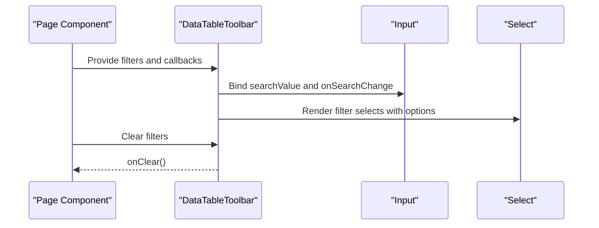

**Diagram sources**
- [data-table-toolbar.tsx:38-118](file://resources/js/components/kepegawaian/data-table-toolbar.tsx#L38-L118)
- [input.tsx:5-18](file://resources/js/components/ui/input.tsx#L5-L18)
- [enum-select.tsx:28-59](file://resources/js/components/kepegawaian/enum-select.tsx#L28-L59)

**Section sources**
- [data-table-toolbar.tsx:1-119](file://resources/js/components/kepegawaian/data-table-toolbar.tsx#L1-L119)

### Multi-Step Form
- Purpose: Wizard with progress bar and navigation controls.
- Props interface
  - steps: string[]
  - currentStep: number
  - children: React.ReactNode
  - onNext?: () => void
  - onPrev?: () => void
  - onSubmit?: () => void
  - isLastStep: boolean
  - isFirstStep: boolean
  - processing?: boolean
  - title?: string

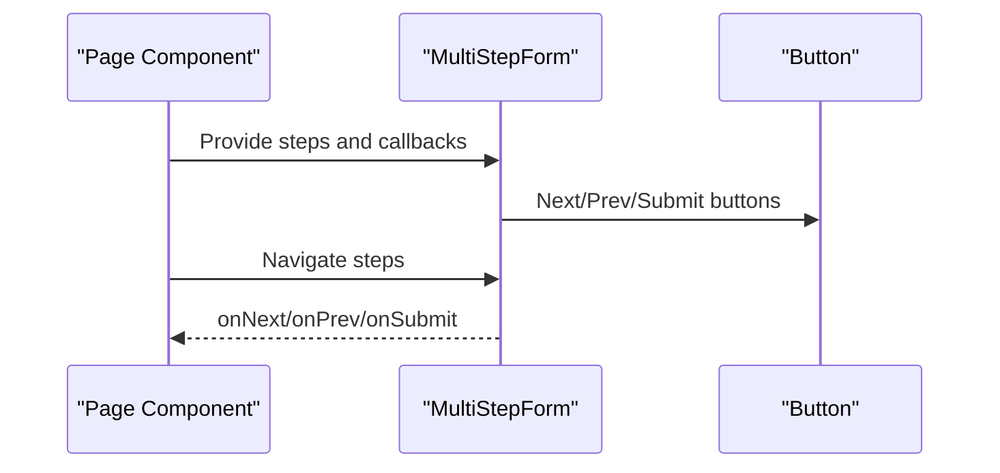

**Diagram sources**
- [multi-step-form.tsx:26-128](file://resources/js/components/kepegawaian/multi-step-form.tsx#L26-L128)
- [button.tsx:41-62](file://resources/js/components/ui/button.tsx#L41-L62)

**Section sources**
- [multi-step-form.tsx:1-129](file://resources/js/components/kepegawaian/multi-step-form.tsx#L1-L129)

### Enum Select
- Purpose: Specialized select for enum-style options with label and error messaging.
- Props interface
  - options: Array of { value, label?, name? }
  - value?: string
  - onChange: (value: string) => void
  - placeholder?: string
  - error?: string
  - disabled?: boolean
  - label?: string
  - id?: string

```mermaid
flowchart TD
Start(["Render EnumSelect"]) --> HasLabel{"Has label?"}
HasLabel --> |Yes| Label["Render Label"]
HasLabel --> |No| Select
Label --> Select["Render Select with options"]
Select --> Error{"Has error?"}
Error --> |Yes| ShowError["Render error message"]
Error --> |No| Done(["Done"])
ShowError --> Done
```

**Diagram sources**
- [enum-select.tsx:28-59](file://resources/js/components/kepegawaian/enum-select.tsx#L28-L59)

**Section sources**
- [enum-select.tsx:1-60](file://resources/js/components/kepegawaian/enum-select.tsx#L1-L60)

### Page-Level Usage Examples

#### Employee Create Page
- Composes MultiStepForm, EnumSelect, Input, Textarea, and Select to build a multi-step creation form.
- Integrates with Inertia useForm for state management and submission.
- Demonstrates error display and conditional rendering per step.

```mermaid
sequenceDiagram
participant Page as "PegawaiCreate"
participant Wizard as "MultiStepForm"
participant Step1 as "Step 1 Fields"
participant Step2 as "Step 2 Fields"
participant Step3 as "Step 3 Fields"
participant EnumSel as "EnumSelect"
participant Inertia as "useForm"
Page->>Inertia : Initialize form state
Page->>Wizard : Render with steps and callbacks
Wizard->>Step1 : Render step 1 fields
Step1->>EnumSel : Render enum selects
Step1->>Inertia : Update field values
Page->>Wizard : Navigate steps
Wizard->>Step2 : Render step 2 fields
Wizard->>Step3 : Render step 3 fields
Page->>Inertia : Submit form
```

**Diagram sources**
- [pegawai-create.tsx:44-602](file://resources/js/pages/kepegawaian/pegawai/create.tsx#L44-L602)
- [multi-step-form.tsx:26-128](file://resources/js/components/kepegawaian/multi-step-form.tsx#L26-L128)
- [enum-select.tsx:28-59](file://resources/js/components/kepegawaian/enum-select.tsx#L28-L59)
- [input.tsx:5-18](file://resources/js/components/ui/input.tsx#L5-L18)

**Section sources**
- [pegawai-create.tsx:1-603](file://resources/js/pages/kepegawaian/pegawai/create.tsx#L1-L603)

#### Employee Index Page
- Renders a paginated table with DataTableToolbar for filtering and sorting.
- Uses Badge for status indicators and Button for actions.
- Implements debounced search and filter persistence via Inertia router.

```mermaid
sequenceDiagram
participant Page as "PegawaiIndex"
participant Toolbar as "DataTableToolbar"
participant Table as "Table"
participant Badge as "Badge"
participant Inertia as "router"
Page->>Toolbar : Provide filters and callbacks
Toolbar->>Inertia : Apply filters via router.get
Page->>Table : Render table rows
Table->>Badge : Render status badges
Page->>Inertia : Navigate to show/edit actions
```

**Diagram sources**
- [pegawai-index.tsx:91-486](file://resources/js/pages/kepegawaian/pegawai/index.tsx#L91-L486)
- [data-table-toolbar.tsx:38-118](file://resources/js/components/kepegawaian/data-table-toolbar.tsx#L38-L118)
- [table.tsx:5-103](file://resources/js/components/ui/table.tsx#L5-L103)

**Section sources**
- [pegawai-index.tsx:1-487](file://resources/js/pages/kepegawaian/pegawai/index.tsx#L1-L487)

## Retro-Neobrutalism Styling System
The kepegawaian application now implements a comprehensive retro-neobrutalism design system that provides consistent visual patterns across all components. This styling approach emphasizes bold, tactile aesthetics with physical metaphors.

### Core Styling Principles
- **Bold Borders**: All interactive elements use border-2 for prominent outlines that create a 3D appearance.
- **Shadow Effects**: Consistent shadow-[4px_4px_0_rgba(0,0,0,1)] creates a raised, paper-like effect.
- **Physical Metaphor**: Components appear to be pressed against a surface, mimicking real-world materials.
- **High Contrast**: Black borders on white backgrounds create strong visual separation.
- **Uniform Typography**: Bold, black text with consistent font weights for readability.

### Implementation Patterns
- **Buttons**: border-2 border-foreground with shadow-[2px_2px_0_rgba(0,0,0,1)] for default state, transforms for pressed effect.
- **Cards**: border-2 border-foreground with shadow-[4px_4px_0_rgba(0,0,0,1)] creating elevated containers.
- **Inputs**: border-2 border-foreground with shadow-[2px_2px_0_rgba(0,0,0,1)] and transform for focus/pressed states.
- **Select Content**: border-2 border-foreground with shadow-[4px_4px_0_rgba(0,0,0,1)] for dropdown panels.
- **Flash Messages**: border-2 border-black with shadow-[4px_4px_0_rgba(0,0,0,1)] positioned as floating notifications.

### Design Benefits
- **Tactile Feedback**: Users feel they're interacting with physical objects rather than digital elements.
- **Visual Clarity**: High contrast and bold borders improve accessibility and readability.
- **Consistency**: Uniform styling patterns across all components create predictable user experiences.
- **Brand Identity**: The distinctive retro-styling helps establish a unique visual identity.
- **Responsive Behavior**: The 3D effect translates well across different screen sizes and resolutions.

**Section sources**
- [button.tsx:10-17](file://resources/js/components/ui/button.tsx#L10-L17)
- [card.tsx:9-12](file://resources/js/components/ui/card.tsx#L9-L12)
- [input.tsx:10-16](file://resources/js/components/ui/input.tsx#L10-L16)
- [select.tsx:37-69](file://resources/js/components/ui/select.tsx#L37-L69)
- [flash-messages.tsx:51-52](file://resources/js/components/flash-messages.tsx#L51-L52)
- [data-table-toolbar.tsx:49-52](file://resources/js/components/kepegawaian/data-table-toolbar.tsx#L49-L52)

## Dependency Analysis
- **Internal dependencies**
  - All components depend on shared utilities (cn) for class merging.
  - Pages depend on domain components; domain components depend on primitives.
  - Magic UI components depend on motion/react library for animations.
  - Chart components depend on Recharts library for visualization.
  - **New**: FlashMessages depends on motion/react for animations and @inertiajs/react for flash integration.
- **External dependencies**
  - Radix UI for accessible base components (Dialog, Slot).
  - Lucide icons for UI affordances.
  - Inertia for client-side routing and form state.
  - **motion/react** for advanced animation capabilities in Magic UI components and FlashMessages.
  - **Recharts** for professional chart rendering and interactive data visualization.
  - Canvas API for interactive particle system.

```mermaid
graph LR
UTIL["utils.ts"] --> BTN["button.tsx"]
UTIL --> INP["input.tsx"]
UTIL --> CARD["card.tsx"]
UTIL --> TABLE["table.tsx"]
UTIL --> DLG["dialog.tsx"]
UTIL --> NT["number-ticker.tsx"]
UTIL --> BF["blur-fade.tsx"]
UTIL --> BB["border-beam.tsx"]
UTIL --> SB["shimmer-button.tsx"]
UTIL --> PRT["particles.tsx"]
UTIL --> FM["flash-messages.tsx"]
UTIL --> PBC["PendidikanBarChart.tsx"]
UTIL --> GBC["GolonganBarChart.tsx"]
UTIL --> JKPC["JenisKelaminPieChart.tsx"]
UTIL --> CFC["crud-form-card.tsx"]
UTIL --> CTBL["crud-table.tsx"]
UTIL --> DTT["data-table-toolbar.tsx"]
UTIL --> MSF["multi-step-form.tsx"]
UTIL --> ENUMSEL["enum-select.tsx"]
DLG -. uses Radix .- BTN
NT -. uses motion/react .- BTN
BF -. uses motion/react .- BTN
BB -. uses motion/react .- BTN
SB -. uses motion/react .- BTN
PRT -. uses Canvas API .- BTN
FM -. uses motion/react .- BTN
FM -. uses Inertia .- BTN
PBC -. uses Recharts .- BTN
GBC -. uses Recharts .- BTN
JKPC -. uses Recharts .- BTN
ENUMSEL -. uses Select .- INP
CFC -. uses Card/Button .- CARD
CTBL -. uses Table/Button .- TABLE
```

**Diagram sources**
- [utils.ts:6-8](file://resources/js/lib/utils.ts#L6-L8)
- [button.tsx:1-6](file://resources/js/components/ui/button.tsx#L1-L6)
- [input.tsx:3-5](file://resources/js/components/ui/input.tsx#L3-L5)
- [card.tsx:3-4](file://resources/js/components/ui/card.tsx#L3-L4)
- [table.tsx:3-4](file://resources/js/components/ui/table.tsx#L3-L4)
- [dialog.tsx:1-6](file://resources/js/components/ui/dialog.tsx#L1-L6)
- [number-ticker.tsx:1-4](file://resources/js/components/ui/number-ticker.tsx#L1-L4)
- [blur-fade.tsx:1-9](file://resources/js/components/ui/blur-fade.tsx#L1-L9)
- [border-beam.tsx:1-3](file://resources/js/components/ui/border-beam.tsx#L1-L3)
- [shimmer-button.tsx:1-3](file://resources/js/components/ui/shimmer-button.tsx#L1-L3)
- [particles.tsx:1-8](file://resources/js/components/ui/particles.tsx#L1-L8)
- [flash-messages.tsx:1-4](file://resources/js/components/flash-messages.tsx#L1-L4)
- [PendidikanBarChart.tsx:1-9](file://resources/js/components/dashboard/PendidikanBarChart.tsx#L1-L9)
- [GolonganBarChart.tsx:1-9](file://resources/js/components/dashboard/GolonganBarChart.tsx#L1-L9)
- [JenisKelaminPieChart.tsx:1-9](file://resources/js/components/dashboard/JenisKelaminPieChart.tsx#L1-L9)
- [crud-form-card.tsx:2-9](file://resources/js/components/kepegawaian/crud-form-card.tsx#L2-L9)
- [crud-table.tsx:2-10](file://resources/js/components/kepegawaian/crud-table.tsx#L2-L10)
- [data-table-toolbar.tsx:3-12](file://resources/js/components/kepegawaian/data-table-toolbar.tsx#L3-L12)
- [multi-step-form.tsx:3-11](file://resources/js/components/kepegawaian/multi-step-form.tsx#L3-L11)
- [enum-select.tsx:2-9](file://resources/js/components/kepegawaian/enum-select.tsx#L2-L9)

**Section sources**
- [utils.ts:1-13](file://resources/js/lib/utils.ts#L1-L13)
- [button.tsx:1-61](file://resources/js/components/ui/button.tsx#L1-L61)
- [input.tsx:1-22](file://resources/js/components/ui/input.tsx#L1-L22)
- [card.tsx:1-69](file://resources/js/components/ui/card.tsx#L1-L69)
- [table.tsx:1-115](file://resources/js/components/ui/table.tsx#L1-L115)
- [dialog.tsx:1-134](file://resources/js/components/ui/dialog.tsx#L1-L134)
- [number-ticker.tsx:1-73](file://resources/js/components/ui/number-ticker.tsx#L1-L73)
- [blur-fade.tsx:1-93](file://resources/js/components/ui/blur-fade.tsx#L1-L93)
- [border-beam.tsx:1-106](file://resources/js/components/ui/border-beam.tsx#L1-L106)
- [shimmer-button.tsx:1-97](file://resources/js/components/ui/shimmer-button.tsx#L1-L97)
- [particles.tsx:1-320](file://resources/js/components/ui/particles.tsx#L1-L320)
- [flash-messages.tsx:1-76](file://resources/js/components/flash-messages.tsx#L1-L76)
- [PendidikanBarChart.tsx:1-79](file://resources/js/components/dashboard/PendidikanBarChart.tsx#L1-L79)
- [GolonganBarChart.tsx:1-77](file://resources/js/components/dashboard/GolonganBarChart.tsx#L1-L77)
- [JenisKelaminPieChart.tsx:1-71](file://resources/js/components/dashboard/JenisKelaminPieChart.tsx#L1-L71)
- [crud-form-card.tsx:1-63](file://resources/js/components/kepegawaian/crud-form-card.tsx#L1-L63)
- [crud-table.tsx:1-96](file://resources/js/components/kepegawaian/crud-table.tsx#L1-L96)
- [data-table-toolbar.tsx:1-119](file://resources/js/components/kepegawaian/data-table-toolbar.tsx#L1-L119)
- [multi-step-form.tsx:1-129](file://resources/js/components/kepegawaian/multi-step-form.tsx#L1-L129)
- [enum-select.tsx:1-60](file://resources/js/components/kepegawaian/enum-select.tsx#L1-L60)

## Performance Considerations
- **Traditional components**
  - Prefer memoization for derived data (e.g., computed options) to avoid unnecessary renders.
  - Debounce search inputs to reduce server requests during typing.
  - Use virtualization for very large tables if performance becomes an issue.
  - Keep component trees shallow and avoid deep nesting of heavy wrappers.
  - Reuse shared utilities (cn) to minimize class computation overhead.
  - **Updated**: Retro-styling with border-2 and shadows adds visual weight but maintains performance through efficient CSS.
- **Animation components**
  - Magic UI components leverage useInView hooks for lazy loading, reducing initial load.
  - Spring animations use efficient motion values with damping/stiffness configuration.
  - BlurFade components use AnimatePresence for optimal enter/exit transitions.
  - BorderBeam uses continuous animation with configurable duration and easing.
  - ShimmerButton utilizes CSS variables and transform-gpu for hardware acceleration.
  - Particles component implements requestAnimationFrame with cleanup on unmount.
  - **New**: FlashMessages uses AnimatePresence for efficient enter/exit animations.
- **Chart components**
  - Recharts components are optimized for performance with efficient SVG rendering.
  - Responsive containers automatically adapt to viewport changes without full re-renders.
  - Custom tooltips are lightweight and only rendered on hover.
  - Chart data is processed once and cached in useMemo hooks for stability.
  - Dynamic height calculations for vertical bar charts optimize rendering performance.
- **Global messaging system**
  - **New**: FlashMessages implements duplicate prevention to avoid memory leaks from React Strict Mode.
  - Auto-dismiss timers are cleaned up properly to prevent memory accumulation.
  - Staggered positioning uses efficient array filtering for message removal.
  - Animation cleanup prevents residual motion effects after component unmount.
- **Accessibility and performance balance**
  - Respect prefers-reduced-motion media queries for animation-heavy components.
  - Use component-level lazy loading for complex animations.
  - Implement proper cleanup for event listeners and animation frames.
  - Consider component mounting/unmounting strategies for resource-intensive animations.
  - Chart components support accessibility features like ARIA labels and keyboard navigation.
  - **Updated**: Retro-styling maintains accessibility with high contrast and clear borders.

## Troubleshooting Guide
- **Button disabled states**
  - Ensure processing flag disables submit/cancel buttons to prevent duplicate submissions.
  - **Updated**: Verify border-2 and shadow patterns remain consistent in disabled states.
- **Input validation**
  - Use aria-invalid and destructive ring styles to indicate invalid states.
  - **Updated**: Check that retro-styling persists in error states.
- **Dialog accessibility**
  - Ensure close button has a screen reader label and focus trapping is handled by Radix.
- **Table responsiveness**
  - Wrap tables in scroll containers and ensure proper cell alignment for checkboxes.
- **Form state**
  - Use Inertia useForm to manage controlled inputs and clear errors after successful submission.
- **Animation component issues**
  - **NumberTicker**: Ensure value prop changes trigger animation; check decimalPlaces configuration.
  - **BlurFade**: Verify in-view detection works with proper container dimensions; adjust inViewMargin if needed.
  - **BorderBeam**: Check colorFrom/colorTo values are valid CSS colors; adjust duration for desired speed.
  - **ShimmerButton**: Ensure CSS variables are properly defined; verify conic gradient syntax.
  - **Particles**: Monitor canvas resize events; check mouse position tracking; verify devicePixelRatio handling.
  - **FlashMessages**: Verify flash messages are properly detected from Inertia props; check duplicate prevention logic.
- **Chart component issues**
  - **PendidikanBarChart**: Ensure data array is not empty; verify PendidikanItem structure; check responsive container dimensions.
  - **GolonganBarChart**: Verify GolonganItem data format; ensure color palette is properly assigned; check chart height constraints.
  - **JenisKelaminPieChart**: Validate gender label values match predefined color keys; check percentage calculations; ensure proper legend rendering.
  - **Recharts integration**: Verify Recharts library is properly installed; check for version compatibility issues.
- **Retro-styling issues**
  - **Border consistency**: Ensure all components use border-2 for consistent visual weight.
  - **Shadow patterns**: Verify shadow-[4px_4px_0_rgba(0,0,0,1)] is applied consistently for raised effects.
  - **Color schemes**: Check that black borders and high-contrast text maintain accessibility standards.
  - **Component integration**: Ensure new components follow the retro-styling patterns established by existing components.
- **Performance optimization**
  - Use React.memo for frequently re-rendered animation components.
  - Implement proper cleanup in useEffect hooks for animation components.
  - Consider disabling animations for users with motion sensitivity preferences.
  - Optimize chart data processing with useMemo for large datasets.
  - Use virtualization for charts with many data points.
  - **New**: Monitor FlashMessages memory usage and ensure proper cleanup of auto-dismiss timers.

**Section sources**
- [button.tsx:1-61](file://resources/js/components/ui/button.tsx#L1-L61)
- [input.tsx:1-22](file://resources/js/components/ui/input.tsx#L1-L22)
- [dialog.tsx:1-134](file://resources/js/components/ui/dialog.tsx#L1-L134)
- [table.tsx:1-115](file://resources/js/components/ui/table.tsx#L1-L115)
- [number-ticker.tsx:1-73](file://resources/js/components/ui/number-ticker.tsx#L1-L73)
- [blur-fade.tsx:1-93](file://resources/js/components/ui/blur-fade.tsx#L1-L93)
- [border-beam.tsx:1-106](file://resources/js/components/ui/border-beam.tsx#L1-L106)
- [shimmer-button.tsx:1-97](file://resources/js/components/ui/shimmer-button.tsx#L1-L97)
- [particles.tsx:1-320](file://resources/js/components/ui/particles.tsx#L1-L320)
- [flash-messages.tsx:1-76](file://resources/js/components/flash-messages.tsx#L1-L76)
- [PendidikanBarChart.tsx:1-79](file://resources/js/components/dashboard/PendidikanBarChart.tsx#L1-L79)
- [GolonganBarChart.tsx:1-77](file://resources/js/components/dashboard/GolonganBarChart.tsx#L1-L77)
- [JenisKelaminPieChart.tsx:1-71](file://resources/js/components/dashboard/JenisKelaminPieChart.tsx#L1-L71)
- [pegawai-create.tsx:1-603](file://resources/js/pages/kepegawaian/pegawai/create.tsx#L1-L603)

## Conclusion
The React Component System leverages Radix UI primitives, Tailwind variants, comprehensive Magic UI animation components, interactive data visualization capabilities, and a new retro-neobrutalism styling system to deliver accessible, reusable, and visually engaging UI components. The addition of the FlashMessages component provides centralized global messaging with automatic dismissal and duplicate prevention, while the retro-styling system establishes consistent visual patterns using border-2 and shadow-[4px_4px_0_rgba(0,0,0,1)] conventions. These enhancements significantly improve the user experience through tactile visual feedback, consistent design language, and reliable notification delivery. Kepegawaian-specific components continue to encapsulate common workflows like CRUD forms, multi-step wizards, and data tables, all benefiting from the new retro-styling approach. By composing primitives, Magic UI components, chart components, messaging system, and domain components consistently with the retro-neobrutalism design philosophy, the system ensures maintainability, accessibility, and scalability across the application while providing rich visual experiences and enhanced analytical capabilities.

## Appendices

### Prop Interfaces Summary
- **Button**
  - variant: "default|destructive|outline|secondary|ghost|link"
  - size: "default|xs|sm|lg|icon|icon-xs|icon-sm|icon-lg"
  - asChild: boolean
- **Input**
  - type: string
- **Card family**
  - className: string
- **Table family**
  - className: string
- **Dialog family**
  - className: string, children: ReactNode
- **Select family**
  - className: string
- **NumberTicker**
  - value: number, startValue: number, direction: "up|down", delay: number, decimalPlaces: number, className: string
- **BlurFade**
  - children: ReactNode, className: string, variant: Variants, duration: number, delay: number, offset: number, direction: "up|down|left|right", inView: boolean, inViewMargin: MarginType, blur: string
- **BorderBeam**
  - size: number, duration: number, delay: number, colorFrom: string, colorTo: string, transition: Transition, className: string, style: CSSProperties, reverse: boolean, initialOffset: number, borderWidth: number
- **ShimmerButton**
  - shimmerColor: string, shimmerSize: string, borderRadius: string, shimmerDuration: string, background: string, className: string, children: ReactNode
- **Particles**
  - className: string, quantity: number, staticity: number, ease: number, size: number, refresh: boolean, color: string, vx: number, vy: number
- **FlashMessages**
  - flash: Object, messages: Message[], addMessage(type, text): void, removeMessage(id): void
- **PendidikanBarChart**
  - data: PendidikanItem[] (pendidikan: string, count: number, percentage: number)
- **GolonganBarChart**
  - data: GolonganItem[] (golongan: string, count: number, percentage: number)
- **JenisKelaminPieChart**
  - data: JenisKelaminItem[] (label: string, total: number, percentage: number)
- **CRUD Form Card**
  - title: string, description: string, children: ReactNode, onSubmit: Function, onCancel?: Function, submitLabel?: string, cancelLabel?: string, isEditing?: boolean, processing?: boolean
- **CRUD Table**
  - columns: Array<{ key: string, header: string, cell: Function, className?: string }>, data: Array<any>, onEdit: Function, onDelete: Function, emptyMessage?: string, getItemId: Function
- **Data Table Toolbar**
  - searchValue: string, onSearchChange: Function, searchPlaceholder?: string, filters: Array<{ key: string, label: string, placeholder: string, value: string|null, options: Array<{value: string,label: string}>, onChange: Function }>, showClear: boolean, onClear: Function, className?: string
- **Multi-Step Form**
  - steps: string[], currentStep: number, children: React.ReactNode, onNext?: Function, onPrev?: Function, onSubmit?: Function, isLastStep: boolean, isFirstStep: boolean, processing?: boolean, title?: string
- **Enum Select**
  - options: Array<{ value: string, label?: string, name?: string }>, value?: string, onChange: Function, placeholder?: string, error?: string, disabled?: boolean, label?: string, id?: string

**Section sources**
- [button.tsx:41-62](file://resources/js/components/ui/button.tsx#L41-L62)
- [input.tsx:5-18](file://resources/js/components/ui/input.tsx#L5-L18)
- [card.tsx:5-66](file://resources/js/components/ui/card.tsx#L5-L66)
- [table.tsx:5-103](file://resources/js/components/ui/table.tsx#L5-L103)
- [dialog.tsx:7-132](file://resources/js/components/ui/dialog.tsx#L7-L132)
- [select.tsx:25-91](file://resources/js/components/ui/select.tsx#L25-L91)
- [number-ticker.tsx:6-22](file://resources/js/components/ui/number-ticker.tsx#L6-L22)
- [blur-fade.tsx:13-44](file://resources/js/components/ui/blur-fade.tsx#L13-L44)
- [border-beam.tsx:5-64](file://resources/js/components/ui/border-beam.tsx#L5-L64)
- [shimmer-button.tsx:5-31](file://resources/js/components/ui/shimmer-button.tsx#L5-L31)
- [particles.tsx:36-89](file://resources/js/components/ui/particles.tsx#L36-L89)
- [flash-messages.tsx:6-41](file://resources/js/components/flash-messages.tsx#L6-L41)
- [PendidikanBarChart.tsx:17-19](file://resources/js/components/dashboard/PendidikanBarChart.tsx#L17-L19)
- [GolonganBarChart.tsx:17-19](file://resources/js/components/dashboard/GolonganBarChart.tsx#L17-L19)
- [JenisKelaminPieChart.tsx:17-19](file://resources/js/components/dashboard/JenisKelaminPieChart.tsx#L17-L19)
- [crud-form-card.tsx:11-21](file://resources/js/components/kepegawaian/crud-form-card.tsx#L11-L21)
- [crud-table.tsx:12-26](file://resources/js/components/kepegawaian/crud-table.tsx#L12-L26)
- [data-table-toolbar.tsx:16-36](file://resources/js/components/kepegawaian/data-table-toolbar.tsx#L16-L36)
- [multi-step-form.tsx:13-24](file://resources/js/components/kepegawaian/multi-step-form.tsx#L13-L24)
- [enum-select.tsx:17-26](file://resources/js/components/kepegawaian/enum-select.tsx#L17-L26)

### Integration Patterns
- **State management**
  - Use Inertia useForm for controlled form inputs and submission.
  - Manage local UI state (e.g., currentStep) with useState.
- **Routing**
  - Use Inertia router for navigation and filter persistence.
- **Accessibility**
  - Provide labels for selects and inputs; ensure focus management and keyboard navigation.
  - Respect prefers-reduced-motion media queries for animation-heavy components.
- **Theming and utilities**
  - Use cn for class merging and consistent spacing.
  - **Updated**: Apply retro-styling consistently across all components using border-2 and shadow patterns.
- **Animation integration**
  - Combine BlurFade with NumberTicker for staggered content entry.
  - Use BorderBeam to create visual emphasis around important elements.
  - Implement Particles as background decoration with proper cleanup.
  - Style ShimmerButton components consistently with theme variables.
  - **New**: Integrate FlashMessages into layout for global notification delivery.
- **Chart integration**
  - Use DashboardStatService for data fetching and processing.
  - Leverage use-dashboard-stats hook for data transformation and percentage calculations.
  - Integrate charts with responsive containers for optimal mobile experience.
  - Implement proper error handling for empty chart data scenarios.
  - Use chart components alongside traditional progress bars for mixed visualization approaches.
- **Retro-styling integration**
  - **New**: Apply border-2 border-foreground consistently to all interactive elements.
  - **New**: Use shadow-[4px_4px_0_rgba(0,0,0,1)] for raised element effects.
  - **New**: Maintain high contrast with black borders on white backgrounds.
  - **New**: Ensure all new components follow established retro-styling patterns.

**Section sources**
- [pegawai-create.tsx:53-93](file://resources/js/pages/kepegawaian/pegawai/create.tsx#L53-L93)
- [pegawai-index.tsx:101-129](file://resources/js/pages/kepegawaian/pegawai/index.tsx#L101-L129)
- [utils.ts:6-8](file://resources/js/lib/utils.ts#L6-L8)
- [ui-types.ts:4-16](file://resources/js/types/ui.ts#L4-L16)
- [DashboardStatService.php:18-42](file://app/Services/DashboardStatService.php#L18-L42)
- [use-dashboard-stats.ts:68-157](file://resources/js/hooks/use-dashboard-stats.ts#L68-L157)
- [app-sidebar-layout.tsx:19](file://resources/js/layouts/app/app-sidebar-layout.tsx#L19)
- [flash-messages.tsx:43-74](file://resources/js/components/flash-messages.tsx#L43-L74)