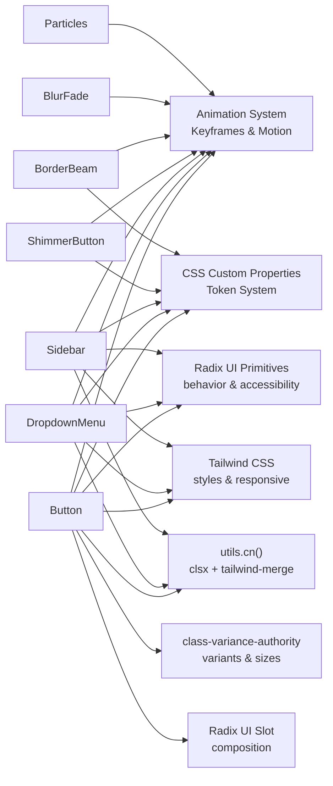
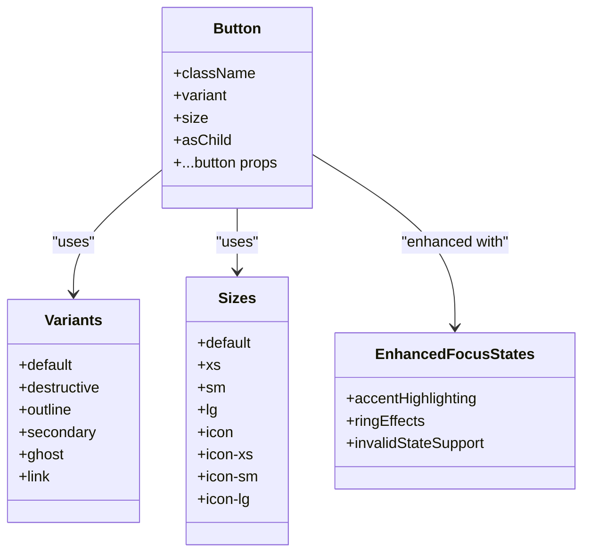
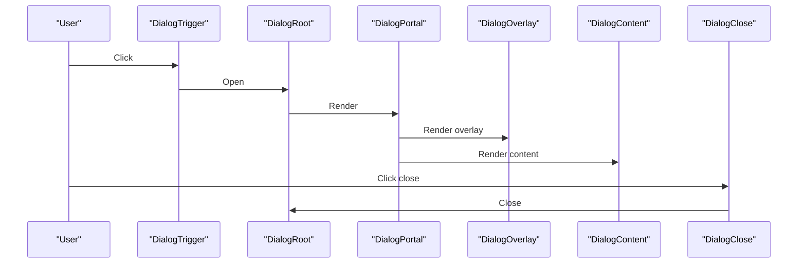
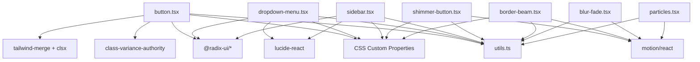

# UI Primitives Library

<cite>
**Referenced Files in This Document**
- [button.tsx](file://resources/js/components/ui/button.tsx)
- [input.tsx](file://resources/js/components/ui/input.tsx)
- [card.tsx](file://resources/js/components/ui/card.tsx)
- [table.tsx](file://resources/js/components/ui/table.tsx)
- [dialog.tsx](file://resources/js/components/ui/dialog.tsx)
- [dropdown-menu.tsx](file://resources/js/components/ui/dropdown-menu.tsx)
- [select.tsx](file://resources/js/components/ui/select.tsx)
- [textarea.tsx](file://resources/js/components/ui/textarea.tsx)
- [badge.tsx](file://resources/js/components/ui/badge.tsx)
- [avatar.tsx](file://resources/js/components/ui/avatar.tsx)
- [tabs.tsx](file://resources/js/components/ui/tabs.tsx)
- [sidebar.tsx](file://resources/js/components/ui/sidebar.tsx)
- [shimmer-button.tsx](file://resources/js/components/ui/shimmer-button.tsx)
- [border-beam.tsx](file://resources/js/components/ui/border-beam.tsx)
- [blur-fade.tsx](file://resources/js/components/ui/blur-fade.tsx)
- [particles.tsx](file://resources/js/components/ui/particles.tsx)
- [utils.ts](file://resources/js/lib/utils.ts)
- [app.css](file://resources/css/app.css)
</cite>

## Update Summary
**Changes Made**
- Added comprehensive token-driven theming system with CSS custom properties
- Introduced enhanced button variants with shimmer effects and accent highlighting
- Enhanced dropdown menu animations with sophisticated slide-in/out transitions
- Added advanced interactive elements including border beams, blur-fade effects, and particle systems
- Implemented comprehensive animation system with CSS keyframes and motion integration
- Enhanced focus states with improved ring highlighting and accent borders

## Table of Contents
1. [Introduction](#introduction)
2. [Project Structure](#project-structure)
3. [Core Components](#core-components)
4. [Architecture Overview](#architecture-overview)
5. [Enhanced Theming System](#enhanced-theming-system)
6. [Advanced Interactive Elements](#advanced-interactive-elements)
7. [Detailed Component Analysis](#detailed-component-analysis)
8. [Dependency Analysis](#dependency-analysis)
9. [Performance Considerations](#performance-considerations)
10. [Troubleshooting Guide](#troubleshooting-guide)
11. [Conclusion](#conclusion)
12. [Appendices](#appendices)

## Introduction
This document describes the UI Primitives Library built on Radix UI primitives and styled with Tailwind CSS. The library has been enhanced with a comprehensive token-driven theming system featuring CSS custom properties, animation-enabled interactive elements, and sophisticated focus states with accent highlighting. It covers the Button, Input, Card, Table, Dialog, Dropdown Menu, Select, Textarea, Badge, Avatar, Tabs, Sidebar, and newly enhanced components including ShimmerButton, BorderBeam, BlurFade, and Particles. For each component, we explain props, variants, sizes, styling options, accessibility features, composition patterns via slot components, and integration with class-variance-authority (CVA). Practical usage guidance, customization patterns, component states, event handling, and responsive design considerations are included, along with guidelines for extending components while maintaining design system consistency.

## Project Structure
The UI primitives live under resources/js/components/ui and are composed primarily with:
- Radix UI primitives for behavior and accessibility
- class-variance-authority for variant and size systems
- Tailwind CSS for styling and responsive design
- Radix UI Slot for flexible composition
- A shared cn utility that merges clsx and tailwind-merge
- Advanced animation system with CSS keyframes and motion integration
- Comprehensive CSS custom property token system

```mermaid
graph TB
subgraph "UI Primitives"
BTN["Button<br/>button.tsx"]
INP["Input<br/>input.tsx"]
CARD["Card<br/>card.tsx"]
TBL["Table<br/>table.tsx"]
DLG["Dialog<br/>dialog.tsx"]
DDM["DropdownMenu<br/>dropdown-menu.tsx"]
SEL["Select<br/>select.tsx"]
TXT["Textarea<br/>textarea.tsx"]
BAD["Badge<br/>badge.tsx"]
AVA["Avatar<br/>avatar.tsx"]
TABS["Tabs<br/>tabs.tsx"]
SB["Sidebar<br/>sidebar.tsx"]
SHIMMER["ShimmerButton<br/>shimmer-button.tsx"]
BEAM["BorderBeam<br/>border-beam.tsx"]
BLUR["BlurFade<br/>blur-fade.tsx"]
PARTICLES["Particles<br/>particles.tsx"]
end
THEME["CSS Theme<br/>app.css"]
TOKENS["Token System<br/>Custom Properties"]
ANIM["Animation System<br/>Keyframes & Motion"]
U["Utils<br/>utils.ts"]
BTN --> U
INP --> U
CARD --> U
TBL --> U
DLG --> U
DDM --> U
SEL --> U
TXT --> U
BAD --> U
AVA --> U
TABS --> U
SB --> U
SHIMMER --> U
BEAM --> U
BLUR --> U
PARTICLES --> U
THEME --> TOKENS
THEME --> ANIM
```



**Diagram sources**
- [button.tsx:1-65](file://resources/js/components/ui/button.tsx#L1-L65)
- [dropdown-menu.tsx:1-256](file://resources/js/components/ui/dropdown-menu.tsx#L1-L256)
- [sidebar.tsx:1-720](file://resources/js/components/ui/sidebar.tsx#L1-L720)
- [shimmer-button.tsx:1-97](file://resources/js/components/ui/shimmer-button.tsx#L1-L97)
- [border-beam.tsx:1-106](file://resources/js/components/ui/border-beam.tsx#L1-L106)
- [blur-fade.tsx:1-93](file://resources/js/components/ui/blur-fade.tsx#L1-L93)
- [particles.tsx:1-320](file://resources/js/components/ui/particles.tsx#L1-L320)
- [app.css:1-146](file://resources/css/app.css#L1-L146)
- [utils.ts:1-13](file://resources/js/lib/utils.ts#L1-L13)

**Section sources**
- [utils.ts:1-13](file://resources/js/lib/utils.ts#L1-L13)

## Core Components
This section summarizes the primary components and their capabilities, including the newly enhanced interactive elements.

- Button
  - Props: className, variant, size, asChild, plus native button attributes
  - Variants: default, destructive, outline, secondary, ghost, link
  - Sizes: default, xs, sm, lg, icon, icon-xs, icon-sm, icon-lg
  - Accessibility: focus-visible ring, disabled states, aria-invalid support
  - Composition: asChild leverages Radix Slot for semantic tag switching
  - **Enhanced**: Improved focus states with accent highlighting and enhanced ring effects

- Input
  - Props: className, type, plus native input attributes
  - Focus and invalid states with ring and color transitions
  - Responsive text sizing and placeholder styles

- Card
  - Composite: Card, CardHeader, CardTitle, CardDescription, CardContent, CardFooter
  - Props: className for each part
  - Semantic grouping and consistent spacing

- Table
  - Composite: Table container, TableHeader, TableBody, TableFooter, TableRow, TableHead, TableCell, TableCaption
  - Responsive horizontal scrolling container
  - Hover and selected states, checkbox alignment helpers

- Dialog
  - Root, Trigger, Portal, Close, Overlay, Content, Header, Footer, Title, Description
  - Animations and focus trapping via Radix Dialog
  - Accessible close button with screen reader label

- Dropdown Menu
  - Root, Portal, Trigger, Content, Group, Label, Item (with inset and variant), CheckboxItem, RadioGroup, RadioItem, Separator, Shortcut, Sub, SubTrigger, SubContent
  - Supports nested submenus, indicators, and inset labels
  - Focus and disabled states
  - **Enhanced**: Sophisticated slide-in/out animations with fade and zoom transitions

- Select
  - Root, Group, Value, Trigger (with size), Content (position, side, align, offset), Label, Item, Separator, ScrollUp/Down buttons
  - Popper positioning and viewport sizing
  - Icons and item indicators

- Textarea
  - Props: className, plus native textarea attributes
  - Focus ring and disabled states

- Badge
  - Props: className, variant, asChild
  - Variants: default, secondary, destructive, outline

- Avatar
  - Root, Image, Fallback
  - Primitive wrapper around Radix Avatar

- Tabs
  - Root, List (with variant), Trigger, Content
  - Orientation support and line-style variant
  - Active state styling and focus-visible rings

- Sidebar
  - Provider, Sidebar, Trigger, Rail, Inset, Header/Footer/Content, Input, Separator
  - Groups, Menu, MenuItem, MenuButton, MenuAction, MenuBadge, MenuSkeleton, MenuSub, MenuSubItem, MenuSubButton
  - Collapsible modes (offcanvas, icon, none), variants (sidebar, floating, inset), keyboard shortcut, cookies persistence, responsive behavior
  - **Enhanced**: Token-driven theming with CSS custom properties for consistent styling

- **New**: ShimmerButton
  - Animated shimmer effect with configurable colors, duration, and size
  - CSS custom properties for dynamic theming
  - Interactive hover and active states with highlight effects

- **New**: BorderBeam
  - Animated border gradient with configurable colors and animation parameters
  - Motion-based animation system for smooth transitions
  - Configurable size, duration, delay, and direction

- **New**: BlurFade
  - Smooth blur and fade animations with configurable direction and timing
  - Intersection Observer integration for scroll-triggered animations
  - Motion-based animation system with custom easing

- **New**: Particles
  - Canvas-based particle system with mouse interaction
  - Configurable particle count, size, speed, and color
  - Physics-based animation with collision detection

**Section sources**
- [button.tsx:1-65](file://resources/js/components/ui/button.tsx#L1-L65)
- [input.tsx:1-22](file://resources/js/components/ui/input.tsx#L1-L22)
- [card.tsx:1-69](file://resources/js/components/ui/card.tsx#L1-L69)
- [table.tsx:1-115](file://resources/js/components/ui/table.tsx#L1-L115)
- [dialog.tsx:1-134](file://resources/js/components/ui/dialog.tsx#L1-L134)
- [dropdown-menu.tsx:1-256](file://resources/js/components/ui/dropdown-menu.tsx#L1-L256)
- [select.tsx:1-194](file://resources/js/components/ui/select.tsx#L1-L194)
- [textarea.tsx:1-25](file://resources/js/components/ui/textarea.tsx#L1-L25)
- [badge.tsx:1-47](file://resources/js/components/ui/badge.tsx#L1-L47)
- [avatar.tsx:1-52](file://resources/js/components/ui/avatar.tsx#L1-L52)
- [tabs.tsx:1-92](file://resources/js/components/ui/tabs.tsx#L1-L92)
- [sidebar.tsx:1-720](file://resources/js/components/ui/sidebar.tsx#L1-L720)
- [shimmer-button.tsx:1-97](file://resources/js/components/ui/shimmer-button.tsx#L1-L97)
- [border-beam.tsx:1-106](file://resources/js/components/ui/border-beam.tsx#L1-L106)
- [blur-fade.tsx:1-93](file://resources/js/components/ui/blur-fade.tsx#L1-L93)
- [particles.tsx:1-320](file://resources/js/components/ui/particles.tsx#L1-L320)

## Architecture Overview
The library follows a consistent pattern with enhanced theming and animation capabilities:
- Each component wraps a Radix primitive or HTML element
- CVA defines variants and sizes for consistent styling
- Slot enables composition by allowing the rendered element to be customized
- cn utility merges classes safely with Tailwind CSS
- **Enhanced**: CSS custom properties provide token-driven theming across all components
- **Enhanced**: Animation system with CSS keyframes and motion integration for smooth transitions
- **Enhanced**: Comprehensive focus states with accent highlighting and improved visual feedback



**Diagram sources**
- [button.tsx:1-65](file://resources/js/components/ui/button.tsx#L1-L65)
- [dropdown-menu.tsx:1-256](file://resources/js/components/ui/dropdown-menu.tsx#L1-L256)
- [sidebar.tsx:1-720](file://resources/js/components/ui/sidebar.tsx#L1-L720)
- [shimmer-button.tsx:1-97](file://resources/js/components/ui/shimmer-button.tsx#L1-L97)
- [border-beam.tsx:1-106](file://resources/js/components/ui/border-beam.tsx#L1-L106)
- [blur-fade.tsx:1-93](file://resources/js/components/ui/blur-fade.tsx#L1-L93)
- [particles.tsx:1-320](file://resources/js/components/ui/particles.tsx#L1-L320)
- [app.css:1-146](file://resources/css/app.css#L1-L146)
- [utils.ts:1-13](file://resources/js/lib/utils.ts#L1-L13)

## Enhanced Theming System
The library now features a comprehensive token-driven theming system with CSS custom properties that provide consistent styling across all components.

### CSS Custom Properties
The theme system defines comprehensive color tokens for all component variants:

- **Base Colors**: background, foreground, card, popover, primary, secondary, muted, accent, destructive, border, input, ring
- **Component-Specific Colors**: sidebar colors (sidebar, sidebar-foreground, sidebar-primary, sidebar-accent, sidebar-border, sidebar-ring)
- **Chart Colors**: chart-1 through chart-5 for data visualization
- **Brand Colors**: gold, orange, green-dark for specific design elements
- **Typography**: font-sans with Instrument Sans as the primary font family
- **Border Radius**: radius-lg, radius-md, radius-sm with dynamic radius values

### Theme Configuration
The CSS theme configuration establishes the foundation for the entire design system:

```css
:root {
  --background: oklch(0.99 0.002 155);
  --foreground: oklch(0.15 0.02 155);
  --card: oklch(1 0 0);
  --popover: oklch(1 0 0);
  --primary: oklch(0.32 0.10 155);
  --primary-foreground: oklch(0.98 0 0);
  --secondary: oklch(0.95 0.02 155);
  --secondary-foreground: oklch(0.25 0.05 60);
  --muted: oklch(0.96 0.01 155);
  --muted-foreground: oklch(0.50 0.02 155);
  --accent: oklch(0.72 0.16 75);
  --accent-foreground: oklch(0.25 0.05 60);
  --destructive: oklch(0.577 0.245 27.325);
  --destructive-foreground: oklch(0.98 0 0);
  --border: oklch(0.90 0.02 155);
  --input: oklch(0.90 0.02 155);
  --ring: oklch(0.50 0.10 155);
  --chart-1: oklch(0.45 0.12 155);
  --chart-2: oklch(0.72 0.16 75);
  --chart-3: oklch(0.65 0.18 55);
  --chart-4: oklch(0.50 0.10 195);
  --chart-5: oklch(0.55 0.10 40);
  --radius: 0.625rem;
  --sidebar: oklch(0.18 0.06 155);
  --sidebar-foreground: oklch(0.92 0.02 155);
  --sidebar-primary: oklch(0.78 0.15 80);
  --sidebar-primary-foreground: oklch(0.18 0.06 155);
  --sidebar-accent: oklch(0.25 0.07 155);
  --sidebar-accent-foreground: oklch(0.92 0.02 155);
  --sidebar-border: oklch(0.28 0.06 155);
  --sidebar-ring: oklch(0.50 0.10 155);
  --gold: oklch(0.72 0.16 75);
  --orange: oklch(0.65 0.18 55);
  --green-dark: oklch(0.18 0.06 155);
}
```

### Animation System
The theme includes comprehensive animation keyframes for enhanced interactive elements:

```css
@theme inline {
  --animate-shimmer-slide: shimmer-slide var(--speed) ease-in-out infinite alternate;
  --animate-spin-around: spin-around calc(var(--speed) * 2) infinite linear;
  
  @keyframes shimmer-slide {
    to {
      transform: translate(calc(100cqw - 100%), 0);
    }
  }
  
  @keyframes spin-around {
    0% { transform: translateZ(0) rotate(0); }
    15%, 35% { transform: translateZ(0) rotate(90deg); }
    65%, 85% { transform: translateZ(0) rotate(270deg); }
    100% { transform: translateZ(0) rotate(360deg); }
  }
}
```

**Section sources**
- [app.css:1-146](file://resources/css/app.css#L1-L146)

## Advanced Interactive Elements
The library now includes several advanced interactive elements that leverage the enhanced animation system and token-driven theming.

### ShimmerButton
A sophisticated animated button with shimmer effects and configurable parameters:

- **Props**: shimmerColor, shimmerSize, borderRadius, shimmerDuration, background, className, children
- **Features**: CSS custom properties for dynamic theming, conic gradient animation, highlight effects
- **Interactive States**: hover, active, focus states with smooth transitions
- **Animation**: Conic gradient rotation with configurable speed and spread

### BorderBeam
Animated border gradient with configurable colors and animation parameters:

- **Props**: size, duration, delay, colorFrom, colorTo, transition, className, style, reverse, initialOffset, borderWidth
- **Features**: Motion-based animation system, configurable animation direction and timing
- **Visual Effects**: Linear gradient border with smooth animation loops
- **Integration**: Works seamlessly with other UI components for decorative borders

### BlurFade
Smooth blur and fade animations with configurable direction and timing:

- **Props**: variant, duration, delay, offset, direction, inView, inViewMargin, blur
- **Features**: Intersection Observer integration, scroll-triggered animations
- **Motion System**: Custom easing and transition timing
- **Variants**: Up to four directions (up, down, left, right) with blur transitions

### Particles
Canvas-based particle system with mouse interaction and physics:

- **Props**: quantity, staticity, ease, size, refresh, color, vx, vy
- **Features**: Physics-based animation, collision detection, mouse interaction
- **Performance**: Optimized canvas rendering with requestAnimationFrame
- **Customization**: Configurable particle count, size, speed, and color

**Section sources**
- [shimmer-button.tsx:1-97](file://resources/js/components/ui/shimmer-button.tsx#L1-L97)
- [border-beam.tsx:1-106](file://resources/js/components/ui/border-beam.tsx#L1-L106)
- [blur-fade.tsx:1-93](file://resources/js/components/ui/blur-fade.tsx#L1-L93)
- [particles.tsx:1-320](file://resources/js/components/ui/particles.tsx#L1-L320)

## Detailed Component Analysis

### Button
- Purpose: Base interactive control with variant and size system and enhanced focus states
- Props
  - className: Additional Tailwind classes
  - variant: default | destructive | outline | secondary | ghost | link
  - size: default | xs | sm | lg | icon | icon-xs | icon-sm | icon-lg
  - asChild: Render underlying element via Slot
  - All other button attributes pass through
- Styling
  - Uses CVA with default variant and size
  - **Enhanced**: Improved focus-visible ring with accent highlighting and ring effects
  - Disabled states, aria-invalid states with enhanced visual feedback
  - SVG sizing helpers for icon variants
- Accessibility
  - Inherits button semantics; supports aria-invalid
- Composition
  - asChild allows rendering as a link, span, or other element



**Diagram sources**
- [button.tsx:7-39](file://resources/js/components/ui/button.tsx#L7-L39)

**Section sources**
- [button.tsx:1-65](file://resources/js/components/ui/button.tsx#L1-L65)

### Input
- Purpose: Text input with consistent focus and invalid states
- Props
  - className
  - type: input type
  - All other input attributes pass through
- Styling
  - Border, background, placeholder, selection, focus ring
  - Disabled and aria-invalid states
- Accessibility
  - Inherits input semantics; supports aria-invalid

**Section sources**
- [input.tsx:1-22](file://resources/js/components/ui/input.tsx#L1-L22)

### Card
- Purpose: Semantic card container with header/title/description/content/footer parts
- Props
  - Card: className
  - CardHeader/CardTitle/CardDescription/CardContent/CardFooter: className
- Styling
  - Consistent spacing, rounded corners, border, shadow
- Composition
  - Intended to be composed together for coherent layouts

**Section sources**
- [card.tsx:1-69](file://resources/js/components/ui/card.tsx#L1-L69)

### Table
- Purpose: Structured data presentation with responsive container
- Props
  - Table/TableHeader/TableBody/TableFooter/TableRow/TableHead/TableCell/TableCaption: className
- Styling
  - Container with horizontal scroll
  - Hover and selected states on rows
  - Checkbox alignment helpers for role=checkbox columns
- Accessibility
  - Semantic table structure

**Section sources**
- [table.tsx:1-115](file://resources/js/components/ui/table.tsx#L1-L115)

### Dialog
- Purpose: Modal overlay with focus management and animations
- Props
  - Dialog: root props
  - DialogTrigger/DialogPortal/DialogClose: primitive props
  - DialogOverlay/DialogContent: className + primitive props
  - DialogHeader/DialogFooter: className
  - DialogTitle/DialogDescription: className + primitive props
- Styling
  - Overlay fade, centered content, close button with icon and sr-only label
  - Animations for open/close
- Accessibility
  - Focus trap, portal rendering, screen reader labels



**Diagram sources**
- [dialog.tsx:1-134](file://resources/js/components/ui/dialog.tsx#L1-L134)

**Section sources**
- [dialog.tsx:1-134](file://resources/js/components/ui/dialog.tsx#L1-L134)

### Dropdown Menu
- Purpose: Flexible menu with groups, items, checkboxes, radios, separators, and submenus
- Props
  - Root/Portal/Trigger/Content: primitive props
  - Group/Label: className + primitive props
  - Item: className + inset + variant ("default" | "destructive")
  - CheckboxItem/RadioItem: checked + children
  - Separator/Shortcut/Sub/SubTrigger/SubContent: className + primitive props
- Styling
  - Focus states, disabled states, indicators, inset labels
  - **Enhanced**: Sophisticated slide-in/out animations with fade and zoom transitions
  - Side-aware animations with different entry/exit effects
- Accessibility
  - Keyboard navigation, focus management, ARIA roles

**Section sources**
- [dropdown-menu.tsx:1-256](file://resources/js/components/ui/dropdown-menu.tsx#L1-L256)

### Select
- Purpose: Single/multi-selection control with trigger, content, and items
- Props
  - Root/Group/Value: primitive props
  - Trigger: className + size ("sm" | "default")
  - Content: className + position ("popper") + side/align/offset + primitive props
  - Label/Item/Separator: className + primitive props
  - ScrollUp/Down buttons: className + primitive props
- Styling
  - Popper positioning, viewport sizing, icons, indicators
- Accessibility
  - Keyboard navigation, scroll buttons, ARIA

**Section sources**
- [select.tsx:1-194](file://resources/js/components/ui/select.tsx#L1-L194)

### Textarea
- Purpose: Multi-line text input with focus and disabled states
- Props
  - className
  - All textarea attributes pass through
- Styling
  - Focus ring, disabled opacity

**Section sources**
- [textarea.tsx:1-25](file://resources/js/components/ui/textarea.tsx#L1-L25)

### Badge
- Purpose: Small status or informational label
- Props
  - className
  - variant: default | secondary | destructive | outline
  - asChild
- Styling
  - CVA variants, focus-visible ring, aria-invalid states
- Composition
  - asChild for semantic wrappers

**Section sources**
- [badge.tsx:1-47](file://resources/js/components/ui/badge.tsx#L1-L47)

### Avatar
- Purpose: User identity with image and fallback
- Props
  - Avatar: primitive props
  - AvatarImage/AvatarFallback: className + primitive props
- Styling
  - Circular container, fallback visuals

**Section sources**
- [avatar.tsx:1-52](file://resources/js/components/ui/avatar.tsx#L1-L52)

### Tabs
- Purpose: Organize content into selectable sections
- Props
  - Tabs: className + orientation ("horizontal" | "vertical")
  - TabsList: className + variant ("default" | "line")
  - TabsTrigger: className
  - TabsContent: className
- Styling
  - Line variant highlights active state with pseudo-elements
  - Focus-visible ring, disabled states
- Accessibility
  - Radix Tabs behavior with proper ARIA

**Section sources**
- [tabs.tsx:1-92](file://resources/js/components/ui/tabs.tsx#L1-L92)

### Sidebar
- Purpose: Navigation sidebar with collapsible behavior, responsive modes, and rich menu system
- Props
  - SidebarProvider: defaultOpen, open, onOpenChange, className, style, children
  - Sidebar: side ("left" | "right"), variant ("sidebar" | "floating" | "inset"), collapsible ("offcanvas" | "icon" | "none"), className, children
  - SidebarTrigger/SidebarRail/SidebarInset: className + primitive props
  - SidebarHeader/Footer/Content/Input/Separator: className + primitive props
  - SidebarGroup/Label/Action/Content: className + asChild
  - SidebarMenu/Item/Button/Action/Badge/Skeleton/Sub/SubItem/SubButton: className + various props
  - SidebarMenuButton: asChild, isActive, variant ("default" | "outline"), size ("default" | "sm" | "lg"), tooltip
- Styling
  - **Enhanced**: CSS custom properties for widths, consistent theming across all variants
  - Token-driven styling with sidebar-specific color tokens
  - Collapsible transforms, rail resize cursors, inset adjustments
- Behavior
  - Cookie persistence for expanded/collapsed state
  - Keyboard shortcut (Ctrl/Cmd + B) to toggle
  - Mobile offcanvas via Sheet
- Accessibility
  - Proper labeling and focus management


**Diagram sources**
- [sidebar.tsx:54-247](file://resources/js/components/ui/sidebar.tsx#L54-L247)

**Section sources**
- [sidebar.tsx:1-720](file://resources/js/components/ui/sidebar.tsx#L1-L720)

### ShimmerButton
- Purpose: Animated button with shimmer effects and configurable parameters
- Props
  - shimmerColor: Color of the shimmer effect (default: "#ffffff")
  - shimmerSize: Size of the shimmer strip (default: "0.05em")
  - shimmerDuration: Animation duration (default: "3s")
  - borderRadius: Button border radius (default: "100px")
  - background: Background color (default: "rgba(0, 0, 0, 1)")
  - className: Additional CSS classes
  - children: Button content
- Styling
  - **Enhanced**: CSS custom properties for dynamic theming
  - Conic gradient animation with configurable spread and color
  - Highlight effects with inset shadows for depth perception
  - Interactive hover and active states with smooth transitions
- Animation
  - Conic gradient rotation animation
  - Spark animation with spin-around effect
  - Smooth transitions between states

**Section sources**
- [shimmer-button.tsx:1-97](file://resources/js/components/ui/shimmer-button.tsx#L1-L97)

### BorderBeam
- Purpose: Animated border gradient with configurable parameters
- Props
  - size: Size of the border beam (default: 50)
  - duration: Animation duration (default: 6)
  - delay: Animation delay (default: 0)
  - colorFrom: Starting color (default: "#ffaa40")
  - colorTo: Ending color (default: "#9c40ff")
  - transition: Motion transition configuration
  - className: Additional CSS classes
  - style: Inline styles
  - reverse: Reverse animation direction (default: false)
  - initialOffset: Initial animation offset (default: 0)
  - borderWidth: Border width (default: 1)
- Styling
  - **Enhanced**: Motion-based animation system for smooth transitions
  - Linear gradient border with configurable colors
  - Mask-based clipping for precise border rendering
- Animation
  - Infinite linear animation loop
  - Configurable direction and timing
  - Offset-based animation paths

**Section sources**
- [border-beam.tsx:1-106](file://resources/js/components/ui/border-beam.tsx#L1-L106)

### BlurFade
- Purpose: Smooth blur and fade animations with configurable parameters
- Props
  - variant: Animation variants with custom positions and opacity
  - duration: Animation duration (default: 0.4)
  - delay: Animation delay (default: 0)
  - offset: Distance offset for movement (default: 6)
  - direction: Animation direction (default: "down")
  - inView: Force visibility state
  - inViewMargin: Intersection Observer margin (default: "-50px")
  - blur: Blur intensity (default: "6px")
  - className: Additional CSS classes
  - children: Animated content
- Styling
  - **Enhanced**: Motion-based animation system with custom easing
  - Intersection Observer integration for scroll-triggered animations
  - Configurable blur transitions for smooth visual effects
- Animation
  - Directional movement with blur transitions
  - Custom easing and timing configurations
  - Filter-based animations for performance optimization

**Section sources**
- [blur-fade.tsx:1-93](file://resources/js/components/ui/blur-fade.tsx#L1-L93)

### Particles
- Purpose: Canvas-based particle system with mouse interaction
- Props
  - quantity: Number of particles (default: 100)
  - staticity: Particle staticness factor (default: 50)
  - ease: Animation ease factor (default: 50)
  - size: Particle size (default: 0.4)
  - refresh: Force canvas refresh (default: false)
  - color: Particle color (default: "#ffffff")
  - vx: Horizontal velocity (default: 0)
  - vy: Vertical velocity (default: 0)
  - className: Additional CSS classes
- Styling
  - **Enhanced**: Physics-based animation with collision detection
  - Mouse interaction with magnetic attraction
  - Optimized canvas rendering with requestAnimationFrame
- Animation
  - Physics-based particle movement
  - Collision detection and boundary handling
  - Dynamic alpha blending near boundaries

**Section sources**
- [particles.tsx:1-320](file://resources/js/components/ui/particles.tsx#L1-L320)

## Dependency Analysis
- Internal dependencies
  - All components depend on the shared cn utility for safe class merging
  - Many components depend on Radix UI primitives for behavior and accessibility
  - Button, Badge, Tabs, and Sidebar define CVA variants for consistent styling
  - **Enhanced**: New components rely on motion/react for advanced animations
  - **Enhanced**: All components integrate with the CSS custom property token system
- External dependencies
  - class-variance-authority for variant/size systems
  - radix-ui packages for primitives
  - lucide-react for icons
  - tailwind-merge and clsx for class merging
  - **Enhanced**: motion/react for advanced animation capabilities
  - **Enhanced**: CSS custom properties for token-driven theming



**Diagram sources**
- [button.tsx:1-65](file://resources/js/components/ui/button.tsx#L1-L65)
- [dropdown-menu.tsx:1-256](file://resources/js/components/ui/dropdown-menu.tsx#L1-L256)
- [sidebar.tsx:1-720](file://resources/js/components/ui/sidebar.tsx#L1-L720)
- [shimmer-button.tsx:1-97](file://resources/js/components/ui/shimmer-button.tsx#L1-L97)
- [border-beam.tsx:1-106](file://resources/js/components/ui/border-beam.tsx#L1-L106)
- [blur-fade.tsx:1-93](file://resources/js/components/ui/blur-fade.tsx#L1-L93)
- [particles.tsx:1-320](file://resources/js/components/ui/particles.tsx#L1-L320)
- [utils.ts:1-13](file://resources/js/lib/utils.ts#L1-L13)

**Section sources**
- [utils.ts:1-13](file://resources/js/lib/utils.ts#L1-L13)

## Performance Considerations
- Prefer asChild patterns to avoid unnecessary DOM nodes and preserve semantics
- Use CVA variants and sizes to minimize conditional class logic
- Leverage CSS variables for sidebar widths and transitions to reduce reflows
- Keep heavy animations (Dialog/Dropdown/Select) enabled only when necessary
- Avoid excessive nesting in composite components (Card/Table/Tabs/Sidebar) to limit render cost
- **Enhanced**: Use CSS custom properties for efficient theming across components
- **Enhanced**: Optimize animation performance with transform-based effects
- **Enhanced**: Implement lazy loading for complex interactive elements like particles
- **Enhanced**: Utilize Intersection Observer for scroll-triggered animations to reduce CPU usage

## Troubleshooting Guide
- Button disabled state not applying
  - Ensure disabled prop is passed; verify Tailwind utilities for disabled opacity and pointer-events
  - **Enhanced**: Check focus-visible ring and accent highlighting CSS custom properties
- Input focus ring not visible
  - Confirm focus-visible ring classes and ring color tokens are available in theme
- Dialog not closing on Escape
  - Ensure DialogClose is present and accessible; verify portal rendering
- Dropdown/Select items not aligned with icons
  - Use consistent icon sizes and ensure items include indicator slots
  - **Enhanced**: Verify animation keyframes are properly loaded for dropdown transitions
- Badge asChild not working
  - Confirm asChild is true and Slot is imported from radix-ui
- Sidebar not toggling on keyboard shortcut
  - Verify Ctrl/Cmd + B combination and that provider is mounted
- Sidebar collapsed state not persistent
  - Check cookie availability and expiration settings
- **New**: ShimmerButton animation not working
  - Ensure CSS custom properties are properly defined and animation keyframes are loaded
  - Verify motion/react dependencies are available
- **New**: BorderBeam not animating
  - Check motion configuration and ensure animation parameters are valid
  - Verify CSS custom properties for colors and dimensions
- **New**: BlurFade animation not triggering
  - Ensure Intersection Observer is supported and margin settings are appropriate
  - Check animation variants and transition configurations
- **New**: Particles performance issues
  - Adjust particle quantity and size parameters
  - Implement throttled resize handling and cleanup on component unmount

**Section sources**
- [button.tsx:1-65](file://resources/js/components/ui/button.tsx#L1-L65)
- [input.tsx:1-22](file://resources/js/components/ui/input.tsx#L1-L22)
- [dialog.tsx:1-134](file://resources/js/components/ui/dialog.tsx#L1-L134)
- [dropdown-menu.tsx:1-256](file://resources/js/components/ui/dropdown-menu.tsx#L1-L256)
- [select.tsx:1-194](file://resources/js/components/ui/select.tsx#L1-L194)
- [badge.tsx:1-47](file://resources/js/components/ui/badge.tsx#L1-L47)
- [sidebar.tsx:1-720](file://resources/js/components/ui/sidebar.tsx#L1-L720)
- [shimmer-button.tsx:1-97](file://resources/js/components/ui/shimmer-button.tsx#L1-L97)
- [border-beam.tsx:1-106](file://resources/js/components/ui/border-beam.tsx#L1-L106)
- [blur-fade.tsx:1-93](file://resources/js/components/ui/blur-fade.tsx#L1-L93)
- [particles.tsx:1-320](file://resources/js/components/ui/particles.tsx#L1-L320)

## Conclusion
The UI Primitives Library provides a cohesive set of accessible, composable, and customizable components built on Radix UI and styled with Tailwind CSS. The enhanced version now features comprehensive token-driven theming with CSS custom properties, sophisticated animation systems with CSS keyframes and motion integration, and advanced interactive elements including shimmer effects, border beams, blur-fade animations, and particle systems. The variant and size systems via class-variance-authority ensure consistent styling, while Slot and composite patterns enable flexible composition. The new animation capabilities and enhanced focus states provide improved user experience with smooth transitions and better visual feedback. Following the patterns outlined here will help maintain design system consistency and improve developer experience across the application.

## Appendices

### Prop Interfaces and Composition Patterns
- Button
  - Props: className, variant, size, asChild, button attributes
  - Composition: asChild -> Slot.Root
  - **Enhanced**: Focus states with accent highlighting and ring effects
- Badge
  - Props: className, variant, asChild
  - Composition: asChild -> Slot
- Card
  - Props: className per part
  - Composition: semantic grouping
- Table
  - Props: className per part
  - Composition: container + semantic table parts
- Dialog
  - Props: primitive + className per part
  - Composition: portal + overlay + content
- Dropdown Menu
  - Props: primitive + className per part
  - Composition: groups, items, submenus
  - **Enhanced**: Sophisticated animation system with slide-in/out effects
- Select
  - Props: primitive + className per part
  - Composition: trigger + content + items
- Textarea
  - Props: className, textarea attributes
- Avatar
  - Props: primitive + className per part
- Tabs
  - Props: primitive + className per part
- Sidebar
  - Props: extensive; see SidebarProvider, Sidebar, and subcomponents
  - Composition: provider + groups + menu + actions
  - **Enhanced**: Token-driven theming with CSS custom properties
- **New**: ShimmerButton
  - Props: shimmerColor, shimmerSize, borderRadius, shimmerDuration, background, className, children
  - Composition: button with animated effects
- **New**: BorderBeam
  - Props: size, duration, delay, colorFrom, colorTo, transition, className, style, reverse, initialOffset, borderWidth
  - Composition: decorative border with animation
- **New**: BlurFade
  - Props: variant, duration, delay, offset, direction, inView, inViewMargin, blur, className, children
  - Composition: animated content with intersection observer
- **New**: Particles
  - Props: quantity, staticity, ease, size, refresh, color, vx, vy, className
  - Composition: interactive particle system

**Section sources**
- [button.tsx:41-62](file://resources/js/components/ui/button.tsx#L41-L62)
- [badge.tsx:28-44](file://resources/js/components/ui/badge.tsx#L28-L44)
- [card.tsx:5-66](file://resources/js/components/ui/card.tsx#L5-L66)
- [table.tsx:5-103](file://resources/js/components/ui/table.tsx#L5-L103)
- [dialog.tsx:7-121](file://resources/js/components/ui/dialog.tsx#L7-L121)
- [dropdown-menu.tsx:7-255](file://resources/js/components/ui/dropdown-menu.tsx#L7-L255)
- [select.tsx:7-193](file://resources/js/components/ui/select.tsx#L7-L193)
- [textarea.tsx:5-21](file://resources/js/components/ui/textarea.tsx#L5-L21)
- [avatar.tsx:6-51](file://resources/js/components/ui/avatar.tsx#L6-L51)
- [tabs.tsx:9-91](file://resources/js/components/ui/tabs.tsx#L9-L91)
- [sidebar.tsx:54-719](file://resources/js/components/ui/sidebar.tsx#L54-L719)
- [shimmer-button.tsx:5-13](file://resources/js/components/ui/shimmer-button.tsx#L5-L13)
- [border-beam.tsx:5-50](file://resources/js/components/ui/border-beam.tsx#L5-L50)
- [blur-fade.tsx:13-27](file://resources/js/components/ui/blur-fade.tsx#L13-L27)
- [particles.tsx:36-46](file://resources/js/components/ui/particles.tsx#L36-L46)

### Customization Patterns
- Extend Button/Select/Tabs/Sidebar variants via CVA
- Override default classes using className prop
- Compose with asChild to wrap links or other elements
- Use data-slot attributes for targeted styling and testing
- Maintain responsive behavior by leveraging Tailwind breakpoints and component-specific responsive props
- **Enhanced**: Customize CSS custom properties for token-driven theming
- **Enhanced**: Configure animation parameters for interactive elements
- **Enhanced**: Adjust motion configurations for advanced animations
- **Enhanced**: Implement custom focus states with accent highlighting

**Section sources**
- [button.tsx:7-39](file://resources/js/components/ui/button.tsx#L7-L39)
- [select.tsx:25-49](file://resources/js/components/ui/select.tsx#L25-L49)
- [tabs.tsx:28-41](file://resources/js/components/ui/tabs.tsx#L28-L41)
- [sidebar.tsx:469-489](file://resources/js/components/ui/sidebar.tsx#L469-L489)
- [utils.ts:6-8](file://resources/js/lib/utils.ts#L6-L8)

### Enhanced Theming Configuration
- **CSS Custom Properties**: Define comprehensive color tokens for all component variants
- **Animation Keyframes**: Implement smooth transitions with CSS custom properties
- **Motion Integration**: Leverage motion/react for advanced animation capabilities
- **Token-Driven Styling**: Ensure consistent theming across all components using CSS variables
- **Focus State Enhancement**: Improve accessibility with accent highlighting and improved ring effects

**Section sources**
- [app.css:10-65](file://resources/css/app.css#L10-L65)
- [app.css:117-146](file://resources/css/app.css#L117-L146)
- [button.tsx:8](file://resources/js/components/ui/button.tsx#L8)
- [dropdown-menu.tsx:42-49](file://resources/js/components/ui/dropdown-menu.tsx#L42-L49)
- [sidebar.tsx:131-137](file://resources/js/components/ui/sidebar.tsx#L131-L137)