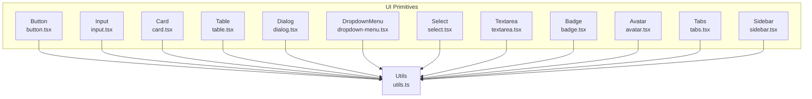
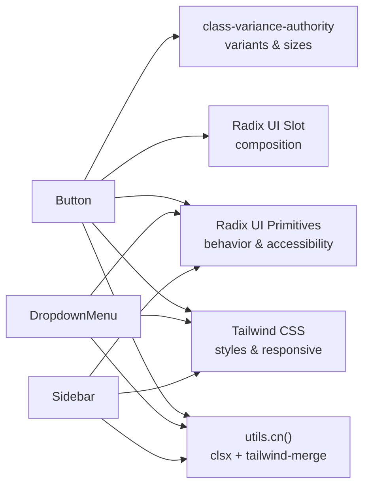
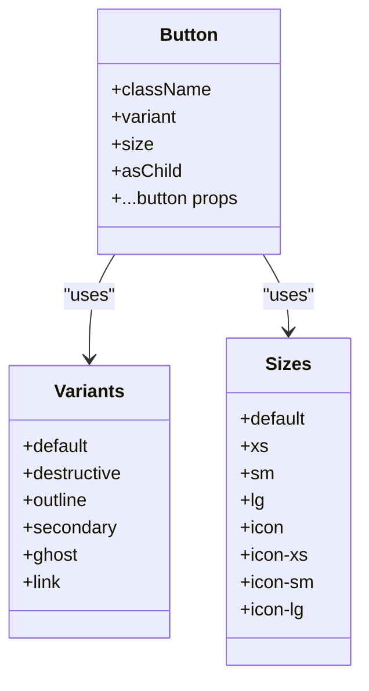
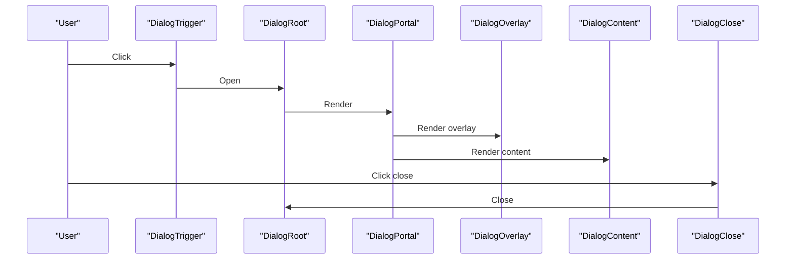
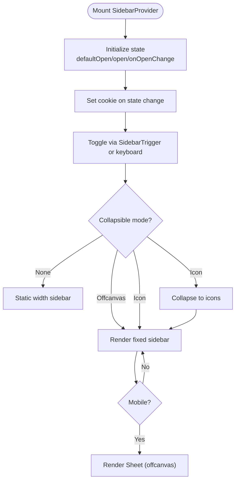
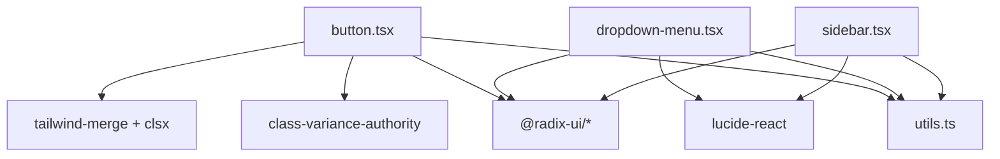

# UI Primitives Library

<cite>
**Referenced Files in This Document**
- [button.tsx](file://resources/js/components/ui/button.tsx)
- [input.tsx](file://resources/js/components/ui/input.tsx)
- [card.tsx](file://resources/js/components/ui/card.tsx)
- [table.tsx](file://resources/js/components/ui/table.tsx)
- [dialog.tsx](file://resources/js/components/ui/dialog.tsx)
- [dropdown-menu.tsx](file://resources/js/components/ui/dropdown-menu.tsx)
- [select.tsx](file://resources/js/components/ui/select.tsx)
- [textarea.tsx](file://resources/js/components/ui/textarea.tsx)
- [badge.tsx](file://resources/js/components/ui/badge.tsx)
- [avatar.tsx](file://resources/js/components/ui/avatar.tsx)
- [tabs.tsx](file://resources/js/components/ui/tabs.tsx)
- [sidebar.tsx](file://resources/js/components/ui/sidebar.tsx)
- [utils.ts](file://resources/js/lib/utils.ts)
</cite>

## Table of Contents
1. [Introduction](#introduction)
2. [Project Structure](#project-structure)
3. [Core Components](#core-components)
4. [Architecture Overview](#architecture-overview)
5. [Detailed Component Analysis](#detailed-component-analysis)
6. [Dependency Analysis](#dependency-analysis)
7. [Performance Considerations](#performance-considerations)
8. [Troubleshooting Guide](#troubleshooting-guide)
9. [Conclusion](#conclusion)
10. [Appendices](#appendices)

## Introduction
This document describes the UI Primitives Library built on Radix UI primitives and styled with Tailwind CSS. It covers the Button, Input, Card, Table, Dialog, Dropdown Menu, Select, Textarea, Badge, Avatar, Tabs, and Sidebar components. For each component, we explain props, variants, sizes, styling options, accessibility features, composition patterns via slot components, and integration with class-variance-authority (CVA). Practical usage guidance, customization patterns, component states, event handling, and responsive design considerations are included, along with guidelines for extending components while maintaining design system consistency.

## Project Structure
The UI primitives live under resources/js/components/ui and are composed primarily with:
- Radix UI primitives for behavior and accessibility
- class-variance-authority for variant and size systems
- Tailwind CSS for styling and responsive design
- Radix UI Slot for flexible composition
- A shared cn utility that merges clsx and tailwind-merge

**Diagram sources**
- [button.tsx:1-65](file://resources/js/components/ui/button.tsx#L1-L65)
- [input.tsx:1-22](file://resources/js/components/ui/input.tsx#L1-L22)
- [card.tsx:1-69](file://resources/js/components/ui/card.tsx#L1-L69)
- [table.tsx:1-115](file://resources/js/components/ui/table.tsx#L1-L115)
- [dialog.tsx:1-134](file://resources/js/components/ui/dialog.tsx#L1-L134)
- [dropdown-menu.tsx:1-256](file://resources/js/components/ui/dropdown-menu.tsx#L1-L256)
- [select.tsx:1-194](file://resources/js/components/ui/select.tsx#L1-L194)
- [textarea.tsx:1-25](file://resources/js/components/ui/textarea.tsx#L1-L25)
- [badge.tsx:1-47](file://resources/js/components/ui/badge.tsx#L1-L47)
- [avatar.tsx:1-52](file://resources/js/components/ui/avatar.tsx#L1-L52)
- [tabs.tsx:1-92](file://resources/js/components/ui/tabs.tsx#L1-L92)
- [sidebar.tsx:1-720](file://resources/js/components/ui/sidebar.tsx#L1-L720)
- [utils.ts:1-13](file://resources/js/lib/utils.ts#L1-L13)

**Section sources**
- [utils.ts:1-13](file://resources/js/lib/utils.ts#L1-L13)

## Core Components
This section summarizes the primary components and their capabilities.

- Button
  - Props: className, variant, size, asChild, plus native button attributes
  - Variants: default, destructive, outline, secondary, ghost, link
  - Sizes: default, xs, sm, lg, icon, icon-xs, icon-sm, icon-lg
  - Accessibility: focus-visible ring, disabled states, aria-invalid support
  - Composition: asChild leverages Radix Slot for semantic tag switching

- Input
  - Props: className, type, plus native input attributes
  - Focus and invalid states with ring and color transitions
  - Responsive text sizing and placeholder styles

- Card
  - Composite: Card, CardHeader, CardTitle, CardDescription, CardContent, CardFooter
  - Props: className for each part
  - Semantic grouping and consistent spacing

- Table
  - Composite: Table container, TableHeader, TableBody, TableFooter, TableRow, TableHead, TableCell, TableCaption
  - Responsive horizontal scrolling container
  - Hover and selected states, checkbox alignment helpers

- Dialog
  - Root, Trigger, Portal, Close, Overlay, Content, Header, Footer, Title, Description
  - Animations and focus trapping via Radix Dialog
  - Accessible close button with screen reader label

- Dropdown Menu
  - Root, Portal, Trigger, Content, Group, Label, Item (with inset and variant), CheckboxItem, RadioGroup, RadioItem, Separator, Shortcut, Sub, SubTrigger, SubContent
  - Supports nested submenus, indicators, and inset labels
  - Focus and disabled states

- Select
  - Root, Group, Value, Trigger (with size), Content (position, side, align, offset), Label, Item, Separator, ScrollUp/Down buttons
  - Popper positioning and viewport sizing
  - Icons and item indicators

- Textarea
  - Props: className, plus native textarea attributes
  - Focus ring and disabled states

- Badge
  - Props: className, variant, asChild
  - Variants: default, secondary, destructive, outline

- Avatar
  - Root, Image, Fallback
  - Primitive wrapper around Radix Avatar

- Tabs
  - Root, List (with variant), Trigger, Content
  - Orientation support and line-style variant
  - Active state styling and focus-visible rings

- Sidebar
  - Provider, Sidebar, Trigger, Rail, Inset, Header/Footer/Content, Input, Separator
  - Groups, Menu, MenuItem, MenuButton, MenuAction, MenuBadge, MenuSkeleton, MenuSub, MenuSubItem, MenuSubButton
  - Collapsible modes (offcanvas, icon, none), variants (sidebar, floating, inset), keyboard shortcut, cookies persistence, responsive behavior

**Section sources**
- [button.tsx:1-65](file://resources/js/components/ui/button.tsx#L1-L65)
- [input.tsx:1-22](file://resources/js/components/ui/input.tsx#L1-L22)
- [card.tsx:1-69](file://resources/js/components/ui/card.tsx#L1-L69)
- [table.tsx:1-115](file://resources/js/components/ui/table.tsx#L1-L115)
- [dialog.tsx:1-134](file://resources/js/components/ui/dialog.tsx#L1-L134)
- [dropdown-menu.tsx:1-256](file://resources/js/components/ui/dropdown-menu.tsx#L1-L256)
- [select.tsx:1-194](file://resources/js/components/ui/select.tsx#L1-L194)
- [textarea.tsx:1-25](file://resources/js/components/ui/textarea.tsx#L1-L25)
- [badge.tsx:1-47](file://resources/js/components/ui/badge.tsx#L1-L47)
- [avatar.tsx:1-52](file://resources/js/components/ui/avatar.tsx#L1-L52)
- [tabs.tsx:1-92](file://resources/js/components/ui/tabs.tsx#L1-L92)
- [sidebar.tsx:1-720](file://resources/js/components/ui/sidebar.tsx#L1-L720)

## Architecture Overview
The library follows a consistent pattern:
- Each component wraps a Radix primitive or HTML element
- CVA defines variants and sizes for consistent styling
- Slot enables composition by allowing the rendered element to be customized
- cn utility merges classes safely with Tailwind CSS

**Diagram sources**
- [button.tsx:1-65](file://resources/js/components/ui/button.tsx#L1-L65)
- [dropdown-menu.tsx:1-256](file://resources/js/components/ui/dropdown-menu.tsx#L1-L256)
- [sidebar.tsx:1-720](file://resources/js/components/ui/sidebar.tsx#L1-L720)
- [utils.ts:1-13](file://resources/js/lib/utils.ts#L1-L13)

## Detailed Component Analysis

### Button
- Purpose: Base interactive control with variant and size system
- Props
  - className: Additional Tailwind classes
  - variant: default | destructive | outline | secondary | ghost | link
  - size: default | xs | sm | lg | icon | icon-xs | icon-sm | icon-lg
  - asChild: Render underlying element via Slot
  - All other button attributes pass through
- Styling
  - Uses CVA with default variant and size
  - Focus-visible ring, disabled states, aria-invalid states
  - SVG sizing helpers for icon variants
- Accessibility
  - Inherits button semantics; supports aria-invalid
- Composition
  - asChild allows rendering as a link, span, or other element

**Diagram sources**
- [button.tsx:7-39](file://resources/js/components/ui/button.tsx#L7-L39)

**Section sources**
- [button.tsx:1-65](file://resources/js/components/ui/button.tsx#L1-L65)

### Input
- Purpose: Text input with consistent focus and invalid states
- Props
  - className
  - type: input type
  - All other input attributes pass through
- Styling
  - Border, background, placeholder, selection, focus ring
  - Disabled and aria-invalid states
- Accessibility
  - Inherits input semantics; supports aria-invalid

**Section sources**
- [input.tsx:1-22](file://resources/js/components/ui/input.tsx#L1-L22)

### Card
- Purpose: Semantic card container with header/title/description/content/footer parts
- Props
  - Card: className
  - CardHeader/CardTitle/CardDescription/CardContent/CardFooter: className
- Styling
  - Consistent spacing, rounded corners, border, shadow
- Composition
  - Intended to be composed together for coherent layouts

**Section sources**
- [card.tsx:1-69](file://resources/js/components/ui/card.tsx#L1-L69)

### Table
- Purpose: Structured data presentation with responsive container
- Props
  - Table/TableHeader/TableBody/TableFooter/TableRow/TableHead/TableCell/TableCaption: className
- Styling
  - Container with horizontal scroll
  - Hover and selected states on rows
  - Checkbox alignment helpers for role=checkbox columns
- Accessibility
  - Semantic table structure

**Section sources**
- [table.tsx:1-115](file://resources/js/components/ui/table.tsx#L1-L115)

### Dialog
- Purpose: Modal overlay with focus management and animations
- Props
  - Dialog: root props
  - DialogTrigger/DialogPortal/DialogClose: primitive props
  - DialogOverlay/DialogContent: className + primitive props
  - DialogHeader/DialogFooter: className
  - DialogTitle/DialogDescription: className + primitive props
- Styling
  - Overlay fade, centered content, close button with icon and sr-only label
  - Animations for open/close
- Accessibility
  - Focus trap, portal rendering, screen reader labels

**Diagram sources**
- [dialog.tsx:1-134](file://resources/js/components/ui/dialog.tsx#L1-L134)

**Section sources**
- [dialog.tsx:1-134](file://resources/js/components/ui/dialog.tsx#L1-L134)

### Dropdown Menu
- Purpose: Flexible menu with groups, items, checkboxes, radios, separators, and submenus
- Props
  - Root/Portal/Trigger/Content: primitive props
  - Group/Label: className + primitive props
  - Item: className + inset + variant ("default" | "destructive")
  - CheckboxItem/RadioItem: checked + children
  - Separator/Shortcut/Sub/SubTrigger/SubContent: className + primitive props
- Styling
  - Focus states, disabled states, indicators, inset labels
  - Side-aware slide-in animations
- Accessibility
  - Keyboard navigation, focus management, ARIA roles

**Section sources**
- [dropdown-menu.tsx:1-256](file://resources/js/components/ui/dropdown-menu.tsx#L1-L256)

### Select
- Purpose: Single/multi-selection control with trigger, content, and items
- Props
  - Root/Group/Value: primitive props
  - Trigger: className + size ("sm" | "default")
  - Content: className + position ("popper") + side/align/offset + primitive props
  - Label/Item/Separator: className + primitive props
  - ScrollUp/Down buttons: className + primitive props
- Styling
  - Popper positioning, viewport sizing, icons, indicators
- Accessibility
  - Keyboard navigation, scroll buttons, ARIA

**Section sources**
- [select.tsx:1-194](file://resources/js/components/ui/select.tsx#L1-L194)

### Textarea
- Purpose: Multi-line text input with focus and disabled states
- Props
  - className
  - All textarea attributes pass through
- Styling
  - Focus ring, disabled opacity

**Section sources**
- [textarea.tsx:1-25](file://resources/js/components/ui/textarea.tsx#L1-L25)

### Badge
- Purpose: Small status or informational label
- Props
  - className
  - variant: default | secondary | destructive | outline
  - asChild
- Styling
  - CVA variants, focus-visible ring, aria-invalid states
- Composition
  - asChild for semantic wrappers

**Section sources**
- [badge.tsx:1-47](file://resources/js/components/ui/badge.tsx#L1-L47)

### Avatar
- Purpose: User identity with image and fallback
- Props
  - Avatar: primitive props
  - AvatarImage/AvatarFallback: className + primitive props
- Styling
  - Circular container, fallback visuals

**Section sources**
- [avatar.tsx:1-52](file://resources/js/components/ui/avatar.tsx#L1-L52)

### Tabs
- Purpose: Organize content into selectable sections
- Props
  - Tabs: className + orientation ("horizontal" | "vertical")
  - TabsList: className + variant ("default" | "line")
  - TabsTrigger: className
  - TabsContent: className
- Styling
  - Line variant highlights active state with pseudo-elements
  - Focus-visible ring, disabled states
- Accessibility
  - Radix Tabs behavior with proper ARIA

**Section sources**
- [tabs.tsx:1-92](file://resources/js/components/ui/tabs.tsx#L1-L92)

### Sidebar
- Purpose: Navigation sidebar with collapsible behavior, responsive modes, and rich menu system
- Props
  - SidebarProvider: defaultOpen, open, onOpenChange, className, style, children
  - Sidebar: side ("left" | "right"), variant ("sidebar" | "floating" | "inset"), collapsible ("offcanvas" | "icon" | "none"), className, children
  - SidebarTrigger/SidebarRail/SidebarInset: className + primitive props
  - SidebarHeader/Footer/Content/Input/Separator: className + primitive props
  - SidebarGroup/Label/Action/Content: className + asChild
  - SidebarMenu/Item/Button/Action/Badge/Skeleton/Sub/SubItem/SubButton: className + various props
  - SidebarMenuButton: asChild, isActive, variant ("default" | "outline"), size ("default" | "sm" | "lg"), tooltip
- Styling
  - CSS variables for widths, Tailwind utilities, variant-specific shadows/borders
  - Collapsible transforms, rail resize cursors, inset adjustments
- Behavior
  - Cookie persistence for expanded/collapsed state
  - Keyboard shortcut (Ctrl/Cmd + B) to toggle
  - Mobile offcanvas via Sheet
- Accessibility
  - Proper labeling and focus management

**Diagram sources**
- [sidebar.tsx:54-247](file://resources/js/components/ui/sidebar.tsx#L54-L247)

**Section sources**
- [sidebar.tsx:1-720](file://resources/js/components/ui/sidebar.tsx#L1-L720)

## Dependency Analysis
- Internal dependencies
  - All components depend on the shared cn utility for safe class merging
  - Many components depend on Radix UI primitives for behavior and accessibility
  - Button, Badge, Tabs, and Sidebar define CVA variants for consistent styling
- External dependencies
  - class-variance-authority for variant/size systems
  - radix-ui packages for primitives
  - lucide-react for icons
  - tailwind-merge and clsx for class merging

**Diagram sources**
- [button.tsx:1-65](file://resources/js/components/ui/button.tsx#L1-L65)
- [dropdown-menu.tsx:1-256](file://resources/js/components/ui/dropdown-menu.tsx#L1-L256)
- [sidebar.tsx:1-720](file://resources/js/components/ui/sidebar.tsx#L1-L720)
- [utils.ts:1-13](file://resources/js/lib/utils.ts#L1-L13)

**Section sources**
- [utils.ts:1-13](file://resources/js/lib/utils.ts#L1-L13)

## Performance Considerations
- Prefer asChild patterns to avoid unnecessary DOM nodes and preserve semantics
- Use CVA variants and sizes to minimize conditional class logic
- Leverage CSS variables for sidebar widths and transitions to reduce reflows
- Keep heavy animations (Dialog/Dropdown/Select) enabled only when necessary
- Avoid excessive nesting in composite components (Card/Table/Tabs/Sidebar) to limit render cost

## Troubleshooting Guide
- Button disabled state not applying
  - Ensure disabled prop is passed; verify Tailwind utilities for disabled opacity and pointer-events
- Input focus ring not visible
  - Confirm focus-visible ring classes and ring color tokens are available in theme
- Dialog not closing on Escape
  - Ensure DialogClose is present and accessible; verify portal rendering
- Dropdown/Select items not aligned with icons
  - Use consistent icon sizes and ensure items include indicator slots
- Badge asChild not working
  - Confirm asChild is true and Slot is imported from radix-ui
- Sidebar not toggling on keyboard shortcut
  - Verify Ctrl/Cmd + B combination and that provider is mounted
- Sidebar collapsed state not persistent
  - Check cookie availability and expiration settings

**Section sources**
- [button.tsx:1-65](file://resources/js/components/ui/button.tsx#L1-L65)
- [input.tsx:1-22](file://resources/js/components/ui/input.tsx#L1-L22)
- [dialog.tsx:1-134](file://resources/js/components/ui/dialog.tsx#L1-L134)
- [dropdown-menu.tsx:1-256](file://resources/js/components/ui/dropdown-menu.tsx#L1-L256)
- [select.tsx:1-194](file://resources/js/components/ui/select.tsx#L1-L194)
- [badge.tsx:1-47](file://resources/js/components/ui/badge.tsx#L1-L47)
- [sidebar.tsx:1-720](file://resources/js/components/ui/sidebar.tsx#L1-L720)

## Conclusion
The UI Primitives Library provides a cohesive set of accessible, composable, and customizable components built on Radix UI and styled with Tailwind CSS. The variant and size systems via class-variance-authority ensure consistent styling, while Slot and composite patterns enable flexible composition. Following the patterns outlined here will help maintain design system consistency and improve developer experience across the application.

## Appendices

### Prop Interfaces and Composition Patterns
- Button
  - Props: className, variant, size, asChild, button attributes
  - Composition: asChild -> Slot.Root
- Badge
  - Props: className, variant, asChild
  - Composition: asChild -> Slot
- Card
  - Props: className per part
  - Composition: semantic grouping
- Table
  - Props: className per part
  - Composition: container + semantic table parts
- Dialog
  - Props: primitive + className per part
  - Composition: portal + overlay + content
- Dropdown Menu
  - Props: primitive + className per part
  - Composition: groups, items, submenus
- Select
  - Props: primitive + className per part
  - Composition: trigger + content + items
- Textarea
  - Props: className, textarea attributes
- Avatar
  - Props: primitive + className per part
- Tabs
  - Props: primitive + className per part
- Sidebar
  - Props: extensive; see SidebarProvider, Sidebar, and subcomponents
  - Composition: provider + groups + menu + actions

**Section sources**
- [button.tsx:41-62](file://resources/js/components/ui/button.tsx#L41-L62)
- [badge.tsx:28-44](file://resources/js/components/ui/badge.tsx#L28-L44)
- [card.tsx:5-66](file://resources/js/components/ui/card.tsx#L5-L66)
- [table.tsx:5-103](file://resources/js/components/ui/table.tsx#L5-L103)
- [dialog.tsx:7-121](file://resources/js/components/ui/dialog.tsx#L7-L121)
- [dropdown-menu.tsx:7-255](file://resources/js/components/ui/dropdown-menu.tsx#L7-L255)
- [select.tsx:7-193](file://resources/js/components/ui/select.tsx#L7-L193)
- [textarea.tsx:5-21](file://resources/js/components/ui/textarea.tsx#L5-L21)
- [avatar.tsx:6-51](file://resources/js/components/ui/avatar.tsx#L6-L51)
- [tabs.tsx:9-91](file://resources/js/components/ui/tabs.tsx#L9-L91)
- [sidebar.tsx:54-719](file://resources/js/components/ui/sidebar.tsx#L54-L719)

### Customization Patterns
- Extend Button/Select/Tabs/Sidebar variants via CVA
- Override default classes using className prop
- Compose with asChild to wrap links or other elements
- Use data-slot attributes for targeted styling and testing
- Maintain responsive behavior by leveraging Tailwind breakpoints and component-specific responsive props

**Section sources**
- [button.tsx:7-39](file://resources/js/components/ui/button.tsx#L7-L39)
- [select.tsx:25-49](file://resources/js/components/ui/select.tsx#L25-L49)
- [tabs.tsx:28-41](file://resources/js/components/ui/tabs.tsx#L28-L41)
- [sidebar.tsx:469-489](file://resources/js/components/ui/sidebar.tsx#L469-L489)
- [utils.ts:6-8](file://resources/js/lib/utils.ts#L6-L8)