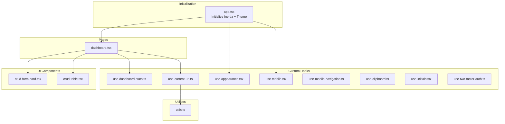
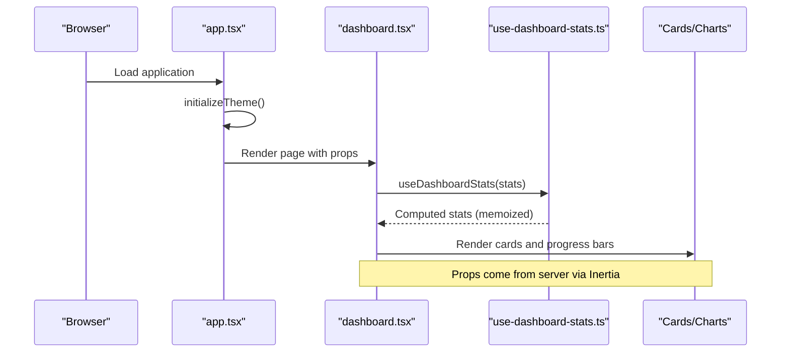
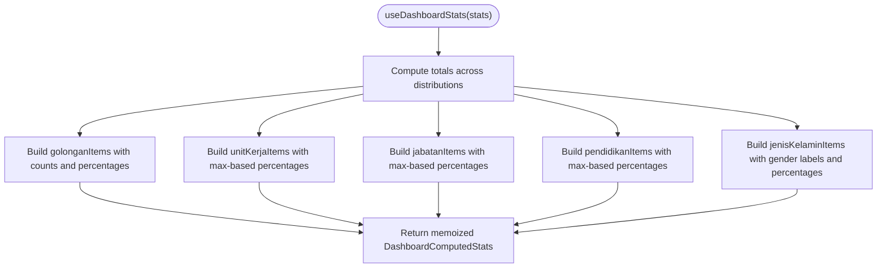
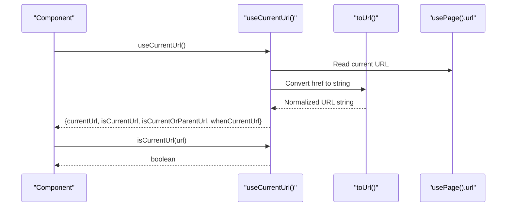
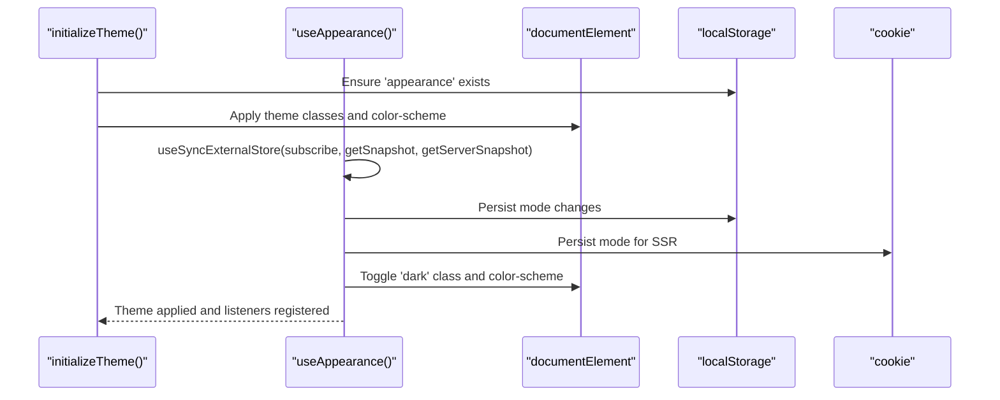
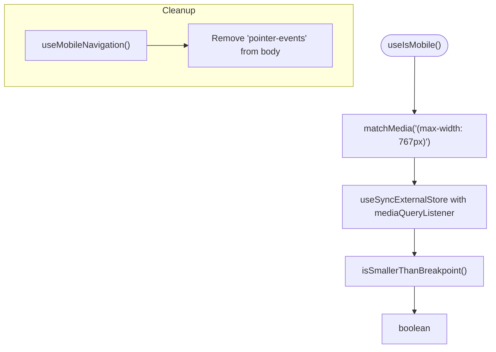
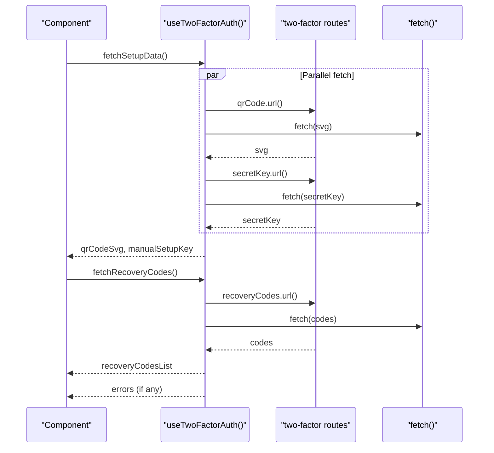
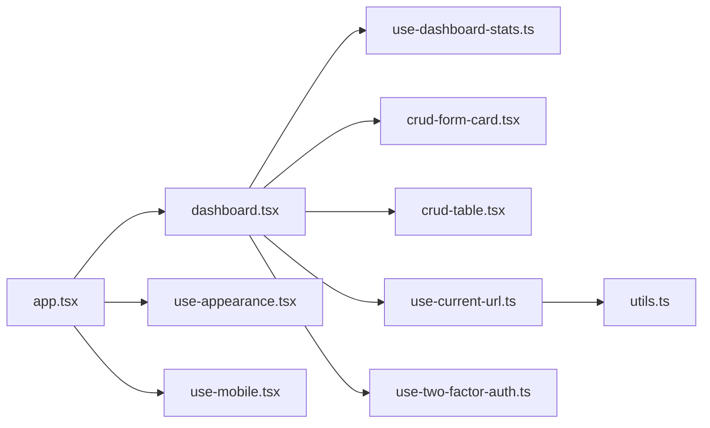

# State Management

<cite>
**Referenced Files in This Document**
- [use-dashboard-stats.ts](file://resources/js/hooks/use-dashboard-stats.ts)
- [use-current-url.ts](file://resources/js/hooks/use-current-url.ts)
- [use-appearance.tsx](file://resources/js/hooks/use-appearance.tsx)
- [use-mobile.tsx](file://resources/js/hooks/use-mobile.tsx)
- [use-mobile-navigation.ts](file://resources/js/hooks/use-mobile-navigation.ts)
- [use-clipboard.ts](file://resources/js/hooks/use-clipboard.ts)
- [use-initials.tsx](file://resources/js/hooks/use-initials.tsx)
- [use-two-factor-auth.ts](file://resources/js/hooks/use-two-factor-auth.ts)
- [crud-form-card.tsx](file://resources/js/components/kepegawaian/crud-form-card.tsx)
- [crud-table.tsx](file://resources/js/components/kepegawaian/crud-table.tsx)
- [dashboard.tsx](file://resources/js/pages/dashboard.tsx)
- [app.tsx](file://resources/js/app.tsx)
- [utils.ts](file://resources/js/lib/utils.ts)
- [SKILL.md](file://.agents/skills/inertia-react-development/SKILL.md)
</cite>

## Table of Contents
1. [Introduction](#introduction)
2. [Project Structure](#project-structure)
3. [Core Components](#core-components)
4. [Architecture Overview](#architecture-overview)
5. [Detailed Component Analysis](#detailed-component-analysis)
6. [Dependency Analysis](#dependency-analysis)
7. [Performance Considerations](#performance-considerations)
8. [Troubleshooting Guide](#troubleshooting-guide)
9. [Conclusion](#conclusion)
10. [Appendices](#appendices)

## Introduction
This document explains the React hooks-based state management patterns and data-fetching strategies used in the application. It focuses on custom hooks for dashboard statistics, URL management, appearance handling, and mobile detection, and documents state management patterns for forms, modals, and data tables. It also covers integration with Inertia.js for seamless server-client state synchronization, including deferred props, polling, and visibility-based loading. Guidance is provided for hook composition, state persistence, error handling, performance optimization, memory management, and state normalization, along with best practices for creating new hooks and maintaining state consistency.

## Project Structure
The state management system is primarily implemented via custom React hooks under resources/js/hooks and integrated with UI components under resources/js/components and pages under resources/js/pages. Inertia.js is initialized in resources/js/app.tsx and leverages server-provided props to drive client-side state updates.

**Diagram sources**
- [app.tsx:1-36](file://resources/js/app.tsx#L1-L36)
- [use-dashboard-stats.ts:1-155](file://resources/js/hooks/use-dashboard-stats.ts#L1-L155)
- [use-current-url.ts:1-84](file://resources/js/hooks/use-current-url.ts#L1-L84)
- [use-appearance.tsx:1-116](file://resources/js/hooks/use-appearance.tsx#L1-L116)
- [use-mobile.tsx:1-37](file://resources/js/hooks/use-mobile.tsx#L1-L37)
- [use-mobile-navigation.ts:1-11](file://resources/js/hooks/use-mobile-navigation.ts#L1-L11)
- [use-clipboard.ts:1-33](file://resources/js/hooks/use-clipboard.ts#L1-L33)
- [use-initials.tsx:1-23](file://resources/js/hooks/use-initials.tsx#L1-L23)
- [use-two-factor-auth.ts:1-108](file://resources/js/hooks/use-two-factor-auth.ts#L1-L108)
- [crud-form-card.tsx:1-63](file://resources/js/components/kepegawaian/crud-form-card.tsx#L1-L63)
- [crud-table.tsx:1-96](file://resources/js/components/kepegawaian/crud-table.tsx#L1-L96)
- [dashboard.tsx:1-343](file://resources/js/pages/dashboard.tsx#L1-L343)
- [utils.ts:1-13](file://resources/js/lib/utils.ts#L1-L13)

**Section sources**
- [app.tsx:1-36](file://resources/js/app.tsx#L1-L36)
- [dashboard.tsx:1-343](file://resources/js/pages/dashboard.tsx#L1-L343)

## Core Components
- Dashboard statistics computation: transforms raw statistics into normalized, percentage-based computed stats for rendering.
- URL matching helpers: provide current URL state and helpers to detect active navigation and conditionally render UI.
- Appearance management: centralized theme state with persistence across client and server.
- Mobile detection and navigation helpers: responsive-aware hooks using native media queries and DOM cleanup.
- Clipboard and initials helpers: small, reusable stateful utilities for UX enhancements.
- Two-factor authentication state: orchestration of fetching QR code, setup keys, and recovery codes with error handling.
- CRUD form and table components: containerized stateless UI with callbacks for editing and deletion.

**Section sources**
- [use-dashboard-stats.ts:63-152](file://resources/js/hooks/use-dashboard-stats.ts#L63-L152)
- [use-current-url.ts:29-83](file://resources/js/hooks/use-current-url.ts#L29-L83)
- [use-appearance.tsx:90-115](file://resources/js/hooks/use-appearance.tsx#L90-L115)
- [use-mobile.tsx:30-36](file://resources/js/hooks/use-mobile.tsx#L30-L36)
- [use-mobile-navigation.ts:5-10](file://resources/js/hooks/use-mobile-navigation.ts#L5-L10)
- [use-clipboard.ts:8-32](file://resources/js/hooks/use-clipboard.ts#L8-L32)
- [use-initials.tsx:5-22](file://resources/js/hooks/use-initials.tsx#L5-L22)
- [use-two-factor-auth.ts:33-107](file://resources/js/hooks/use-two-factor-auth.ts#L33-L107)
- [crud-form-card.tsx:23-62](file://resources/js/components/kepegawaian/crud-form-card.tsx#L23-L62)
- [crud-table.tsx:28-95](file://resources/js/components/kepegawaian/crud-table.tsx#L28-L95)

## Architecture Overview
The application initializes Inertia and applies theme preferences on startup. Pages receive props from the server and pass them to hooks for computation and UI rendering. Inertia’s deferred props, polling, and visibility features enable efficient data loading and synchronization.

**Diagram sources**
- [app.tsx:34-36](file://resources/js/app.tsx#L34-L36)
- [dashboard.tsx:38-45](file://resources/js/pages/dashboard.tsx#L38-L45)
- [use-dashboard-stats.ts:63-152](file://resources/js/hooks/use-dashboard-stats.ts#L63-L152)

**Section sources**
- [app.tsx:11-32](file://resources/js/app.tsx#L11-L32)
- [dashboard.tsx:34-45](file://resources/js/pages/dashboard.tsx#L34-L45)

## Detailed Component Analysis

### Dashboard Statistics Hook
Computes derived metrics from raw statistics, ensuring stable references via memoization and normalizing counts into percentages for charts and progress bars.

**Diagram sources**
- [use-dashboard-stats.ts:63-152](file://resources/js/hooks/use-dashboard-stats.ts#L63-L152)

**Section sources**
- [use-dashboard-stats.ts:39-152](file://resources/js/hooks/use-dashboard-stats.ts#L39-L152)
- [dashboard.tsx:38-342](file://resources/js/pages/dashboard.tsx#L38-L342)

### URL Management Hook
Provides current URL state and helpers to determine active navigation and conditional rendering. Uses URL parsing and optional starts-with matching for parent-child navigation.

**Diagram sources**
- [use-current-url.ts:29-83](file://resources/js/hooks/use-current-url.ts#L29-L83)
- [utils.ts:10-12](file://resources/js/lib/utils.ts#L10-L12)

**Section sources**
- [use-current-url.ts:22-83](file://resources/js/hooks/use-current-url.ts#L22-L83)
- [utils.ts:10-12](file://resources/js/lib/utils.ts#L10-L12)

### Appearance Handling Hook
Centralizes theme state with persistence across client and server. Uses a subscriber pattern with useSyncExternalStore for reactive updates and applies CSS classes and color-scheme hints.

**Diagram sources**
- [use-appearance.tsx:73-88](file://resources/js/hooks/use-appearance.tsx#L73-L88)
- [use-appearance.tsx:90-115](file://resources/js/hooks/use-appearance.tsx#L90-L115)

**Section sources**
- [use-appearance.tsx:6-115](file://resources/js/hooks/use-appearance.tsx#L6-L115)
- [app.tsx:34-36](file://resources/js/app.tsx#L34-L36)

### Mobile Detection and Navigation Hooks
Detects viewport breakpoints using native media queries and cleans up DOM styles after mobile navigation.

**Diagram sources**
- [use-mobile.tsx:30-36](file://resources/js/hooks/use-mobile.tsx#L30-L36)
- [use-mobile-navigation.ts:5-10](file://resources/js/hooks/use-mobile-navigation.ts#L5-L10)

**Section sources**
- [use-mobile.tsx:1-37](file://resources/js/hooks/use-mobile.tsx#L1-L37)
- [use-mobile-navigation.ts:1-11](file://resources/js/hooks/use-mobile-navigation.ts#L1-L11)

### Clipboard and Initials Helpers
Reusable stateful utilities for copying text and generating user initials.

**Section sources**
- [use-clipboard.ts:1-33](file://resources/js/hooks/use-clipboard.ts#L1-L33)
- [use-initials.tsx:1-23](file://resources/js/hooks/use-initials.tsx#L1-L23)

### Two-Factor Authentication Hook
Manages QR code SVG, manual setup key, and recovery codes with robust error handling and concurrent fetching.

**Diagram sources**
- [use-two-factor-auth.ts:33-107](file://resources/js/hooks/use-two-factor-auth.ts#L33-L107)

**Section sources**
- [use-two-factor-auth.ts:19-107](file://resources/js/hooks/use-two-factor-auth.ts#L19-L107)

### Forms, Modals, and Data Tables
- CRUD form card encapsulates submit/cancel actions and processing state.
- CRUD table renders columns with edit/delete actions and handles empty states.
- These components rely on props/state passed from pages and hooks, enabling separation of concerns.

**Section sources**
- [crud-form-card.tsx:11-62](file://resources/js/components/kepegawaian/crud-form-card.tsx#L11-L62)
- [crud-table.tsx:12-95](file://resources/js/components/kepegawaian/crud-table.tsx#L12-L95)

## Dependency Analysis
- Initialization depends on Inertia app setup and theme initialization.
- Pages depend on hooks for computed state and UI components for rendering.
- URL helpers depend on Inertia’s page context and a URL normalization utility.
- Appearance hook depends on browser APIs for media queries and cookies/localStorage for persistence.
- Mobile hooks depend on matchMedia and DOM manipulation for cleanup.

**Diagram sources**
- [app.tsx:11-36](file://resources/js/app.tsx#L11-L36)
- [dashboard.tsx:14-15](file://resources/js/pages/dashboard.tsx#L14-L15)
- [use-current-url.ts:1-3](file://resources/js/hooks/use-current-url.ts#L1-L3)
- [utils.ts:1-2](file://resources/js/lib/utils.ts#L1-L2)
- [use-appearance.tsx:1-1](file://resources/js/hooks/use-appearance.tsx#L1-L1)
- [use-mobile.tsx:1-1](file://resources/js/hooks/use-mobile.tsx#L1-L1)
- [use-two-factor-auth.ts:1-3](file://resources/js/hooks/use-two-factor-auth.ts#L1-L3)

**Section sources**
- [app.tsx:11-36](file://resources/js/app.tsx#L11-L36)
- [dashboard.tsx:14-15](file://resources/js/pages/dashboard.tsx#L14-L15)

## Performance Considerations
- Memoization: useDashboardStats memoizes computed stats to avoid re-computation on renders.
- Deferred props: leverage Inertia deferred props to defer heavy data until after initial render.
- Polling: use router reload with selective prop updates to refresh only necessary data.
- Visibility-based loading: use WhenVisible to lazy-load expensive data below the fold.
- Efficient rendering: compute percentages once and reuse normalized arrays in UI components.
- Minimize external store subscriptions: appearance and mobile hooks subscribe only when needed.

[No sources needed since this section provides general guidance]

## Troubleshooting Guide
- Appearance not applying on SSR: ensure initializeTheme is called during app setup and that cookies/localStorage are writable.
- URL helpers returning unexpected results: verify toUrl normalization and absolute vs relative URL handling.
- Two-factor fetch failures: inspect network errors and ensure routes are regenerated after backend changes.
- Inertia navigation breaking SPA behavior: replace anchor links with Inertia Link components and ensure form submissions use Inertia Form or preventDefault.
- Deferred props causing undefined errors: guard against undefined states and provide skeleton loaders.

**Section sources**
- [use-appearance.tsx:73-88](file://resources/js/hooks/use-appearance.tsx#L73-L88)
- [use-current-url.ts:38-60](file://resources/js/hooks/use-current-url.ts#L38-L60)
- [use-two-factor-auth.ts:21-31](file://resources/js/hooks/use-two-factor-auth.ts#L21-L31)
- [SKILL.md:355-361](file://.agents/skills/inertia-react-development/SKILL.md#L355-L361)

## Conclusion
The state management system combines custom hooks for computation and persistence with Inertia-driven server-client synchronization. By leveraging memoization, deferred loading, and visibility-based fetching, the application achieves responsive and efficient state handling. The hooks architecture promotes composability, testability, and maintainability while keeping UI components declarative and stateless.

[No sources needed since this section summarizes without analyzing specific files]

## Appendices

### Inertia Integration Patterns
- Deferred props: Defer expensive props to load after initial render.
- Polling: Periodically reload specific props to keep data fresh.
- Visibility-based loading: Load data only when elements are scrolled into view.

**Section sources**
- [SKILL.md:268-349](file://.agents/skills/inertia-react-development/SKILL.md#L268-L349)

### Guidelines for Creating New Hooks
- Keep hooks single-purpose and composable.
- Use memoization for derived state.
- Prefer useSyncExternalStore for external stores (media queries, cookies).
- Encapsulate side effects and provide cleanup where applicable.
- Normalize state shapes for predictable rendering.
- Document inputs, outputs, and error handling.

[No sources needed since this section provides general guidance]