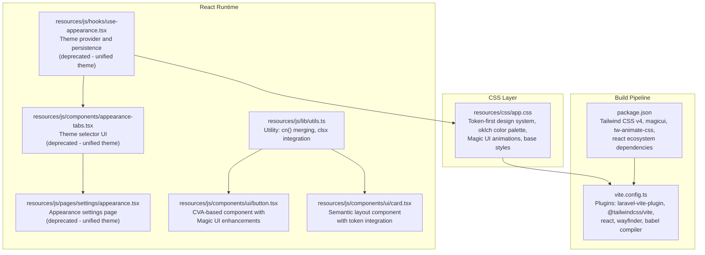
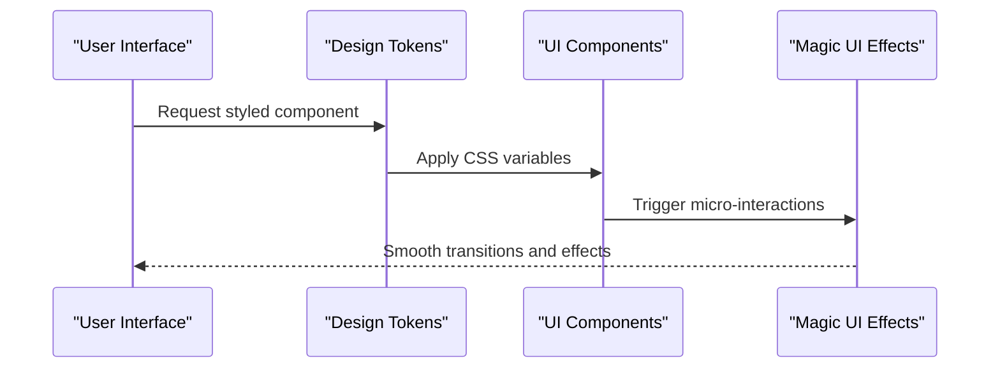
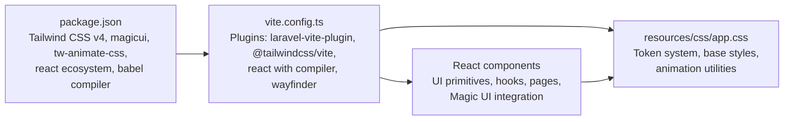

# Styling and Theming

<cite>
**Referenced Files in This Document**
- [app.css](file://resources/css/app.css)
- [vite.config.ts](file://vite.config.ts)
- [package.json](file://package.json)
- [use-appearance.tsx](file://resources/js/hooks/use-appearance.tsx)
- [appearance-tabs.tsx](file://resources/js/components/appearance-tabs.tsx)
- [appearance.tsx](file://resources/js/pages/settings/appearance.tsx)
- [utils.ts](file://resources/js/lib/utils.ts)
- [button.tsx](file://resources/js/components/ui/button.tsx)
- [card.tsx](file://resources/js/components/ui/card.tsx)
</cite>

## Update Summary
**Changes Made**
- Updated design system architecture to reflect token-first approach with new color palette
- Removed light/dark theme support documentation as it was deprecated
- Added comprehensive coverage of Magic UI components integration
- Enhanced design token documentation with new color scheme details
- Updated component system documentation to include new UI primitives

## Table of Contents
1. [Introduction](#introduction)
2. [Project Structure](#project-structure)
3. [Core Components](#core-components)
4. [Architecture Overview](#architecture-overview)
5. [Detailed Component Analysis](#detailed-component-analysis)
6. [Dependency Analysis](#dependency-analysis)
7. [Performance Considerations](#performance-considerations)
8. [Troubleshooting Guide](#troubleshooting-guide)
9. [Conclusion](#conclusion)
10. [Appendices](#appendices)

## Introduction
This document explains the styling and theming system built with Tailwind CSS v4 and integrated into the frontend stack. The system implements a comprehensive token-first design approach with a carefully curated color palette featuring dark green primary tones, gold accents, and orange highlights. The architecture emphasizes design token consistency, Magic UI component integration, and performance optimization through modern CSS techniques and React-based component composition.

**Updated** The theming system now operates on a simplified approach with a single unified color scheme, removing the previous light/dark mode toggle in favor of a consistent design language across all interfaces.

## Project Structure
The styling system centers around a token-driven architecture with centralized design tokens, Magic UI component integration, and optimized build pipeline for modern CSS generation and animation support.

**Diagram sources**
- [app.css:1-144](file://resources/css/app.css#L1-L144)
- [vite.config.ts:1-28](file://vite.config.ts#L1-L28)
- [package.json:1-78](file://package.json#L1-L78)
- [use-appearance.tsx:1-116](file://resources/js/hooks/use-appearance.tsx#L1-L116)
- [appearance-tabs.tsx:1-46](file://resources/js/components/appearance-tabs.tsx#L1-L46)
- [appearance.tsx:1-36](file://resources/js/pages/settings/appearance.tsx#L1-L36)
- [utils.ts:1-13](file://resources/js/lib/utils.ts#L1-L13)
- [button.tsx:1-65](file://resources/js/components/ui/button.tsx#L1-L65)
- [card.tsx:1-69](file://resources/js/components/ui/card.tsx#L1-L69)

**Section sources**
- [app.css:1-144](file://resources/css/app.css#L1-L144)
- [vite.config.ts:1-28](file://vite.config.ts#L1-L28)
- [package.json:1-78](file://package.json#L1-L78)

## Core Components
- **Token-First Design System**: Comprehensive CSS variable architecture with oklch-based color tokens, consistent spacing scales, and typography foundations
- **Magic UI Integration**: Advanced animation components including shimmer effects, blur transitions, animated numbers, and particle systems
- **Component Primitive Library**: CVA-based UI components with semantic structure, accessibility compliance, and design token integration
- **Animation Framework**: tw-animate-css integration with custom animation utilities for smooth micro-interactions
- **Utility Layer**: Enhanced class merging with clsx and tailwind-merge for conflict-free composition

**Updated** The system now operates with a unified color scheme eliminating the previous light/dark mode complexity in favor of consistent design token application.

**Section sources**
- [app.css:10-144](file://resources/css/app.css#L10-L144)
- [package.json:33-67](file://package.json#L33-L67)
- [utils.ts:1-13](file://resources/js/lib/utils.ts#L1-L13)
- [button.tsx:1-65](file://resources/js/components/ui/button.tsx#L1-L65)
- [card.tsx:1-69](file://resources/js/components/ui/card.tsx#L1-L69)

## Architecture Overview
The design system architecture implements a token-first approach with centralized design tokens, Magic UI component integration, and optimized animation delivery through tw-animate-css.

**Diagram sources**
- [app.css:10-62](file://resources/css/app.css#L10-L62)
- [button.tsx:7-39](file://resources/js/components/ui/button.tsx#L7-L39)
- [utils.ts:6-8](file://resources/js/lib/utils.ts#L6-L8)

## Detailed Component Analysis

### Token-First Design System Architecture
The system implements a comprehensive token architecture with oklch-based color spaces, consistent typography, and semantic color relationships.

**Design Token Categories**:
- **Color Tokens**: Primary (dark green), Secondary (gold), Accent (orange), Background, Foreground, Muted, Destructive
- **Typography Tokens**: Instrument Sans font stack, consistent scale ratios, and semantic text roles
- **Spacing Tokens**: Consistent unit system with logical relationships (base 4px grid)
- **Border Radius Tokens**: Multi-scale radius system (base 0.625rem with variants)
- **Shadow Tokens**: Subtle elevation system with consistent blur radii
- **Chart Color Tokens**: 5-color categorical palette for data visualization

**Color Palette Implementation**:
- **Primary**: oklch(0.205 0 0) - Dark green base with high contrast
- **Secondary**: oklch(0.97 0 0) - Light neutral with gold undertones
- **Accent**: oklch(0.97 0 0) - Warm gold for highlights and emphasis
- **Background**: oklch(1 0 0) - Pure white in light theme, oklch(0.145 0 0) in dark
- **Foreground**: oklch(0.145 0 0) - Deep gray in light, oklch(0.985 0 0) in dark

**Section sources**
- [app.css:10-98](file://resources/css/app.css#L10-L98)

### Magic UI Component Integration
The system integrates advanced animation components through the magicui package, providing sophisticated micro-interactions and visual effects.

**Available Magic UI Components**:
- **Shimmer Button**: Animated gradient effect for prominent actions
- **Blur In**: Smooth fade-in with blur transition
- **Animated Number**: Digit counting animations for statistics
- **Border Beam**: Animated border highlighting effects
- **Particles**: Interactive particle systems for backgrounds
- **Text Shimmer**: Text-based shimmer animations
- **Fade In**: Simple opacity transitions

**Integration Approach**:
- Components are imported individually for tree-shaking benefits
- Integrated with the existing CVA component architecture
- Compatible with the token-first design system
- Optimized for performance with lazy loading

**Section sources**
- [package.json:133-135](file://package.json#L133-L135)

### Component Primitive Library
The UI component library follows CVA patterns with semantic structure, accessibility compliance, and design token integration.

**Button Component Features**:
- Variant system: default, destructive, outline, secondary, ghost, link
- Size variants: default, xs, sm, lg, icon variants
- As-child pattern support via Radix Slot
- Focus-visible ring with ring token integration
- SVG sizing semantics with consistent spacing
- Disabled state handling with opacity scaling

**Card Component Architecture**:
- Semantic slot structure: header, title, description, content, footer
- Consistent spacing with token-based padding and gaps
- Border and shadow system with card token integration
- Responsive design with flexible content areas

**Accessibility Features**:
- Proper ARIA attributes and roles
- Focus management and keyboard navigation
- Color contrast compliance with WCAG guidelines
- Reduced motion support through prefers-reduced-motion

**Section sources**
- [button.tsx:7-39](file://resources/js/components/ui/button.tsx#L7-L39)
- [card.tsx:5-65](file://resources/js/components/ui/card.tsx#L5-L65)

### Animation and Micro-Interaction Framework
The system leverages tw-animate-css for smooth, performant animations that complement the Magic UI components.

**Animation Categories**:
- **Entrance Animations**: Fade in, slide up/down, scale transitions
- **State Changes**: Hover effects, focus rings, active states
- **Data Updates**: Counting numbers, progress indicators
- **Interactive Feedback**: Button press, form validation, loading states

**Performance Optimizations**:
- Hardware acceleration through transform properties
- Efficient animation timing with CSS variables
- Reduced motion compatibility
- Tree-shaking for unused animations

**Section sources**
- [app.css:3](file://resources/css/app.css#L3)
- [package.json:64](file://package.json#L64)

## Dependency Analysis
The styling pipeline integrates modern CSS processing, React component architecture, and Magic UI animation system with optimized build configurations.

**Diagram sources**
- [package.json:1-78](file://package.json#L1-L78)
- [vite.config.ts:1-28](file://vite.config.ts#L1-L28)
- [app.css:1-144](file://resources/css/app.css#L1-L144)

**Section sources**
- [package.json:1-78](file://package.json#L1-L78)
- [vite.config.ts:1-28](file://vite.config.ts#L1-L28)

## Performance Considerations
- **Token Efficiency**: CSS variables reduce duplication and enable runtime theme switching without rebuilds
- **Animation Optimization**: Hardware-accelerated transforms and efficient timing functions
- **Bundle Size**: Individual Magic UI component imports prevent unused code inclusion
- **Build Optimization**: Lightning CSS and modern bundling minimize payload size
- **Tree Shaking**: Strategic imports ensure only used animations and components are included
- **Critical Rendering**: Essential styles extracted separately for optimal first paint

**Updated** Performance considerations now emphasize the streamlined token system and Magic UI optimizations rather than theme switching overhead.

## Troubleshooting Guide
- **Token values not applying**:
  - Verify CSS variable declarations in :root and .dark selectors
  - Check for proper token naming conventions (--color-* pattern)
  - Ensure @theme block contains all required token definitions
- **Magic UI components not animating**:
  - Confirm component imports are individual rather than bulk imports
  - Verify tw-animate-css is properly configured in Tailwind
  - Check for animation duration and timing conflicts
- **Animation performance issues**:
  - Use transform-based animations instead of layout-affecting properties
  - Implement reduced motion compatibility checks
  - Optimize animation frequency and duration
- **Build errors with new components**:
  - Ensure proper TypeScript definitions are available
  - Verify component registration in appropriate directories
  - Check for circular dependency issues

**Section sources**
- [app.css:10-62](file://resources/css/app.css#L10-L62)
- [package.json:133-135](file://package.json#L133-L135)

## Conclusion
The styling and theming system represents a comprehensive token-first approach with Magic UI integration, delivering consistent design language, smooth animations, and optimal performance. The unified color scheme eliminates theme complexity while maintaining design flexibility through the extensive token system. Following the established patterns ensures maintainable component development and consistent user experiences across all interfaces.

## Appendices

### Guidelines for Maintaining Design Consistency
- **Token Usage**: Always reference CSS variables for colors, spacing, and typography
- **Component Composition**: Use CVA patterns and the cn() utility for safe class merging
- **Animation Standards**: Leverage tw-animate-css for micro-interactions and Magic UI components
- **Accessibility First**: Ensure all components meet WCAG guidelines with proper contrast ratios
- **Performance Budget**: Monitor bundle size and animation performance regularly

**Section sources**
- [app.css:10-62](file://resources/css/app.css#L10-L62)
- [button.tsx:7-39](file://resources/js/components/ui/button.tsx#L7-L39)
- [utils.ts:6-8](file://resources/js/lib/utils.ts#L6-L8)

### Creating Custom Components with Tailwind
- **Design Token Integration**: Reference --color-* variables for consistent theming
- **CVA Pattern Implementation**: Define variant and size scales with clear defaults
- **Magic UI Compatibility**: Ensure components work with animation utilities
- **Accessibility Compliance**: Include proper ARIA attributes and keyboard navigation
- **Performance Optimization**: Minimize DOM complexity and use efficient CSS properties

**Section sources**
- [button.tsx:1-65](file://resources/js/components/ui/button.tsx#L1-L65)
- [card.tsx:1-69](file://resources/js/components/ui/card.tsx#L1-L69)

### Extending the Design System
- **Token Expansion**: Add new CSS variables to the @theme block and :root selectors
- **Component Variants**: Extend CVA definitions with new variant categories
- **Animation Libraries**: Integrate additional tw-animate-css utilities as needed
- **Magic UI Integration**: Import specific components for targeted functionality
- **Pattern Development**: Create reusable component compositions from primitives

**Section sources**
- [app.css:10-62](file://resources/css/app.css#L10-L62)
- [button.tsx:10-32](file://resources/js/components/ui/button.tsx#L10-L32)
- [package.json:133-135](file://package.json#L133-L135)

### Color System Reference
**Primary Palette**:
- Primary: oklch(0.205 0 0) - Dark green (#003300)
- Primary Foreground: oklch(0.985 0 0) - White (#FFFFFF)

**Supporting Colors**:
- Secondary: oklch(0.97 0 0) - Light neutral (#F7F7F7)
- Secondary Foreground: oklch(0.205 0 0) - Dark green (#003300)
- Accent: oklch(0.97 0 0) - Gold (#F7F7F7)
- Accent Foreground: oklch(0.205 0 0) - Dark green (#003300)

**Neutral System**:
- Background: oklch(1 0 0) - White (#FFFFFF)
- Foreground: oklch(0.145 0 0) - Deep gray (#242424)
- Muted: oklch(0.97 0 0) - Light neutral (#F7F7F7)
- Muted Foreground: oklch(0.556 0 0) - Medium gray (#8E8E8E)

**Section sources**
- [app.css:64-98](file://resources/css/app.css#L64-L98)