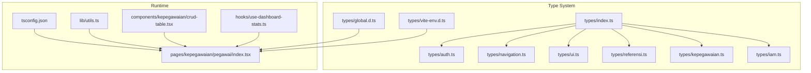
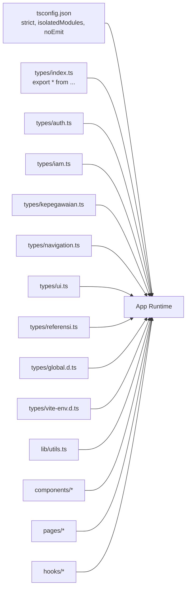
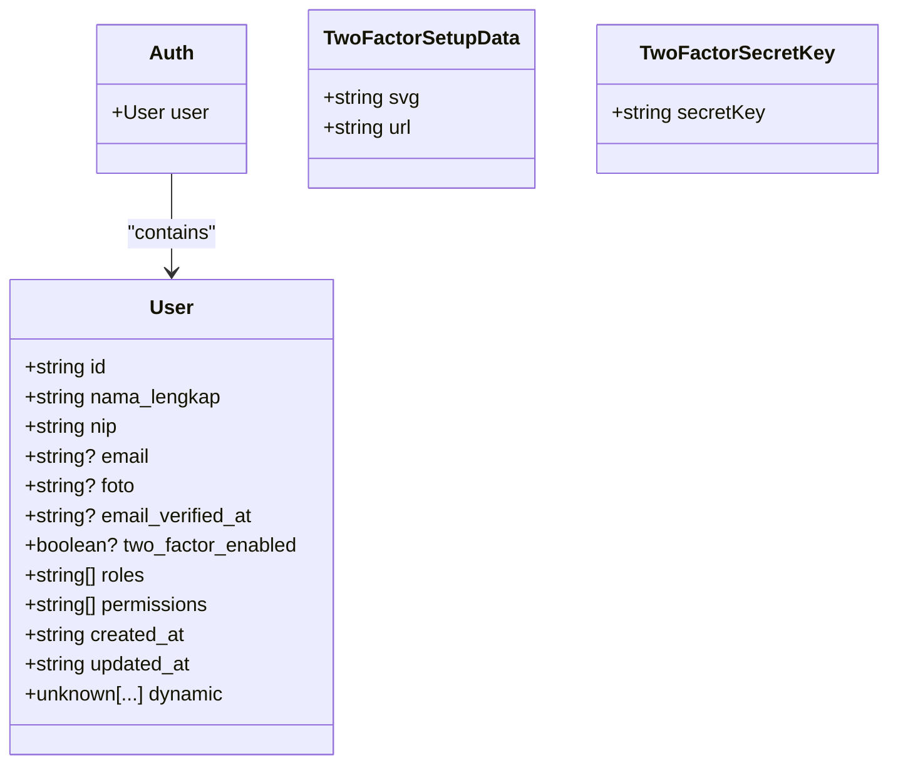
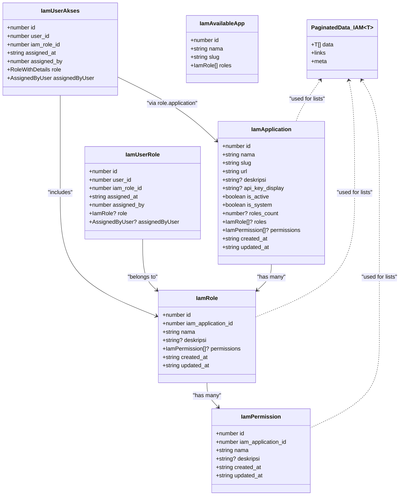
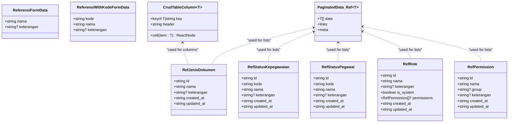
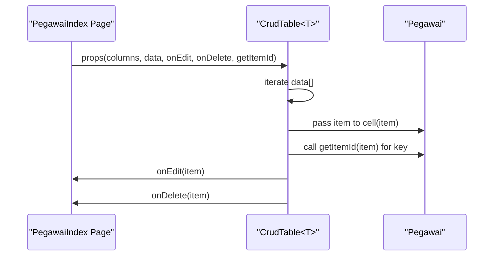
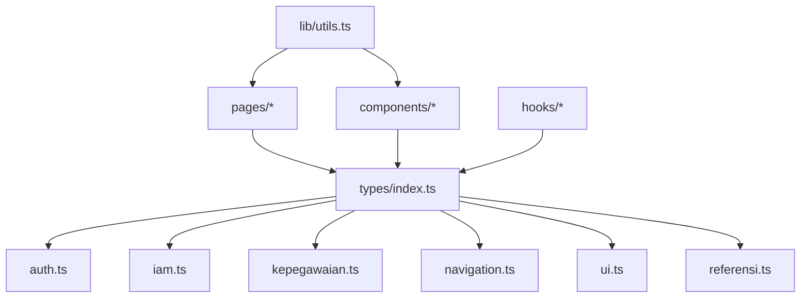

# TypeScript Integration

<cite>
**Referenced Files in This Document**
- [tsconfig.json](file://tsconfig.json)
- [resources/js/types/index.ts](file://resources/js/types/index.ts)
- [resources/js/types/auth.ts](file://resources/js/types/auth.ts)
- [resources/js/types/iam.ts](file://resources/js/types/iam.ts)
- [resources/js/types/kepegawaian.ts](file://resources/js/types/kepegawaian.ts)
- [resources/js/types/navigation.ts](file://resources/js/types/navigation.ts)
- [resources/js/types/referensi.ts](file://resources/js/types/referensi.ts)
- [resources/js/types/ui.ts](file://resources/js/types/ui.ts)
- [resources/js/types/global.d.ts](file://resources/js/types/global.d.ts)
- [resources/js/types/vite-env.d.ts](file://resources/js/types/vite-env.d.ts)
- [resources/js/lib/utils.ts](file://resources/js/lib/utils.ts)
- [resources/js/components/kepegawaian/crud-table.tsx](file://resources/js/components/kepegawaian/crud-table.tsx)
- [resources/js/pages/kepegawaian/pegawai/index.tsx](file://resources/js/pages/kepegawaian/pegawai/index.tsx)
- [resources/js/hooks/use-dashboard-stats.ts](file://resources/js/hooks/use-dashboard-stats.ts)
</cite>

## Table of Contents
1. [Introduction](#introduction)
2. [Project Structure](#project-structure)
3. [Core Components](#core-components)
4. [Architecture Overview](#architecture-overview)
5. [Detailed Component Analysis](#detailed-component-analysis)
6. [Dependency Analysis](#dependency-analysis)
7. [Performance Considerations](#performance-considerations)
8. [Troubleshooting Guide](#troubleshooting-guide)
9. [Conclusion](#conclusion)

## Introduction
This document explains the TypeScript integration and type system architecture for the frontend of the kepegawaian application. It covers how types are organized across authentication, IAM, kepegawaian domain, navigation, and UI concerns; how API response and form data types are modeled; and how TypeScript configuration enforces strictness and correctness. It also documents advanced type techniques such as generics, utility types, union types, and type guards, and provides guidelines for maintaining type consistency and evolving the type system over time.

## Project Structure
The frontend type system is centralized under resources/js/types and consumed by components, pages, hooks, and utilities. A single barrel export aggregates all public types for convenient imports across the app. The TypeScript compiler is configured to target modern environments, enforce strictness, and integrate with Vite and React JSX.



**Diagram sources**
- [resources/js/types/index.ts:1-6](file://resources/js/types/index.ts#L1-L6)
- [resources/js/types/auth.ts:1-28](file://resources/js/types/auth.ts#L1-L28)
- [resources/js/types/navigation.ts:1-20](file://resources/js/types/navigation.ts#L1-L20)
- [resources/js/types/ui.ts:1-17](file://resources/js/types/ui.ts#L1-L17)
- [resources/js/types/referensi.ts:1-88](file://resources/js/types/referensi.ts#L1-L88)
- [resources/js/types/kepegawaian.ts:1-249](file://resources/js/types/kepegawaian.ts#L1-L249)
- [resources/js/types/iam.ts:1-92](file://resources/js/types/iam.ts#L1-L92)
- [resources/js/types/global.d.ts:1-13](file://resources/js/types/global.d.ts#L1-L13)
- [resources/js/types/vite-env.d.ts:1-2](file://resources/js/types/vite-env.d.ts#L1-L2)
- [tsconfig.json:1-122](file://tsconfig.json#L1-L122)
- [resources/js/lib/utils.ts:1-13](file://resources/js/lib/utils.ts#L1-L13)
- [resources/js/components/kepegawaian/crud-table.tsx:1-96](file://resources/js/components/kepegawaian/crud-table.tsx#L1-L96)
- [resources/js/pages/kepegawaian/pegawai/index.tsx:1-487](file://resources/js/pages/kepegawaian/pegawai/index.tsx#L1-L487)
- [resources/js/hooks/use-dashboard-stats.ts:1-155](file://resources/js/hooks/use-dashboard-stats.ts#L1-L155)

**Section sources**
- [resources/js/types/index.ts:1-6](file://resources/js/types/index.ts#L1-L6)
- [tsconfig.json:1-122](file://tsconfig.json#L1-L122)

## Core Components
This section outlines the primary type categories and their responsibilities.

- Authentication types
  - User: shape of the authenticated user, including identity, roles, permissions, and timestamps.
  - Auth: container for the current user session.
  - Two-factor setup and secret key types for MFA flows.

- IAM types
  - Application, role, permission, user-role assignment, and user-access records.
  - Paginated data contract aligned with Laravel-style pagination.

- Kepegawaian domain types
  - Enum-like unions for statuses, genders, religions, positions, blood types, employment types, family relations, and education levels.
  - Reference types (ref positions, ranks, units) and entity types (employee).
  - Pagination and filtering interfaces for lists and forms.

- Navigation and UI types
  - Navigation items and breadcrumbs for menu and breadcrumb components.
  - Layout props for app and auth layouts.

- Referensi types
  - Reference entities for document types, employment statuses, and roles/permissions.
  - Generic CRUD table column and paginated data shapes for reusable tables.

- Global and environment types
  - Inertia shared page props augmentation to include auth and UI state.
  - Vite client types for build-time environment variables.

**Section sources**
- [resources/js/types/auth.ts:1-28](file://resources/js/types/auth.ts#L1-L28)
- [resources/js/types/iam.ts:1-92](file://resources/js/types/iam.ts#L1-L92)
- [resources/js/types/kepegawaian.ts:1-249](file://resources/js/types/kepegawaian.ts#L1-L249)
- [resources/js/types/navigation.ts:1-20](file://resources/js/types/navigation.ts#L1-L20)
- [resources/js/types/ui.ts:1-17](file://resources/js/types/ui.ts#L1-L17)
- [resources/js/types/referensi.ts:1-88](file://resources/js/types/referensi.ts#L1-L88)
- [resources/js/types/global.d.ts:1-13](file://resources/js/types/global.d.ts#L1-L13)
- [resources/js/types/vite-env.d.ts:1-2](file://resources/js/types/vite-env.d.ts#L1-L2)

## Architecture Overview
The frontend type system is designed around:
- Strict mode and comprehensive type checking to prevent runtime errors.
- Centralized type exports via a barrel file for ergonomic imports.
- Strong typing for API responses, navigation, and UI props.
- Reusable generic components with constrained type parameters.
- Utility types and helpers to normalize and transform data.



**Diagram sources**
- [tsconfig.json:86-115](file://tsconfig.json#L86-L115)
- [resources/js/types/index.ts:1-6](file://resources/js/types/index.ts#L1-L6)
- [resources/js/types/auth.ts:1-28](file://resources/js/types/auth.ts#L1-L28)
- [resources/js/types/iam.ts:1-92](file://resources/js/types/iam.ts#L1-L92)
- [resources/js/types/kepegawaian.ts:1-249](file://resources/js/types/kepegawaian.ts#L1-L249)
- [resources/js/types/navigation.ts:1-20](file://resources/js/types/navigation.ts#L1-L20)
- [resources/js/types/ui.ts:1-17](file://resources/js/types/ui.ts#L1-L17)
- [resources/js/types/referensi.ts:1-88](file://resources/js/types/referensi.ts#L1-L88)
- [resources/js/types/global.d.ts:1-13](file://resources/js/types/global.d.ts#L1-L13)
- [resources/js/types/vite-env.d.ts:1-2](file://resources/js/types/vite-env.d.ts#L1-L2)
- [resources/js/lib/utils.ts:1-13](file://resources/js/lib/utils.ts#L1-L13)

## Detailed Component Analysis

### Authentication Types
Authentication types define the shape of the logged-in user and related session data. They include optional flags and arrays for roles and permissions, enabling fine-grained access control checks in components.



**Diagram sources**
- [resources/js/types/auth.ts:1-28](file://resources/js/types/auth.ts#L1-L28)

**Section sources**
- [resources/js/types/auth.ts:1-28](file://resources/js/types/auth.ts#L1-L28)

### IAM Types
IAM types model applications, roles, permissions, and user-role assignments. They include nested relations and a generic paginated data interface aligned with Laravel’s response structure.



**Diagram sources**
- [resources/js/types/iam.ts:1-92](file://resources/js/types/iam.ts#L1-L92)

**Section sources**
- [resources/js/types/iam.ts:1-92](file://resources/js/types/iam.ts#L1-L92)

### Kepegawaian Domain Types
Domain types mirror backend enums and represent reference data, employees, and list filters. Union types provide exhaustive, safe handling of discrete values, while generic pagination types unify list responses.

```mermaid
classDiagram
class StatusPegawai {
<<union>>
"aktif"|"mutasi_keluar"|"pensiun"|"meninggal"|"diberhentikan"
}
class JenisKelamin {
<<union>>
"laki_laki"|"perempuan"
}
class StatusPerkawinan {
<<union>>
"belum_kawin"|"kawin"|"cerai_hidup"|"cerai_mati"
}
class Agama {
<<union>>
"islam"|"kristen"|"katolik"|"hindu"|"buddha"|"konghucu"
}
class JenisJabatan {
<<union>>
"struktural"|"fungsional"|"pelaksana"
}
class GolonganDarah {
<<union>>
"A"|"B"|"AB"|"O"
}
class StatusKepegawaian {
<<union>>
"pns"|"pppk"|"honorer"
}
class HubunganKeluarga {
<<union>>
"Suami"|"Istri"|"Anak"|"AyahKandung"|"IbuKandung"
}
class JenjangPendidikan {
<<union>>
"sd"|"smp"|"sma"|"d1"|"d2"|"d3"|"d4"|"s1"|"s2"|"s3"
}
class RefPangkat {
+string id
+string kode
+string nama
+string golongan
+string ruang
}
class RefJabatan {
+string id
+string nama
+JenisJabatan jenis
+number? kelas
+number? nilai_jabatan
+number? indeks_jabatan
}
class RefUnitKerja {
+string id
+string nama
+string? kode
+string? parent_id
+number level
}
class Pegawai {
+string id
+string? nip
+string? nip_lama
+string nama_lengkap
+string tempat_lahir
+string tanggal_lahir
+JenisKelamin jenis_kelamin
+Agama agama
+StatusPerkawinan status_perkawinan
+GolonganDarah? golongan_darah
+string? alamat
+string? no_telepon
+string? email
+StatusKepegawaian status_kepegawaian
+StatusPegawai status_pegawai
+string? tmt_cpns
+string? tmt_pns
+string? pendidikan_terakhir
+string? tanggal_masuk
+string? tanggal_pensiun_bup
+string? ref_pangkat_id
+string? ref_jabatan_id
+string? ref_unit_kerja_id
+string? no_karpeg
+string? no_karis_karsu
+string? npwp
+string? no_bpjs_kesehatan
+string? no_bpjs_ketenagakerjaan
+string? no_taspen
+string? foto
+string? keterangan
+string created_at
+string updated_at
+RefPangkat? pangkat
+RefJabatan? jabatan
+RefUnitKerja? unit_kerja
}
class PaginatedData_Kepeg~T~ {
+number current_page
+T[] data
+string first_page_url
+number? from
+number last_page
+string last_page_url
+PaginationLink[] links
+string? next_page_url
+string path
+number per_page
+string? prev_page_url
+number? to
+number total
}
class PegawaiListFilters {
+string? search
+string? golongan
+string? unit_kerja
+StatusPegawai? status_pegawai
+PegawaiListSortBy? sort_by
+("asc"| "desc")? sort_dir
}
class PegawaiListSortBy {
<<union>>
"nip"|"nama"|"pangkat"
}
class PegawaiListFilterOptions {
+PegawaiGolonganOption[] golongan
+PegawaiUnitKerjaOption[] unitKerja
+StatusPegawai[] statusPegawai
}
class PegawaiGolonganOption {
+string id
+string kode
+string nama
}
class PegawaiUnitKerjaOption {
+string id
+string nama
}
Pegawai --> RefPangkat : "references"
Pegawai --> RefJabatan : "references"
Pegawai --> RefUnitKerja : "references"
PaginatedData_Kepeg <.. Pegawai : "used for lists"
```

**Diagram sources**
- [resources/js/types/kepegawaian.ts:1-249](file://resources/js/types/kepegawaian.ts#L1-L249)

**Section sources**
- [resources/js/types/kepegawaian.ts:1-249](file://resources/js/types/kepegawaian.ts#L1-L249)

### Navigation and UI Types
Navigation types define structured menu items and breadcrumbs. UI types standardize layout props and variants, ensuring consistent component contracts.

```mermaid
classDiagram
class BreadcrumbItem {
+string title
+NonNullable<InertiaLinkProps["href"]> href
}
class NavItem {
+string title
+NonNullable<InertiaLinkProps["href"]> href
+LucideIcon? icon
+boolean? isActive
}
class NavGroup {
+string title
+NavItem[] items
}
class AppLayoutProps {
+ReactNode children
+BreadcrumbItem[]? breadcrumbs
}
class AppVariant {
<<union>>
"header"|"sidebar"
}
class AuthLayoutProps {
+ReactNode? children
+string? name
+string? title
+string? description
}
NavItem --> BreadcrumbItem : "used in breadcrumbs"
AppLayoutProps --> BreadcrumbItem : "optional"
```

**Diagram sources**
- [resources/js/types/navigation.ts:1-20](file://resources/js/types/navigation.ts#L1-L20)
- [resources/js/types/ui.ts:1-17](file://resources/js/types/ui.ts#L1-L17)

**Section sources**
- [resources/js/types/navigation.ts:1-20](file://resources/js/types/navigation.ts#L1-L20)
- [resources/js/types/ui.ts:1-17](file://resources/js/types/ui.ts#L1-L17)

### Referensi Types and Generic Components
Referensi types encapsulate reference entities and form data shapes. Generic components leverage constrained type parameters to ensure type-safe rendering and actions.



**Diagram sources**
- [resources/js/types/referensi.ts:1-88](file://resources/js/types/referensi.ts#L1-L88)

**Section sources**
- [resources/js/types/referensi.ts:1-88](file://resources/js/types/referensi.ts#L1-L88)

### Generic Components and Type-Safe Rendering
The generic CRUD table demonstrates constrained type parameters to ensure columns render correctly against typed data and that row actions receive the proper item type.



**Diagram sources**
- [resources/js/components/kepegawaian/crud-table.tsx:1-96](file://resources/js/components/kepegawaian/crud-table.tsx#L1-L96)
- [resources/js/pages/kepegawaian/pegawai/index.tsx:1-487](file://resources/js/pages/kepegawaian/pegawai/index.tsx#L1-L487)

**Section sources**
- [resources/js/components/kepegawaian/crud-table.tsx:1-96](file://resources/js/components/kepegawaian/crud-table.tsx#L1-L96)
- [resources/js/pages/kepegawaian/pegawai/index.tsx:1-487](file://resources/js/pages/kepegawaian/pegawai/index.tsx#L1-L487)

### Type Guards and Utility Types
Utility functions demonstrate safe transformations and type narrowing:
- cn(...) merges Tailwind classes with type-safe inputs.
- toUrl(...) normalizes Inertia link props to a string URL.

These utilities help avoid runtime errors by enforcing input constraints at compile time.

**Section sources**
- [resources/js/lib/utils.ts:1-13](file://resources/js/lib/utils.ts#L1-L13)

### Type Inference Patterns and Union Types
Pages and hooks showcase inference and union usage:
- Page props are inferred from server-provided data and typed via exported interfaces.
- Union types for enums ensure exhaustive handling and prevent invalid values.
- Computed stats derive derived metrics from raw statistics using precise numeric types.

**Section sources**
- [resources/js/pages/kepegawaian/pegawai/index.tsx:1-487](file://resources/js/pages/kepegawaian/pegawai/index.tsx#L1-L487)
- [resources/js/hooks/use-dashboard-stats.ts:1-155](file://resources/js/hooks/use-dashboard-stats.ts#L1-L155)

## Dependency Analysis
The type system exhibits low coupling and high cohesion:
- Barrel export centralizes imports.
- Shared interfaces reduce duplication across pages and components.
- Generic components decouple UI from data shapes.



**Diagram sources**
- [resources/js/types/index.ts:1-6](file://resources/js/types/index.ts#L1-L6)
- [resources/js/pages/kepegawaian/pegawai/index.tsx:1-487](file://resources/js/pages/kepegawaian/pegawai/index.tsx#L1-L487)
- [resources/js/components/kepegawaian/crud-table.tsx:1-96](file://resources/js/components/kepegawaian/crud-table.tsx#L1-L96)
- [resources/js/hooks/use-dashboard-stats.ts:1-155](file://resources/js/hooks/use-dashboard-stats.ts#L1-L155)
- [resources/js/lib/utils.ts:1-13](file://resources/js/lib/utils.ts#L1-L13)

**Section sources**
- [resources/js/types/index.ts:1-6](file://resources/js/types/index.ts#L1-L6)

## Performance Considerations
- Keep union types concise and stable to minimize recompilation churn.
- Prefer readonly and exact optional properties to reduce accidental mutations.
- Use generic constraints to avoid broad any types that degrade inference.
- Leverage memoization in hooks to compute derived types efficiently.

## Troubleshooting Guide
Common issues and resolutions:
- Strict mode errors
  - Symptom: Errors about implicit any or missing properties.
  - Resolution: Add explicit types or enable exactOptionalPropertyTypes and fix missing fields.

- Module resolution failures
  - Symptom: Cannot find module '@/types'.
  - Resolution: Ensure baseUrl and paths are configured correctly in tsconfig.json and that barrel exports exist.

- JSX/React integration
  - Symptom: Incompatible JSX factory or React types.
  - Resolution: Confirm jsx: "react-jsx" and React types are installed; Vite env types are present.

- Generic component errors
  - Symptom: Column key mismatch or cell signature mismatch.
  - Resolution: Align CrudTable column keys with the item’s keys and ensure cell signatures accept the item type.

- Pagination mismatch
  - Symptom: Incorrect meta or links structure.
  - Resolution: Match the PaginatedData<T> shape to the backend response structure.

**Section sources**
- [tsconfig.json:86-115](file://tsconfig.json#L86-L115)
- [resources/js/types/iam.ts:75-91](file://resources/js/types/iam.ts#L75-L91)
- [resources/js/types/kepegawaian.ts:139-153](file://resources/js/types/kepegawaian.ts#L139-L153)
- [resources/js/types/referensi.ts:65-87](file://resources/js/types/referensi.ts#L65-L87)
- [resources/js/components/kepegawaian/crud-table.tsx:12-26](file://resources/js/components/kepegawaian/crud-table.tsx#L12-L26)

## Conclusion
The frontend type system is robust, modular, and aligned with the application’s domain. By centralizing types, enforcing strictness, and leveraging generics and unions, the codebase achieves strong type safety, predictable component contracts, and maintainable evolution. Following the guidelines herein ensures consistent type quality as new features are added and existing types are refined.