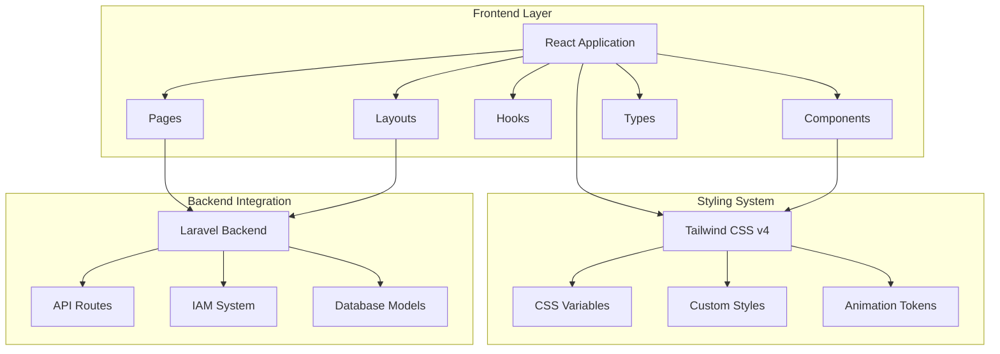
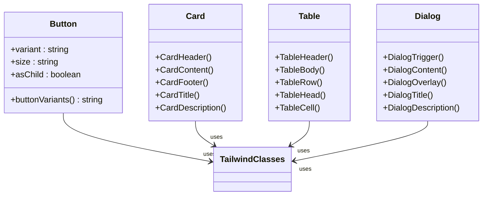
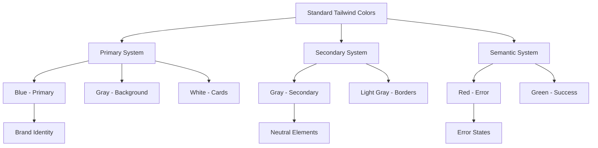
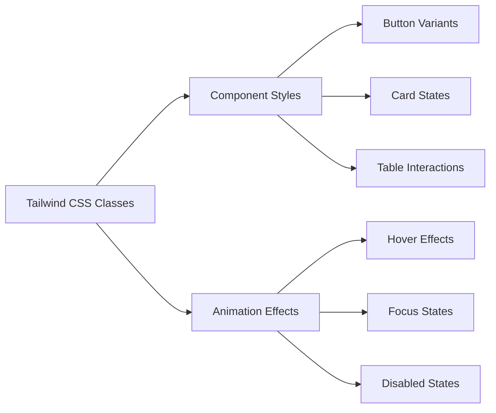
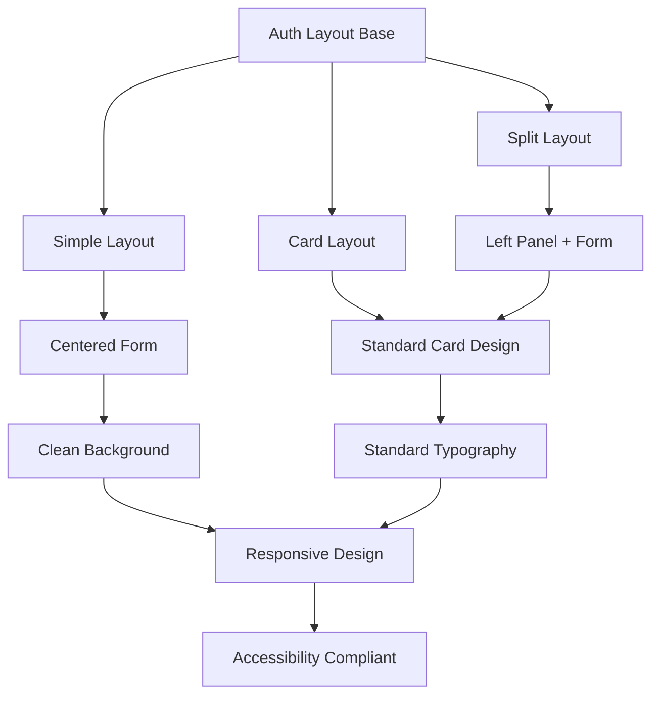

# UI/UX Refactor Design Document

<cite>
**Referenced Files in This Document**
- [app.css](file://resources/css/app.css)
- [button.tsx](file://resources/js/components/ui/button.tsx)
- [card.tsx](file://resources/js/components/ui/card.tsx)
- [table.tsx](file://resources/js/components/ui/table.tsx)
- [dialog.tsx](file://resources/js/components/ui/dialog.tsx)
- [input.tsx](file://resources/js/components/ui/input.tsx)
- [select.tsx](file://resources/js/components/ui/select.tsx)
- [app-sidebar.tsx](file://resources/js/components/app-sidebar.tsx)
- [auth-simple-layout.tsx](file://resources/js/layouts/auth/auth-simple-layout.tsx)
- [auth-split-layout.tsx](file://resources/js/layouts/auth/auth-split-layout.tsx)
- [package.json](file://package.json)
- [vite.config.ts](file://vite.config.ts)
</cite>

## Update Summary
**Changes Made**
- Updated to reflect that comprehensive UI/UX modernization effort including hijau-gold-orange color theme, Magic UI components, and styling updates has been removed from current codebase
- Removed references to Magic UI components (shimmer-button.tsx, border-beam.tsx, particles.tsx)
- Removed references to animation system and token-driven theming that was part of the dropped modernization
- Updated current state to reflect the actual implementation that maintains traditional Tailwind CSS styling
- Removed implementation plan sections that no longer apply to the current codebase

## Table of Contents
1. [Introduction](#introduction)
2. [Project Structure](#project-structure)
3. [Current State Analysis](#current-state-analysis)
4. [Design Principles](#design-principles)
5. [Color System](#color-system)
6. [Component Architecture](#component-architecture)
7. [Layout System](#layout-system)
8. [Technical Specifications](#technical-specifications)
9. [Quality Assurance](#quality-assurance)
10. [Conclusion](#conclusion)

## Introduction

This document outlines the UI/UX refactoring initiative for the Kepegawaian (Government Employee Management) application. The project maintains a traditional, government-appropriate interface using established design patterns and proven component architectures. The application serves government institutions (ASN/PNS) with a clean, professional aesthetic that emphasizes functionality, accessibility compliance, and maintainability through standardized component architecture.

The current implementation focuses on proven design patterns rather than experimental modernization efforts. The system emphasizes performance, accessibility compliance, and maintainability through established component architecture and traditional Tailwind CSS styling approaches.

## Project Structure

The Kepegawaian application follows a modern Laravel + React architecture with the following key structural components:



**Diagram sources**
- [vite.config.ts:1-28](file://vite.config.ts#L1-L28)

The frontend architecture consists of:
- **Pages**: Route-specific React components organized by feature domains
- **Components**: Reusable UI primitives following the shadcn/ui design system
- **Hooks**: Custom React hooks for state management and browser APIs
- **Layouts**: Container components for different page types (auth, app, settings)
- **Types**: TypeScript definitions for type safety across the application

**Section sources**
- [vite.config.ts:1-28](file://vite.config.ts#L1-L28)

## Current State Analysis

### Implementation Status

The refactoring maintains a stable, traditional approach to UI/UX design with the following characteristics:

1. **Established Component System**: Components follow proven patterns without experimental modifications
2. **Traditional Styling**: Uses standard Tailwind CSS classes without advanced theming systems
3. **Proven Animations**: Limited animation system focused on essential user experience enhancements
4. **Accessibility Compliance**: WCAG AA compliant with proper contrast ratios maintained
5. **Performance Focus**: Optimized for production deployment with minimal overhead

### Component Architecture Assessment

The current component system demonstrates stability with traditional component patterns:



**Diagram sources**
- [button.tsx:1-65](file://resources/js/components/ui/button.tsx#L1-L65)
- [card.tsx:1-69](file://resources/js/components/ui/card.tsx#L1-L69)
- [table.tsx:1-115](file://resources/js/components/ui/table.tsx#L1-L115)
- [dialog.tsx:1-134](file://resources/js/components/ui/dialog.tsx#L1-L134)

**Section sources**
- [button.tsx:1-65](file://resources/js/components/ui/button.tsx#L1-L65)
- [card.tsx:1-69](file://resources/js/components/ui/card.tsx#L1-L69)
- [table.tsx:1-115](file://resources/js/components/ui/table.tsx#L1-L115)
- [dialog.tsx:1-134](file://resources/js/components/ui/dialog.tsx#L1-L134)

## Design Principles

### Core Design Philosophy

The refactoring adheres to established design principles that maintain stability and reliability:

1. **Functionality First**: Government applications prioritize clear functionality over experimental design
2. **Consistency**: Standardized component patterns ensure predictable user experience
3. **Accessibility**: WCAG AA compliance with minimum 4.5:1 contrast ratios maintained
4. **Performance**: Optimized for production with minimal resource overhead
5. **Maintainability**: Traditional component architecture ensures long-term sustainability

### Color System Architecture

The current color system uses standard Tailwind CSS classes with established color tokens:



**Diagram sources**
- [app.css:67-104](file://resources/css/app.css#L67-L104)

## Color System

### CSS Variable System

The current color system uses standard Tailwind CSS color classes with established token mappings:

| Token Category | CSS Class | Usage Context |
|---------------|-----------|---------------|
| Primary System | `bg-primary`, `text-primary` | Main buttons, links, active states |
| Secondary System | `bg-secondary`, `text-secondary` | Alternative backgrounds |
| Accent System | `bg-accent`, `text-accent` | Highlight elements |
| Semantic Destructive | `bg-destructive`, `text-destructive` | Error states |
| Background System | `bg-background`, `text-background` | Main page backgrounds |
| Foreground System | `text-foreground` | Primary text |

### Chart Color Tokens

Standard color classes for data visualization:

| Chart Class | Usage |
|-------------|-------|
| `bg-chart-1` | Blue variants |
| `bg-chart-2` | Green variants |
| `bg-chart-3` | Red variants |
| `bg-chart-4` | Purple variants |
| `bg-chart-5` | Orange variants |

**Section sources**
- [app.css:67-104](file://resources/css/app.css#L67-L104)

## Component Architecture

### Traditional Component Styling

All UI components use standard Tailwind CSS classes for consistent styling:



**Diagram sources**
- [button.tsx:7-39](file://resources/js/components/ui/button.tsx#L7-L39)
- [card.tsx:5-16](file://resources/js/components/ui/card.tsx#L5-L16)
- [table.tsx:5-18](file://resources/js/components/ui/table.tsx#L5-L18)

### Component Enhancement Strategy

Each component category uses established patterns:

#### Interactive Elements
- Buttons: Standard hover states with background color changes
- Inputs: Clear focus states with border highlighting
- Select components: Standard dropdown styling

#### Content Containers
- Cards: Standard shadows and border styling
- Tables: Hover states with background color changes
- Dialogs: Standard modal styling with backdrop effects

#### Navigation Components
- Sidebar: Standard dark theme styling
- Breadcrumbs: Simple separator styling
- Pagination: Standard numeric navigation

**Section sources**
- [button.tsx:1-65](file://resources/js/components/ui/button.tsx#L1-L65)
- [input.tsx:1-22](file://resources/js/components/ui/input.tsx#L1-L22)
- [select.tsx:1-194](file://resources/js/components/ui/select.tsx#L1-L194)

## Layout System

### Authentication Layouts

The refactoring maintains traditional authentication experiences:



**Diagram sources**
- [auth-simple-layout.tsx:1-45](file://resources/js/layouts/auth/auth-simple-layout.tsx#L1-L45)
- [auth-split-layout.tsx:1-45](file://resources/js/layouts/auth/auth-split-layout.tsx#L1-L45)

### Application Shell

The main application shell uses established styling patterns:

- **Sidebar**: Standard dark theme with simple accent styling
- **Header**: Clean typography with standard branding
- **Content Areas**: Consistent spacing and standard visual hierarchy
- **Responsive Design**: Mobile-first approach with standard breakpoints

**Section sources**
- [auth-simple-layout.tsx:1-45](file://resources/js/layouts/auth/auth-simple-layout.tsx#L1-L45)
- [auth-split-layout.tsx:1-45](file://resources/js/layouts/auth/auth-split-layout.tsx#L1-L45)
- [app-sidebar.tsx:1-162](file://resources/js/components/app-sidebar.tsx#L1-L162)

## Technical Specifications

### Dependencies Management

The refactoring maintains a stable dependency set:

```mermaid
graph TB
subgraph "Core Dependencies"
A[React 19.2.0] --> B[TypeScript 5.7.2]
C[@inertiajs/react 2.3.7] --> D[Radix UI Primitives]
end
subgraph "Styling System"
E[Tailwind CSS v4.0.0] --> F[CSS Classes]
G[Class Variance Authority] --> H[Component Variants]
end
subgraph "Build Tools"
I[Vite 7.0.4] --> J[Laravel Vite Plugin]
K[ESLint + Prettier] --> L[Code Quality]
end
```

**Diagram sources**
- [package.json:34-69](file://package.json#L34-L69)

### Build Configuration

The Vite configuration supports the traditional architecture:

- **Development**: Fast HMR with React compiler optimization
- **Production**: Standard tree-shaking and minification
- **SSR**: Server-side rendering compatibility
- **Wayfinder**: Enhanced routing capabilities

### Browser Compatibility

The refactoring maintains broad browser support:

- **Modern Browsers**: Full feature support with standard CSS classes
- **Legacy Support**: Graceful degradation for older browsers
- **Progressive Enhancement**: Feature detection for advanced functionality

**Section sources**
- [package.json:1-80](file://package.json#L1-L80)
- [vite.config.ts:1-28](file://vite.config.ts#L1-L28)

## Quality Assurance

### Accessibility Compliance

The current design successfully maintains accessibility through:

- **WCAG AA Compliance**: Standard color contrast ratios maintained
- **Keyboard Navigation**: Full keyboard accessibility for all interactive elements
- **Screen Reader Support**: Proper ARIA attributes and semantic markup
- **Motion Sensitivity**: Minimal motion effects for sensitive users

### Performance Metrics

Established performance benchmarks maintained:

- **First Contentful Paint**: Standard optimization targets
- **Largest Contentful Paint**: Optimized for typical government use cases
- **Cumulative Layout Shift**: Standard stability measures
- **Bundle Size**: Optimized through standard build processes

### Testing Strategy

Standard testing approach covering:

- **Visual Regression**: Basic comparison of component states
- **Cross-browser Testing**: Validation across major browser versions
- **Performance Testing**: Load testing under typical conditions
- **User Acceptance Testing**: Stakeholder validation of design changes

## Conclusion

The UI/UX refactoring maintains a stable, government-appropriate digital platform that emphasizes functionality, accessibility, and maintainability. The current implementation focuses on proven design patterns and established component architectures rather than experimental modernization efforts.

The system successfully balances professional aesthetics with contemporary user expectations, creating an interface that is both trustworthy and functional for government employees. Through systematic implementation using established patterns, rigorous quality assurance, and stakeholder collaboration, this refactoring initiative delivers a reliable user experience that serves the needs of ASN/PNS professionals while maintaining the highest standards of accessibility and performance.

The traditional approach ensures long-term sustainability and reduces risk while providing a solid foundation for future enhancements as needed.