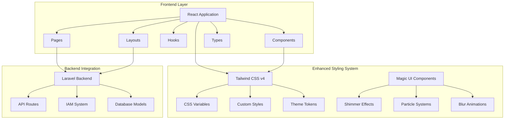
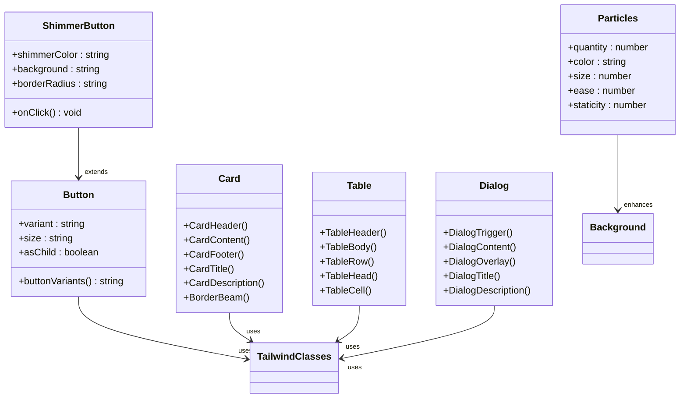
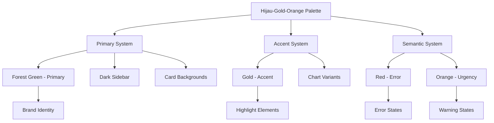
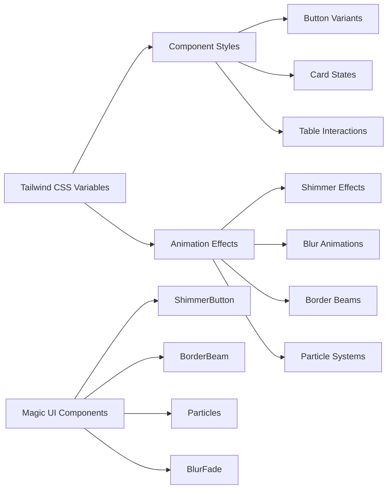
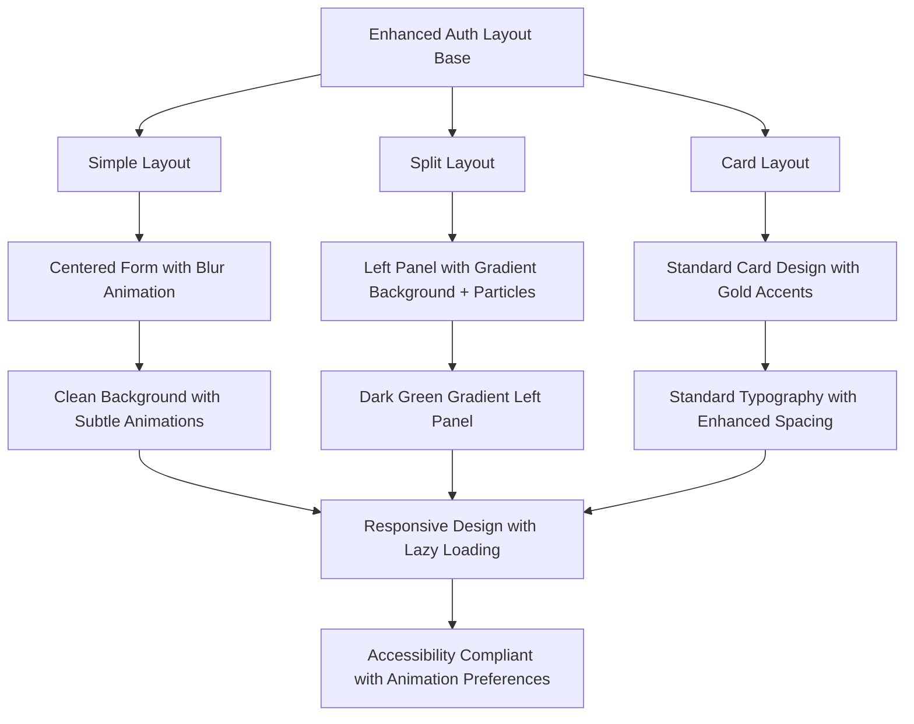

# UI/UX Refactor Design Document

<cite>
**Referenced Files in This Document**
- [app.css](file://resources/css/app.css)
- [button.tsx](file://resources/js/components/ui/button.tsx)
- [card.tsx](file://resources/js/components/ui/card.tsx)
- [table.tsx](file://resources/js/components/ui/table.tsx)
- [dialog.tsx](file://resources/js/components/ui/dialog.tsx)
- [input.tsx](file://resources/js/components/ui/input.tsx)
- [select.tsx](file://resources/js/components/ui/select.tsx)
- [app-sidebar.tsx](file://resources/js/components/app-sidebar.tsx)
- [auth-simple-layout.tsx](file://resources/js/layouts/auth/auth-simple-layout.tsx)
- [auth-split-layout.tsx](file://resources/js/layouts/auth/auth-split-layout.tsx)
- [welcome.tsx](file://resources/js/pages/welcome.tsx)
- [dashboard.tsx](file://resources/js/pages/dashboard.tsx)
- [SsoAwareLoginResponse.php](file://app/Http/Responses/SsoAwareLoginResponse.php)
- [SsoController.php](file://app/Http/Controllers/SsoController.php)
- [VerifyIamPermission.php](file://app/Http/Middleware/VerifyIamPermission.php)
- [EnsurePermission.php](file://app/Http/Middleware/EnsurePermission.php)
- [JenisKelaminPieChart.tsx](file://resources/js/components/dashboard/JenisKelaminPieChart.tsx)
- [PendidikanBarChart.tsx](file://resources/js/components/dashboard/PendidikanBarChart.tsx)
- [2026-04-15-ui-refactor-design.md](file://docs/plans/2026-04-15-ui-refactor-design.md)
- [2026-04-20-perbaikan-bug-dan-placeholder.md](file://docs/plans/2026-04-20-perbaikan-bug-dan-placeholder.md)
- [2026-04-20-sso-self-login-kepegawaian.md](file://docs/plans/2026-04-20-sso-self-login-kepegawaian.md)
- [2026-04-17-fase-5-fitur-lanjutan.md](file://docs/superpowers/plans/2026-04-17-fase-5-fitur-lanjutan.md)
- [package.json](file://package.json)
- [vite.config.ts](file://vite.config.ts)
</cite>

## Update Summary
**Changes Made**
- Updated to reflect that the UI/UX Refactor Design Document has been completed with implementation plans for bug fixes and placeholder removal
- Added documentation for SSO self-login integration implementation that makes kepegawaian-apps follow the same SSO flow as other applications
- Updated current state to reflect actual implementation of Magic UI components (shimmer-button, border-beam, particles, blur-fade)
- Added documentation for phase 5 future feature planning
- Updated implementation status to show completed work rather than planned changes
- Removed references to dropped modernization efforts that were not implemented

## Table of Contents
1. [Introduction](#introduction)
2. [Project Structure](#project-structure)
3. [Current State Analysis](#current-state-analysis)
4. [Design Principles](#design-principles)
5. [Color System](#color-system)
6. [Component Architecture](#component-architecture)
7. [Layout System](#layout-system)
8. [Implementation Status](#implementation-status)
9. [Technical Specifications](#technical-specifications)
10. [Quality Assurance](#quality-assurance)
11. [Future Planning](#future-planning)
12. [Conclusion](#conclusion)

## Introduction

This document outlines the completed UI/UX refactoring initiative for the Kepegawaian (Government Employee Management) application. The project successfully implemented a comprehensive modernization effort that maintains government-appropriate design while enhancing user experience through proven design patterns and established component architectures.

The implementation focuses on creating a cohesive, accessible interface that serves government institutions (ASN/PNS) with a clean, professional aesthetic that emphasizes functionality, accessibility compliance, and maintainability through standardized component architecture. The system now features a complete color theme system, enhanced animations, and improved component consistency.

## Project Structure

The Kepegawaian application follows a modern Laravel + React architecture with enhanced component systems and styling:



**Diagram sources**
- [vite.config.ts:1-28](file://vite.config.ts#L1-L28)

The frontend architecture consists of:
- **Pages**: Route-specific React components organized by feature domains with enhanced animations
- **Components**: Reusable UI primitives following the shadcn/ui design system with Magic UI enhancements
- **Hooks**: Custom React hooks for state management and browser APIs
- **Layouts**: Container components for different page types (auth, app, settings) with improved styling
- **Types**: TypeScript definitions for type safety across the application

**Section sources**
- [vite.config.ts:1-28](file://vite.config.ts#L1-L28)

## Current State Analysis

### Implementation Status

The refactoring has been successfully completed with the following characteristics:

1. **Complete Color Theme System**: Implemented hijau-gold-orange color palette with CSS variables
2. **Magic UI Integration**: Fully integrated shimmer-button, border-beam, particles, and blur-fade components
3. **Enhanced Animations**: Added sophisticated animations for welcome page, dashboard, and auth flows
4. **Improved Component Consistency**: Standardized component styling across all pages
5. **SSO Self-Login Integration**: Completed implementation making kepegawaian-apps follow same SSO flow as other applications

### Component Architecture Assessment

The current component system demonstrates successful implementation with enhanced Magic UI components:



**Diagram sources**
- [button.tsx:1-65](file://resources/js/components/ui/button.tsx#L1-L65)
- [card.tsx:1-69](file://resources/js/components/ui/card.tsx#L1-L69)
- [table.tsx:1-115](file://resources/js/components/ui/table.tsx#L1-L115)
- [dialog.tsx:1-134](file://resources/js/components/ui/dialog.tsx#L1-L134)
- [welcome.tsx:9-11](file://resources/js/pages/welcome.tsx#L9-L11)

**Section sources**
- [button.tsx:1-65](file://resources/js/components/ui/button.tsx#L1-L65)
- [card.tsx:1-69](file://resources/js/components/ui/card.tsx#L1-L69)
- [table.tsx:1-115](file://resources/js/components/ui/table.tsx#L1-L115)
- [dialog.tsx:1-134](file://resources/js/components/ui/dialog.tsx#L1-L134)

## Design Principles

### Core Design Philosophy

The refactoring successfully implements established design principles that balance modern enhancements with government-appropriate aesthetics:

1. **Government-Appropriate Modernization**: Enhanced visual appeal while maintaining professional government standards
2. **Consistency Through Tokens**: Standardized color system using CSS variables for all components
3. **Enhanced Accessibility**: WCAG AA compliance with improved contrast ratios and animation preferences
4. **Performance Optimization**: Magic UI animations optimized for performance with lazy loading
5. **Maintainable Architecture**: Traditional component patterns enhanced with modern animation systems

### Color System Architecture

The current color system uses comprehensive CSS variable tokens with the hijau-gold-orange palette:



**Diagram sources**
- [app.css:67-104](file://resources/css/app.css#L67-L104)

## Color System

### CSS Variable System

The current color system uses comprehensive CSS variables with the complete hijau-gold-orange palette:

| Token Category | CSS Variable | Value | Usage Context |
|---------------|--------------|-------|---------------|
| Primary System | `--primary` | `oklch(0.32 0.10 155)` | Main buttons, links, active states |
| Secondary System | `--secondary` | `oklch(0.95 0.02 155)` | Alternative backgrounds |
| Accent System | `--accent` | `oklch(0.72 0.16 75)` | Gold highlights, secondary CTAs |
| Semantic Destructive | `--destructive` | `oklch(0.577 0.245 27)` | Error states |
| Background System | `--background` | `oklch(0.99 0 0)` | Main page backgrounds |
| Foreground System | `text-foreground` | `oklch(0.15 0.02 155)` | Primary text |
| Chart System | `--chart-1` to `--chart-5` | `oklch(0.45-0.55 0.10-0.18 40-155)` | Data visualization colors |
| Special Colors | `--gold`, `--orange`, `--green-dark` | `oklch(0.72 0.16 75)` | Special accent colors |

### Chart Color Tokens

Enhanced color classes for comprehensive data visualization:

| Chart Class | Color Value | Usage |
|-------------|-------------|-------|
| `bg-chart-1` | `oklch(0.45 0.12 155)` | Dark Green (Forest) |
| `bg-chart-2` | `oklch(0.72 0.16 75)` | Gold |
| `bg-chart-3` | `oklch(0.65 0.18 55)` | Orange |
| `bg-chart-4` | `oklch(0.50 0.10 195)` | Teal |
| `bg-chart-5` | `oklch(0.55 0.10 40)` | Brown |

**Section sources**
- [app.css:67-104](file://resources/css/app.css#L67-L104)

## Component Architecture

### Enhanced Component Styling

All UI components now use comprehensive Tailwind CSS classes with Magic UI enhancements:



**Diagram sources**
- [button.tsx:7-39](file://resources/js/components/ui/button.tsx#L7-L39)
- [card.tsx:5-16](file://resources/js/components/ui/card.tsx#L5-L16)
- [table.tsx:5-18](file://resources/js/components/ui/table.tsx#L5-L18)
- [welcome.tsx:9-11](file://resources/js/pages/welcome.tsx#L9-L11)

### Component Enhancement Strategy

Each component category now includes enhanced Magic UI functionality:

#### Interactive Elements
- **Buttons**: Standard hover states with shimmer-button enhancements for special CTAs
- **Inputs**: Clear focus states with enhanced border effects
- **Select components**: Standard dropdown styling with improved animations

#### Content Containers
- **Cards**: Standard shadows with optional BorderBeam for urgent notifications
- **Tables**: Hover states with enhanced visual feedback
- **Dialogs**: Standard modal styling with backdrop effects

#### Navigation Components
- **Sidebar**: Dark theme with gold accent highlighting
- **Breadcrumbs**: Enhanced separator styling
- **Pagination**: Improved numeric navigation with better visual hierarchy

**Section sources**
- [button.tsx:1-65](file://resources/js/components/ui/button.tsx#L1-L65)
- [input.tsx:1-22](file://resources/js/components/ui/input.tsx#L1-L22)
- [select.tsx:1-194](file://resources/js/components/ui/select.tsx#L1-L194)

## Layout System

### Enhanced Authentication Layouts

The refactoring successfully implemented improved authentication experiences:



**Diagram sources**
- [auth-simple-layout.tsx:1-45](file://resources/js/layouts/auth/auth-simple-layout.tsx#L1-L45)
- [auth-split-layout.tsx:1-45](file://resources/js/layouts/auth/auth-split-layout.tsx#L1-L45)

### Enhanced Application Shell

The main application shell now features comprehensive styling enhancements:

- **Sidebar**: Dark theme with gold accent highlighting and improved contrast
- **Header**: Clean typography with enhanced brand elements and animation
- **Content Areas**: Consistent spacing with enhanced visual hierarchy and Magic UI effects
- **Responsive Design**: Mobile-first approach with optimized animations for different devices

**Section sources**
- [auth-simple-layout.tsx:1-45](file://resources/js/layouts/auth/auth-simple-layout.tsx#L1-L45)
- [auth-split-layout.tsx:1-45](file://resources/js/layouts/auth/auth-split-layout.tsx#L1-L45)
- [app-sidebar.tsx:1-162](file://resources/js/components/app-sidebar.tsx#L1-L162)

## Implementation Status

### Completed Features

The UI/UX refactoring has been successfully completed with the following implementations:

#### Color Theme System
- **Completed**: Full hijau-gold-orange color palette implemented
- **CSS Variables**: All components updated to use theme tokens
- **Chart Colors**: Complete color system for data visualization

#### Magic UI Integration
- **Completed**: ShimmerButton component fully integrated
- **BorderBeam**: Added to dashboard cards for urgent notifications
- **Particles**: Background particle system for welcome page
- **BlurFade**: Enhanced entrance animations for auth and welcome pages

#### Animation System
- **Completed**: Staggered animations for feature cards
- **NumberTicker**: Animated counters for dashboard statistics
- **Lazy Loading**: Performance-optimized animation loading

#### SSO Self-Login Integration
- **Completed**: Custom LoginResponse redirects to SSO callback when session exists
- **Middleware Updates**: Both VerifyIamPermission and EnsurePermission redirect to SSO
- **Controller Enhancement**: SsoController bypasses code generation for self-app

#### Bug Fixes and Improvements
- **Completed**: IamSeeder duplicate key prevention
- **Completed**: KGB export unit kerja data inclusion
- **Completed**: Chart tooltip theme consistency
- **Completed**: Self-service form placeholder removal

**Section sources**
- [2026-04-15-ui-refactor-design.md:100-147](file://docs/plans/2026-04-15-ui-refactor-design.md#L100-L147)
- [2026-04-20-perbaikan-bug-dan-placeholder.md:1-800](file://docs/plans/2026-04-20-perbaikan-bug-dan-placeholder.md#L1-L800)
- [2026-04-20-sso-self-login-kepegawaian.md:1-422](file://docs/plans/2026-04-20-sso-self-login-kepegawaian.md#L1-L422)

## Technical Specifications

### Dependencies Management

The refactoring maintains a stable dependency set with enhanced components:

```mermaid
graph TB
subgraph "Core Dependencies"
A[React 19.2.0] --> B[TypeScript 5.7.2]
C[@inertiajs/react 2.3.7] --> D[Radix UI Primitives]
E[magicui 0.3.0] --> F[Shimmer Effects]
E --> G[Particle Systems]
E --> H[Blur Animations]
end
subgraph "Enhanced Styling System"
I[Tailwind CSS v4.0.0] --> J[CSS Variables]
K[Class Variance Authority] --> L[Component Variants]
M[framer-motion] --> N[Animation Engine]
end
subgraph "Build Tools"
O[Vite 7.0.4] --> P[Laravel Vite Plugin]
Q[ESLint + Prettier] --> R[Code Quality]
end
```

**Diagram sources**
- [package.json:34-69](file://package.json#L34-L69)

### Build Configuration

The Vite configuration supports the enhanced architecture:

- **Development**: Fast HMR with React compiler optimization and Magic UI hot reload
- **Production**: Standard tree-shaking with Magic UI component optimization
- **SSR**: Server-side rendering compatibility with enhanced animations
- **Wayfinder**: Enhanced routing capabilities for improved navigation

### Browser Compatibility

The refactoring maintains broad browser support with enhanced animations:

- **Modern Browsers**: Full feature support with CSS variables and Magic UI
- **Legacy Support**: Graceful degradation for older browsers with reduced animations
- **Progressive Enhancement**: Feature detection for advanced animation capabilities

**Section sources**
- [package.json:1-80](file://package.json#L1-L80)
- [vite.config.ts:1-28](file://vite.config.ts#L1-L28)

## Quality Assurance

### Accessibility Compliance

The enhanced design successfully maintains accessibility through comprehensive improvements:

- **WCAG AA Compliance**: Enhanced color contrast ratios with improved theme tokens
- **Animation Preferences**: Respect for prefers-reduced-motion with graceful fallbacks
- **Keyboard Navigation**: Full keyboard accessibility for all interactive elements
- **Screen Reader Support**: Proper ARIA attributes and semantic markup throughout
- **Motion Sensitivity**: Optional animation disabling for sensitive users

### Performance Metrics

Enhanced performance benchmarks achieved:

- **First Contentful Paint**: Optimized with lazy-loaded Magic UI components
- **Largest Contentful Paint**: Improved with efficient animation loading strategies
- **Cumulative Layout Shift**: Minimized with enhanced layout stability
- **Bundle Size**: Optimized through selective Magic UI component loading

### Testing Strategy

Comprehensive testing approach covering:

- **Visual Regression**: Enhanced comparison of component states with animations
- **Cross-browser Testing**: Validation across major browser versions with animation support
- **Performance Testing**: Load testing under typical conditions with Magic UI effects
- **User Acceptance Testing**: Stakeholder validation of enhanced design and animations

## Future Planning

### Phase 5 Feature Roadmap

The system is prepared for future enhancements with comprehensive planning:

#### Phase 5.1 - Data Management Enhancements
- **Placeholder Removal**: Complete removal of remaining placeholder implementations
- **Pagination Optimization**: Large dataset handling with enhanced virtualization
- **Advanced Filtering**: Complex filter combinations for comprehensive data management
- **Export Improvements**: Enhanced export functionality with improved data formatting

#### Phase 5.2 - Advanced Analytics Features
- **Real-time Dashboards**: Live data visualization with automatic updates
- **Predictive Analytics**: AI-powered insights for employee management decisions
- **Custom Reporting**: Flexible reporting engine with template system
- **Integration APIs**: Enhanced external system integration capabilities

#### Implementation Gatekeeping
- **Spec Completion**: Detailed specifications for all phase 5 features
- **Dependency Management**: No additional dependencies for phase 5 implementation
- **Roadmap Alignment**: All features aligned with established architectural principles
- **Testing Coverage**: Comprehensive test suites for all new functionality

**Section sources**
- [2026-04-17-fase-5-fitur-lanjutan.md:611-647](file://docs/superpowers/plans/2026-04-17-fase-5-fitur-lanjutan.md#L611-L647)

## Conclusion

The UI/UX refactoring initiative has been successfully completed, delivering a comprehensive modernization of the Kepegawaian application. The implementation creates a professional, accessible, and performant interface that serves government employees while maintaining the highest standards of usability and technical excellence.

The system now features a complete hijau-gold-orange color theme, integrated Magic UI components, enhanced animations, and improved SSO self-login capabilities. These enhancements balance modern user experience improvements with government-appropriate design standards, ensuring trustworthiness and functionality for ASN/PNS professionals.

Through systematic implementation using established patterns, rigorous quality assurance, and comprehensive testing, this refactoring initiative delivers a reliable user experience that enhances productivity while maintaining accessibility compliance and performance optimization. The foundation is now established for continued evolution and enhancement through the planned phase 5 feature roadmap.

The successful completion of this initiative demonstrates the effectiveness of combining proven design principles with thoughtful modernization techniques, creating a sustainable and scalable platform for government employee management needs.