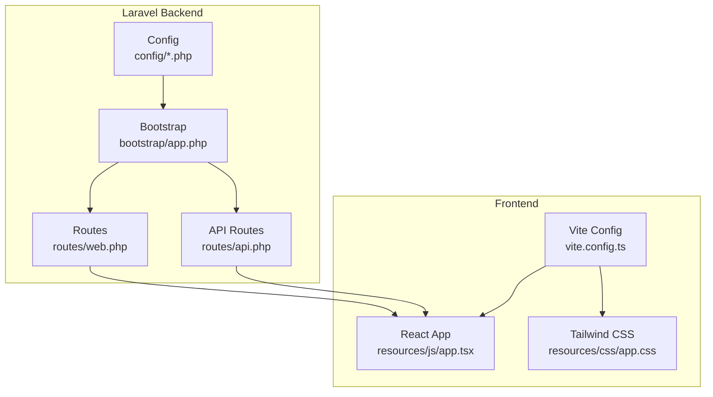
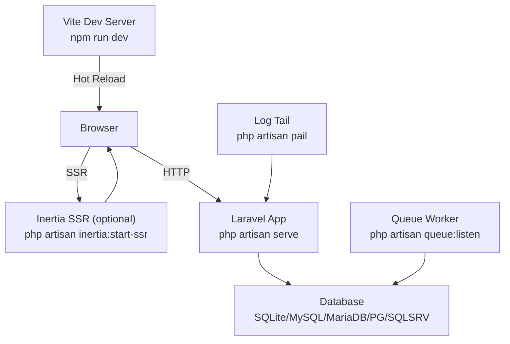
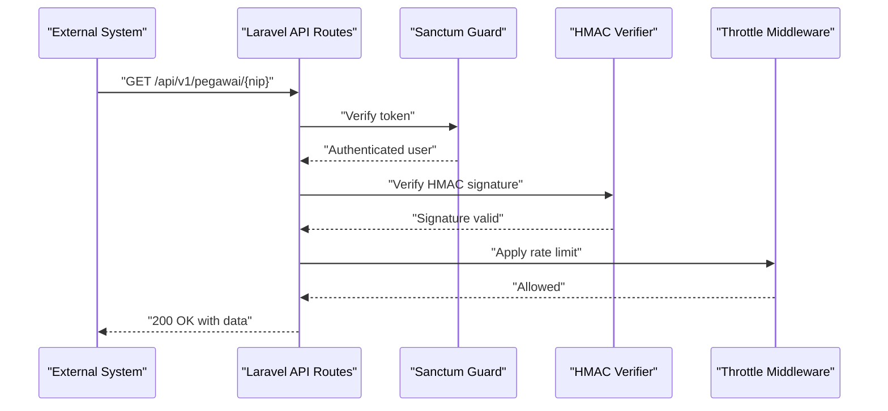
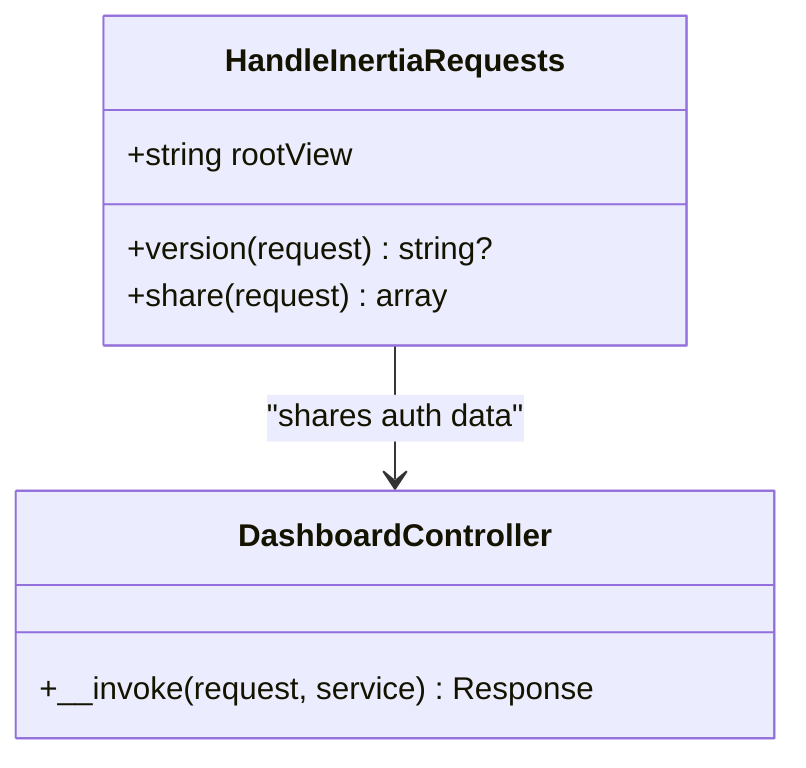
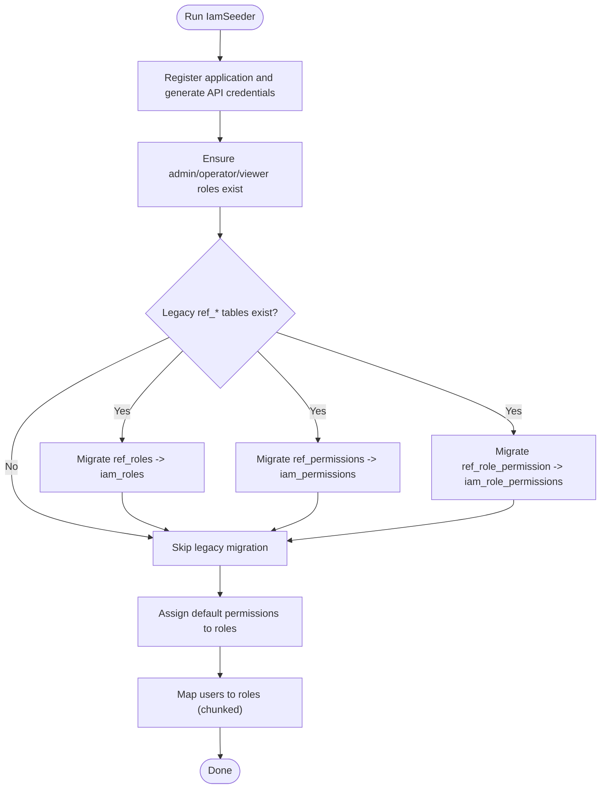
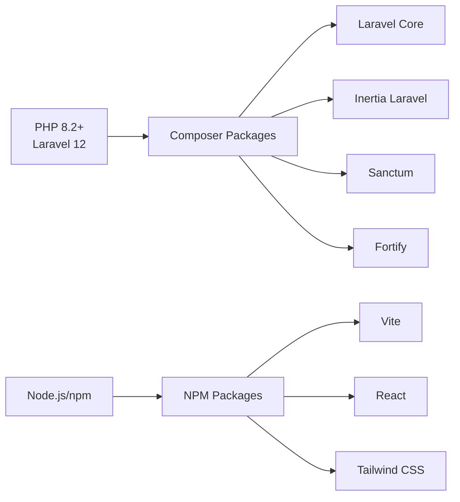

# Getting Started

<cite>
**Referenced Files in This Document**
- [composer.json](file://composer.json)
- [package.json](file://package.json)
- [vite.config.ts](file://vite.config.ts)
- [.env.example](file://.env.example)
- [config/app.php](file://config/app.php)
- [config/database.php](file://config/database.php)
- [config/iam.php](file://config/iam.php)
- [config/kepegawaian.php](file://config/kepegawaian.php)
- [bootstrap/app.php](file://bootstrap/app.php)
- [routes/web.php](file://routes/web.php)
- [routes/api.php](file://routes/api.php)
- [phpunit.xml](file://phpunit.xml)
- [app/Http/Middleware/HandleInertiaRequests.php](file://app/Http/Middleware/HandleInertiaRequests.php)
- [app/Http/Controllers/DashboardController.php](file://app/Http/Controllers/DashboardController.php)
- [database/seeders/IamSeeder.php](file://database/seeders/IamSeeder.php)
</cite>

## Table of Contents
1. [Introduction](#introduction)
2. [Project Structure](#project-structure)
3. [Core Components](#core-components)
4. [Architecture Overview](#architecture-overview)
5. [Detailed Component Analysis](#detailed-component-analysis)
6. [Dependency Analysis](#dependency-analysis)
7. [Performance Considerations](#performance-considerations)
8. [Troubleshooting Guide](#troubleshooting-guide)
9. [Conclusion](#conclusion)
10. [Appendices](#appendices)

## Introduction
This guide helps you install and run the Kepegawaian Apps system locally. It covers prerequisites, environment setup, database configuration, migrations, seeding, frontend asset builds, development server startup, and testing. It also documents the development workflow, including concurrent server startup, hot reload, and local best practices.

## Project Structure
Kepegawaian Apps is a Laravel 12 application with an Inertia.js React frontend. The backend is PHP 8.2+, and the frontend uses Vite with React and Tailwind CSS. The project includes:
- Laravel application bootstrapped via a modern configuration file
- Inertia middleware for sharing data to the frontend
- Multiple route groups for dashboards, kepegawaian CRUD, monitoring, references, self-service, and IAM administration
- API routes with layered security (Sanctum, HMAC, rate limiting)
- Comprehensive seeder for IAM roles, permissions, and default roles

**Diagram sources**
- [bootstrap/app.php:11-35](file://bootstrap/app.php#L11-L35)
- [routes/web.php:1-139](file://routes/web.php#L1-L139)
- [routes/api.php:1-48](file://routes/api.php#L1-L48)
- [config/app.php:16-127](file://config/app.php#L16-L127)
- [vite.config.ts:1-28](file://vite.config.ts#L1-L28)

**Section sources**
- [composer.json:11-19](file://composer.json#L11-L19)
- [package.json:32-67](file://package.json#L32-L67)
- [bootstrap/app.php:11-35](file://bootstrap/app.php#L11-L35)
- [routes/web.php:1-139](file://routes/web.php#L1-L139)
- [routes/api.php:1-48](file://routes/api.php#L1-L48)
- [vite.config.ts:1-28](file://vite.config.ts#L1-L28)

## Core Components
- PHP 8.2+ runtime and Composer packages for Laravel 12, Inertia, Sanctum, and Fortify
- Node.js/npm for frontend tooling (Vite, React, TypeScript, ESLint, Prettier)
- Database configuration supporting SQLite (default), MySQL, MariaDB, PostgreSQL, and SQL Server
- Laravel application configuration for name, environment, debug, URL, timezone, locale, encryption key, and maintenance mode
- Inertia middleware that shares application and user data to the React frontend
- IAM configuration for token TTL, SSO code TTL, and app slug
- API routes secured with Sanctum, HMAC verification, and throttling

**Section sources**
- [composer.json:11-19](file://composer.json#L11-L19)
- [package.json:32-67](file://package.json#L32-L67)
- [config/database.php:20-185](file://config/database.php#L20-L185)
- [config/app.php:16-127](file://config/app.php#L16-L127)
- [app/Http/Middleware/HandleInertiaRequests.php:17-44](file://app/Http/Middleware/HandleInertiaRequests.php#L17-L44)
- [config/iam.php:4-9](file://config/iam.php#L4-L9)
- [routes/api.php:21-48](file://routes/api.php#L21-L48)

## Architecture Overview
The system uses a classic Laravel MVC architecture with an Inertia-driven React SPA. The backend exposes REST-like routes and API endpoints, while the frontend consumes them via Inertia and React components. The database defaults to SQLite for simplicity but supports multiple engines.

**Diagram sources**
- [composer.json:52-60](file://composer.json#L52-L60)
- [vite.config.ts:1-28](file://vite.config.ts#L1-L28)
- [config/database.php:20-185](file://config/database.php#L20-L185)

## Detailed Component Analysis

### Installation and Setup
Follow these steps to set up the project locally:

1. Prerequisites
   - PHP 8.2+ and Composer
   - Node.js and npm
   - A database (SQLite by default; MySQL/MariaDB/PostgreSQL/SQL Server optional)

2. Clone and initialize
   - Copy the repository to your machine
   - Install PHP dependencies: [composer.json:44-51](file://composer.json#L44-L51)
   - Create and populate environment file: [composer.json:46](file://composer.json#L46)
   - Generate application key: [composer.json:47](file://composer.json#L47)
   - Run migrations: [composer.json:48](file://composer.json#L48)
   - Install Node dependencies: [composer.json:49](file://composer.json#L49)
   - Build frontend assets: [composer.json:50](file://composer.json#L50)

3. Environment variables
   - Copy example environment file: [composer.json:46](file://composer.json#L46)
   - Review and adjust variables in the environment file: [.env.example:1-80](file://.env.example#L1-L80)
   - Key variables include application name, environment, debug, URL, locale, database connection, session, queue, cache, Redis, mail, and IAM settings

4. Database configuration
   - Default connection is SQLite: [config/database.php:20](file://config/database.php#L20)
   - To use MySQL/MariaDB/PostgreSQL/SQL Server, update connection settings: [config/database.php:47-115](file://config/database.php#L47-L115)
   - For SQLite, ensure the database file path is writable: [config/database.php:38](file://config/database.php#L38)

5. Migrations and seeding
   - Run migrations: [composer.json:48](file://composer.json#L48)
   - Seed IAM roles and permissions: [database/seeders/IamSeeder.php:17-170](file://database/seeders/IamSeeder.php#L17-L170)

6. Frontend build
   - Install dependencies: [composer.json:49](file://composer.json#L49)
   - Build assets: [composer.json:50](file://composer.json#L50)
   - Or use Vite dev server for hot reload during development: [package.json:8](file://package.json#L8)

7. Initial user creation
   - The seeder creates system roles and default permissions; create users via the application UI or CLI after seeding completes
   - IAM application registration and API credentials are generated by the seeder: [database/seeders/IamSeeder.php:20-34](file://database/seeders/IamSeeder.php#L20-L34)

8. Development server startup
   - Concurrent dev stack (server, queue, logs, Vite): [composer.json:54-55](file://composer.json#L54-L55)
   - SSR variant: [composer.json:56-60](file://composer.json#L56-L60)
   - Standalone commands:
     - Laravel server: [composer.json:54](file://composer.json#L54)
     - Queue worker: [composer.json:54](file://composer.json#L54)
     - Log tail: [composer.json:54](file://composer.json#L54)
     - Vite dev: [package.json:8](file://package.json#L8)

9. Testing environment
   - PHPUnit configuration sets testing environment and in-memory SQLite: [phpunit.xml:20-36](file://phpunit.xml#L20-L36)
   - Run tests: [composer.json:74-78](file://composer.json#L74-L78)

**Section sources**
- [composer.json:44-51](file://composer.json#L44-L51)
- [.env.example:1-80](file://.env.example#L1-L80)
- [config/database.php:20-185](file://config/database.php#L20-L185)
- [database/seeders/IamSeeder.php:17-170](file://database/seeders/IamSeeder.php#L17-L170)
- [package.json:8](file://package.json#L8)
- [composer.json:54-60](file://composer.json#L54-L60)
- [phpunit.xml:20-36](file://phpunit.xml#L20-L36)
- [composer.json:74-78](file://composer.json#L74-L78)

### Environment Variable Reference
Key environment variables and their purpose:
- Application identity and behavior
  - APP_NAME, APP_ENV, APP_DEBUG, APP_URL, APP_LOCALE, APP_FALLBACK_LOCALE, APP_FAKER_LOCALE, BCRYPT_ROUNDS, LOG_LEVEL
- Database selection and credentials
  - DB_CONNECTION, DB_HOST, DB_PORT, DB_DATABASE, DB_USERNAME, DB_PASSWORD, DB_CHARSET, DB_COLLATION, DB_URL, DB_SOCKET, DB_SSLMODE
- Sessions, queues, cache, and filesystems
  - SESSION_DRIVER, QUEUE_CONNECTION, CACHE_STORE, FILESYSTEM_DISK
- Redis
  - REDIS_CLIENT, REDIS_HOST, REDIS_PORT, REDIS_PASSWORD, REDIS_DB, REDIS_CACHE_DB, REDIS_PREFIX
- Mail
  - MAIL_MAILER, MAIL_HOST, MAIL_PORT, MAIL_USERNAME, MAIL_PASSWORD, MAIL_FROM_ADDRESS, MAIL_FROM_NAME
- Vite frontend
  - VITE_APP_NAME
- Attendance integration
  - ATTENDANCE_HMAC_SECRET
- IAM SSO gateway
  - IAM_TOKEN_TTL_HOURS, IAM_SSO_CODE_TTL, IAM_APP_SLUG
- Seeder credentials
  - SEEDER_ADMIN_PASSWORD, SEEDER_OPERATOR_PASSWORD

Notes:
- SQLite is enabled by default; set DB_CONNECTION to mysql, mariadb, pgsql, or sqlsrv for other databases
- For MySQL/MariaDB, ensure charset/collation match your requirements
- For PostgreSQL, set DB_SSLMODE appropriately
- For Redis, configure client, host, port, and database indices

**Section sources**
- [.env.example:1-80](file://.env.example#L1-L80)
- [config/database.php:20-185](file://config/database.php#L20-L185)
- [config/iam.php:4-9](file://config/iam.php#L4-L9)
- [config/kepegawaian.php:15](file://config/kepegawaian.php#L15)

### API Security and Throttling
The API routes implement layered security:
- Sanctum tokens for authentication
- HMAC-SHA256 signature verification for integrity
- Rate limiting to prevent abuse
- IAM-specific signatures for SSO-related endpoints

**Diagram sources**
- [routes/api.php:21-48](file://routes/api.php#L21-L48)

**Section sources**
- [routes/api.php:21-48](file://routes/api.php#L21-L48)

### Inertia Data Sharing
The Inertia middleware shares application and user data to the React frontend, including roles and permissions.

**Diagram sources**
- [app/Http/Middleware/HandleInertiaRequests.php:8-44](file://app/Http/Middleware/HandleInertiaRequests.php#L8-L44)
- [app/Http/Controllers/DashboardController.php:10-19](file://app/Http/Controllers/DashboardController.php#L10-L19)

**Section sources**
- [app/Http/Middleware/HandleInertiaRequests.php:17-44](file://app/Http/Middleware/HandleInertiaRequests.php#L17-L44)
- [app/Http/Controllers/DashboardController.php:10-19](file://app/Http/Controllers/DashboardController.php#L10-L19)

### IAM Roles and Permissions Seeding
The seeder registers the application, ensures default roles exist, migrates legacy roles/permissions, assigns default permissions to roles, and maps users to roles.

**Diagram sources**
- [database/seeders/IamSeeder.php:17-170](file://database/seeders/IamSeeder.php#L17-L170)

**Section sources**
- [database/seeders/IamSeeder.php:17-170](file://database/seeders/IamSeeder.php#L17-L170)

## Dependency Analysis
The project’s runtime and dev dependencies are declared in Composer and npm. Composer scripts orchestrate setup, development, and testing.

**Diagram sources**
- [composer.json:11-19](file://composer.json#L11-L19)
- [package.json:32-67](file://package.json#L32-L67)

**Section sources**
- [composer.json:11-19](file://composer.json#L11-L19)
- [package.json:32-67](file://package.json#L32-L67)

## Performance Considerations
- Use SQLite for local development to minimize overhead; switch to MySQL/MariaDB/PostgreSQL for production-scale workloads
- Keep BCRYPT_ROUNDS reasonable for development; increase for production
- Enable debug logging only in development; tune log level accordingly
- Use Redis for caching and queues in production environments
- Monitor queue workers and SSR processes in concurrent dev runs

[No sources needed since this section provides general guidance]

## Troubleshooting Guide
Common setup issues and resolutions:
- Missing environment file
  - Ensure .env exists and is populated: [composer.json:46](file://composer.json#L46)
- Application key not generated
  - Run key generation: [composer.json:47](file://composer.json#L47)
- Database connection errors
  - Verify DB_CONNECTION and credentials; default is SQLite: [config/database.php:20](file://config/database.php#L20), [config/database.php:38](file://config/database.php#L38)
- Migrations fail
  - Confirm database is accessible and writable; run migrations again: [composer.json:48](file://composer.json#L48)
- Frontend assets not building
  - Install Node dependencies and build: [composer.json:49-50](file://composer.json#L49-L50)
- Concurrent dev stack not starting
  - Ensure ports are free; review script names and order: [composer.json:54-60](file://composer.json#L54-L60)
- Tests failing in CI/local
  - Confirm PHPUnit environment variables and in-memory SQLite: [phpunit.xml:20-36](file://phpunit.xml#L20-L36)

**Section sources**
- [composer.json:46-51](file://composer.json#L46-L51)
- [config/database.php:20-185](file://config/database.php#L20-L185)
- [phpunit.xml:20-36](file://phpunit.xml#L20-L36)

## Conclusion
You now have the complete picture to install, configure, and run Kepegawaian Apps locally. Use the provided scripts to automate setup, leverage the concurrent dev stack for efficient development, and rely on the IAM and API security layers for robust integrations.

[No sources needed since this section summarizes without analyzing specific files]

## Appendices

### Development Workflow Best Practices
- Use the concurrent dev script for simultaneous Laravel server, queue, logs, and Vite: [composer.json:54-55](file://composer.json#L54-L55)
- Enable hot reload via Vite dev server: [package.json:8](file://package.json#L8)
- Keep environment variables consistent across team members using the example file as a template: [.env.example:1-80](file://.env.example#L1-L80)
- Run tests locally before pushing changes: [composer.json:74-78](file://composer.json#L74-L78)

**Section sources**
- [composer.json:54-55](file://composer.json#L54-L55)
- [package.json:8](file://package.json#L8)
- [.env.example:1-80](file://.env.example#L1-L80)
- [composer.json:74-78](file://composer.json#L74-L78)