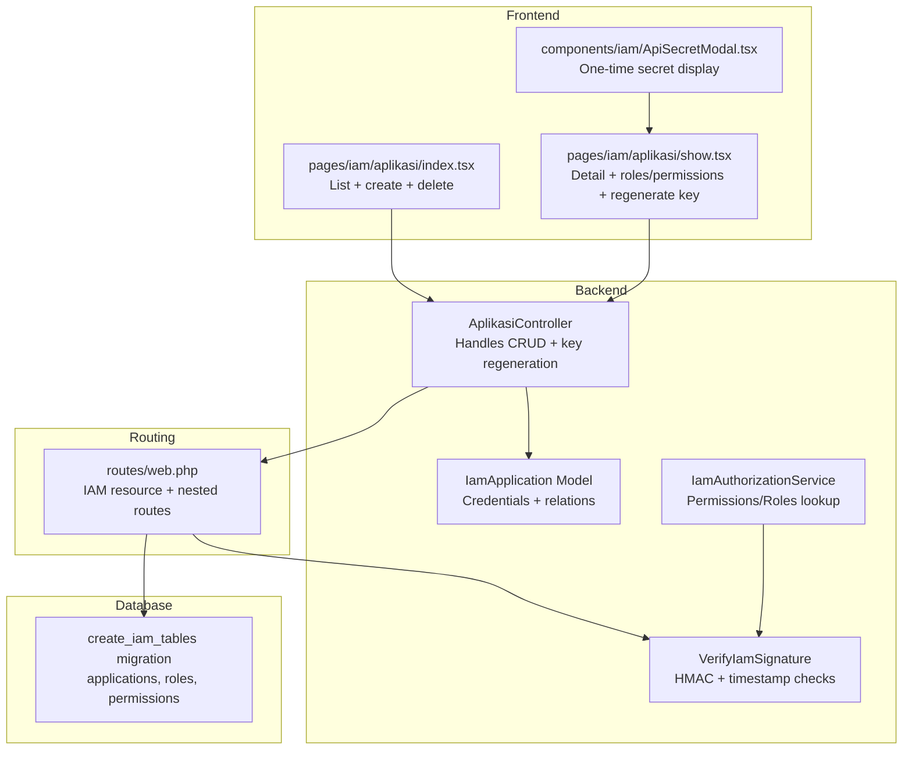
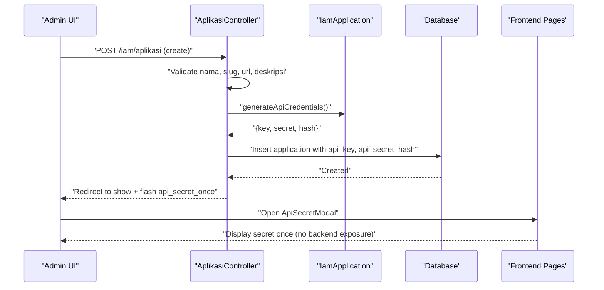
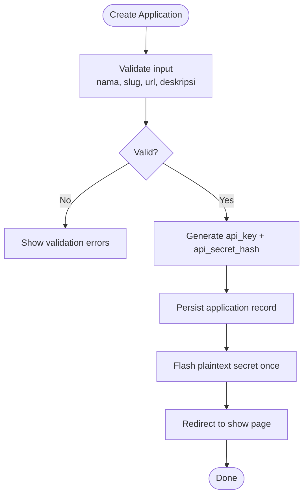
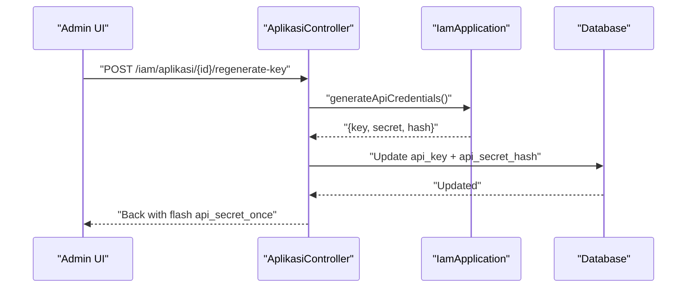
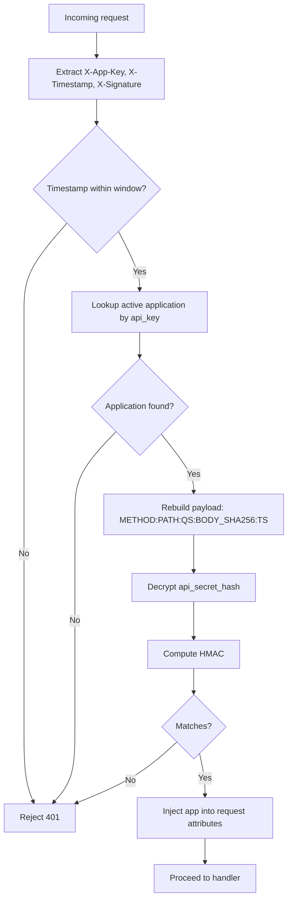
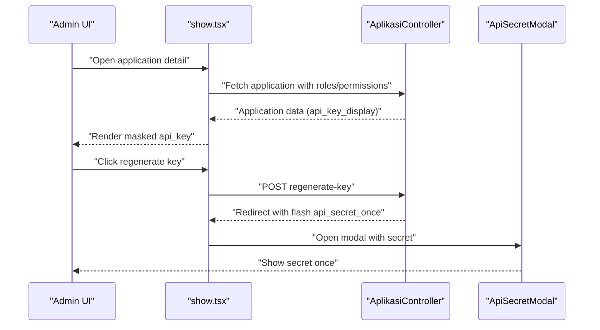
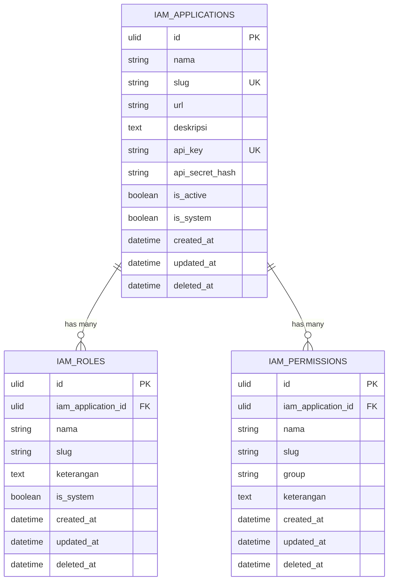
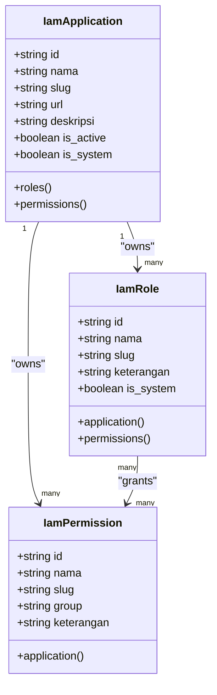
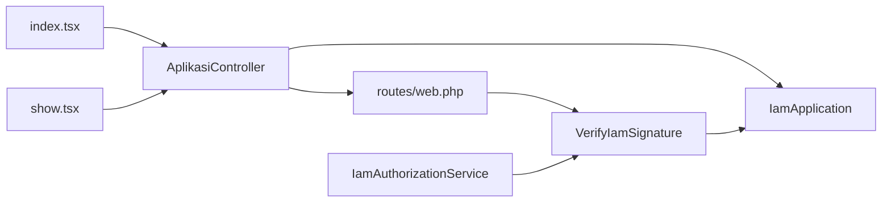

# Application Management

<cite>
**Referenced Files in This Document**
- [AplikasiController.php](file://app/Http/Controllers/Iam/AplikasiController.php)
- [IamApplication.php](file://app/Models/IamApplication.php)
- [index.tsx](file://resources/js/pages/iam/aplikasi/index.tsx)
- [show.tsx](file://resources/js/pages/iam/aplikasi/show.tsx)
- [ApiSecretModal.tsx](file://resources/js/components/iam/ApiSecretModal.tsx)
- [web.php](file://routes/web.php)
- [2026_03_21_000001_create_iam_tables.php](file://database/migrations/2026_03_21_000001_create_iam_tables.php)
- [VerifyIamSignature.php](file://app/Http/Middleware/VerifyIamSignature.php)
- [IamAuthorizationService.php](file://app/Services/IamAuthorizationService.php)
- [AplikasiControllerTest.php](file://tests/Feature/Iam/AplikasiControllerTest.php)
- [iam.ts](file://resources/js/types/iam.ts)
- [2026-03-21-iam-security-fixes.md](file://docs/superpowers/plans/2026-03-21-iam-security-fixes.md)
</cite>

## Table of Contents
1. [Introduction](#introduction)
2. [Project Structure](#project-structure)
3. [Core Components](#core-components)
4. [Architecture Overview](#architecture-overview)
5. [Detailed Component Analysis](#detailed-component-analysis)
6. [Dependency Analysis](#dependency-analysis)
7. [Performance Considerations](#performance-considerations)
8. [Troubleshooting Guide](#troubleshooting-guide)
9. [Conclusion](#conclusion)

## Introduction
This document describes the application management subsystem within the IAM system. It covers application registration and lifecycle management (creation, validation, updates, deletion), API key generation and rotation, credential security, and frontend integration. It also documents configuration options for application properties (nama, slug, url, deskripsi), relationships with roles and permissions, system application restrictions, and API secret display masking. Guidance is provided for administrators and developers to implement secure integrations.

## Project Structure
The application management feature spans backend controllers and models, frontend pages and components, routing, database schema, and middleware for signature verification.

**Diagram sources**
- [AplikasiController.php:11-129](file://app/Http/Controllers/Iam/AplikasiController.php#L11-L129)
- [IamApplication.php:12-96](file://app/Models/IamApplication.php#L12-L96)
- [index.tsx:47-433](file://resources/js/pages/iam/aplikasi/index.tsx#L47-L433)
- [show.tsx:52-867](file://resources/js/pages/iam/aplikasi/show.tsx#L52-L867)
- [ApiSecretModal.tsx:17-55](file://resources/js/components/iam/ApiSecretModal.tsx#L17-L55)
- [web.php:114-136](file://routes/web.php#L114-L136)
- [2026_03_21_000001_create_iam_tables.php:14-98](file://database/migrations/2026_03_21_000001_create_iam_tables.php#L14-L98)
- [VerifyIamSignature.php:11-61](file://app/Http/Middleware/VerifyIamSignature.php#L11-L61)
- [IamAuthorizationService.php:7-45](file://app/Services/IamAuthorizationService.php#L7-L45)

**Section sources**
- [AplikasiController.php:11-129](file://app/Http/Controllers/Iam/AplikasiController.php#L11-L129)
- [web.php:114-136](file://routes/web.php#L114-L136)
- [2026_03_21_000001_create_iam_tables.php:14-98](file://database/migrations/2026_03_21_000001_create_iam_tables.php#L14-L98)

## Core Components
- Application controller: Provides listing, viewing, creation, update, deletion, and API key regeneration for applications.
- Application model: Manages sensitive fields, auto-generates credentials, verifies secrets, and defines relationships to roles and permissions.
- Frontend pages: Provide forms and tables for application CRUD, role/permission management, and secure display of API keys.
- Routing: Exposes resource endpoints and nested endpoints for roles and permissions.
- Middleware: Validates IAM requests using HMAC signatures and timestamps.
- Authorization service: Centralized lookup of user permissions and roles scoped to an application.

**Section sources**
- [AplikasiController.php:13-129](file://app/Http/Controllers/Iam/AplikasiController.php#L13-L129)
- [IamApplication.php:12-96](file://app/Models/IamApplication.php#L12-L96)
- [index.tsx:47-433](file://resources/js/pages/iam/aplikasi/index.tsx#L47-L433)
- [show.tsx:52-867](file://resources/js/pages/iam/aplikasi/show.tsx#L52-L867)
- [web.php:114-136](file://routes/web.php#L114-L136)
- [VerifyIamSignature.php:11-61](file://app/Http/Middleware/VerifyIamSignature.php#L11-L61)
- [IamAuthorizationService.php:7-45](file://app/Services/IamAuthorizationService.php#L7-L45)

## Architecture Overview
The application management subsystem integrates frontend forms with backend controllers and models, enforcing strict validation and security. API credentials are generated server-side and exposed only once to prevent leakage. The frontend displays masked keys and uses a dedicated modal for secure handling of the plaintext secret.

**Diagram sources**
- [AplikasiController.php:41-61](file://app/Http/Controllers/Iam/AplikasiController.php#L41-L61)
- [IamApplication.php:72-94](file://app/Models/IamApplication.php#L72-L94)
- [index.tsx:67-73](file://resources/js/pages/iam/aplikasi/index.tsx#L67-L73)
- [ApiSecretModal.tsx:17-55](file://resources/js/components/iam/ApiSecretModal.tsx#L17-L55)

## Detailed Component Analysis

### Application Registration and Lifecycle
- Creation: Validation ensures nama (max length), slug uniqueness and alpha-dash format, url format, and optional deskripsi. On success, credentials are generated server-side and stored hashed; the plaintext secret is returned once via flash data.
- Update: Non-system applications can be updated with nama, url, deskripsi, and is_active flag.
- Deletion: System applications cannot be deleted; others are soft-deleted.
- Listing and Detail: Controllers mask api_key for safe frontend rendering; frontend pages display masked keys and provide actions for roles/permissions management.

**Diagram sources**
- [AplikasiController.php:41-61](file://app/Http/Controllers/Iam/AplikasiController.php#L41-L61)
- [IamApplication.php:72-94](file://app/Models/IamApplication.php#L72-L94)

**Section sources**
- [AplikasiController.php:13-90](file://app/Http/Controllers/Iam/AplikasiController.php#L13-L90)
- [AplikasiControllerTest.php:37-49](file://tests/Feature/Iam/AplikasiControllerTest.php#L37-L49)

### API Key Generation and Rotation
- Generation: Keys are generated server-side; secrets are stored as encrypted hashes and returned once to the client.
- Rotation: A dedicated endpoint regenerates keys and re-hashes the secret without exposing plaintext again.
- Security: api_key and api_secret_hash are not mass-assignable; they are set manually after generation.

**Diagram sources**
- [AplikasiController.php:97-107](file://app/Http/Controllers/Iam/AplikasiController.php#L97-L107)
- [IamApplication.php:72-94](file://app/Models/IamApplication.php#L72-L94)

**Section sources**
- [AplikasiController.php:92-107](file://app/Http/Controllers/Iam/AplikasiController.php#L92-L107)
- [AplikasiControllerTest.php:59-78](file://tests/Feature/Iam/AplikasiControllerTest.php#L59-L78)

### Credential Security Mechanisms
- Encrypted storage: Secrets are stored as encrypted hashes using encryption primitives.
- Constant-time comparison: Verification uses constant-time comparison to mitigate timing attacks.
- Signature verification: Middleware reconstructs a payload from method, path, sorted query string, body hash, and timestamp, then validates HMAC against decrypted secret.
- Exposure control: Full api_key is masked for frontend display; plaintext secret is shown only once via modal.

**Diagram sources**
- [VerifyIamSignature.php:15-59](file://app/Http/Middleware/VerifyIamSignature.php#L15-L59)
- [IamApplication.php:85-94](file://app/Models/IamApplication.php#L85-L94)

**Section sources**
- [IamApplication.php:85-94](file://app/Models/IamApplication.php#L85-L94)
- [VerifyIamSignature.php:15-59](file://app/Http/Middleware/VerifyIamSignature.php#L15-L59)
- [2026-03-21-iam-security-fixes.md:714-800](file://docs/superpowers/plans/2026-03-21-iam-security-fixes.md#L714-L800)

### Frontend Integration and Masking
- Forms: Controlled forms capture nama, slug, url, deskripsi for creation; validation messages are rendered inline.
- Masking: Backend masks api_key; frontend displays masked key and copies masked value to clipboard.
- Modals: Dedicated modal shows the plaintext secret once, with copy-to-clipboard and close actions.
- Nested management: Roles and permissions can be managed per application from the detail view.

**Diagram sources**
- [show.tsx:52-130](file://resources/js/pages/iam/aplikasi/show.tsx#L52-L130)
- [AplikasiController.php:97-107](file://app/Http/Controllers/Iam/AplikasiController.php#L97-L107)
- [ApiSecretModal.tsx:17-55](file://resources/js/components/iam/ApiSecretModal.tsx#L17-L55)

**Section sources**
- [index.tsx:47-433](file://resources/js/pages/iam/aplikasi/index.tsx#L47-L433)
- [show.tsx:52-867](file://resources/js/pages/iam/aplikasi/show.tsx#L52-L867)
- [ApiSecretModal.tsx:17-55](file://resources/js/components/iam/ApiSecretModal.tsx#L17-L55)

### Configuration Options and Data Model
- Application properties:
  - nama: string, required, max length enforced
  - slug: string, required, unique, alpha-dash pattern
  - url: string, required, valid URL
  - deskripsi: string, optional
  - is_active: boolean, defaults true
  - is_system: boolean, defaults false
- Database schema enforces unique constraints on slug and api_key, and stores encrypted api_secret_hash.

**Diagram sources**
- [2026_03_21_000001_create_iam_tables.php:14-54](file://database/migrations/2026_03_21_000001_create_iam_tables.php#L14-L54)

**Section sources**
- [AplikasiController.php:43-48](file://app/Http/Controllers/Iam/AplikasiController.php#L43-L48)
- [2026_03_21_000001_create_iam_tables.php:14-26](file://database/migrations/2026_03_21_000001_create_iam_tables.php#L14-L26)

### Relationships with Roles and Permissions
- Applications own Roles and Permissions; Roles belong to Applications; Permissions belong to Applications.
- Users gain access via Roles assigned to them; permissions are resolved through the centralized authorization service.

**Diagram sources**
- [IamApplication.php:57-65](file://app/Models/IamApplication.php#L57-L65)
- [IamRole.php:10-37](file://app/Models/IamRole.php#L10-L37)
- [IamPermission.php:9-21](file://app/Models/IamPermission.php#L9-L21)

**Section sources**
- [IamApplication.php:57-65](file://app/Models/IamApplication.php#L57-L65)
- [IamRole.php:10-37](file://app/Models/IamRole.php#L10-L37)
- [IamPermission.php:9-21](file://app/Models/IamPermission.php#L9-L21)
- [IamAuthorizationService.php:16-43](file://app/Services/IamAuthorizationService.php#L16-L43)

## Dependency Analysis
- Controllers depend on models for validation, persistence, and credential generation.
- Frontend pages depend on typed props and shared components for consistent UX and security.
- Routing exposes resource endpoints and nested endpoints for roles and permissions.
- Middleware depends on models to resolve applications and verify signatures.

**Diagram sources**
- [index.tsx:47-433](file://resources/js/pages/iam/aplikasi/index.tsx#L47-L433)
- [show.tsx:52-867](file://resources/js/pages/iam/aplikasi/show.tsx#L52-L867)
- [AplikasiController.php:11-129](file://app/Http/Controllers/Iam/AplikasiController.php#L11-L129)
- [web.php:114-136](file://routes/web.php#L114-L136)
- [VerifyIamSignature.php:11-61](file://app/Http/Middleware/VerifyIamSignature.php#L11-L61)
- [IamAuthorizationService.php:7-45](file://app/Services/IamAuthorizationService.php#L7-L45)

**Section sources**
- [web.php:114-136](file://routes/web.php#L114-L136)
- [VerifyIamSignature.php:15-59](file://app/Http/Middleware/VerifyIamSignature.php#L15-L59)

## Performance Considerations
- Credential generation uses cryptographic randomness; overhead is minimal during creation and rotation.
- Masking is client-side and adds negligible cost.
- Queries leverage unique indexes on slug and api_key for efficient lookups.
- Authorization service consolidates permission retrieval to reduce duplication and improve maintainability.

[No sources needed since this section provides general guidance]

## Troubleshooting Guide
Common issues and resolutions:
- Duplicate slug: Validation prevents duplicates; change slug to a unique value.
- Invalid URL: Ensure url is a properly formatted absolute URL.
- System application restrictions: Updates and deletions are blocked for system applications.
- API secret exposure: Full api_key is masked in lists and detail views; plaintext secret is shown only once via modal.
- Signature verification failures: Confirm headers (X-App-Key, X-Timestamp, X-Signature), timestamp freshness, and correct payload construction.

**Section sources**
- [AplikasiController.php:43-48](file://app/Http/Controllers/Iam/AplikasiController.php#L43-L48)
- [AplikasiController.php:65-67](file://app/Http/Controllers/Iam/AplikasiController.php#L65-L67)
- [AplikasiController.php:83-85](file://app/Http/Controllers/Iam/AplikasiController.php#L83-L85)
- [VerifyIamSignature.php:15-59](file://app/Http/Middleware/VerifyIamSignature.php#L15-L59)
- [AplikasiControllerTest.php:51-57](file://tests/Feature/Iam/AplikasiControllerTest.php#L51-L57)

## Conclusion
The application management subsystem provides a secure, auditable, and developer-friendly mechanism for registering and managing applications within the IAM system. It enforces strong validation, secure credential handling, and clear separation of concerns between backend controllers/models and frontend pages/components. Administrators can manage applications, roles, and permissions confidently, while developers benefit from consistent APIs and robust middleware for signature verification.