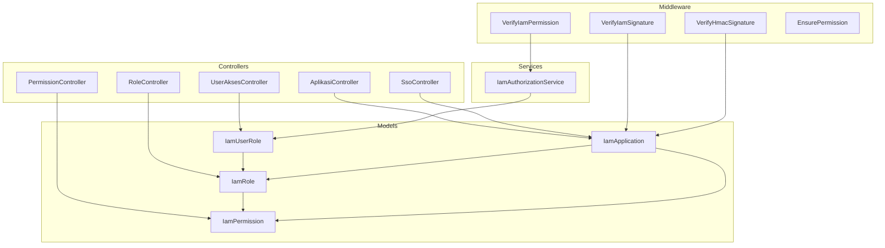
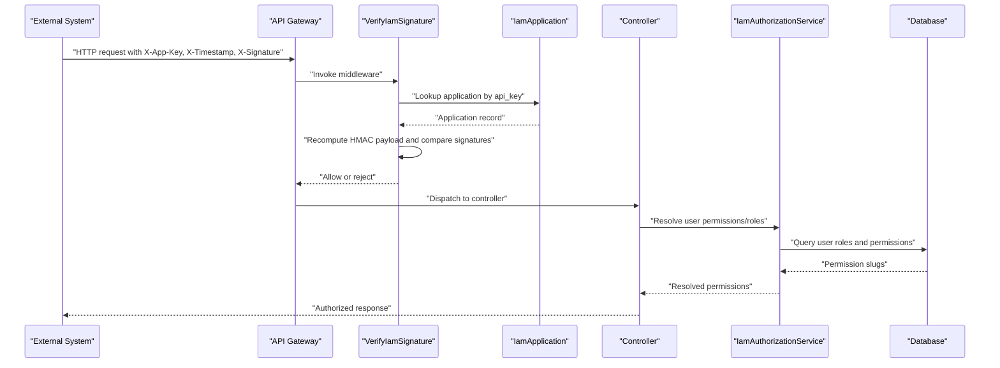
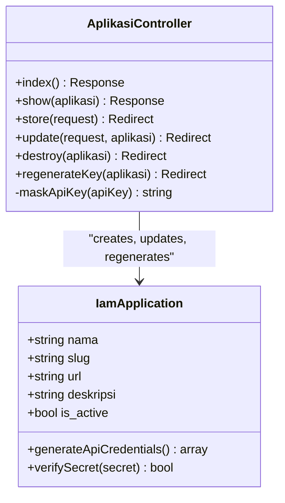
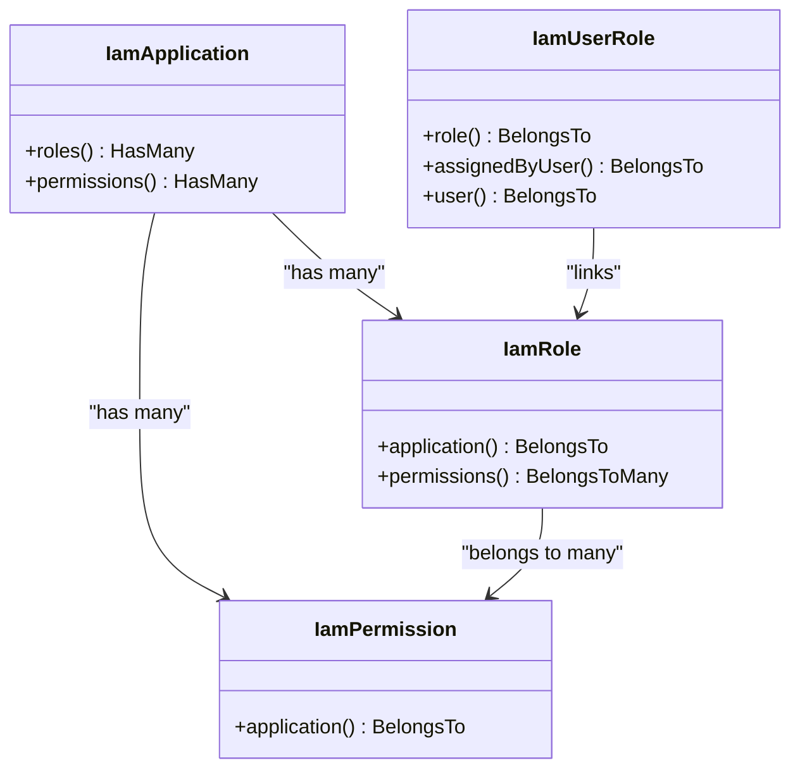
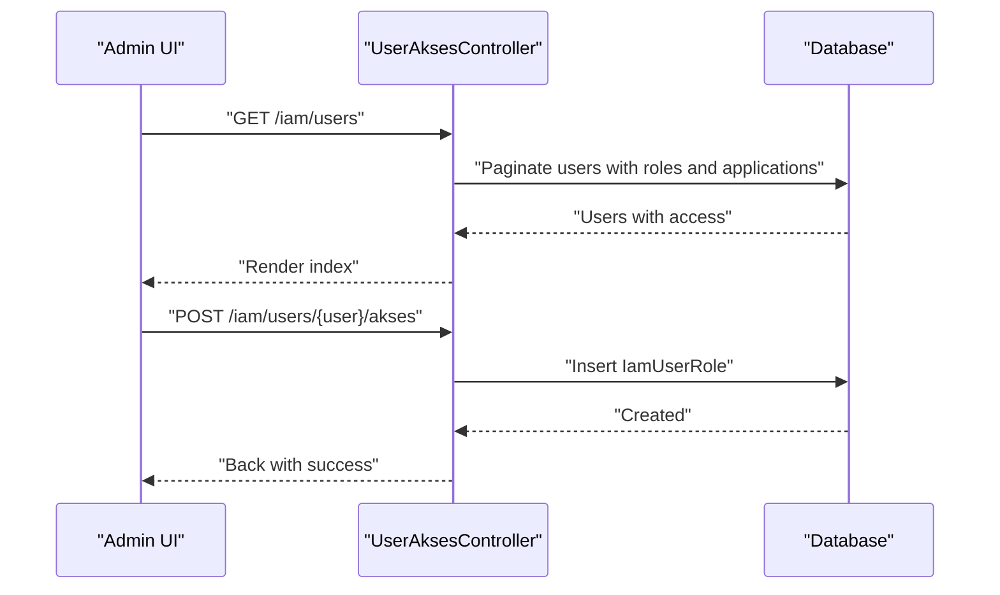
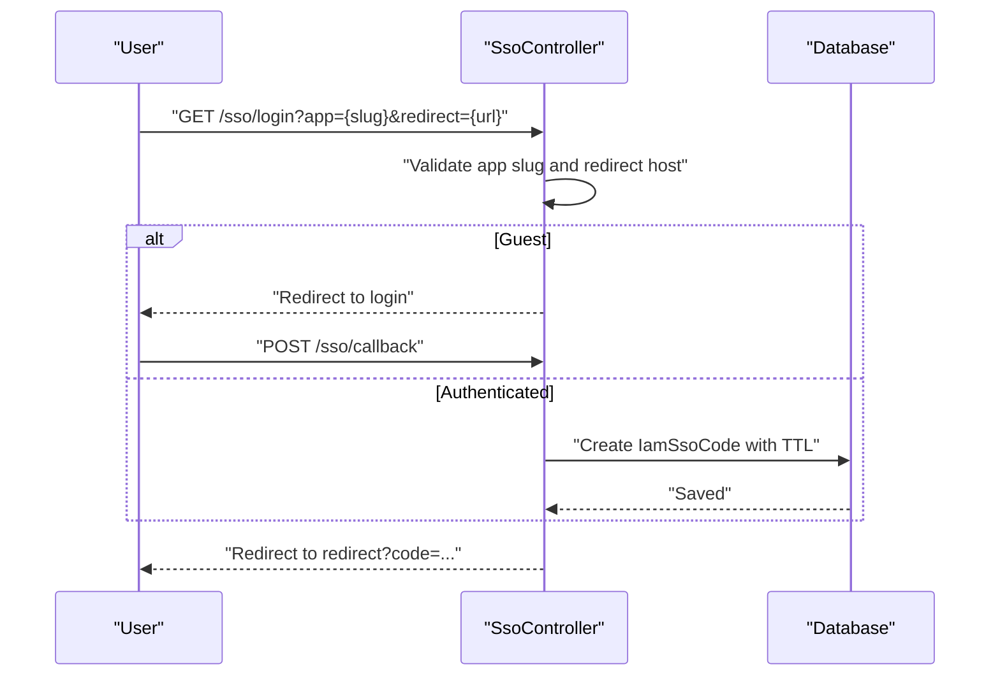
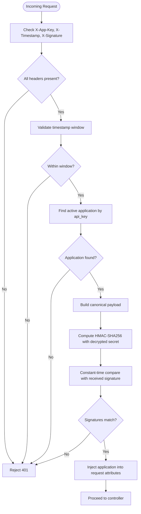
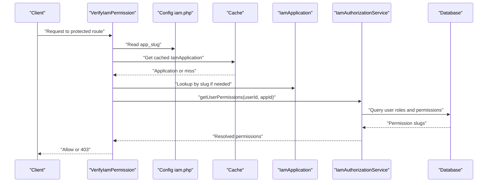
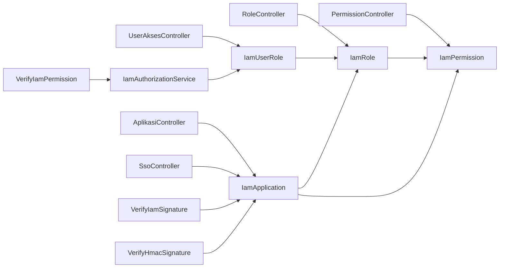

# Identity and Access Management (IAM)

<cite>
**Referenced Files in This Document**
- [AplikasiController.php](file://app/Http/Controllers/Iam/AplikasiController.php)
- [RoleController.php](file://app/Http/Controllers/Iam/RoleController.php)
- [PermissionController.php](file://app/Http/Controllers/Iam/PermissionController.php)
- [UserAksesController.php](file://app/Http/Controllers/Iam/UserAksesController.php)
- [SsoController.php](file://app/Http/Controllers/SsoController.php)
- [VerifyIamSignature.php](file://app/Http/Middleware/VerifyIamSignature.php)
- [VerifyHmacSignature.php](file://app/Http/Middleware/VerifyHmacSignature.php)
- [VerifyIamPermission.php](file://app/Http/Middleware/VerifyIamPermission.php)
- [EnsurePermission.php](file://app/Http/Middleware/EnsurePermission.php)
- [IamAuthorizationService.php](file://app/Services/IamAuthorizationService.php)
- [IamApplication.php](file://app/Models/IamApplication.php)
- [IamRole.php](file://app/Models/IamRole.php)
- [IamPermission.php](file://app/Models/IamPermission.php)
- [IamUserRole.php](file://app/Models/IamUserRole.php)
- [iam.php](file://config/iam.php)
</cite>

## Table of Contents
1. [Introduction](#introduction)
2. [Project Structure](#project-structure)
3. [Core Components](#core-components)
4. [Architecture Overview](#architecture-overview)
5. [Detailed Component Analysis](#detailed-component-analysis)
6. [Dependency Analysis](#dependency-analysis)
7. [Performance Considerations](#performance-considerations)
8. [Troubleshooting Guide](#troubleshooting-guide)
9. [Conclusion](#conclusion)
10. [Appendices](#appendices)

## Introduction
This document describes the Identity and Access Management (IAM) system designed for secure multi-application authentication and authorization in government systems. It explains how aplikasi (applications) are registered, how roles and permissions are modeled, and how single sign-on (sso) is enabled. It also documents the cryptographic signatures used to protect API integrations, user role assignment, permission validation, and audit-ready records. The content targets both system administrators who manage aplikasi, roles, and permissions, and developers integrating external systems via API keys and HMAC signatures.

## Project Structure
The IAM system spans controllers, models, middleware, services, and configuration. Controllers implement CRUD for aplikasi, roles, permissions, and user access assignments. Middleware enforces API signature verification and permission checks. The service layer centralizes permission and role resolution for authorization. Models define the relational schema for applications, roles, permissions, and user-role mappings.

**Diagram sources**
- [AplikasiController.php:11-128](file://app/Http/Controllers/Iam/AplikasiController.php#L11-L128)
- [RoleController.php:12-64](file://app/Http/Controllers/Iam/RoleController.php#L12-L64)
- [PermissionController.php:12-51](file://app/Http/Controllers/Iam/PermissionController.php#L12-L51)
- [UserAksesController.php:14-49](file://app/Http/Controllers/Iam/UserAksesController.php#L14-L49)
- [SsoController.php:13-84](file://app/Http/Controllers/SsoController.php#L13-L84)
- [VerifyIamSignature.php:11-60](file://app/Http/Middleware/VerifyIamSignature.php#L11-L60)
- [VerifyHmacSignature.php:17-64](file://app/Http/Middleware/VerifyHmacSignature.php#L17-L64)
- [VerifyIamPermission.php:12-53](file://app/Http/Middleware/VerifyIamPermission.php#L12-L53)
- [EnsurePermission.php:9-36](file://app/Http/Middleware/EnsurePermission.php#L9-L36)
- [IamAuthorizationService.php:7-44](file://app/Services/IamAuthorizationService.php#L7-L44)
- [IamApplication.php:12-95](file://app/Models/IamApplication.php#L12-L95)
- [IamRole.php:10-37](file://app/Models/IamRole.php#L10-L37)
- [IamPermission.php:9-21](file://app/Models/IamPermission.php#L9-L21)
- [IamUserRole.php:7-32](file://app/Models/IamUserRole.php#L7-L32)

**Section sources**
- [AplikasiController.php:11-128](file://app/Http/Controllers/Iam/AplikasiController.php#L11-L128)
- [RoleController.php:12-64](file://app/Http/Controllers/Iam/RoleController.php#L12-L64)
- [PermissionController.php:12-51](file://app/Http/Controllers/Iam/PermissionController.php#L12-L51)
- [UserAksesController.php:14-49](file://app/Http/Controllers/Iam/UserAksesController.php#L14-L49)
- [SsoController.php:13-84](file://app/Http/Controllers/SsoController.php#L13-L84)
- [VerifyIamSignature.php:11-60](file://app/Http/Middleware/VerifyIamSignature.php#L11-L60)
- [VerifyHmacSignature.php:17-64](file://app/Http/Middleware/VerifyHmacSignature.php#L17-L64)
- [VerifyIamPermission.php:12-53](file://app/Http/Middleware/VerifyIamPermission.php#L12-L53)
- [EnsurePermission.php:9-36](file://app/Http/Middleware/EnsurePermission.php#L9-L36)
- [IamAuthorizationService.php:7-44](file://app/Services/IamAuthorizationService.php#L7-L44)
- [IamApplication.php:12-95](file://app/Models/IamApplication.php#L12-L95)
- [IamRole.php:10-37](file://app/Models/IamRole.php#L10-L37)
- [IamPermission.php:9-21](file://app/Models/IamPermission.php#L9-L21)
- [IamUserRole.php:7-32](file://app/Models/IamUserRole.php#L7-L32)
- [iam.php:4-8](file://config/iam.php#L4-L8)

## Core Components
- Application registration and API credentials:
  - AplikasiController manages listing, viewing, creating, updating, deleting, regenerating API keys, and masking API keys for display.
  - IamApplication generates and stores API keys and secrets securely, exposes a method to verify plain secrets against stored hashes.
- Role and permission management:
  - RoleController creates, updates, and deletes roles scoped to an aplikasi and binds permissions.
  - PermissionController creates, updates, and deletes permissions scoped to an aplikasi.
  - IamRole belongs to an aplikasi and relates to permissions via a pivot table.
  - IamPermission belongs to an aplikasi.
- User access assignment:
  - UserAksesController lists users, shows their assigned roles and permissions, assigns roles to users, and removes role assignments.
  - IamUserRole links users to roles and records assignment metadata.
- Single sign-on (sso):
  - SsoController validates target aplikasi, handles guest-to-login redirection, and issues short-lived sso codes bound to the correct redirect host.
- Authorization and permission checks:
  - VerifyIamSignature authenticates API clients using HMAC-SHA256 over standardized payloads with timestamp validation.
  - VerifyHmacSignature secures internal APIs with HMAC-SHA256 using a server-side shared secret.
  - VerifyIamPermission resolves user permissions/roles for a configured application and enforces access.
  - EnsurePermission provides route-level permission enforcement for web flows.
  - IamAuthorizationService centralizes permission and role retrieval for authorization checks.
- Configuration:
  - config/iam.php defines token lifetimes, sso code TTL, and the default application slug used for permission checks.

**Section sources**
- [AplikasiController.php:13-127](file://app/Http/Controllers/Iam/AplikasiController.php#L13-L127)
- [IamApplication.php:33-94](file://app/Models/IamApplication.php#L33-L94)
- [RoleController.php:14-63](file://app/Http/Controllers/Iam/RoleController.php#L14-L63)
- [PermissionController.php:14-50](file://app/Http/Controllers/Iam/PermissionController.php#L14-L50)
- [IamRole.php:23-36](file://app/Models/IamRole.php#L23-L36)
- [IamPermission.php:17-20](file://app/Models/IamPermission.php#L17-L20)
- [UserAksesController.php:16-48](file://app/Http/Controllers/Iam/UserAksesController.php#L16-L48)
- [IamUserRole.php:18-31](file://app/Models/IamUserRole.php#L18-L31)
- [SsoController.php:15-83](file://app/Http/Controllers/SsoController.php#L15-L83)
- [VerifyIamSignature.php:15-59](file://app/Http/Middleware/VerifyIamSignature.php#L15-L59)
- [VerifyHmacSignature.php:25-63](file://app/Http/Middleware/VerifyHmacSignature.php#L25-L63)
- [VerifyIamPermission.php:16-52](file://app/Http/Middleware/VerifyIamPermission.php#L16-L52)
- [EnsurePermission.php:11-35](file://app/Http/Middleware/EnsurePermission.php#L11-L35)
- [IamAuthorizationService.php:16-43](file://app/Services/IamAuthorizationService.php#L16-L43)
- [iam.php:5-8](file://config/iam.php#L5-L8)

## Architecture Overview
The IAM system separates concerns across controllers, middleware, services, and models. External systems integrate via HMAC-signed API requests and sso codes. Internal authorization relies on cached application metadata and resolved permission sets.

**Diagram sources**
- [VerifyIamSignature.php:15-59](file://app/Http/Middleware/VerifyIamSignature.php#L15-L59)
- [IamApplication.php:85-94](file://app/Models/IamApplication.php#L85-L94)
- [AplikasiController.php:13-25](file://app/Http/Controllers/Iam/AplikasiController.php#L13-L25)
- [IamAuthorizationService.php:16-43](file://app/Services/IamAuthorizationService.php#L16-L43)

## Detailed Component Analysis

### Application Registration and API Credentials
- Purpose: Register aplikasi (applications), generate API keys and secrets, and expose them securely.
- Key behaviors:
  - API credential generation and encryption of secrets.
  - Masking of API keys for safe display.
  - Regeneration of credentials with strict security controls.
- Practical example:
  - Create a new aplikasi and receive a one-time plaintext secret for initial integration setup.
  - Use the generated api_key and api_secret to sign requests to protected endpoints.

**Diagram sources**
- [IamApplication.php:72-94](file://app/Models/IamApplication.php#L72-L94)
- [AplikasiController.php:41-107](file://app/Http/Controllers/Iam/AplikasiController.php#L41-L107)

**Section sources**
- [AplikasiController.php:13-127](file://app/Http/Controllers/Iam/AplikasiController.php#L13-L127)
- [IamApplication.php:33-94](file://app/Models/IamApplication.php#L33-L94)

### Role-Based Permissions
- Purpose: Define roles and permissions per aplikasi and assign roles to users.
- Key behaviors:
  - Roles are scoped to an aplikasi and can be system-reserved.
  - Permissions are scoped to an aplikasi and grouped optionally.
  - Assignments are recorded with timestamps and who assigned them.
- Practical example:
  - Create a role “viewer” under aplikasi “kepegawaian” and attach specific permission slugs.
  - Assign the role to a user; later revoke by removing the assignment.

**Diagram sources**
- [IamApplication.php:57-65](file://app/Models/IamApplication.php#L57-L65)
- [IamRole.php:23-36](file://app/Models/IamRole.php#L23-L36)
- [IamPermission.php:17-20](file://app/Models/IamPermission.php#L17-L20)
- [IamUserRole.php:18-31](file://app/Models/IamUserRole.php#L18-L31)

**Section sources**
- [RoleController.php:14-63](file://app/Http/Controllers/Iam/RoleController.php#L14-L63)
- [PermissionController.php:14-50](file://app/Http/Controllers/Iam/PermissionController.php#L14-L50)
- [IamRole.php:10-37](file://app/Models/IamRole.php#L10-L37)
- [IamPermission.php:9-21](file://app/Models/IamPermission.php#L9-L21)
- [IamUserRole.php:7-32](file://app/Models/IamUserRole.php#L7-L32)

### User Access Assignment
- Purpose: Manage which users have which roles in which aplikasi.
- Key behaviors:
  - Paginate users with their role and permission details.
  - Show available active aplikasi and roles for assignment.
  - Create or remove role assignments with audit metadata.
- Practical example:
  - Assign role “kepegawaian:viewer” to a pegawai (user) and verify the assignment appears in the user’s access list.

**Diagram sources**
- [UserAksesController.php:16-48](file://app/Http/Controllers/Iam/UserAksesController.php#L16-L48)
- [IamUserRole.php:9-16](file://app/Models/IamUserRole.php#L9-L16)

**Section sources**
- [UserAksesController.php:16-48](file://app/Http/Controllers/Iam/UserAksesController.php#L16-L48)
- [IamUserRole.php:7-32](file://app/Models/IamUserRole.php#L7-L32)

### Single Sign-On (SSO)
- Purpose: Enable seamless login across aplikasi using short-lived sso codes.
- Key behaviors:
  - Validate target aplikasi by slug and active status.
  - For guests, store intent and redirect to login; on callback, issue code.
  - Enforce redirect host matching to prevent open redirect.
  - Issue a random 64-character code with TTL configured via environment.
- Practical example:
  - User clicks “Login to Aplikasi Lain” and is redirected to the sso endpoint with app slug and redirect URL.
  - After login, the system issues a code and redirects back to the original redirect URL.

**Diagram sources**
- [SsoController.php:15-83](file://app/Http/Controllers/SsoController.php#L15-L83)
- [iam.php:6-7](file://config/iam.php#L6-L7)

**Section sources**
- [SsoController.php:15-83](file://app/Http/Controllers/SsoController.php#L15-L83)
- [iam.php:6-7](file://config/iam.php#L6-L7)

### API Signature Verification (HMAC-SHA256)
- Purpose: Authenticate external clients and protect against replay and tampering.
- Key behaviors:
  - Validate presence of X-App-Key, X-Timestamp, X-Signature.
  - Reject stale timestamps beyond a fixed window.
  - Lookup application by api_key and decrypt stored secret hash.
  - Recompute HMAC payload from METHOD:PATH:SORTED_QUERY:BODY_SHA256:TIMESTAMP and compare.
  - Inject application context into the request for downstream use.
- Practical example:
  - External system computes HMAC over the canonicalized payload and sends headers; server verifies and proceeds.

**Diagram sources**
- [VerifyIamSignature.php:15-59](file://app/Http/Middleware/VerifyIamSignature.php#L15-L59)
- [IamApplication.php:85-94](file://app/Models/IamApplication.php#L85-L94)

**Section sources**
- [VerifyIamSignature.php:15-59](file://app/Http/Middleware/VerifyIamSignature.php#L15-L59)
- [IamApplication.php:85-94](file://app/Models/IamApplication.php#L85-L94)

### Internal API Signature Verification (HMAC-SHA256)
- Purpose: Protect internal endpoints using a shared secret configured in environment.
- Key behaviors:
  - Validate X-Timestamp and X-Signature.
  - Enforce timestamp window.
  - Load shared secret from configuration and compute HMAC over canonicalized payload.
  - Reject if mismatch or if secret is missing.
- Practical example:
  - Integrating microservice signs requests with the shared secret; middleware verifies and allows access.

**Section sources**
- [VerifyHmacSignature.php:25-63](file://app/Http/Middleware/VerifyHmacSignature.php#L25-L63)

### Permission Validation and Authorization
- Purpose: Enforce access control for both web and API flows.
- Key behaviors:
  - EnsurePermission: Route-level middleware enforcing permissions for web requests.
  - VerifyIamPermission: Resolves current application by slug, caches lookup, and enforces either role presence or specific permission slugs.
  - IamAuthorizationService: Centralized retrieval of user roles and permissions scoped to an application.
- Practical example:
  - Route requires “kepegawaian:read” permission; middleware resolves user permissions and grants or denies access.

**Diagram sources**
- [VerifyIamPermission.php:16-52](file://app/Http/Middleware/VerifyIamPermission.php#L16-L52)
- [IamAuthorizationService.php:16-43](file://app/Services/IamAuthorizationService.php#L16-L43)
- [iam.php](file://config/iam.php#L7)

**Section sources**
- [EnsurePermission.php:11-35](file://app/Http/Middleware/EnsurePermission.php#L11-L35)
- [VerifyIamPermission.php:16-52](file://app/Http/Middleware/VerifyIamPermission.php#L16-L52)
- [IamAuthorizationService.php:16-43](file://app/Services/IamAuthorizationService.php#L16-L43)
- [iam.php](file://config/iam.php#L7)

## Dependency Analysis
The system exhibits clean separation of concerns:
- Controllers depend on models and services.
- Middleware depends on models and configuration.
- Services encapsulate authorization logic.
- Models define relationships and enforce data integrity.

**Diagram sources**
- [AplikasiController.php:11-128](file://app/Http/Controllers/Iam/AplikasiController.php#L11-L128)
- [RoleController.php:12-64](file://app/Http/Controllers/Iam/RoleController.php#L12-L64)
- [PermissionController.php:12-51](file://app/Http/Controllers/Iam/PermissionController.php#L12-L51)
- [UserAksesController.php:14-49](file://app/Http/Controllers/Iam/UserAksesController.php#L14-L49)
- [SsoController.php:13-84](file://app/Http/Controllers/SsoController.php#L13-L84)
- [VerifyIamSignature.php:11-60](file://app/Http/Middleware/VerifyIamSignature.php#L11-L60)
- [VerifyHmacSignature.php:17-64](file://app/Http/Middleware/VerifyHmacSignature.php#L17-L64)
- [VerifyIamPermission.php:12-53](file://app/Http/Middleware/VerifyIamPermission.php#L12-L53)
- [IamAuthorizationService.php:7-44](file://app/Services/IamAuthorizationService.php#L7-L44)
- [IamApplication.php:12-95](file://app/Models/IamApplication.php#L12-L95)
- [IamRole.php:10-37](file://app/Models/IamRole.php#L10-L37)
- [IamPermission.php:9-21](file://app/Models/IamPermission.php#L9-L21)
- [IamUserRole.php:7-32](file://app/Models/IamUserRole.php#L7-L32)

**Section sources**
- [AplikasiController.php:11-128](file://app/Http/Controllers/Iam/AplikasiController.php#L11-L128)
- [RoleController.php:12-64](file://app/Http/Controllers/Iam/RoleController.php#L12-L64)
- [PermissionController.php:12-51](file://app/Http/Controllers/Iam/PermissionController.php#L12-L51)
- [UserAksesController.php:14-49](file://app/Http/Controllers/Iam/UserAksesController.php#L14-L49)
- [SsoController.php:13-84](file://app/Http/Controllers/SsoController.php#L13-L84)
- [VerifyIamSignature.php:11-60](file://app/Http/Middleware/VerifyIamSignature.php#L11-L60)
- [VerifyHmacSignature.php:17-64](file://app/Http/Middleware/VerifyHmacSignature.php#L17-L64)
- [VerifyIamPermission.php:12-53](file://app/Http/Middleware/VerifyIamPermission.php#L12-L53)
- [IamAuthorizationService.php:7-44](file://app/Services/IamAuthorizationService.php#L7-L44)
- [IamApplication.php:12-95](file://app/Models/IamApplication.php#L12-L95)
- [IamRole.php:10-37](file://app/Models/IamRole.php#L10-L37)
- [IamPermission.php:9-21](file://app/Models/IamPermission.php#L9-L21)
- [IamUserRole.php:7-32](file://app/Models/IamUserRole.php#L7-L32)

## Performance Considerations
- Caching:
  - Application lookup for permission checks is cached for 1 hour to reduce repeated database queries.
- Query efficiency:
  - Eager loading of related roles and permissions reduces N+1 queries when rendering user access or resolving permissions.
- Payload hashing:
  - SHA-256 body hashing and canonicalized query sorting are O(n) with predictable overhead; keep request bodies reasonable.
- TTL tuning:
  - Adjust sso code TTL and token TTL via environment variables to balance usability and security.

[No sources needed since this section provides general guidance]

## Troubleshooting Guide
- Signature verification fails:
  - Ensure X-App-Key, X-Timestamp, and X-Signature are present and not expired.
  - Confirm the application exists and is active.
  - Verify the computed HMAC matches the received signature using the same canonical payload.
- Permission denied:
  - Confirm the user has a role in the target aplikasi or possesses the required permission slugs.
  - Check that the configured app_slug matches the intended application.
- SSO redirect rejected:
  - The redirect host must exactly match the registered aplikasi URL host.
  - Ensure the sso code TTL has not elapsed.
- Missing shared secret:
  - Internal HMAC verification requires a configured shared secret; check configuration and logs for critical errors.

**Section sources**
- [VerifyIamSignature.php:21-53](file://app/Http/Middleware/VerifyIamSignature.php#L21-L53)
- [VerifyIamPermission.php:20-51](file://app/Http/Middleware/VerifyIamPermission.php#L20-L51)
- [SsoController.php:60-83](file://app/Http/Controllers/SsoController.php#L60-L83)
- [VerifyHmacSignature.php:40-44](file://app/Http/Middleware/VerifyHmacSignature.php#L40-L44)

## Conclusion
The IAM system provides a robust foundation for managing aplikasi, roles, and permissions across multiple government applications. It secures integrations with HMAC-based signatures, supports seamless sso, and centralizes authorization logic for scalable governance. Administrators can manage access efficiently, while developers can integrate external systems using well-defined APIs and middleware.

[No sources needed since this section summarizes without analyzing specific files]

## Appendices

### API Integration Checklist
- Generate API credentials for the external aplikasi.
- Sign requests with HMAC-SHA256 using the canonical payload format.
- Include X-App-Key, X-Timestamp, and X-Signature headers.
- Respect timestamp windows and handle 401/403 responses appropriately.

**Section sources**
- [AplikasiController.php:50-61](file://app/Http/Controllers/Iam/AplikasiController.php#L50-L61)
- [VerifyIamSignature.php:35-53](file://app/Http/Middleware/VerifyIamSignature.php#L35-L53)

### Audit Logging Guidance
- Record role assignments and revocations with timestamps and who performed the action.
- Log sso code issuance and consumption for compliance.
- Track failed signature verifications and permission denials.

**Section sources**
- [IamUserRole.php:9-16](file://app/Models/IamUserRole.php#L9-L16)
- [SsoController.php:73-78](file://app/Http/Controllers/SsoController.php#L73-L78)
- [VerifyIamSignature.php:44-53](file://app/Http/Middleware/VerifyIamSignature.php#L44-L53)