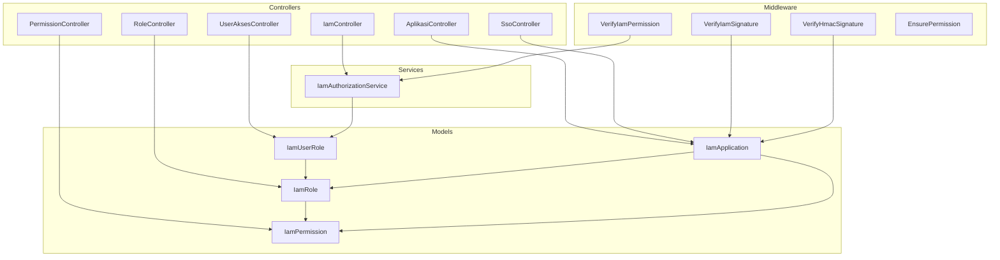
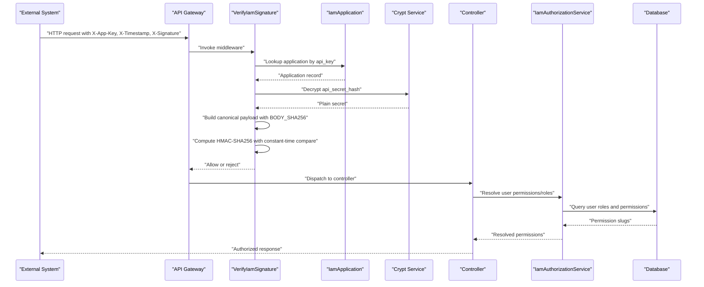
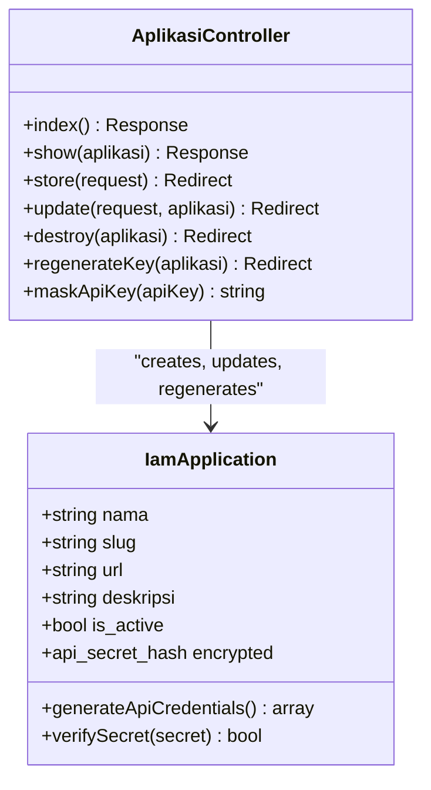
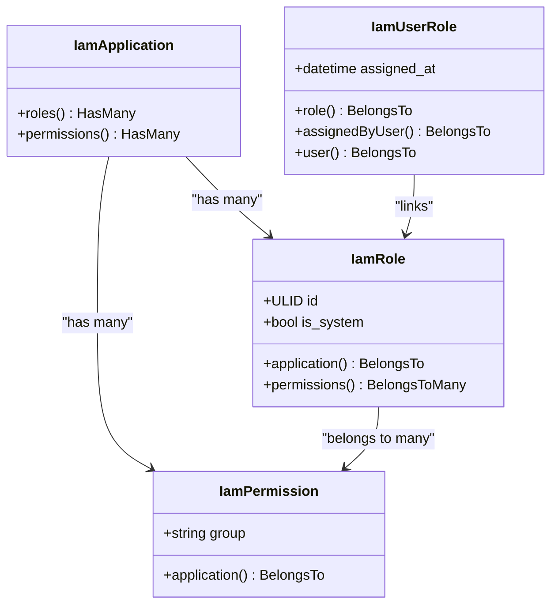
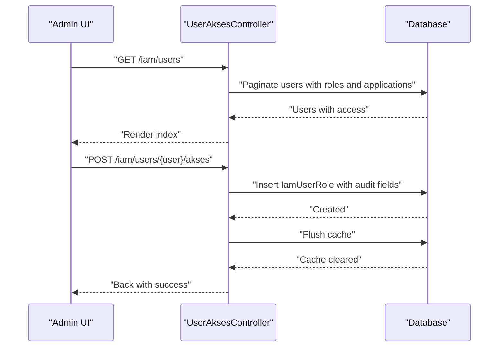
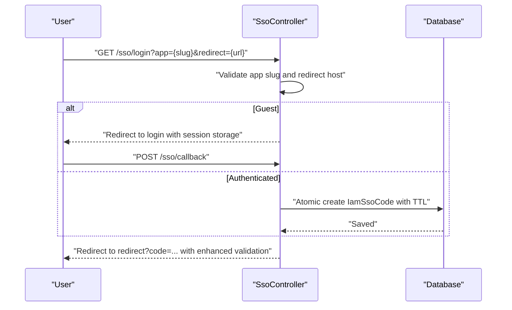
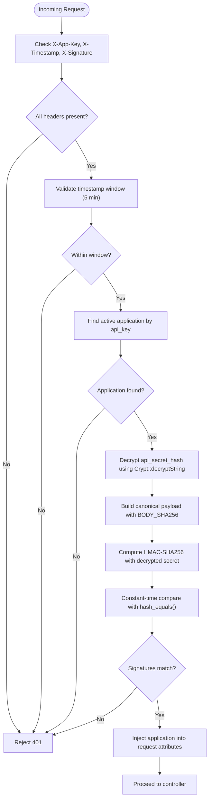
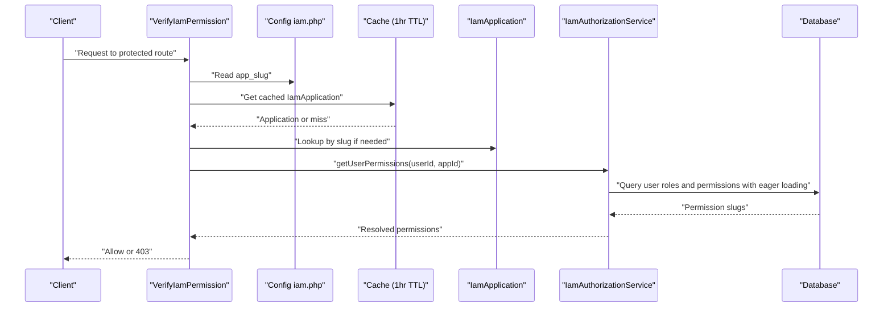
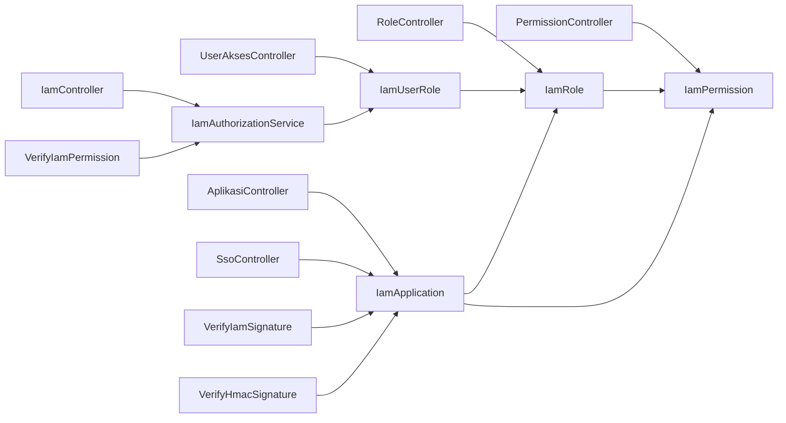

# Identity and Access Management (IAM)

<cite>
**Referenced Files in This Document**
- [AplikasiController.php](file://app/Http/Controllers/Iam/AplikasiController.php)
- [RoleController.php](file://app/Http/Controllers/Iam/RoleController.php)
- [PermissionController.php](file://app/Http/Controllers/Iam/PermissionController.php)
- [UserAksesController.php](file://app/Http/Controllers/Iam/UserAksesController.php)
- [SsoController.php](file://app/Http/Controllers/SsoController.php)
- [IamController.php](file://app/Http/Controllers/Api/IamController.php)
- [VerifyIamSignature.php](file://app/Http/Middleware/VerifyIamSignature.php)
- [VerifyHmacSignature.php](file://app/Http/Middleware/VerifyHmacSignature.php)
- [VerifyIamPermission.php](file://app/Http/Middleware/VerifyIamPermission.php)
- [EnsurePermission.php](file://app/Http/Middleware/EnsurePermission.php)
- [IamAuthorizationService.php](file://app/Services/IamAuthorizationService.php)
- [IamApplication.php](file://app/Models/IamApplication.php)
- [IamRole.php](file://app/Models/IamRole.php)
- [IamPermission.php](file://app/Models/IamPermission.php)
- [IamUserRole.php](file://app/Models/IamUserRole.php)
- [iam.php](file://config/iam.php)
</cite>

## Update Summary
**Changes Made**
- Enhanced HMAC-SHA256 signature verification with proper body hashing and canonical payload construction
- Improved security with constant-time comparison using hash_equals() for timing attack resistance
- Consolidated middleware handling with unified signature verification approach
- Strengthened API security with encrypted secret storage and proper decryption during verification
- Enhanced SSO security with atomic code exchange and cross-application protection

## Table of Contents
1. [Introduction](#introduction)
2. [Project Structure](#project-structure)
3. [Core Components](#core-components)
4. [Architecture Overview](#architecture-overview)
5. [Detailed Component Analysis](#detailed-component-analysis)
6. [Dependency Analysis](#dependency-analysis)
7. [Performance Considerations](#performance-considerations)
8. [Troubleshooting Guide](#troubleshooting-guide)
9. [Conclusion](#conclusion)
10. [Appendices](#appendices)

## Introduction
This document describes the Identity and Access Management (IAM) system designed for secure multi-application authentication and authorization in government systems. The system has been enhanced with improved security mechanisms, proper signature verification using HMAC-SHA256 with body hashing, and consolidated middleware handling. It explains how aplikasi (applications) are registered, how roles and permissions are modeled, and how single sign-on (sso) is enabled with enhanced security features. The system now provides robust cryptographic signatures for API integrations, secure user role assignment, permission validation, and comprehensive audit-ready records. The content targets both system administrators who manage aplikasi, roles, and permissions, and developers integrating external systems via API keys and HMAC signatures.

## Project Structure
The IAM system spans controllers, models, middleware, services, and configuration. Controllers implement CRUD for aplikasi, roles, permissions, and user access assignments. Enhanced middleware enforces API signature verification with proper body hashing and constant-time comparison. The service layer centralizes permission and role resolution for authorization. Models define the relational schema for applications, roles, permissions, and user-role mappings with improved security features.

**Diagram sources**
- [AplikasiController.php:13-116](file://app/Http/Controllers/Iam/AplikasiController.php#L13-L116)
- [RoleController.php:13-72](file://app/Http/Controllers/Iam/RoleController.php#L13-L72)
- [PermissionController.php:13-59](file://app/Http/Controllers/Iam/PermissionController.php#L13-L59)
- [UserAksesController.php:15-55](file://app/Http/Controllers/Iam/UserAksesController.php#L15-L55)
- [SsoController.php:13-85](file://app/Http/Controllers/SsoController.php#L13-L85)
- [IamController.php:13-91](file://app/Http/Controllers/Api/IamController.php#L13-L91)
- [VerifyIamSignature.php:11-61](file://app/Http/Middleware/VerifyIamSignature.php#L11-L61)
- [VerifyHmacSignature.php:17-65](file://app/Http/Middleware/VerifyHmacSignature.php#L17-L65)
- [VerifyIamPermission.php:12-54](file://app/Http/Middleware/VerifyIamPermission.php#L12-L54)
- [EnsurePermission.php:9-37](file://app/Http/Middleware/EnsurePermission.php#L9-L37)
- [IamAuthorizationService.php:7-45](file://app/Services/IamAuthorizationService.php#L7-L45)
- [IamApplication.php:14-100](file://app/Models/IamApplication.php#L14-L100)
- [IamRole.php:13-43](file://app/Models/IamRole.php#L13-L43)
- [IamPermission.php:9-21](file://app/Models/IamPermission.php#L9-L21)
- [IamUserRole.php:9-38](file://app/Models/IamUserRole.php#L9-L38)

**Section sources**
- [AplikasiController.php:13-116](file://app/Http/Controllers/Iam/AplikasiController.php#L13-L116)
- [RoleController.php:13-72](file://app/Http/Controllers/Iam/RoleController.php#L13-L72)
- [PermissionController.php:13-59](file://app/Http/Controllers/Iam/PermissionController.php#L13-L59)
- [UserAksesController.php:15-55](file://app/Http/Controllers/Iam/UserAksesController.php#L15-L55)
- [SsoController.php:13-85](file://app/Http/Controllers/SsoController.php#L13-L85)
- [IamController.php:13-91](file://app/Http/Controllers/Api/IamController.php#L13-L91)
- [VerifyIamSignature.php:11-61](file://app/Http/Middleware/VerifyIamSignature.php#L11-L61)
- [VerifyHmacSignature.php:17-65](file://app/Http/Middleware/VerifyHmacSignature.php#L17-L65)
- [VerifyIamPermission.php:12-54](file://app/Http/Middleware/VerifyIamPermission.php#L12-L54)
- [EnsurePermission.php:9-37](file://app/Http/Middleware/EnsurePermission.php#L9-L37)
- [IamAuthorizationService.php:7-45](file://app/Services/IamAuthorizationService.php#L7-L45)
- [IamApplication.php:14-100](file://app/Models/IamApplication.php#L14-L100)
- [IamRole.php:13-43](file://app/Models/IamRole.php#L13-L43)
- [IamPermission.php:9-21](file://app/Models/IamPermission.php#L9-L21)
- [IamUserRole.php:9-38](file://app/Models/IamUserRole.php#L9-L38)
- [iam.php:4-9](file://config/iam.php#L4-L9)

## Core Components
- **Enhanced Application Registration and API Credentials**:
  - AplikasiController manages listing, viewing, creating, updating, deleting, regenerating API keys, and masking API keys for display.
  - IamApplication generates and stores API keys and secrets securely using encrypted storage, exposes a method to verify plain secrets against stored hashes with constant-time comparison.
  - Enhanced security with encrypted secret storage using Crypt::encryptString for HMAC signature verification.
- **Improved Role and Permission Management**:
  - RoleController creates, updates, and deletes roles scoped to an aplikasi with IDOR protection and permission scoping.
  - PermissionController creates, updates, and deletes permissions scoped to an aplikasi with proper validation.
  - IamRole belongs to an aplikasi and relates to permissions via a pivot table with ULID support.
  - IamPermission belongs to an aplikasi with group-based organization.
- **Secure User Access Assignment**:
  - UserAksesController lists users, shows their assigned roles and permissions, assigns roles to users, and removes role assignments with audit trail.
  - IamUserRole links users to roles with assignment metadata and proper casting.
- **Enhanced Single Sign-On (SSO)**:
  - SsoController validates target aplikasi, handles guest-to-login redirection, and issues short-lived sso codes bound to the correct redirect host with enhanced security.
  - Atomic code exchange prevents race conditions and cross-application token theft.
  - Enhanced redirect host validation with exact domain matching.
- **Advanced Authorization and Permission Checks**:
  - VerifyIamSignature authenticates API clients using HMAC-SHA256 over standardized payloads with timestamp validation, proper body hashing, and constant-time signature comparison.
  - VerifyHmacSignature secures internal APIs with HMAC-SHA256 using a server-side shared secret with enhanced security measures.
  - VerifyIamPermission resolves user permissions/roles for a configured application and enforces access with caching and proper error handling.
  - EnsurePermission provides route-level permission enforcement for web flows with flexible permission parsing.
  - IamAuthorizationService centralizes permission and role retrieval for authorization checks with optimized queries.
- **Enhanced Configuration**:
  - config/iam.php defines token lifetimes, sso code TTL, and the default application slug used for permission checks with environment variable support.

**Section sources**
- [AplikasiController.php:13-116](file://app/Http/Controllers/Iam/AplikasiController.php#L13-L116)
- [IamApplication.php:37-98](file://app/Models/IamApplication.php#L37-L98)
- [RoleController.php:13-72](file://app/Http/Controllers/Iam/RoleController.php#L13-L72)
- [PermissionController.php:13-59](file://app/Http/Controllers/Iam/PermissionController.php#L13-L59)
- [IamRole.php:28-41](file://app/Models/IamRole.php#L28-L41)
- [IamPermission.php:17-20](file://app/Models/IamPermission.php#L17-L20)
- [UserAksesController.php:15-55](file://app/Http/Controllers/Iam/UserAksesController.php#L15-L55)
- [IamUserRole.php:14-36](file://app/Models/IamUserRole.php#L14-L36)
- [SsoController.php:15-85](file://app/Http/Controllers/SsoController.php#L15-L85)
- [IamController.php:15-91](file://app/Http/Controllers/Api/IamController.php#L15-L91)
- [VerifyIamSignature.php:15-61](file://app/Http/Middleware/VerifyIamSignature.php#L15-L61)
- [VerifyHmacSignature.php:25-65](file://app/Http/Middleware/VerifyHmacSignature.php#L25-L65)
- [VerifyIamPermission.php:16-54](file://app/Http/Middleware/VerifyIamPermission.php#L16-L54)
- [EnsurePermission.php:11-37](file://app/Http/Middleware/EnsurePermission.php#L11-L37)
- [IamAuthorizationService.php:16-43](file://app/Services/IamAuthorizationService.php#L16-L43)
- [iam.php:5-9](file://config/iam.php#L5-L9)

## Architecture Overview
The enhanced IAM system separates concerns across controllers, middleware, services, and models with improved security mechanisms. External systems integrate via HMAC-signed API requests with proper body hashing and constant-time signature verification. Internal authorization relies on cached application metadata and resolved permission sets with enhanced performance optimizations.

**Diagram sources**
- [VerifyIamSignature.php:15-61](file://app/Http/Middleware/VerifyIamSignature.php#L15-L61)
- [IamApplication.php:85-98](file://app/Models/IamApplication.php#L85-L98)
- [IamController.php:17-44](file://app/Http/Controllers/Api/IamController.php#L17-L44)
- [IamAuthorizationService.php:16-43](file://app/Services/IamAuthorizationService.php#L16-L43)

## Detailed Component Analysis

### Enhanced Application Registration and API Credentials
- **Purpose**: Register aplikasi (applications), generate API keys and secrets with enhanced security, and expose them securely.
- **Key behaviors**:
  - API credential generation using Crypt::encryptString for secure secret storage.
  - Masking of API keys for safe display with configurable pattern.
  - Regeneration of credentials with strict security controls and cache invalidation.
  - Constant-time secret verification using hash_equals() for timing attack resistance.
- **Practical example**:
  - Create a new aplikasi and receive a one-time plaintext secret for initial integration setup.
  - Use the generated api_key and api_secret to sign requests to protected endpoints with HMAC-SHA256.

**Diagram sources**
- [IamApplication.php:76-98](file://app/Models/IamApplication.php#L76-L98)
- [AplikasiController.php:43-116](file://app/Http/Controllers/Iam/AplikasiController.php#L43-L116)

**Section sources**
- [AplikasiController.php:13-116](file://app/Http/Controllers/Iam/AplikasiController.php#L13-L116)
- [IamApplication.php:37-98](file://app/Models/IamApplication.php#L37-L98)

### Enhanced Role-Based Permissions
- **Purpose**: Define roles and permissions per aplikasi with improved security and validation.
- **Key behaviors**:
  - Roles are scoped to an aplikasi with ULID support and system-reserved flags.
  - Permissions are scoped to an aplikasi with group-based organization and proper validation.
  - Enhanced IDOR protection with explicit application ownership validation.
  - Assignments are recorded with timestamps and who assigned them.
- **Practical example**:
  - Create a role "viewer" under aplikasi "kepegawaian" and attach specific permission slugs with proper validation.
  - Assign the role to a user; later revoke by removing the assignment with cache invalidation.

**Diagram sources**
- [IamApplication.php:61-69](file://app/Models/IamApplication.php#L61-L69)
- [IamRole.php:28-41](file://app/Models/IamRole.php#L28-L41)
- [IamPermission.php:17-20](file://app/Models/IamPermission.php#L17-L20)
- [IamUserRole.php:23-36](file://app/Models/IamUserRole.php#L23-L36)

**Section sources**
- [RoleController.php:13-72](file://app/Http/Controllers/Iam/RoleController.php#L13-L72)
- [PermissionController.php:13-59](file://app/Http/Controllers/Iam/PermissionController.php#L13-L59)
- [IamRole.php:13-43](file://app/Models/IamRole.php#L13-L43)
- [IamPermission.php:9-21](file://app/Models/IamPermission.php#L9-L21)
- [IamUserRole.php:9-38](file://app/Models/IamUserRole.php#L9-L38)

### Secure User Access Assignment
- **Purpose**: Manage which users have which roles in which aplikasi with enhanced security and audit capabilities.
- **Key behaviors**:
  - Paginate users with their role and permission details using eager loading.
  - Show available active aplikasi and roles for assignment with proper validation.
  - Create or remove role assignments with audit metadata and cache invalidation.
  - Enhanced security with proper user and role validation.
- **Practical example**:
  - Assign role "kepegawaian:viewer" to a pegawai (user) and verify the assignment appears in the user's access list with proper caching.

**Diagram sources**
- [UserAksesController.php:17-55](file://app/Http/Controllers/Iam/UserAksesController.php#L17-L55)
- [IamUserRole.php:14-36](file://app/Models/IamUserRole.php#L14-L36)

**Section sources**
- [UserAksesController.php:15-55](file://app/Http/Controllers/Iam/UserAksesController.php#L15-L55)
- [IamUserRole.php:9-38](file://app/Models/IamUserRole.php#L9-L38)

### Enhanced Single Sign-On (SSO)
- **Purpose**: Enable seamless login across aplikasi using short-lived sso codes with enhanced security measures.
- **Key behaviors**:
  - Validate target aplikasi by slug and active status with proper error handling.
  - For guests, store intent and redirect to login; on callback, issue code with enhanced session management.
  - Enforce redirect host matching to prevent open redirect with exact domain validation.
  - Issue a random 64-character code with TTL configured via environment variables.
  - Atomic code exchange prevents race conditions and cross-application token theft.
- **Practical example**:
  - User clicks "Login to Aplikasi Lain" and is redirected to the sso endpoint with app slug and redirect URL.
  - After login, the system issues a code and redirects back to the original redirect URL with enhanced security.

**Diagram sources**
- [SsoController.php:15-85](file://app/Http/Controllers/SsoController.php#L15-L85)
- [iam.php:6-8](file://config/iam.php#L6-L8)

**Section sources**
- [SsoController.php:15-85](file://app/Http/Controllers/SsoController.php#L15-L85)
- [iam.php:6-8](file://config/iam.php#L6-L8)

### Enhanced API Signature Verification (HMAC-SHA256)
- **Purpose**: Authenticate external clients and protect against replay and tampering with enhanced security mechanisms.
- **Key behaviors**:
  - Validate presence of X-App-Key, X-Timestamp, X-Signature with proper error handling.
  - Reject stale timestamps beyond a fixed 5-minute window.
  - Lookup application by api_key and decrypt stored secret hash using Crypt::decryptString.
  - Recompute HMAC payload from METHOD:PATH:SORTED_QUERY:BODY_SHA256:TIMESTAMP with proper body hashing.
  - Use hash_equals() for constant-time signature comparison to prevent timing attacks.
  - Inject application context into the request for downstream use.
- **Practical example**:
  - External system computes HMAC over the canonicalized payload with body hash and sends headers; server verifies with enhanced security and proceeds.

**Diagram sources**
- [VerifyIamSignature.php:15-61](file://app/Http/Middleware/VerifyIamSignature.php#L15-L61)
- [IamApplication.php:85-98](file://app/Models/IamApplication.php#L85-L98)

**Section sources**
- [VerifyIamSignature.php:15-61](file://app/Http/Middleware/VerifyIamSignature.php#L15-L61)
- [IamApplication.php:85-98](file://app/Models/IamApplication.php#L85-L98)

### Enhanced Internal API Signature Verification (HMAC-SHA256)
- **Purpose**: Protect internal endpoints using a shared secret with enhanced security measures and proper configuration validation.
- **Key behaviors**:
  - Validate X-Timestamp and X-Signature with proper error handling.
  - Enforce timestamp window with 5-minute tolerance.
  - Load shared secret from configuration with validation and logging for security events.
  - Compute HMAC over canonicalized payload with proper body hashing.
  - Use hash_equals() for constant-time signature comparison to prevent timing attacks.
  - Enhanced error handling with critical logging for configuration issues.
- **Practical example**:
  - Integrating microservice signs requests with the shared secret using proper body hashing; middleware verifies with enhanced security and allows access.

**Section sources**
- [VerifyHmacSignature.php:25-65](file://app/Http/Middleware/VerifyHmacSignature.php#L25-L65)

### Enhanced Permission Validation and Authorization
- **Purpose**: Enforce access control for both web and API flows with improved performance and security.
- **Key behaviors**:
  - EnsurePermission: Route-level middleware enforcing permissions for web requests with flexible permission parsing and proper error handling.
  - VerifyIamPermission: Resolves current application by slug with caching, enforces either role presence or specific permission slugs with enhanced validation.
  - IamAuthorizationService: Centralized retrieval of user roles and permissions scoped to an application with optimized queries and proper casting.
  - Enhanced caching strategy with 1-hour TTL for application lookups.
  - Proper error handling with HTTP status codes for different scenarios.
- **Practical example**:
  - Route requires "kepegawaian:read" permission; middleware resolves user permissions with caching and grants or denies access with enhanced performance.

**Diagram sources**
- [VerifyIamPermission.php:16-54](file://app/Http/Middleware/VerifyIamPermission.php#L16-L54)
- [IamAuthorizationService.php:16-43](file://app/Services/IamAuthorizationService.php#L16-L43)
- [iam.php:7](file://config/iam.php#L7)

**Section sources**
- [EnsurePermission.php:11-37](file://app/Http/Middleware/EnsurePermission.php#L11-L37)
- [VerifyIamPermission.php:16-54](file://app/Http/Middleware/VerifyIamPermission.php#L16-L54)
- [IamAuthorizationService.php:16-43](file://app/Services/IamAuthorizationService.php#L16-L43)
- [iam.php:7](file://config/iam.php#L7)

### Enhanced API Endpoints and SSO Integration
- **Purpose**: Provide comprehensive API endpoints for IAM operations with enhanced security and SSO integration.
- **Key behaviors**:
  - IamController.validate(): Returns user info, roles, permissions, and token expiration with proper attribute injection.
  - IamController.check(): Validates individual permissions with constant-time comparison.
  - IamController.logout(): Invalidates current access tokens with proper cleanup.
  - IamController.exchangeCode(): Atomic SSO code exchange with cross-application protection and scoped tokens.
  - Enhanced error handling with proper HTTP status codes and validation.
- **Practical example**:
  - External system exchanges SSO code for scoped access token with enhanced security and proper application scoping.

**Section sources**
- [IamController.php:15-91](file://app/Http/Controllers/Api/IamController.php#L15-L91)

## Dependency Analysis
The enhanced system exhibits clean separation of concerns with improved security:
- Controllers depend on models and services with enhanced validation.
- Middleware depends on models, configuration, and cryptographic services.
- Services encapsulate authorization logic with optimized queries.
- Models define relationships with enhanced security features and proper casting.

**Diagram sources**
- [AplikasiController.php:13-116](file://app/Http/Controllers/Iam/AplikasiController.php#L13-L116)
- [RoleController.php:13-72](file://app/Http/Controllers/Iam/RoleController.php#L13-L72)
- [PermissionController.php:13-59](file://app/Http/Controllers/Iam/PermissionController.php#L13-L59)
- [UserAksesController.php:15-55](file://app/Http/Controllers/Iam/UserAksesController.php#L15-L55)
- [SsoController.php:13-85](file://app/Http/Controllers/SsoController.php#L13-L85)
- [IamController.php:13-91](file://app/Http/Controllers/Api/IamController.php#L13-L91)
- [VerifyIamSignature.php:11-61](file://app/Http/Middleware/VerifyIamSignature.php#L11-L61)
- [VerifyHmacSignature.php:17-65](file://app/Http/Middleware/VerifyHmacSignature.php#L17-L65)
- [VerifyIamPermission.php:12-54](file://app/Http/Middleware/VerifyIamPermission.php#L12-L54)
- [IamAuthorizationService.php:7-45](file://app/Services/IamAuthorizationService.php#L7-L45)
- [IamApplication.php:14-100](file://app/Models/IamApplication.php#L14-L100)
- [IamRole.php:13-43](file://app/Models/IamRole.php#L13-L43)
- [IamPermission.php:9-21](file://app/Models/IamPermission.php#L9-L21)
- [IamUserRole.php:9-38](file://app/Models/IamUserRole.php#L9-L38)

**Section sources**
- [AplikasiController.php:13-116](file://app/Http/Controllers/Iam/AplikasiController.php#L13-L116)
- [RoleController.php:13-72](file://app/Http/Controllers/Iam/RoleController.php#L13-L72)
- [PermissionController.php:13-59](file://app/Http/Controllers/Iam/PermissionController.php#L13-L59)
- [UserAksesController.php:15-55](file://app/Http/Controllers/Iam/UserAksesController.php#L15-L55)
- [SsoController.php:13-85](file://app/Http/Controllers/SsoController.php#L13-L85)
- [IamController.php:13-91](file://app/Http/Controllers/Api/IamController.php#L13-L91)
- [VerifyIamSignature.php:11-61](file://app/Http/Middleware/VerifyIamSignature.php#L11-L61)
- [VerifyHmacSignature.php:17-65](file://app/Http/Middleware/VerifyHmacSignature.php#L17-L65)
- [VerifyIamPermission.php:12-54](file://app/Http/Middleware/VerifyIamPermission.php#L12-L54)
- [IamAuthorizationService.php:7-45](file://app/Services/IamAuthorizationService.php#L7-L45)
- [IamApplication.php:14-100](file://app/Models/IamApplication.php#L14-L100)
- [IamRole.php:13-43](file://app/Models/IamRole.php#L13-L43)
- [IamPermission.php:9-21](file://app/Models/IamPermission.php#L9-L21)
- [IamUserRole.php:9-38](file://app/Models/IamUserRole.php#L9-L38)

## Performance Considerations
- **Enhanced Caching**:
  - Application lookup for permission checks is cached for 1 hour to reduce repeated database queries.
  - Optimized eager loading of related roles and permissions reduces N+1 queries when rendering user access or resolving permissions.
- **Improved Query Efficiency**:
  - Eager loading with with() clauses reduces database queries for complex relationships.
  - Optimized permission queries using flatMap() and unique() operations for better performance.
- **Enhanced Payload Processing**:
  - SHA-256 body hashing and canonicalized query sorting are O(n) with predictable overhead; keep request bodies reasonable.
  - Proper indexing on api_key and slug fields improves lookup performance.
- **TTL Tuning**:
  - Adjust sso code TTL and token TTL via environment variables to balance usability and security.
  - 5-minute timestamp window provides replay protection while maintaining usability.

## Troubleshooting Guide
- **Enhanced Signature verification fails**:
  - Ensure X-App-Key, X-Timestamp, and X-Signature are present and not expired.
  - Confirm the application exists and is active.
  - Verify the computed HMAC matches the received signature using the same canonical payload with body hashing.
  - Check that the encrypted secret can be properly decrypted using Crypt::decryptString.
  - Ensure hash_equals() comparison is working correctly for constant-time verification.
- **Enhanced Permission denied**:
  - Confirm the user has a role in the target aplikasi or possesses the required permission slugs.
  - Check that the configured app_slug matches the intended application.
  - Verify cache is not returning stale application data.
  - Ensure proper ULID format for application IDs.
- **Enhanced SSO redirect rejected**:
  - The redirect host must exactly match the registered aplikasi URL host.
  - Ensure the sso code TTL has not elapsed.
  - Check atomic code exchange is working correctly.
  - Verify proper session management for guest users.
- **Enhanced Missing shared secret**:
  - Internal HMAC verification requires a configured shared secret; check configuration and logs for critical errors.
  - Verify kepegawaian.secret_key environment variable is set.
  - Check for proper error logging in VerifyHmacSignature middleware.
- **Enhanced Application not found**:
  - Verify application slug exists in cache or database.
  - Check cache invalidation after application updates.
  - Ensure proper error handling for non-existent applications.

**Section sources**
- [VerifyIamSignature.php:21-61](file://app/Http/Middleware/VerifyIamSignature.php#L21-L61)
- [VerifyIamPermission.php:20-54](file://app/Http/Middleware/VerifyIamPermission.php#L20-L54)
- [SsoController.php:60-85](file://app/Http/Controllers/SsoController.php#L60-L85)
- [VerifyHmacSignature.php:40-65](file://app/Http/Middleware/VerifyHmacSignature.php#L40-L65)
- [IamApplication.php:85-98](file://app/Models/IamApplication.php#L85-L98)

## Conclusion
The enhanced IAM system provides a robust foundation for managing aplikasi, roles, and permissions across multiple government applications with significantly improved security mechanisms. The system now features proper HMAC-SHA256 signature verification with body hashing, constant-time comparison for timing attack resistance, encrypted secret storage, and consolidated middleware handling. It secures integrations with enhanced cryptographic signatures, supports seamless and secure sso with atomic exchanges, and centralizes authorization logic for scalable governance. Administrators can manage access efficiently with enhanced validation and audit capabilities, while developers can integrate external systems using well-defined APIs and middleware with improved security guarantees.

## Appendices

### Enhanced API Integration Checklist
- Generate API credentials for the external aplikasi with proper encryption.
- Sign requests with HMAC-SHA256 using the canonical payload format with body hashing.
- Include X-App-Key, X-Timestamp, and X-Signature headers with proper validation.
- Respect timestamp windows and handle 401/403 responses appropriately.
- Implement proper error handling for signature verification failures.
- Use hash_equals() for constant-time signature comparison in client implementations.

**Section sources**
- [AplikasiController.php:43-56](file://app/Http/Controllers/Iam/AplikasiController.php#L43-L56)
- [VerifyIamSignature.php:35-61](file://app/Http/Middleware/VerifyIamSignature.php#L35-L61)

### Enhanced Audit Logging Guidance
- Record role assignments and revocations with timestamps and who performed the action.
- Log sso code issuance and consumption for compliance with enhanced validation.
- Track failed signature verifications and permission denials with proper error codes.
- Monitor cache operations and invalidation for application data.
- Log cryptographic operations including secret decryption attempts.
- Track atomic operation failures in SSO code exchange.

**Section sources**
- [IamUserRole.php:14-21](file://app/Models/IamUserRole.php#L14-L21)
- [SsoController.php:70-85](file://app/Http/Controllers/SsoController.php#L70-L85)
- [VerifyIamSignature.php:44-61](file://app/Http/Middleware/VerifyIamSignature.php#L44-L61)
- [IamApplication.php:85-98](file://app/Models/IamApplication.php#L85-L98)

### Enhanced Security Best Practices
- **Secret Management**: Never expose api_secret in responses; use encrypted storage and constant-time verification.
- **Body Hashing**: Always include SHA-256 hash of request body in canonical payload for integrity protection.
- **Timestamp Validation**: Implement 5-minute window for replay attack prevention.
- **Constant-Time Comparison**: Use hash_equals() for all signature comparisons to prevent timing attacks.
- **Atomic Operations**: Use database transactions for SSO code exchange to prevent race conditions.
- **Cross-Application Protection**: Validate app_slug in SSO code exchange to prevent token theft across applications.
- **Session Security**: Implement proper session management for guest SSO flows with exact redirect host validation.

**Section sources**
- [IamApplication.php:85-98](file://app/Models/IamApplication.php#L85-L98)
- [VerifyIamSignature.php:35-61](file://app/Http/Middleware/VerifyIamSignature.php#L35-L61)
- [IamController.php:59-89](file://app/Http/Controllers/Api/IamController.php#L59-L89)
- [SsoController.php:60-85](file://app/Http/Controllers/SsoController.php#L60-L85)