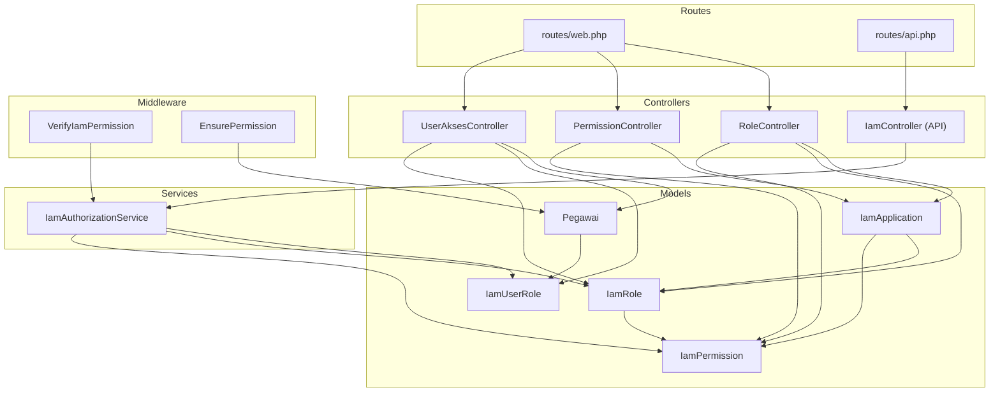
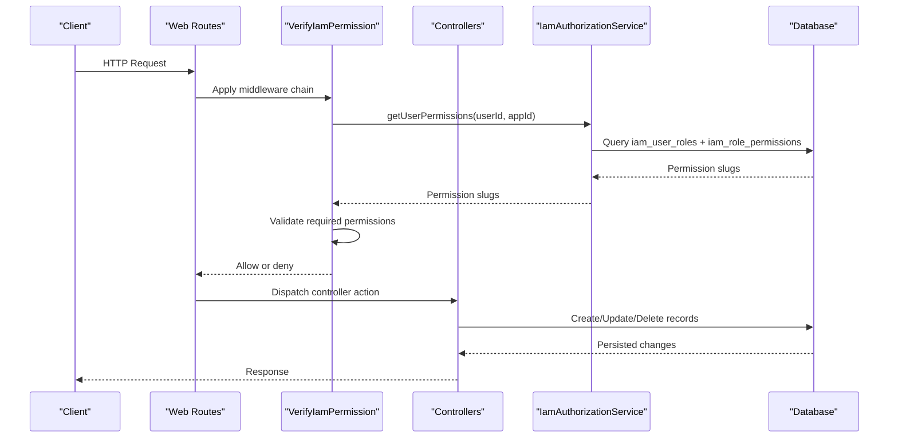
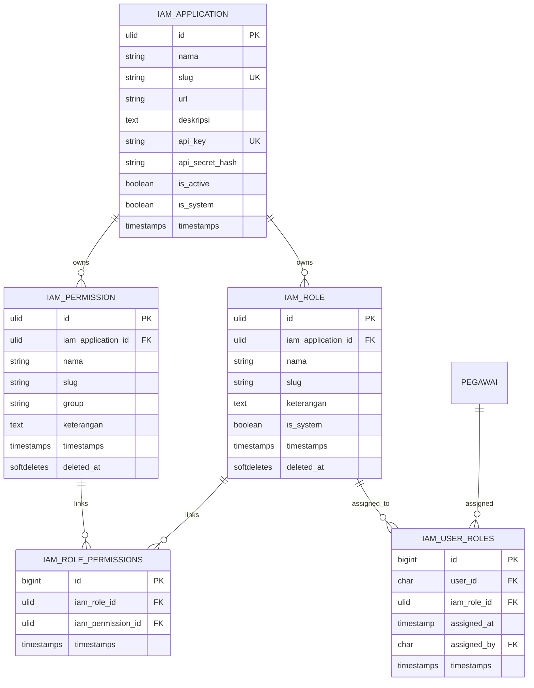
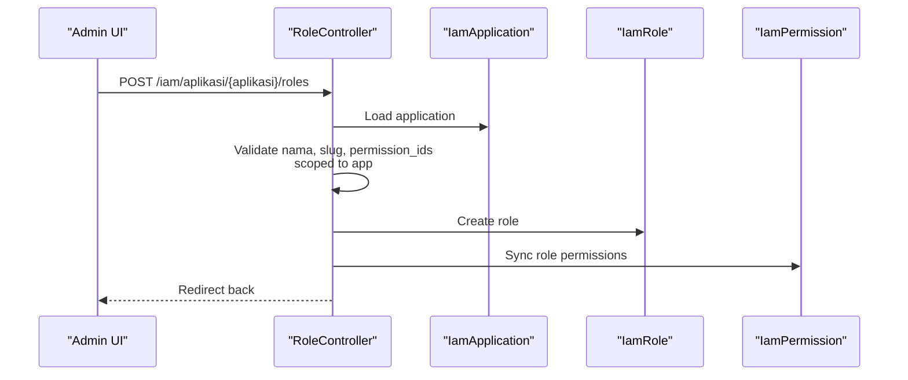
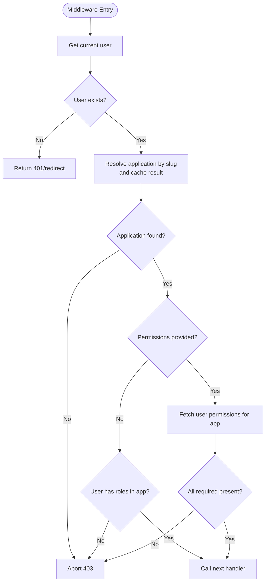
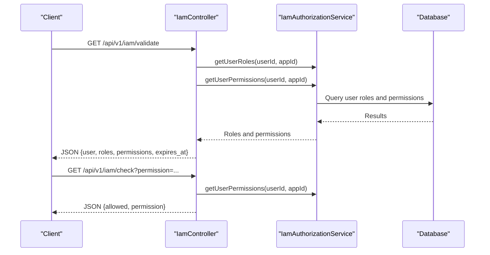
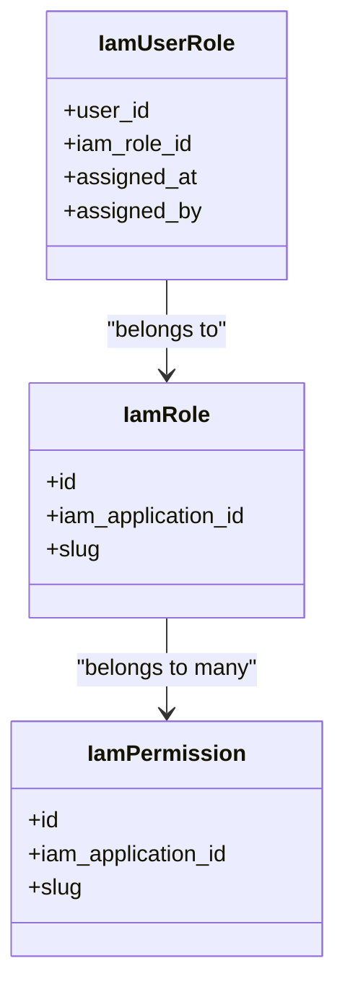
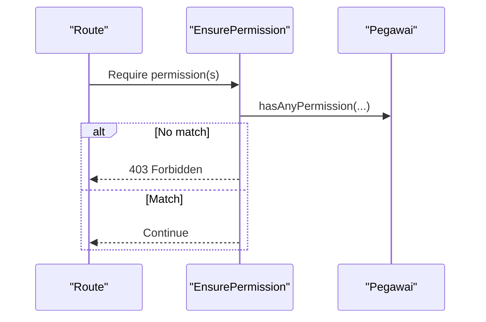
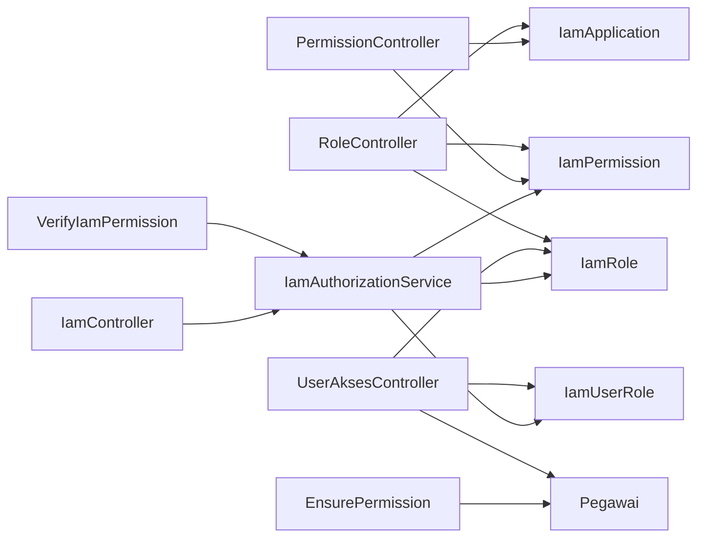

# Role and Permission System

<cite>
**Referenced Files in This Document**
- [RoleController.php](file://app/Http/Controllers/Iam/RoleController.php)
- [PermissionController.php](file://app/Http/Controllers/Iam/PermissionController.php)
- [UserAksesController.php](file://app/Http/Controllers/Iam/UserAksesController.php)
- [IamAuthorizationService.php](file://app/Services/IamAuthorizationService.php)
- [VerifyIamPermission.php](file://app/Http/Middleware/VerifyIamPermission.php)
- [EnsurePermission.php](file://app/Http/Middleware/EnsurePermission.php)
- [IamController.php](file://app/Http/Controllers/Api/IamController.php)
- [IamApplication.php](file://app/Models/IamApplication.php)
- [IamRole.php](file://app/Models/IamRole.php)
- [IamPermission.php](file://app/Models/IamPermission.php)
- [IamUserRole.php](file://app/Models/IamUserRole.php)
- [Pegawai.php](file://app/Models/Pegawai.php)
- [2026_03_21_000001_create_iam_tables.php](file://database/migrations/2026_03_21_000001_create_iam_tables.php)
- [web.php](file://routes/web.php)
- [api.php](file://routes/api.php)
- [iam.php](file://config/iam.php)
- [iam.ts](file://resources/js/types/iam.ts)
</cite>

## Table of Contents
1. [Introduction](#introduction)
2. [Project Structure](#project-structure)
3. [Core Components](#core-components)
4. [Architecture Overview](#architecture-overview)
5. [Detailed Component Analysis](#detailed-component-analysis)
6. [Dependency Analysis](#dependency-analysis)
7. [Performance Considerations](#performance-considerations)
8. [Troubleshooting Guide](#troubleshooting-guide)
9. [Conclusion](#conclusion)
10. [Appendices](#appendices)

## Introduction
This document explains the Identity and Access Management (IAM) role and permission system within the application. It covers the hierarchical role structure, permission assignment mechanisms, and user role management workflows. It documents implementation details including role creation, permission linking, and access control enforcement. Both system administrators and developers will find conceptual overviews and technical details, including practical examples of role hierarchy, permission inheritance, and dynamic access control. The guide also addresses common scenarios such as role escalation prevention, permission conflicts, and access validation patterns, along with guidelines for extending the permission system and integrating with external authorization sources.

## Project Structure
The IAM subsystem is organized around dedicated controllers, models, middleware, services, and database migrations. Controllers manage CRUD operations for applications, roles, permissions, and user access. Middleware enforces permission checks at runtime. The service encapsulates permission and role retrieval logic. Models define the relational schema and Eloquent relationships. Migrations establish the IAM tables and constraints. Routes bind controllers to endpoints and apply middleware for access control.

**Diagram sources**
- [RoleController.php:1-65](file://app/Http/Controllers/Iam/RoleController.php#L1-L65)
- [PermissionController.php:1-52](file://app/Http/Controllers/Iam/PermissionController.php#L1-L52)
- [UserAksesController.php:1-50](file://app/Http/Controllers/Iam/UserAksesController.php#L1-L50)
- [IamController.php:1-91](file://app/Http/Controllers/Api/IamController.php#L1-L91)
- [VerifyIamPermission.php:1-54](file://app/Http/Middleware/VerifyIamPermission.php#L1-L54)
- [EnsurePermission.php:1-37](file://app/Http/Middleware/EnsurePermission.php#L1-L37)
- [IamAuthorizationService.php:1-45](file://app/Services/IamAuthorizationService.php#L1-L45)
- [IamApplication.php:1-96](file://app/Models/IamApplication.php#L1-L96)
- [IamRole.php:1-38](file://app/Models/IamRole.php#L1-L38)
- [IamPermission.php:1-22](file://app/Models/IamPermission.php#L1-L22)
- [IamUserRole.php:1-33](file://app/Models/IamUserRole.php#L1-L33)
- [Pegawai.php:1-209](file://app/Models/Pegawai.php#L1-L209)
- [web.php:1-139](file://routes/web.php#L1-L139)
- [api.php:1-48](file://routes/api.php#L1-L48)

**Section sources**
- [web.php:114-136](file://routes/web.php#L114-L136)
- [api.php:33-47](file://routes/api.php#L33-L47)
- [2026_03_21_000001_create_iam_tables.php:14-98](file://database/migrations/2026_03_21_000001_create_iam_tables.php#L14-L98)

## Core Components
- Application-scoped identity: Applications own roles and permissions. Each application has unique slugs scoped to itself.
- Roles: Group permissions and are owned by an application. Roles can be system or regular.
- Permissions: Atomic authorization primitives with optional grouping and application scoping.
- User access: Users (Pegawai) are linked to roles via a pivot table with assignment metadata.
- Authorization service: Centralized logic to compute effective permissions and roles for a user within a given application.
- Middleware: Enforce permission checks at runtime for both web and API flows.
- Controllers: Provide administrative endpoints to manage applications, roles, permissions, and user access.

Key implementation highlights:
- Application-scoped uniqueness for roles and permissions via composite unique keys.
- Many-to-many relationships between roles and permissions, and between users and roles.
- Middleware supports both “any-permission” checks and strict “all-permissions” enforcement.
- API endpoints expose validation, permission checks, logout, and SSO code exchange.

**Section sources**
- [IamApplication.php:16-65](file://app/Models/IamApplication.php#L16-L65)
- [IamRole.php:14-36](file://app/Models/IamRole.php#L14-L36)
- [IamPermission.php:13-20](file://app/Models/IamPermission.php#L13-L20)
- [IamUserRole.php:9-31](file://app/Models/IamUserRole.php#L9-L31)
- [IamAuthorizationService.php:16-43](file://app/Services/IamAuthorizationService.php#L16-L43)
- [VerifyIamPermission.php:16-51](file://app/Http/Middleware/VerifyIamPermission.php#L16-L51)
- [EnsurePermission.php:11-34](file://app/Http/Middleware/EnsurePermission.php#L11-L34)
- [IamController.php:17-44](file://app/Http/Controllers/Api/IamController.php#L17-L44)

## Architecture Overview
The IAM architecture separates concerns across controllers, middleware, services, and models. Controllers accept requests and delegate to models and services. Middleware validates permissions against the current application context. The authorization service computes effective permissions and roles for a user within a specific application. Routes attach middleware to restrict access to authorized users.

**Diagram sources**
- [web.php:114-136](file://routes/web.php#L114-L136)
- [VerifyIamPermission.php:16-51](file://app/Http/Middleware/VerifyIamPermission.php#L16-L51)
- [IamAuthorizationService.php:16-26](file://app/Services/IamAuthorizationService.php#L16-L26)
- [IamController.php:17-29](file://app/Http/Controllers/Api/IamController.php#L17-L29)

## Detailed Component Analysis

### Data Model Layer
The IAM data model defines four core entities and their relationships. Applications own roles and permissions. Roles are linked to permissions via a junction table. Users (Pegawai) are linked to roles via a pivot table with assignment metadata.

**Diagram sources**
- [2026_03_21_000001_create_iam_tables.php:14-98](file://database/migrations/2026_03_21_000001_create_iam_tables.php#L14-L98)
- [IamApplication.php:57-65](file://app/Models/IamApplication.php#L57-L65)
- [IamRole.php:28-36](file://app/Models/IamRole.php#L28-L36)
- [IamPermission.php:17-20](file://app/Models/IamPermission.php#L17-L20)
- [IamUserRole.php:18-31](file://app/Models/IamUserRole.php#L18-L31)

**Section sources**
- [2026_03_21_000001_create_iam_tables.php:14-98](file://database/migrations/2026_03_21_000001_create_iam_tables.php#L14-L98)
- [IamApplication.php:16-65](file://app/Models/IamApplication.php#L16-L65)
- [IamRole.php:14-36](file://app/Models/IamRole.php#L14-L36)
- [IamPermission.php:13-20](file://app/Models/IamPermission.php#L13-L20)
- [IamUserRole.php:9-31](file://app/Models/IamUserRole.php#L9-L31)

### Controllers: Role, Permission, and User Access
- RoleController: Validates and persists roles scoped to an application, and syncs associated permissions.
- PermissionController: Manages application-scoped permissions with IDOR safeguards.
- UserAksesController: Lists users with their roles, assigns roles to users, and removes role assignments.

**Diagram sources**
- [RoleController.php:14-31](file://app/Http/Controllers/Iam/RoleController.php#L14-L31)
- [IamRole.php:28-36](file://app/Models/IamRole.php#L28-L36)
- [IamPermission.php:17-20](file://app/Models/IamPermission.php#L17-L20)

**Section sources**
- [RoleController.php:14-63](file://app/Http/Controllers/Iam/RoleController.php#L14-L63)
- [PermissionController.php:14-50](file://app/Http/Controllers/Iam/PermissionController.php#L14-L50)
- [UserAksesController.php:16-48](file://app/Http/Controllers/Iam/UserAksesController.php#L16-L48)

### Authorization Service and Access Control Enforcement
- IamAuthorizationService: Computes effective permissions and roles for a user within a specific application by traversing user-role and role-permission relationships.
- VerifyIamPermission: Middleware that enforces permissions for web routes. It resolves the target application by slug, caches the application lookup, and checks either presence of any role or specific permission(s).
- EnsurePermission: Lightweight middleware for ad-hoc permission checks in controllers or other contexts.

**Diagram sources**
- [VerifyIamPermission.php:16-51](file://app/Http/Middleware/VerifyIamPermission.php#L16-L51)
- [IamAuthorizationService.php:16-26](file://app/Services/IamAuthorizationService.php#L16-L26)
- [iam.php:5-7](file://config/iam.php#L5-L7)

**Section sources**
- [IamAuthorizationService.php:16-43](file://app/Services/IamAuthorizationService.php#L16-L43)
- [VerifyIamPermission.php:16-51](file://app/Http/Middleware/VerifyIamPermission.php#L16-L51)
- [EnsurePermission.php:11-34](file://app/Http/Middleware/EnsurePermission.php#L11-L34)
- [iam.php:5-7](file://config/iam.php#L5-L7)

### API Endpoints for Dynamic Access Control
- Validation endpoint: Returns user roles and permissions for the current application and token expiry.
- Check endpoint: Determines if a user has a specific permission.
- Logout endpoint: Invalidates the current token.
- Exchange code endpoint: Exchanges a short-lived SSO code for a scoped application token.

**Diagram sources**
- [IamController.php:17-44](file://app/Http/Controllers/Api/IamController.php#L17-L44)
- [IamAuthorizationService.php:16-26](file://app/Services/IamAuthorizationService.php#L16-L26)
- [api.php:33-40](file://routes/api.php#L33-L40)

**Section sources**
- [IamController.php:17-89](file://app/Http/Controllers/Api/IamController.php#L17-L89)
- [api.php:33-47](file://routes/api.php#L33-L47)

### Practical Examples

#### Role Hierarchy and Permission Inheritance
- A role aggregates multiple permissions. Effective permissions for a user are the union of all permissions granted by all roles assigned to the user within the application.
- There is no explicit hierarchical inheritance between roles. Permission inheritance is implicit through role membership.

**Diagram sources**
- [IamUserRole.php:18-31](file://app/Models/IamUserRole.php#L18-L31)
- [IamRole.php:28-36](file://app/Models/IamRole.php#L28-L36)
- [IamPermission.php:17-20](file://app/Models/IamPermission.php#L17-L20)

#### Dynamic Access Control Patterns
- Middleware-driven enforcement: Use route middleware to require specific permissions or to ensure the user belongs to any role in the application.
- Programmatic checks: Use helper methods on the user model to check for permissions or roles.

**Diagram sources**
- [EnsurePermission.php:11-34](file://app/Http/Middleware/EnsurePermission.php#L11-L34)
- [Pegawai.php:141-153](file://app/Models/Pegawai.php#L141-L153)

#### Bulk Operations and Audit Logging
- Bulk role assignment: Use the user access controller to assign roles to users in bulk by iterating over role IDs and calling the assignment endpoint.
- Audit trail: The user-role pivot stores assignment metadata (assigned_at, assigned_by), enabling audit logs for who assigned what role and when.

**Section sources**
- [UserAksesController.php:33-41](file://app/Http/Controllers/Iam/UserAksesController.php#L33-L41)
- [IamUserRole.php:9-16](file://app/Models/IamUserRole.php#L9-L16)

### Conceptual Overview
- Application scope: All roles and permissions belong to a single application. Cross-application permission leakage is prevented by scoping queries to the application’s unique identifier.
- Permission granularity: Permissions are identified by slugs. Grouping is supported for UI organization but does not affect authorization logic.
- User roles: A user can hold multiple roles within an application. Effective permissions are the union of all permissions across all roles.

[No sources needed since this section doesn't analyze specific source files]

## Dependency Analysis
The system exhibits clear separation of concerns:
- Controllers depend on models and services.
- Middleware depends on the authorization service and configuration.
- Models define relationships and constraints.
- Routes bind middleware to controllers.

**Diagram sources**
- [RoleController.php:6-8](file://app/Http/Controllers/Iam/RoleController.php#L6-L8)
- [PermissionController.php:6-7](file://app/Http/Controllers/Iam/PermissionController.php#L6-L7)
- [UserAksesController.php:6-9](file://app/Http/Controllers/Iam/UserAksesController.php#L6-L9)
- [VerifyIamPermission.php:5-6](file://app/Http/Middleware/VerifyIamPermission.php#L5-L6)
- [EnsurePermission.php:1-7](file://app/Http/Middleware/EnsurePermission.php#L1-L7)
- [IamAuthorizationService.php:5-6](file://app/Services/IamAuthorizationService.php#L5-L6)
- [IamController.php:7-8](file://app/Http/Controllers/Api/IamController.php#L7-L8)

**Section sources**
- [web.php:114-136](file://routes/web.php#L114-L136)
- [api.php:33-47](file://routes/api.php#L33-L47)

## Performance Considerations
- Caching: The middleware caches the resolved application record keyed by slug for one hour to reduce repeated lookups.
- Eager loading: Controllers and services fetch related data with eager loading to minimize N+1 queries.
- Indexing: Unique constraints on application-scoped slugs prevent duplicates and speed up lookups.
- Token scoping: API tokens are scoped to a single application to avoid broad permission scans.

[No sources needed since this section provides general guidance]

## Troubleshooting Guide
Common issues and resolutions:
- Permission denied errors:
  - Verify the user belongs to a role in the target application.
  - Confirm the required permission slug exists and is assigned to at least one role.
- IDOR (Insecure Direct Object Reference):
  - Controllers enforce that roles and permissions belong to the requested application.
  - Ensure application context is correctly passed to controllers.
- Role escalation prevention:
  - System roles cannot be modified or deleted by admin actions.
  - Restrict administrative endpoints to users with appropriate permissions.
- Permission conflicts:
  - If a user has conflicting roles, effective permissions are the union of all permissions across roles.
  - Consolidate overlapping permissions into fewer roles to simplify auditing.
- Access validation patterns:
  - Use middleware for route-level enforcement.
  - Use programmatic checks for dynamic decisions within controllers.

**Section sources**
- [RoleController.php:35-55](file://app/Http/Controllers/Iam/RoleController.php#L35-L55)
- [PermissionController.php:29-45](file://app/Http/Controllers/Iam/PermissionController.php#L29-L45)
- [VerifyIamPermission.php:36-49](file://app/Http/Middleware/VerifyIamPermission.php#L36-L49)
- [EnsurePermission.php:30-32](file://app/Http/Middleware/EnsurePermission.php#L30-L32)

## Conclusion
The IAM role and permission system provides a robust, application-scoped RBAC foundation. Roles aggregate permissions, users receive roles through a pivot table with audit metadata, and middleware enforces access control consistently across web and API layers. The design supports dynamic access control, bulk operations, and extensibility for future enhancements such as hierarchical roles or external authorization integration.

[No sources needed since this section summarizes without analyzing specific files]

## Appendices

### A. Administrative Workflows
- Create application-scoped roles and permissions.
- Assign roles to users and remove assignments.
- Validate effective permissions for users.

**Section sources**
- [web.php:114-136](file://routes/web.php#L114-L136)
- [UserAksesController.php:16-48](file://app/Http/Controllers/Iam/UserAksesController.php#L16-L48)

### B. Frontend Types and Data Contracts
- Strongly typed interfaces for application, role, permission, and user access data exchanged between backend and frontend.

**Section sources**
- [iam.ts:3-65](file://resources/js/types/iam.ts#L3-L65)