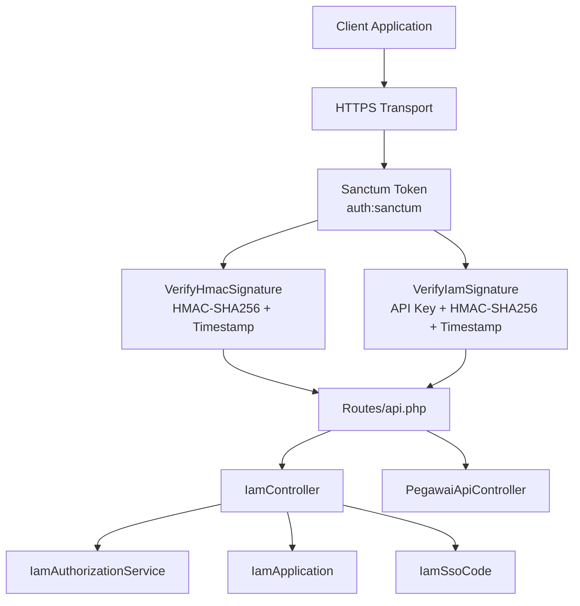
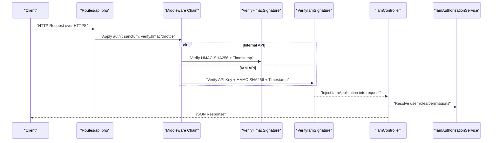
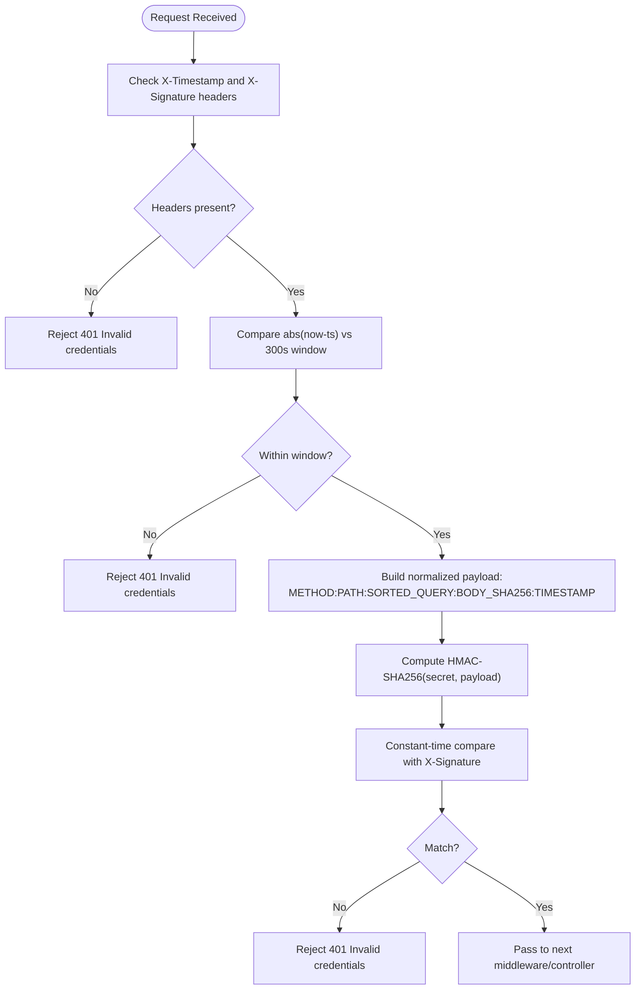
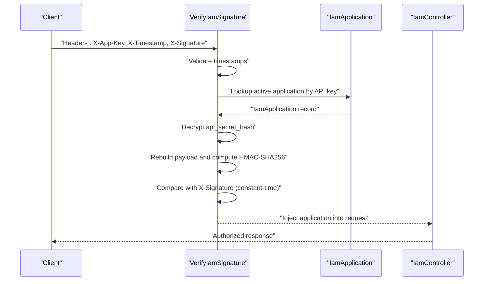
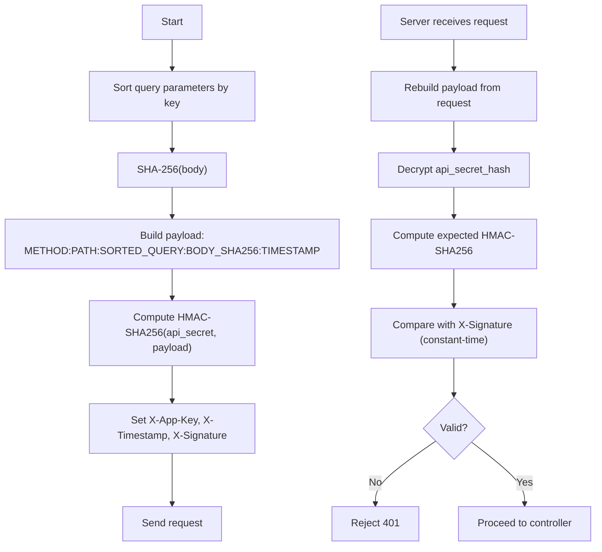
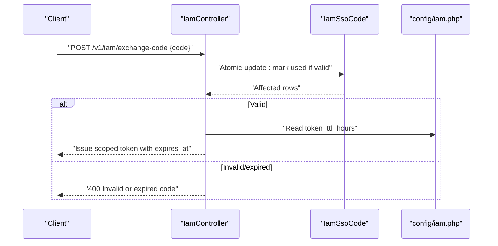
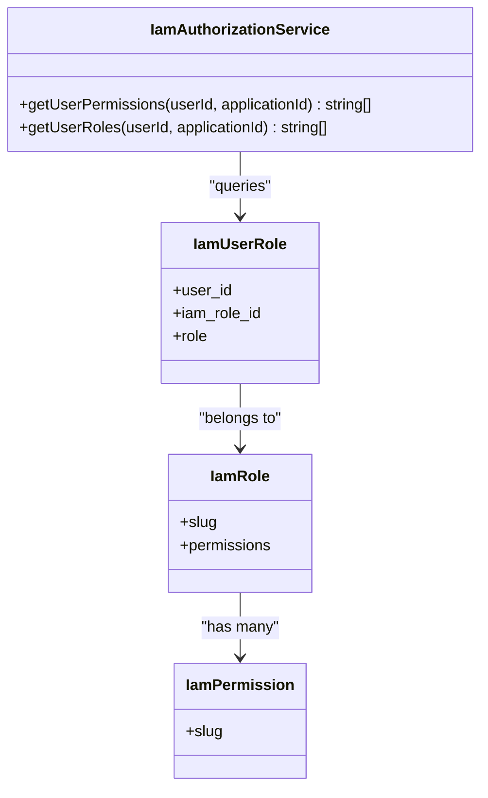
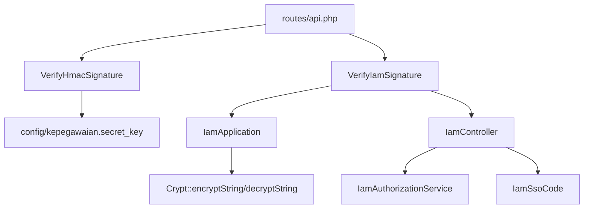

# Security Mechanisms

<cite>
**Referenced Files in This Document**
- [VerifyHmacSignature.php](file://app/Http/Middleware/VerifyHmacSignature.php)
- [VerifyIamSignature.php](file://app/Http/Middleware/VerifyIamSignature.php)
- [IamApplication.php](file://app/Models/IamApplication.php)
- [IamSsoCode.php](file://app/Models/IamSsoCode.php)
- [IamAuthorizationService.php](file://app/Services/IamAuthorizationService.php)
- [IamController.php](file://app/Http/Controllers/Api/IamController.php)
- [routes/api.php](file://routes/api.php)
- [config/iam.php](file://config/iam.php)
- [2026_03_21_000001_create_iam_tables.php](file://database/migrations/2026_03_21_000001_create_iam_tables.php)
- [VerifyIamSignatureTest.php](file://tests/Feature/Iam/VerifyIamSignatureTest.php)
- [IamValidateTest.php](file://tests/Feature/Iam/IamValidateTest.php)
- [PegawaiApiTest.php](file://tests/Feature/Api/PegawaiApiTest.php)
- [IamTestHelper.php](file://tests/Helpers/IamTestHelper.php)
</cite>

## Table of Contents
1. [Introduction](#introduction)
2. [Project Structure](#project-structure)
3. [Core Components](#core-components)
4. [Architecture Overview](#architecture-overview)
5. [Detailed Component Analysis](#detailed-component-analysis)
6. [Dependency Analysis](#dependency-analysis)
7. [Performance Considerations](#performance-considerations)
8. [Troubleshooting Guide](#troubleshooting-guide)
9. [Conclusion](#conclusion)
10. [Appendices](#appendices)

## Introduction
This document explains the security mechanisms within the IAM system, focusing on API authentication, HMAC signature verification, and secure communication. It covers cryptographic verification, API key validation, middleware integration, and practical workflows for generating and validating signatures. It also addresses request timestamp validation, nonce handling, replay attack prevention, and mitigation strategies against man-in-the-middle attacks, credential exposure, and secure key storage. Guidance is provided for implementing additional security layers and aligning with government security standards.

## Project Structure
The security architecture spans middleware, models, controllers, routes, configuration, and tests:
- Middleware enforces HMAC signature verification and timestamp validation for both internal and IAM APIs.
- Models encapsulate API application credentials, encryption/decryption of secrets, and SSO code lifecycle.
- Controllers orchestrate token validation, permission checks, logout, and SSO code exchange.
- Routes apply layered middleware for transport security, authentication, cryptographic verification, and rate limiting.
- Tests validate signature generation, tampering detection, and timestamp windows.

**Diagram sources**
- [routes/api.php:13-17](file://routes/api.php#L13-L17)
- [VerifyHmacSignature.php:9-16](file://app/Http/Middleware/VerifyHmacSignature.php#L9-L16)
- [VerifyIamSignature.php:11-16](file://app/Http/Middleware/VerifyIamSignature.php#L11-L16)
- [IamController.php:13-29](file://app/Http/Controllers/Api/IamController.php#L13-L29)
- [IamAuthorizationService.php:7-44](file://app/Services/IamAuthorizationService.php#L7-L44)
- [IamApplication.php:12-96](file://app/Models/IamApplication.php#L12-L96)
- [IamSsoCode.php:9-53](file://app/Models/IamSsoCode.php#L9-L53)

**Section sources**
- [routes/api.php:13-17](file://routes/api.php#L13-L17)
- [VerifyHmacSignature.php:9-16](file://app/Http/Middleware/VerifyHmacSignature.php#L9-L16)
- [VerifyIamSignature.php:11-16](file://app/Http/Middleware/VerifyIamSignature.php#L11-L16)
- [IamController.php:13-29](file://app/Http/Controllers/Api/IamController.php#L13-L29)

## Core Components
- HMAC signature verification middleware for internal APIs and IAM endpoints.
- API key validation and HMAC-SHA256 verification with encrypted secrets.
- Request timestamp validation to prevent replay attacks.
- Secure token issuance and SSO code exchange with strict validation and scoping.
- Authorization service to resolve user roles and permissions scoped to applications.

Key capabilities:
- Integrity and origin verification via HMAC-SHA256 over normalized payload.
- Replay protection via timestamp window validation.
- Tampering detection via sorted query string and body hash inclusion.
- Encrypted API secrets stored server-side for decryption during verification.

**Section sources**
- [VerifyHmacSignature.php:19-63](file://app/Http/Middleware/VerifyHmacSignature.php#L19-L63)
- [VerifyIamSignature.php:13-59](file://app/Http/Middleware/VerifyIamSignature.php#L13-L59)
- [IamApplication.php:67-94](file://app/Models/IamApplication.php#L67-L94)
- [IamController.php:17-89](file://app/Http/Controllers/Api/IamController.php#L17-L89)
- [IamAuthorizationService.php:16-43](file://app/Services/IamAuthorizationService.php#L16-L43)

## Architecture Overview
The IAM system applies a four-layer security model for integration endpoints:
1. Transport security via HTTPS.
2. Authentication via Laravel Sanctum tokens.
3. Cryptographic verification via HMAC-SHA256 signatures.
4. Operational protection via rate limiting.

**Diagram sources**
- [routes/api.php:22-47](file://routes/api.php#L22-L47)
- [VerifyHmacSignature.php:25-63](file://app/Http/Middleware/VerifyHmacSignature.php#L25-L63)
- [VerifyIamSignature.php:15-59](file://app/Http/Middleware/VerifyIamSignature.php#L15-L59)
- [IamController.php:17-89](file://app/Http/Controllers/Api/IamController.php#L17-L89)
- [IamAuthorizationService.php:16-43](file://app/Services/IamAuthorizationService.php#L16-L43)

## Detailed Component Analysis

### HMAC Signature Verification (Internal APIs)
The internal API uses a dedicated middleware to validate HMAC signatures and enforce timestamp windows:
- Validates presence of required headers.
- Enforces a five-minute timestamp window to prevent replay.
- Constructs a normalized payload including HTTP method, path, sorted query string, body SHA-256 digest, and timestamp.
- Computes expected HMAC-SHA256 using a server-side secret and compares with the received signature using constant-time comparison.

**Diagram sources**
- [VerifyHmacSignature.php:25-63](file://app/Http/Middleware/VerifyHmacSignature.php#L25-L63)

**Section sources**
- [VerifyHmacSignature.php:19-63](file://app/Http/Middleware/VerifyHmacSignature.php#L19-L63)

### API Key Validation and HMAC Verification (IAM APIs)
The IAM middleware validates requests using API keys and HMAC signatures:
- Extracts X-App-Key, X-Timestamp, and X-Signature.
- Confirms timestamp freshness.
- Retrieves the active application by API key and decrypts the stored API secret hash.
- Rebuilds the normalized payload and computes HMAC-SHA256 using the decrypted secret.
- Uses constant-time comparison to avoid timing attacks.
- Injects the resolved application into the request for downstream controllers.

**Diagram sources**
- [VerifyIamSignature.php:15-59](file://app/Http/Middleware/VerifyIamSignature.php#L15-L59)
- [IamApplication.php:85-94](file://app/Models/IamApplication.php#L85-L94)

**Section sources**
- [VerifyIamSignature.php:13-59](file://app/Http/Middleware/VerifyIamSignature.php#L13-L59)
- [IamApplication.php:67-94](file://app/Models/IamApplication.php#L67-L94)

### Signature Generation and Validation Workflows
Signature generation follows a deterministic, normalized process:
- Normalize query parameters by sorting keys.
- Compute body SHA-256 digest.
- Construct payload string with uppercase HTTP method, path, sorted query string, body hash, and timestamp.
- Compute HMAC-SHA256 using the API secret.
- Send headers: X-App-Key, X-Timestamp, X-Signature.

Validation mirrors this process on the server side, ensuring tamper detection and integrity guarantees.

**Diagram sources**
- [IamTestHelper.php:17-32](file://tests/Helpers/IamTestHelper.php#L17-L32)
- [VerifyIamSignature.php:35-46](file://app/Http/Middleware/VerifyIamSignature.php#L35-L46)

**Section sources**
- [IamTestHelper.php:17-32](file://tests/Helpers/IamTestHelper.php#L17-L32)
- [VerifyIamSignature.php:35-46](file://app/Http/Middleware/VerifyIamSignature.php#L35-L46)

### Secure Token Issuance and SSO Code Exchange
The IAM controller supports secure token exchange using a one-time SSO code:
- Validates the code length and atomic conditions: belongs to the correct application, unused, and not expired.
- Marks the code as used atomically.
- Issues a scoped personal access token with a configurable TTL and application-scoped abilities.

**Diagram sources**
- [IamController.php:53-89](file://app/Http/Controllers/Api/IamController.php#L53-L89)
- [config/iam.php:5-6](file://config/iam.php#L5-L6)
- [IamSsoCode.php:32-45](file://app/Models/IamSsoCode.php#L32-L45)

**Section sources**
- [IamController.php:53-89](file://app/Http/Controllers/Api/IamController.php#L53-L89)
- [config/iam.php:5-6](file://config/iam.php#L5-L6)
- [IamSsoCode.php:32-45](file://app/Models/IamSsoCode.php#L32-L45)

### Authorization Scoping and Role Resolution
The authorization service resolves user roles and permissions scoped to a specific application:
- Fetches user roles linked to the application.
- Gathers permission slugs from those roles.
- Returns deduplicated arrays for downstream checks.

**Diagram sources**
- [IamAuthorizationService.php:7-44](file://app/Services/IamAuthorizationService.php#L7-L44)

**Section sources**
- [IamAuthorizationService.php:16-43](file://app/Services/IamAuthorizationService.php#L16-L43)

### Request Timestamp Validation and Replay Prevention
Both middlewares enforce a five-minute timestamp window to mitigate replay attacks:
- Rejects requests where the absolute difference between server time and the provided timestamp exceeds the configured window.
- Ensures that signatures become invalid after the window elapses, reducing the risk of signature reuse.

**Section sources**
- [VerifyHmacSignature.php:35-38](file://app/Http/Middleware/VerifyHmacSignature.php#L35-L38)
- [VerifyIamSignature.php:25-27](file://app/Http/Middleware/VerifyIamSignature.php#L25-L27)

### Nonce Handling and Tamper Detection
Nonce handling is implicit via the timestamp and body hash:
- The timestamp prevents replay within the window.
- The body hash ensures message integrity; tampering with the body will invalidate the signature.
- The sorted query string ensures tampering with query parameters is detected.

**Section sources**
- [VerifyHmacSignature.php:47-53](file://app/Http/Middleware/VerifyHmacSignature.php#L47-L53)
- [VerifyIamSignature.php:36-42](file://app/Http/Middleware/VerifyIamSignature.php#L36-L42)

### Cryptographic Security Implementations
- HMAC-SHA256 is used for signature computation and verification.
- Constant-time comparison is enforced to prevent timing attacks.
- API secrets are stored as encrypted values and decrypted only during verification.
- Transport encryption via HTTPS is applied at the network boundary.

**Section sources**
- [VerifyHmacSignature.php:55-60](file://app/Http/Middleware/VerifyHmacSignature.php#L55-L60)
- [VerifyIamSignature.php:45-53](file://app/Http/Middleware/VerifyIamSignature.php#L45-L53)
- [IamApplication.php:85-94](file://app/Models/IamApplication.php#L85-L94)

### Practical Examples
- Generating a valid signature for testing:
  - Use the helper to construct payload and compute HMAC-SHA256 with the decrypted API secret.
  - Send headers: X-App-Key, X-Timestamp, X-Signature.
- Validating signature correctness:
  - Middleware reconstructs the payload and compares with the received signature using constant-time evaluation.
- Preventing tampering:
  - Changing query parameters or body content after signing will cause validation failure.

**Section sources**
- [IamTestHelper.php:17-32](file://tests/Helpers/IamTestHelper.php#L17-L32)
- [VerifyIamSignatureTest.php:32-56](file://tests/Feature/Iam/VerifyIamSignatureTest.php#L32-L56)
- [PegawaiApiTest.php:52-64](file://tests/Feature/Api/PegawaiApiTest.php#L52-L64)

## Dependency Analysis
The security stack integrates tightly across middleware, models, services, and controllers:

**Diagram sources**
- [VerifyHmacSignature.php:40-44](file://app/Http/Middleware/VerifyHmacSignature.php#L40-L44)
- [VerifyIamSignature.php:29-33](file://app/Http/Middleware/VerifyIamSignature.php#L29-L33)
- [IamApplication.php:85-94](file://app/Models/IamApplication.php#L85-L94)
- [IamController.php:17-29](file://app/Http/Controllers/Api/IamController.php#L17-L29)
- [routes/api.php:22-47](file://routes/api.php#L22-L47)

**Section sources**
- [routes/api.php:22-47](file://routes/api.php#L22-L47)
- [VerifyHmacSignature.php:40-44](file://app/Http/Middleware/VerifyHmacSignature.php#L40-L44)
- [VerifyIamSignature.php:29-33](file://app/Http/Middleware/VerifyIamSignature.php#L29-L33)
- [IamApplication.php:85-94](file://app/Models/IamApplication.php#L85-L94)
- [IamController.php:17-29](file://app/Http/Controllers/Api/IamController.php#L17-L29)

## Performance Considerations
- HMAC computation cost is minimal and constant-time; negligible overhead for typical request rates.
- Decryption of API secrets occurs only during signature verification; caching decrypted secrets is not implemented but could be considered if verification frequency is extremely high.
- Sorting query parameters is O(n log n) for n query keys; acceptable for small query sets typical of API endpoints.
- Middleware short-circuits on missing headers or expired timestamps, minimizing unnecessary work.

## Troubleshooting Guide
Common issues and resolutions:
- Missing or malformed headers:
  - Ensure X-App-Key, X-Timestamp, and X-Signature are present and correctly formatted.
- Expired timestamp:
  - Align client clock with server time; ensure the timestamp is within the five-minute window.
- Wrong API key or inactive application:
  - Confirm the application exists, is active, and matches the intended application.
- Incorrect signature:
  - Verify payload normalization (uppercase method, sorted query keys, body hash).
  - Confirm the API secret used for HMAC matches the stored encrypted secret.
- Tampering detection failures:
  - Do not modify query parameters or body after signing; resign with the updated payload.
- Encryption errors:
  - Ensure the stored api_secret_hash is valid and decryptable.

**Section sources**
- [VerifyIamSignature.php:21-33](file://app/Http/Middleware/VerifyIamSignature.php#L21-L33)
- [VerifyHmacSignature.php:31-38](file://app/Http/Middleware/VerifyHmacSignature.php#L31-L38)
- [VerifyIamSignatureTest.php:14-30](file://tests/Feature/Iam/VerifyIamSignatureTest.php#L14-L30)
- [PegawaiApiTest.php:37-64](file://tests/Feature/Api/PegawaiApiTest.php#L37-L64)

## Conclusion
The IAM system employs a robust, layered security model combining HTTPS, Sanctum tokens, HMAC-SHA256 signatures, and strict timestamp validation. API key-based verification with encrypted secrets ensures confidentiality and integrity. The design mitigates replay, tampering, and credential exposure risks while enabling secure, auditable integrations. Adhering to the documented signature generation and validation workflows, along with the troubleshooting guidance, ensures reliable and secure API communications.

## Appendices

### Security Best Practices and Compliance Guidelines
- Transport security:
  - Enforce TLS 1.2+ and modern cipher suites; disable legacy protocols.
- Credential storage:
  - Store API secrets encrypted at rest; never expose plaintext secrets.
  - Rotate secrets periodically and revoke compromised keys.
- Signature construction:
  - Always sort query parameters and include body hash in the payload.
  - Use constant-time comparison for signature verification.
- Operational hygiene:
  - Apply rate limiting and circuit breakers.
  - Monitor and log security events; alert on repeated 401 responses.
- Compliance alignment:
  - Align with standards requiring cryptographic verification, replay protection, and secure key management.
  - Maintain audit trails for token issuance and signature validation outcomes.