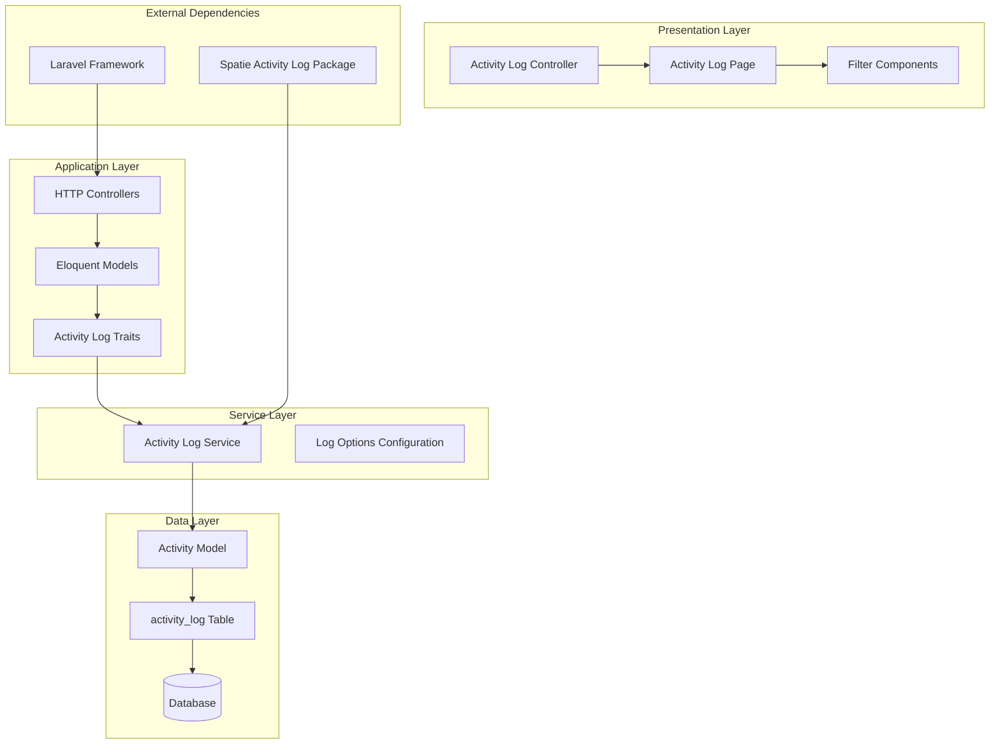
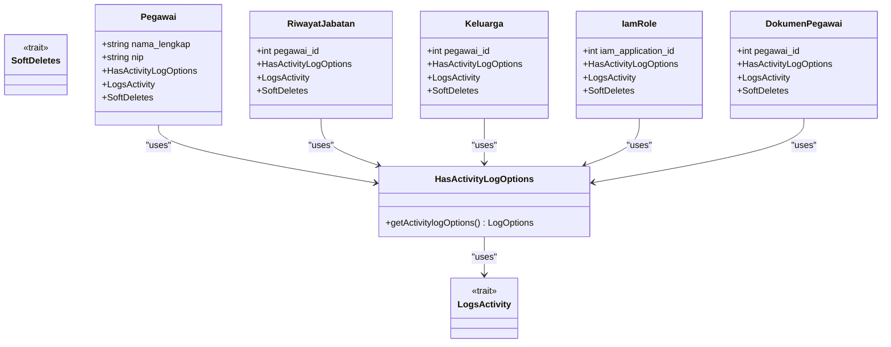
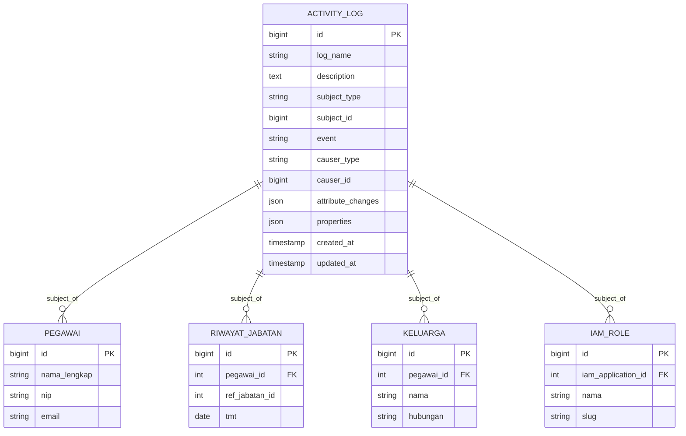

# Audit Trail System

<cite>
**Referenced Files in This Document**
- [config/activitylog.php](file://config/activitylog.php)
- [database/migrations/2026_04_17_012004_create_activity_log_table.php](file://database/migrations/2026_04_17_012004_create_activity_log_table.php)
- [app/Models/Concerns/HasActivityLogOptions.php](file://app/Models/Concerns/HasActivityLogOptions.php)
- [app/Models/Pegawai.php](file://app/Models/Pegawai.php)
- [app/Models/RiwayatJabatan.php](file://app/Models/RiwayatJabatan.php)
- [app/Models/Keluarga.php](file://app/Models/Keluarga.php)
- [app/Models/IamRole.php](file://app/Models/IamRole.php)
- [app/Models/DokumenPegawai.php](file://app/Models/DokumenPegawai.php)
- [app/Http/Controllers/ActivityLogController.php](file://app/Http/Controllers/ActivityLogController.php)
- [resources/js/pages/activity-log/index.tsx](file://resources/js/pages/activity-log/index.tsx)
- [routes/web.php](file://routes/web.php)
- [tests/Feature/ActivityLogTest.php](file://tests/Feature/ActivityLogTest.php)
- [composer.json](file://composer.json)
</cite>

## Table of Contents
1. [Introduction](#introduction)
2. [System Architecture](#system-architecture)
3. [Core Components](#core-components)
4. [Audit Trail Implementation](#audit-trail-implementation)
5. [Activity Log Management](#activity-log-management)
6. [Security and Access Control](#security-and-access-control)
7. [Data Model Design](#data-model-design)
8. [Frontend Interface](#frontend-interface)
9. [Testing and Validation](#testing-and-validation)
10. [Performance Considerations](#performance-considerations)
11. [Troubleshooting Guide](#troubleshooting-guide)
12. [Conclusion](#conclusion)

## Introduction

The Audit Trail System in the Kepegawaian Apps is a comprehensive activity logging solution built on Laravel's spatie/laravel-activitylog package. This system provides detailed tracking of all user actions and system events across the entire application, enabling compliance, accountability, and operational transparency for government employee management processes.

The system captures every significant change made to employee records, organizational data, and system configurations, maintaining a complete chronological history of all activities performed within the application. This audit trail serves multiple purposes including regulatory compliance, internal monitoring, forensic analysis capabilities, and operational oversight.

## System Architecture

The audit trail system follows a layered architecture pattern with clear separation of concerns between data capture, storage, retrieval, and presentation layers.

**Diagram sources**
- [app/Http/Controllers/ActivityLogController.php:1-59](file://app/Http/Controllers/ActivityLogController.php#L1-59)
- [app/Models/Concerns/HasActivityLogOptions.php:1-18](file://app/Models/Concerns/HasActivityLogOptions.php#L1-18)
- [config/activitylog.php:1-74](file://config/activitylog.php#L1-74)

## Core Components

### Activity Log Configuration

The system configuration is managed through a centralized configuration file that defines logging behavior, retention policies, and performance optimizations.

**Configuration Features:**
- **Enable/Disable Logging**: Master switch controlled by environment variables
- **Retention Policy**: Automatic cleanup of old activity records after 365 days
- **Buffering**: Optional memory buffering for high-volume logging scenarios
- **Custom Actions**: Extensible action classes for logging and cleanup operations

**Section sources**
- [config/activitylog.php:1-74](file://config/activitylog.php#L1-74)

### Activity Log Model

The core activity model extends Spatie's base Activity model with customizations for the application's specific needs.

**Key Model Features:**
- **Polymorphic Relationships**: Supports logging of any Eloquent model as subject
- **JSON Storage**: Efficient storage of attribute changes and custom properties
- **Timestamp Management**: Automatic creation and modification timestamps
- **Event Tracking**: Comprehensive event logging (created, updated, deleted, restored)

**Section sources**
- [database/migrations/2026_04_17_012004_create_activity_log_table.php:1-24](file://database/migrations/2026_04_17_012004_create_activity_log_table.php#L1-24)

### Activity Log Traits

The HasActivityLogOptions trait provides standardized logging configuration across all auditable models.

**Trait Configuration:**
- **Dirty Field Logging**: Only logs changed attributes, not empty changes
- **Fillable Attribute Logging**: Automatically tracks fillable model attributes
- **Event Description**: Customizes activity descriptions based on operation type
- **Conflict Resolution**: Proper precedence handling between multiple traits

**Section sources**
- [app/Models/Concerns/HasActivityLogOptions.php:1-18](file://app/Models/Concerns/HasActivityLogOptions.php#L1-18)

## Audit Trail Implementation

### Model-Level Integration

The audit trail system is seamlessly integrated into all business models through consistent trait usage and configuration patterns.

**Diagram sources**
- [app/Models/Pegawai.php:26-33](file://app/Models/Pegawai.php#L26-33)
- [app/Models/RiwayatJabatan.php:10-17](file://app/Models/RiwayatJabatan.php#L10-17)
- [app/Models/Keluarga.php:10-17](file://app/Models/Keluarga.php#L10-17)
- [app/Models/IamRole.php:10-17](file://app/Models/IamRole.php#L10-17)
- [app/Models/DokumenPegawai.php:9-16](file://app/Models/DokumenPegawai.php#L9-16)

### Automatic Event Capture

The system automatically captures CRUD operations and other significant events without requiring manual intervention in business logic.

**Supported Events:**
- **Created**: New record insertion with initial attribute values
- **Updated**: Record modifications with before/after attribute comparisons
- **Deleted**: Record removal with preserved attribute data
- **Restored**: Soft-deleted record restoration

**Section sources**
- [app/Models/Concerns/HasActivityLogOptions.php:9-16](file://app/Models/Concerns/HasActivityLogOptions.php#L9-16)

## Activity Log Management

### Controller Implementation

The ActivityLogController provides comprehensive management capabilities for viewing and filtering audit trail data.

**Controller Features:**
- **Multi-Filters**: Subject type, causer, date range filtering
- **Pagination Support**: Efficient handling of large activity datasets
- **Relationship Loading**: Eager loading of causer and subject relationships
- **Data Transformation**: Consistent API response formatting

**Section sources**
- [app/Http/Controllers/ActivityLogController.php:1-59](file://app/Http/Controllers/ActivityLogController.php#L1-59)

### Frontend Interface

The React-based frontend provides an intuitive interface for browsing and analyzing audit trail data.

**Interface Components:**
- **Filter Panel**: Subject type selection, date range picker
- **Activity Table**: Chronological display of logged activities
- **Change Visualization**: Side-by-side comparison of attribute changes
- **Navigation Controls**: Pagination and filter persistence

**Section sources**
- [resources/js/pages/activity-log/index.tsx:1-163](file://resources/js/pages/activity-log/index.tsx#L1-163)

## Security and Access Control

### Route Protection

The activity log endpoint is protected by comprehensive middleware ensuring only authorized users can access audit trail data.

**Access Control Features:**
- **Authentication Required**: Users must be logged in
- **Permission-Based Authorization**: IAM permission checking
- **Role-Based Access**: Admin-only access restriction
- **Middleware Chain**: Multiple security layers enforcement

**Section sources**
- [routes/web.php:44-47](file://routes/web.php#L44-47)

### Data Privacy Considerations

The system handles sensitive personal information with appropriate privacy safeguards and access restrictions.

**Privacy Measures:**
- **Role-Based Visibility**: Different access levels for various user roles
- **Data Minimization**: Only necessary information displayed in audit trails
- **Access Logging**: Administrative actions are themselves logged
- **Compliance Alignment**: GDPR and local data protection regulations adherence

## Data Model Design

### Database Schema

The activity_log table is designed for optimal performance and comprehensive data retention.

**Diagram sources**
- [database/migrations/2026_04_17_012004_create_activity_log_table.php:11-21](file://database/migrations/2026_04_17_012004_create_activity_log_table.php#L11-21)

### Indexing Strategy

The database schema includes strategic indexing for optimal query performance on frequently accessed audit trail data.

**Index Configuration:**
- **Primary Index**: Auto-incrementing ID for fast record lookup
- **Log Name Index**: Filter by log categories
- **Subject Relationship Indexes**: Polymorphic subject type and ID
- **Causer Relationship Indexes**: Polymorphic causer type and ID
- **Timestamp Index**: Creation time sorting and filtering

**Section sources**
- [database/migrations/2026_04_17_012004_create_activity_log_table.php:13-21](file://database/migrations/2026_04_17_012004_create_activity_log_table.php#L13-21)

## Frontend Interface

### Activity Display Components

The frontend interface provides comprehensive visualization of audit trail data with user-friendly filtering capabilities.

**Display Features:**
- **Event Type Indicators**: Color-coded badges for different activity types
- **Timestamp Formatting**: Human-readable date and time display
- **Model Identification**: Clear indication of affected entity types
- **Change Diff Visualization**: Side-by-side before/after attribute comparisons

**Section sources**
- [resources/js/pages/activity-log/index.tsx:12-32](file://resources/js/pages/activity-log/index.tsx#L12-32)

### Filter Functionality

Advanced filtering capabilities enable precise targeting of specific audit trail entries.

**Filter Options:**
- **Subject Type Filtering**: Narrow down to specific entity types
- **Date Range Selection**: Precise time window targeting
- **Real-time Search**: Instant filtering without page reloads
- **Filter Persistence**: Maintains filter state across navigation

**Section sources**
- [resources/js/pages/activity-log/index.tsx:34-47](file://resources/js/pages/activity-log/index.tsx#L34-47)

## Testing and Validation

### Automated Test Coverage

The system includes comprehensive automated tests ensuring audit trail functionality operates correctly under various scenarios.

**Test Categories:**
- **Activity Creation**: Verification of proper activity logging on updates
- **Change Detection**: Confirmation of attribute change tracking accuracy
- **Access Control**: Validation of permission-based access restrictions
- **UI Rendering**: Testing of activity log page functionality

**Section sources**
- [tests/Feature/ActivityLogTest.php:1-105](file://tests/Feature/ActivityLogTest.php#L1-105)

### Test Scenarios

The test suite covers critical audit trail functionality including edge cases and error conditions.

**Validation Tests:**
- **Empty Change Prevention**: Activities are not created when no fields change
- **Multi-model Support**: Different entity types properly logged
- **Permission Enforcement**: Access restricted to authorized users only
- **Data Integrity**: Logged changes accurately reflect actual modifications

## Performance Considerations

### Memory Optimization

The system implements several performance optimizations for handling large volumes of audit trail data.

**Performance Features:**
- **Lazy Loading**: Eager loading of relationships to minimize N+1 queries
- **Pagination**: Efficient handling of large activity datasets
- **Buffering**: Optional memory buffering for high-volume scenarios
- **Index Utilization**: Strategic indexing for optimal query performance

**Section sources**
- [app/Http/Controllers/ActivityLogController.php:16-25](file://app/Http/Controllers/ActivityLogController.php#L16-25)

### Scalability Design

The audit trail system is designed to scale efficiently as the application grows and activity volume increases.

**Scalability Features:**
- **Database Indexing**: Optimized database schema for high-performance queries
- **Memory Management**: Configurable buffering for resource-constrained environments
- **Query Optimization**: Efficient Eloquent queries with proper relationship loading
- **Retention Management**: Automated cleanup of old activity records

## Troubleshooting Guide

### Common Issues and Solutions

**Activity Logging Not Working:**
- Verify spatie/laravel-activitylog package installation
- Check ACTIVITYLOG_ENABLED environment variable setting
- Ensure models properly use HasActivityLogOptions trait
- Confirm database migration for activity_log table exists

**Missing Activities in UI:**
- Verify user has required IAM permissions
- Check filter criteria that might exclude activities
- Ensure proper authentication state
- Validate route protection middleware configuration

**Performance Issues:**
- Enable activity log buffering for high-volume scenarios
- Optimize database indexes if query performance degrades
- Consider implementing additional filters to reduce result sets
- Monitor database storage growth and adjust retention policies

### Debugging Tools

**Development Utilities:**
- Activity log inspection through database queries
- Laravel debugbar integration for query analysis
- Environment variable verification
- Middleware stack inspection for request flow analysis

## Conclusion

The Audit Trail System in Kepegawaian Apps represents a robust, scalable solution for comprehensive activity logging and compliance requirements. Through careful architectural design, consistent implementation patterns, and thorough testing, the system provides reliable tracking of all user actions and system events.

Key strengths of the implementation include:

- **Comprehensive Coverage**: All major business entities participate in the audit trail
- **Performance Optimization**: Efficient database design and query patterns
- **Security Integration**: Tight coupling with the application's permission system
- **User Experience**: Intuitive interface for browsing and analyzing audit data
- **Maintainability**: Clean separation of concerns and consistent coding patterns

The system successfully balances functional completeness with performance efficiency, providing valuable insights into system usage while maintaining optimal application performance. Future enhancements could include advanced analytics capabilities, export functionality, and integration with external compliance systems.