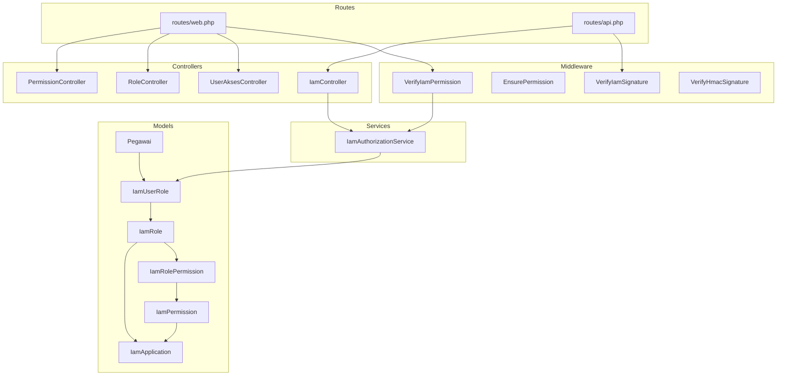
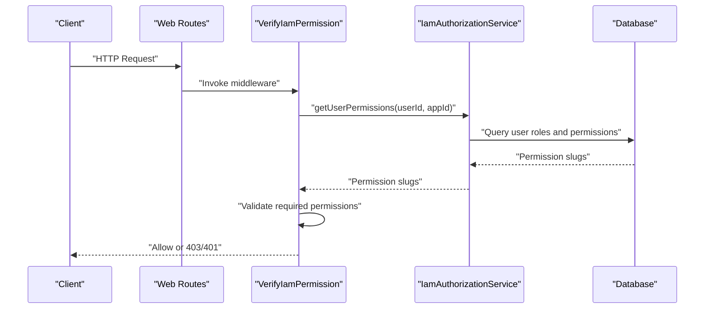
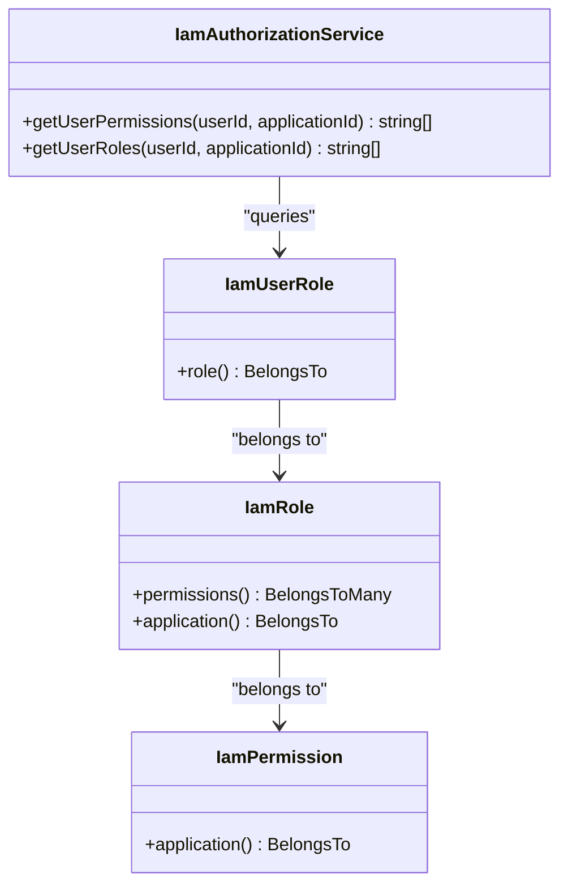
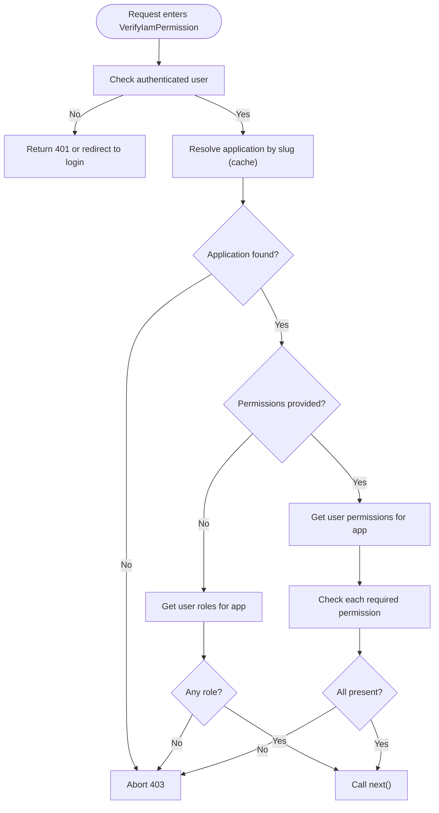
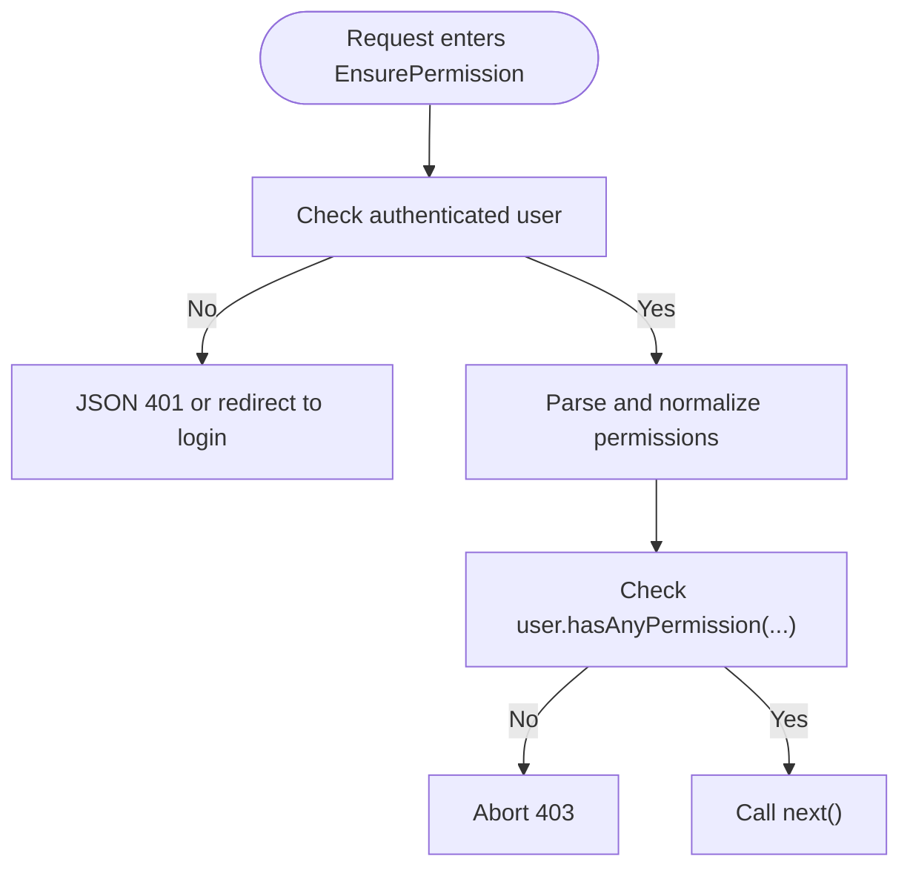
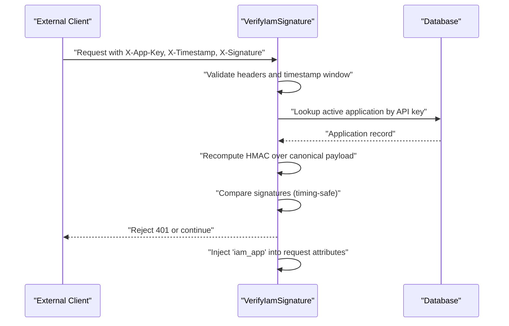
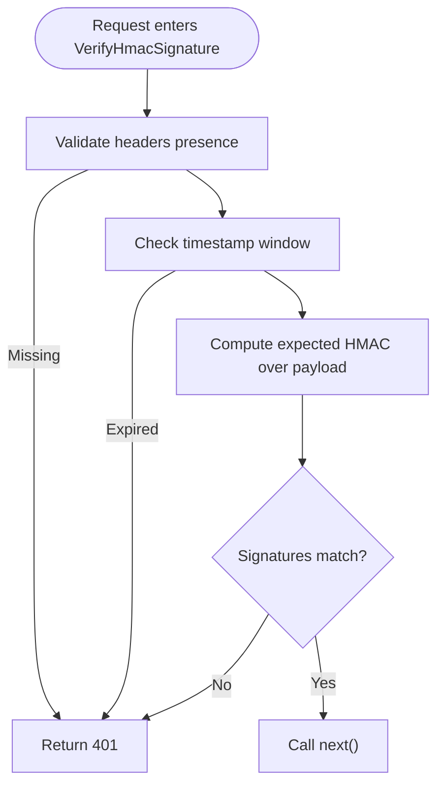
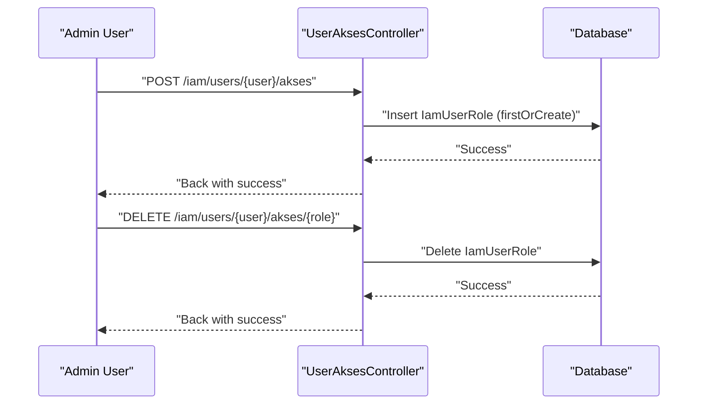
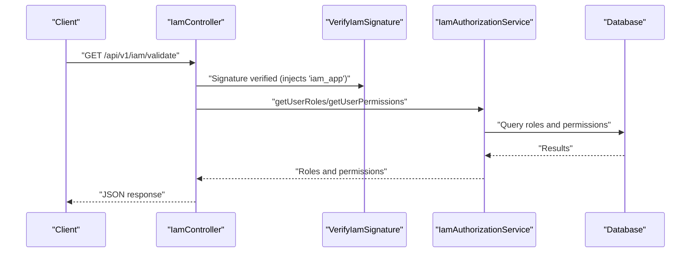
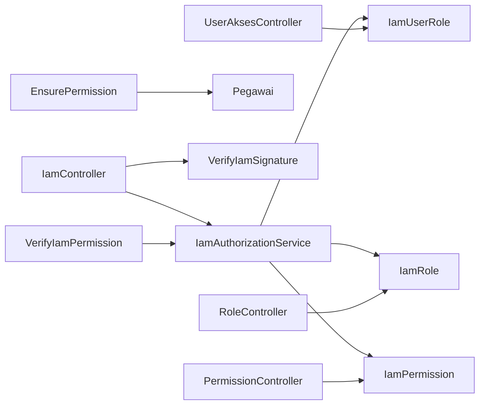

# User Access Control

<cite>
**Referenced Files in This Document**
- [IamAuthorizationService.php](file://app/Services/IamAuthorizationService.php)
- [VerifyIamPermission.php](file://app/Http/Middleware/VerifyIamPermission.php)
- [EnsurePermission.php](file://app/Http/Middleware/EnsurePermission.php)
- [VerifyIamSignature.php](file://app/Http/Middleware/VerifyIamSignature.php)
- [VerifyHmacSignature.php](file://app/Http/Middleware/VerifyHmacSignature.php)
- [IamController.php](file://app/Http/Controllers/Api/IamController.php)
- [UserAksesController.php](file://app/Http/Controllers/Iam/UserAksesController.php)
- [RoleController.php](file://app/Http/Controllers/Iam/RoleController.php)
- [PermissionController.php](file://app/Http/Controllers/Iam/PermissionController.php)
- [IamRole.php](file://app/Models/IamRole.php)
- [IamPermission.php](file://app/Models/IamPermission.php)
- [IamUserRole.php](file://app/Models/IamUserRole.php)
- [IamRolePermission.php](file://app/Models/IamRolePermission.php)
- [Pegawai.php](file://app/Models/Pegawai.php)
- [2026_03_21_000001_create_iam_tables.php](file://database/migrations/2026_03_21_000001_create_iam_tables.php)
- [web.php](file://routes/web.php)
- [api.php](file://routes/api.php)
- [iam.php](file://config/iam.php)
</cite>

## Table of Contents
1. [Introduction](#introduction)
2. [Project Structure](#project-structure)
3. [Core Components](#core-components)
4. [Architecture Overview](#architecture-overview)
5. [Detailed Component Analysis](#detailed-component-analysis)
6. [Dependency Analysis](#dependency-analysis)
7. [Performance Considerations](#performance-considerations)
8. [Troubleshooting Guide](#troubleshooting-guide)
9. [Conclusion](#conclusion)
10. [Appendices](#appendices)

## Introduction
This document explains the user access control mechanisms within the Identity and Access Management (IAM) system. It covers role assignment, permission validation, and authorization middleware implementation. It documents user access management workflows including role assignment, permission checking, and access revocation. It also explains the relationships between user roles, application permissions, and system-level access, along with authorization service patterns, permission caching strategies, and performance optimization techniques. Practical examples are drawn from the actual codebase, including middleware usage, service-layer authorization, and controller-level access control. Guidance is included for multi-application access, temporary permission overrides, and audit trail generation, with troubleshooting tips and security best practices.

## Project Structure
The IAM access control spans several layers:
- Models define the RBAC entities and relationships (applications, roles, permissions, user-role assignments).
- Controllers implement administrative and API endpoints for managing access.
- Middleware enforces authorization at the HTTP boundary and inside route groups.
- Services encapsulate permission and role retrieval logic.
- Routes bind middleware to controllers and define protected resource areas.



**Diagram sources**
- [web.php:35-136](file://routes/web.php#L35-L136)
- [api.php:22-47](file://routes/api.php#L22-L47)
- [VerifyIamPermission.php:12-53](file://app/Http/Middleware/VerifyIamPermission.php#L12-L53)
- [EnsurePermission.php:9-36](file://app/Http/Middleware/EnsurePermission.php#L9-L36)
- [VerifyIamSignature.php:11-60](file://app/Http/Middleware/VerifyIamSignature.php#L11-L60)
- [VerifyHmacSignature.php:17-64](file://app/Http/Middleware/VerifyHmacSignature.php#L17-L64)
- [IamController.php:13-90](file://app/Http/Controllers/Api/IamController.php#L13-L90)
- [UserAksesController.php:14-49](file://app/Http/Controllers/Iam/UserAksesController.php#L14-L49)
- [RoleController.php:12-64](file://app/Http/Controllers/Iam/RoleController.php#L12-L64)
- [PermissionController.php:12-51](file://app/Http/Controllers/Iam/PermissionController.php#L12-L51)
- [IamAuthorizationService.php:7-44](file://app/Services/IamAuthorizationService.php#L7-L44)
- [Pegawai.php:24-208](file://app/Models/Pegawai.php#L24-L208)
- [IamRole.php:10-37](file://app/Models/IamRole.php#L10-L37)
- [IamPermission.php:9-21](file://app/Models/IamPermission.php#L9-L21)
- [IamUserRole.php:7-32](file://app/Models/IamUserRole.php#L7-L32)
- [IamRolePermission.php:7-22](file://app/Models/IamRolePermission.php#L7-L22)

**Section sources**
- [web.php:31-136](file://routes/web.php#L31-L136)
- [api.php:21-47](file://routes/api.php#L21-L47)

## Core Components
- Authorization service: centralizes permission and role retrieval for a given user and application.
- IAM permission middleware: enforces application-scoped permissions for web routes.
- Generic permission middleware: checks permissions against the authenticated user’s roles.
- IAM signature middleware: validates external API requests for IAM endpoints.
- HMAC signature middleware: validates external API requests for internal integrations.
- Controllers: manage role and permission creation, updates, deletions, and user access assignment.
- Models: define the RBAC schema and relationships.

Key responsibilities:
- Role assignment: assign/remove roles to users for specific applications.
- Permission validation: check if a user possesses required permissions for a given application.
- Authorization enforcement: deny unauthorized access with appropriate HTTP responses.
- Audit and tracing: expose roles and permissions for validation and logging.

**Section sources**
- [IamAuthorizationService.php:7-44](file://app/Services/IamAuthorizationService.php#L7-L44)
- [VerifyIamPermission.php:12-53](file://app/Http/Middleware/VerifyIamPermission.php#L12-L53)
- [EnsurePermission.php:9-36](file://app/Http/Middleware/EnsurePermission.php#L9-L36)
- [VerifyIamSignature.php:11-60](file://app/Http/Middleware/VerifyIamSignature.php#L11-L60)
- [VerifyHmacSignature.php:17-64](file://app/Http/Middleware/VerifyHmacSignature.php#L17-L64)
- [UserAksesController.php:14-49](file://app/Http/Controllers/Iam/UserAksesController.php#L14-L49)
- [RoleController.php:12-64](file://app/Http/Controllers/Iam/RoleController.php#L12-L64)
- [PermissionController.php:12-51](file://app/Http/Controllers/Iam/PermissionController.php#L12-L51)
- [Pegawai.php:141-168](file://app/Models/Pegawai.php#L141-L168)

## Architecture Overview
The IAM access control architecture combines route-level middleware, service-layer authorization, and model-driven RBAC. Web routes are protected by IAM permission middleware, while API endpoints are protected by signature verification. Controllers orchestrate administrative actions for roles, permissions, and user access. The authorization service consolidates permission and role queries for reuse across middleware and controllers.



**Diagram sources**
- [web.php:35-136](file://routes/web.php#L35-L136)
- [VerifyIamPermission.php:16-51](file://app/Http/Middleware/VerifyIamPermission.php#L16-L51)
- [IamAuthorizationService.php:16-26](file://app/Services/IamAuthorizationService.php#L16-L26)

**Section sources**
- [web.php:35-136](file://routes/web.php#L35-L136)
- [VerifyIamPermission.php:12-53](file://app/Http/Middleware/VerifyIamPermission.php#L12-L53)
- [IamAuthorizationService.php:7-44](file://app/Services/IamAuthorizationService.php#L7-L44)

## Detailed Component Analysis

### Authorization Service Patterns
The authorization service encapsulates permission and role retrieval for a given user and application. It leverages eager loading to minimize N+1 queries and returns deduplicated permission slugs.



**Diagram sources**
- [IamAuthorizationService.php:7-44](file://app/Services/IamAuthorizationService.php#L7-L44)
- [IamUserRole.php:7-32](file://app/Models/IamUserRole.php#L7-L32)
- [IamRole.php:10-37](file://app/Models/IamRole.php#L10-L37)
- [IamPermission.php:9-21](file://app/Models/IamPermission.php#L9-L21)

**Section sources**
- [IamAuthorizationService.php:16-43](file://app/Services/IamAuthorizationService.php#L16-L43)

### Middleware Authorization: VerifyIamPermission
This middleware enforces application-scoped permissions for web routes. It:
- Requires an authenticated user.
- Resolves the target application by slug from configuration.
- Retrieves user roles or permissions depending on whether permissions were provided.
- Returns 401 for unauthenticated users and 403 for insufficient privileges.



**Diagram sources**
- [VerifyIamPermission.php:16-51](file://app/Http/Middleware/VerifyIamPermission.php#L16-L51)
- [iam.php:7-8](file://config/iam.php#L7-L8)

**Section sources**
- [VerifyIamPermission.php:16-51](file://app/Http/Middleware/VerifyIamPermission.php#L16-L51)
- [iam.php:4-8](file://config/iam.php#L4-L8)

### Middleware Authorization: EnsurePermission
This middleware checks permissions against the authenticated user’s roles. It supports comma-separated permission lists and trims whitespace. It returns 403 if the user lacks any required permission.



**Diagram sources**
- [EnsurePermission.php:11-34](file://app/Http/Middleware/EnsurePermission.php#L11-L34)
- [Pegawai.php:148-152](file://app/Models/Pegawai.php#L148-L152)

**Section sources**
- [EnsurePermission.php:11-34](file://app/Http/Middleware/EnsurePermission.php#L11-L34)
- [Pegawai.php:141-152](file://app/Models/Pegawai.php#L141-L152)

### API Authorization: VerifyIamSignature
This middleware authenticates and authorizes external API clients for IAM endpoints by validating:
- Presence of required headers.
- Timestamp freshness within a defined window.
- HMAC-SHA256 signature computed over a canonical payload.
- Application existence and active status.

It injects the resolved application into the request attributes for downstream controllers.



**Diagram sources**
- [VerifyIamSignature.php:15-58](file://app/Http/Middleware/VerifyIamSignature.php#L15-L58)

**Section sources**
- [VerifyIamSignature.php:15-58](file://app/Http/Middleware/VerifyIamSignature.php#L15-L58)

### API Authorization: VerifyHmacSignature
This middleware secures internal integrations with a shared secret. It validates:
- Required headers.
- Timestamp freshness.
- HMAC-SHA256 signature computed over a canonical payload.
- Configuration of the shared secret.



**Diagram sources**
- [VerifyHmacSignature.php:25-62](file://app/Http/Middleware/VerifyHmacSignature.php#L25-L62)

**Section sources**
- [VerifyHmacSignature.php:25-62](file://app/Http/Middleware/VerifyHmacSignature.php#L25-L62)

### Controller-Level Access Control: User Access Management
Administrative controllers manage role and permission lifecycles and user access assignment.

- UserAksesController: Lists users, shows their current access, assigns roles, and removes roles.
- RoleController: Creates, updates, and deletes roles scoped to an application; syncs permissions.
- PermissionController: Creates, updates, and deletes permissions scoped to an application.



**Diagram sources**
- [UserAksesController.php:33-48](file://app/Http/Controllers/Iam/UserAksesController.php#L33-L48)

**Section sources**
- [UserAksesController.php:16-48](file://app/Http/Controllers/Iam/UserAksesController.php#L16-L48)
- [RoleController.php:14-63](file://app/Http/Controllers/Iam/RoleController.php#L14-L63)
- [PermissionController.php:14-50](file://app/Http/Controllers/Iam/PermissionController.php#L14-L50)

### API Access Control: IamController
The IAM API controller exposes endpoints for validation, permission checks, logout, and SSO code exchange. It uses the authorization service to compute user roles and permissions and scopes tokens per application during SSO exchange.



**Diagram sources**
- [IamController.php:17-44](file://app/Http/Controllers/Api/IamController.php#L17-L44)
- [VerifyIamSignature.php:55-58](file://app/Http/Middleware/VerifyIamSignature.php#L55-L58)
- [IamAuthorizationService.php:16-26](file://app/Services/IamAuthorizationService.php#L16-L26)

**Section sources**
- [IamController.php:17-51](file://app/Http/Controllers/Api/IamController.php#L17-L51)

### RBAC Data Model
The RBAC schema defines applications, roles, permissions, and user-role assignments. Unique constraints prevent duplicate role assignments, and soft deletes support auditing.

```mermaid
erDiagram
IAM_APPLICATIONS {
ulid id PK
string slug UK
string api_key UK
boolean is_active
boolean is_system
timestamps timestamps
}
IAM_ROLES {
ulid id PK
ulid iam_application_id FK
string slug UK
boolean is_system
timestamps timestamps
}
IAM_PERMISSIONS {
ulid id PK
ulid iam_application_id FK
string slug UK
string group
timestamps timestamps
}
IAM_ROLE_PERMISSIONS {
id id PK
ulid iam_role_id FK
ulid iam_permission_id FK
timestamps timestamps
}
IAM_USER_ROLES {
id id PK
char user_id FK
ulid iam_role_id FK
timestamp assigned_at
char assigned_by FK
timestamps timestamps
}
IamApplication ||--o{ IamRole : "has many"
IamApplication ||--o{ IamPermission : "has many"
IamRole ||--o{ IamRolePermission : "has many"
IamRolePermission ||{ IamPermission : "links"
IamApplication ||--o{ IamUserRole : "referenced by"
IamRole ||--o{ IamUserRole : "referenced by"
Pegawai ||--o{ IamUserRole : "assigns"
```

**Diagram sources**
- [2026_03_21_000001_create_iam_tables.php:14-97](file://database/migrations/2026_03_21_000001_create_iam_tables.php#L14-L97)
- [IamUserRole.php:7-32](file://app/Models/IamUserRole.php#L7-L32)
- [IamRole.php:10-37](file://app/Models/IamRole.php#L10-L37)
- [IamPermission.php:9-21](file://app/Models/IamPermission.php#L9-L21)
- [IamRolePermission.php:7-22](file://app/Models/IamRolePermission.php#L7-L22)

**Section sources**
- [2026_03_21_000001_create_iam_tables.php:14-97](file://database/migrations/2026_03_21_000001_create_iam_tables.php#L14-L97)
- [IamUserRole.php:7-32](file://app/Models/IamUserRole.php#L7-L32)
- [IamRole.php:10-37](file://app/Models/IamRole.php#L10-L37)
- [IamPermission.php:9-21](file://app/Models/IamPermission.php#L9-L21)
- [IamRolePermission.php:7-22](file://app/Models/IamRolePermission.php#L7-L22)

## Dependency Analysis
- Middleware depends on the authorization service for permission/role retrieval.
- Controllers depend on models and the authorization service for validation.
- Routes bind middleware to protect resources and define access scopes.
- Signature middleware depends on application records and cryptographic secrets.



**Diagram sources**
- [VerifyIamPermission.php:14-16](file://app/Http/Middleware/VerifyIamPermission.php#L14-L16)
- [EnsurePermission.php:11-12](file://app/Http/Middleware/EnsurePermission.php#L11-L12)
- [IamAuthorizationService.php:16-26](file://app/Services/IamAuthorizationService.php#L16-L26)
- [IamController.php:15-28](file://app/Http/Controllers/Api/IamController.php#L15-L28)
- [VerifyIamSignature.php:29-33](file://app/Http/Middleware/VerifyIamSignature.php#L29-L33)
- [UserAksesController.php:33-48](file://app/Http/Controllers/Iam/UserAksesController.php#L33-L48)
- [RoleController.php:14-31](file://app/Http/Controllers/Iam/RoleController.php#L14-L31)
- [PermissionController.php:14-25](file://app/Http/Controllers/Iam/PermissionController.php#L14-L25)

**Section sources**
- [VerifyIamPermission.php:14-16](file://app/Http/Middleware/VerifyIamPermission.php#L14-L16)
- [EnsurePermission.php:11-12](file://app/Http/Middleware/EnsurePermission.php#L11-L12)
- [IamAuthorizationService.php:16-26](file://app/Services/IamAuthorizationService.php#L16-L26)
- [IamController.php:15-28](file://app/Http/Controllers/Api/IamController.php#L15-L28)
- [VerifyIamSignature.php:29-33](file://app/Http/Middleware/VerifyIamSignature.php#L29-L33)
- [UserAksesController.php:33-48](file://app/Http/Controllers/Iam/UserAksesController.php#L33-L48)
- [RoleController.php:14-31](file://app/Http/Controllers/Iam/RoleController.php#L14-L31)
- [PermissionController.php:14-25](file://app/Http/Controllers/Iam/PermissionController.php#L14-L25)

## Performance Considerations
- Eager loading: The authorization service loads roles with permissions to avoid N+1 queries.
- Caching: The IAM permission middleware caches the resolved application record keyed by slug for one hour.
- Deduplication: Returned permission arrays are de-duplicated to reduce downstream processing overhead.
- Indexing: Unique constraints on application+slug and user+role prevent redundant rows and speed lookups.
- Token scoping: API tokens are scoped per application to limit privilege blast radius.

Recommendations:
- Add Redis-backed caching for frequently accessed permission sets if traffic grows.
- Consider precomputing and caching user-permission maps per application for hot paths.
- Monitor slow queries on role/permission joins and add indexes if needed.

**Section sources**
- [IamAuthorizationService.php:18-25](file://app/Services/IamAuthorizationService.php#L18-L25)
- [VerifyIamPermission.php:27-30](file://app/Http/Middleware/VerifyIamPermission.php#L27-L30)
- [2026_03_21_000001_create_iam_tables.php:39-83](file://database/migrations/2026_03_21_000001_create_iam_tables.php#L39-L83)

## Troubleshooting Guide
Common issues and resolutions:
- 401 Unauthorized on web routes:
  - Cause: Unauthenticated user or missing auth middleware chain.
  - Resolution: Ensure the route group includes the required auth middleware before IAM permission middleware.
  - Section sources
    - [web.php:31-33](file://routes/web.php#L31-L33)
    - [VerifyIamPermission.php:20-24](file://app/Http/Middleware/VerifyIamPermission.php#L20-L24)

- 403 Forbidden on web routes:
  - Cause: No roles assigned for the configured application slug or missing required permissions.
  - Resolution: Assign roles to the user for the application and ensure the required permission slugs exist.
  - Section sources
    - [VerifyIamPermission.php:37-49](file://app/Http/Middleware/VerifyIamPermission.php#L37-L49)
    - [IamAuthorizationService.php:16-43](file://app/Services/IamAuthorizationService.php#L16-L43)

- 401/403 on API IAM endpoints:
  - Cause: Invalid or expired timestamp, missing/invalid headers, or incorrect signature.
  - Resolution: Verify headers, timestamp window, and HMAC computation; ensure application is active and keys are correct.
  - Section sources
    - [VerifyIamSignature.php:21-53](file://app/Http/Middleware/VerifyIamSignature.php#L21-L53)

- 401 on internal API endpoints:
  - Cause: Missing or invalid HMAC headers, misconfigured secret, or timestamp outside window.
  - Resolution: Confirm shared secret configuration and correct signature construction.
  - Section sources
    - [VerifyHmacSignature.php:30-62](file://app/Http/Middleware/VerifyHmacSignature.php#L30-L62)

- Role or permission not applying:
  - Cause: Incorrect application scoping or missing synchronization after updates.
  - Resolution: Verify application association and re-sync permissions for roles.
  - Section sources
    - [RoleController.php:26-48](file://app/Http/Controllers/Iam/RoleController.php#L26-L48)
    - [PermissionController.php:27-39](file://app/Http/Controllers/Iam/PermissionController.php#L27-L39)

- Audit trail generation:
  - Use the assigned_by field in user-role assignments and log changes around role assignment/deletion.
  - Section sources
    - [IamUserRole.php:35-36](file://app/Models/IamUserRole.php#L35-L36)

## Conclusion
The IAM system implements robust, layered access control:
- Route-level middleware enforces application-scoped permissions.
- Service-layer authorization consolidates permission retrieval.
- Signature middleware secures external API integrations.
- Controllers manage RBAC lifecycle and user access.
- Models define a normalized, auditable RBAC schema.

These components work together to support multi-application access, fine-grained permission checks, and secure token issuance. Administrators can manage roles and permissions efficiently, while developers can extend authorization logic safely using the provided service and middleware patterns.

## Appendices

### Multi-Application Access
- Applications are identified by slug and API key pairs. Middleware resolves the application and scopes permissions accordingly.
- Tokens issued during SSO exchange are scoped to a single application to minimize privilege exposure.
- Section sources
  - [VerifyIamSignature.php:29-33](file://app/Http/Middleware/VerifyIamSignature.php#L29-L33)
  - [IamController.php:77-81](file://app/Http/Controllers/Api/IamController.php#L77-L81)
  - [iam.php:7-8](file://config/iam.php#L7-L8)

### Temporary Permission Overrides
- For emergency overrides, temporarily relax middleware requirements or adjust role assignments. Revert promptly and document changes.
- Section sources
  - [VerifyIamPermission.php:37-49](file://app/Http/Middleware/VerifyIamPermission.php#L37-L49)
  - [EnsurePermission.php:30-32](file://app/Http/Middleware/EnsurePermission.php#L30-L32)

### Audit Trail Generation
- Track role assignments with timestamps and assigned_by fields.
- Log permission checks and token exchanges for compliance.
- Section sources
  - [IamUserRole.php:35-36](file://app/Models/IamUserRole.php#L35-L36)
  - [IamController.php:59-88](file://app/Http/Controllers/Api/IamController.php#L59-L88)