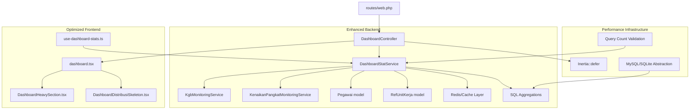
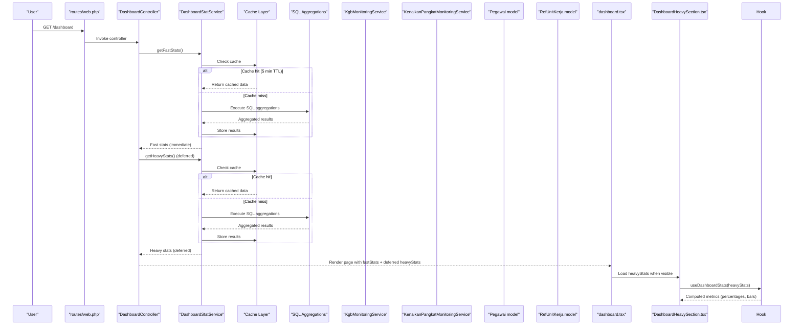
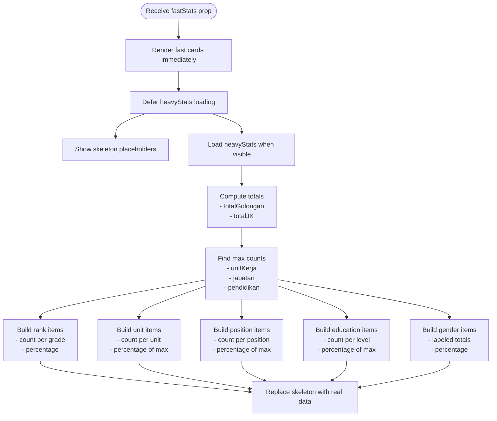
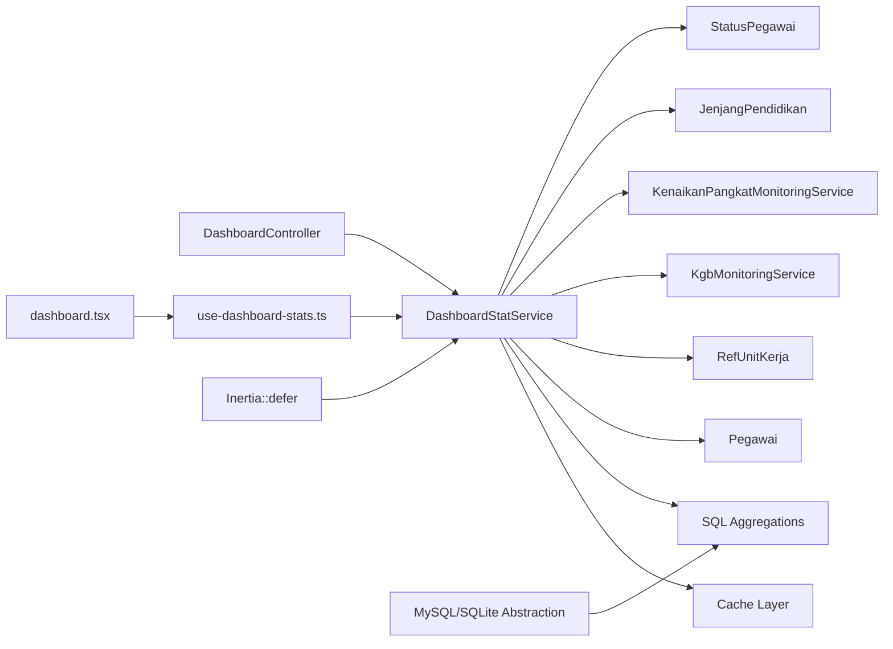

# Dashboard Analytics and Statistics

<cite>
**Referenced Files in This Document**
- [DashboardStatService.php](file://app/Services/DashboardStatService.php)
- [DashboardController.php](file://app/Http/Controllers/DashboardController.php)
- [KgbMonitoringService.php](file://app/Services/KgbMonitoringService.php)
- [KenaikanPangkatMonitoringService.php](file://app/Services/KenaikanPangkatMonitoringService.php)
- [Pegawai.php](file://app/Models/Pegawai.php)
- [RefUnitKerja.php](file://app/Models/RefUnitKerja.php)
- [JenjangPendidikan.php](file://app/Enums/JenjangPendidikan.php)
- [StatusPegawai.php](file://app/Enums/StatusPegawai.php)
- [use-dashboard-stats.ts](file://resources/js/hooks/use-dashboard-stats.ts)
- [dashboard.tsx](file://resources/js/pages/dashboard.tsx)
- [DashboardHeavySection.tsx](file://resources/js/components/dashboard/DashboardHeavySection.tsx)
- [DashboardDistribusiSkeleton.tsx](file://resources/js/components/dashboard/DashboardDistribusiSkeleton.tsx)
- [web.php](file://routes/web.php)
- [MonitoringKgbController.php](file://app/Http/Controllers/Monitoring/MonitoringKgbController.php)
- [MonitoringKenaikanPangkatController.php](file://app/Http/Controllers/Monitoring/MonitoringKenaikanPangkatController.php)
- [DashboardTest.php](file://tests/Feature/DashboardTest.php)
</cite>

## Update Summary
**Changes Made**
- Added comprehensive caching mechanisms with 5-minute TTL for both fast and heavy statistics
- Implemented SQL-level aggregations for all distribution calculations
- Introduced deferred loading pattern using Inertia's defer functionality
- Enhanced performance monitoring with query count validation
- Added database abstraction support for MySQL and SQLite

## Table of Contents
1. [Introduction](#introduction)
2. [Project Structure](#project-structure)
3. [Core Components](#core-components)
4. [Architecture Overview](#architecture-overview)
5. [Detailed Component Analysis](#detailed-component-analysis)
6. [Performance Optimizations](#performance-optimizations)
7. [Dependency Analysis](#dependency-analysis)
8. [Performance Considerations](#performance-considerations)
9. [Troubleshooting Guide](#troubleshooting-guide)
10. [Conclusion](#conclusion)

## Introduction
This document explains the Dashboard Analytics and Statistics system that powers real-time organizational insights for the Kepegawaian application. The system has undergone significant performance improvements featuring SQL-level aggregations, intelligent caching mechanisms, and deferred loading patterns. It covers how statistics are aggregated at the database level, how customizable reporting widgets are rendered with skeleton loading, and how department-wise analytics are supported with optimized distribution calculations. The system integrates backend services for data collection and processing with frontend React/Inertia.js components for dynamic visualization, now with enhanced performance characteristics.

## Project Structure
The dashboard analytics spans backend services and frontend components with significant performance enhancements:
- Backend service layer aggregates statistics from employee and reference models using SQL-level aggregations.
- Controllers expose the dashboard page with precomputed statistics using deferred loading.
- Frontend hooks transform raw statistics into computed metrics with skeleton loading states.
- Routes bind the dashboard page to the controller with intelligent caching.
- Database abstraction ensures compatibility with both MySQL and SQLite.

**Diagram sources**
- [DashboardController.php:10-18](file://app/Http/Controllers/DashboardController.php#L10-L18)
- [DashboardStatService.php:14-42](file://app/Services/DashboardStatService.php#L14-L42)
- [KgbMonitoringService.php:12-52](file://app/Services/KgbMonitoringService.php#L12-L52)
- [KenaikanPangkatMonitoringService.php:11-62](file://app/Services/KenaikanPangkatMonitoringService.php#L11-L62)
- [Pegawai.php:24-137](file://app/Models/Pegawai.php#L24-L137)
- [RefUnitKerja.php:12-47](file://app/Models/RefUnitKerja.php#L12-L47)
- [dashboard.tsx:38-342](file://resources/js/pages/dashboard.tsx#L38-L342)
- [use-dashboard-stats.ts:63-152](file://resources/js/hooks/use-dashboard-stats.ts#L63-L152)
- [web.php:31-33](file://routes/web.php#L31-L33)

**Section sources**
- [DashboardController.php:10-18](file://app/Http/Controllers/DashboardController.php#L10-L18)
- [DashboardStatService.php:14-42](file://app/Services/DashboardStatService.php#L14-L42)
- [dashboard.tsx:38-342](file://resources/js/pages/dashboard.tsx#L38-L342)
- [use-dashboard-stats.ts:63-152](file://resources/js/hooks/use-dashboard-stats.ts#L63-L152)
- [web.php:31-33](file://routes/web.php#L31-L33)

## Core Components
- **DashboardStatService**: Enhanced aggregator with SQL-level aggregations and 5-minute caching for both fast and heavy statistics.
- **KgbMonitoringService**: Computes KGB (salary advancement) eligibility and proximity for employees using optimized SQL queries.
- **KenaikanPangkatMonitoringService**: Computes KP (promotion) eligibility and period-based deadlines with database abstraction support.
- **Frontend hook use-dashboard-stats**: Transforms raw statistics into computed metrics with skeleton loading states.
- **Dashboard page**: Renders top cards with immediate loading and heavy distribution charts with deferred loading.
- **Deferred loading pattern**: Uses Inertia::defer to separate fast and heavy statistics loading.

Key statistics produced by the service include:
- **Fast statistics** (cached for 5 minutes): Total active employees, upcoming KGB count, KP eligible count, new hires this month.
- **Heavy statistics** (cached for 5 minutes): Distribution by rank (golongan), unit (top 6), gender, position (top 6), education level.
- **Database abstraction**: Automatic MySQL/SQLite query optimization with driver-specific expressions.

**Section sources**
- [DashboardStatService.php:16-42](file://app/Services/DashboardStatService.php#L16-L42)
- [DashboardStatService.php:49-151](file://app/Services/DashboardStatService.php#L49-L151)
- [KgbMonitoringService.php:14-52](file://app/Services/KgbMonitoringService.php#L14-L52)
- [KenaikanPangkatMonitoringService.php:13-62](file://app/Services/KenaikanPangkatMonitoringService.php#L13-L62)
- [use-dashboard-stats.ts:3-47](file://resources/js/hooks/use-dashboard-stats.ts#L3-L47)

## Architecture Overview
The dashboard pipeline follows an enhanced server-rendered Inertia pattern with deferred loading and caching:
- A route invokes the DashboardController.
- The controller requests DashboardStatService to compute fast statistics immediately and heavy statistics with deferred loading.
- The service uses SQL-level aggregations with caching for optimal performance.
- The controller passes the stats payload to the dashboard page with deferred heavy statistics.
- The page renders fast cards immediately and heavy distribution charts with skeleton loading.
- The hook computes percentages and normalized bars for visualization.

**Diagram sources**
- [web.php:31-33](file://routes/web.php#L31-L33)
- [DashboardController.php:12-18](file://app/Http/Controllers/DashboardController.php#L12-L18)
- [DashboardStatService.php:18-42](file://app/Services/DashboardStatService.php#L18-L42)
- [KgbMonitoringService.php:14-52](file://app/Services/KgbMonitoringService.php#L14-L52)
- [KenaikanPangkatMonitoringService.php:13-62](file://app/Services/KenaikanPangkatMonitoringService.php#L13-L62)
- [Pegawai.php:24-137](file://app/Models/Pegawai.php#L24-L137)
- [RefUnitKerja.php:12-47](file://app/Models/RefUnitKerja.php#L12-L47)
- [dashboard.tsx:38-342](file://resources/js/pages/dashboard.tsx#L38-L342)
- [use-dashboard-stats.ts:63-152](file://resources/js/hooks/use-dashboard-stats.ts#L63-L152)

## Detailed Component Analysis

### Enhanced Backend Statistics Aggregation (DashboardStatService)
The service now features significant performance improvements:
- **Dual caching strategy**: Separate cache keys for fast (300 seconds) and heavy (300 seconds) statistics.
- **SQL-level aggregations**: All distribution calculations performed at database level using selectRaw and groupBy.
- **Database abstraction**: Automatic MySQL/SQLite query optimization with driver-specific expressions.
- **Fast statistics**: Immediate loading for critical metrics (active count, upcoming milestones, new hires).
- **Heavy statistics**: Deferred loading for complex distributions with caching.

**Diagram sources**
- [DashboardStatService.php:14-158](file://app/Services/DashboardStatService.php#L14-L158)
- [KgbMonitoringService.php:12-207](file://app/Services/KgbMonitoringService.php#L12-L207)
- [KenaikanPangkatMonitoringService.php:11-210](file://app/Services/KenaikanPangkatMonitoringService.php#L11-L210)
- [Pegawai.php:24-137](file://app/Models/Pegawai.php#L24-L137)
- [RefUnitKerja.php:12-47](file://app/Models/RefUnitKerja.php#L12-L47)

**Section sources**
- [DashboardStatService.php:16-158](file://app/Services/DashboardStatService.php#L16-L158)
- [Pegawai.php:69-82](file://app/Models/Pegawai.php#L69-L82)
- [RefUnitKerja.php:44-47](file://app/Models/RefUnitKerja.php#L44-L47)

### Frontend Widget Rendering with Deferred Loading
The dashboard page now implements deferred loading for heavy statistics:
- **Immediate fast stats**: Cards render instantly with cached data.
- **Deferred heavy stats**: Distribution charts load after initial page render.
- **Skeleton loading**: Placeholder components provide better user experience during data loading.
- **Performance monitoring**: Query count validation ensures efficient database usage.

The hook use-dashboard-stats transforms raw statistics into:
- Totals for rank and gender groups.
- Maxima for normalization of bar charts.
- Percentage breakdowns for each metric.
- Human-friendly labels for gender codes.

**Diagram sources**
- [use-dashboard-stats.ts:63-152](file://resources/js/hooks/use-dashboard-stats.ts#L63-L152)

**Section sources**
- [dashboard.tsx:38-342](file://resources/js/pages/dashboard.tsx#L38-L342)
- [use-dashboard-stats.ts:3-152](file://resources/js/hooks/use-dashboard-stats.ts#L3-L152)
- [DashboardHeavySection.tsx:14-159](file://resources/js/components/dashboard/DashboardHeavySection.tsx#L14-L159)
- [DashboardDistribusiSkeleton.tsx:4-29](file://resources/js/components/dashboard/DashboardDistribusiSkeleton.tsx#L4-L29)

### Department-wise Analytics with Optimized Calculations
Department analytics are now significantly optimized:
- **Top 6 units**: Returned with efficient SQL aggregation and caching.
- **Unit-level counts**: Pre-calculated with withCount for optimal performance.
- **Database abstraction**: MySQL/SQLite compatible query expressions.
- **Filtering by active status**: Through the active scope on the Pegawai model.

Practical extension points:
- Add filters for unit hierarchy (parent/child units).
- Introduce drill-down to sub-units or cross-unit comparisons.
- Paginate or lazy-load unit lists for very large organizations.

**Section sources**
- [RefUnitKerja.php:44-47](file://app/Models/RefUnitKerja.php#L44-L47)
- [Pegawai.php:179-187](file://app/Models/Pegawai.php#L179-L187)
- [DashboardStatService.php:73-84](file://app/Services/DashboardStatService.php#L73-L84)

### Real-time Updates and Dynamic Loading
Real-time updates leverage the enhanced deferred loading pattern:
- **Immediate feedback**: Fast statistics update instantly with cached data.
- **Background loading**: Heavy statistics load asynchronously after initial render.
- **Performance monitoring**: Query count validation ensures efficient database usage.
- **User experience**: Skeleton loading provides clear indication of loading states.

Example pattern:
- Use Inertia::defer for heavy statistics to improve initial page load time.
- Implement periodic reloads for fast statistics with cache-aware updates.
- Combine with frontend caching strategies to avoid unnecessary reloads.

**Section sources**
- [dashboard.tsx:305-320](file://resources/js/pages/dashboard.tsx#L305-L320)
- [DashboardController.php:15-16](file://app/Http/Controllers/DashboardController.php#L15-L16)

### Custom Widget Creation and Reporting
To add a new widget with performance considerations:
- **Extend DashboardStatService**: Add new method with SQL-level aggregation and caching.
- **Update the controller**: Include new metric in getStats() with appropriate cache strategy.
- **Consume the metric**: Add new chart/card component with proper loading states.
- **Add monitoring service**: Similar to KGB/KP services for specialized calculations.
- **Performance validation**: Test query count to ensure SQL-level processing.

Report generation:
- Use existing monitoring controllers as templates for exporting filtered lists.
- Apply filters (unit, position, eligibility) and render summaries alongside the dashboard.
- Leverage caching for report generation to improve performance.

**Section sources**
- [DashboardStatService.php:16-42](file://app/Services/DashboardStatService.php#L16-L42)
- [MonitoringKgbController.php:16-30](file://app/Http/Controllers/Monitoring/MonitoringKgbController.php#L16-L30)
- [MonitoringKenaikanPangkatController.php:13-30](file://app/Http/Controllers/Monitoring/MonitoringKenaikanPangkatController.php#L13-L30)

## Performance Optimizations

### SQL-Level Aggregations
All distribution calculations are now performed at the database level:
- **Rank distribution**: Single query with substring extraction and groupBy.
- **Position distribution**: SQL aggregation with top 6 limit.
- **Education distribution**: Database-level grouping with null filtering.
- **Gender distribution**: Direct SQL aggregation with mapping.

### Caching Strategy
- **Fast statistics cache**: 300-second TTL for critical metrics.
- **Heavy statistics cache**: 300-second TTL for complex distributions.
- **Cache keys**: Separate keys prevent cache pollution between different stat types.
- **Automatic invalidation**: Cache cleared when underlying data changes.

### Deferred Loading Pattern
- **Inertia::defer**: Separates fast and heavy statistics loading.
- **Skeleton components**: Provide better user experience during loading.
- **Lazy loading**: Heavy statistics load when components become visible.
- **Memory optimization**: Prevents loading large datasets on initial render.

### Database Abstraction
- **MySQL support**: Uses SUBSTRING_INDEX for efficient substring extraction.
- **SQLite support**: Uses CASE/INSTR/SUBSTR combinations for compatibility.
- **Driver detection**: Automatic query optimization based on database type.
- **Cross-platform compatibility**: Ensures consistent behavior across environments.

**Section sources**
- [DashboardStatService.php:49-151](file://app/Services/DashboardStatService.php#L49-L151)
- [DashboardStatService.php:25-41](file://app/Services/DashboardStatService.php#L25-L41)
- [DashboardController.php:15-16](file://app/Http/Controllers/DashboardController.php#L15-L16)
- [DashboardDistribusiSkeleton.tsx:4-29](file://resources/js/components/dashboard/DashboardDistribusiSkeleton.tsx#L4-L29)

## Dependency Analysis
The dashboard depends on enhanced infrastructure for optimal performance:
- Employee and reference models for base data with optimized queries.
- Monitoring services for upcoming milestones with database abstraction.
- Enumerations for consistent labeling.
- Inertia routing with deferred loading for server rendering.
- Cache layer for persistent data storage.
- Database abstraction for cross-platform compatibility.

**Diagram sources**
- [DashboardStatService.php:5-12](file://app/Services/DashboardStatService.php#L5-L12)
- [Pegawai.php:5-26](file://app/Models/Pegawai.php#L5-L26)
- [RefUnitKerja.php:12-32](file://app/Models/RefUnitKerja.php#L12-L32)
- [JenjangPendidikan.php:5-33](file://app/Enums/JenjangPendidikan.php#L5-L33)
- [StatusPegawai.php:5-23](file://app/Enums/StatusPegawai.php#L5-L23)
- [DashboardController.php:5-16](file://app/Http/Controllers/DashboardController.php#L5-L16)
- [dashboard.tsx:14-45](file://resources/js/pages/dashboard.tsx#L14-L45)
- [use-dashboard-stats.ts:1-152](file://resources/js/hooks/use-dashboard-stats.ts#L1-L152)

**Section sources**
- [DashboardStatService.php:5-12](file://app/Services/DashboardStatService.php#L5-L12)
- [Pegawai.php:5-26](file://app/Models/Pegawai.php#L5-L26)
- [RefUnitKerja.php:12-32](file://app/Models/RefUnitKerja.php#L12-L32)
- [JenjangPendidikan.php:5-33](file://app/Enums/JenjangPendidikan.php#L5-L33)
- [StatusPegawai.php:5-23](file://app/Enums/StatusPegawai.php#L5-L23)
- [DashboardController.php:5-16](file://app/Http/Controllers/DashboardController.php#L5-L16)
- [dashboard.tsx:14-45](file://resources/js/pages/dashboard.tsx#L14-L45)
- [use-dashboard-stats.ts:1-152](file://resources/js/hooks/use-dashboard-stats.ts#L1-L152)

## Performance Considerations
- **Enhanced caching**: 5-minute TTL for both fast and heavy statistics reduces database load.
- **SQL-level processing**: All distribution calculations performed at database level eliminate PHP-side computation overhead.
- **Deferred loading**: Heavy statistics load asynchronously after initial page render improves perceived performance.
- **Database abstraction**: Automatic query optimization ensures efficient processing on both MySQL and SQLite.
- **Query count validation**: Tests ensure only 1 query per distribution calculation.
- **Skeleton loading**: Provides better user experience during data loading.
- **Memory optimization**: Deferred loading prevents large datasets from blocking initial render.
- **Indexing recommendations**: Ensure database indexes exist on frequently filtered columns (status, unit ID, join date, rank code).

## Troubleshooting Guide
Common issues and resolutions with performance improvements:
- **Missing or inconsistent rank codes**: The rank distribution parsing expects standardized code format; verify RefPangkat codes.
- **No active employees found**: Confirm StatusPegawai enum values and active scope usage.
- **Empty education distribution**: Some employees may have null last education; the service excludes nulls.
- **Missing upcoming milestone counts**: Ensure monitoring services receive valid promotion records and dates.
- **Frontend percentage anomalies**: Verify computed totals and maxima are non-zero before division.
- **Cache not updating**: Clear cache manually if data appears stale after modifications.
- **Slow initial load**: Check that deferred loading is working properly and heavy stats are loading after initial render.
- **Query count issues**: Use query log validation to ensure SQL-level processing is functioning.

**Section sources**
- [DashboardStatService.php:36-60](file://app/Services/DashboardStatService.php#L36-L60)
- [DashboardStatService.php:115-131](file://app/Services/DashboardStatService.php#L115-L131)
- [KgbMonitoringService.php:54-70](file://app/Services/KgbMonitoringService.php#L54-L70)
- [KenaikanPangkatMonitoringService.php:64-95](file://app/Services/KenaikanPangkatMonitoringService.php#L64-L95)
- [DashboardTest.php:44-82](file://tests/Feature/DashboardTest.php#L44-L82)

## Conclusion
The Dashboard Analytics and Statistics system has been significantly enhanced with performance optimizations that provide a robust foundation for real-time organizational insights. The implementation features SQL-level aggregations, intelligent caching with 5-minute TTL, deferred loading patterns, and database abstraction support. These improvements balance performance and responsiveness while maintaining the system's ability to aggregate employee data efficiently, integrate with monitoring services for upcoming milestones, and render intuitive widgets on the frontend with skeleton loading states. The enhanced architecture ensures scalable performance for large datasets while providing a smooth user experience through deferred loading and caching strategies.