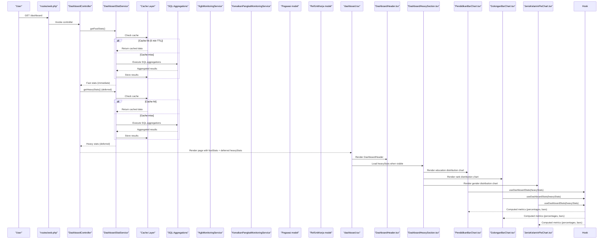
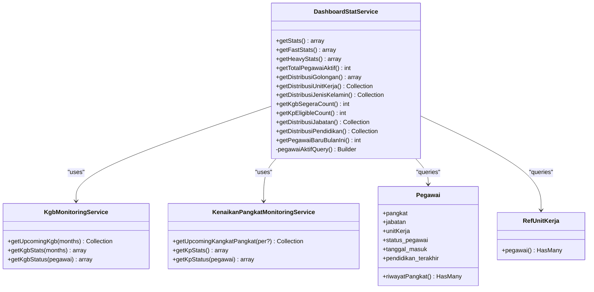
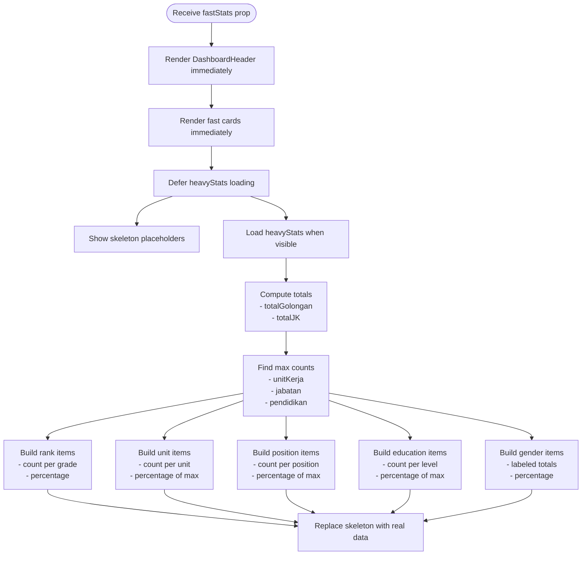
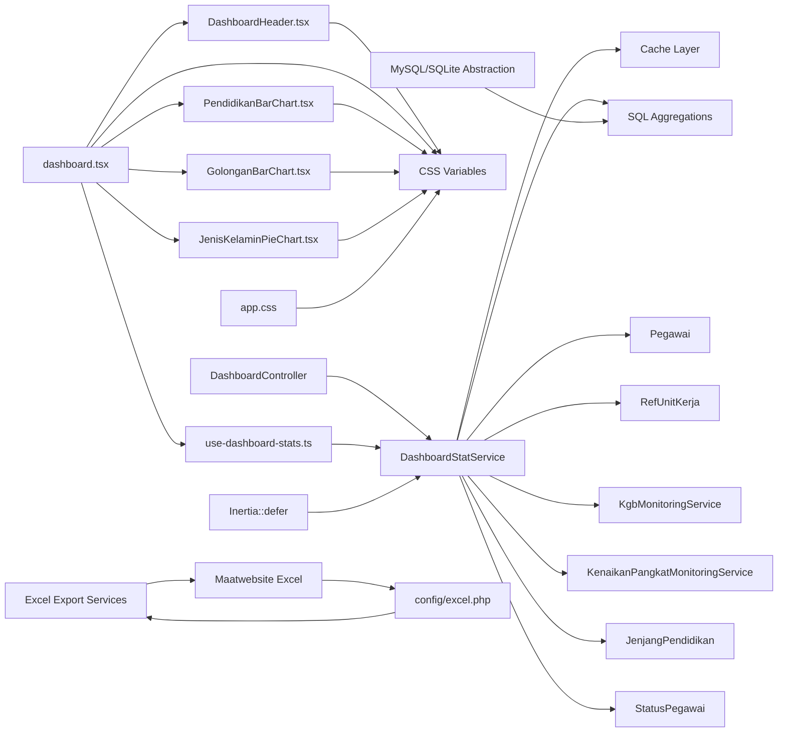

# Dashboard Analytics and Statistics

<cite>
**Referenced Files in This Document**
- [DashboardStatService.php](file://app/Services/DashboardStatService.php)
- [DashboardController.php](file://app/Http/Controllers/DashboardController.php)
- [KgbMonitoringService.php](file://app/Services/KgbMonitoringService.php)
- [KenaikanPangkatMonitoringService.php](file://app/Services/KenaikanPangkatMonitoringService.php)
- [Pegawai.php](file://app/Models/Pegawai.php)
- [RefUnitKerja.php](file://app/Models/RefUnitKerja.php)
- [JenjangPendidikan.php](file://app/Enums/JenjangPendidikan.php)
- [StatusPegawai.php](file://app/Enums/StatusPegawai.php)
- [use-dashboard-stats.ts](file://resources/js/hooks/use-dashboard-stats.ts)
- [dashboard.tsx](file://resources/js/pages/dashboard.tsx)
- [DashboardHeader.tsx](file://resources/js/components/dashboard/DashboardHeader.tsx)
- [DashboardHeavySection.tsx](file://resources/js/components/dashboard/DashboardHeavySection.tsx)
- [DashboardDistribusiSkeleton.tsx](file://resources/js/components/dashboard/DashboardDistribusiSkeleton.tsx)
- [JenisKelaminPieChart.tsx](file://resources/js/components/dashboard/JenisKelaminPieChart.tsx)
- [PendidikanBarChart.tsx](file://resources/js/components/dashboard/PendidikanBarChart.tsx)
- [GolonganBarChart.tsx](file://resources/js/components/dashboard/GolonganBarChart.tsx)
- [MonitoringKgbController.php](file://app/Http/Controllers/Monitoring/MonitoringKgbController.php)
- [MonitoringKenaikanPangkatController.php](file://app/Http/Controllers/Monitoring/MonitoringKenaikanPangkatController.php)
- [KgbMonitoringExport.php](file://app/Exports/KgbMonitoringExport.php)
- [KenaikanPangkatMonitoringExport.php](file://app/Exports/KenaikanPangkatMonitoringExport.php)
- [excel.php](file://config/excel.php)
- [web.php](file://routes/web.php)
- [DashboardTest.php](file://tests/Feature/DashboardTest.php)
- [app.css](file://resources/css/app.css)
</cite>

## Update Summary
**Changes Made**
- **Complete Architectural Restructuring**: Dashboard underwent comprehensive redesign with new DashboardHeader component and responsive grid layout
- **New DashboardHeader Component**: Added welcoming header with greeting messages, date display, and decorative background elements
- **Redesigned Heavy Dashboard Section**: Implemented responsive grid layout with improved card arrangements and hover effects
- **Theme-Aware Chart Components**: Updated chart components to use CSS variables for dynamic theming instead of hardcoded colors
- **Enhanced Visual Design**: Improved card styling with hover animations, border effects, and gradient backgrounds
- **Responsive Grid Layout**: Optimized dashboard layout for different screen sizes with flexible column arrangements

## Table of Contents
1. [Introduction](#introduction)
2. [Project Structure](#project-structure)
3. [Core Components](#core-components)
4. [Architecture Overview](#architecture-overview)
5. [Detailed Component Analysis](#detailed-component-analysis)
6. [Enhanced Interactive Chart Components](#enhanced-interactive-chart-components)
7. [Excel Export Functionality](#excel-export-functionality)
8. [Performance Optimizations](#performance-optimizations)
9. [Dependency Analysis](#dependency-analysis)
10. [Performance Considerations](#performance-considerations)
11. [Troubleshooting Guide](#troubleshooting-guide)
12. [Conclusion](#conclusion)

## Introduction
This document explains the Dashboard Analytics and Statistics system that powers real-time organizational insights for the Kepegawaian application. The system has undergone significant architectural enhancements featuring a new DashboardHeader component, redesigned heavy dashboard section with responsive grid layout, and theme-aware chart components with CSS variables. The system now provides sophisticated data visualization capabilities alongside its existing performance optimizations, including SQL-level aggregations, intelligent caching mechanisms, and deferred loading patterns.

## Project Structure
The dashboard analytics system now includes enhanced visualization components with specialized chart types and improved architectural patterns:
- Backend service layer aggregates statistics from employee and reference models using SQL-level aggregations.
- Controllers expose the dashboard page with precomputed statistics using deferred loading.
- Frontend hooks transform raw statistics into computed metrics with skeleton loading states.
- Specialized Recharts components provide enhanced visualizations for different data types.
- Theme-aware CSS variables enable dynamic color schemes across light and dark modes.
- Responsive grid layout adapts to different screen sizes for optimal user experience.
- Excel export functionality enables comprehensive data export with configurable settings.
- Routes bind the dashboard page to the controller with intelligent caching.
- Database abstraction ensures compatibility with both MySQL and SQLite.

```mermaid
graph TB
subgraph "Enhanced Backend"
DC["DashboardController"]
DSS["DashboardStatService"]
KGB["KgbMonitoringService"]
KP["KenaikanPangkatMonitoringService"]
PM["Pegawai model"]
RK["RefUnitKerja model"]
CACHE["Redis/Cache Layer"]
SQL["SQL Aggregations"]
EXPORT["Excel Export Services"]
EXCEL_CONFIG["config/excel.php"]
end
subgraph "Enhanced Frontend"
Page["dashboard.tsx"]
Header["DashboardHeader.tsx"]
Heavy["DashboardHeavySection.tsx"]
Skeleton["DashboardDistribusiSkeleton.tsx"]
PendidikanChart["PendidikanBarChart.tsx"]
GolonganChart["GolonganBarChart.tsx"]
GenderChart["JenisKelaminPieChart.tsx"]
CSS["app.css (CSS Variables)"]
end
subgraph "Performance Infrastructure"
Deferred["Inertia::defer"]
QueryLog["Query Count Validation"]
DBAbstraction["MySQL/SQLite Abstraction"]
Recharts["Recharts Library"]
Theme["CSS Variable Theming"]
Responsive["Responsive Grid Layout"]
end
R["routes/web.php"]
R --> DC
DC --> DSS
DSS --> CACHE
DSS --> SQL
DSS --> PM
DSS --> RK
DSS --> KGB
DSS --> KP
DC --> EXPORT
EXPORT --> EXCEL_CONFIG
DC --> Deferred
DC --> Page
Page --> Header
Page --> Heavy
Page --> Skeleton
Page --> PendidikanChart
Page --> GolonganChart
Page --> GenderChart
Header --> Theme
Heavy --> Responsive
PendidikanChart --> Theme
GolonganChart --> Theme
GenderChart --> Theme
CSS --> Theme
QueryLog --> DSS
DBAbstraction --> SQL
Recharts --> PendidikanChart
Recharts --> GolonganChart
Recharts --> GenderChart
```

**Diagram sources**
- [DashboardController.php:10-18](file://app/Http/Controllers/DashboardController.php#L10-L18)
- [DashboardStatService.php:14-42](file://app/Services/DashboardStatService.php#L14-L42)
- [KgbMonitoringService.php:12-52](file://app/Services/KgbMonitoringService.php#L12-L52)
- [KenaikanPangkatMonitoringService.php:11-62](file://app/Services/KenaikanPangkatMonitoringService.php#L11-L62)
- [Pegawai.php:24-137](file://app/Models/Pegawai.php#L24-L137)
- [RefUnitKerja.php:12-47](file://app/Models/RefUnitKerja.php#L12-L47)
- [dashboard.tsx:38-342](file://resources/js/pages/dashboard.tsx#L38-L342)
- [DashboardHeader.tsx:17-60](file://resources/js/components/dashboard/DashboardHeader.tsx#L17-L60)
- [DashboardHeavySection.tsx:16-137](file://resources/js/components/dashboard/DashboardHeavySection.tsx#L16-L137)
- [use-dashboard-stats.ts:63-152](file://resources/js/hooks/use-dashboard-stats.ts#L63-L152)
- [JenisKelaminPieChart.tsx:1-83](file://resources/js/components/dashboard/JenisKelaminPieChart.tsx#L1-83)
- [PendidikanBarChart.tsx:1-87](file://resources/js/components/dashboard/PendidikanBarChart.tsx#L1-87)
- [GolonganBarChart.tsx:1-78](file://resources/js/components/dashboard/GolonganBarChart.tsx#L1-78)
- [MonitoringKgbController.php:52-62](file://app/Http/Controllers/Monitoring/MonitoringKgbController.php#L52-L62)
- [MonitoringKenaikanPangkatController.php:49-59](file://app/Http/Controllers/Monitoring/MonitoringKenaikanPangkatController.php#L49-L59)
- [KgbMonitoringExport.php:1-117](file://app/Exports/KgbMonitoringExport.php#L1-117)
- [KenaikanPangkatMonitoringExport.php:1-85](file://app/Exports/KenaikanPangkatMonitoringExport.php#L1-85)
- [excel.php:1-381](file://config/excel.php#L1-L381)
- [web.php:31-33](file://routes/web.php#L31-L33)
- [app.css:48-104](file://resources/css/app.css#L48-L104)

**Section sources**
- [DashboardController.php:10-18](file://app/Http/Controllers/DashboardController.php#L10-L18)
- [DashboardStatService.php:14-42](file://app/Services/DashboardStatService.php#L14-L42)
- [dashboard.tsx:38-342](file://resources/js/pages/dashboard.tsx#L38-L342)
- [DashboardHeader.tsx:17-60](file://resources/js/components/dashboard/DashboardHeader.tsx#L17-L60)
- [DashboardHeavySection.tsx:16-137](file://resources/js/components/dashboard/DashboardHeavySection.tsx#L16-L137)
- [use-dashboard-stats.ts:63-152](file://resources/js/hooks/use-dashboard-stats.ts#L63-L152)
- [web.php:31-33](file://routes/web.php#L31-L33)

## Core Components
- **DashboardStatService**: Enhanced aggregator with SQL-level aggregations and 5-minute caching for both fast and heavy statistics.
- **DashboardHeader**: New welcoming component with greeting messages, date display, and decorative background elements.
- **DashboardHeavySection**: Redesigned responsive grid layout with improved card arrangements, hover effects, and progress indicators.
- **KgbMonitoringService**: Computes KGB (salary advancement) eligibility and proximity for employees using optimized SQL queries.
- **KenaikanPangkatMonitoringService**: Computes KP (promotion) eligibility and period-based deadlines with database abstraction support.
- **Frontend hook use-dashboard-stats**: Transforms raw statistics into computed metrics with skeleton loading states.
- **Specialized chart components**: Theme-aware Recharts components with CSS variable-based color schemes.
- **Excel export services**: Comprehensive export functionality for monitoring reports with configurable settings.
- **Excel configuration**: Advanced configuration management through config/excel.php for performance optimization.
- **Deferred loading pattern**: Uses Inertia::defer to separate fast and heavy statistics loading.

Key statistics produced by the service include:
- **Fast statistics** (cached for 5 minutes): Total active employees, upcoming KGB count, KP eligible count, new hires this month.
- **Heavy statistics** (cached for 5 minutes): Distribution by rank (golongan), unit (top 6), gender, position (top 6), education level.
- **Database abstraction**: Automatic MySQL/SQLite query optimization with driver-specific expressions.
- **Theme-aware visualizations**: Chart components dynamically adapt colors based on CSS variables for light/dark mode support.

**Section sources**
- [DashboardStatService.php:16-42](file://app/Services/DashboardStatService.php#L16-L42)
- [DashboardStatService.php:49-151](file://app/Services/DashboardStatService.php#L49-L151)
- [DashboardHeader.tsx:17-60](file://resources/js/components/dashboard/DashboardHeader.tsx#L17-L60)
- [DashboardHeavySection.tsx:16-137](file://resources/js/components/dashboard/DashboardHeavySection.tsx#L16-L137)
- [KgbMonitoringService.php:14-52](file://app/Services/KgbMonitoringService.php#L14-L52)
- [KenaikanPangkatMonitoringService.php:13-62](file://app/Services/KenaikanPangkatMonitoringService.php#L13-L62)
- [use-dashboard-stats.ts:3-47](file://resources/js/hooks/use-dashboard-stats.ts#L3-L47)
- [JenisKelaminPieChart.tsx:1-83](file://resources/js/components/dashboard/JenisKelaminPieChart.tsx#L1-L83)
- [PendidikanBarChart.tsx:1-87](file://resources/js/components/dashboard/PendidikanBarChart.tsx#L1-L87)
- [GolonganBarChart.tsx:1-78](file://resources/js/components/dashboard/GolonganBarChart.tsx#L1-L78)
- [MonitoringKgbController.php:52-62](file://app/Http/Controllers/Monitoring/MonitoringKgbController.php#L52-L62)
- [MonitoringKenaikanPangkatController.php:49-59](file://app/Http/Controllers/Monitoring/MonitoringKenaikanPangkatController.php#L49-L59)

## Architecture Overview
The dashboard pipeline follows an enhanced server-rendered Inertia pattern with deferred loading, caching, and theme-aware visualizations:
- A route invokes the DashboardController.
- The controller requests DashboardStatService to compute fast statistics immediately and heavy statistics with deferred loading.
- The service uses SQL-level aggregations with caching for optimal performance.
- The controller passes the stats payload to the dashboard page with deferred heavy statistics.
- The page renders DashboardHeader immediately and heavy distribution charts with skeleton loading.
- The hook computes percentages and normalized bars for visualization.
- Theme-aware chart components provide enhanced visual representations with dynamic color schemes.

**Diagram sources**
- [web.php:31-33](file://routes/web.php#L31-L33)
- [DashboardController.php:12-18](file://app/Http/Controllers/DashboardController.php#L12-L18)
- [DashboardStatService.php:18-42](file://app/Services/DashboardStatService.php#L18-L42)
- [KgbMonitoringService.php:14-52](file://app/Services/KgbMonitoringService.php#L14-L52)
- [KenaikanPangkatMonitoringService.php:13-62](file://app/Services/KenaikanPangkatMonitoringService.php#L13-L62)
- [Pegawai.php:24-137](file://app/Models/Pegawai.php#L24-L137)
- [RefUnitKerja.php:12-47](file://app/Models/RefUnitKerja.php#L12-L47)
- [dashboard.tsx:38-342](file://resources/js/pages/dashboard.tsx#L38-L342)
- [DashboardHeader.tsx:17-60](file://resources/js/components/dashboard/DashboardHeader.tsx#L17-L60)
- [DashboardHeavySection.tsx:16-137](file://resources/js/components/dashboard/DashboardHeavySection.tsx#L16-L137)
- [use-dashboard-stats.ts:63-152](file://resources/js/hooks/use-dashboard-stats.ts#L63-L152)
- [PendidikanBarChart.tsx:54-87](file://resources/js/components/dashboard/PendidikanBarChart.tsx#L54-L87)
- [GolonganBarChart.tsx:54-78](file://resources/js/components/dashboard/GolonganBarChart.tsx#L54-L78)
- [JenisKelaminPieChart.tsx:45-83](file://resources/js/components/dashboard/JenisKelaminPieChart.tsx#L45-L83)

## Detailed Component Analysis

### Enhanced Backend Statistics Aggregation (DashboardStatService)
The service now features significant performance improvements:
- **Dual caching strategy**: Separate cache keys for fast (300 seconds) and heavy (300 seconds) statistics.
- **SQL-level aggregations**: All distribution calculations performed at database level using selectRaw and groupBy.
- **Database abstraction**: Automatic MySQL/SQLite query optimization with driver-specific expressions.
- **Fast statistics**: Immediate loading for critical metrics (active count, upcoming milestones, new hires).
- **Heavy statistics**: Deferred loading for complex distributions with caching.

**Diagram sources**
- [DashboardStatService.php:14-158](file://app/Services/DashboardStatService.php#L14-L158)
- [KgbMonitoringService.php:12-207](file://app/Services/KgbMonitoringService.php#L12-L207)
- [KenaikanPangkatMonitoringService.php:11-210](file://app/Services/KenaikanPangkatMonitoringService.php#L11-L210)
- [Pegawai.php:24-137](file://app/Models/Pegawai.php#L24-L137)
- [RefUnitKerja.php:12-47](file://app/Models/RefUnitKerja.php#L12-L47)

**Section sources**
- [DashboardStatService.php:16-158](file://app/Services/DashboardStatService.php#L16-L158)
- [Pegawai.php:69-82](file://app/Models/Pegawai.php#L69-L82)
- [RefUnitKerja.php:44-47](file://app/Models/RefUnitKerja.php#L44-L47)

### New DashboardHeader Component
The DashboardHeader component provides an enhanced welcoming experience:
- **Dynamic greeting messages**: Personalized greetings based on time of day (Selamat Pagi, Selamat Siang, Selamat Sore, Selamat Malam).
- **Current date display**: Formatted Indonesian date with weekday, month, and year.
- **Decorative background elements**: Blurred circular shapes with gradient colors for visual appeal.
- **User information display**: Shows authenticated user's name with fallback to "Pengguna".
- **Blur fade animation**: Smooth entrance animation for better user experience.

**Section sources**
- [DashboardHeader.tsx:17-60](file://resources/js/components/dashboard/DashboardHeader.tsx#L17-L60)

### Redesigned Heavy Dashboard Section with Responsive Grid
The DashboardHeavySection now features a comprehensive responsive grid layout:
- **Responsive grid system**: Uses md:grid-cols-2 lg:grid-cols-4 for optimal desktop/mobile experience.
- **Enhanced card styling**: Hover animations, scale effects, and border transitions for interactive feel.
- **Progress indicators**: Replaces simple bars with styled Progress components for unit and position distributions.
- **Improved spacing**: Better padding and gap management for visual hierarchy.
- **Flexible column spans**: Cards span different column widths based on content complexity.

**Section sources**
- [DashboardHeavySection.tsx:16-137](file://resources/js/components/dashboard/DashboardHeavySection.tsx#L16-L137)

### Frontend Widget Rendering with Deferred Loading
The dashboard page now implements deferred loading for heavy statistics:
- **Immediate fast stats**: Cards render instantly with cached data.
- **Deferred heavy stats**: Distribution charts load after initial page render.
- **Skeleton loading**: Placeholder components provide better user experience during data loading.
- **Performance monitoring**: Query count validation ensures efficient database usage.

The hook use-dashboard-stats transforms raw statistics into:
- Totals for rank and gender groups.
- Maxima for normalization of bar charts.
- Percentage breakdowns for each metric.
- Human-friendly labels for gender codes.

**Diagram sources**
- [use-dashboard-stats.ts:63-152](file://resources/js/hooks/use-dashboard-stats.ts#L63-L152)

**Section sources**
- [dashboard.tsx:38-342](file://resources/js/pages/dashboard.tsx#L38-L342)
- [use-dashboard-stats.ts:3-152](file://resources/js/hooks/use-dashboard-stats.ts#L3-L152)
- [DashboardHeavySection.tsx:14-159](file://resources/js/components/dashboard/DashboardHeavySection.tsx#L14-L159)
- [DashboardDistribusiSkeleton.tsx:4-29](file://resources/js/components/dashboard/DashboardDistribusiSkeleton.tsx#L4-L29)

### Department-wise Analytics with Optimized Calculations
Department analytics are now significantly optimized:
- **Top 6 units**: Returned with efficient SQL aggregation and caching.
- **Unit-level counts**: Pre-calculated with withCount for optimal performance.
- **Database abstraction**: MySQL/SQLite compatible query expressions.
- **Filtering by active status**: Through the active scope on the Pegawai model.

Practical extension points:
- Add filters for unit hierarchy (parent/child units).
- Introduce drill-down to sub-units or cross-unit comparisons.
- Paginate or lazy-load unit lists for very large organizations.

**Section sources**
- [RefUnitKerja.php:44-47](file://app/Models/RefUnitKerja.php#L44-L47)
- [Pegawai.php:179-187](file://app/Models/Pegawai.php#L179-L187)
- [DashboardStatService.php:73-84](file://app/Services/DashboardStatService.php#L73-L84)

### Real-time Updates and Dynamic Loading
Real-time updates leverage the enhanced deferred loading pattern:
- **Immediate feedback**: Fast statistics update instantly with cached data.
- **Background loading**: Heavy statistics load asynchronously after initial render.
- **Performance monitoring**: Query count validation ensures efficient database usage.
- **User experience**: Skeleton loading provides clear indication of loading states.

Example pattern:
- Use Inertia::defer for heavy statistics to improve initial page load time.
- Implement periodic reloads for fast statistics with cache-aware updates.
- Combine with frontend caching strategies to avoid unnecessary reloads.

**Section sources**
- [dashboard.tsx:305-320](file://resources/js/pages/dashboard.tsx#L305-L320)
- [DashboardController.php:15-16](file://app/Http/Controllers/DashboardController.php#L15-L16)

### Custom Widget Creation and Reporting
To add a new widget with performance considerations:
- **Extend DashboardStatService**: Add new method with SQL-level aggregation and caching.
- **Update the controller**: Include new metric in getStats() with appropriate cache strategy.
- **Consume the metric**: Add new chart/card component with proper loading states.
- **Add monitoring service**: Similar to KGB/KP services for specialized calculations.
- **Performance validation**: Test query count to ensure SQL-level processing.

Report generation:
- Use existing monitoring controllers as templates for exporting filtered lists.
- Apply filters (unit, position, eligibility) and render summaries alongside the dashboard.
- Leverage caching for report generation to improve performance.

**Section sources**
- [DashboardStatService.php:16-42](file://app/Services/DashboardStatService.php#L16-L42)
- [MonitoringKgbController.php:16-30](file://app/Http/Controllers/Monitoring/MonitoringKgbController.php#L16-L30)
- [MonitoringKenaikanPangkatController.php:13-30](file://app/Http/Controllers/Monitoring/MonitoringKenaikanPangkatController.php#L13-L30)

## Enhanced Interactive Chart Components

### Theme-Aware Data Visualization with CSS Variables
The dashboard now includes sophisticated chart components built with Recharts library and CSS variables for dynamic theming:

#### Specialized Chart Components with Dynamic Color Schemes
The system now features three distinct chart types with theme-aware color implementations:

**JenisKelaminPieChart Component**
- **Theme-aware colors**: Uses CSS variables (--chart-1, --chart-2) for dynamic color schemes
- **Pie chart visualization**: Ideal for categorical data with clear proportional relationships
- **Gender distribution**: Displays male vs female distribution with adaptive colors
- **Interactive tooltips**: Shows precise counts and percentages on hover
- **Responsive design**: Fixed 240px height with automatic width adaptation
- **Custom styling**: Tailored color scheme with proper legend integration

**PendidikanBarChart Component**
- **Theme-aware colors**: Uses CSS variables (--chart-1 through --chart-5) for dynamic color schemes
- **Vertical bar chart**: Optimized for long education level names and categories
- **Custom tooltips**: Display count and percentage with formatted labels
- **Responsive height**: Dynamically adjusts height based on data length
- **Professional styling**: Clean design with proper axis labeling
- **Data format**: Accepts PendidikanItem array with pendidikan, count, and percentage fields

**GolonganBarChart Component**
- **Theme-aware colors**: Uses CSS variables for dynamic color schemes
- **Horizontal bar chart**: Optimized for rank codes (I, II, III, IV) with clear categorization
- **Color coding**: Distinct colors for each rank category with consistent palette
- **Custom tooltips**: Display count and percentage with formatted labels
- **Fixed dimensions**: Consistent 200px height for uniform appearance
- **Dynamic coloring**: Automatic color assignment with modulo operation

#### Enhanced User Experience Features
All chart components share common enhancements:
- **CSS variable integration**: Colors dynamically adapt to light/dark mode themes
- **Custom tooltip implementation**: Enhanced user interaction with detailed information
- **Responsive containers**: Adapts to container width while maintaining aspect ratio
- **Performance optimization**: Efficient rendering for large datasets
- **Accessibility**: Proper labeling and semantic HTML structure
- **Loading states**: Graceful handling of empty or loading data states

#### Theme Integration Architecture
The chart components utilize CSS variables defined in app.css:
- **--chart-1 to --chart-5**: Six distinct color variables for different data series
- **Dynamic color switching**: Colors automatically adapt to theme changes
- **Consistent palette**: Maintains visual consistency across all chart types
- **Accessible contrast**: Colors maintain proper contrast ratios for readability

**Section sources**
- [JenisKelaminPieChart.tsx:1-83](file://resources/js/components/dashboard/JenisKelaminPieChart.tsx#L1-L83)
- [PendidikanBarChart.tsx:1-87](file://resources/js/components/dashboard/PendidikanBarChart.tsx#L1-L87)
- [GolonganBarChart.tsx:1-78](file://resources/js/components/dashboard/GolonganBarChart.tsx#L1-L78)
- [use-dashboard-stats.ts:68-157](file://resources/js/hooks/use-dashboard-stats.ts#L68-L157)
- [app.css:48-104](file://resources/css/app.css#L48-L104)

## Excel Export Functionality

### Comprehensive Export System
The monitoring system now includes robust Excel export functionality with advanced configuration:

#### Export Controllers
- **MonitoringKgbController**: Handles KGB monitoring data export with filter support
- **MonitoringKenaikanPangkatController**: Manages KP monitoring data export with period filtering
- Both controllers support unit, rank, and status filters for targeted exports

#### Export Services
- **KgbMonitoringExport**: Implements FromCollection, WithHeadings, and WithMapping interfaces
- **KenaikanPangkatMonitoringExport**: Provides comprehensive KP data export with status tracking
- Both services utilize pagination for large dataset handling and memory optimization

#### Advanced Configuration Management
The config/excel.php file provides extensive customization options:
- **Chunk size configuration**: 1000 records per chunk for memory-efficient processing
- **CSV settings**: Delimiter, enclosure, line endings, and encoding options
- **Worksheet properties**: Creator, title, description, and metadata management
- **Cache configuration**: Memory, illuminate, and batch caching drivers
- **Transaction handling**: Database transaction support for data integrity
- **Temporary file management**: Local and remote storage options

#### Export Features
- **Automatic formatting**: Date formatting, percentage calculations, and status labels
- **Filter preservation**: Export includes current filter criteria
- **Large dataset handling**: Pagination-based processing for thousands of records
- **Error handling**: Graceful degradation and user feedback for export failures

**Section sources**
- [MonitoringKgbController.php:52-62](file://app/Http/Controllers/Monitoring/MonitoringKgbController.php#L52-L62)
- [MonitoringKenaikanPangkatController.php:49-59](file://app/Http/Controllers/Monitoring/MonitoringKenaikanPangkatController.php#L49-L59)
- [KgbMonitoringExport.php:1-117](file://app/Exports/KgbMonitoringExport.php#L1-L117)
- [KenaikanPangkatMonitoringExport.php:1-85](file://app/Exports/KenaikanPangkatMonitoringExport.php#L1-L85)
- [excel.php:1-381](file://config/excel.php#L1-L381)

## Performance Optimizations

### SQL-Level Aggregations
All distribution calculations are now performed at the database level:
- **Rank distribution**: Single query with substring extraction and groupBy.
- **Position distribution**: SQL aggregation with top 6 limit.
- **Education distribution**: Database-level grouping with null filtering.
- **Gender distribution**: Direct SQL aggregation with mapping.

### Caching Strategy
- **Fast statistics cache**: 300-second TTL for critical metrics.
- **Heavy statistics cache**: 300-second TTL for complex distributions.
- **Cache keys**: Separate keys prevent cache pollution between different stat types.
- **Automatic invalidation**: Cache cleared when underlying data changes.

### Deferred Loading Pattern
- **Inertia::defer**: Separates fast and heavy statistics loading.
- **Skeleton components**: Provide better user experience during loading.
- **Lazy loading**: Heavy statistics load when components become visible.
- **Memory optimization**: Prevents loading large datasets on initial render.

### Database Abstraction
- **MySQL support**: Uses SUBSTRING_INDEX for efficient substring extraction.
- **SQLite support**: Uses CASE/INSTR/SUBSTR combinations for compatibility.
- **Driver detection**: Automatic query optimization based on database type.
- **Cross-platform compatibility**: Ensures consistent behavior across environments.

### Excel Export Optimization
- **Chunked processing**: 1000-record chunks prevent memory overflow.
- **Pagination support**: Efficient handling of large result sets.
- **Configurable cache**: Multiple caching strategies for different scenarios.
- **Transaction safety**: Database transaction support for data integrity.

### Theme-Aware Performance
- **CSS variable usage**: Eliminates need for hardcoded color values in components.
- **Dynamic color switching**: Colors automatically adapt to theme changes without re-rendering.
- **Reduced bundle size**: Centralized color management through CSS variables.
- **Performance optimization**: CSS variables provide better performance than inline styles.

**Section sources**
- [DashboardStatService.php:49-151](file://app/Services/DashboardStatService.php#L49-L151)
- [DashboardStatService.php:25-41](file://app/Services/DashboardStatService.php#L25-L41)
- [DashboardController.php:15-16](file://app/Http/Controllers/DashboardController.php#L15-L16)
- [DashboardDistribusiSkeleton.tsx:4-29](file://resources/js/components/dashboard/DashboardDistribusiSkeleton.tsx#L4-L29)
- [excel.php:18-292](file://config/excel.php#L18-L292)
- [app.css:48-104](file://resources/css/app.css#L48-L104)

## Dependency Analysis
The dashboard depends on enhanced infrastructure for optimal performance:
- Employee and reference models for base data with optimized queries.
- Monitoring services for upcoming milestones with database abstraction.
- Enumerations for consistent labeling.
- Inertia routing with deferred loading for server rendering.
- Cache layer for persistent data storage.
- Database abstraction for cross-platform compatibility.
- Recharts library for interactive data visualization.
- Maatwebsite Excel package for export functionality.
- Advanced configuration management for performance optimization.
- CSS variables for dynamic theming across light and dark modes.

**Diagram sources**
- [DashboardStatService.php:5-12](file://app/Services/DashboardStatService.php#L5-L12)
- [Pegawai.php:5-26](file://app/Models/Pegawai.php#L5-L26)
- [RefUnitKerja.php:12-32](file://app/Models/RefUnitKerja.php#L12-L32)
- [JenjangPendidikan.php:5-33](file://app/Enums/JenjangPendidikan.php#L5-L33)
- [StatusPegawai.php:5-23](file://app/Enums/StatusPegawai.php#L5-L23)
- [DashboardController.php:5-16](file://app/Http/Controllers/DashboardController.php#L5-L16)
- [dashboard.tsx:14-45](file://resources/js/pages/dashboard.tsx#L14-L45)
- [DashboardHeader.tsx:17-60](file://resources/js/components/dashboard/DashboardHeader.tsx#L17-L60)
- [use-dashboard-stats.ts:1-152](file://resources/js/hooks/use-dashboard-stats.ts#L1-L152)
- [JenisKelaminPieChart.tsx:1-9](file://resources/js/components/dashboard/JenisKelaminPieChart.tsx#L1-L9)
- [PendidikanBarChart.tsx:1-9](file://resources/js/components/dashboard/PendidikanBarChart.tsx#L1-L9)
- [GolonganBarChart.tsx:1-9](file://resources/js/components/dashboard/GolonganBarChart.tsx#L1-L9)
- [MonitoringKgbController.php:13-14](file://app/Http/Controllers/Monitoring/MonitoringKgbController.php#L13-L14)
- [MonitoringKenaikanPangkatController.php:13-14](file://app/Http/Controllers/Monitoring/MonitoringKenaikanPangkatController.php#L13-L14)
- [excel.php:3](file://config/excel.php#L3)
- [app.css:48-104](file://resources/css/app.css#L48-L104)

**Section sources**
- [DashboardStatService.php:5-12](file://app/Services/DashboardStatService.php#L5-L12)
- [Pegawai.php:5-26](file://app/Models/Pegawai.php#L5-L26)
- [RefUnitKerja.php:12-32](file://app/Models/RefUnitKerja.php#L12-L32)
- [JenjangPendidikan.php:5-33](file://app/Enums/JenjangPendidikan.php#L5-L33)
- [StatusPegawai.php:5-23](file://app/Enums/StatusPegawai.php#L5-L23)
- [DashboardController.php:5-16](file://app/Http/Controllers/DashboardController.php#L5-L16)
- [dashboard.tsx:14-45](file://resources/js/pages/dashboard.tsx#L14-L45)
- [DashboardHeader.tsx:17-60](file://resources/js/components/dashboard/DashboardHeader.tsx#L17-L60)
- [use-dashboard-stats.ts:1-152](file://resources/js/hooks/use-dashboard-stats.ts#L1-L152)
- [JenisKelaminPieChart.tsx:1-9](file://resources/js/components/dashboard/JenisKelaminPieChart.tsx#L1-L9)
- [PendidikanBarChart.tsx:1-9](file://resources/js/components/dashboard/PendidikanBarChart.tsx#L1-L9)
- [GolonganBarChart.tsx:1-9](file://resources/js/components/dashboard/GolonganBarChart.tsx#L1-L9)
- [MonitoringKgbController.php:13-14](file://app/Http/Controllers/Monitoring/MonitoringKgbController.php#L13-L14)
- [MonitoringKenaikanPangkatController.php:13-14](file://app/Http/Controllers/Monitoring/MonitoringKenaikanPangkatController.php#L13-L14)
- [excel.php:3](file://config/excel.php#L3)
- [app.css:48-104](file://resources/css/app.css#L48-L104)

## Performance Considerations
- **Enhanced caching**: 5-minute TTL for both fast and heavy statistics reduces database load.
- **SQL-level processing**: All distribution calculations performed at database level eliminate PHP-side computation overhead.
- **Deferred loading**: Heavy statistics load asynchronously after initial page render improves perceived performance.
- **Database abstraction**: Automatic query optimization ensures efficient processing on both MySQL and SQLite.
- **Query count validation**: Tests ensure only 1 query per distribution calculation.
- **Skeleton loading**: Provides better user experience during data loading.
- **Memory optimization**: Deferred loading prevents large datasets from blocking initial render.
- **Chart performance**: Recharts components optimized for responsive design and efficient rendering.
- **Theme-aware optimization**: CSS variables provide better performance than hardcoded color values.
- **Responsive design**: Grid layout adapts to different screen sizes without performance impact.
- **Excel export optimization**: Chunked processing and pagination prevent memory overflow for large datasets.
- **Configuration management**: Advanced Excel settings enable performance tuning for different deployment scenarios.
- **Specialized chart components**: Different chart types optimized for specific data characteristics improve user comprehension.

## Troubleshooting Guide
Common issues and resolutions with performance improvements:
- **Missing or inconsistent rank codes**: The rank distribution parsing expects standardized code format; verify RefPangkat codes.
- **No active employees found**: Confirm StatusPegawai enum values and active scope usage.
- **Empty education distribution**: Some employees may have null last education; the service excludes nulls.
- **Missing upcoming milestone counts**: Ensure monitoring services receive valid promotion records and dates.
- **Frontend percentage anomalies**: Verify computed totals and maxima are non-zero before division.
- **Cache not updating**: Clear cache manually if data appears stale after modifications.
- **Slow initial load**: Check that deferred loading is working properly and heavy stats are loading after initial render.
- **Query count issues**: Use query log validation to ensure SQL-level processing is functioning.
- **Chart rendering problems**: Verify Recharts library is properly installed and components receive correct data format.
- **Theme color issues**: Check CSS variables are properly defined and accessible to chart components.
- **Responsive layout problems**: Verify grid classes are correctly applied for different screen sizes.
- **Excel export failures**: Check chunk size configuration and memory limits in config/excel.php.
- **Large dataset handling**: Monitor memory usage during Excel exports and adjust chunk sizes as needed.
- **Chart component issues**: Verify specialized chart components are properly imported and data formats match expected interfaces.

**Section sources**
- [DashboardStatService.php:36-60](file://app/Services/DashboardStatService.php#L36-L60)
- [DashboardStatService.php:115-131](file://app/Services/DashboardStatService.php#L115-L131)
- [KgbMonitoringService.php:54-70](file://app/Services/KgbMonitoringService.php#L54-L70)
- [KenaikanPangkatMonitoringService.php:64-95](file://app/Services/KenaikanPangkatMonitoringService.php#L64-L95)
- [DashboardTest.php:44-82](file://tests/Feature/DashboardTest.php#L44-L82)
- [DashboardHeader.tsx:17-60](file://resources/js/components/dashboard/DashboardHeader.tsx#L17-L60)
- [DashboardHeavySection.tsx:16-137](file://resources/js/components/dashboard/DashboardHeavySection.tsx#L16-L137)
- [JenisKelaminPieChart.tsx:45-83](file://resources/js/components/dashboard/JenisKelaminPieChart.tsx#L45-L83)
- [PendidikanBarChart.tsx:54-87](file://resources/js/components/dashboard/PendidikanBarChart.tsx#L54-L87)
- [GolonganBarChart.tsx:54-78](file://resources/js/components/dashboard/GolonganBarChart.tsx#L54-L78)
- [excel.php:18-292](file://config/excel.php#L18-L292)
- [app.css:48-104](file://resources/css/app.css#L48-L104)

## Conclusion
The Dashboard Analytics and Statistics system has been significantly enhanced with a new DashboardHeader component, redesigned heavy dashboard section with responsive grid layout, and theme-aware chart components using CSS variables. The implementation features SQL-level aggregations, intelligent caching with 5-minute TTL, deferred loading patterns, and database abstraction support. These improvements provide sophisticated data visualization capabilities through specialized chart components including gender distribution pie charts, education distribution bar charts, and rank distribution bar charts, along with robust export functionality with configurable settings. The system now balances performance and responsiveness while maintaining its ability to aggregate employee data efficiently, integrate with monitoring services for upcoming milestones, and render intuitive widgets on the frontend with skeleton loading states, interactive chart components, and dynamic theming. The enhanced architecture ensures a superior user experience through deferred loading, caching strategies, comprehensive export capabilities, and responsive design patterns, while the theme-aware chart components provide adaptive color schemes that work seamlessly across light and dark modes.