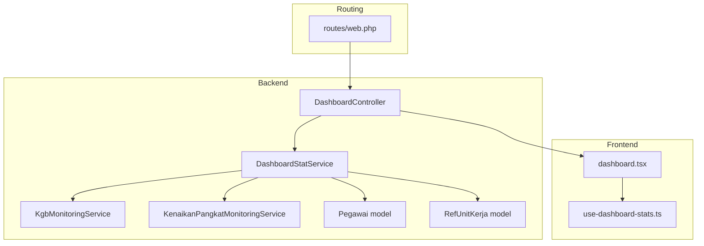
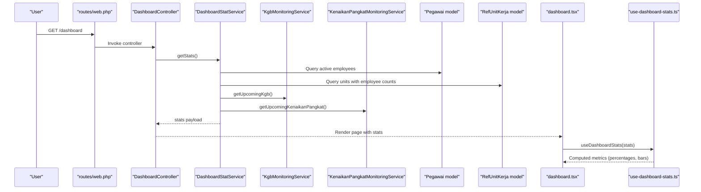
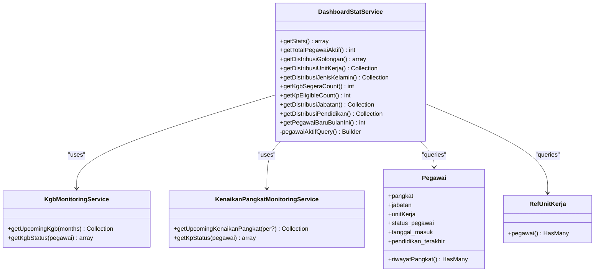
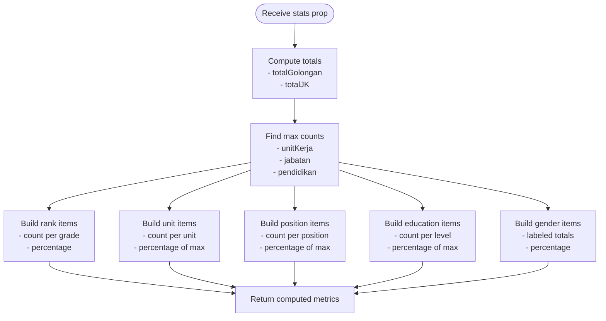
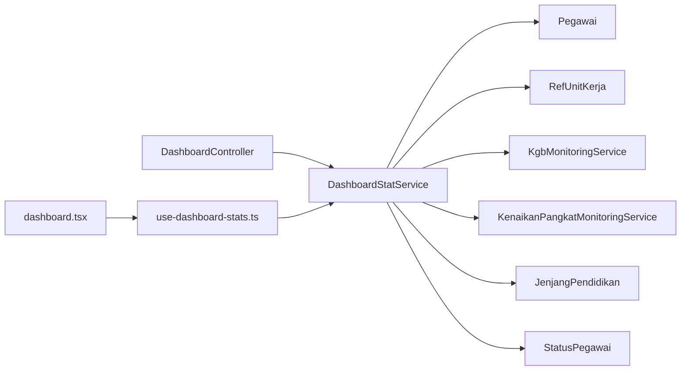

# Dashboard Analytics and Statistics

<cite>
**Referenced Files in This Document**
- [DashboardStatService.php](file://app/Services/DashboardStatService.php)
- [DashboardController.php](file://app/Http/Controllers/DashboardController.php)
- [KgbMonitoringService.php](file://app/Services/KgbMonitoringService.php)
- [KenaikanPangkatMonitoringService.php](file://app/Services/KenaikanPangkatMonitoringService.php)
- [Pegawai.php](file://app/Models/Pegawai.php)
- [RefUnitKerja.php](file://app/Models/RefUnitKerja.php)
- [JenjangPendidikan.php](file://app/Enums/JenjangPendidikan.php)
- [StatusPegawai.php](file://app/Enums/StatusPegawai.php)
- [use-dashboard-stats.ts](file://resources/js/hooks/use-dashboard-stats.ts)
- [dashboard.tsx](file://resources/js/pages/dashboard.tsx)
- [web.php](file://routes/web.php)
- [MonitoringKgbController.php](file://app/Http/Controllers/Monitoring/MonitoringKgbController.php)
- [MonitoringKenaikanPangkatController.php](file://app/Http/Controllers/Monitoring/MonitoringKenaikanPangkatController.php)
</cite>

## Table of Contents
1. [Introduction](#introduction)
2. [Project Structure](#project-structure)
3. [Core Components](#core-components)
4. [Architecture Overview](#architecture-overview)
5. [Detailed Component Analysis](#detailed-component-analysis)
6. [Dependency Analysis](#dependency-analysis)
7. [Performance Considerations](#performance-considerations)
8. [Troubleshooting Guide](#troubleshooting-guide)
9. [Conclusion](#conclusion)

## Introduction
This document explains the Dashboard Analytics and Statistics system that powers real-time organizational insights for the Kepegawaian application. It covers how statistics are aggregated, how customizable reporting widgets are rendered, and how department-wise analytics are supported. The system integrates backend services for data collection and processing with frontend React/Inertia.js components for dynamic visualization. It also documents relationships with monitoring services and employee data models, along with performance considerations and practical examples for extending the dashboard with custom widgets and reports.

## Project Structure
The dashboard analytics spans backend services and frontend components:
- Backend service layer aggregates statistics from employee and reference models.
- Controllers expose the dashboard page with precomputed statistics.
- Frontend hooks transform raw statistics into computed metrics for charts and cards.
- Routes bind the dashboard page to the controller.

**Diagram sources**
- [DashboardController.php:10-18](file://app/Http/Controllers/DashboardController.php#L10-L18)
- [DashboardStatService.php:14-29](file://app/Services/DashboardStatService.php#L14-L29)
- [KgbMonitoringService.php:12-52](file://app/Services/KgbMonitoringService.php#L12-L52)
- [KenaikanPangkatMonitoringService.php:11-62](file://app/Services/KenaikanPangkatMonitoringService.php#L11-L62)
- [Pegawai.php:24-137](file://app/Models/Pegawai.php#L24-L137)
- [RefUnitKerja.php:12-47](file://app/Models/RefUnitKerja.php#L12-L47)
- [dashboard.tsx:38-342](file://resources/js/pages/dashboard.tsx#L38-L342)
- [use-dashboard-stats.ts:63-152](file://resources/js/hooks/use-dashboard-stats.ts#L63-L152)
- [web.php:31-33](file://routes/web.php#L31-L33)

**Section sources**
- [DashboardController.php:10-18](file://app/Http/Controllers/DashboardController.php#L10-L18)
- [DashboardStatService.php:14-29](file://app/Services/DashboardStatService.php#L14-L29)
- [dashboard.tsx:38-342](file://resources/js/pages/dashboard.tsx#L38-L342)
- [use-dashboard-stats.ts:63-152](file://resources/js/hooks/use-dashboard-stats.ts#L63-L152)
- [web.php:31-33](file://routes/web.php#L31-L33)

## Core Components
- DashboardStatService: Central aggregator for active employee statistics, including counts, distributions, and upcoming milestones.
- KgbMonitoringService: Computes KGB (salary advancement) eligibility and proximity for employees.
- KenaikanPangkatMonitoringService: Computes KP (promotion) eligibility and period-based deadlines.
- Frontend hook use-dashboard-stats: Transforms raw statistics into computed metrics with percentages and normalized bars.
- Dashboard page: Renders top cards and distribution charts using computed metrics.

Key statistics produced by the service include:
- Total active employees
- Distribution by rank (golongan)
- Distribution by unit (top 6)
- Distribution by gender
- Upcoming KGB within a threshold
- KP eligible count
- Distribution by position (jabatan)
- Distribution by education level
- New hires this month

**Section sources**
- [DashboardStatService.php:16-29](file://app/Services/DashboardStatService.php#L16-L29)
- [DashboardStatService.php:31-141](file://app/Services/DashboardStatService.php#L31-L141)
- [KgbMonitoringService.php:14-52](file://app/Services/KgbMonitoringService.php#L14-L52)
- [KenaikanPangkatMonitoringService.php:13-62](file://app/Services/KenaikanPangkatMonitoringService.php#L13-L62)
- [use-dashboard-stats.ts:3-47](file://resources/js/hooks/use-dashboard-stats.ts#L3-L47)

## Architecture Overview
The dashboard pipeline follows a server-rendered Inertia pattern:
- A route invokes the DashboardController.
- The controller requests DashboardStatService to compute statistics.
- The service queries active employees, related references, and leverages monitoring services for upcoming milestones.
- The controller passes the stats payload to the dashboard page.
- The page renders cards and charts, while the hook computes percentages and normalized bars for visualization.

**Diagram sources**
- [web.php:31-33](file://routes/web.php#L31-L33)
- [DashboardController.php:12-16](file://app/Http/Controllers/DashboardController.php#L12-L16)
- [DashboardStatService.php:16-29](file://app/Services/DashboardStatService.php#L16-L29)
- [KgbMonitoringService.php:14-52](file://app/Services/KgbMonitoringService.php#L14-L52)
- [KenaikanPangkatMonitoringService.php:13-62](file://app/Services/KenaikanPangkatMonitoringService.php#L13-L62)
- [Pegawai.php:24-137](file://app/Models/Pegawai.php#L24-L137)
- [RefUnitKerja.php:12-47](file://app/Models/RefUnitKerja.php#L12-L47)
- [dashboard.tsx:38-342](file://resources/js/pages/dashboard.tsx#L38-L342)
- [use-dashboard-stats.ts:63-152](file://resources/js/hooks/use-dashboard-stats.ts#L63-L152)

## Detailed Component Analysis

### Backend Statistics Aggregation (DashboardStatService)
The service consolidates multiple metrics:
- Active employee count: filters by active status.
- Rank distribution: parses rank codes and aggregates counts per grade.
- Unit distribution: counts active employees per unit and returns top 6.
- Gender distribution: groups by gender and counts totals.
- Upcoming KGB: delegates to KgbMonitoringService and counts within threshold.
- KP eligible: delegates to KenaikanPangkatMonitoringService and filters eligible entries.
- Position distribution: groups by position reference and sorts by count.
- Education distribution: groups by last education level and maps to human-readable labels.
- New hires this month: filters by join date matching current month/year.

**Diagram sources**
- [DashboardStatService.php:14-147](file://app/Services/DashboardStatService.php#L14-L147)
- [KgbMonitoringService.php:12-99](file://app/Services/KgbMonitoringService.php#L12-L99)
- [KenaikanPangkatMonitoringService.php:11-122](file://app/Services/KenaikanPangkatMonitoringService.php#L11-L122)
- [Pegawai.php:24-137](file://app/Models/Pegawai.php#L24-L137)
- [RefUnitKerja.php:12-47](file://app/Models/RefUnitKerja.php#L12-L47)

**Section sources**
- [DashboardStatService.php:16-147](file://app/Services/DashboardStatService.php#L16-L147)
- [Pegawai.php:69-82](file://app/Models/Pegawai.php#L69-L82)
- [RefUnitKerja.php:44-47](file://app/Models/RefUnitKerja.php#L44-L47)

### Frontend Widget Rendering (React + Inertia)
The dashboard page renders:
- Top cards for total active employees, new hires this month, upcoming KGB alerts, and KP eligibility.
- Distribution charts for rank, unit, position, education, and gender.

The hook use-dashboard-stats transforms raw statistics into:
- Totals for rank and gender groups.
- Maxima for normalization of bar charts.
- Percentage breakdowns for each metric.
- Human-friendly labels for gender codes.

**Diagram sources**
- [use-dashboard-stats.ts:63-152](file://resources/js/hooks/use-dashboard-stats.ts#L63-L152)

**Section sources**
- [dashboard.tsx:38-342](file://resources/js/pages/dashboard.tsx#L38-L342)
- [use-dashboard-stats.ts:3-152](file://resources/js/hooks/use-dashboard-stats.ts#L3-L152)

### Department-wise Analytics
Department analytics are supported by:
- Unit-level counts via RefUnitKerja with a relationship to Pegawai.
- Filtering by active status through the active scope on the Pegawai model.
- Top 6 units returned by the service, ensuring focus on the most represented departments.

Practical extension points:
- Add filters for unit hierarchy (parent/child units).
- Introduce drill-down to sub-units or cross-unit comparisons.
- Paginate or lazy-load unit lists for very large organizations.

**Section sources**
- [RefUnitKerja.php:44-47](file://app/Models/RefUnitKerja.php#L44-L47)
- [Pegawai.php:179-187](file://app/Models/Pegawai.php#L179-L187)
- [DashboardStatService.php:62-73](file://app/Services/DashboardStatService.php#L62-L73)

### Real-time Updates and Dynamic Loading
Real-time updates can be achieved using Inertia’s reload mechanism:
- Periodically reload only the stats prop to refresh the dashboard without full page navigation.
- Recommended intervals depend on dataset size and update frequency needs.

Example pattern:
- Use a polling interval to call router.reload({ only: ['stats'] }) on the dashboard page.
- Combine with frontend caching strategies to avoid unnecessary reloads.

Note: The skill guide demonstrates a polling pattern suitable for dashboards requiring periodic refresh.

**Section sources**
- [dashboard.tsx:305-320](file://resources/js/pages/dashboard.tsx#L305-L320)

### Custom Widget Creation and Reporting
To add a new widget:
- Extend DashboardStatService with a new method returning aggregated data.
- Update the controller to include the new metric in getStats().
- Consume the metric in the dashboard page and add a new chart/card component.
- If needed, add a dedicated monitoring service similar to KGB/KP services for specialized calculations.

Report generation:
- Use existing monitoring controllers as templates for exporting filtered lists (e.g., upcoming KGB or KP).
- Apply filters (e.g., unit, position, eligibility) and render summaries alongside the dashboard.

**Section sources**
- [DashboardStatService.php:16-29](file://app/Services/DashboardStatService.php#L16-L29)
- [MonitoringKgbController.php:16-30](file://app/Http/Controllers/Monitoring/MonitoringKgbController.php#L16-L30)
- [MonitoringKenaikanPangkatController.php:13-30](file://app/Http/Controllers/Monitoring/MonitoringKenaikanPangkatController.php#L13-L30)

## Dependency Analysis
The dashboard depends on:
- Employee and reference models for base data.
- Monitoring services for upcoming milestones.
- Enumerations for consistent labeling.
- Inertia routing and controllers for server rendering.

**Diagram sources**
- [DashboardStatService.php:5-12](file://app/Services/DashboardStatService.php#L5-L12)
- [Pegawai.php:5-26](file://app/Models/Pegawai.php#L5-L26)
- [RefUnitKerja.php:12-32](file://app/Models/RefUnitKerja.php#L12-L32)
- [JenjangPendidikan.php:5-33](file://app/Enums/JenjangPendidikan.php#L5-L33)
- [StatusPegawai.php:5-23](file://app/Enums/StatusPegawai.php#L5-L23)
- [DashboardController.php:5-16](file://app/Http/Controllers/DashboardController.php#L5-L16)
- [dashboard.tsx:14-45](file://resources/js/pages/dashboard.tsx#L14-L45)
- [use-dashboard-stats.ts:1-152](file://resources/js/hooks/use-dashboard-stats.ts#L1-L152)

**Section sources**
- [DashboardStatService.php:5-12](file://app/Services/DashboardStatService.php#L5-L12)
- [Pegawai.php:5-26](file://app/Models/Pegawai.php#L5-L26)
- [RefUnitKerja.php:12-32](file://app/Models/RefUnitKerja.php#L12-L32)
- [JenjangPendidikan.php:5-33](file://app/Enums/JenjangPendidikan.php#L5-L33)
- [StatusPegawai.php:5-23](file://app/Enums/StatusPegawai.php#L5-L23)
- [DashboardController.php:5-16](file://app/Http/Controllers/DashboardController.php#L5-L16)
- [dashboard.tsx:14-45](file://resources/js/pages/dashboard.tsx#L14-L45)
- [use-dashboard-stats.ts:1-152](file://resources/js/hooks/use-dashboard-stats.ts#L1-L152)

## Performance Considerations
- Eager loading: The service loads related data (rank, position, latest promotion history) to minimize N+1 queries.
- Aggregation at database level: Grouping and counting are performed in SQL to reduce PHP-side computation.
- Top-N limits: Unit and position distributions are capped to improve responsiveness.
- Caching strategies:
  - Server-side: Cache the stats payload for short TTLs (e.g., minutes) to reduce repeated heavy queries.
  - Client-side: Use Inertia’s partial reloads to avoid full page refreshes.
  - Hybrid: Combine server-side caching with client-side polling for near-real-time updates.
- Pagination and filtering: For large datasets, introduce pagination or filters (department, position, education) to limit result sets.
- Indexing: Ensure database indexes exist on frequently filtered columns (status, unit ID, join date, rank code).

[No sources needed since this section provides general guidance]

## Troubleshooting Guide
Common issues and resolutions:
- Missing or inconsistent rank codes: The rank distribution parsing expects a standardized code format; verify RefPangkat codes.
- No active employees found: Confirm StatusPegawai enum values and active scope usage.
- Empty education distribution: Some employees may have null last education; the service excludes nulls.
- Missing upcoming milestone counts: Ensure monitoring services receive valid promotion records and dates.
- Frontend percentage anomalies: Verify computed totals and maxima are non-zero before division.

**Section sources**
- [DashboardStatService.php:36-60](file://app/Services/DashboardStatService.php#L36-L60)
- [DashboardStatService.php:115-131](file://app/Services/DashboardStatService.php#L115-L131)
- [KgbMonitoringService.php:54-70](file://app/Services/KgbMonitoringService.php#L54-L70)
- [KenaikanPangkatMonitoringService.php:64-95](file://app/Services/KenaikanPangkatMonitoringService.php#L64-L95)

## Conclusion
The Dashboard Analytics and Statistics system provides a robust foundation for real-time organizational insights. It aggregates employee data efficiently, integrates with monitoring services for upcoming milestones, and renders intuitive widgets on the frontend. By leveraging eager loading, database-level aggregation, and partial reloads, the system balances performance and responsiveness. Extending the dashboard with new widgets and reports is straightforward, following the established patterns in the service layer and controllers.