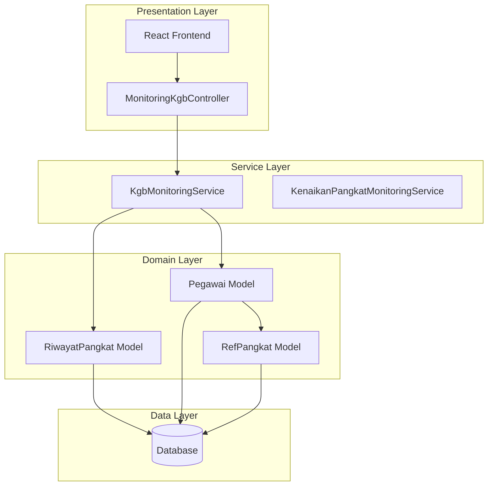
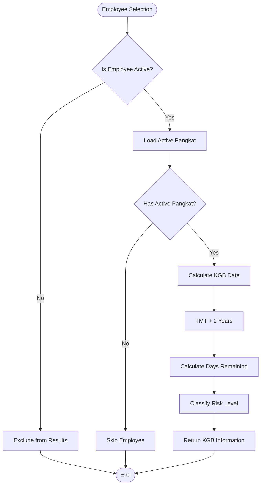
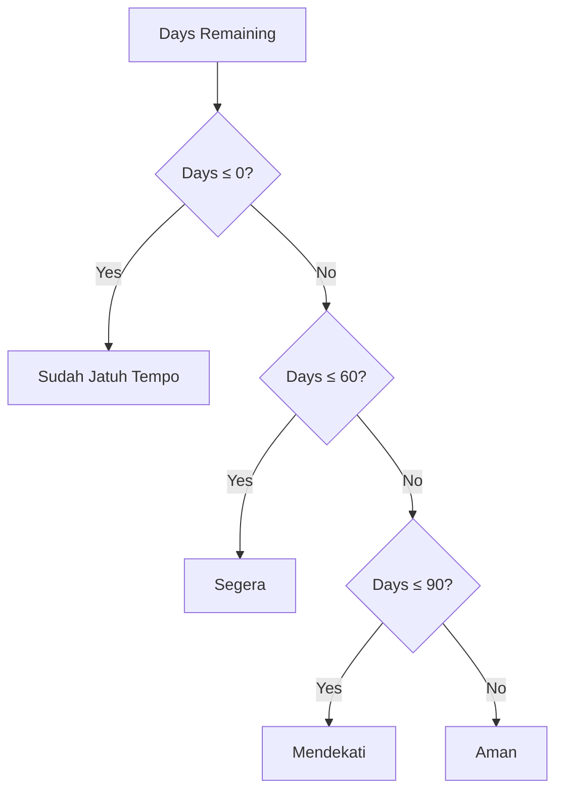
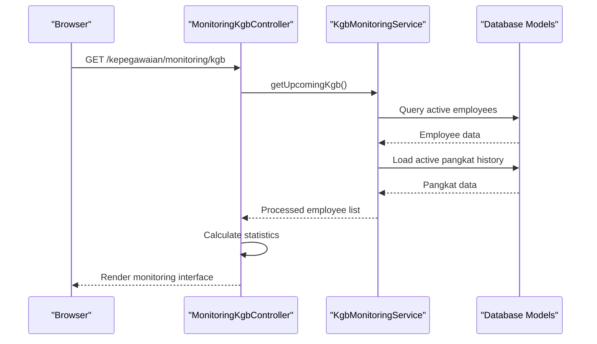
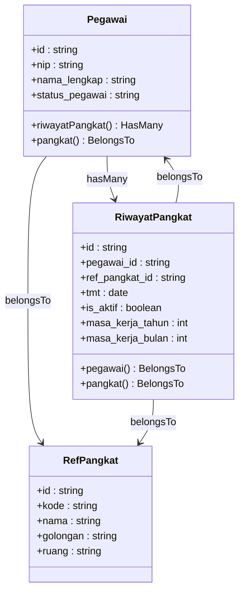

# KGB Eligibility Monitoring

<cite>
**Referenced Files in This Document**
- [KgbMonitoringService.php](file://app/Services/KgbMonitoringService.php)
- [MonitoringKgbController.php](file://app/Http/Controllers/Monitoring/MonitoringKgbController.php)
- [RiwayatPangkat.php](file://app/Models/RiwayatPangkat.php)
- [Pegawai.php](file://app/Models/Pegawai.php)
- [RefPangkat.php](file://app/Models/RefPangkat.php)
- [StatusPegawai.php](file://app/Enums/StatusPegawai.php)
- [KgbMonitoringTest.php](file://tests/Feature/Monitoring/KgbMonitoringTest.php)
- [index.tsx](file://resources/js/pages/kepegawaian/monitoring/kgb/index.tsx)
</cite>

## Table of Contents
1. [Introduction](#introduction)
2. [System Architecture](#system-architecture)
3. [Core Components](#core-components)
4. [Automated KGB Date Calculation Logic](#automated-kgb-date-calculation-logic)
5. [Risk Assessment Categorization](#risk-assessment-categorization)
6. [Service Layer Implementation](#service-layer-implementation)
7. [Controller Responsibilities](#controller-responsibilities)
8. [Frontend Monitoring Interface](#frontend-monitoring-interface)
9. [Data Filtering and Statistics](#data-filtering-and-statistics)
10. [Relationships with RiwayatPangkat Models](#relationships-with-riwayatpangkat-models)
11. [Performance Considerations](#performance-considerations)
12. [Common Issues and Solutions](#common-issues-and-solutions)
13. [Conclusion](#conclusion)

## Introduction

The KGB (Kenaikan Gaji Berkala) Eligibility Monitoring system is a comprehensive automated solution designed to track and monitor government employee salary advancement eligibility. This system calculates KGB dates based on employee pangkat history, categorizes risk levels, and provides real-time monitoring capabilities for HR administrators and supervisors.

KGB represents the biennial salary increment process for Indonesian civil servants, governed by PP No. 7 Tahun 1977 tentang Gaji PNS. The system automates the complex calculation of when employees become eligible for salary increases based on their current pangkat (rank) and years of service.

## System Architecture

The KGB monitoring system follows a layered architecture pattern with clear separation of concerns:

**Diagram sources**
- [MonitoringKgbController.php:10-31](file://app/Http/Controllers/Monitoring/MonitoringKgbController.php#L10-L31)
- [KgbMonitoringService.php:12-99](file://app/Services/KgbMonitoringService.php#L12-L99)
- [Pegawai.php:24-209](file://app/Models/Pegawai.php#L24-L209)
- [RiwayatPangkat.php:11-59](file://app/Models/RiwayatPangkat.php#L11-L59)

## Core Components

### KgbMonitoringService

The central service responsible for all KGB monitoring calculations and data retrieval. It implements sophisticated business logic to determine employee eligibility for salary increments.

**Section sources**
- [KgbMonitoringService.php:12-99](file://app/Services/KgbMonitoringService.php#L12-L99)

### MonitoringKgbController

Handles HTTP requests and responses for the KGB monitoring interface, coordinating between the frontend and backend services.

**Section sources**
- [MonitoringKgbController.php:10-31](file://app/Http/Controllers/Monitoring/MonitoringKgbController.php#L10-L31)

### Data Models

The system relies on three core models that define the data relationships and business rules:

**Section sources**
- [Pegawai.php:24-209](file://app/Models/Pegawai.php#L24-L209)
- [RiwayatPangkat.php:11-59](file://app/Models/RiwayatPangkat.php#L11-L59)
- [RefPangkat.php:10-34](file://app/Models/RefPangkat.php#L10-L34)

## Automated KGB Date Calculation Logic

The KGB calculation engine implements precise business rules based on Indonesian civil servant regulations:

### Base Calculation Algorithm

**Diagram sources**
- [KgbMonitoringService.php:54-70](file://app/Services/KgbMonitoringService.php#L54-L70)

### Calculation Implementation Details

The system calculates KGB eligibility using the formula: **Next KGB Date = Last Active Pangkat TMT + 2 years**. This implementation ensures compliance with PP No. 7 Tahun 1977, which mandates biennial salary increments for civil servants.

**Section sources**
- [KgbMonitoringService.php:62-69](file://app/Services/KgbMonitoringService.php#L62-L69)

## Risk Assessment Categorization

The system employs a four-tier risk assessment classification system:

| Category | Threshold | Color | Description |
|----------|-----------|-------|-------------|
| Sudah Jatuh Tempo | ≤ 0 days | Red | Employees whose KGB date has passed |
| Segera | ≤ 60 days | Orange | Employees within 2 months of KGB date |
| Mendekati | ≤ 90 days | Yellow | Employees within 3 months of KGB date |
| Aman | > 90 days | Emerald | Employees with sufficient time until KGB |

### Classification Logic

**Diagram sources**
- [KgbMonitoringService.php:83-98](file://app/Services/KgbMonitoringService.php#L83-L98)

**Section sources**
- [KgbMonitoringService.php:83-98](file://app/Services/KgbMonitoringService.php#L83-L98)

## Service Layer Implementation

### KgbMonitoringService Methods

The service layer provides comprehensive functionality for KGB monitoring:

#### getUpcomingKgb Method
Retrieves employees whose KGB falls within a specified timeframe, with intelligent filtering and sorting capabilities.

#### getKgbStatus Method  
Calculates detailed KGB information including next date, remaining days, and risk classification.

#### Internal Helper Methods
- `getRiwayatPangkatAktif`: Retrieves the most recent active pangkat for an employee
- `resolveStatusLabel`: Converts day thresholds to human-readable status categories

**Section sources**
- [KgbMonitoringService.php:14-52](file://app/Services/KgbMonitoringService.php#L14-L52)
- [KgbMonitoringService.php:54-70](file://app/Services/KgbMonitoringService.php#L54-L70)
- [KgbMonitoringService.php:72-81](file://app/Services/KgbMonitoringService.php#L72-L81)
- [KgbMonitoringService.php:83-98](file://app/Services/KgbMonitoringService.php#L83-L98)

## Controller Responsibilities

The MonitoringKgbController serves as the HTTP interface between the frontend and backend services:

### Primary Responsibilities
- **Data Retrieval**: Calls KgbMonitoringService to fetch upcoming KGB employees
- **Statistics Generation**: Calculates dashboard statistics for risk categories
- **Response Formatting**: Structures data for Inertia.js frontend consumption
- **Authorization**: Ensures only authorized users (admin/operator) can access monitoring data

### Controller Flow

**Diagram sources**
- [MonitoringKgbController.php:16-30](file://app/Http/Controllers/Monitoring/MonitoringKgbController.php#L16-L30)
- [KgbMonitoringService.php:14-52](file://app/Services/KgbMonitoringService.php#L14-L52)

**Section sources**
- [MonitoringKgbController.php:12-31](file://app/Http/Controllers/Monitoring/MonitoringKgbController.php#L12-L31)

## Frontend Monitoring Interface

The React-based frontend provides an intuitive interface for KGB monitoring:

### Dashboard Cards
Displays key statistics including total employees, Jatuh Tempo, Segera, and Mendekati categories.

### Interactive Table
Features filtering by status categories, sorting by urgency, and formatted date displays.

### Status Badges
Visual indicators using color-coded badges for immediate risk assessment understanding.

**Section sources**
- [index.tsx:117-142](file://resources/js/pages/kepegawaian/monitoring/kgb/index.tsx#L117-L142)
- [index.tsx:62-69](file://resources/js/pages/kepegawaian/monitoring/kgb/index.tsx#L62-L69)

## Data Filtering and Statistics

### Filtering Mechanisms
The system supports dynamic filtering by risk categories with client-side filtering implementation.

### Statistics Aggregation
Automatic calculation of risk category distributions for dashboard visualization and reporting purposes.

**Section sources**
- [index.tsx:87-100](file://resources/js/pages/kepegawaian/monitoring/kgb/index.tsx#L87-L100)
- [MonitoringKgbController.php:22-29](file://app/Http/Controllers/Monitoring/MonitoringKgbController.php#L22-L29)

## Relationships with RiwayatPangkat Models

The KGB monitoring system relies heavily on the RiwayatPangkat model for accurate calculations:

### Model Relationships

**Diagram sources**
- [Pegawai.php:114-117](file://app/Models/Pegawai.php#L114-L117)
- [RiwayatPangkat.php:44-51](file://app/Models/RiwayatPangkat.php#L44-L51)
- [Pegawai.php:69-71](file://app/Models/Pegawai.php#L69-L71)

### Career Progression Data Integration

The system integrates with comprehensive career progression data, including:
- **Pangkat History**: Complete record of rank promotions and assignments
- **Service Duration**: Accurate calculation of years of service for each position
- **Current Position**: Real-time determination of active pangkat for eligibility calculations

**Section sources**
- [Pegawai.php:98-117](file://app/Models/Pegawai.php#L98-L117)
- [RiwayatPangkat.php:54-57](file://app/Models/RiwayatPangkat.php#L54-L57)

## Performance Considerations

### Database Optimization
- **Eager Loading**: Strategic use of with() clauses to minimize N+1 query problems
- **Indexing Strategy**: Proper indexing on frequently queried fields (status_pegawai, is_aktif, tmt)
- **Query Efficiency**: Optimized queries using scopes and relationships

### Memory Management
- **Collection Processing**: Efficient handling of large employee datasets
- **Pagination Strategy**: Implementation of pagination for large result sets
- **Data Serialization**: Optimized data transfer between backend and frontend

### Caching Strategies
- **Model Caching**: Potential for caching frequently accessed reference data
- **Query Result Caching**: Consideration for caching calculation results during peak usage

## Common Issues and Solutions

### Date Calculation Edge Cases

#### Issue: Employees with Multiple Active Pangkat Records
**Solution**: The system prioritizes the most recent active pangkat using `latest('tmt')` ordering, ensuring accurate KGB calculations based on the current position.

#### Issue: New Employees Without Complete History
**Solution**: Employees without active pangkat records are excluded from KGB calculations, preventing invalid results.

#### Issue: Leap Year and Month Boundary Calculations
**Solution**: Uses Carbon's robust date arithmetic functions to handle edge cases like February 29th and month-end boundaries.

### Data Integrity Issues

#### Issue: Inconsistent Status Values
**Solution**: Leverages the StatusPegawai enum to ensure consistent status values and prevent invalid employee inclusion.

#### Issue: Missing Employee Information
**Solution**: Comprehensive validation checks ensure only employees with complete information are processed.

**Section sources**
- [KgbMonitoringService.php:23-26](file://app/Services/KgbMonitoringService.php#L23-L26)
- [KgbMonitoringService.php:74-80](file://app/Services/KgbMonitoringService.php#L74-L80)
- [StatusPegawai.php:5-23](file://app/Enums/StatusPegawai.php#L5-L23)

## Conclusion

The KGB Eligibility Monitoring system provides a robust, automated solution for tracking civil servant salary advancement eligibility. Through precise date calculation algorithms, comprehensive risk assessment categorization, and efficient service layer implementation, the system ensures accurate and timely identification of employees approaching KGB eligibility.

The integration with RiwayatPangkat models and comprehensive career progression data enables reliable calculations that comply with PP No. 7 Tahun 1977 regulations. The dual-layer architecture (service and presentation) ensures maintainability, scalability, and clear separation of concerns.

Key benefits include:
- **Automated Compliance**: Accurate adherence to KGB calculation regulations
- **Real-time Monitoring**: Immediate identification of employees nearing eligibility
- **Risk Classification**: Clear visual indicators for priority management
- **Scalable Architecture**: Efficient handling of large employee datasets
- **User-Friendly Interface**: Intuitive dashboard for HR oversight

The system's comprehensive testing approach, including edge case scenarios and business logic validation, ensures reliability and accuracy in production environments.