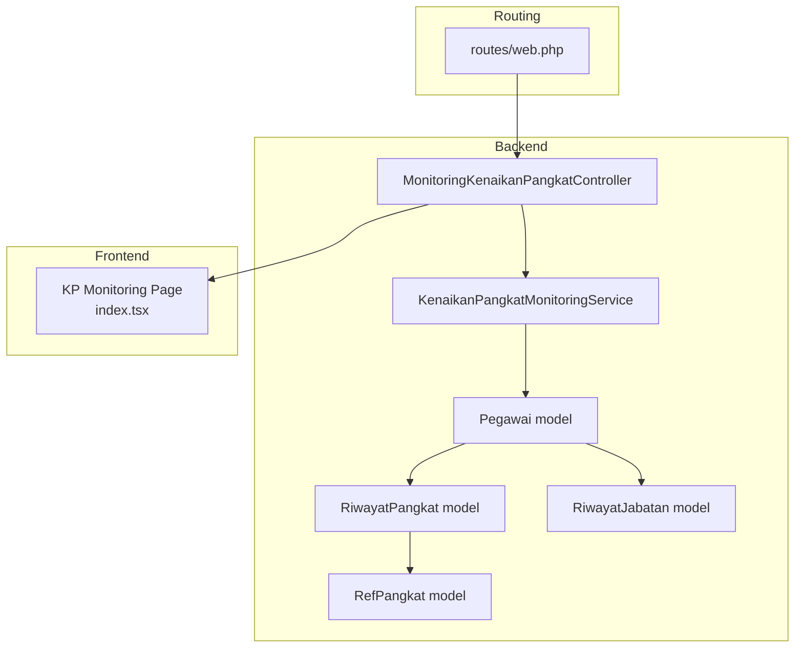
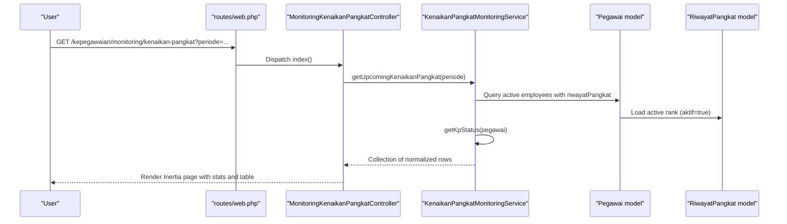
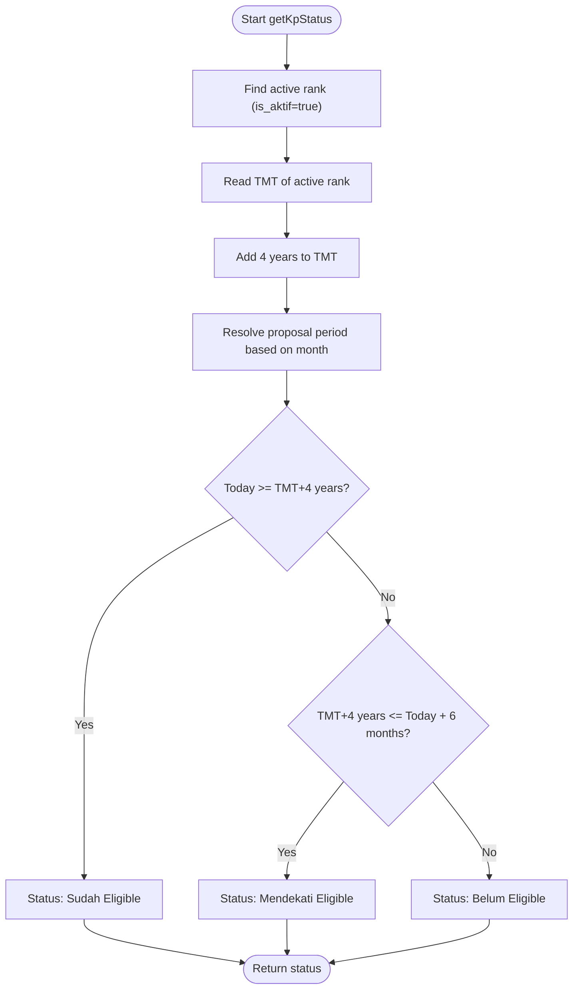
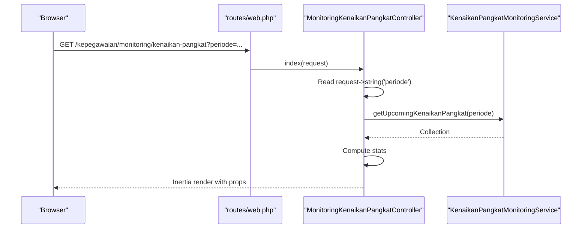
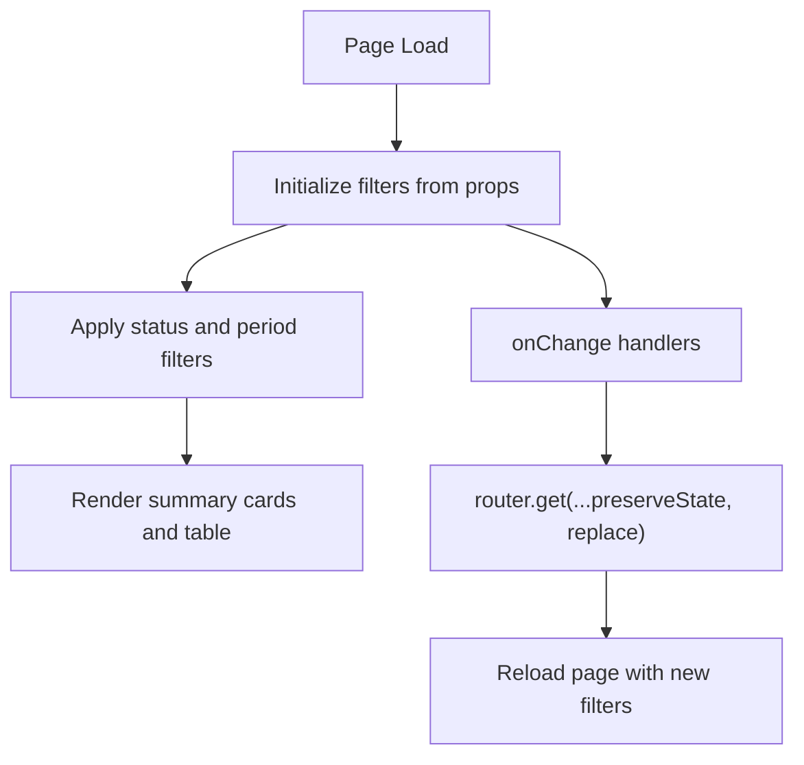
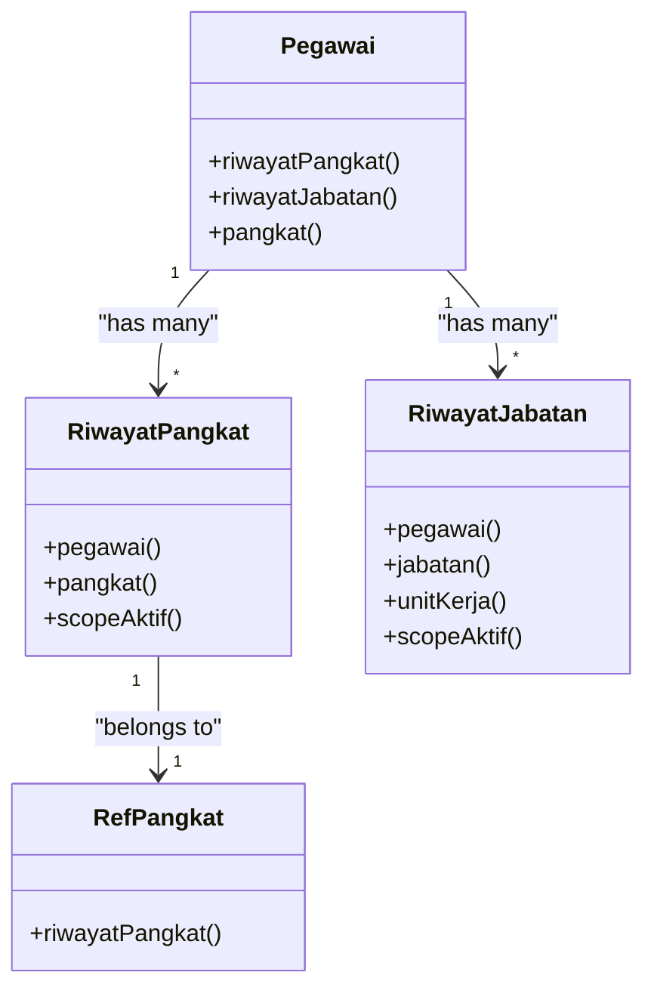
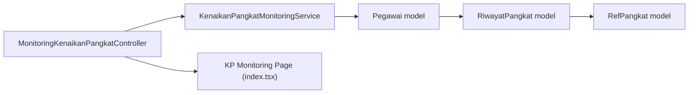

# KP (Promotion) Monitoring

<cite>
**Referenced Files in This Document**
- [KenaikanPangkatMonitoringService.php](file://app/Services/KenaikanPangkatMonitoringService.php)
- [MonitoringKenaikanPangkatController.php](file://app/Http/Controllers/Monitoring/MonitoringKenaikanPangkatController.php)
- [index.tsx](file://resources/js/pages/kepegawaian/monitoring/kenaikan-pangkat/index.tsx)
- [web.php](file://routes/web.php)
- [KenaikanPangkatMonitoringTest.php](file://tests/Feature/Monitoring/KenaikanPangkatMonitoringTest.php)
- [Pegawai.php](file://app/Models/Pegawai.php)
- [RiwayatPangkat.php](file://app/Models/RiwayatPangkat.php)
- [RiwayatJabatan.php](file://app/Models/RiwayatJabatan.php)
- [RefPangkat.php](file://app/Models/RefPangkat.php)
- [riwayat_pangkat_table.php](file://database/migrations/2026_03_15_031012_create_riwayat_pangkat_table.php)
- [riwayat_jabatan_table.php](file://database/migrations/2026_03_15_030540_create_riwayat_jabatan_table.php)
- [RiwayatPangkatService.php](file://app/Services/RiwayatPangkatService.php)
</cite>

## Table of Contents
1. [Introduction](#introduction)
2. [Project Structure](#project-structure)
3. [Core Components](#core-components)
4. [Architecture Overview](#architecture-overview)
5. [Detailed Component Analysis](#detailed-component-analysis)
6. [Dependency Analysis](#dependency-analysis)
7. [Performance Considerations](#performance-considerations)
8. [Troubleshooting Guide](#troubleshooting-guide)
9. [Conclusion](#conclusion)

## Introduction
This document explains the KP (Kenaikan Pangkat) promotion monitoring system that tracks employee eligibility for regular career advancement. It covers automated eligibility calculations, timeline visualization, service-layer logic, controller-driven reporting, and frontend integration for displaying promotion schedules. The system leverages active rank records to compute next promotion dates, proposal periods, deadlines, and status indicators, while excluding retirees and ensuring accurate filtering by proposal period.

## Project Structure
The KP monitoring spans backend services/controllers, frontend pages, models, and database migrations:

- Backend
  - Service layer: KenaikanPangkatMonitoringService
  - Controller: MonitoringKenaikanPangkatController
  - Models: Pegawai, RiwayatPangkat, RiwayatJabatan, RefPangkat
  - Migrations: riwayat_pangkat_table.php, riwayat_jabatan_table.php
- Frontend
  - Page: resources/js/pages/kepegawaian/monitoring/kenaikan-pangkat/index.tsx
- Routing
  - routes/web.php defines the monitoring endpoint

**Diagram sources**
- [MonitoringKenaikanPangkatController.php:11-31](file://app/Http/Controllers/Monitoring/MonitoringKenaikanPangkatController.php#L11-L31)
- [KenaikanPangkatMonitoringService.php:11-62](file://app/Services/KenaikanPangkatMonitoringService.php#L11-L62)
- [Pegawai.php:99-117](file://app/Models/Pegawai.php#L99-L117)
- [RiwayatPangkat.php:11-58](file://app/Models/RiwayatPangkat.php#L11-L58)
- [RiwayatJabatan.php:11-58](file://app/Models/RiwayatJabatan.php#L11-L58)
- [RefPangkat.php:10-33](file://app/Models/RefPangkat.php#L10-L33)
- [index.tsx:72-305](file://resources/js/pages/kepegawaian/monitoring/kenaikan-pangkat/index.tsx#L72-L305)
- [web.php:42-43](file://routes/web.php#L42-L43)

**Section sources**
- [web.php:42-43](file://routes/web.php#L42-L43)
- [MonitoringKenaikanPangkatController.php:11-31](file://app/Http/Controllers/Monitoring/MonitoringKenaikanPangkatController.php#L11-L31)
- [KenaikanPangkatMonitoringService.php:11-62](file://app/Services/KenaikanPangkatMonitoringService.php#L11-L62)
- [index.tsx:72-305](file://resources/js/pages/kepegawaian/monitoring/kenaikan-pangkat/index.tsx#L72-L305)

## Core Components
- KenaikanPangkatMonitoringService
  - Builds a list of upcoming promotions by fetching active employees, resolving their active rank, computing eligibility, and returning normalized rows for the UI.
  - Provides getKpStatus to calculate next promotion date, proposal period, deadline, and eligibility status.
- MonitoringKenaikanPangkatController
  - Handles HTTP requests, reads the period filter, delegates to the service, and renders the Inertia page with statistics.
- Frontend Page (index.tsx)
  - Presents a dashboard with summary cards, filters (status and proposal period), and a sortable table of employees with eligibility details.
- Models and Migrations
  - RiwayatPangkat stores rank history with an active flag and TMT date used for eligibility computation.
  - RiwayatJabatan captures position history (not used directly for KP but part of career progression).
  - RefPangkat defines rank metadata (e.g., code, level) used for display.

Key implementation references:
- [getUpcomingKenaikanPangkat:13-62](file://app/Services/KenaikanPangkatMonitoringService.php#L13-L62)
- [getKpStatus:64-95](file://app/Services/KenaikanPangkatMonitoringService.php#L64-L95)
- [resolvePeriodeUsulDanBatas:97-120](file://app/Services/KenaikanPangkatMonitoringService.php#L97-L120)
- [MonitoringKenaikanPangkatController@index:13-30](file://app/Http/Controllers/Monitoring/MonitoringKenaikanPangkatController.php#L13-L30)
- [KP Monitoring Page:72-305](file://resources/js/pages/kepegawaian/monitoring/kenaikan-pangkat/index.tsx#L72-L305)
- [RiwayatPangkat model:11-58](file://app/Models/RiwayatPangkat.php#L11-L58)
- [RiwayatJabatan model:11-58](file://app/Models/RiwayatJabatan.php#L11-L58)
- [RefPangkat model:10-33](file://app/Models/RefPangkat.php#L10-L33)

**Section sources**
- [KenaikanPangkatMonitoringService.php:11-122](file://app/Services/KenaikanPangkatMonitoringService.php#L11-L122)
- [MonitoringKenaikanPangkatController.php:11-31](file://app/Http/Controllers/Monitoring/MonitoringKenaikanPangkatController.php#L11-L31)
- [index.tsx:17-305](file://resources/js/pages/kepegawaian/monitoring/kenaikan-pangkat/index.tsx#L17-L305)
- [RiwayatPangkat.php:11-58](file://app/Models/RiwayatPangkat.php#L11-L58)
- [RiwayatJabatan.php:11-58](file://app/Models/RiwayatJabatan.php#L11-L58)
- [RefPangkat.php:10-33](file://app/Models/RefPangkat.php#L10-L33)

## Architecture Overview
The system follows a clean separation of concerns:
- Controller orchestrates request handling and delegates business logic to the service.
- Service encapsulates eligibility computations and data shaping.
- Models define domain relations and scopes (e.g., active rank).
- Frontend renders filtered and paginated data with real-time status badges.

**Diagram sources**
- [web.php:42-43](file://routes/web.php#L42-L43)
- [MonitoringKenaikanPangkatController.php:13-30](file://app/Http/Controllers/Monitoring/MonitoringKenaikanPangkatController.php#L13-L30)
- [KenaikanPangkatMonitoringService.php:13-62](file://app/Services/KenaikanPangkatMonitoringService.php#L13-L62)
- [Pegawai.php:99-117](file://app/Models/Pegawai.php#L99-L117)
- [RiwayatPangkat.php:54-57](file://app/Models/RiwayatPangkat.php#L54-L57)

## Detailed Component Analysis

### KenaikanPangkatMonitoringService
Responsibilities:
- Build a list of upcoming promotions by filtering out retirees and inactive employees, loading active rank history, and computing eligibility.
- Compute next promotion date as TMT of active rank plus 4 years.
- Determine proposal period ("April YYYY" or "October YYYY") and deadline based on next promotion date.
- Classify eligibility status as "Sudah Eligible", "Mendekati Eligible", or "Belum Eligible".

Eligibility logic highlights:
- Next promotion date: TMT of active rank plus 4 years at start-of-day precision.
- Eligible if today is on or after next promotion date.
- Near-eligible if within the next 6 months.
- Proposal period resolution depends on month of next promotion date:
  - April if month ≤ 4
  - October if month ≤ 10
  - April of next year otherwise
- Deadline is aligned to the appropriate quarter based on the proposal period.

**Diagram sources**
- [KenaikanPangkatMonitoringService.php:64-95](file://app/Services/KenaikanPangkatMonitoringService.php#L64-L95)
- [KenaikanPangkatMonitoringService.php:97-120](file://app/Services/KenaikanPangkatMonitoringService.php#L97-L120)

Key methods and logic:
- [getUpcomingKenaikanPangkat:13-62](file://app/Services/KenaikanPangkatMonitoringService.php#L13-L62)
- [getKpStatus:64-95](file://app/Services/KenaikanPangkatMonitoringService.php#L64-L95)
- [resolvePeriodeUsulDanBatas:97-120](file://app/Services/KenaikanPangkatMonitoringService.php#L97-L120)

Edge cases addressed:
- Employees without active rank history are excluded from results.
- Retired, deceased, and terminated employees are excluded.
- Filtering by proposal period (April/October) is supported.

**Section sources**
- [KenaikanPangkatMonitoringService.php:11-122](file://app/Services/KenaikanPangkatMonitoringService.php#L11-L122)
- [KenaikanPangkatMonitoringTest.php:35-60](file://tests/Feature/Monitoring/KenaikanPangkatMonitoringTest.php#L35-L60)
- [KenaikanPangkatMonitoringTest.php:76-86](file://tests/Feature/Monitoring/KenaikanPangkatMonitoringTest.php#L76-L86)
- [KenaikanPangkatMonitoringTest.php:88-103](file://tests/Feature/Monitoring/KenaikanPangkatMonitoringTest.php#L88-L103)

### MonitoringKenaikanPangkatController
Responsibilities:
- Extract the proposal period filter from the request.
- Delegate to the service to build the monitoring list.
- Compute summary statistics (total, eligible, near-eligible, not yet eligible).
- Render the Inertia page with data and filters.

**Diagram sources**
- [web.php:42-43](file://routes/web.php#L42-L43)
- [MonitoringKenaikanPangkatController.php:13-30](file://app/Http/Controllers/Monitoring/MonitoringKenaikanPangkatController.php#L13-L30)
- [KenaikanPangkatMonitoringService.php:13-62](file://app/Services/KenaikanPangkatMonitoringService.php#L13-L62)

**Section sources**
- [MonitoringKenaikanPangkatController.php:11-31](file://app/Http/Controllers/Monitoring/MonitoringKenaikanPangkatController.php#L11-L31)
- [web.php:42-43](file://routes/web.php#L42-L43)

### Frontend Integration (index.tsx)
Responsibilities:
- Display summary cards for total, eligible, near-eligible, and not-yet-eligible counts.
- Provide interactive filters:
  - Proposal period: "Semua", "April", "Oktober"
  - Status: "Semua", "Sudah Eligible", "Mendekati Eligible", "Belum Eligible"
- Render a table with:
  - NIP, Name, Current Rank, TMT of Current Rank, Next KP TMT, Proposal Period, Deadline, and Status badge.
- Format dates using Indonesian locale and show remaining days until deadline.

**Diagram sources**
- [index.tsx:72-305](file://resources/js/pages/kepegawaian/monitoring/kenaikan-pangkat/index.tsx#L72-L305)

**Section sources**
- [index.tsx:17-305](file://resources/js/pages/kepegawaian/monitoring/kenaikan-pangkat/index.tsx#L17-L305)

### Data Models and Relationships
- Pegawai
  - Has many RiwayatPangkat and RiwayatJabatan.
  - Has reference to current rank (RefPangkat) via ref_pangkat_id.
- RiwayatPangkat
  - Stores TMT and is_aktif flag used for eligibility computation.
  - Belongs to RefPangkat for display metadata.
- RiwayatJabatan
  - Tracks position history; not directly used for KP but part of career progression context.
- RefPangkat
  - Defines rank metadata (e.g., code, level) used for display.

**Diagram sources**
- [Pegawai.php:99-137](file://app/Models/Pegawai.php#L99-L137)
- [RiwayatPangkat.php:44-57](file://app/Models/RiwayatPangkat.php#L44-L57)
- [RiwayatJabatan.php:39-57](file://app/Models/RiwayatJabatan.php#L39-L57)
- [RefPangkat.php:10-33](file://app/Models/RefPangkat.php#L10-L33)

**Section sources**
- [Pegawai.php:99-137](file://app/Models/Pegawai.php#L99-L137)
- [RiwayatPangkat.php:11-58](file://app/Models/RiwayatPangkat.php#L11-L58)
- [RiwayatJabatan.php:11-58](file://app/Models/RiwayatJabatan.php#L11-L58)
- [RefPangkat.php:10-33](file://app/Models/RefPangkat.php#L10-L33)

### Database Schema Notes
- riwayat_pangkat_table.php
  - Contains foreign keys to pegawai and ref_pangkat, TMT date, masa_kerja fields, is_aktif flag, timestamps, and soft deletes.
- riwayat_jabatan_table.php
  - Contains foreign keys to pegawai and ref_jabatan/ref_unit_kerja, TMT date, is_aktif flag, and soft deletes.

These schemas support the service’s eligibility logic by storing TMT and active status for ranks.

**Section sources**
- [riwayat_pangkat_table.php:14-29](file://database/migrations/2026_03_15_031012_create_riwayat_pangkat_table.php#L14-L29)
- [riwayat_jabatan_table.php:14-27](file://database/migrations/2026_03_15_030540_create_riwayat_jabatan_table.php#L14-L27)

## Dependency Analysis
- Controller depends on KenaikanPangkatMonitoringService.
- Service depends on:
  - Eloquent queries on Pegawai with eager-loaded RiwayatPangkat (active scope).
  - Carbon for date arithmetic and deadline computation.
- Frontend depends on Inertia props passed by the controller.
- Models define relationships and scopes used by the service.

**Diagram sources**
- [MonitoringKenaikanPangkatController.php:13-30](file://app/Http/Controllers/Monitoring/MonitoringKenaikanPangkatController.php#L13-L30)
- [KenaikanPangkatMonitoringService.php:13-62](file://app/Services/KenaikanPangkatMonitoringService.php#L13-L62)
- [Pegawai.php:99-117](file://app/Models/Pegawai.php#L99-L117)
- [RiwayatPangkat.php:44-57](file://app/Models/RiwayatPangkat.php#L44-L57)
- [RefPangkat.php:10-33](file://app/Models/RefPangkat.php#L10-L33)
- [index.tsx:72-305](file://resources/js/pages/kepegawaian/monitoring/kenaikan-pangkat/index.tsx#L72-L305)

**Section sources**
- [MonitoringKenaikanPangkatController.php:11-31](file://app/Http/Controllers/Monitoring/MonitoringKenaikanPangkatController.php#L11-L31)
- [KenaikanPangkatMonitoringService.php:11-122](file://app/Services/KenaikanPangkatMonitoringService.php#L11-L122)
- [index.tsx:72-305](file://resources/js/pages/kepegawaian/monitoring/kenaikan-pangkat/index.tsx#L72-L305)

## Performance Considerations
- Eager load riwayatPangkat with active scope to avoid N+1 queries.
- Use database indexes on frequently filtered columns (e.g., is_aktif, tmt, tanggal_sk) to speed up queries.
- Pagination can be introduced at the controller/service layer if lists grow large.
- Memoization in the frontend (already present) prevents unnecessary re-computation of filtered lists.

## Troubleshooting Guide
Common issues and resolutions:
- No data shown for an employee
  - Cause: Employee lacks an active rank record (is_aktif is false or missing).
  - Resolution: Ensure RiwayatPangkat has exactly one active record for the employee.
  - Reference: [getUpcomingKenaikanPangkat excludes entries without active rank:32-61](file://app/Services/KenaikanPangkatMonitoringService.php#L32-L61)
- Excluded from monitoring
  - Cause: Employee status is Pensiun, Meninggal, or Diberhentikan.
  - Resolution: Verify status_pegawai is Aktif.
  - Reference: [Exclusion of retirees:76-86](file://tests/Feature/Monitoring/KenaikanPangkatMonitoringTest.php#L76-L86)
- Wrong proposal period filter
  - Cause: Filtering by "april" or "oktober" does not match computed period derived from TMT+4 years.
  - Resolution: Confirm the computed period_usul matches the intended cycle.
  - Reference: [Period resolution logic:97-120](file://app/Services/KenaikanPangkatMonitoringService.php#L97-L120)
- Overlapping promotion periods
  - Cause: Multiple ranks with close TMT dates.
  - Resolution: The service considers the single active rank; ensure only one is active at a time.
  - Reference: [Active rank synchronization:39-53](file://app/Services/RiwayatPangkatService.php#L39-L53)

Practical examples from tests:
- [Next promotion date calculation:35-46](file://tests/Feature/Monitoring/KenaikanPangkatMonitoringTest.php#L35-L46)
- [Proposal period and deadline for April:48-60](file://tests/Feature/Monitoring/KenaikanPangkatMonitoringTest.php#L48-L60)
- [Filtering by April period:88-103](file://tests/Feature/Monitoring/KenaikanPangkatMonitoringTest.php#L88-L103)

**Section sources**
- [KenaikanPangkatMonitoringService.php:32-61](file://app/Services/KenaikanPangkatMonitoringService.php#L32-L61)
- [KenaikanPangkatMonitoringService.php:97-120](file://app/Services/KenaikanPangkatMonitoringService.php#L97-L120)
- [KenaikanPangkatMonitoringTest.php:35-60](file://tests/Feature/Monitoring/KenaikanPangkatMonitoringTest.php#L35-L60)
- [KenaikanPangkatMonitoringTest.php:76-86](file://tests/Feature/Monitoring/KenaikanPangkatMonitoringTest.php#L76-L86)
- [KenaikanPangkatMonitoringTest.php:88-103](file://tests/Feature/Monitoring/KenaikanPangkatMonitoringTest.php#L88-L103)
- [RiwayatPangkatService.php:39-53](file://app/Services/RiwayatPangkatService.php#L39-L53)

## Conclusion
The KP monitoring system provides a robust, automated pipeline for tracking promotion eligibility:
- Eligibility is computed from the active rank’s TMT plus 4 years.
- Proposal periods and deadlines are resolved based on the next promotion date.
- The controller generates a filtered, summarized report for managers.
- The frontend presents actionable insights with status badges and countdowns.
- Edge cases are handled by strict active-rank validation and retiree exclusion.

Future enhancements could include:
- Automated notifications when employees become eligible or near-eligible.
- Integration with position requirements (RiwayatJabatan) for advanced eligibility rules.
- Historical trend visualization for promotion cycles.