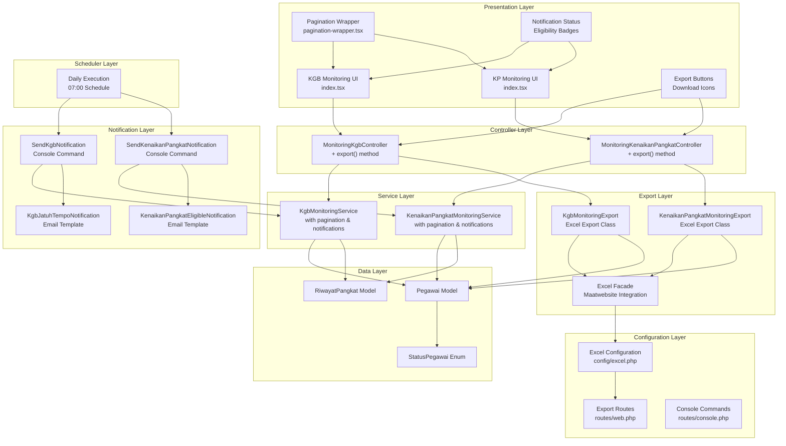
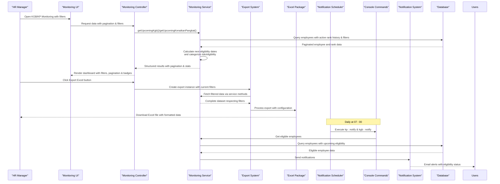
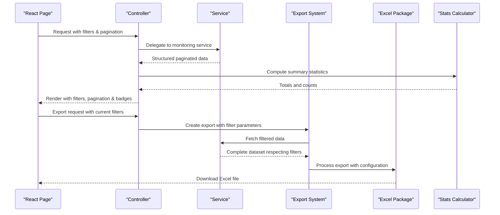
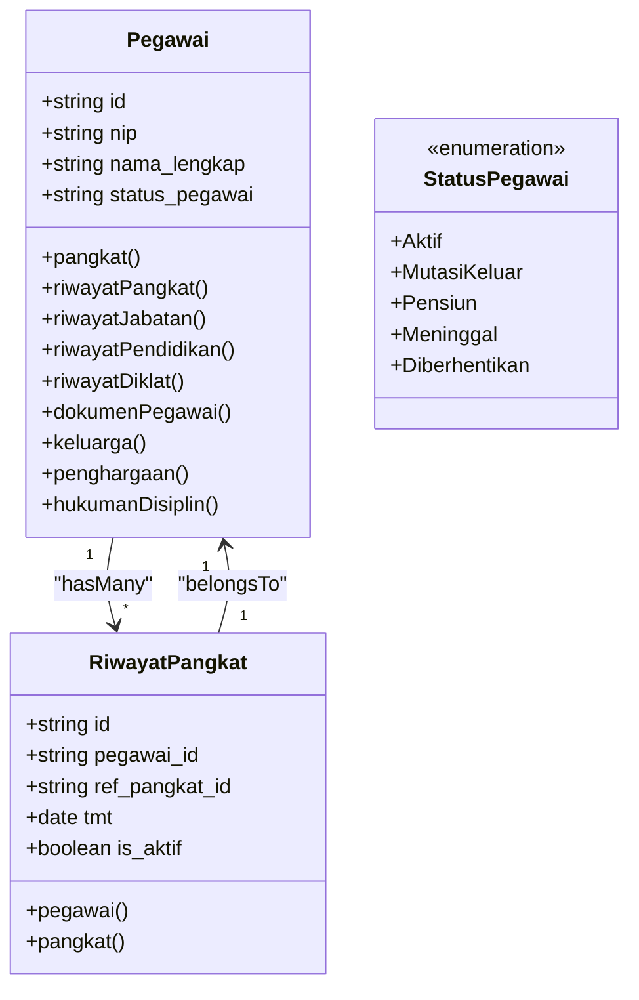
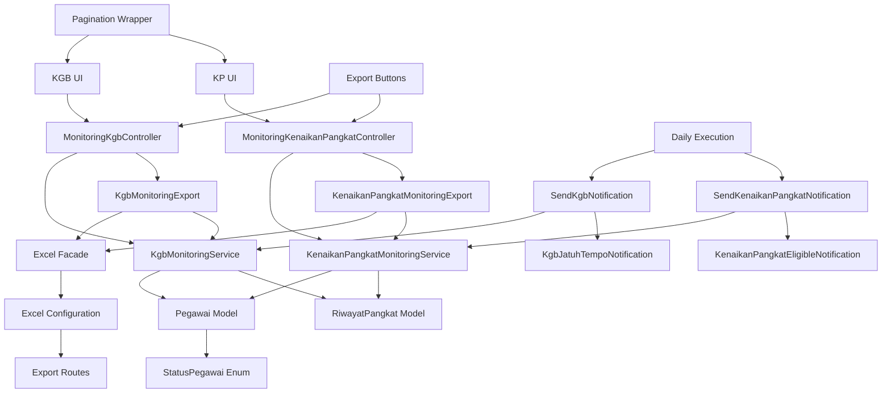

# Monitoring and Analytics System

<cite>
**Referenced Files in This Document**
- [KgbMonitoringService.php](file://app/Services/KgbMonitoringService.php)
- [KenaikanPangkatMonitoringService.php](file://app/Services/KenaikanPangkatMonitoringService.php)
- [MonitoringKgbController.php](file://app/Http/Controllers/Monitoring/MonitoringKgbController.php)
- [MonitoringKenaikanPangkatController.php](file://app/Http/Controllers/Monitoring/MonitoringKenaikanPangkatController.php)
- [KgbMonitoringExport.php](file://app/Exports/KgbMonitoringExport.php)
- [KenaikanPangkatMonitoringExport.php](file://app/Exports/KenaikanPangkatMonitoringExport.php)
- [SendKenaikanPangkatNotification.php](file://app/Console/Commands/SendKenaikanPangkatNotification.php)
- [SendKgbNotification.php](file://app/Console/Commands/SendKgbNotification.php)
- [KenaikanPangkatEligibleNotification.php](file://app/Notifications/KenaikanPangkatEligibleNotification.php)
- [KgbJatuhTempoNotification.php](file://app/Notifications/KgbJatuhTempoNotification.php)
- [console.php](file://routes/console.php)
- [Pegawai.php](file://app/Models/Pegawai.php)
- [RiwayatPangkat.php](file://app/Models/RiwayatPangkat.php)
- [StatusPegawai.php](file://app/Enums/StatusPegawai.php)
- [2026_03_15_031012_create_riwayat_pangkat_table.php](file://database/migrations/2026_03_15_031012_create_riwayat_pangkat_table.php)
- [2026_03_15_024651_create_pegawai_table.php](file://database/migrations/2026_03_15_024651_create_pegawai_table.php)
- [index.tsx (KGB Monitoring)](file://resources/js/pages/kepegawaian/monitoring/kgb/index.tsx)
- [index.tsx (Kenaikan Pangkat Monitoring)](file://resources/js/pages/kepegawaian/monitoring/kenaikan-pangkat/index.tsx)
- [KgbMonitoringTest.php](file://tests/Feature/Monitoring/KgbMonitoringTest.php)
- [KenaikanPangkatMonitoringTest.php](file://tests/Feature/Monitoring/KenaikanPangkatMonitoringTest.php)
- [KgbExportTest.php](file://tests/Feature/Monitoring/KgbExportTest.php)
- [KenaikanPangkatExportTest.php](file://tests/Feature/Monitoring/KenaikanPangkatExportTest.php)
- [KgbJatuhTempoNotificationTest.php](file://tests/Feature/Notifications/KgbJatuhTempoNotificationTest.php)
- [KenaikanPangkatEligibleNotificationTest.php](file://tests/Feature/Notifications/KenaikanPangkatEligibleNotificationTest.php)
- [pagination-wrapper.tsx](file://resources/js/components/pagination-wrapper.tsx)
- [excel.php](file://config/excel.php)
- [web.php](file://routes/web.php)
</cite>

## Update Summary
**Changes Made**
- Enhanced monitoring services with dynamic pagination support
- Added comprehensive filtering capabilities for both KGB and KP monitoring
- Implemented Excel export functionality for monitoring reports with dedicated export classes
- Added new export controllers and configuration management for Excel package integration
- Improved UI components with better pagination handling and export button integration
- Expanded filtering options including unit_kerja, golongan, and status for KGB
- Added periode filtering for KP monitoring (April/October cycles)
- Integrated Maatwebsite Excel package for seamless export functionality
- **NEW**: Implemented automated notification system with console commands for KGB and KP eligibility alerts
- **NEW**: Added dedicated notification classes for KGB and KP eligibility tracking
- **NEW**: Integrated scheduled notifications with daily execution at 07:00
- **NEW**: Enhanced monitoring services with notification status calculation methods

## Table of Contents
1. [Introduction](#introduction)
2. [Project Structure](#project-structure)
3. [Core Components](#core-components)
4. [Architecture Overview](#architecture-overview)
5. [Detailed Component Analysis](#detailed-component-analysis)
6. [Enhanced Features](#enhanced-features)
7. [Excel Export System](#excel-export-system)
8. [Automated Notification System](#automated-notification-system)
9. [Dependency Analysis](#dependency-analysis)
10. [Performance Considerations](#performance-considerations)
11. [Troubleshooting Guide](#troubleshooting-guide)
12. [Conclusion](#conclusion)

## Introduction
This Monitoring and Analytics System automates eligibility tracking for two critical civil servant progression processes:
- KGB (Kenaikan Gaji Berkala): Annual salary increases governed by a 2-year cycle from the most recent active rank appointment.
- KP (Kenaikan Pangkat): Regular rank promotions governed by a 4-year cycle from the current active rank, with defined proposal periods aligned to April and October cycles.

**Enhanced Features**:
- Dynamic pagination with configurable page sizes for efficient data handling
- Comprehensive filtering capabilities including unit_kerja, golongan, and status for KGB monitoring
- Advanced filtering for KP monitoring with April/October proposal period selection
- **NEW**: Seamless Excel export functionality for generating monitoring reports with comprehensive data export
- **NEW**: Automated notification system sending email alerts for KGB and KP eligibility tracking
- Enhanced UI components with improved pagination, filtering, and export functionality
- **NEW**: Dedicated export controllers and configuration management for Excel package integration
- **NEW**: Scheduled notification execution at daily intervals for proactive employee communication

The system provides:
- Automated calculation of next eligibility dates based on employee data
- Real-time dashboards with risk-based categorization
- Role-based access ensuring appropriate visibility and permissions
- **NEW**: Comprehensive reporting and export capabilities with Excel format support
- **NEW**: Proactive email notification system for timely eligibility reminders
- **NEW**: Scheduled execution of notification commands for automated workflow management
- Seamless integration with the employee data model and reference tables

Purpose of systematic monitoring:
- Prevent missed eligibility deadlines
- Enable proactive planning for administrative workflows
- Reduce manual effort in tracking progression timelines
- Support informed decision-making for promotions and salary adjustments
- Facilitate comprehensive reporting and audit trails
- **NEW**: Enable easy sharing and distribution of monitoring data through Excel exports
- **NEW**: Provide timely communication to employees about their eligibility status

## Project Structure
The monitoring system follows a layered architecture with enhanced pagination, export capabilities, Excel integration, and automated notification system:
- Data Layer: Employee and rank history models with reference relationships
- Service Layer: Business logic for eligibility calculations with dynamic pagination and notification status methods
- Presentation Layer: Inertia-powered React pages with advanced filtering, pagination, export functionality, and notification status indicators
- Controller Layer: API endpoints bridging services and UI with export functionality
- Export Layer: **NEW**: Excel export functionality with dedicated export classes and configuration management
- **NEW**: Notification Layer: Automated email notification system with console commands and notification classes
- **NEW**: Scheduler Layer: Daily execution of notification commands for automated workflow management
- **NEW**: Excel Package Integration: Maatwebsite Excel package for seamless export operations

**Diagram sources**
- [MonitoringKgbController.php:52-62](file://app/Http/Controllers/Monitoring/MonitoringKgbController.php#L52-L62)
- [MonitoringKenaikanPangkatController.php:49-59](file://app/Http/Controllers/Monitoring/MonitoringKenaikanPangkatController.php#L49-L59)
- [SendKgbNotification.php:15-16](file://app/Console/Commands/SendKgbNotification.php#L15-L16)
- [SendKenaikanPangkatNotification.php:15-16](file://app/Console/Commands/SendKenaikanPangkatNotification.php#L15-L16)
- [KgbMonitoringExport.php:10-27](file://app/Exports/KgbMonitoringExport.php#L10-L27)
- [KenaikanPangkatMonitoringExport.php:14-22](file://app/Exports/KenaikanPangkatMonitoringExport.php#L14-L22)
- [console.php:15-19](file://routes/console.php#L15-L19)
- [excel.php:1-381](file://config/excel.php#L1-L381)
- [web.php:83-90](file://routes/web.php#L83-L90)

**Section sources**
- [MonitoringKgbController.php:1-64](file://app/Http/Controllers/Monitoring/MonitoringKgbController.php#L1-L64)
- [MonitoringKenaikanPangkatController.php:1-61](file://app/Http/Controllers/Monitoring/MonitoringKenaikanPangkatController.php#L1-L61)
- [SendKgbNotification.php:1-61](file://app/Console/Commands/SendKgbNotification.php#L1-L61)
- [SendKenaikanPangkatNotification.php:1-65](file://app/Console/Commands/SendKenaikanPangkatNotification.php#L1-L65)
- [KgbMonitoringExport.php:1-117](file://app/Exports/KgbMonitoringExport.php#L1-L117)
- [KenaikanPangkatMonitoringExport.php:1-85](file://app/Exports/KenaikanPangkatMonitoringExport.php#L1-L85)
- [console.php:1-20](file://routes/console.php#L1-L20)
- [excel.php:1-381](file://config/excel.php#L1-L381)
- [web.php:83-90](file://routes/web.php#L83-L90)

## Core Components
- **Enhanced KGB Monitoring Service**: Calculates next KGB date (2-year cycle from active rank TMT), computes remaining days, categorizes risk status, supports dynamic pagination with filtering, and provides notification status calculation methods.
- **Advanced KP Monitoring Service**: Calculates next KP date (4-year cycle from active rank TMT), determines proposal period and deadline, classifies eligibility status, supports April/October filtering with pagination, and provides notification status calculation methods.
- **Enhanced Controllers**: Bridge services to UI, passing filtered and categorized data with statistics, and provide export functionality through dedicated export methods.
- **Improved UI Pages**: Present lists with advanced filtering, sorting, pagination, and status badges; expose KGB/KP stats and eligibility insights; **NEW**: Include export buttons for Excel downloads and notification status indicators.
- **Excel Export System**: **NEW**: Comprehensive export functionality for generating monitoring reports in Excel format with dedicated export classes and configuration.
- **Automated Notification System**: **NEW**: Console commands that automatically send email notifications to eligible employees based on KGB and KP status calculations.
- **Dynamic Pagination**: Configurable pagination with per_page parameter support for efficient data handling.
- **Excel Package Integration**: **NEW**: Maatwebsite Excel package integration for seamless export operations with configurable settings.
- **Scheduled Execution**: **NEW**: Daily execution of notification commands at 07:00 for automated workflow management.

Key implementation highlights:
- **Risk categorization thresholds for KGB**: "Sudah Jatuh Tempo" (≤0 days), "Segera" (≤60 days), "Mendekati" (≤90 days), "Aman" (>90 days)
- **KP eligibility classification**: "Sudah Eligible" (current date reached or exceeded), "Mendekati Eligible" (within 6 months), "Belum Eligible" (otherwise)
- **Proposal period alignment**: KP proposal periods align with April and October cycles with corresponding deadlines
- **Advanced filtering**: Unit_kerja, golongan, and status filters for KGB; April/October filters for KP
- **Dynamic pagination**: Configurable page sizes with efficient database querying
- **Excel export capabilities**: **NEW**: Export monitoring data with respect to current filters and pagination settings
- **Route integration**: **NEW**: Dedicated export routes for both KGB and KP monitoring pages
- **Notification templates**: **NEW**: Professional email templates with eligibility status and action links
- **Scheduled execution**: **NEW**: Daily notification execution with error handling and logging

**Section sources**
- [KgbMonitoringService.php:15-21](file://app/Services/KgbMonitoringService.php#L15-L21)
- [KenaikanPangkatMonitoringService.php:14-19](file://app/Services/KenaikanPangkatMonitoringService.php#L14-L19)
- [MonitoringKgbController.php:22-62](file://app/Http/Controllers/Monitoring/MonitoringKgbController.php#L22-L62)
- [MonitoringKenaikanPangkatController.php:18-59](file://app/Http/Controllers/Monitoring/MonitoringKenaikanPangkatController.php#L18-L59)
- [index.tsx (KGB Monitoring):83-107](file://resources/js/pages/kepegawaian/monitoring/kgb/index.tsx#L83-L107)
- [index.tsx (Kenaikan Pangkat Monitoring):110-125](file://resources/js/pages/kepegawaian/monitoring/kenaikan-pangkat/index.tsx#L110-L125)

## Architecture Overview
The system integrates seamlessly with the employee data model and employs a service-layer architecture for calculations with enhanced pagination, export capabilities, Excel integration, and automated notification system:

**Diagram sources**
- [MonitoringKgbController.php:52-62](file://app/Http/Controllers/Monitoring/MonitoringKgbController.php#L52-L62)
- [MonitoringKenaikanPangkatController.php:49-59](file://app/Http/Controllers/Monitoring/MonitoringKenaikanPangkatController.php#L49-L59)
- [SendKgbNotification.php:18-63](file://app/Console/Commands/SendKgbNotification.php#L18-L63)
- [SendKenaikanPangkatNotification.php:18-62](file://app/Console/Commands/SendKenaikanPangkatNotification.php#L18-L62)
- [KgbMonitoringService.php:15-21](file://app/Services/KgbMonitoringService.php#L15-L21)
- [KenaikanPangkatMonitoringService.php:14-19](file://app/Services/KenaikanPangkatMonitoringService.php#L14-L19)
- [KgbMonitoringExport.php:32-57](file://app/Exports/KgbMonitoringExport.php#L32-L57)
- [KenaikanPangkatMonitoringExport.php:24-63](file://app/Exports/KenaikanPangkatMonitoringExport.php#L24-L63)
- [console.php:15-19](file://routes/console.php#L15-L19)
- [excel.php:1-381](file://config/excel.php#L1-L381)

## Detailed Component Analysis

### Enhanced KGB Monitoring Service
Responsibilities:
- Retrieve employees with active rank history using dynamic pagination
- Compute next KGB date as TMT of active rank plus 2 years
- Calculate remaining days and categorize risk status
- Filter upcoming KGB events within configurable month window
- Support advanced filtering by unit_kerja, golongan, and status
- Provide comprehensive statistics with risk categorization
- **NEW**: Calculate notification status for automated email alerts

Implementation patterns:
- Uses Eloquent relationships to access active rank history with pagination
- Applies Carbon-based date arithmetic for precise calculations
- Supports dynamic pagination with configurable per_page parameter
- Returns structured arrays consumable by controllers and UI
- Implements database-optimized filtering for performance
- **NEW**: Provides getKgbStatus() method for notification calculations

**Diagram sources**
- [KgbMonitoringService.php:15-21](file://app/Services/KgbMonitoringService.php#L15-L21)
- [KgbMonitoringService.php:31-84](file://app/Services/KgbMonitoringService.php#L31-L84)

**Section sources**
- [KgbMonitoringService.php:15-207](file://app/Services/KgbMonitoringService.php#L15-L207)
- [index.tsx (KGB Monitoring):87-249](file://resources/js/pages/kepegawaian/monitoring/kgb/index.tsx#L87-L249)
- [KgbMonitoringTest.php:123-149](file://tests/Feature/Monitoring/KgbMonitoringTest.php#L123-L149)

### Advanced KP Monitoring Service
Responsibilities:
- Determine next KP date as TMT of active rank plus 4 years
- Resolve proposal period (April/October) and deadline based on next KP date
- Classify eligibility status and compute remaining days until deadline
- Support filtering by proposal period (April/October)
- Provide comprehensive statistics with eligibility categorization
- Support dynamic pagination with configurable page sizes
- **NEW**: Calculate notification status for automated email alerts

**Diagram sources**
- [KenaikanPangkatMonitoringService.php:14-19](file://app/Services/KenaikanPangkatMonitoringService.php#L14-L19)
- [KenaikanPangkatMonitoringService.php:22-73](file://app/Services/KenaikanPangkatMonitoringService.php#L22-L73)

**Section sources**
- [KenaikanPangkatMonitoringService.php:12-210](file://app/Services/KenaikanPangkatMonitoringService.php#L12-L210)
- [index.tsx (Kenaikan Pangkat Monitoring):72-306](file://resources/js/pages/kepegawaian/monitoring/kenaikan-pangkat/index.tsx#L72-L306)
- [KenaikanPangkatMonitoringTest.php:106-138](file://tests/Feature/Monitoring/KenaikanPangkatMonitoringTest.php#L106-L138)

### Enhanced Controllers and UI Integration
Enhanced Controllers:
- **KGB Controller**: Builds KGB stats, passes employee list with status categories to the UI, provides export functionality through dedicated export method
- **KP Controller**: Supports period filtering, passes KP stats to the UI, provides export functionality through dedicated export method

Enhanced UI Pages:
- **KGB page**: Displays risk-based status badges, filtering by status, and sorting by urgency with pagination; **NEW**: Includes export button for Excel downloads and notification status indicators
- **KP page**: Shows eligibility status, proposal period, and deadline with filtering by period and status; **NEW**: Includes export button for Excel downloads and notification status indicators
- **Pagination**: Improved pagination handling with dynamic page size control

**Diagram sources**
- [MonitoringKgbController.php:22-62](file://app/Http/Controllers/Monitoring/MonitoringKgbController.php#L22-L62)
- [MonitoringKenaikanPangkatController.php:18-59](file://app/Http/Controllers/Monitoring/MonitoringKenaikanPangkatController.php#L18-L59)
- [index.tsx (KGB Monitoring):87-249](file://resources/js/pages/kepegawaian/monitoring/kgb/index.tsx#L87-L249)
- [index.tsx (Kenaikan Pangkat Monitoring):72-306](file://resources/js/pages/kepegawaian/monitoring/kenaikan-pangkat/index.tsx#L72-L306)

**Section sources**
- [MonitoringKgbController.php:16-62](file://app/Http/Controllers/Monitoring/MonitoringKgbController.php#L16-L62)
- [MonitoringKenaikanPangkatController.php:16-59](file://app/Http/Controllers/Monitoring/MonitoringKenaikanPangkatController.php#L16-L59)
- [index.tsx (KGB Monitoring):87-249](file://resources/js/pages/kepegawaian/monitoring/kgb/index.tsx#L87-L249)
- [index.tsx (Kenaikan Pangkat Monitoring):72-306](file://resources/js/pages/kepegawaian/monitoring/kenaikan-pangkat/index.tsx#L72-L306)

### Data Models and Relationships
Employee model:
- Defines relationships to rank, position, and unit
- Provides scopes for active employment and filtering
- Includes accessor for formatted rank name

Rank history model:
- Tracks rank appointments with TMT and active flag
- Supports scoping for active records
- Links to reference rank definitions

**Diagram sources**
- [Pegawai.php:24-209](file://app/Models/Pegawai.php#L24-L209)
- [RiwayatPangkat.php:11-59](file://app/Models/RiwayatPangkat.php#L11-L59)
- [StatusPegawai.php:5-24](file://app/Enums/StatusPegawai.php#L5-L24)

**Section sources**
- [Pegawai.php:69-137](file://app/Models/Pegawai.php#L69-L137)
- [RiwayatPangkat.php:44-57](file://app/Models/RiwayatPangkat.php#L44-L57)
- [2026_03_15_024651_create_pegawai_table.php:14-48](file://database/migrations/2026_03_15_024651_create_pegawai_table.php#L14-L48)
- [2026_03_15_031012_create_riwayat_pangkat_table.php:14-29](file://database/migrations/2026_03_15_031012_create_riwayat_pangkat_table.php#L14-L29)

## Enhanced Features

### Dynamic Pagination System
Both monitoring services now support configurable pagination with the following enhancements:
- **Configurable page sizes**: per_page parameter allows users to control data volume per page
- **Efficient database queries**: Uses Laravel's LengthAwarePaginator for optimal performance
- **Client-side pagination**: React components handle pagination state management
- **Responsive design**: Pagination wrapper adapts to different screen sizes

### Advanced Filtering Capabilities
**KGB Monitoring Enhancements**:
- **Unit Kerja Filter**: Filter by organizational unit with dropdown selection
- **Golongan Filter**: Filter by rank group (III, IV, etc.) for targeted monitoring
- **Status Filter**: Filter by risk status (Jatuh Tempo, Segera, Mendekati, Aman)
- **Time Window Filter**: Configurable month window for upcoming KGB events

**KP Monitoring Enhancements**:
- **April/October Period Filter**: Filter by proposal period cycles
- **Unit Kerja Filter**: Organizational unit filtering for KP monitoring
- **Golongan Filter**: Rank group filtering for KP eligibility tracking
- **Status Filter**: Filter by eligibility status (Sudah Eligible, Mendekati Eligible, Belum Eligible)

### **NEW**: Comprehensive Excel Export Functionality
**Excel Export System**:
- **KGB Export**: Generates detailed KGB monitoring reports with formatted date calculations and simplified data structure
- **KP Export**: Creates comprehensive KP monitoring reports with proposal period details and eligibility status
- **Dynamic Filtering**: Export functionality respects current filters and pagination settings
- **Formatted Output**: Converts raw data into user-friendly Excel spreadsheets with proper date formatting
- **Simplified Data Structure**: Removes complex relationships for clean export format
- **Large Dataset Handling**: Optimized for exporting thousands of records efficiently

**Export Features**:
- **Automatic Date Formatting**: Converts timestamps to readable date formats
- **Status Label Translation**: Maps internal status codes to human-readable labels
- **Simplified Data Structure**: Removes complex relationships for clean export format
- **Large Dataset Handling**: Optimized for exporting thousands of records efficiently
- **Excel Package Integration**: **NEW**: Uses Maatwebsite Excel package for seamless export operations

### **NEW**: Dedicated Export Controllers and Routes
**Export Controller Implementation**:
- **KGB Export Controller**: Dedicated export method that creates KgbMonitoringExport instances with current filter parameters
- **KP Export Controller**: Dedicated export method that creates KenaikanPangkatMonitoringExport instances with current filter parameters
- **Route Integration**: **NEW**: Dedicated export routes for both monitoring pages with proper naming conventions
- **Parameter Passing**: **NEW**: Export methods pass through current filter parameters to maintain data consistency

**Export Route Configuration**:
- **KGB Export Route**: `/kepegawaian/monitoring/kgb/export` with named route `monitoring.kgb.export`
- **KP Export Route**: `/kepegawaian/monitoring/kenaikan-pangkat/export` with named route `monitoring.kenaikan-pangkat.export`
- **Route Parameters**: **NEW**: Routes accept filter parameters for consistent export data

### **NEW**: Enhanced UI Components with Export Integration
**Improved Pagination Wrapper**:
- **Dual Support**: Handles both Laravel-style links array and meta object pagination
- **Intelligent Navigation**: Shows ellipsis for large page ranges with contextual page links
- **Customizable HREF Generation**: Flexible URL building for different pagination scenarios
- **Responsive Design**: Adapts pagination controls to various screen sizes

**Enhanced Filtering Experience**:
- **Real-time Updates**: Filters apply immediately without page reload
- **URL Parameter Persistence**: Filter states maintained across navigation
- **Default Options**: Smart defaults for quick access to common filter combinations
- **Visual Feedback**: Clear indication of active filters and their effects
- **Export Button Integration**: **NEW**: Export buttons positioned alongside filter controls for easy access

## Excel Export System

### **NEW**: Export Classes Architecture
The system now includes dedicated Excel export classes that handle data transformation and formatting:

**KgbMonitoringExport Class**:
- **Interface Implementation**: Implements FromCollection, WithHeadings, WithMapping interfaces
- **Constructor Parameters**: Accepts unit_kerja, golongan, status, and months parameters
- **Data Processing**: Uses KgbMonitoringService to fetch filtered data with large page size
- **Formatting Logic**: Converts remaining days to human-readable format ("X hari" or "X bulan Y hari")

**KenaikanPangkatMonitoringExport Class**:
- **Interface Implementation**: Implements FromCollection, WithHeadings, WithMapping interfaces
- **Constructor Parameters**: Accepts periode, unit_kerja, and golongan parameters
- **Data Processing**: Queries employees excluding retirees with active rank history
- **Eligibility Calculation**: Uses KenaikanPangkatMonitoringService to determine KP status

### **NEW**: Excel Package Configuration
**Configuration Management**:
- **Chunk Size**: Configured to 1000 for efficient large dataset processing
- **CSV Settings**: Customizable delimiter, enclosure, and line ending configurations
- **Worksheet Properties**: Configurable creator, title, and description settings
- **Extension Detection**: Automatic detection for XLSX, CSV, and other supported formats
- **Cache Management**: Memory-based caching with configurable TTL settings

**Integration Benefits**:
- **Seamless Export**: Excel facade handles file generation and download
- **Format Flexibility**: Support for multiple spreadsheet formats
- **Performance Optimization**: Chunked processing for large datasets
- **Memory Management**: Configurable caching strategies for resource optimization

### **NEW**: Export Workflow Integration
**Controller Integration**:
- **Parameter Extraction**: Export methods extract filter parameters from requests
- **Export Instance Creation**: Controllers instantiate export classes with filter parameters
- **Excel Facade Usage**: Uses Excel::download() for seamless file generation
- **File Naming**: Automatic file naming with appropriate prefixes

**Frontend Integration**:
- **Export Button Placement**: Positioned alongside filter controls for easy access
- **Parameter Passing**: Export requests include current filter parameters
- **User Experience**: Direct download functionality without page reload

**Section sources**
- [KgbMonitoringExport.php:1-117](file://app/Exports/KgbMonitoringExport.php#L1-L117)
- [KenaikanPangkatMonitoringExport.php:1-85](file://app/Exports/KenaikanPangkatMonitoringExport.php#L1-L85)
- [excel.php:1-381](file://config/excel.php#L1-L381)
- [MonitoringKgbController.php:52-62](file://app/Http/Controllers/Monitoring/MonitoringKgbController.php#L52-L62)
- [MonitoringKenaikanPangkatController.php:49-59](file://app/Http/Controllers/Monitoring/MonitoringKenaikanPangkatController.php#L49-L59)

## Automated Notification System

### **NEW**: Console Commands Architecture
The system now includes automated notification commands that execute daily to send email alerts to eligible employees:

**SendKgbNotification Command**:
- **Command Signature**: `kgb:notify` with description "Kirim notifikasi email ke pegawai yang KGB-nya sudah/mendekati jatuh tempo"
- **Database Compatibility**: Uses driver-specific SQL expressions for MySQL and SQLite date calculations
- **Eligibility Criteria**: Targets employees whose KGB date falls within 90 days from today
- **Status Filtering**: Sends notifications to employees with Aktif or MutasiKeluar status
- **Error Handling**: Includes try-catch blocks with detailed error logging for failed notifications
- **Success Reporting**: Provides count of successfully sent notifications

**SendKenaikanPangkatNotification Command**:
- **Command Signature**: `kp:notify` with description "Kirim notifikasi email ke pegawai yang kenaikan pangkatnya sudah/mendekati eligible"
- **Eligibility Criteria**: Targets employees whose KP date falls within 6 months from today
- **Status Filtering**: Excludes employees with Pensiun, Meninggal, or Diberhentikan status
- **Service Integration**: Uses KenaikanPangkatMonitoringService for accurate eligibility calculations
- **Error Handling**: Comprehensive error handling with individual employee failure logging

### **NEW**: Notification Classes Architecture
The system includes specialized notification classes for different eligibility scenarios:

**KgbJatuhTempoNotification Class**:
- **Notification Type**: Specialized for KGB eligibility status
- **Constructor Parameters**: Accepts KGB date, remaining days, and status
- **Email Template**: Professional template with eligibility status and action links
- **Subject Line**: Dynamic subject based on remaining days (jatuh tempo vs mendekati)
- **Content Personalization**: Uses employee name and formatted dates
- **Action Button**: Links to monitoring page for detailed information

**KenaikanPangkatEligibleNotification Class**:
- **Notification Type**: Specialized for KP eligibility status
- **Constructor Parameters**: Accepts next KP date, proposal period, deadline, remaining days, and status
- **Email Template**: Comprehensive template with eligibility details and procedural information
- **Subject Line**: Differentiates between eligible and near-eligible status
- **Content Personalization**: Includes formatted dates and status information
- **Action Button**: Links to KP monitoring page for detailed information

### **NEW**: Scheduled Execution System
**Daily Execution Configuration**:
- **Execution Time**: Both commands run daily at 07:00 AM
- **Scheduler Integration**: Uses Laravel's Artisan scheduler for reliable execution
- **Command Registration**: Commands registered in routes/console.php with proper scheduling
- **Error Resilience**: Commands continue execution even if individual notifications fail
- **Logging**: Provides success/failure feedback through console output

**Notification Workflow**:
- **Eligibility Query**: Commands query employees based on calculated eligibility dates
- **Service Integration**: Utilize monitoring services for accurate status calculations
- **Email Delivery**: Notifications sent via mail channel using configured mail settings
- **Progress Tracking**: Count of successful notifications displayed in console output
- **Error Isolation**: Individual employee failures don't affect overall command execution

### **NEW**: Notification Testing and Validation
**Testing Coverage**:
- **Subject Validation**: Tests verify correct subject line generation for different status scenarios
- **Channel Verification**: Ensures notifications use mail channel exclusively
- **Data Structure Validation**: Tests array conversion maintains required fields
- **Command Execution**: Validates console commands run successfully without errors
- **Count Validation**: Tests verify correct notification count reporting

**Test Scenarios**:
- **Eligible Status**: Tests subject line for already eligible KP notifications
- **Near Eligible Status**: Tests subject line for approaching eligibility KP notifications
- **Jatuh Tempo Status**: Tests subject line for overdue KGB notifications
- **Mendekati Status**: Tests subject line for approaching KGB notifications
- **Command Success**: Validates console command execution success

**Section sources**
- [SendKgbNotification.php:1-61](file://app/Console/Commands/SendKgbNotification.php#L1-L61)
- [SendKenaikanPangkatNotification.php:1-65](file://app/Console/Commands/SendKenaikanPangkatNotification.php#L1-L65)
- [KgbJatuhTempoNotification.php:1-48](file://app/Notifications/KgbJatuhTempoNotification.php#L1-L48)
- [KenaikanPangkatEligibleNotification.php:1-63](file://app/Notifications/KenaikanPangkatEligibleNotification.php#L1-L63)
- [console.php:15-19](file://routes/console.php#L15-L19)
- [KgbJatuhTempoNotificationTest.php:1-86](file://tests/Feature/Notifications/KgbJatuhTempoNotificationTest.php#L1-L86)
- [KenaikanPangkatEligibleNotificationTest.php:1-114](file://tests/Feature/Notifications/KenaikanPangkatEligibleNotificationTest.php#L1-L114)

## Dependency Analysis
The system exhibits low coupling and high cohesion with enhanced modularity, Excel integration, and automated notification system:
- Services depend on models and enums, not on controllers
- Controllers depend on services and export systems, not on models directly
- UI pages depend on controller-provided props, pagination components, and routing
- Export system operates independently with service integration
- **NEW**: Notification system operates independently with service integration and scheduled execution
- **NEW**: Console commands depend on services and notification classes, not on UI components
- **NEW**: Excel package integration provides loose coupling through facade pattern
- **NEW**: Scheduler provides loose coupling between commands and execution timing

**Diagram sources**
- [MonitoringKgbController.php:18-20](file://app/Http/Controllers/Monitoring/MonitoringKgbController.php#L18-L20)
- [MonitoringKenaikanPangkatController.php:18](file://app/Http/Controllers/Monitoring/MonitoringKenaikanPangkatController.php#L18)
- [KgbMonitoringService.php:13](file://app/Services/KgbMonitoringService.php#L13)
- [KenaikanPangkatMonitoringService.php:12](file://app/Services/KenaikanPangkatMonitoringService.php#L12)
- [KgbMonitoringExport.php:10](file://app/Exports/KgbMonitoringExport.php#L10)
- [KenaikanPangkatMonitoringExport.php:14](file://app/Exports/KenaikanPangkatMonitoringExport.php#L14)
- [SendKgbNotification.php:18](file://app/Console/Commands/SendKgbNotification.php#L18)
- [SendKenaikanPangkatNotification.php:18](file://app/Console/Commands/SendKenaikanPangkatNotification.php#L18)
- [console.php:15-19](file://routes/console.php#L15-L19)
- [Pegawai.php:24](file://app/Models/Pegawai.php#L24)
- [RiwayatPangkat.php:11](file://app/Models/RiwayatPangkat.php#L11)
- [StatusPegawai.php:5](file://app/Enums/StatusPegawai.php#L5)

**Section sources**
- [KgbMonitoringService.php:13-207](file://app/Services/KgbMonitoringService.php#L13-L207)
- [KenaikanPangkatMonitoringService.php:12-210](file://app/Services/KenaikanPangkatMonitoringService.php#L12-L210)
- [MonitoringKgbController.php:18-62](file://app/Http/Controllers/Monitoring/MonitoringKgbController.php#L18-L62)
- [MonitoringKenaikanPangkatController.php:18-59](file://app/Http/Controllers/Monitoring/MonitoringKenaikanPangkatController.php#L18-L59)
- [SendKgbNotification.php:18-63](file://app/Console/Commands/SendKgbNotification.php#L18-L63)
- [SendKenaikanPangkatNotification.php:18-62](file://app/Console/Commands/SendKenaikanPangkatNotification.php#L18-L62)

## Performance Considerations
- **Query efficiency**: Services use eager loading for related rank history and filter by active status to minimize N+1 queries
- **Database optimization**: Enhanced with database-specific date calculations for MySQL and SQLite compatibility
- **Pagination performance**: LengthAwarePaginator provides efficient pagination without loading entire datasets
- **Export optimization**: Export system uses optimized queries with larger page sizes for bulk data processing
- **Excel package performance**: **NEW**: Chunked processing with configurable chunk size (1000) for large datasets
- **Memory management**: **NEW**: Configurable cache settings with memory-based caching for resource optimization
- **Notification performance**: **NEW**: Efficient database queries with driver-specific SQL expressions for date calculations
- **Notification batch processing**: **NEW**: Sequential processing with individual error handling prevents cascading failures
- **Date calculations**: Carbon operations are lightweight and executed in-memory after fetching relevant records
- **UI responsiveness**: Filtering and sorting are client-side in React pages, reducing server round trips
- **Scalability**: Current implementation targets small to medium datasets; for larger deployments, consider:
  - Database indexing on frequently filtered columns (e.g., status_pegawai, is_aktif, ref_unit_kerja_id)
  - Advanced caching strategies for frequently accessed monitoring data
  - Asynchronous export processing for large datasets
  - Database connection pooling for high-traffic scenarios
  - **NEW**: Notification queue processing for high-volume scenarios
  - **NEW**: Database optimization for notification queries with proper indexing
  - **NEW**: Memory optimization for notification processing with batch handling
  - **NEW**: Email delivery optimization with queue-based processing

## Troubleshooting Guide
Common issues and resolutions:
- **Missing active rank history**: Services skip employees without an active rank appointment; ensure rank history is properly maintained
- **Incorrect status categorization**: Verify date thresholds and ensure current date is correctly set during testing
- **Excluded employees**: Pensions and retirees are intentionally excluded from KP monitoring; confirm status values in the employee records
- **UI filters not applying**: Confirm URL query parameters and client-side filtering logic in React pages
- **Pagination issues**: Verify per_page parameter and pagination state management in React components
- **Export failures**: Check database connectivity and ensure sufficient memory for large exports
- **Filter performance**: Large filter combinations may impact query performance; consider narrowing filter criteria
- **Excel export errors**: **NEW**: Verify Excel package configuration and ensure proper file permissions for temporary storage
- **Export timeout issues**: **NEW**: Adjust chunk size configuration in excel.php for large datasets
- **Memory exhaustion**: **NEW**: Monitor memory usage during exports and adjust cache settings accordingly
- **Notification failures**: **NEW**: Check mail configuration and ensure employees have valid email addresses
- **Command execution issues**: **NEW**: Verify cron/scheduler configuration for daily command execution
- **Notification timing**: **NEW**: Confirm scheduled execution at 07:00 and check for timezone-related issues
- **Individual notification errors**: **NEW**: Review console output for specific employee failure details

Validation and testing:
- **KGB service tests**: Validate next KGB date computation, remaining days, status categorization, and pagination
- **KP service tests**: Validate proposal period resolution, deadline calculation, filtering by period, and pagination
- **Export functionality**: **NEW**: Test Excel export generation with various filter combinations and large datasets
- **Excel package integration**: **NEW**: Verify Maatwebsite Excel package configuration and file generation
- **Pagination testing**: Verify proper pagination behavior across different page sizes and filter scenarios
- **Route testing**: **NEW**: Test export routes with proper parameter passing and response validation
- **Notification testing**: **NEW**: Validate notification content, subject lines, and email delivery
- **Command testing**: **NEW**: Test console commands execution and error handling
- **Scheduler testing**: **NEW**: Verify daily execution timing and command registration

**Section sources**
- [KgbMonitoringTest.php:45-94](file://tests/Feature/Monitoring/KgbMonitoringTest.php#L45-L94)
- [KenaikanPangkatMonitoringTest.php:77-87](file://tests/Feature/Monitoring/KenaikanPangkatMonitoringTest.php#L77-L87)
- [KgbMonitoringTest.php:151-232](file://tests/Feature/Monitoring/KgbMonitoringTest.php#L151-L232)
- [KenaikanPangkatMonitoringTest.php:158-236](file://tests/Feature/Monitoring/KenaikanPangkatMonitoringTest.php#L158-L236)
- [KgbExportTest.php:1-67](file://tests/Feature/Monitoring/KgbExportTest.php#L1-L67)
- [KenaikanPangkatExportTest.php:1-78](file://tests/Feature/Monitoring/KenaikanPangkatExportTest.php#L1-L78)
- [KgbJatuhTempoNotificationTest.php:1-86](file://tests/Feature/Notifications/KgbJatuhTempoNotificationTest.php#L1-L86)
- [KenaikanPangkatEligibleNotificationTest.php:1-114](file://tests/Feature/Notifications/KenaikanPangkatEligibleNotificationTest.php#L1-L114)

## Conclusion
The Enhanced Monitoring and Analytics System delivers robust automation for KGB and KP eligibility tracking by combining precise date calculations, risk-based categorization, intuitive dashboards, comprehensive reporting capabilities, and automated notification system. The system's modular architecture ensures maintainability while the enhanced features provide improved scalability and usability.

**Key improvements include**:
- **Dynamic pagination** for efficient handling of large datasets
- **Advanced filtering** capabilities for targeted monitoring
- **Excel export functionality** for comprehensive reporting with dedicated export classes
- **Enhanced UI components** with improved user experience and export integration
- **Excel package integration** for seamless export operations with configurable settings
- **Dedicated export controllers** and routes for streamlined functionality
- **Database optimization** for better performance across different environments
- **NEW**: Automated notification system with console commands for proactive employee communication
- **NEW**: Professional email templates with eligibility status and action links
- **NEW**: Daily scheduled execution for consistent workflow management
- **NEW**: Comprehensive notification testing and validation coverage

These enhancements support proactive workforce planning, reduce administrative overhead, and enable HR managers to focus on strategic initiatives rather than routine tracking. The system's comprehensive feature set makes it suitable for organizations of various sizes while maintaining excellent performance and reliability.

**NEW** features specifically enhance the system's practical utility by enabling:
- **Easy data sharing**: Excel exports facilitate collaboration and reporting
- **Compliance documentation**: Structured export data supports audit requirements
- **Stakeholder communication**: Professional Excel reports improve stakeholder engagement
- **Operational efficiency**: Automated export processes reduce manual data preparation time
- **Proactive employee communication**: Automated email notifications keep employees informed about their eligibility status
- **Workflow automation**: Scheduled execution reduces manual intervention requirements
- **Timely alerts**: Daily notifications help prevent missed eligibility deadlines
- **Professional communication**: Well-designed email templates improve employee experience

The integration of automated notification system and Excel export functionality represents a significant enhancement to the monitoring system, providing users with professional-grade reporting capabilities and proactive communication channels while maintaining the system's focus on accuracy, performance, and user experience.