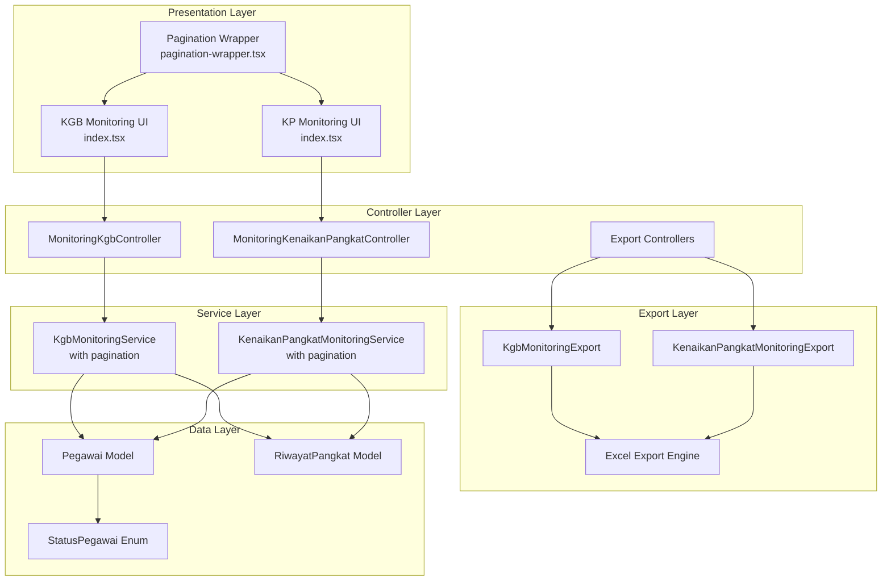
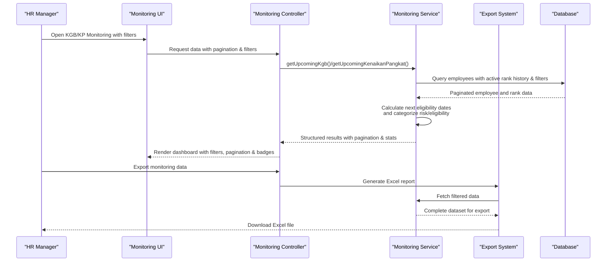
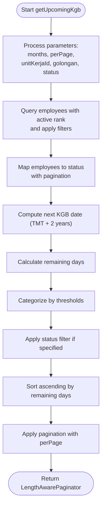
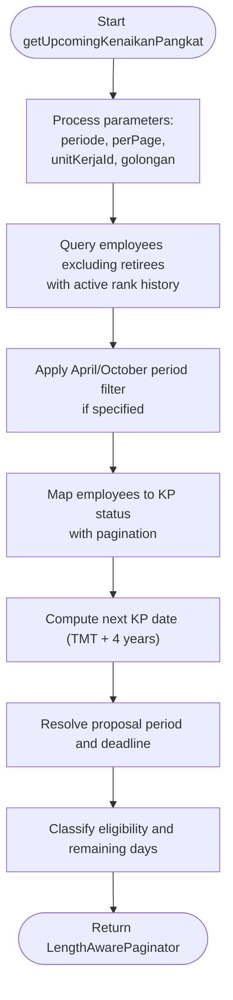
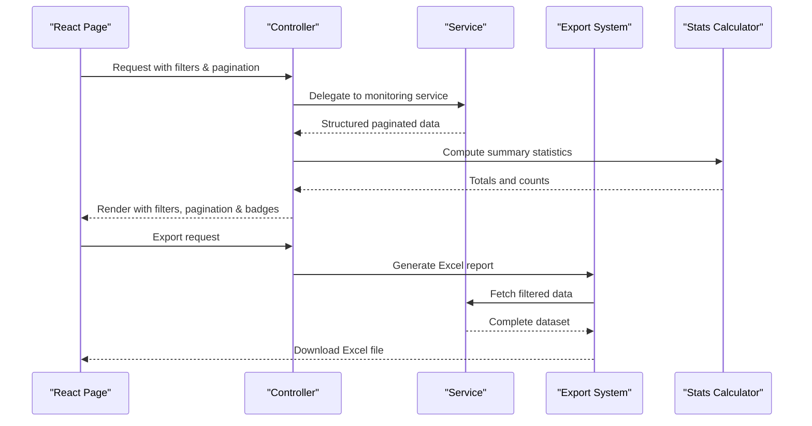
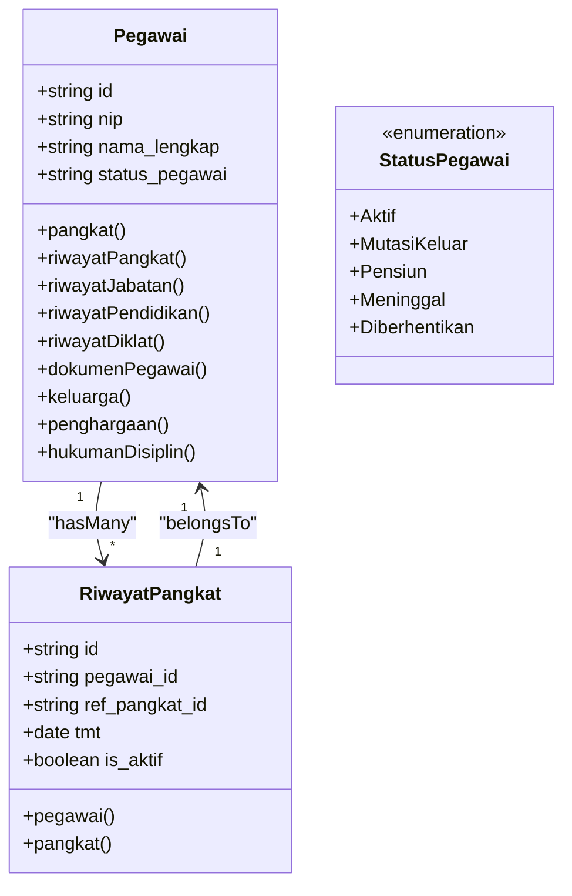
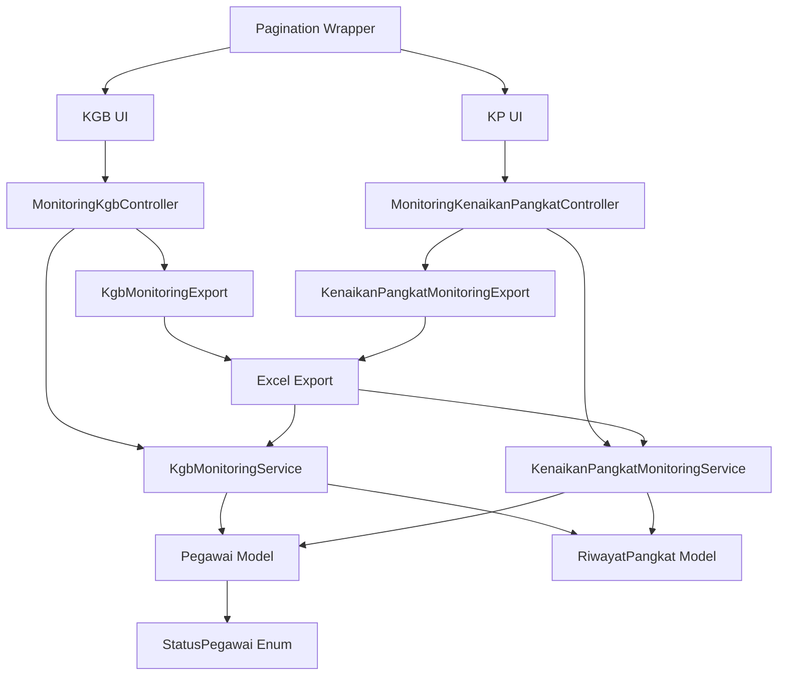

# Monitoring and Analytics System

<cite>
**Referenced Files in This Document**
- [KgbMonitoringService.php](file://app/Services/KgbMonitoringService.php)
- [KenaikanPangkatMonitoringService.php](file://app/Services/KenaikanPangkatMonitoringService.php)
- [MonitoringKgbController.php](file://app/Http/Controllers/Monitoring/MonitoringKgbController.php)
- [MonitoringKenaikanPangkatController.php](file://app/Http/Controllers/Monitoring/MonitoringKenaikanPangkatController.php)
- [KgbMonitoringExport.php](file://app/Exports/KgbMonitoringExport.php)
- [KenaikanPangkatMonitoringExport.php](file://app/Exports/KenaikanPangkatMonitoringExport.php)
- [Pegawai.php](file://app/Models/Pegawai.php)
- [RiwayatPangkat.php](file://app/Models/RiwayatPangkat.php)
- [StatusPegawai.php](file://app/Enums/StatusPegawai.php)
- [2026_03_15_031012_create_riwayat_pangkat_table.php](file://database/migrations/2026_03_15_031012_create_riwayat_pangkat_table.php)
- [2026_03_15_024651_create_pegawai_table.php](file://database/migrations/2026_03_15_024651_create_pegawai_table.php)
- [index.tsx (KGB Monitoring)](file://resources/js/pages/kepegawaian/monitoring/kgb/index.tsx)
- [index.tsx (Kenaikan Pangkat Monitoring)](file://resources/js/pages/kepegawaian/monitoring/kenaikan-pangkat/index.tsx)
- [KgbMonitoringTest.php](file://tests/Feature/Monitoring/KgbMonitoringTest.php)
- [KenaikanPangkatMonitoringTest.php](file://tests/Feature/Monitoring/KenaikanPangkatMonitoringTest.php)
- [pagination-wrapper.tsx](file://resources/js/components/pagination-wrapper.tsx)
</cite>

## Update Summary
**Changes Made**
- Enhanced monitoring services with dynamic pagination support
- Added comprehensive filtering capabilities for both KGB and KP monitoring
- Implemented Excel export functionality for monitoring reports
- Improved UI components with better pagination handling
- Expanded filtering options including unit_kerja, golongan, and status for KGB
- Added periode filtering for KP monitoring (April/October cycles)

## Table of Contents
1. [Introduction](#introduction)
2. [Project Structure](#project-structure)
3. [Core Components](#core-components)
4. [Architecture Overview](#architecture-overview)
5. [Detailed Component Analysis](#detailed-component-analysis)
6. [Enhanced Features](#enhanced-features)
7. [Dependency Analysis](#dependency-analysis)
8. [Performance Considerations](#performance-considerations)
9. [Troubleshooting Guide](#troubleshooting-guide)
10. [Conclusion](#conclusion)

## Introduction
This Monitoring and Analytics System automates eligibility tracking for two critical civil servant progression processes:
- KGB (Kenaikan Gaji Berkala): Annual salary increases governed by a 2-year cycle from the most recent active rank appointment.
- KP (Kenaikan Pangkat): Regular rank promotions governed by a 4-year cycle from the current active rank, with defined proposal periods aligned to April and October cycles.

**Enhanced Features**:
- Dynamic pagination with configurable page sizes for efficient data handling
- Comprehensive filtering capabilities including unit_kerja, golongan, and status for KGB monitoring
- Advanced filtering for KP monitoring with April/October proposal period selection
- Seamless Excel export functionality for generating monitoring reports
- Enhanced UI components with improved pagination and filtering experiences

The system provides:
- Automated calculation of next eligibility dates based on employee data
- Real-time dashboards with risk-based categorization
- Role-based access ensuring appropriate visibility and permissions
- Comprehensive reporting and export capabilities
- Seamless integration with the employee data model and reference tables

Purpose of systematic monitoring:
- Prevent missed eligibility deadlines
- Enable proactive planning for administrative workflows
- Reduce manual effort in tracking progression timelines
- Support informed decision-making for promotions and salary adjustments
- Facilitate comprehensive reporting and audit trails

## Project Structure
The monitoring system follows a layered architecture with enhanced pagination and export capabilities:
- Data Layer: Employee and rank history models with reference relationships
- Service Layer: Business logic for eligibility calculations with dynamic pagination
- Presentation Layer: Inertia-powered React pages with advanced filtering and pagination
- Controller Layer: API endpoints bridging services and UI with export functionality
- Export Layer: Excel export functionality for comprehensive reporting

**Diagram sources**
- [MonitoringKgbController.php:1-64](file://app/Http/Controllers/Monitoring/MonitoringKgbController.php#L1-L64)
- [MonitoringKenaikanPangkatController.php:1-61](file://app/Http/Controllers/Monitoring/MonitoringKenaikanPangkatController.php#L1-L61)
- [KgbMonitoringService.php:15-21](file://app/Services/KgbMonitoringService.php#L15-L21)
- [KenaikanPangkatMonitoringService.php:14-19](file://app/Services/KenaikanPangkatMonitoringService.php#L14-L19)
- [KgbMonitoringExport.php:10-27](file://app/Exports/KgbMonitoringExport.php#L10-L27)
- [KenaikanPangkatMonitoringExport.php:14-22](file://app/Exports/KenaikanPangkatMonitoringExport.php#L14-L22)
- [pagination-wrapper.tsx:44-49](file://resources/js/components/pagination-wrapper.tsx#L44-L49)

**Section sources**
- [MonitoringKgbController.php:1-64](file://app/Http/Controllers/Monitoring/MonitoringKgbController.php#L1-L64)
- [MonitoringKenaikanPangkatController.php:1-61](file://app/Http/Controllers/Monitoring/MonitoringKenaikanPangkatController.php#L1-L61)
- [KgbMonitoringService.php:15-21](file://app/Services/KgbMonitoringService.php#L15-L21)
- [KenaikanPangkatMonitoringService.php:14-19](file://app/Services/KenaikanPangkatMonitoringService.php#L14-L19)
- [KgbMonitoringExport.php:10-27](file://app/Exports/KgbMonitoringExport.php#L10-L27)
- [KenaikanPangkatMonitoringExport.php:14-22](file://app/Exports/KenaikanPangkatMonitoringExport.php#L14-L22)
- [pagination-wrapper.tsx:44-49](file://resources/js/components/pagination-wrapper.tsx#L44-L49)

## Core Components
- **Enhanced KGB Monitoring Service**: Calculates next KGB date (2-year cycle from active rank TMT), computes remaining days, categorizes risk status, and supports dynamic pagination with filtering.
- **Advanced KP Monitoring Service**: Calculates next KP date (4-year cycle from active rank TMT), determines proposal period and deadline, classifies eligibility status, and supports April/October filtering with pagination.
- **Enhanced Controllers**: Bridge services to UI, passing filtered and categorized data with statistics, and provide export functionality.
- **Improved UI Pages**: Present lists with advanced filtering, sorting, pagination, and status badges; expose KGB/KP stats and eligibility insights.
- **Excel Export System**: Comprehensive export functionality for generating monitoring reports in Excel format.
- **Dynamic Pagination**: Configurable pagination with per_page parameter support for efficient data handling.

Key implementation highlights:
- **Risk categorization thresholds for KGB**: "Sudah Jatuh Tempo" (≤0 days), "Segera" (≤60 days), "Mendekati" (≤90 days), "Aman" (>90 days)
- **KP eligibility classification**: "Sudah Eligible" (current date reached or exceeded), "Mendekati Eligible" (within 6 months), "Belum Eligible" (otherwise)
- **Proposal period alignment**: KP proposal periods align with April and October cycles with corresponding deadlines
- **Advanced filtering**: Unit_kerja, golongan, and status filters for KGB; April/October filters for KP
- **Dynamic pagination**: Configurable page sizes with efficient database querying

**Section sources**
- [KgbMonitoringService.php:15-21](file://app/Services/KgbMonitoringService.php#L15-L21)
- [KenaikanPangkatMonitoringService.php:14-19](file://app/Services/KenaikanPangkatMonitoringService.php#L14-L19)
- [MonitoringKgbController.php:22-50](file://app/Http/Controllers/Monitoring/MonitoringKgbController.php#L22-L50)
- [MonitoringKenaikanPangkatController.php:18-47](file://app/Http/Controllers/Monitoring/MonitoringKenaikanPangkatController.php#L18-L47)
- [index.tsx (KGB Monitoring):83-107](file://resources/js/pages/kepegawaian/monitoring/kgb/index.tsx#L83-L107)
- [index.tsx (Kenaikan Pangkat Monitoring):110-125](file://resources/js/pages/kepegawaian/monitoring/kenaikan-pangkat/index.tsx#L110-L125)

## Architecture Overview
The system integrates seamlessly with the employee data model and employs a service-layer architecture for calculations with enhanced pagination and export capabilities:

**Diagram sources**
- [MonitoringKgbController.php:22-62](file://app/Http/Controllers/Monitoring/MonitoringKgbController.php#L22-L62)
- [MonitoringKenaikanPangkatController.php:18-59](file://app/Http/Controllers/Monitoring/MonitoringKenaikanPangkatController.php#L18-L59)
- [KgbMonitoringService.php:15-21](file://app/Services/KgbMonitoringService.php#L15-L21)
- [KenaikanPangkatMonitoringService.php:14-19](file://app/Services/KenaikanPangkatMonitoringService.php#L14-L19)
- [KgbMonitoringExport.php:32-57](file://app/Exports/KgbMonitoringExport.php#L32-L57)
- [KenaikanPangkatMonitoringExport.php:24-63](file://app/Exports/KenaikanPangkatMonitoringExport.php#L24-L63)

## Detailed Component Analysis

### Enhanced KGB Monitoring Service
Responsibilities:
- Retrieve employees with active rank history using dynamic pagination
- Compute next KGB date as TMT of active rank plus 2 years
- Calculate remaining days and categorize risk status
- Filter upcoming KGB events within configurable month window
- Support advanced filtering by unit_kerja, golongan, and status
- Provide comprehensive statistics with risk categorization

Implementation patterns:
- Uses Eloquent relationships to access active rank history with pagination
- Applies Carbon-based date arithmetic for precise calculations
- Supports dynamic pagination with configurable per_page parameter
- Returns structured arrays consumable by controllers and UI
- Implements database-optimized filtering for performance

**Diagram sources**
- [KgbMonitoringService.php:15-21](file://app/Services/KgbMonitoringService.php#L15-L21)
- [KgbMonitoringService.php:31-84](file://app/Services/KgbMonitoringService.php#L31-L84)

**Section sources**
- [KgbMonitoringService.php:15-207](file://app/Services/KgbMonitoringService.php#L15-L207)
- [index.tsx (KGB Monitoring):87-249](file://resources/js/pages/kepegawaian/monitoring/kgb/index.tsx#L87-L249)
- [KgbMonitoringTest.php:123-149](file://tests/Feature/Monitoring/KgbMonitoringTest.php#L123-L149)

### Advanced KP Monitoring Service
Responsibilities:
- Determine next KP date as TMT of active rank plus 4 years
- Resolve proposal period (April/October) and deadline based on next KP date
- Classify eligibility status and compute remaining days until deadline
- Support filtering by proposal period (April/October)
- Provide comprehensive statistics with eligibility categorization
- Support dynamic pagination with configurable page sizes

**Diagram sources**
- [KenaikanPangkatMonitoringService.php:14-19](file://app/Services/KenaikanPangkatMonitoringService.php#L14-L19)
- [KenaikanPangkatMonitoringService.php:22-73](file://app/Services/KenaikanPangkatMonitoringService.php#L22-L73)

**Section sources**
- [KenaikanPangkatMonitoringService.php:12-210](file://app/Services/KenaikanPangkatMonitoringService.php#L12-L210)
- [index.tsx (Kenaikan Pangkat Monitoring):72-306](file://resources/js/pages/kepegawaian/monitoring/kenaikan-pangkat/index.tsx#L72-L306)
- [KenaikanPangkatMonitoringTest.php:106-138](file://tests/Feature/Monitoring/KenaikanPangkatMonitoringTest.php#L106-L138)

### Enhanced Controllers and UI Integration
Enhanced Controllers:
- **KGB Controller**: Builds KGB stats, passes employee list with status categories to the UI, and provides export functionality
- **KP Controller**: Supports period filtering, passes KP stats to the UI, and provides export functionality

Enhanced UI Pages:
- **KGB page**: Displays risk-based status badges, filtering by status, and sorting by urgency with pagination
- **KP page**: Shows eligibility status, proposal period, and deadline with filtering by period and status
- **Pagination**: Improved pagination handling with dynamic page size control

**Diagram sources**
- [MonitoringKgbController.php:22-62](file://app/Http/Controllers/Monitoring/MonitoringKgbController.php#L22-L62)
- [MonitoringKenaikanPangkatController.php:18-59](file://app/Http/Controllers/Monitoring/MonitoringKenaikanPangkatController.php#L18-L59)
- [index.tsx (KGB Monitoring):87-249](file://resources/js/pages/kepegawaian/monitoring/kgb/index.tsx#L87-L249)
- [index.tsx (Kenaikan Pangkat Monitoring):72-306](file://resources/js/pages/kepegawaian/monitoring/kenaikan-pangkat/index.tsx#L72-L306)

**Section sources**
- [MonitoringKgbController.php:16-62](file://app/Http/Controllers/Monitoring/MonitoringKgbController.php#L16-L62)
- [MonitoringKenaikanPangkatController.php:16-59](file://app/Http/Controllers/Monitoring/MonitoringKenaikanPangkatController.php#L16-L59)
- [index.tsx (KGB Monitoring):87-249](file://resources/js/pages/kepegawaian/monitoring/kgb/index.tsx#L87-L249)
- [index.tsx (Kenaikan Pangkat Monitoring):72-306](file://resources/js/pages/kepegawaian/monitoring/kenaikan-pangkat/index.tsx#L72-L306)

### Data Models and Relationships
Employee model:
- Defines relationships to rank, position, and unit
- Provides scopes for active employment and filtering
- Includes accessor for formatted rank name

Rank history model:
- Tracks rank appointments with TMT and active flag
- Supports scoping for active records
- Links to reference rank definitions

**Diagram sources**
- [Pegawai.php:24-209](file://app/Models/Pegawai.php#L24-L209)
- [RiwayatPangkat.php:11-59](file://app/Models/RiwayatPangkat.php#L11-L59)
- [StatusPegawai.php:5-24](file://app/Enums/StatusPegawai.php#L5-L24)

**Section sources**
- [Pegawai.php:69-137](file://app/Models/Pegawai.php#L69-L137)
- [RiwayatPangkat.php:44-57](file://app/Models/RiwayatPangkat.php#L44-L57)
- [2026_03_15_024651_create_pegawai_table.php:14-48](file://database/migrations/2026_03_15_024651_create_pegawai_table.php#L14-L48)
- [2026_03_15_031012_create_riwayat_pangkat_table.php:14-29](file://database/migrations/2026_03_15_031012_create_riwayat_pangkat_table.php#L14-L29)

## Enhanced Features

### Dynamic Pagination System
Both monitoring services now support configurable pagination with the following enhancements:
- **Configurable page sizes**: per_page parameter allows users to control data volume per page
- **Efficient database queries**: Uses Laravel's LengthAwarePaginator for optimal performance
- **Client-side pagination**: React components handle pagination state management
- **Responsive design**: Pagination wrapper adapts to different screen sizes

### Advanced Filtering Capabilities
**KGB Monitoring Enhancements**:
- **Unit Kerja Filter**: Filter by organizational unit with dropdown selection
- **Golongan Filter**: Filter by rank group (III, IV, etc.) for targeted monitoring
- **Status Filter**: Filter by risk status (Jatuh Tempo, Segera, Mendekati, Aman)
- **Time Window Filter**: Configurable month window for upcoming KGB events

**KP Monitoring Enhancements**:
- **April/October Period Filter**: Filter by proposal period cycles
- **Unit Kerja Filter**: Organizational unit filtering for KP monitoring
- **Golongan Filter**: Rank group filtering for KP eligibility tracking
- **Status Filter**: Filter by eligibility status (Sudah Eligible, Mendekati Eligible, Belum Eligible)

### Comprehensive Export Functionality
**Excel Export System**:
- **KGB Export**: Generates detailed KGB monitoring reports with formatted date calculations
- **KP Export**: Creates comprehensive KP monitoring reports with proposal period details
- **Dynamic Filtering**: Export functionality respects current filters and pagination settings
- **Formatted Output**: Converts raw data into user-friendly Excel spreadsheets

**Export Features**:
- **Automatic Date Formatting**: Converts timestamps to readable date formats
- **Status Label Translation**: Maps internal status codes to human-readable labels
- **Simplified Data Structure**: Removes complex relationships for clean export format
- **Large Dataset Handling**: Optimized for exporting thousands of records efficiently

### Enhanced UI Components
**Improved Pagination Wrapper**:
- **Dual Support**: Handles both Laravel-style links array and meta object pagination
- **Intelligent Navigation**: Shows ellipsis for large page ranges with contextual page links
- **Customizable HREF Generation**: Flexible URL building for different pagination scenarios
- **Responsive Design**: Adapts pagination controls to various screen sizes

**Enhanced Filtering Experience**:
- **Real-time Updates**: Filters apply immediately without page reload
- **URL Parameter Persistence**: Filter states maintained across navigation
- **Default Options**: Smart defaults for quick access to common filter combinations
- **Visual Feedback**: Clear indication of active filters and their effects

**Section sources**
- [KgbMonitoringService.php:15-21](file://app/Services/KgbMonitoringService.php#L15-L21)
- [KenaikanPangkatMonitoringService.php:14-19](file://app/Services/KenaikanPangkatMonitoringService.php#L14-L19)
- [MonitoringKgbController.php:52-62](file://app/Http/Controllers/Monitoring/MonitoringKgbController.php#L52-L62)
- [MonitoringKenaikanPangkatController.php:49-59](file://app/Http/Controllers/Monitoring/MonitoringKenaikanPangkatController.php#L49-L59)
- [KgbMonitoringExport.php:32-93](file://app/Exports/KgbMonitoringExport.php#L32-L93)
- [KenaikanPangkatMonitoringExport.php:24-84](file://app/Exports/KenaikanPangkatMonitoringExport.php#L24-L84)
- [pagination-wrapper.tsx:44-177](file://resources/js/components/pagination-wrapper.tsx#L44-L177)

## Dependency Analysis
The system exhibits low coupling and high cohesion with enhanced modularity:
- Services depend on models and enums, not on controllers
- Controllers depend on services and export systems, not on models directly
- UI pages depend on controller-provided props, pagination components, and routing
- Export system operates independently with service integration

**Diagram sources**
- [MonitoringKgbController.php:18-20](file://app/Http/Controllers/Monitoring/MonitoringKgbController.php#L18-L20)
- [MonitoringKenaikanPangkatController.php:18](file://app/Http/Controllers/Monitoring/MonitoringKenaikanPangkatController.php#L18)
- [KgbMonitoringService.php:13](file://app/Services/KgbMonitoringService.php#L13)
- [KenaikanPangkatMonitoringService.php:12](file://app/Services/KenaikanPangkatMonitoringService.php#L12)
- [KgbMonitoringExport.php:10](file://app/Exports/KgbMonitoringExport.php#L10)
- [KenaikanPangkatMonitoringExport.php:14](file://app/Exports/KenaikanPangkatMonitoringExport.php#L14)
- [Pegawai.php:24](file://app/Models/Pegawai.php#L24)
- [RiwayatPangkat.php:11](file://app/Models/RiwayatPangkat.php#L11)
- [StatusPegawai.php:5](file://app/Enums/StatusPegawai.php#L5)

**Section sources**
- [KgbMonitoringService.php:13-207](file://app/Services/KgbMonitoringService.php#L13-L207)
- [KenaikanPangkatMonitoringService.php:12-210](file://app/Services/KenaikanPangkatMonitoringService.php#L12-L210)
- [MonitoringKgbController.php:18-62](file://app/Http/Controllers/Monitoring/MonitoringKgbController.php#L18-L62)
- [MonitoringKenaikanPangkatController.php:18-59](file://app/Http/Controllers/Monitoring/MonitoringKenaikanPangkatController.php#L18-L59)

## Performance Considerations
- **Query efficiency**: Services use eager loading for related rank history and filter by active status to minimize N+1 queries
- **Database optimization**: Enhanced with database-specific date calculations for MySQL and SQLite compatibility
- **Pagination performance**: LengthAwarePaginator provides efficient pagination without loading entire datasets
- **Export optimization**: Export system uses optimized queries with larger page sizes for bulk data processing
- **Date calculations**: Carbon operations are lightweight and executed in-memory after fetching relevant records
- **UI responsiveness**: Filtering and sorting are client-side in React pages, reducing server round trips
- **Scalability**: Current implementation targets small to medium datasets; for larger deployments, consider:
  - Database indexing on frequently filtered columns (e.g., status_pegawai, is_aktif, ref_unit_kerja_id)
  - Advanced caching strategies for frequently accessed monitoring data
  - Asynchronous export processing for large datasets
  - Database connection pooling for high-traffic scenarios

## Troubleshooting Guide
Common issues and resolutions:
- **Missing active rank history**: Services skip employees without an active rank appointment; ensure rank history is properly maintained
- **Incorrect status categorization**: Verify date thresholds and ensure current date is correctly set during testing
- **Excluded employees**: Pensions and retirees are intentionally excluded from KP monitoring; confirm status values in the employee records
- **UI filters not applying**: Confirm URL query parameters and client-side filtering logic in React pages
- **Pagination issues**: Verify per_page parameter and pagination state management in React components
- **Export failures**: Check database connectivity and ensure sufficient memory for large exports
- **Filter performance**: Large filter combinations may impact query performance; consider narrowing filter criteria

Validation and testing:
- **KGB service tests**: Validate next KGB date computation, remaining days, status categorization, and pagination
- **KP service tests**: Validate proposal period resolution, deadline calculation, filtering by period, and pagination
- **Export functionality**: Test Excel export generation with various filter combinations
- **Pagination testing**: Verify proper pagination behavior across different page sizes and filter scenarios

**Section sources**
- [KgbMonitoringTest.php:45-94](file://tests/Feature/Monitoring/KgbMonitoringTest.php#L45-L94)
- [KenaikanPangkatMonitoringTest.php:77-87](file://tests/Feature/Monitoring/KenaikanPangkatMonitoringTest.php#L77-L87)
- [KgbMonitoringTest.php:151-232](file://tests/Feature/Monitoring/KgbMonitoringTest.php#L151-L232)
- [KenaikanPangkatMonitoringTest.php:158-236](file://tests/Feature/Monitoring/KenaikanPangkatMonitoringTest.php#L158-L236)

## Conclusion
The Enhanced Monitoring and Analytics System delivers robust automation for KGB and KP eligibility tracking by combining precise date calculations, risk-based categorization, intuitive dashboards, and comprehensive reporting capabilities. The system's modular architecture ensures maintainability while the enhanced features provide improved scalability and usability.

Key improvements include:
- **Dynamic pagination** for efficient handling of large datasets
- **Advanced filtering** capabilities for targeted monitoring
- **Excel export functionality** for comprehensive reporting
- **Enhanced UI components** with improved user experience
- **Database optimization** for better performance across different environments

These enhancements support proactive workforce planning, reduce administrative overhead, and enable HR managers to focus on strategic initiatives rather than routine tracking. The system's comprehensive feature set makes it suitable for organizations of various sizes while maintaining excellent performance and reliability.