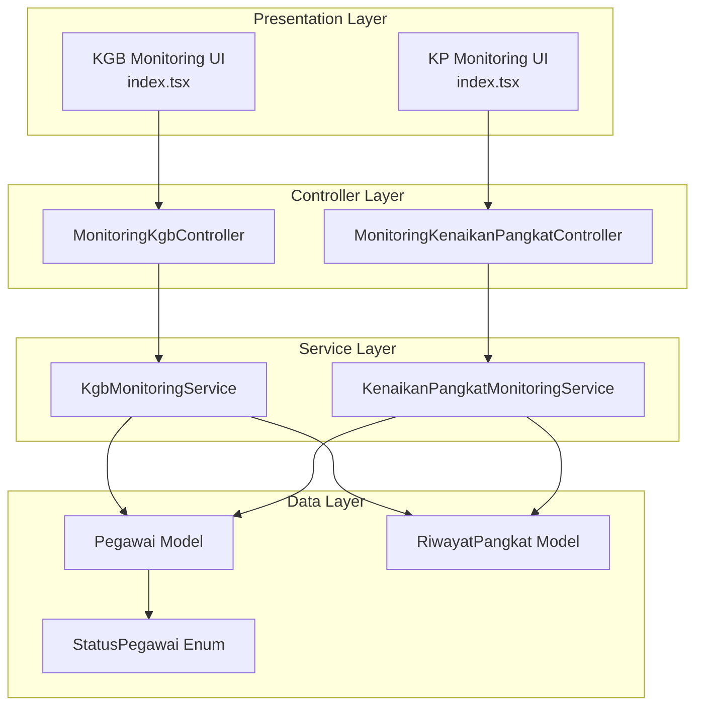
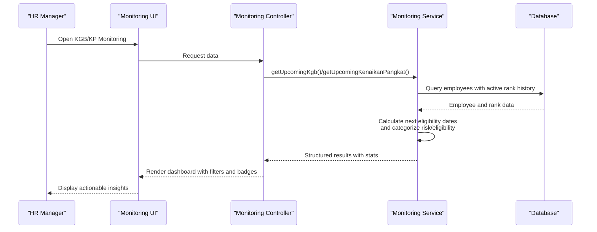
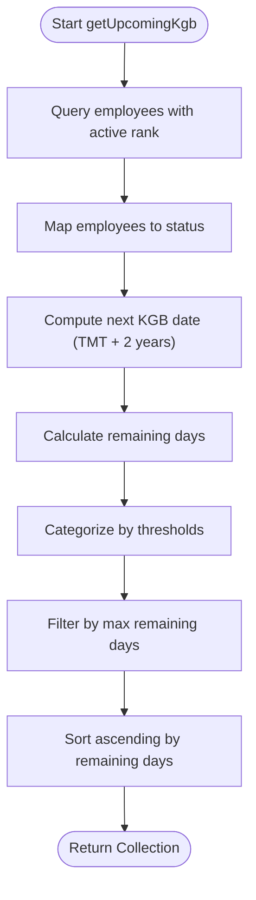
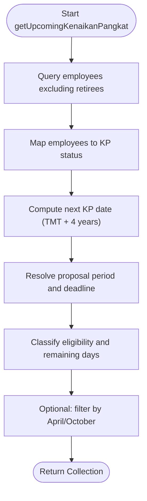
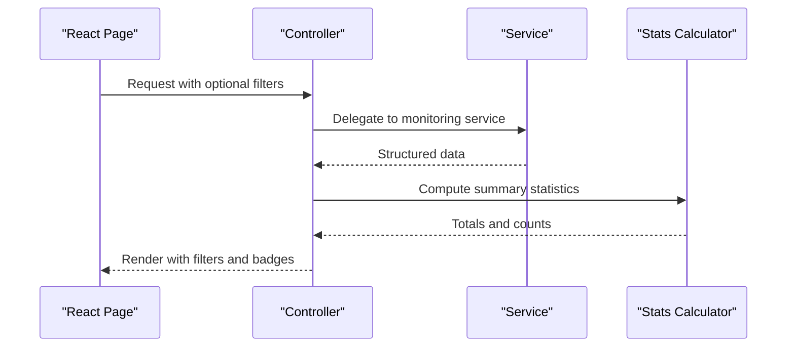
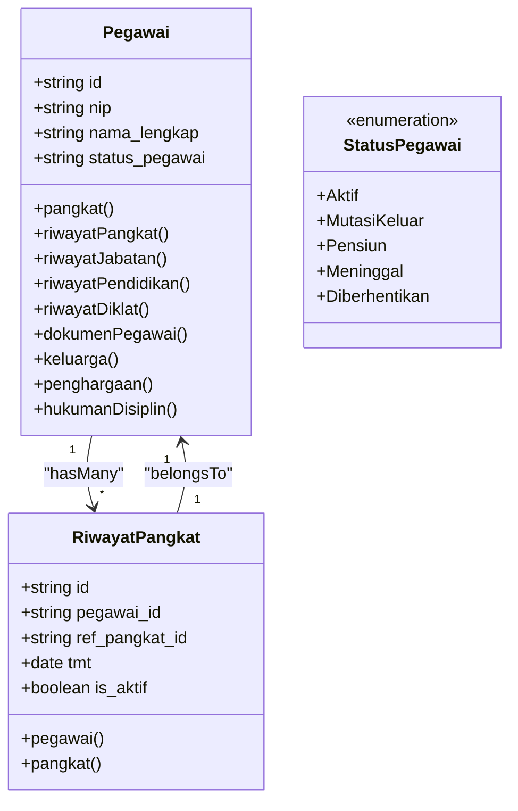
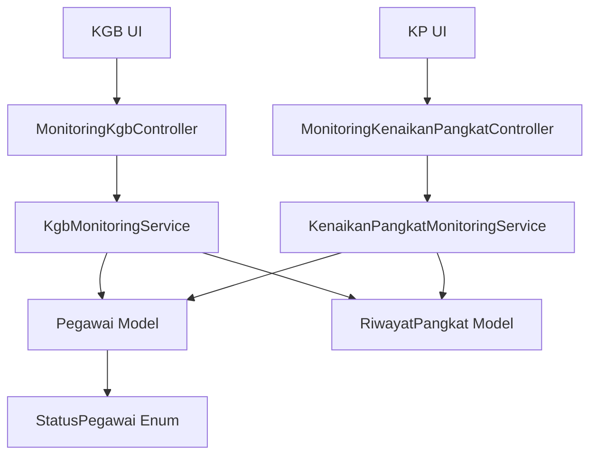

# Monitoring and Analytics System

<cite>
**Referenced Files in This Document**
- [KgbMonitoringService.php](file://app/Services/KgbMonitoringService.php)
- [KenaikanPangkatMonitoringService.php](file://app/Services/KenaikanPangkatMonitoringService.php)
- [MonitoringKgbController.php](file://app/Http/Controllers/Monitoring/MonitoringKgbController.php)
- [MonitoringKenaikanPangkatController.php](file://app/Http/Controllers/Monitoring/MonitoringKenaikanPangkatController.php)
- [Pegawai.php](file://app/Models/Pegawai.php)
- [RiwayatPangkat.php](file://app/Models/RiwayatPangkat.php)
- [StatusPegawai.php](file://app/Enums/StatusPegawai.php)
- [2026_03_15_031012_create_riwayat_pangkat_table.php](file://database/migrations/2026_03_15_031012_create_riwayat_pangkat_table.php)
- [2026_03_15_024651_create_pegawai_table.php](file://database/migrations/2026_03_15_024651_create_pegawai_table.php)
- [index.tsx (KGB Monitoring)](file://resources/js/pages/kepegawaian/monitoring/kgb/index.tsx)
- [index.tsx (Kenaikan Pangkat Monitoring)](file://resources/js/pages/kepegawaian/monitoring/kenaikan-pangkat/index.tsx)
- [KgbMonitoringTest.php](file://tests/Feature/Monitoring/KgbMonitoringTest.php)
- [KenaikanPangkatMonitoringTest.php](file://tests/Feature/Monitoring/KenaikanPangkatMonitoringTest.php)
</cite>

## Table of Contents
1. [Introduction](#introduction)
2. [Project Structure](#project-structure)
3. [Core Components](#core-components)
4. [Architecture Overview](#architecture-overview)
5. [Detailed Component Analysis](#detailed-component-analysis)
6. [Dependency Analysis](#dependency-analysis)
7. [Performance Considerations](#performance-considerations)
8. [Troubleshooting Guide](#troubleshooting-guide)
9. [Conclusion](#conclusion)

## Introduction
This Monitoring and Analytics System automates eligibility tracking for two critical civil servant progression processes:
- KGB (Kenaikan Gaji Berkala): Annual salary increases governed by a 2-year cycle from the most recent active rank appointment.
- KP (Kenaikan Pangkat): Regular rank promotions governed by a 4-year cycle from the current active rank, with defined proposal periods aligned to April and October cycles.

The system provides:
- Automated calculation of next eligibility dates based on employee data
- Real-time dashboards with risk-based categorization
- Role-based access ensuring appropriate visibility and permissions
- Seamless integration with the employee data model and reference tables

Purpose of systematic monitoring:
- Prevent missed eligibility deadlines
- Enable proactive planning for administrative workflows
- Reduce manual effort in tracking progression timelines
- Support informed decision-making for promotions and salary adjustments

## Project Structure
The monitoring system follows a layered architecture:
- Data Layer: Employee and rank history models with reference relationships
- Service Layer: Business logic for eligibility calculations
- Presentation Layer: Inertia-powered React pages with filtering and status categorization
- Controller Layer: API endpoints bridging services and UI

**Diagram sources**
- [MonitoringKgbController.php:1-32](file://app/Http/Controllers/Monitoring/MonitoringKgbController.php#L1-L32)
- [MonitoringKenaikanPangkatController.php:1-32](file://app/Http/Controllers/Monitoring/MonitoringKenaikanPangkatController.php#L1-L32)
- [KgbMonitoringService.php:12-100](file://app/Services/KgbMonitoringService.php#L12-L100)
- [KenaikanPangkatMonitoringService.php:11-122](file://app/Services/KenaikanPangkatMonitoringService.php#L11-L122)
- [Pegawai.php:24-209](file://app/Models/Pegawai.php#L24-L209)
- [RiwayatPangkat.php:11-59](file://app/Models/RiwayatPangkat.php#L11-L59)
- [StatusPegawai.php:5-24](file://app/Enums/StatusPegawai.php#L5-L24)

**Section sources**
- [MonitoringKgbController.php:1-32](file://app/Http/Controllers/Monitoring/MonitoringKgbController.php#L1-L32)
- [MonitoringKenaikanPangkatController.php:1-32](file://app/Http/Controllers/Monitoring/MonitoringKenaikanPangkatController.php#L1-L32)
- [KgbMonitoringService.php:12-100](file://app/Services/KgbMonitoringService.php#L12-L100)
- [KenaikanPangkatMonitoringService.php:11-122](file://app/Services/KenaikanPangkatMonitoringService.php#L11-L122)
- [Pegawai.php:24-209](file://app/Models/Pegawai.php#L24-L209)
- [RiwayatPangkat.php:11-59](file://app/Models/RiwayatPangkat.php#L11-L59)
- [StatusPegawai.php:5-24](file://app/Enums/StatusPegawai.php#L5-L24)

## Core Components
- KGB Monitoring Service: Calculates next KGB date (2-year cycle from active rank TMT), computes remaining days, and categorizes risk status.
- KP Monitoring Service: Calculates next KP date (4-year cycle from active rank TMT), determines proposal period and deadline, and classifies eligibility status.
- Controllers: Bridge services to UI, passing filtered and categorized data with statistics.
- UI Pages: Present lists with filtering, sorting, and status badges; expose KGB/KP stats and eligibility insights.
- Data Models: Employee and rank history models with active rank scoping and reference relationships.

Key implementation highlights:
- Risk categorization thresholds for KGB: "Sudah Jatuh Tempo" (≤0 days), "Segera" (≤60 days), "Mendekati" (≤90 days), "Aman" (>90 days)
- KP eligibility classification: "Sudah Eligible" (current date reached or exceeded), "Mendekati Eligible" (within 6 months), "Belum Eligible" (otherwise)
- Proposal period alignment: KP proposal periods align with April and October cycles with corresponding deadlines

**Section sources**
- [KgbMonitoringService.php:54-98](file://app/Services/KgbMonitoringService.php#L54-L98)
- [KenaikanPangkatMonitoringService.php:64-95](file://app/Services/KenaikanPangkatMonitoringService.php#L64-L95)
- [index.tsx (KGB Monitoring):22-69](file://resources/js/pages/kepegawaian/monitoring/kgb/index.tsx#L22-L69)
- [index.tsx (Kenaikan Pangkat Monitoring):17-58](file://resources/js/pages/kepegawaian/monitoring/kenaikan-pangkat/index.tsx#L17-L58)

## Architecture Overview
The system integrates seamlessly with the employee data model and employs a service-layer architecture for calculations:

**Diagram sources**
- [MonitoringKgbController.php:16-30](file://app/Http/Controllers/Monitoring/MonitoringKgbController.php#L16-L30)
- [MonitoringKenaikanPangkatController.php:13-30](file://app/Http/Controllers/Monitoring/MonitoringKenaikanPangkatController.php#L13-L30)
- [KgbMonitoringService.php:14-52](file://app/Services/KgbMonitoringService.php#L14-L52)
- [KenaikanPangkatMonitoringService.php:13-62](file://app/Services/KenaikanPangkatMonitoringService.php#L13-L62)

## Detailed Component Analysis

### KGB Monitoring Service
Responsibilities:
- Retrieve employees with active rank history
- Compute next KGB date as TMT of active rank plus 2 years
- Calculate remaining days and categorize risk status
- Filter upcoming KGB events within a configurable month window

Implementation patterns:
- Uses Eloquent relationships to access active rank history
- Applies Carbon-based date arithmetic for precise calculations
- Returns structured arrays consumable by controllers and UI

**Diagram sources**
- [KgbMonitoringService.php:14-52](file://app/Services/KgbMonitoringService.php#L14-L52)
- [KgbMonitoringService.php:54-70](file://app/Services/KgbMonitoringService.php#L54-L70)

**Section sources**
- [KgbMonitoringService.php:14-100](file://app/Services/KgbMonitoringService.php#L14-L100)
- [index.tsx (KGB Monitoring):87-249](file://resources/js/pages/kepegawaian/monitoring/kgb/index.tsx#L87-L249)
- [KgbMonitoringTest.php:28-92](file://tests/Feature/Monitoring/KgbMonitoringTest.php#L28-L92)

### KP Monitoring Service
Responsibilities:
- Determine next KP date as TMT of active rank plus 4 years
- Resolve proposal period (April/October) and deadline based on next KP date
- Classify eligibility status and compute remaining days until deadline
- Support filtering by proposal period

**Diagram sources**
- [KenaikanPangkatMonitoringService.php:13-62](file://app/Services/KenaikanPangkatMonitoringService.php#L13-L62)
- [KenaikanPangkatMonitoringService.php:64-120](file://app/Services/KenaikanPangkatMonitoringService.php#L64-L120)

**Section sources**
- [KenaikanPangkatMonitoringService.php:11-122](file://app/Services/KenaikanPangkatMonitoringService.php#L11-L122)
- [index.tsx (Kenaikan Pangkat Monitoring):72-306](file://resources/js/pages/kepegawaian/monitoring/kenaikan-pangkat/index.tsx#L72-L306)
- [KenaikanPangkatMonitoringTest.php:35-103](file://tests/Feature/Monitoring/KenaikanPangkatMonitoringTest.php#L35-L103)

### Controllers and UI Integration
Controllers:
- KGB Controller: Builds KGB stats and passes employee list with status categories to the UI
- KP Controller: Supports period filtering and passes KP stats to the UI

UI Pages:
- KGB page: Displays risk-based status badges, filtering by status, and sorting by urgency
- KP page: Shows eligibility status, proposal period, and deadline with filtering by period and status

**Diagram sources**
- [MonitoringKgbController.php:16-30](file://app/Http/Controllers/Monitoring/MonitoringKgbController.php#L16-L30)
- [MonitoringKenaikanPangkatController.php:13-30](file://app/Http/Controllers/Monitoring/MonitoringKenaikanPangkatController.php#L13-L30)
- [index.tsx (KGB Monitoring):87-249](file://resources/js/pages/kepegawaian/monitoring/kgb/index.tsx#L87-L249)
- [index.tsx (Kenaikan Pangkat Monitoring):72-306](file://resources/js/pages/kepegawaian/monitoring/kenaikan-pangkat/index.tsx#L72-L306)

**Section sources**
- [MonitoringKgbController.php:1-32](file://app/Http/Controllers/Monitoring/MonitoringKgbController.php#L1-L32)
- [MonitoringKenaikanPangkatController.php:1-32](file://app/Http/Controllers/Monitoring/MonitoringKenaikanPangkatController.php#L1-L32)
- [index.tsx (KGB Monitoring):87-249](file://resources/js/pages/kepegawaian/monitoring/kgb/index.tsx#L87-L249)
- [index.tsx (Kenaikan Pangkat Monitoring):72-306](file://resources/js/pages/kepegawaian/monitoring/kenaikan-pangkat/index.tsx#L72-L306)

### Data Models and Relationships
Employee model:
- Defines relationships to rank, position, and unit
- Provides scopes for active employment and filtering
- Includes accessor for formatted rank name

Rank history model:
- Tracks rank appointments with TMT and active flag
- Supports scoping for active records
- Links to reference rank definitions

**Diagram sources**
- [Pegawai.php:24-209](file://app/Models/Pegawai.php#L24-L209)
- [RiwayatPangkat.php:11-59](file://app/Models/RiwayatPangkat.php#L11-L59)
- [StatusPegawai.php:5-24](file://app/Enums/StatusPegawai.php#L5-L24)

**Section sources**
- [Pegawai.php:69-137](file://app/Models/Pegawai.php#L69-L137)
- [RiwayatPangkat.php:44-57](file://app/Models/RiwayatPangkat.php#L44-L57)
- [2026_03_15_024651_create_pegawai_table.php:14-48](file://database/migrations/2026_03_15_024651_create_pegawai_table.php#L14-L48)
- [2026_03_15_031012_create_riwayat_pangkat_table.php:14-29](file://database/migrations/2026_03_15_031012_create_riwayat_pangkat_table.php#L14-L29)

## Dependency Analysis
The system exhibits low coupling and high cohesion:
- Services depend on models and enums, not on controllers
- Controllers depend on services, not on models directly
- UI pages depend on controller-provided props and routing

**Diagram sources**
- [MonitoringKgbController.php:10-14](file://app/Http/Controllers/Monitoring/MonitoringKgbController.php#L10-L14)
- [MonitoringKenaikanPangkatController.php:11-13](file://app/Http/Controllers/Monitoring/MonitoringKenaikanPangkatController.php#L11-L13)
- [KgbMonitoringService.php:12-12](file://app/Services/KgbMonitoringService.php#L12-L12)
- [KenaikanPangkatMonitoringService.php:11-11](file://app/Services/KenaikanPangkatMonitoringService.php#L11-L11)
- [Pegawai.php:24-24](file://app/Models/Pegawai.php#L24-L24)
- [RiwayatPangkat.php:11-11](file://app/Models/RiwayatPangkat.php#L11-L11)
- [StatusPegawai.php:5-5](file://app/Enums/StatusPegawai.php#L5-L5)

**Section sources**
- [KgbMonitoringService.php:12-100](file://app/Services/KgbMonitoringService.php#L12-L100)
- [KenaikanPangkatMonitoringService.php:11-122](file://app/Services/KenaikanPangkatMonitoringService.php#L11-L122)
- [MonitoringKgbController.php:10-30](file://app/Http/Controllers/Monitoring/MonitoringKgbController.php#L10-L30)
- [MonitoringKenaikanPangkatController.php:11-30](file://app/Http/Controllers/Monitoring/MonitoringKenaikanPangkatController.php#L11-L30)

## Performance Considerations
- Query efficiency: Services use eager loading for related rank history and filter by active status to minimize N+1 queries.
- Date calculations: Carbon operations are lightweight and executed in-memory after fetching relevant records.
- UI responsiveness: Filtering and sorting are client-side in React pages, reducing server round trips.
- Scalability: Current implementation targets small to medium datasets; for larger deployments, consider:
  - Database indexing on frequently filtered columns (e.g., status_pegawai, is_aktif)
  - Pagination for monitoring lists
  - Caching of computed eligibility windows for frequently accessed periods

[No sources needed since this section provides general guidance]

## Troubleshooting Guide
Common issues and resolutions:
- Missing active rank history: Services skip employees without an active rank appointment; ensure rank history is properly maintained.
- Incorrect status categorization: Verify date thresholds and ensure current date is correctly set during testing.
- Excluded employees: Pensions and retirees are intentionally excluded from KP monitoring; confirm status values in the employee records.
- UI filters not applying: Confirm URL query parameters and client-side filtering logic in React pages.

Validation and testing:
- KGB service tests validate next KGB date computation, remaining days, and status categorization.
- KP service tests validate proposal period resolution, deadline calculation, and filtering by period.

**Section sources**
- [KgbMonitoringTest.php:43-92](file://tests/Feature/Monitoring/KgbMonitoringTest.php#L43-L92)
- [KenaikanPangkatMonitoringTest.php:62-103](file://tests/Feature/Monitoring/KenaikanPangkatMonitoringTest.php#L62-L103)

## Conclusion
The Monitoring and Analytics System delivers robust automation for KGB and KP eligibility tracking by combining precise date calculations, risk-based categorization, and intuitive dashboards. Its modular architecture ensures maintainability, while integration with the employee data model guarantees accuracy and reliability. The system supports proactive workforce planning and reduces administrative overhead, enabling HR managers to focus on strategic initiatives rather than routine tracking.