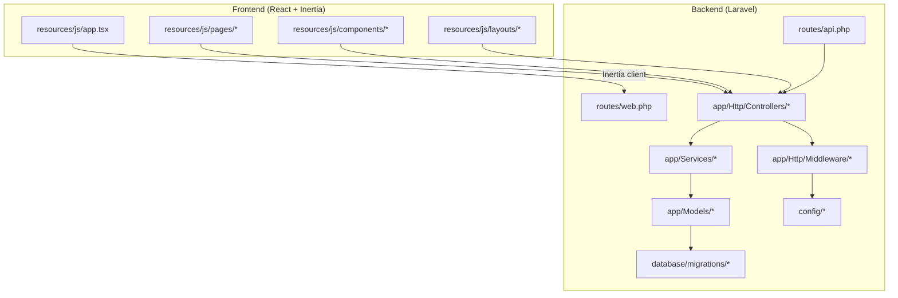
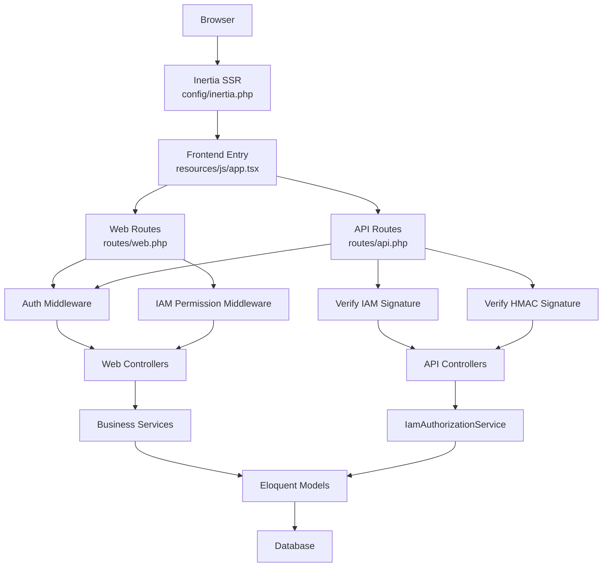
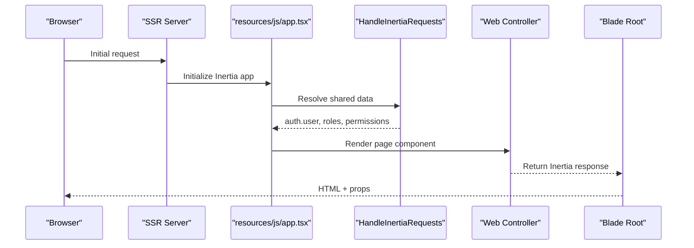
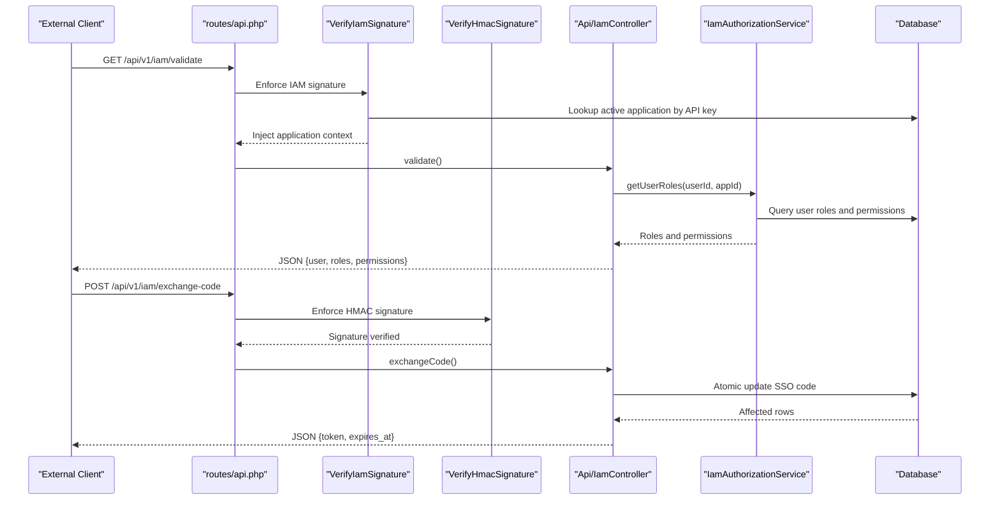
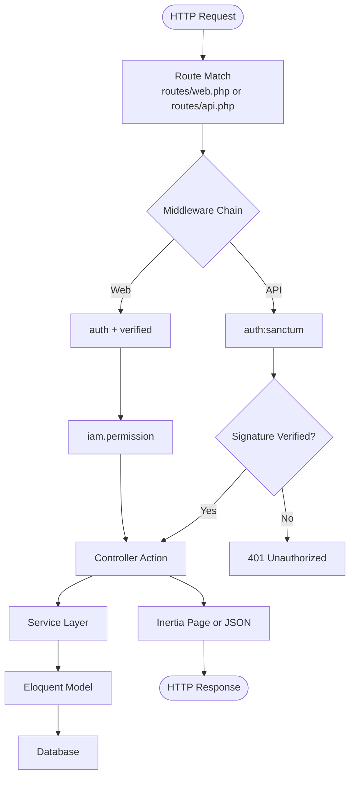
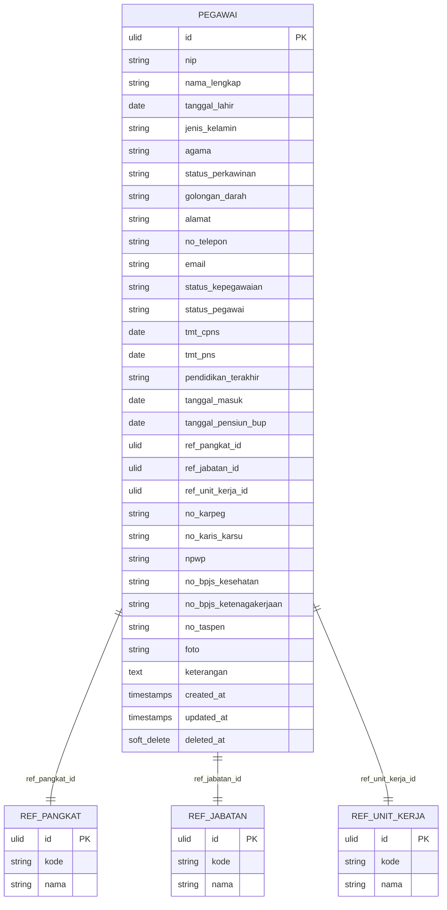
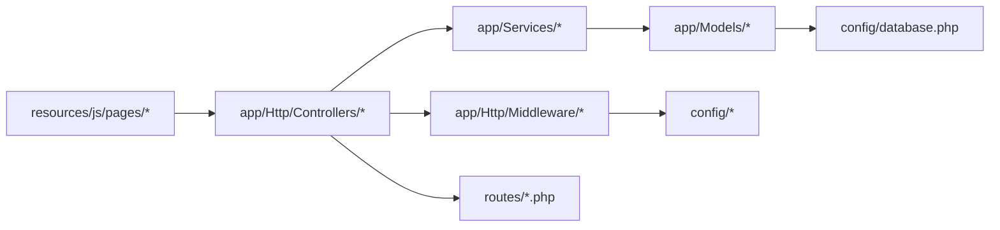

# Architecture Overview

<cite>
**Referenced Files in This Document**
- [HandleInertiaRequests.php](file://app/Http/Middleware/HandleInertiaRequests.php)
- [inertia.php](file://config/inertia.php)
- [app.tsx](file://resources/js/app.tsx)
- [web.php](file://routes/web.php)
- [api.php](file://routes/api.php)
- [IamAuthorizationService.php](file://app/Services/IamAuthorizationService.php)
- [VerifyIamSignature.php](file://app/Http/Middleware/VerifyIamSignature.php)
- [VerifyHmacSignature.php](file://app/Http/Middleware/VerifyHmacSignature.php)
- [IamController.php](file://app/Http/Controllers/Api/IamController.php)
- [iam.php](file://config/iam.php)
- [Controller.php](file://app/Http/Controllers/Controller.php)
- [Pegawai.php](file://app/Models/Pegawai.php)
- [2026_03_15_024651_create_pegawai_table.php](file://database/migrations/2026_03_15_024651_create_pegawai_table.php)
- [RiwayatJabatanService.php](file://app/Services/RiwayatJabatanService.php)
- [database.php](file://config/database.php)
</cite>

## Table of Contents
1. [Introduction](#introduction)
2. [Project Structure](#project-structure)
3. [Core Components](#core-components)
4. [Architecture Overview](#architecture-overview)
5. [Detailed Component Analysis](#detailed-component-analysis)
6. [Dependency Analysis](#dependency-analysis)
7. [Performance Considerations](#performance-considerations)
8. [Troubleshooting Guide](#troubleshooting-guide)
9. [Conclusion](#conclusion)

## Introduction
This document presents the architecture overview of the Kepegawaian application, a hybrid system combining a Laravel backend with a React frontend powered by Inertia.js. The backend follows an MVC-style organization with clear separation of concerns: controllers handle HTTP requests, services encapsulate business logic, models represent domain entities, and middleware enforces cross-cutting concerns such as authentication, authorization, and request integrity. The frontend is a single-page React application that communicates with the backend via Inertia page components and RESTful APIs. The system integrates Identity and Access Management (IAM) with a layered security model, robust data persistence strategies, and scalable deployment-ready configurations.

## Project Structure
The project is organized around feature-based modules and technology boundaries:
- Backend (Laravel):
  - Controllers under app/Http/Controllers
  - Services under app/Services
  - Models under app/Models
  - Middleware under app/Http/Middleware
  - Routes under routes/
  - Configuration under config/
  - Database migrations and seeders under database/
- Frontend (React + Inertia):
  - Pages under resources/js/pages
  - Shared components under resources/js/components
  - Layouts under resources/js/layouts
  - Global types and utilities under resources/js/types and resources/js/lib
  - Application entrypoint under resources/js/app.tsx
- Public assets and views under public/ and resources/views/

**Diagram sources**
- [web.php:1-139](file://routes/web.php#L1-L139)
- [api.php:1-48](file://routes/api.php#L1-L48)
- [app.tsx:1-36](file://resources/js/app.tsx#L1-L36)

**Section sources**
- [web.php:1-139](file://routes/web.php#L1-L139)
- [api.php:1-48](file://routes/api.php#L1-L48)
- [app.tsx:1-36](file://resources/js/app.tsx#L1-L36)

## Core Components
- Hybrid Frontend-Backend Integration:
  - Inertia.js bridges Laravel Blade templates and React pages, enabling server-rendered initial loads and client-side navigation.
  - The frontend entrypoint initializes Inertia and mounts React components.
- MVC and Service Layer:
  - Controllers orchestrate requests and responses.
  - Services encapsulate business logic and coordinate model operations.
  - Models define entity schemas, relationships, and scopes.
- IAM Security:
  - Multi-layered API security using Sanctum tokens, HMAC signatures, and rate limiting.
  - IAM endpoints support validation, permission checks, logout, and SSO code exchange with scoped tokens.
- Data Persistence:
  - Eloquent models with soft deletes, enums, and relations.
  - Migrations define primary and foreign keys, unique constraints, and indexes.
- Routing and Authorization:
  - Route groups enforce authentication, email verification, and IAM permission middleware.
  - IAM permission middleware validates permissions for protected routes.

**Section sources**
- [HandleInertiaRequests.php:1-45](file://app/Http/Middleware/HandleInertiaRequests.php#L1-L45)
- [inertia.php:1-56](file://config/inertia.php#L1-L56)
- [app.tsx:1-36](file://resources/js/app.tsx#L1-L36)
- [web.php:1-139](file://routes/web.php#L1-L139)
- [api.php:1-48](file://routes/api.php#L1-L48)
- [IamAuthorizationService.php:1-45](file://app/Services/IamAuthorizationService.php#L1-L45)
- [VerifyIamSignature.php:1-61](file://app/Http/Middleware/VerifyIamSignature.php#L1-L61)
- [VerifyHmacSignature.php:1-65](file://app/Http/Middleware/VerifyHmacSignature.php#L1-L65)
- [IamController.php:1-91](file://app/Http/Controllers/Api/IamController.php#L1-L91)
- [Pegawai.php:1-209](file://app/Models/Pegawai.php#L1-L209)
- [2026_03_15_024651_create_pegawai_table.php:1-59](file://database/migrations/2026_03_15_024651_create_pegawai_table.php#L1-L59)
- [RiwayatJabatanService.php:1-50](file://app/Services/RiwayatJabatanService.php#L1-L50)
- [database.php:1-185](file://config/database.php#L1-L185)

## Architecture Overview
The system employs a hybrid MVC architecture:
- Controllers receive HTTP requests and delegate to services for business logic.
- Services manage transactions, synchronization, and cross-entity updates.
- Models encapsulate persistence, casting, and relationships.
- Middleware enforces authentication, authorization, and integrity checks.
- Frontend components render UI and communicate with backend via Inertia and REST.

**Diagram sources**
- [inertia.php:1-56](file://config/inertia.php#L1-L56)
- [app.tsx:1-36](file://resources/js/app.tsx#L1-L36)
- [web.php:1-139](file://routes/web.php#L1-L139)
- [api.php:1-48](file://routes/api.php#L1-L48)
- [VerifyIamSignature.php:1-61](file://app/Http/Middleware/VerifyIamSignature.php#L1-L61)
- [VerifyHmacSignature.php:1-65](file://app/Http/Middleware/VerifyHmacSignature.php#L1-L65)
- [IamAuthorizationService.php:1-45](file://app/Services/IamAuthorizationService.php#L1-L45)
- [IamController.php:1-91](file://app/Http/Controllers/Api/IamController.php#L1-L91)
- [Pegawai.php:1-209](file://app/Models/Pegawai.php#L1-L209)

## Detailed Component Analysis

### Frontend Integration with Inertia.js
- The frontend initializes Inertia, resolves page components, and renders React applications with SSR support.
- The middleware shares authenticated user data, roles, permissions, and UI preferences with the frontend.

**Diagram sources**
- [app.tsx:1-36](file://resources/js/app.tsx#L1-L36)
- [HandleInertiaRequests.php:1-45](file://app/Http/Middleware/HandleInertiaRequests.php#L1-L45)

**Section sources**
- [app.tsx:1-36](file://resources/js/app.tsx#L1-L36)
- [HandleInertiaRequests.php:1-45](file://app/Http/Middleware/HandleInertiaRequests.php#L1-L45)
- [inertia.php:1-56](file://config/inertia.php#L1-L56)

### IAM Security Architecture and Authentication Flows
- Multi-layer API security:
  - Transport: HTTPS
  - Authentication: Sanctum personal access tokens
  - Integrity: HMAC-SHA256 signatures with timestamp validation
  - Authorization: IAM permission middleware and scoped tokens
- SSO code exchange:
  - Atomic update of SSO code with validation and expiry checks.
  - Scoped token issuance per application with configurable TTL.

**Diagram sources**
- [api.php:1-48](file://routes/api.php#L1-L48)
- [VerifyIamSignature.php:1-61](file://app/Http/Middleware/VerifyIamSignature.php#L1-L61)
- [VerifyHmacSignature.php:1-65](file://app/Http/Middleware/VerifyHmacSignature.php#L1-L65)
- [IamController.php:1-91](file://app/Http/Controllers/Api/IamController.php#L1-L91)
- [IamAuthorizationService.php:1-45](file://app/Services/IamAuthorizationService.php#L1-L45)

**Section sources**
- [api.php:1-48](file://routes/api.php#L1-L48)
- [VerifyIamSignature.php:1-61](file://app/Http/Middleware/VerifyIamSignature.php#L1-L61)
- [VerifyHmacSignature.php:1-65](file://app/Http/Middleware/VerifyHmacSignature.php#L1-L65)
- [IamController.php:1-91](file://app/Http/Controllers/Api/IamController.php#L1-L91)
- [IamAuthorizationService.php:1-45](file://app/Services/IamAuthorizationService.php#L1-L45)
- [iam.php:1-9](file://config/iam.php#L1-L9)

### Data Flow Between Frontend and Backend
- Web routes:
  - Authenticated and verified routes expose CRUD endpoints for kepegawaian features and monitoring.
  - IAM-managed routes require specific permissions enforced by middleware.
- API routes:
  - Throttled endpoints for employee lookups and IAM operations.
  - Signature verification ensures integrity and prevents replay attacks.

**Diagram sources**
- [web.php:1-139](file://routes/web.php#L1-L139)
- [api.php:1-48](file://routes/api.php#L1-L48)
- [Controller.php:1-11](file://app/Http/Controllers/Controller.php#L1-L11)

**Section sources**
- [web.php:1-139](file://routes/web.php#L1-L139)
- [api.php:1-48](file://routes/api.php#L1-L48)
- [Controller.php:1-11](file://app/Http/Controllers/Controller.php#L1-L11)

### Data Persistence Strategies
- Eloquent models:
  - Strong typing via enum casts and soft deletes.
  - Rich relationships for references, IAM roles, and history records.
- Transactions:
  - Business services wrap critical updates in transactions to maintain consistency.
- Migrations:
  - Primary and foreign keys, unique constraints, and indexes ensure data integrity.

**Diagram sources**
- [Pegawai.php:1-209](file://app/Models/Pegawai.php#L1-L209)
- [2026_03_15_024651_create_pegawai_table.php:1-59](file://database/migrations/2026_03_15_024651_create_pegawai_table.php#L1-L59)

**Section sources**
- [Pegawai.php:1-209](file://app/Models/Pegawai.php#L1-L209)
- [2026_03_15_024651_create_pegawai_table.php:1-59](file://database/migrations/2026_03_15_024651_create_pegawai_table.php#L1-L59)
- [RiwayatJabatanService.php:1-50](file://app/Services/RiwayatJabatanService.php#L1-L50)
- [database.php:1-185](file://config/database.php#L1-L185)

## Dependency Analysis
- Separation of concerns:
  - Controllers depend on services for business logic.
  - Services depend on models for persistence.
  - Middleware depends on configuration and models for enforcement.
- Frontend-backend coupling:
  - Inertia ties frontend pages to backend controllers via route names.
  - API routes rely on middleware for security and rate limiting.
- External integrations:
  - Attendance system integration via HMAC-secured endpoints.
  - IAM gateway via signature verification and scoped tokens.

**Diagram sources**
- [web.php:1-139](file://routes/web.php#L1-L139)
- [api.php:1-48](file://routes/api.php#L1-L48)
- [database.php:1-185](file://config/database.php#L1-L185)

**Section sources**
- [web.php:1-139](file://routes/web.php#L1-L139)
- [api.php:1-48](file://routes/api.php#L1-L48)
- [database.php:1-185](file://config/database.php#L1-L185)

## Performance Considerations
- SSR and caching:
  - Enable and configure SSR for faster initial page loads.
  - Use Redis for caching and session storage to reduce database load.
- Database tuning:
  - Ensure proper indexing on foreign keys and frequently queried columns.
  - Consider read replicas for reporting-heavy endpoints.
- API throttling:
  - Tune throttle limits per endpoint to balance throughput and abuse prevention.
- Frontend optimization:
  - Lazy-load heavy components and split bundles.
  - Minimize unnecessary re-renders by structuring props and state efficiently.

[No sources needed since this section provides general guidance]

## Troubleshooting Guide
- Authentication failures:
  - Verify Sanctum tokens are present and not expired.
  - Confirm IAM signature headers (X-App-Key, X-Timestamp, X-Signature) are correct.
- Permission errors:
  - Ensure IAM permission middleware is applied to protected routes.
  - Check user roles and permissions resolution via the authorization service.
- API integrity issues:
  - Validate HMAC payload construction and secret configuration.
  - Confirm timestamp window and query string sorting.
- Database connectivity:
  - Review database connection settings and credentials.
  - Check migration status and Redis availability.

**Section sources**
- [VerifyIamSignature.php:1-61](file://app/Http/Middleware/VerifyIamSignature.php#L1-L61)
- [VerifyHmacSignature.php:1-65](file://app/Http/Middleware/VerifyHmacSignature.php#L1-L65)
- [IamAuthorizationService.php:1-45](file://app/Services/IamAuthorizationService.php#L1-L45)
- [database.php:1-185](file://config/database.php#L1-L185)

## Conclusion
The Kepegawaian application combines a robust Laravel backend with a modern React frontend through Inertia.js, delivering a cohesive MVC architecture with a dedicated service layer. The IAM security model enforces multi-layered protection for internal and external integrations, while Eloquent models and transactions ensure reliable data persistence. With clear separation of concerns, middleware-driven enforcement, and scalable configuration options, the system supports growth and maintainability across kepegawaian operations.