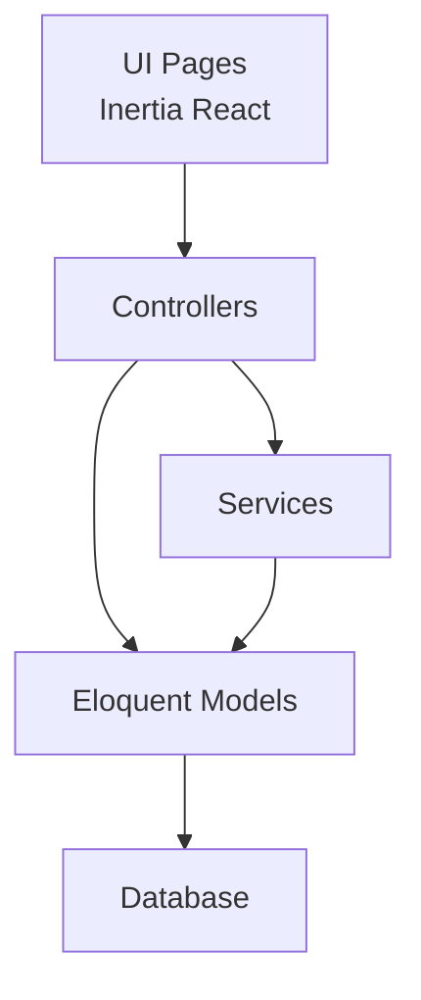
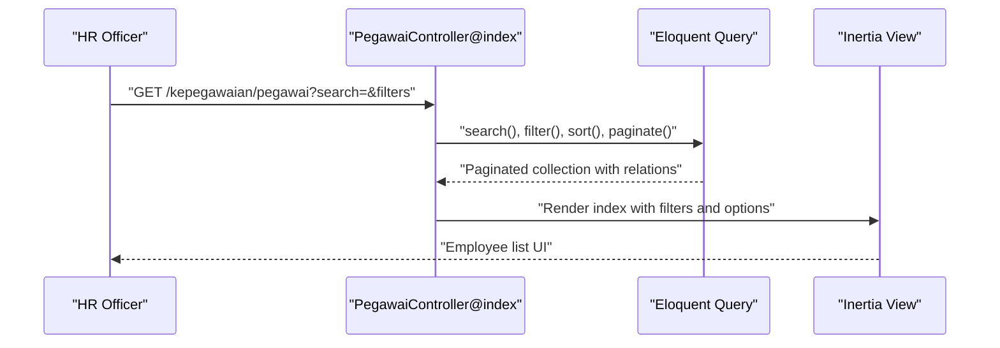
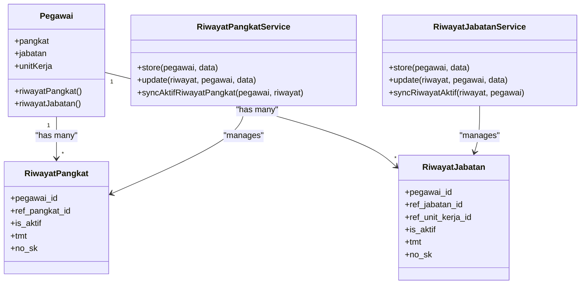
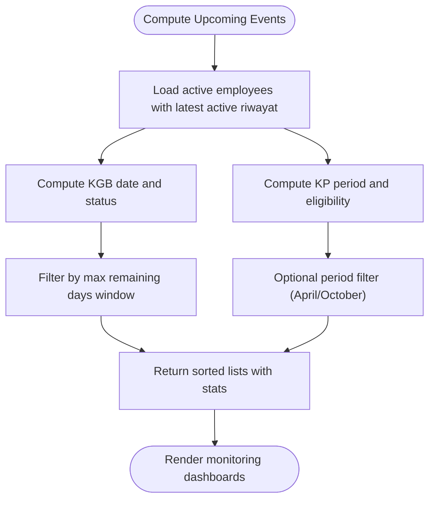
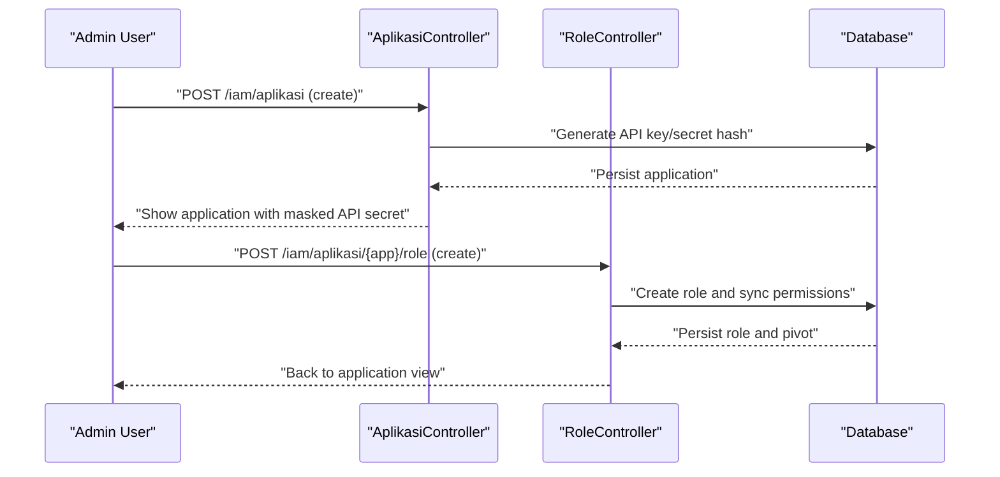
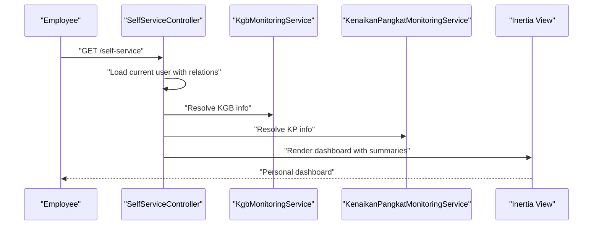
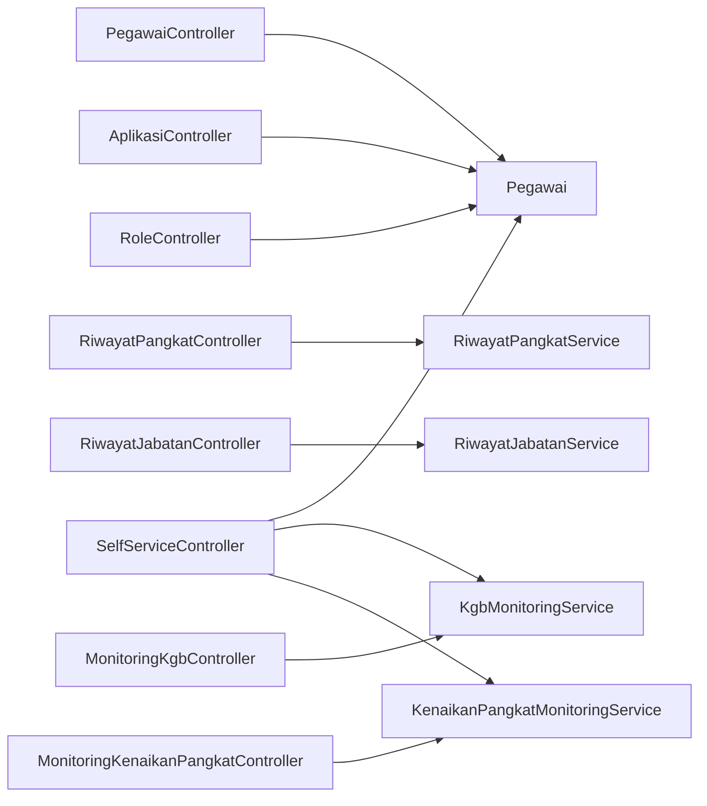

# Key Features

<cite>
**Referenced Files in This Document**
- [PegawaiController.php](file://app/Http/Controllers/Kepegawaian/PegawaiController.php)
- [RiwayatPangkatController.php](file://app/Http/Controllers/Kepegawaian/RiwayatPangkatController.php)
- [RiwayatJabatanController.php](file://app/Http/Controllers/Kepegawaian/RiwayatJabatanController.php)
- [SelfServiceController.php](file://app/Http/Controllers/Kepegawaian/SelfServiceController.php)
- [MonitoringKgbController.php](file://app/Http/Controllers/Monitoring/MonitoringKgbController.php)
- [MonitoringKenaikanPangkatController.php](file://app/Http/Controllers/Monitoring/MonitoringKenaikanPangkatController.php)
- [AplikasiController.php](file://app/Http/Controllers/Iam/AplikasiController.php)
- [RoleController.php](file://app/Http/Controllers/Iam/RoleController.php)
- [RefStatusKepegawaianController.php](file://app/Http/Controllers/Referensi/RefStatusKepegawaianController.php)
- [RefStatusPegawaiController.php](file://app/Http/Controllers/Referensi/RefStatusPegawaiController.php)
- [RiwayatPangkatService.php](file://app/Services/RiwayatPangkatService.php)
- [RiwayatJabatanService.php](file://app/Services/RiwayatJabatanService.php)
- [KgbMonitoringService.php](file://app/Services/KgbMonitoringService.php)
- [KenaikanPangkatMonitoringService.php](file://app/Services/KenaikanPangkatMonitoringService.php)
- [Pegawai.php](file://app/Models/Pegawai.php)
</cite>

## Table of Contents
1. [Introduction](#introduction)
2. [Project Structure](#project-structure)
3. [Core Components](#core-components)
4. [Architecture Overview](#architecture-overview)
5. [Detailed Component Analysis](#detailed-component-analysis)
6. [Dependency Analysis](#dependency-analysis)
7. [Performance Considerations](#performance-considerations)
8. [Troubleshooting Guide](#troubleshooting-guide)
9. [Conclusion](#conclusion)
10. [Appendices](#appendices)

## Introduction
This document presents the key features of Kepegawaian Apps with a focus on core functionality. It covers:
- Employee management: CRUD, search, and filtering
- Career progression tracking: pangkat, jabatan, riwayat
- Monitoring systems: KGB eligibility and KP promotion
- Identity and Access Management (IAM)
- Self-service portal for employees
- Reference data management

Each feature is explained in terms of business value, user workflows, integration points, and stakeholder mapping. Where applicable, we include diagrams and references to source files to ground the content in the actual implementation.

## Project Structure
Kepegawaian Apps is organized around domain-focused controllers and services:
- Kepegawaian domain: employee records, career history, documents, dependents, awards, and sanctions
- Monitoring domain: KGB and KP eligibility dashboards
- IAM domain: applications, roles, permissions, and SSO-related flows
- Referensi domain: reference data for statuses, positions, ranks, units, and documents
- Services encapsulate business logic for career progression and monitoring computations

```mermaid
graph TB
subgraph "Controllers"
PC["Kepegawaian/PegawaiController"]
RP["Kepegawaian/RiwayatPangkatController"]
RJ["Kepegawaian/RiwayatJabatanController"]
SS["Kepegawaian/SelfServiceController"]
MK["Monitoring/MonitoringKgbController"]
MKP["Monitoring/MonitoringKenaikanPangkatController"]
AC["Iam/AplikasiController"]
RC["Iam/RoleController"]
RSK["Referensi/RefStatusKepegawaianController"]
RSP["Referensi/RefStatusPegawaiController"]
end
subgraph "Services"
SRP["RiwayatPangkatService"]
SRJ["RiwayatJabatanService"]
SKG["KgbMonitoringService"]
SKP["KenaikanPangkatMonitoringService"]
end
subgraph "Models"
PM["Pegawai"]
end
PC --> PM
RP --> SRP
RJ --> SRJ
SS --> PM
SS --> SKG
SS --> SKP
MK --> SKG
MKP --> SKP
AC --> PM
RC --> PM
RSK --> PM
RSP --> PM
```

**Diagram sources**
- [PegawaiController.php:25-224](file://app/Http/Controllers/Kepegawaian/PegawaiController.php#L25-L224)
- [RiwayatPangkatController.php:17-118](file://app/Http/Controllers/Kepegawaian/RiwayatPangkatController.php#L17-L118)
- [RiwayatJabatanController.php:18-106](file://app/Http/Controllers/Kepegawaian/RiwayatJabatanController.php#L18-L106)
- [SelfServiceController.php:13-96](file://app/Http/Controllers/Kepegawaian/SelfServiceController.php#L13-L96)
- [MonitoringKgbController.php:10-32](file://app/Http/Controllers/Monitoring/MonitoringKgbController.php#L10-L32)
- [MonitoringKenaikanPangkatController.php:11-32](file://app/Http/Controllers/Monitoring/MonitoringKenaikanPangkatController.php#L11-L32)
- [AplikasiController.php:11-129](file://app/Http/Controllers/Iam/AplikasiController.php#L11-L129)
- [RoleController.php:12-65](file://app/Http/Controllers/Iam/RoleController.php#L12-L65)
- [RefStatusKepegawaianController.php:13-81](file://app/Http/Controllers/Referensi/RefStatusKepegawaianController.php#L13-L81)
- [RefStatusPegawaiController.php:13-69](file://app/Http/Controllers/Referensi/RefStatusPegawaiController.php#L13-L69)
- [RiwayatPangkatService.php:9-55](file://app/Services/RiwayatPangkatService.php#L9-L55)
- [RiwayatJabatanService.php:9-50](file://app/Services/RiwayatJabatanService.php#L9-L50)
- [KgbMonitoringService.php:12-100](file://app/Services/KgbMonitoringService.php#L12-L100)
- [KenaikanPangkatMonitoringService.php:11-122](file://app/Services/KenaikanPangkatMonitoringService.php#L11-L122)
- [Pegawai.php:24-209](file://app/Models/Pegawai.php#L24-L209)

**Section sources**
- [PegawaiController.php:25-224](file://app/Http/Controllers/Kepegawaian/PegawaiController.php#L25-L224)
- [RiwayatPangkatController.php:17-118](file://app/Http/Controllers/Kepegawaian/RiwayatPangkatController.php#L17-L118)
- [RiwayatJabatanController.php:18-106](file://app/Http/Controllers/Kepegawaian/RiwayatJabatanController.php#L18-L106)
- [SelfServiceController.php:13-96](file://app/Http/Controllers/Kepegawaian/SelfServiceController.php#L13-L96)
- [MonitoringKgbController.php:10-32](file://app/Http/Controllers/Monitoring/MonitoringKgbController.php#L10-L32)
- [MonitoringKenaikanPangkatController.php:11-32](file://app/Http/Controllers/Monitoring/MonitoringKenaikanPangkatController.php#L11-L32)
- [AplikasiController.php:11-129](file://app/Http/Controllers/Iam/AplikasiController.php#L11-L129)
- [RoleController.php:12-65](file://app/Http/Controllers/Iam/RoleController.php#L12-L65)
- [RefStatusKepegawaianController.php:13-81](file://app/Http/Controllers/Referensi/RefStatusKepegawaianController.php#L13-L81)
- [RefStatusPegawaiController.php:13-69](file://app/Http/Controllers/Referensi/RefStatusPegawaiController.php#L13-L69)
- [RiwayatPangkatService.php:9-55](file://app/Services/RiwayatPangkatService.php#L9-L55)
- [RiwayatJabatanService.php:9-50](file://app/Services/RiwayatJabatanService.php#L9-L50)
- [KgbMonitoringService.php:12-100](file://app/Services/KgbMonitoringService.php#L12-L100)
- [KenaikanPangkatMonitoringService.php:11-122](file://app/Services/KenaikanPangkatMonitoringService.php#L11-L122)
- [Pegawai.php:24-209](file://app/Models/Pegawai.php#L24-L209)

## Core Components
- Employee Management (CRUD, Search, Filtering)
  - Provides listing, search, filter, sort, create, update, and delete for employee records
  - Integrates with reference data for unit kerja, status pegawai, jabatan, and pangkat
  - Business value: centralized, auditable employee records with structured career history
- Career Progression Tracking (pangkat, jabatan, riwayat)
  - Manages historical records for rank (pangkat) and position (jabatan) transitions
  - Ensures single active record per category per employee
  - Business value: accurate career timelines and automatic updates to current rank/position
- Monitoring Systems (KGB eligibility, KP promotion)
  - Computes upcoming KGB dates and KP promotion periods with eligibility thresholds
  - Business value: proactive planning and reminders for administrative workflows
- Identity and Access Management (IAM)
  - Application registration, role creation, permission assignment, and credential lifecycle
  - Business value: secure, auditable access control across integrated systems
- Self-Service Portal
  - Employees view personal details, current rank/position, and eligibility info
  - Business value: transparency and reduced HR workload for routine queries
- Reference Data Management
  - Maintains lookup tables for statuses, positions, ranks, units, and documents
  - Business value: consistent semantics and controlled vocabularies across the system

**Section sources**
- [PegawaiController.php:25-224](file://app/Http/Controllers/Kepegawaian/PegawaiController.php#L25-L224)
- [RiwayatPangkatController.php:17-118](file://app/Http/Controllers/Kepegawaian/RiwayatPangkatController.php#L17-L118)
- [RiwayatJabatanController.php:18-106](file://app/Http/Controllers/Kepegawaian/RiwayatJabatanController.php#L18-L106)
- [MonitoringKgbController.php:10-32](file://app/Http/Controllers/Monitoring/MonitoringKgbController.php#L10-L32)
- [MonitoringKenaikanPangkatController.php:11-32](file://app/Http/Controllers/Monitoring/MonitoringKenaikanPangkatController.php#L11-L32)
- [AplikasiController.php:11-129](file://app/Http/Controllers/Iam/AplikasiController.php#L11-L129)
- [RoleController.php:12-65](file://app/Http/Controllers/Iam/RoleController.php#L12-L65)
- [SelfServiceController.php:13-96](file://app/Http/Controllers/Kepegawaian/SelfServiceController.php#L13-L96)
- [RefStatusKepegawaianController.php:13-81](file://app/Http/Controllers/Referensi/RefStatusKepegawaianController.php#L13-L81)
- [RefStatusPegawaiController.php:13-69](file://app/Http/Controllers/Referensi/RefStatusPegawaiController.php#L13-L69)

## Architecture Overview
The system follows a layered MVC pattern with dedicated controllers per domain, service classes for business logic, and Eloquent models for persistence. Controllers orchestrate requests, apply authorization gates, delegate to services when needed, and render views via Inertia. Services encapsulate complex computations and maintain data consistency.

**Diagram sources**
- [PegawaiController.php:25-224](file://app/Http/Controllers/Kepegawaian/PegawaiController.php#L25-L224)
- [RiwayatPangkatController.php:17-118](file://app/Http/Controllers/Kepegawaian/RiwayatPangkatController.php#L17-L118)
- [RiwayatJabatanController.php:18-106](file://app/Http/Controllers/Kepegawaian/RiwayatJabatanController.php#L18-L106)
- [SelfServiceController.php:13-96](file://app/Http/Controllers/Kepegawaian/SelfServiceController.php#L13-L96)
- [MonitoringKgbController.php:10-32](file://app/Http/Controllers/Monitoring/MonitoringKgbController.php#L10-L32)
- [MonitoringKenaikanPangkatController.php:11-32](file://app/Http/Controllers/Monitoring/MonitoringKenaikanPangkatController.php#L11-L32)
- [AplikasiController.php:11-129](file://app/Http/Controllers/Iam/AplikasiController.php#L11-L129)
- [RoleController.php:12-65](file://app/Http/Controllers/Iam/RoleController.php#L12-L65)
- [RiwayatPangkatService.php:9-55](file://app/Services/RiwayatPangkatService.php#L9-L55)
- [RiwayatJabatanService.php:9-50](file://app/Services/RiwayatJabatanService.php#L9-L50)
- [KgbMonitoringService.php:12-100](file://app/Services/KgbMonitoringService.php#L12-L100)
- [KenaikanPangkatMonitoringService.php:11-122](file://app/Services/KenaikanPangkatMonitoringService.php#L11-L122)
- [Pegawai.php:24-209](file://app/Models/Pegawai.php#L24-L209)

## Detailed Component Analysis

### Employee Management (CRUD, Search, Filtering)
- Purpose: Manage employee master data with robust search, filtering, and sorting
- Key capabilities:
  - Listing with pagination and query string preservation
  - Search across NIP and full name
  - Filters by unit kerja, status pegawai, jabatan, and pangkat
  - Sorting by name, NIP, pangkat, and jabatan
  - Full CRUD with authorization gates
- Integration points:
  - References: RefUnitKerja, RefStatusPegawai, RefJabatan, RefPangkat
  - Enums for demographic and status fields
  - Authorization via policy gates
- Business value:
  - Efficient HR operations with precise targeting
  - Audit-ready change tracking via model relations and policies

**Diagram sources**
- [PegawaiController.php:30-113](file://app/Http/Controllers/Kepegawaian/PegawaiController.php#L30-L113)

**Section sources**
- [PegawaiController.php:25-224](file://app/Http/Controllers/Kepegawaian/PegawaiController.php#L25-L224)

### Career Progression Tracking (pangkat, jabatan, riwayat)
- Purpose: Maintain accurate career histories and enforce active record rules
- Key capabilities:
  - Riwayat pangkat: create, update, delete with transactional consistency
  - Riwayat jabatan: create, update, delete with transactional consistency
  - Automatic synchronization of active records to current rank/position
- Business logic:
  - Single active record per category per employee
  - Updates propagate to current attributes on the employee record
- Integration points:
  - Services coordinate writes and consistency
  - Models define relations and scopes

**Diagram sources**
- [Pegawai.php:98-137](file://app/Models/Pegawai.php#L98-L137)
- [RiwayatPangkatController.php:17-118](file://app/Http/Controllers/Kepegawaian/RiwayatPangkatController.php#L17-L118)
- [RiwayatJabatanController.php:18-106](file://app/Http/Controllers/Kepegawaian/RiwayatJabatanController.php#L18-L106)
- [RiwayatPangkatService.php:9-55](file://app/Services/RiwayatPangkatService.php#L9-L55)
- [RiwayatJabatanService.php:9-50](file://app/Services/RiwayatJabatanService.php#L9-L50)

**Section sources**
- [RiwayatPangkatController.php:17-118](file://app/Http/Controllers/Kepegawaian/RiwayatPangkatController.php#L17-L118)
- [RiwayatJabatanController.php:18-106](file://app/Http/Controllers/Kepegawaian/RiwayatJabatanController.php#L18-L106)
- [RiwayatPangkatService.php:9-55](file://app/Services/RiwayatPangkatService.php#L9-L55)
- [RiwayatJabatanService.php:9-50](file://app/Services/RiwayatJabatanService.php#L9-L50)
- [Pegawai.php:98-137](file://app/Models/Pegawai.php#L98-L137)

### Monitoring Systems (KGB Eligibility, KP Promotion)
- Purpose: Proactively surface upcoming KGB and KP promotion events
- Key capabilities:
  - KGB monitoring: compute next KGB date, remaining days, and status buckets
  - KP monitoring: compute next KP period, eligibility windows, and status buckets
  - Optional filtering by KP period (April/October cycles)
- Business value:
  - Reduce administrative oversight effort
  - Enable timely preparation for promotions and salary adjustments

**Diagram sources**
- [KgbMonitoringService.php:12-100](file://app/Services/KgbMonitoringService.php#L12-L100)
- [KenaikanPangkatMonitoringService.php:11-122](file://app/Services/KenaikanPangkatMonitoringService.php#L11-L122)
- [MonitoringKgbController.php:10-32](file://app/Http/Controllers/Monitoring/MonitoringKgbController.php#L10-L32)
- [MonitoringKenaikanPangkatController.php:11-32](file://app/Http/Controllers/Monitoring/MonitoringKenaikanPangkatController.php#L11-L32)

**Section sources**
- [MonitoringKgbController.php:10-32](file://app/Http/Controllers/Monitoring/MonitoringKgbController.php#L10-L32)
- [MonitoringKenaikanPangkatController.php:11-32](file://app/Http/Controllers/Monitoring/MonitoringKenaikanPangkatController.php#L11-L32)
- [KgbMonitoringService.php:12-100](file://app/Services/KgbMonitoringService.php#L12-L100)
- [KenaikanPangkatMonitoringService.php:11-122](file://app/Services/KenaikanPangkatMonitoringService.php#L11-L122)

### Identity and Access Management (IAM)
- Purpose: Secure application registration, role management, and permission assignment
- Key capabilities:
  - Application lifecycle: create, show, update, delete, regenerate credentials
  - Role lifecycle: create, update, delete with permission scoping
  - Credential masking for safe display
- Business value:
  - Centralized, auditable access governance
  - Secure integration with external systems via API credentials

**Diagram sources**
- [AplikasiController.php:41-107](file://app/Http/Controllers/Iam/AplikasiController.php#L41-L107)
- [RoleController.php:14-63](file://app/Http/Controllers/Iam/RoleController.php#L14-L63)

**Section sources**
- [AplikasiController.php:11-129](file://app/Http/Controllers/Iam/AplikasiController.php#L11-L129)
- [RoleController.php:12-65](file://app/Http/Controllers/Iam/RoleController.php#L12-L65)

### Self-Service Portal
- Purpose: Allow employees to view personal details and eligibility information
- Key capabilities:
  - Personal dashboard with current rank/position and linked career history
  - Eligibility summaries for KGB and KP
  - Unlinked state handling for users not yet associated with employee records
- Business value:
  - Empowers employees with visibility into their careers
  - Reduces repetitive HR inquiries

**Diagram sources**
- [SelfServiceController.php:13-96](file://app/Http/Controllers/Kepegawaian/SelfServiceController.php#L13-L96)
- [KgbMonitoringService.php:12-100](file://app/Services/KgbMonitoringService.php#L12-L100)
- [KenaikanPangkatMonitoringService.php:11-122](file://app/Services/KenaikanPangkatMonitoringService.php#L11-L122)

**Section sources**
- [SelfServiceController.php:13-96](file://app/Http/Controllers/Kepegawaian/SelfServiceController.php#L13-L96)

### Reference Data Management
- Purpose: Maintain controlled vocabularies for statuses, positions, ranks, units, and documents
- Key capabilities:
  - CRUD for reference entities with search and pagination
  - Consistent enums and references across employee records
- Business value:
  - Ensures data quality and uniformity across the system

**Section sources**
- [RefStatusKepegawaianController.php:13-81](file://app/Http/Controllers/Referensi/RefStatusKepegawaianController.php#L13-L81)
- [RefStatusPegawaiController.php:13-69](file://app/Http/Controllers/Referensi/RefStatusPegawaiController.php#L13-L69)

## Dependency Analysis
- Controllers depend on:
  - Models for persistence and relations
  - Services for complex business logic
  - Authorization gates for policy enforcement
- Services depend on:
  - Models for data access and transactions
  - Enumerations for typed values
- Monitoring services depend on:
  - Employee and career history models
  - Date/time utilities for eligibility calculations

**Diagram sources**
- [PegawaiController.php:25-224](file://app/Http/Controllers/Kepegawaian/PegawaiController.php#L25-L224)
- [RiwayatPangkatController.php:17-118](file://app/Http/Controllers/Kepegawaian/RiwayatPangkatController.php#L17-L118)
- [RiwayatJabatanController.php:18-106](file://app/Http/Controllers/Kepegawaian/RiwayatJabatanController.php#L18-L106)
- [SelfServiceController.php:13-96](file://app/Http/Controllers/Kepegawaian/SelfServiceController.php#L13-L96)
- [MonitoringKgbController.php:10-32](file://app/Http/Controllers/Monitoring/MonitoringKgbController.php#L10-L32)
- [MonitoringKenaikanPangkatController.php:11-32](file://app/Http/Controllers/Monitoring/MonitoringKenaikanPangkatController.php#L11-L32)
- [AplikasiController.php:11-129](file://app/Http/Controllers/Iam/AplikasiController.php#L11-L129)
- [RoleController.php:12-65](file://app/Http/Controllers/Iam/RoleController.php#L12-L65)
- [RiwayatPangkatService.php:9-55](file://app/Services/RiwayatPangkatService.php#L9-L55)
- [RiwayatJabatanService.php:9-50](file://app/Services/RiwayatJabatanService.php#L9-L50)
- [KgbMonitoringService.php:12-100](file://app/Services/KgbMonitoringService.php#L12-L100)
- [KenaikanPangkatMonitoringService.php:11-122](file://app/Services/KenaikanPangkatMonitoringService.php#L11-L122)
- [Pegawai.php:24-209](file://app/Models/Pegawai.php#L24-L209)

**Section sources**
- [PegawaiController.php:25-224](file://app/Http/Controllers/Kepegawaian/PegawaiController.php#L25-L224)
- [RiwayatPangkatController.php:17-118](file://app/Http/Controllers/Kepegawaian/RiwayatPangkatController.php#L17-L118)
- [RiwayatJabatanController.php:18-106](file://app/Http/Controllers/Kepegawaian/RiwayatJabatanController.php#L18-L106)
- [SelfServiceController.php:13-96](file://app/Http/Controllers/Kepegawaian/SelfServiceController.php#L13-L96)
- [MonitoringKgbController.php:10-32](file://app/Http/Controllers/Monitoring/MonitoringKgbController.php#L10-L32)
- [MonitoringKenaikanPangkatController.php:11-32](file://app/Http/Controllers/Monitoring/MonitoringKenaikanPangkatController.php#L11-L32)
- [AplikasiController.php:11-129](file://app/Http/Controllers/Iam/AplikasiController.php#L11-L129)
- [RoleController.php:12-65](file://app/Http/Controllers/Iam/RoleController.php#L12-L65)
- [RiwayatPangkatService.php:9-55](file://app/Services/RiwayatPangkatService.php#L9-L55)
- [RiwayatJabatanService.php:9-50](file://app/Services/RiwayatJabatanService.php#L9-L50)
- [KgbMonitoringService.php:12-100](file://app/Services/KgbMonitoringService.php#L12-L100)
- [KenaikanPangkatMonitoringService.php:11-122](file://app/Services/KenaikanPangkatMonitoringService.php#L11-L122)
- [Pegawai.php:24-209](file://app/Models/Pegawai.php#L24-L209)

## Performance Considerations
- Use eager loading for related data to avoid N+1 queries in listings and detail views
- Apply pagination and query string preservation for large datasets
- Leverage database indexes on frequently filtered fields (e.g., ref_unit_kerja_id, status_pegawai)
- Batch updates for synchronization of active records to minimize redundant writes
- Cache computed eligibility results when appropriate and invalidate on data changes

## Troubleshooting Guide
- Authorization failures:
  - Ensure gates are authorized before performing actions on employee records
  - Verify user roles and permissions via IAM roles and permissions
- Active record conflicts:
  - Confirm that only one riwayat is marked active per category
  - Use provided services to synchronize active records automatically
- Monitoring discrepancies:
  - Validate that employees have active riwayat entries
  - Check eligibility thresholds and KP period alignment
- Self-service access:
  - Confirm user is linked to an employee record
  - Verify permissions for viewing personal data

**Section sources**
- [PegawaiController.php:30-224](file://app/Http/Controllers/Kepegawaian/PegawaiController.php#L30-L224)
- [RiwayatPangkatController.php:87-118](file://app/Http/Controllers/Kepegawaian/RiwayatPangkatController.php#L87-L118)
- [RiwayatJabatanController.php:76-106](file://app/Http/Controllers/Kepegawaian/RiwayatJabatanController.php#L76-L106)
- [RiwayatPangkatService.php:39-55](file://app/Services/RiwayatPangkatService.php#L39-L55)
- [RiwayatJabatanService.php:37-50](file://app/Services/RiwayatJabatanService.php#L37-L50)
- [KgbMonitoringService.php:54-100](file://app/Services/KgbMonitoringService.php#L54-L100)
- [KenaikanPangkatMonitoringService.php:64-122](file://app/Services/KenaikanPangkatMonitoringService.php#L64-L122)
- [SelfServiceController.php:45-96](file://app/Http/Controllers/Kepegawaian/SelfServiceController.php#L45-L96)

## Conclusion
Kepegawaian Apps delivers a cohesive set of features centered on employee lifecycle management, career progression, and operational monitoring. Its modular architecture, strong authorization model, and service-layer logic enable scalable maintenance and future enhancements. The self-service portal and IAM components improve user experience and security posture, while reference data management ensures consistent semantics across the system.

## Appendices

### User Persona Mapping
- Administrators
  - IAM application and role management
  - Reference data administration
  - Monitoring dashboards for oversight
- HR Officers
  - Employee CRUD, search, filtering, and sorting
  - Career progression management (pangkat, jabatan)
  - Self-service data verification and support
- Employees
  - Self-service portal for personal details and eligibility

**Section sources**
- [AplikasiController.php:11-129](file://app/Http/Controllers/Iam/AplikasiController.php#L11-L129)
- [RoleController.php:12-65](file://app/Http/Controllers/Iam/RoleController.php#L12-L65)
- [RefStatusKepegawaianController.php:13-81](file://app/Http/Controllers/Referensi/RefStatusKepegawaianController.php#L13-L81)
- [RefStatusPegawaiController.php:13-69](file://app/Http/Controllers/Referensi/RefStatusPegawaiController.php#L13-L69)
- [PegawaiController.php:25-224](file://app/Http/Controllers/Kepegawaian/PegawaiController.php#L25-L224)
- [RiwayatPangkatController.php:17-118](file://app/Http/Controllers/Kepegawaian/RiwayatPangkatController.php#L17-L118)
- [RiwayatJabatanController.php:18-106](file://app/Http/Controllers/Kepegawaian/RiwayatJabatanController.php#L18-L106)
- [SelfServiceController.php:13-96](file://app/Http/Controllers/Kepegawaian/SelfServiceController.php#L13-L96)