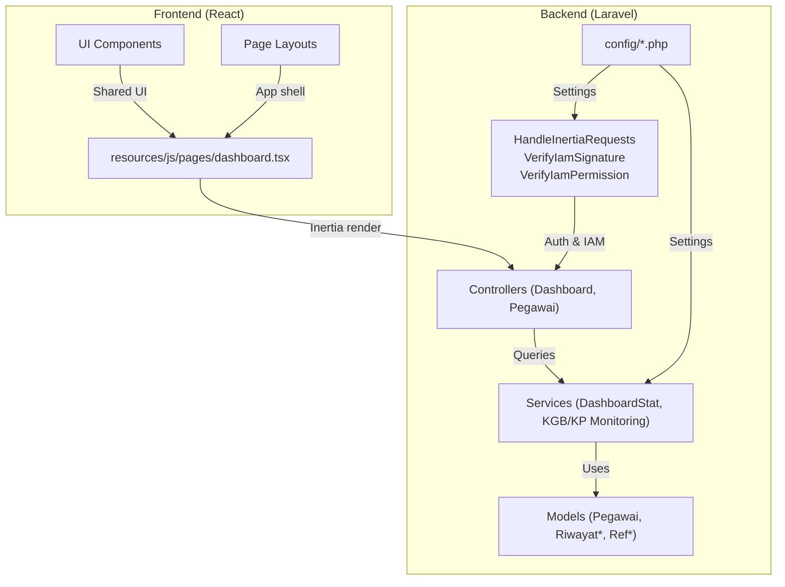
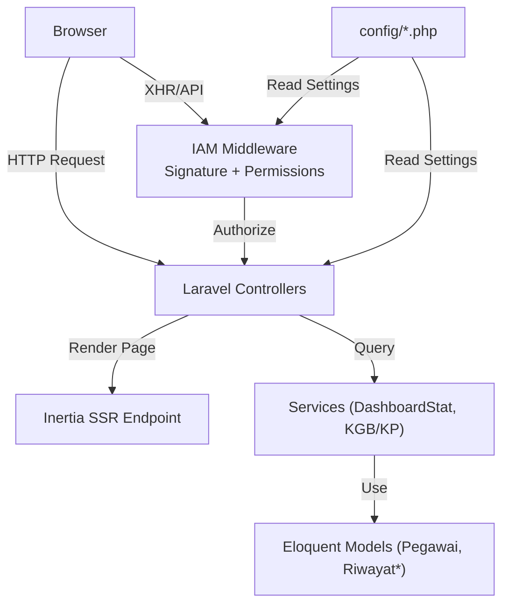
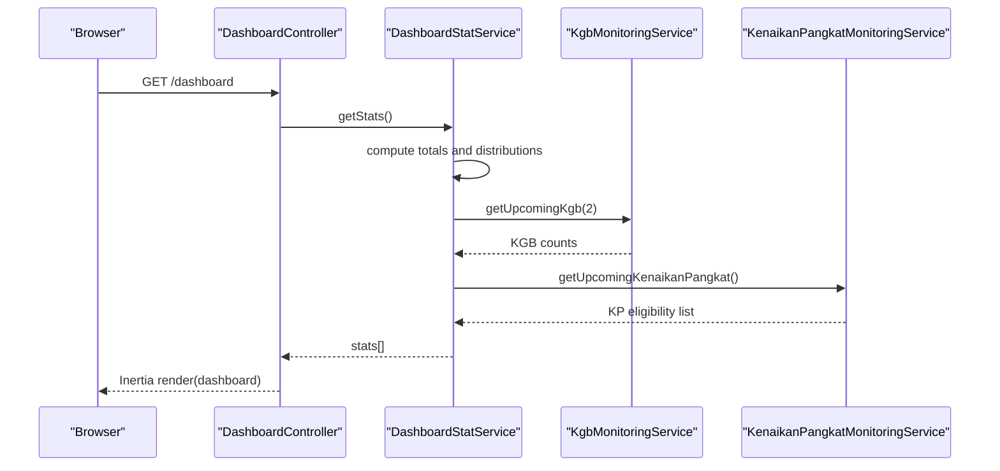
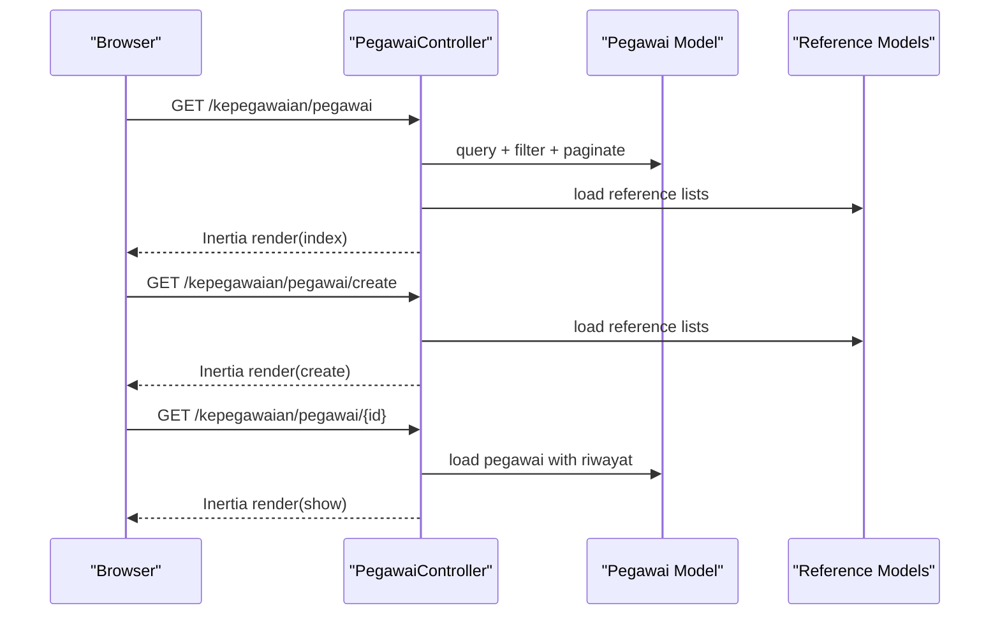
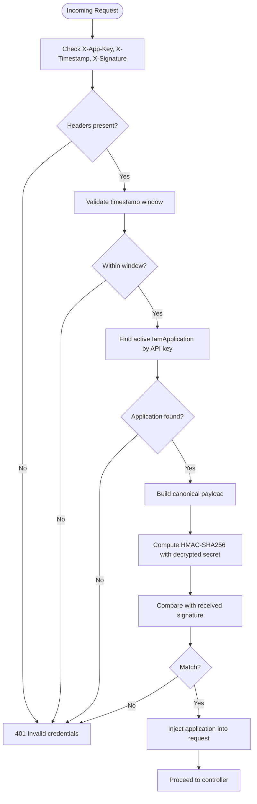
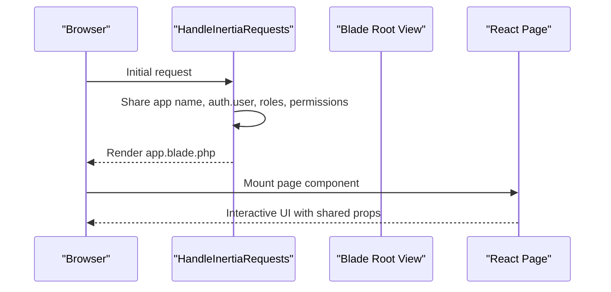
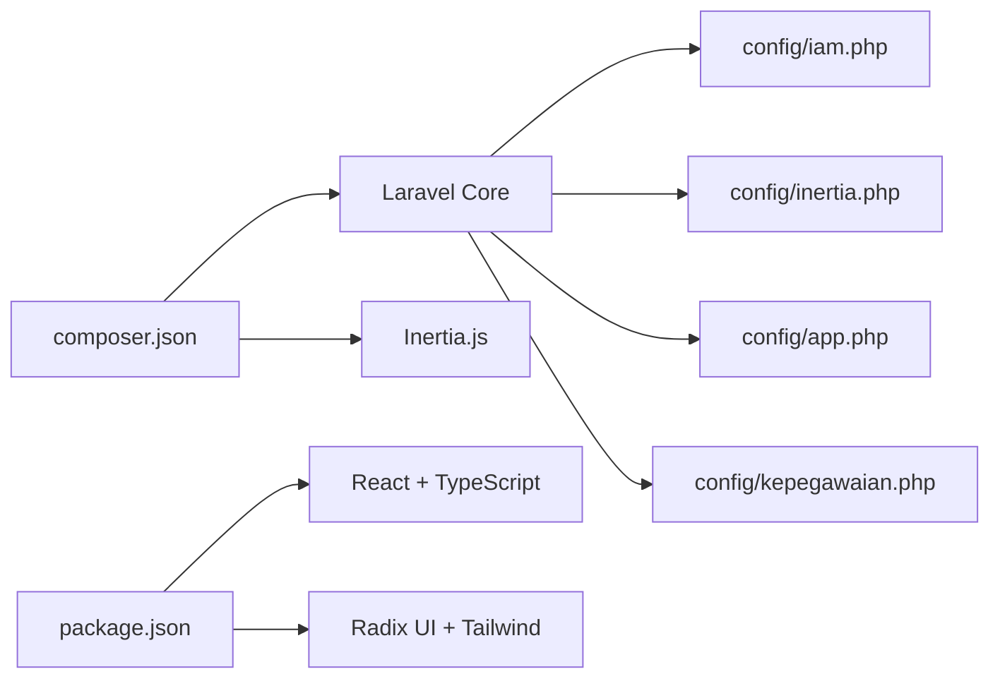

# Project Overview

<cite>
**Referenced Files in This Document**
- [composer.json](file://composer.json)
- [package.json](file://package.json)
- [config/app.php](file://config/app.php)
- [config/inertia.php](file://config/inertia.php)
- [config/iam.php](file://config/iam.php)
- [config/kepegawaian.php](file://config/kepegawaian.php)
- [app/Http/Middleware/HandleInertiaRequests.php](file://app/Http/Middleware/HandleInertiaRequests.php)
- [app/Http/Middleware/VerifyIamSignature.php](file://app/Http/Middleware/VerifyIamSignature.php)
- [app/Http/Middleware/VerifyIamPermission.php](file://app/Http/Middleware/VerifyIamPermission.php)
- [app/Http/Controllers/DashboardController.php](file://app/Http/Controllers/DashboardController.php)
- [app/Http/Controllers/Kepegawaian/PegawaiController.php](file://app/Http/Controllers/Kepegawaian/PegawaiController.php)
- [app/Services/DashboardStatService.php](file://app/Services/DashboardStatService.php)
- [app/Models/Pegawai.php](file://app/Models/Pegawai.php)
- [resources/js/pages/dashboard.tsx](file://resources/js/pages/dashboard.tsx)
</cite>

## Table of Contents
1. [Introduction](#introduction)
2. [Project Structure](#project-structure)
3. [Core Components](#core-components)
4. [Architecture Overview](#architecture-overview)
5. [Detailed Component Analysis](#detailed-component-analysis)
6. [Dependency Analysis](#dependency-analysis)
7. [Performance Considerations](#performance-considerations)
8. [Troubleshooting Guide](#troubleshooting-guide)
9. [Conclusion](#conclusion)

## Introduction
Kepegawaian Apps is an Indonesian government institution Human Resource Information System (HRIS) designed to streamline civil servant lifecycle management. The system supports core HR processes including employee registration (pegawai), career progression tracking (riwayat), and promotion eligibility workflows (kgb/kp). It integrates Laravel as the backend with React/TypeScript as the frontend, powered by Inertia.js for seamless full-stack development. The platform emphasizes identity and access management (IAM) for secure cross-application collaboration and provides robust monitoring capabilities for KGB (promotion eligibility) and Kenaikan Pangkat (promotion) workflows.

Key stakeholder outcomes:
- Administrators gain centralized visibility into workforce demographics, promotions, and upcoming KGB dates.
- Operators efficiently manage employee records, documents, awards, disciplinary actions, and family details.
- Self-service modules enable employees to review personal profiles and linked information.

Technical highlights:
- Full-stack architecture with Laravel backend and React/TypeScript frontend via Inertia.js.
- IAM-based security model with cryptographic signatures and permission verification.
- Monitoring dashboards for KGB and KP eligibility to support policy-driven HR decisions.

## Project Structure
The project follows a layered architecture with clear separation of concerns:
- Backend: Laravel application with controllers, services, models, policies, and middleware.
- Frontend: React/TypeScript pages and components with shared UI primitives and layouts.
- Configuration: Environment-specific settings for application name, IAM tokens, SSR, and external integrations.
- Middleware: Inertia request handling and IAM signature/permission verification.

**Diagram sources**
- [resources/js/pages/dashboard.tsx:1-343](file://resources/js/pages/dashboard.tsx#L1-L343)
- [app/Http/Middleware/HandleInertiaRequests.php:1-45](file://app/Http/Middleware/HandleInertiaRequests.php#L1-L45)
- [app/Http/Middleware/VerifyIamSignature.php:1-61](file://app/Http/Middleware/VerifyIamSignature.php#L1-L61)
- [app/Http/Middleware/VerifyIamPermission.php:1-54](file://app/Http/Middleware/VerifyIamPermission.php#L1-L54)
- [app/Http/Controllers/DashboardController.php:1-19](file://app/Http/Controllers/DashboardController.php#L1-L19)
- [app/Http/Controllers/Kepegawaian/PegawaiController.php:1-224](file://app/Http/Controllers/Kepegawaian/PegawaiController.php#L1-L224)
- [app/Services/DashboardStatService.php:1-148](file://app/Services/DashboardStatService.php#L1-L148)
- [app/Models/Pegawai.php:1-209](file://app/Models/Pegawai.php#L1-L209)
- [config/app.php:1-127](file://config/app.php#L1-L127)
- [config/inertia.php:1-56](file://config/inertia.php#L1-L56)
- [config/iam.php:1-9](file://config/iam.php#L1-L9)
- [config/kepegawaian.php:1-17](file://config/kepegawaian.php#L1-L17)

**Section sources**
- [composer.json:1-116](file://composer.json#L1-L116)
- [package.json:1-77](file://package.json#L1-L77)
- [config/app.php:1-127](file://config/app.php#L1-L127)
- [config/inertia.php:1-56](file://config/inertia.php#L1-L56)
- [config/iam.php:1-9](file://config/iam.php#L1-L9)
- [config/kepegawaian.php:1-17](file://config/kepegawaian.php#L1-L17)

## Core Components
- Application name and environment: The application name is configured to “Kepegawaian,” and environment settings define runtime behavior.
- Inertia.js integration: Handles server-side rendering and shared data between Laravel and React, including user permissions and sidebar state.
- IAM security: Cryptographic signature verification for API clients and permission checks for authorized access.
- Employee lifecycle management: Controllers and services manage pegawai records, riwayat (work history), and related reference data.
- Monitoring: Services compute KGB and KP eligibility metrics for dashboard consumption.

Practical examples:
- Viewing the dashboard displays total active employees, upcoming KGB counts, KP eligible counts, and distribution charts for units, positions, education, and gender.
- Managing pegawai includes listing, filtering, sorting, creating, updating, and viewing detailed profiles with embedded riwayat sections.

**Section sources**
- [config/app.php:16-16](file://config/app.php#L16-L16)
- [config/inertia.php:18-23](file://config/inertia.php#L18-L23)
- [app/Http/Middleware/HandleInertiaRequests.php:17-42](file://app/Http/Middleware/HandleInertiaRequests.php#L17-L42)
- [app/Http/Middleware/VerifyIamSignature.php:15-59](file://app/Http/Middleware/VerifyIamSignature.php#L15-L59)
- [app/Http/Middleware/VerifyIamPermission.php:16-52](file://app/Http/Middleware/VerifyIamPermission.php#L16-L52)
- [app/Http/Controllers/DashboardController.php:12-17](file://app/Http/Controllers/DashboardController.php#L12-L17)
- [app/Services/DashboardStatService.php:16-29](file://app/Services/DashboardStatService.php#L16-L29)
- [app/Http/Controllers/Kepegawaian/PegawaiController.php:30-113](file://app/Http/Controllers/Kepegawaian/PegawaiController.php#L30-L113)
- [resources/js/pages/dashboard.tsx:38-147](file://resources/js/pages/dashboard.tsx#L38-L147)

## Architecture Overview
The system architecture combines Laravel’s MVC with React via Inertia.js, enabling server-rendered pages with client-side interactivity. IAM middleware secures inbound API requests and enforces granular permissions for internal and cross-application access. Monitoring services aggregate HR metrics for KGB and KP eligibility.

**Diagram sources**
- [config/inertia.php:18-23](file://config/inertia.php#L18-L23)
- [app/Http/Middleware/HandleInertiaRequests.php:17-42](file://app/Http/Middleware/HandleInertiaRequests.php#L17-L42)
- [app/Http/Middleware/VerifyIamSignature.php:15-59](file://app/Http/Middleware/VerifyIamSignature.php#L15-L59)
- [app/Http/Middleware/VerifyIamPermission.php:16-52](file://app/Http/Middleware/VerifyIamPermission.php#L16-L52)
- [app/Http/Controllers/DashboardController.php:12-17](file://app/Http/Controllers/DashboardController.php#L12-L17)
- [app/Services/DashboardStatService.php:16-29](file://app/Services/DashboardStatService.php#L16-L29)
- [app/Models/Pegawai.php:24-65](file://app/Models/Pegawai.php#L24-L65)

**Section sources**
- [config/inertia.php:18-23](file://config/inertia.php#L18-L23)
- [app/Http/Middleware/HandleInertiaRequests.php:17-42](file://app/Http/Middleware/HandleInertiaRequests.php#L17-L42)
- [app/Http/Middleware/VerifyIamSignature.php:15-59](file://app/Http/Middleware/VerifyIamSignature.php#L15-L59)
- [app/Http/Middleware/VerifyIamPermission.php:16-52](file://app/Http/Middleware/VerifyIamPermission.php#L16-L52)
- [app/Services/DashboardStatService.php:87-98](file://app/Services/DashboardStatService.php#L87-L98)

## Detailed Component Analysis

### Dashboard and Monitoring
The dashboard aggregates HR metrics and presents them in an intuitive UI. It surfaces counts for upcoming KGB events and KP eligibility, along with distributions across ranks, units, positions, education, and gender.

**Diagram sources**
- [app/Http/Controllers/DashboardController.php:12-17](file://app/Http/Controllers/DashboardController.php#L12-L17)
- [app/Services/DashboardStatService.php:16-29](file://app/Services/DashboardStatService.php#L16-L29)
- [app/Services/DashboardStatService.php:87-98](file://app/Services/DashboardStatService.php#L87-L98)

**Section sources**
- [app/Http/Controllers/DashboardController.php:12-17](file://app/Http/Controllers/DashboardController.php#L12-L17)
- [app/Services/DashboardStatService.php:16-29](file://app/Services/DashboardStatService.php#L16-L29)
- [resources/js/pages/dashboard.tsx:38-147](file://resources/js/pages/dashboard.tsx#L38-L147)

### Employee Management (Pegawai)
The pegawai module manages employee records, including personal data, employment status, rank, position, and unit assignment. It supports listing with filters and sorting, creation, updates, and detailed views enriched with riwayat sections.

**Diagram sources**
- [app/Http/Controllers/Kepegawaian/PegawaiController.php:30-113](file://app/Http/Controllers/Kepegawaian/PegawaiController.php#L30-L113)
- [app/Http/Controllers/Kepegawaian/PegawaiController.php:118-136](file://app/Http/Controllers/Kepegawaian/PegawaiController.php#L118-L136)
- [app/Http/Controllers/Kepegawaian/PegawaiController.php:153-170](file://app/Http/Controllers/Kepegawaian/PegawaiController.php#L153-L170)
- [app/Models/Pegawai.php:99-138](file://app/Models/Pegawai.php#L99-L138)

**Section sources**
- [app/Http/Controllers/Kepegawaian/PegawaiController.php:30-113](file://app/Http/Controllers/Kepegawaian/PegawaiController.php#L30-L113)
- [app/Http/Controllers/Kepegawaian/PegawaiController.php:118-136](file://app/Http/Controllers/Kepegawaian/PegawaiController.php#L118-L136)
- [app/Http/Controllers/Kepegawaian/PegawaiController.php:153-170](file://app/Http/Controllers/Kepegawaian/PegawaiController.php#L153-L170)
- [app/Models/Pegawai.php:99-138](file://app/Models/Pegawai.php#L99-L138)

### IAM Security and Signature Verification
IAM ensures secure communication between applications. The signature middleware validates HMAC-SHA256 signatures, timestamps, and application credentials, while permission middleware verifies user roles and requested permissions against the IAM domain.

**Diagram sources**
- [app/Http/Middleware/VerifyIamSignature.php:15-59](file://app/Http/Middleware/VerifyIamSignature.php#L15-L59)

**Section sources**
- [app/Http/Middleware/VerifyIamSignature.php:15-59](file://app/Http/Middleware/VerifyIamSignature.php#L15-L59)
- [app/Http/Middleware/VerifyIamPermission.php:16-52](file://app/Http/Middleware/VerifyIamPermission.php#L16-L52)
- [config/iam.php:5-8](file://config/iam.php#L5-L8)

### Inertia.js Integration
Inertia.js bridges Laravel and React by sharing authenticated user data, application metadata, and sidebar state. This enables seamless navigation without full page reloads while maintaining server-rendered initial loads.

**Diagram sources**
- [app/Http/Middleware/HandleInertiaRequests.php:17-42](file://app/Http/Middleware/HandleInertiaRequests.php#L17-L42)
- [config/inertia.php:18-23](file://config/inertia.php#L18-L23)

**Section sources**
- [app/Http/Middleware/HandleInertiaRequests.php:17-42](file://app/Http/Middleware/HandleInertiaRequests.php#L17-L42)
- [config/inertia.php:18-23](file://config/inertia.php#L18-L23)

## Dependency Analysis
The system relies on Laravel ecosystem packages and React libraries. Composer and NPM scripts orchestrate setup, development, and build processes. Configuration files define application behavior, SSR settings, IAM token lifetimes, and external integration secrets.

**Diagram sources**
- [composer.json:11-19](file://composer.json#L11-L19)
- [package.json:32-66](file://package.json#L32-L66)
- [config/iam.php:1-9](file://config/iam.php#L1-L9)
- [config/inertia.php:1-56](file://config/inertia.php#L1-L56)
- [config/app.php:1-127](file://config/app.php#L1-L127)
- [config/kepegawaian.php:1-17](file://config/kepegawaian.php#L1-L17)

**Section sources**
- [composer.json:11-19](file://composer.json#L11-L19)
- [package.json:32-66](file://package.json#L32-L66)
- [config/iam.php:1-9](file://config/iam.php#L1-L9)
- [config/inertia.php:1-56](file://config/inertia.php#L1-L56)
- [config/app.php:1-127](file://config/app.php#L1-L127)
- [config/kepegawaian.php:1-17](file://config/kepegawaian.php#L1-L17)

## Performance Considerations
- SSR and caching: Enable and tune SSR for improved initial load performance; leverage caching for IAM application lookups and dashboard aggregations.
- Pagination and filtering: Use server-side pagination and efficient filters to reduce payload sizes for large datasets.
- Asset bundling: Optimize Vite builds and ensure production asset caching.
- Database indexing: Maintain appropriate indices on frequently filtered columns (e.g., ref_* foreign keys, status fields).

## Troubleshooting Guide
Common issues and resolutions:
- Authentication failures: Verify IAM signature headers, timestamp windows, and application credentials; check decryption of API secrets.
- Permission denied errors: Confirm user roles and permissions for the target application slug; ensure cache refresh for IAM app lookup.
- Dashboard metrics discrepancies: Review service computations for KGB/KP eligibility and confirm monitoring service configurations.

**Section sources**
- [app/Http/Middleware/VerifyIamSignature.php:21-27](file://app/Http/Middleware/VerifyIamSignature.php#L21-L27)
- [app/Http/Middleware/VerifyIamSignature.php:44-53](file://app/Http/Middleware/VerifyIamSignature.php#L44-L53)
- [app/Http/Middleware/VerifyIamPermission.php:32-34](file://app/Http/Middleware/VerifyIamPermission.php#L32-L34)
- [app/Services/DashboardStatService.php:87-98](file://app/Services/DashboardStatService.php#L87-L98)

## Conclusion
Kepegawaian Apps delivers a modern, secure, and scalable HRIS tailored for Indonesian government institutions. By combining Laravel and React with Inertia.js, it achieves a responsive, server-rendered experience with robust IAM security and comprehensive monitoring for KGB and KP workflows. The system’s modular design supports efficient administration of pegawai records, riwayat tracking, and policy-aligned promotion eligibility assessments.