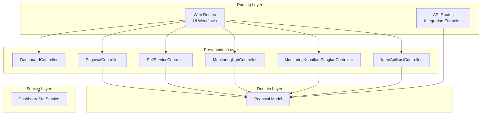
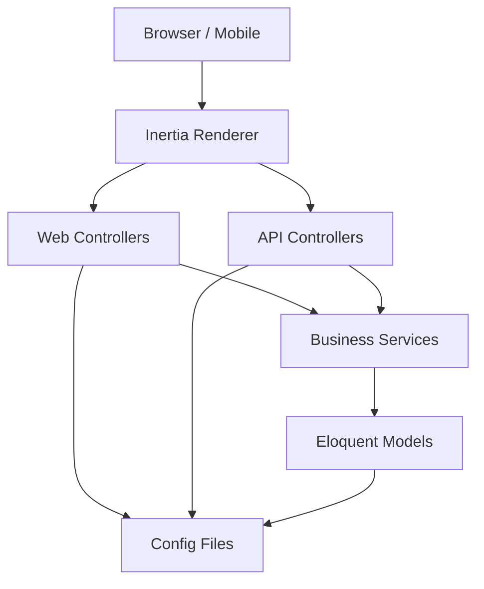
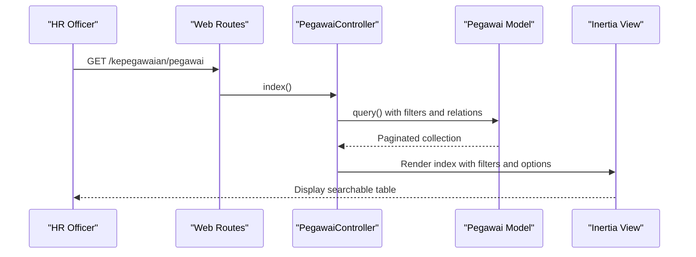
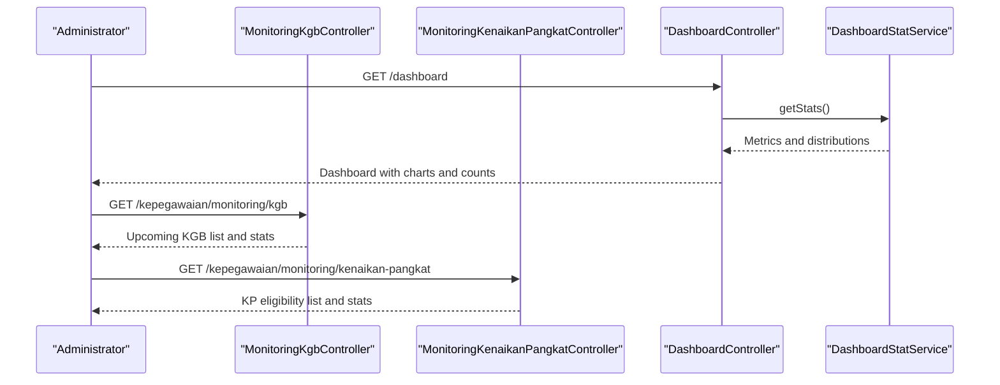
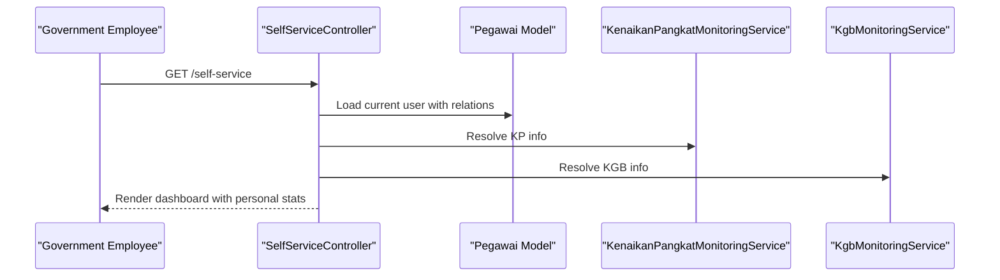
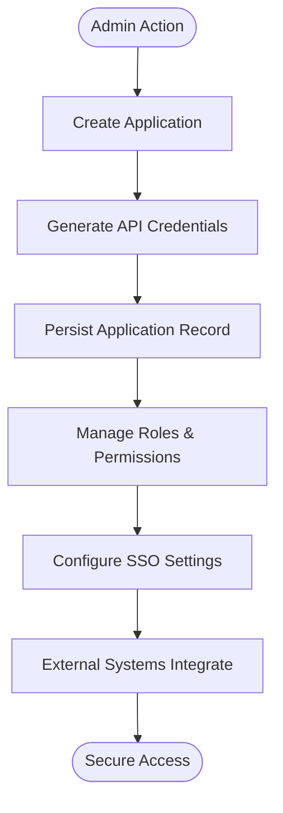
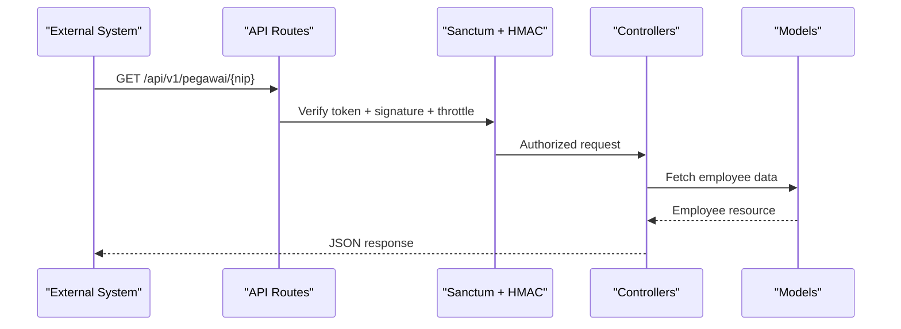
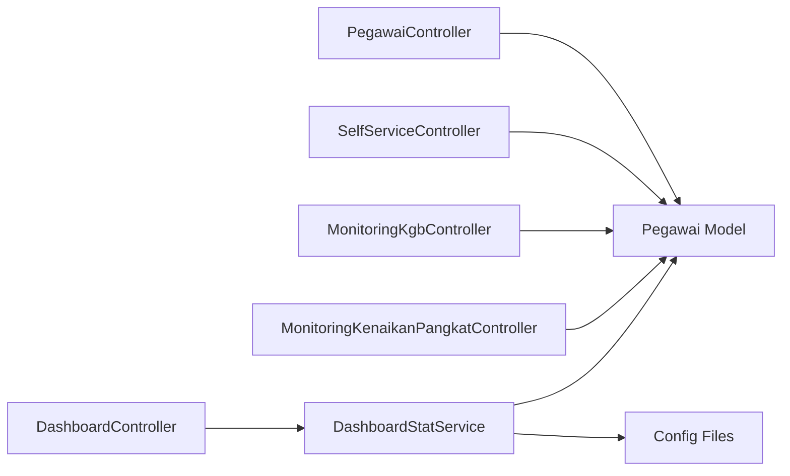

# System Introduction

<cite>
**Referenced Files in This Document**
- [routes/web.php](file://routes/web.php)
- [routes/api.php](file://routes/api.php)
- [app/Http/Controllers/DashboardController.php](file://app/Http/Controllers/DashboardController.php)
- [app/Services/DashboardStatService.php](file://app/Services/DashboardStatService.php)
- [app/Http/Controllers/Kepegawaian/PegawaiController.php](file://app/Http/Controllers/Kepegawaian/PegawaiController.php)
- [app/Models/Pegawai.php](file://app/Models/Pegawai.php)
- [app/Http/Controllers/Kepegawaian/SelfServiceController.php](file://app/Http/Controllers/Kepegawaian/SelfServiceController.php)
- [app/Http/Controllers/Monitoring/MonitoringKgbController.php](file://app/Http/Controllers/Monitoring/MonitoringKgbController.php)
- [app/Http/Controllers/Monitoring/MonitoringKenaikanPangkatController.php](file://app/Http/Controllers/Monitoring/MonitoringKenaikanPangkatController.php)
- [app/Http/Controllers/Iam/AplikasiController.php](file://app/Http/Controllers/Iam/AplikasiController.php)
- [config/kepegawaian.php](file://config/kepegawaian.php)
- [config/iam.php](file://config/iam.php)
</cite>

## Table of Contents
1. [Introduction](#introduction)
2. [Project Structure](#project-structure)
3. [Core Components](#core-components)
4. [Architecture Overview](#architecture-overview)
5. [Detailed Component Analysis](#detailed-component-analysis)
6. [Dependency Analysis](#dependency-analysis)
7. [Performance Considerations](#performance-considerations)
8. [Troubleshooting Guide](#troubleshooting-guide)
9. [Conclusion](#conclusion)

## Introduction
Kepegawaian Apps is an Indonesian government institution Human Resource Information System (HRIS) designed to streamline the management of civil servant records, career progression, and administrative workflows. It serves as a centralized platform for HR officers, administrators, and government employees to maintain accurate personnel data, track promotions and salary advancements, monitor key milestones such as Kenaikan Gaji Berkala (KGB) and Kenaikan Pangkat, and support self-service experiences for employees.

The system supports digital transformation of government HR processes by offering:
- Employee lifecycle management: recruitment, record maintenance, and exit procedures
- Career progression tracking: detailed history of education, training, positions, ranks, awards, and disciplinary actions
- Monitoring dashboards: real-time insights into upcoming KGB/KP events and workforce demographics
- Self-service portal: personal access to profile details and eligibility checks
- Identity and Access Management (IAM): secure application integration and single sign-on (SSO) capabilities
- API-first integration: secure APIs for external systems such as attendance platforms

Target audience:
- HR officers and administrators responsible for maintaining civil servant records and overseeing career progression
- Government employees who benefit from self-service access to personal HR data and milestone tracking
- System integrators working with external government systems requiring secure HR data exchange

Business value:
- Improved accuracy and transparency of HR data
- Reduced administrative burden through automation and standardized workflows
- Enhanced decision-making with actionable analytics and monitoring
- Strengthened compliance with national HR regulations and internal policies
- Seamless interoperability with existing government systems via secure APIs and SSO

Regulatory compliance:
- Built-in IAM controls and permission enforcement align with government security standards
- Secure API endpoints with multi-layer protection (HTTPS, tokens, HMAC signatures, rate limiting)
- Audit-ready data relationships and change tracking through dedicated history tables

Strategic importance:
- Supports national digital government initiatives by centralizing HR data and enabling cross-system collaboration
- Provides scalable infrastructure for future enhancements and integrations
- Ensures continuity and reliability of HR services across diverse government institutions

## Project Structure
The system follows a modular MVC architecture with clear separation of concerns:
- Web routes define UI-driven workflows for administration, monitoring, reference data, and self-service
- API routes expose secure endpoints for integration with external systems
- Controllers orchestrate requests, enforce permissions, and render Inertia-based views
- Services encapsulate business logic for statistics, monitoring, and data transformations
- Models represent domain entities with rich relationships and enumerations for standardized values
- Configuration files manage IAM settings, security keys, and runtime behavior

**Diagram sources**
- [routes/web.php:31-136](file://routes/web.php#L31-L136)
- [routes/api.php:21-47](file://routes/api.php#L21-L47)
- [app/Http/Controllers/DashboardController.php:10-17](file://app/Http/Controllers/DashboardController.php#L10-L17)
- [app/Http/Controllers/Kepegawaian/PegawaiController.php:25-223](file://app/Http/Controllers/Kepegawaian/PegawaiController.php#L25-L223)
- [app/Http/Controllers/Kepegawaian/SelfServiceController.php:13-95](file://app/Http/Controllers/Kepegawaian/SelfServiceController.php#L13-L95)
- [app/Http/Controllers/Monitoring/MonitoringKgbController.php:10-31](file://app/Http/Controllers/Monitoring/MonitoringKgbController.php#L10-L31)
- [app/Http/Controllers/Monitoring/MonitoringKenaikanPangkatController.php:11-31](file://app/Http/Controllers/Monitoring/MonitoringKenaikanPangkatController.php#L11-L31)
- [app/Http/Controllers/Iam/AplikasiController.php:11-128](file://app/Http/Controllers/Iam/AplikasiController.php#L11-L128)
- [app/Services/DashboardStatService.php:14-29](file://app/Services/DashboardStatService.php#L14-L29)
- [app/Models/Pegawai.php:24-208](file://app/Models/Pegawai.php#L24-L208)

**Section sources**
- [routes/web.php:31-136](file://routes/web.php#L31-L136)
- [routes/api.php:21-47](file://routes/api.php#L21-L47)

## Core Components
- Employee Management: Centralized CRUD operations for civil servants with advanced filtering, sorting, and search capabilities
- Monitoring and Analytics: Real-time dashboards for KGB and Kenaikan Pangkat eligibility, workforce distribution, and milestone tracking
- Self-Service Portal: Personalized access to profile details, career history, and eligibility checks for employees
- Identity and Access Management (IAM): Application registration, role-permission management, and secure SSO integration
- API Integration: Secure endpoints for external system interoperability with robust authentication and integrity verification

**Section sources**
- [app/Http/Controllers/Kepegawaian/PegawaiController.php:25-223](file://app/Http/Controllers/Kepegawaian/PegawaiController.php#L25-L223)
- [app/Services/DashboardStatService.php:14-147](file://app/Services/DashboardStatService.php#L14-L147)
- [app/Http/Controllers/Kepegawaian/SelfServiceController.php:13-95](file://app/Http/Controllers/Kepegawaian/SelfServiceController.php#L13-L95)
- [app/Http/Controllers/Iam/AplikasiController.php:11-128](file://app/Http/Controllers/Iam/AplikasiController.php#L11-L128)
- [routes/api.php:21-47](file://routes/api.php#L21-L47)

## Architecture Overview
The system employs a layered architecture:
- Presentation: Inertia-based views for responsive UI and seamless server-side rendering
- Application: Controllers coordinate workflows, enforce authorization, and delegate to services
- Domain: Eloquent models encapsulate business entities, relationships, and enumerations
- Infrastructure: Configuration-driven security, caching, and external integrations

**Diagram sources**
- [app/Http/Controllers/DashboardController.php:10-17](file://app/Http/Controllers/DashboardController.php#L10-L17)
- [app/Services/DashboardStatService.php:14-29](file://app/Services/DashboardStatService.php#L14-L29)
- [app/Http/Controllers/Kepegawaian/PegawaiController.php:25-223](file://app/Http/Controllers/Kepegawaian/PegawaiController.php#L25-L223)
- [routes/web.php:31-136](file://routes/web.php#L31-L136)
- [routes/api.php:21-47](file://routes/api.php#L21-L47)
- [config/iam.php:4-8](file://config/iam.php#L4-L8)
- [config/kepegawaian.php:3-16](file://config/kepegawaian.php#L3-L16)

## Detailed Component Analysis

### Employee Lifecycle Management
Kepegawaian Apps provides comprehensive CRUD operations for civil servants with:
- Advanced search and filtering across NIP, name, unit, position, rank, and employment status
- Multi-step forms for detailed personal and professional information capture
- Rich relationship loading for displaying complete career histories
- Enumerations for standardized values ensuring data consistency

**Diagram sources**
- [routes/web.php:35-63](file://routes/web.php#L35-L63)
- [app/Http/Controllers/Kepegawaian/PegawaiController.php:25-113](file://app/Http/Controllers/Kepegawaian/PegawaiController.php#L25-L113)
- [app/Models/Pegawai.php:24-208](file://app/Models/Pegawai.php#L24-L208)

**Section sources**
- [app/Http/Controllers/Kepegawaian/PegawaiController.php:25-223](file://app/Http/Controllers/Kepegawaian/PegawaiController.php#L25-L223)
- [app/Models/Pegawai.php:24-208](file://app/Models/Pegawai.php#L24-L208)

### Monitoring and Self-Service
The system offers dual perspectives:
- Administrative monitoring dashboards for KGB and Kenaikan Pangkat eligibility
- Personal self-service portal for employees to review their profiles and milestones

**Diagram sources**
- [app/Http/Controllers/DashboardController.php:10-17](file://app/Http/Controllers/DashboardController.php#L10-L17)
- [app/Services/DashboardStatService.php:14-147](file://app/Services/DashboardStatService.php#L14-L147)
- [app/Http/Controllers/Monitoring/MonitoringKgbController.php:10-31](file://app/Http/Controllers/Monitoring/MonitoringKgbController.php#L10-L31)
- [app/Http/Controllers/Monitoring/MonitoringKenaikanPangkatController.php:11-31](file://app/Http/Controllers/Monitoring/MonitoringKenaikanPangkatController.php#L11-L31)

**Section sources**
- [app/Http/Controllers/DashboardController.php:10-17](file://app/Http/Controllers/DashboardController.php#L10-L17)
- [app/Services/DashboardStatService.php:14-147](file://app/Services/DashboardStatService.php#L14-L147)
- [app/Http/Controllers/Monitoring/MonitoringKgbController.php:10-31](file://app/Http/Controllers/Monitoring/MonitoringKgbController.php#L10-L31)
- [app/Http/Controllers/Monitoring/MonitoringKenaikanPangkatController.php:11-31](file://app/Http/Controllers/Monitoring/MonitoringKenaikanPangkatController.php#L11-L31)

### Self-Service Experience
Employees can access personalized information through the self-service portal:
- Personal profile with complete career history
- Eligibility checks for KGB and Kenaikan Pangkat
- Relationship-loaded details for comprehensive visibility

**Diagram sources**
- [routes/web.php:106-112](file://routes/web.php#L106-L112)
- [app/Http/Controllers/Kepegawaian/SelfServiceController.php:13-95](file://app/Http/Controllers/Kepegawaian/SelfServiceController.php#L13-L95)
- [app/Models/Pegawai.php:24-208](file://app/Models/Pegawai.php#L24-L208)

**Section sources**
- [app/Http/Controllers/Kepegawaian/SelfServiceController.php:13-95](file://app/Http/Controllers/Kepegawaian/SelfServiceController.php#L13-L95)

### Identity and Access Management (IAM)
The IAM module enables secure application integration:
- Application registration with generated API credentials
- Role and permission management per application
- SSO integration with configurable token lifetimes and code TTLs
- API key masking for safe presentation

**Diagram sources**
- [app/Http/Controllers/Iam/AplikasiController.php:41-107](file://app/Http/Controllers/Iam/AplikasiController.php#L41-L107)
- [config/iam.php:4-8](file://config/iam.php#L4-L8)

**Section sources**
- [app/Http/Controllers/Iam/AplikasiController.php:11-128](file://app/Http/Controllers/Iam/AplikasiController.php#L11-L128)
- [config/iam.php:4-8](file://config/iam.php#L4-L8)

### API Integration and Security
The system exposes secure APIs for external integrations:
- Multi-layer security: HTTPS, Sanctum tokens, HMAC-SHA256 signatures, and rate limiting
- Dedicated endpoints for employee lookups and IAM operations
- Configurable HMAC secret key for attendance system integration

**Diagram sources**
- [routes/api.php:21-47](file://routes/api.php#L21-L47)
- [config/kepegawaian.php:3-16](file://config/kepegawaian.php#L3-L16)

**Section sources**
- [routes/api.php:21-47](file://routes/api.php#L21-L47)
- [config/kepegawaian.php:3-16](file://config/kepegawaian.php#L3-L16)

## Dependency Analysis
The system exhibits strong cohesion within functional domains and controlled coupling through controllers and services:
- Controllers depend on services for business logic and on models for persistence
- Services encapsulate complex queries and calculations, promoting testability
- Models define clear relationships and constraints, reducing duplication
- Configuration files centralize environment-specific settings

**Diagram sources**
- [app/Http/Controllers/DashboardController.php:10-17](file://app/Http/Controllers/DashboardController.php#L10-L17)
- [app/Services/DashboardStatService.php:14-147](file://app/Services/DashboardStatService.php#L14-L147)
- [app/Http/Controllers/Kepegawaian/PegawaiController.php:25-223](file://app/Http/Controllers/Kepegawaian/PegawaiController.php#L25-L223)
- [app/Http/Controllers/Kepegawaian/SelfServiceController.php:13-95](file://app/Http/Controllers/Kepegawaian/SelfServiceController.php#L13-L95)
- [app/Http/Controllers/Monitoring/MonitoringKgbController.php:10-31](file://app/Http/Controllers/Monitoring/MonitoringKgbController.php#L10-L31)
- [app/Http/Controllers/Monitoring/MonitoringKenaikanPangkatController.php:11-31](file://app/Http/Controllers/Monitoring/MonitoringKenaikanPangkatController.php#L11-L31)
- [app/Models/Pegawai.php:24-208](file://app/Models/Pegawai.php#L24-L208)
- [config/iam.php:4-8](file://config/iam.php#L4-L8)
- [config/kepegawaian.php:3-16](file://config/kepegawaian.php#L3-L16)

**Section sources**
- [app/Services/DashboardStatService.php:14-147](file://app/Services/DashboardStatService.php#L14-L147)
- [app/Models/Pegawai.php:24-208](file://app/Models/Pegawai.php#L24-L208)

## Performance Considerations
- Use eager loading to minimize N+1 queries in controllers and services
- Leverage database indexing on frequently filtered columns (NIP, unit, rank)
- Apply pagination for large datasets in listing views
- Cache frequently accessed reference data (positions, ranks, units)
- Monitor API response times and adjust rate limits as needed

## Troubleshooting Guide
Common issues and resolutions:
- Authentication failures: Verify Sanctum tokens and HMAC signatures for API endpoints
- Authorization errors: Confirm IAM permissions and role assignments for users
- Slow page loads: Review controller queries and consider adding indexes or caching
- Self-service access problems: Ensure employee accounts are properly linked to user records

**Section sources**
- [routes/api.php:21-47](file://routes/api.php#L21-L47)
- [app/Http/Controllers/Iam/AplikasiController.php:63-79](file://app/Http/Controllers/Iam/AplikasiController.php#L63-L79)

## Conclusion
Kepegawaian Apps delivers a comprehensive HRIS tailored for Indonesian government institutions, combining robust employee management, insightful monitoring, and secure self-service capabilities. Its modular architecture, strong IAM foundation, and API-first design enable seamless integration with existing systems while supporting ongoing digital transformation goals. By centralizing HR data and automating administrative workflows, the system enhances operational efficiency, ensures regulatory compliance, and improves service delivery to government employees and HR stakeholders.