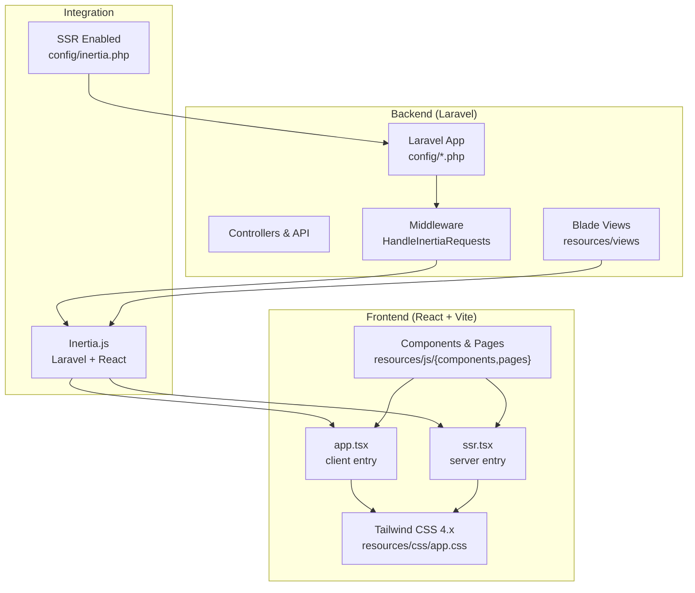
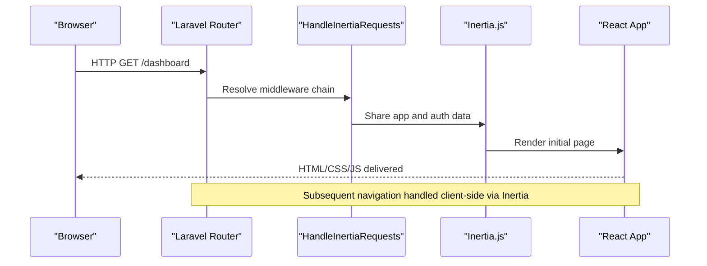
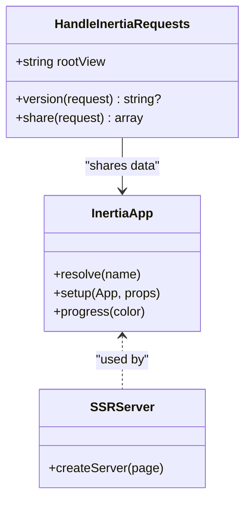

# Technology Stack

<cite>
**Referenced Files in This Document**
- [composer.json](file://composer.json)
- [package.json](file://package.json)
- [vite.config.ts](file://vite.config.ts)
- [config/app.php](file://config/app.php)
- [config/inertia.php](file://config/inertia.php)
- [config/sanctum.php](file://config/sanctum.php)
- [config/fortify.php](file://config/fortify.php)
- [config/database.php](file://config/database.php)
- [config/cache.php](file://config/cache.php)
- [config/session.php](file://config/session.php)
- [app/Http/Middleware/HandleInertiaRequests.php](file://app/Http/Middleware/HandleInertiaRequests.php)
- [resources/js/app.tsx](file://resources/js/app.tsx)
- [resources/js/ssr.tsx](file://resources/js/ssr.tsx)
- [tsconfig.json](file://tsconfig.json)
- [components.json](file://components.json)
- [resources/css/app.css](file://resources/css/app.css)
</cite>

## Table of Contents
1. [Introduction](#introduction)
2. [Project Structure](#project-structure)
3. [Core Components](#core-components)
4. [Architecture Overview](#architecture-overview)
5. [Detailed Component Analysis](#detailed-component-analysis)
6. [Dependency Analysis](#dependency-analysis)
7. [Performance Considerations](#performance-considerations)
8. [Troubleshooting Guide](#troubleshooting-guide)
9. [Conclusion](#conclusion)

## Introduction
This document describes the full-stack technology stack for Kepegawaian Apps, focusing on backend and frontend technologies, integration patterns, and operational considerations. The backend is powered by Laravel 12.x with PHP 8.2+ and integrates Inertia.js for seamless server-side rendering and client-side interactivity. Authentication and security are handled by Laravel Sanctum and Laravel Fortify. The frontend is built with React 19, TypeScript, Tailwind CSS 4.x, and Vite, delivering a modern, responsive, and accessible user interface.

## Project Structure
The project follows a conventional Laravel monolith with a dedicated frontend asset pipeline:
- Backend: Laravel application under app/, config/, routes/, and database/.
- Frontend: React-based assets under resources/js/ and resources/css/, built and served via Vite.
- Middleware and integration: Inertia.js bridges server and client through shared data and SSR.



**Diagram sources**
- [config/app.php:16](file://config/app.php#L16)
- [config/inertia.php:18-23](file://config/inertia.php#L18-L23)
- [resources/js/app.tsx:11-32](file://resources/js/app.tsx#L11-L32)
- [resources/js/ssr.tsx:9-27](file://resources/js/ssr.tsx#L9-L27)
- [resources/css/app.css:1-144](file://resources/css/app.css#L1-L144)

**Section sources**
- [composer.json:11-18](file://composer.json#L11-L18)
- [package.json:32-66](file://package.json#L32-L66)
- [vite.config.ts:7-27](file://vite.config.ts#L7-L27)
- [config/inertia.php:18-23](file://config/inertia.php#L18-L23)

## Core Components
- Backend framework and runtime
  - Laravel 12.x (PHP 8.2+): Provides routing, middleware, Eloquent ORM, queues, and service container.
  - PHP 8.2+: Ensures modern language features and performance.
- Authentication and security
  - Laravel Sanctum: API and SPA authentication with stateful cookies and personal access tokens.
  - Laravel Fortify: Customizable authentication scaffolding including two-factor authentication, email verification, and password resets.
- Frontend framework and toolchain
  - React 19: Component-based UI with concurrent features.
  - TypeScript: Strong typing and improved developer experience.
  - Tailwind CSS 4.x: Utility-first CSS with design tokens and dark mode support.
  - Vite: Fast build tool and dev server with hot module replacement.
- Integration layer
  - Inertia.js: Bridges Laravel and React, enabling server-side rendering and client-side navigation with shared data.

**Section sources**
- [composer.json:11-18](file://composer.json#L11-L18)
- [package.json:32-66](file://package.json#L32-L66)
- [config/sanctum.php:21-26](file://config/sanctum.php#L21-L26)
- [config/fortify.php:18-154](file://config/fortify.php#L18-L154)
- [config/inertia.php:18-23](file://config/inertia.php#L18-L23)

## Architecture Overview
The system uses a full-stack architecture where Laravel handles routing, authentication, and data orchestration, while React manages interactive UI. Inertia.js coordinates data transfer and navigation between server and client, optionally leveraging SSR for improved SEO and perceived performance.



**Diagram sources**
- [app/Http/Middleware/HandleInertiaRequests.php:17-43](file://app/Http/Middleware/HandleInertiaRequests.php#L17-L43)
- [resources/js/app.tsx:11-32](file://resources/js/app.tsx#L11-L32)
- [config/inertia.php:18-23](file://config/inertia.php#L18-L23)

## Detailed Component Analysis

### Backend: Laravel 12.x and Supporting Packages
- Laravel framework: Provides routing, middleware, Eloquent, and queue systems.
- Inertia.js (Laravel): Enables server-rendered React pages and client-side navigation.
- Laravel Sanctum: Manages stateful SPA authentication and personal access tokens.
- Laravel Fortify: Implements customizable authentication features including two-factor authentication and email verification.
- Laravel Wayfinder: Enhances routing and navigation support.

Key configuration highlights:
- Inertia SSR enabled with a dedicated SSR URL and testing page paths.
- Sanctum stateful domains configured for local and common SPA ports.
- Fortify configured with NIP as the username field and two-factor features enabled.

**Section sources**
- [composer.json:11-18](file://composer.json#L11-L18)
- [config/inertia.php:18-23](file://config/inertia.php#L18-L23)
- [config/sanctum.php:21-26](file://config/sanctum.php#L21-L26)
- [config/fortify.php:48-154](file://config/fortify.php#L48-L154)

### Frontend: React 19, TypeScript, Tailwind CSS 4.x, Vite
- React 19: Concurrent features and improved rendering performance.
- TypeScript: Strict type checking and IDE support via tsconfig.json.
- Tailwind CSS 4.x: Utility-first styling with design tokens, dark mode variants, and animations.
- Vite: Lightning-fast builds and dev server with React compiler plugin.

Build and runtime integration:
- Vite configuration includes Laravel plugin, React compiler, Tailwind CSS plugin, and Wayfinder for form variants.
- TypeScript configured for ESNext modules, bundler resolution, and JSX transform.
- Tailwind CSS configured with custom theme tokens and dark mode support.

**Section sources**
- [package.json:32-66](file://package.json#L32-L66)
- [vite.config.ts:7-27](file://vite.config.ts#L7-L27)
- [tsconfig.json:14-115](file://tsconfig.json#L14-L115)
- [resources/css/app.css:1-144](file://resources/css/app.css#L1-L144)

### Integration: Inertia.js Bridge
Inertia.js connects Laravel and React by:
- Sharing application-wide data (e.g., app name, authenticated user, permissions) via middleware.
- Resolving React pages from Laravel routes and serving them initially as HTML.
- Enabling client-side navigation while preserving server-side rendering capabilities.



**Diagram sources**
- [app/Http/Middleware/HandleInertiaRequests.php:8-43](file://app/Http/Middleware/HandleInertiaRequests.php#L8-L43)
- [resources/js/app.tsx:11-32](file://resources/js/app.tsx#L11-L32)
- [resources/js/ssr.tsx:9-27](file://resources/js/ssr.tsx#L9-L27)

**Section sources**
- [app/Http/Middleware/HandleInertiaRequests.php:17-43](file://app/Http/Middleware/HandleInertiaRequests.php#L17-L43)
- [resources/js/app.tsx:11-32](file://resources/js/app.tsx#L11-L32)
- [resources/js/ssr.tsx:9-27](file://resources/js/ssr.tsx#L9-L27)

### Database Technologies and Caching
- Database connections: SQLite (default), MySQL, MariaDB, PostgreSQL, SQL Server.
- Redis: Configured for sessions and caching with separate logical databases.
- Cache: Database-backed cache by default with options for file, memcached, redis, dynamodb, and octane.

Operational notes:
- Default connection is SQLite for simplicity in development.
- Redis is configured for both default and cache logical databases.
- Cache prefix is derived from the application name to avoid collisions.

**Section sources**
- [config/database.php:20](file://config/database.php#L20)
- [config/database.php:35-100](file://config/database.php#L35-L100)
- [config/database.php:146-182](file://config/database.php#L146-L182)
- [config/cache.php:18](file://config/cache.php#L18)
- [config/cache.php:42-79](file://config/cache.php#L42-L79)

### Authentication and Authorization
- Fortify configuration:
  - Username field mapped to NIP.
  - Two-factor authentication enabled with confirmation and password confirmation.
  - Email verification and password reset features enabled.
- Sanctum configuration:
  - Stateful domains include localhost and common SPA ports.
  - Middleware includes session authentication, cookie encryption, and CSRF validation.

**Section sources**
- [config/fortify.php:48-154](file://config/fortify.php#L48-L154)
- [config/sanctum.php:21-26](file://config/sanctum.php#L21-L26)
- [config/sanctum.php:81-85](file://config/sanctum.php#L81-L85)

### Development Tools and Build Pipeline
- Composer scripts: Setup, dev, dev:ssr, lint, ci checks, and tests.
- NPM scripts: Dev, build, build:ssr, lint, format, and type checks.
- Vite plugins: Laravel plugin, React compiler, Tailwind CSS, and Wayfinder.
- TypeScript: Strict mode, ESNext target, bundler module resolution, and JSX transform.
- Tailwind CSS: Theme tokens, dark mode, and animation utilities.

**Section sources**
- [composer.json:43-97](file://composer.json#L43-L97)
- [package.json:5-14](file://package.json#L5-L14)
- [vite.config.ts:7-27](file://vite.config.ts#L7-L27)
- [tsconfig.json:14-115](file://tsconfig.json#L14-L115)
- [components.json:6-21](file://components.json#L6-L21)

## Dependency Analysis
The stack balances a modern frontend with a robust backend:
- Laravel 12.x provides a stable foundation for routing, middleware, and ORM.
- Inertia.js simplifies the SPA experience by sharing server-side data with React components.
- React 19 and TypeScript deliver type safety and component modularity.
- Tailwind CSS 4.x ensures consistent design tokens and responsive layouts.
- Vite streamlines development and production builds.

```mermaid
graph LR
PHP["PHP 8.2+"] --> Laravel["Laravel 12.x"]
Laravel --> Inertia["Inertia.js"]
Laravel --> Sanctum["Laravel Sanctum"]
Laravel --> Fortify["Laravel Fortify"]
React["React 19"] --> Inertia
TS["TypeScript"] --> React
Tailwind["Tailwind CSS 4.x"] --> React
Vite["Vite"] --> React
DB["SQLite/MySQL/PG/SQLSRV"] <- --> Laravel
Redis["Redis"] <- --> Laravel
```

**Diagram sources**
- [composer.json:12-18](file://composer.json#L12-L18)
- [package.json:32-66](file://package.json#L32-L66)
- [config/database.php:20](file://config/database.php#L20)
- [config/database.php:146-182](file://config/database.php#L146-L182)

**Section sources**
- [composer.json:11-18](file://composer.json#L11-L18)
- [package.json:32-66](file://package.json#L32-L66)

## Performance Considerations
- SSR: Enabled via Inertia configuration to improve initial load performance and SEO.
- Redis: Use Redis for caching and sessions to reduce database load and improve responsiveness.
- Tailwind CSS 4.x: Leverage utility classes and atomic CSS for efficient styling without bloated CSS.
- Vite: Benefit from fast HMR and optimized production builds for frontend assets.
- TypeScript: Catch errors early and enable better tree-shaking and minification.

[No sources needed since this section provides general guidance]

## Troubleshooting Guide
Common areas to verify:
- Authentication
  - Confirm Sanctum stateful domains include your SPA host and port.
  - Ensure Fortify features align with your application’s security requirements.
- Inertia Integration
  - Verify shared data in middleware matches frontend expectations.
  - Confirm SSR URL and bundle path if using server-side rendering.
- Database and Cache
  - Validate database connection settings and credentials.
  - Ensure Redis is reachable and configured for both default and cache databases.
- Frontend Build
  - Check Vite plugins and aliases in the configuration.
  - Run type checks and formatting to catch issues early.

**Section sources**
- [config/sanctum.php:21-26](file://config/sanctum.php#L21-L26)
- [config/fortify.php:48-154](file://config/fortify.php#L48-L154)
- [app/Http/Middleware/HandleInertiaRequests.php:17-43](file://app/Http/Middleware/HandleInertiaRequests.php#L17-L43)
- [config/inertia.php:18-23](file://config/inertia.php#L18-L23)
- [config/database.php:20](file://config/database.php#L20)
- [config/database.php:146-182](file://config/database.php#L146-L182)
- [vite.config.ts:7-27](file://vite.config.ts#L7-L27)

## Conclusion
Kepegawaian Apps combines Laravel 12.x with modern frontend technologies to deliver a secure, maintainable, and scalable government application. Laravel Sanctum and Fortify provide robust authentication and security, while Inertia.js bridges server-side rendering and client-side interactivity. React 19, TypeScript, Tailwind CSS 4.x, and Vite ensure a responsive, accessible, and developer-friendly UI. The stack’s modular design, strong typing, and SSR support make it well-suited for public sector environments requiring reliability and maintainability.

[No sources needed since this section summarizes without analyzing specific files]