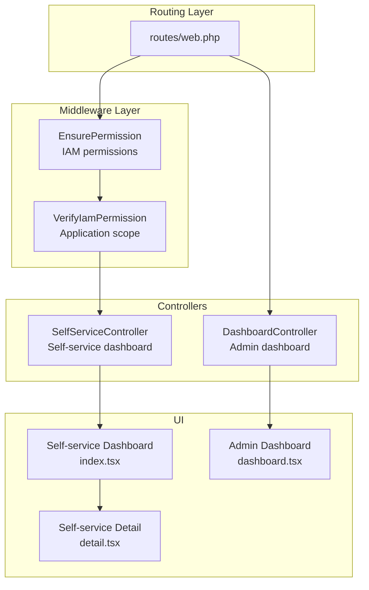
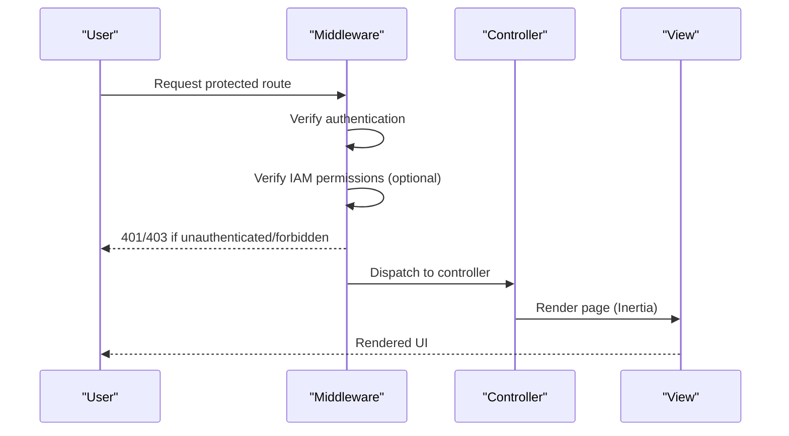
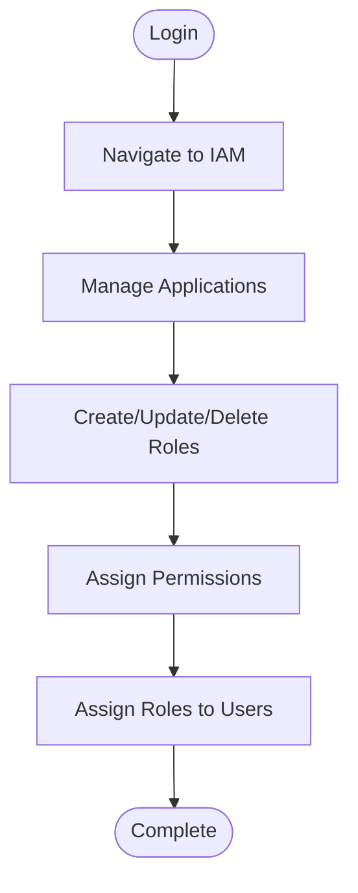
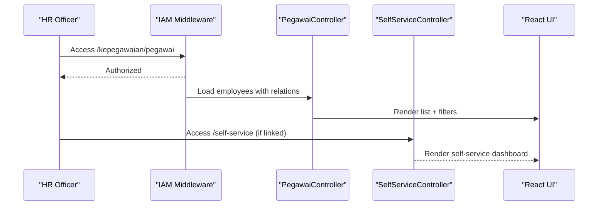
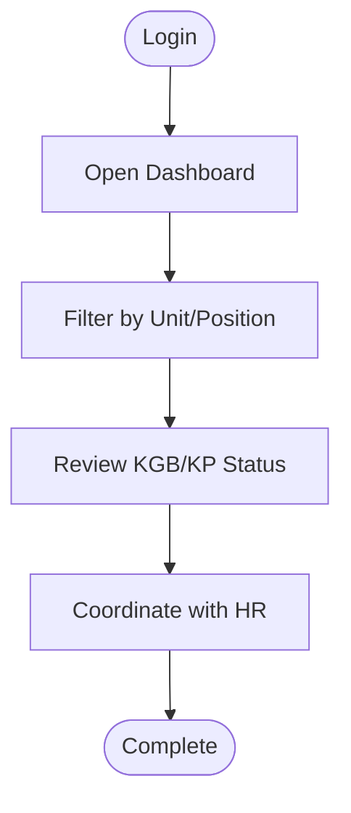
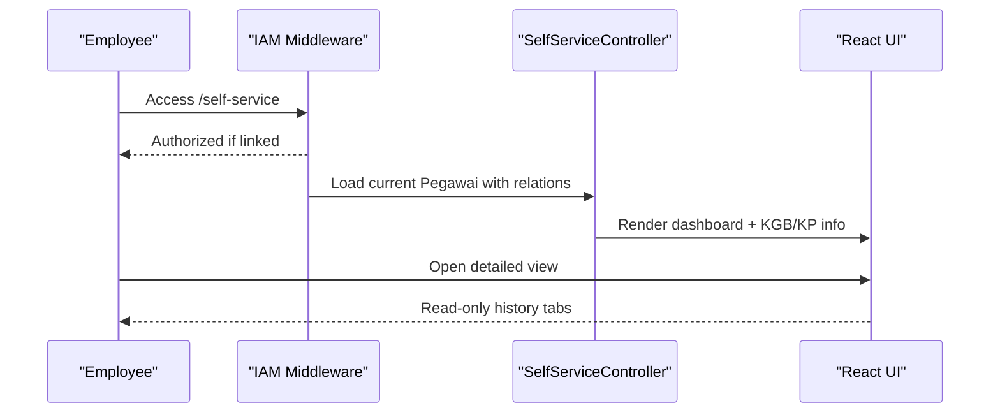
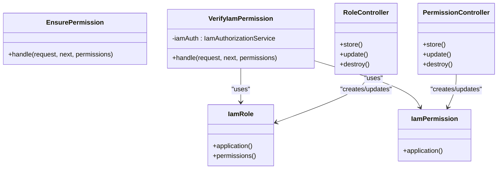

# User Personas

<cite>
**Referenced Files in This Document**
- [web.php](file://routes/web.php)
- [SelfServiceController.php](file://app/Http/Controllers/Kepegawaian/SelfServiceController.php)
- [SelfService/index.tsx](file://resources/js/pages/self-service/index.tsx)
- [SelfService/detail.tsx](file://resources/js/pages/self-service/detail.tsx)
- [dashboard.tsx](file://resources/js/pages/dashboard.tsx)
- [dashboard.php](file://app/Http/Controllers/DashboardController.php)
- [EnsurePermission.php](file://app/Http/Middleware/EnsurePermission.php)
- [VerifyIamPermission.php](file://app/Http/Middleware/VerifyIamPermission.php)
- [PegawaiPolicy.php](file://app/Policies/PegawaiPolicy.php)
- [RoleController.php](file://app/Http/Controllers/Iam/RoleController.php)
- [PermissionController.php](file://app/Http/Controllers/Iam/PermissionController.php)
- [IamRole.php](file://app/Models/IamRole.php)
- [IamPermission.php](file://app/Models/IamPermission.php)
- [iam.php](file://config/iam.php)
- [Welcome page](file://resources/js/pages/welcome.tsx)
- [master-data-kepegawaian.md](file://.sisyphus/plans/master-data-kepegawaian.md)
</cite>

## Table of Contents
1. [Introduction](#introduction)
2. [Project Structure](#project-structure)
3. [Core Components](#core-components)
4. [Architecture Overview](#architecture-overview)
5. [Detailed Component Analysis](#detailed-component-analysis)
6. [Dependency Analysis](#dependency-analysis)
7. [Performance Considerations](#performance-considerations)
8. [Troubleshooting Guide](#troubleshooting-guide)
9. [Conclusion](#conclusion)

## Introduction
This document defines the user personas for Kepegawaian Apps, focusing on the four primary stakeholder groups: system administrators, HR officers, department heads, and regular employees. It outlines each persona’s responsibilities, goals, pain points, and how they interact with the system. It also documents self-service capabilities for employees and administrative functions for HR staff, along with typical workflows, frequently used features, access permissions, and user journey maps. Accessibility and user experience considerations are addressed for different user types.

## Project Structure
Kepegawaian Apps is a Laravel 12 + React 19 + Inertia + Tailwind + shadcn/ui application. The routing and middleware layers define role-based access and feature boundaries:
- Public and authentication-protected routes
- IAM permission middleware for fine-grained access control
- Self-service routes restricted to linked employees
- Administrative routes for HR officers and system administrators

**Diagram sources**
- [web.php:31-136](file://routes/web.php#L31-L136)
- [EnsurePermission.php:11-35](file://app/Http/Middleware/EnsurePermission.php#L11-L35)
- [VerifyIamPermission.php:16-51](file://app/Http/Middleware/VerifyIamPermission.php#L16-L51)
- [SelfServiceController.php:20-38](file://app/Http/Controllers/Kepegawaian/SelfServiceController.php#L20-L38)
- [dashboard.php:12-17](file://app/Http/Controllers/DashboardController.php#L12-L17)
- [SelfService/index.tsx:150-408](file://resources/js/pages/self-service/index.tsx#L150-L408)
- [SelfService/detail.tsx:1-200](file://resources/js/pages/self-service/detail.tsx#L1-L200)
- [dashboard.tsx:38-342](file://resources/js/pages/dashboard.tsx#L38-L342)

**Section sources**
- [web.php:31-136](file://routes/web.php#L31-L136)
- [dashboard.php:12-17](file://app/Http/Controllers/DashboardController.php#L12-L17)

## Core Components
- Self-service module for employees: personal dashboard, eligibility monitoring, and read-only detail view.
- Administrative module for HR officers and administrators: comprehensive data management, monitoring dashboards, and IAM administration.
- Access control: IAM permission middleware scoped to the application slug, ensuring only authorized users access sensitive features.

Key capabilities:
- Employees: view personal data, KGB/KP monitoring, and detailed history (read-only).
- HR/Admin: manage personnel data, monitor promotions and salary advances, configure roles and permissions.

**Section sources**
- [SelfServiceController.php:20-94](file://app/Http/Controllers/Kepegawaian/SelfServiceController.php#L20-L94)
- [SelfService/index.tsx:150-408](file://resources/js/pages/self-service/index.tsx#L150-L408)
- [SelfService/detail.tsx:1-200](file://resources/js/pages/self-service/detail.tsx#L1-L200)
- [dashboard.tsx:38-342](file://resources/js/pages/dashboard.tsx#L38-L342)
- [VerifyIamPermission.php:26-49](file://app/Http/Middleware/VerifyIamPermission.php#L26-L49)
- [iam.php:5-8](file://config/iam.php#L5-L8)

## Architecture Overview
The system separates concerns by user role and feature scope:
- Self-service: routes under /self-service, restricted to users linked to a Pegawai record.
- Administration: routes under /kepegawaian and /iam, gated by IAM permissions and roles.
- Dashboards: separate admin dashboard and self-service summary dashboard.

**Diagram sources**
- [EnsurePermission.php:11-35](file://app/Http/Middleware/EnsurePermission.php#L11-L35)
- [VerifyIamPermission.php:16-51](file://app/Http/Middleware/VerifyIamPermission.php#L16-L51)
- [web.php:35-136](file://routes/web.php#L35-L136)

**Section sources**
- [web.php:35-136](file://routes/web.php#L35-L136)
- [EnsurePermission.php:11-35](file://app/Http/Middleware/EnsurePermission.php#L11-L35)
- [VerifyIamPermission.php:16-51](file://app/Http/Middleware/VerifyIamPermission.php#L16-L51)

## Detailed Component Analysis

### Persona: System Administrator
Responsibilities:
- Manage IAM applications, roles, and permissions.
- Assign roles to users and grant access to administrative features.
- Oversee system-wide configurations and integrations.

Goals:
- Secure and maintain access control.
- Enable HR teams to efficiently manage data while preventing unauthorized access.

Pain points:
- Complex permission matrices and role assignments.
- Ensuring least privilege and audit readiness.

Typical workflows:
- Create and update roles with associated permissions.
- Assign roles to users and revoke when necessary.
- Monitor access logs and adjust permissions as needed.

Frequently used features:
- IAM application management.
- Role and permission CRUD.
- User access management.

Access permissions:
- IAM management routes require the iam-manage permission.
- Application-scoped checks ensure roles and permissions belong to the configured application slug.

User journey map:
- Login → IAM → Applications → Roles → Permissions → Users → Access Management

**Diagram sources**
- [web.php:114-136](file://routes/web.php#L114-L136)
- [RoleController.php:14-50](file://app/Http/Controllers/Iam/RoleController.php#L14-L50)
- [PermissionController.php:14-39](file://app/Http/Controllers/Iam/PermissionController.php#L14-L39)
- [IamRole.php:23-36](file://app/Models/IamRole.php#L23-L36)
- [IamPermission.php:17-20](file://app/Models/IamPermission.php#L17-L20)
- [VerifyIamPermission.php:26-49](file://app/Http/Middleware/VerifyIamPermission.php#L26-L49)
- [iam.php](file://config/iam.php#L7)

**Section sources**
- [web.php:114-136](file://routes/web.php#L114-L136)
- [RoleController.php:14-63](file://app/Http/Controllers/Iam/RoleController.php#L14-L63)
- [PermissionController.php:14-50](file://app/Http/Controllers/Iam/PermissionController.php#L14-L50)
- [IamRole.php:14-36](file://app/Models/IamRole.php#L14-L36)
- [IamPermission.php:13-21](file://app/Models/IamPermission.php#L13-L21)
- [VerifyIamPermission.php:26-51](file://app/Http/Middleware/VerifyIamPermission.php#L26-L51)
- [iam.php:5-8](file://config/iam.php#L5-L8)

### Persona: HR Officer
Responsibilities:
- Maintain employee records and histories.
- Monitor KGB and Kenaikan Pangkat (promotion) timelines.
- Generate reports and insights for leadership.

Goals:
- Keep data accurate and up-to-date.
- Proactively identify upcoming milestones and eligibility periods.

Pain points:
- Manual data entry and verification.
- Managing overlapping timelines and eligibility rules.

Typical workflows:
- View dashboard statistics.
- Browse and filter employee lists.
- Add/update employee histories (pangkat, jabatan, pendidikan, diklat, keluarga, penghargaan, hukuman).
- Monitor KGB and KP deadlines.

Frequently used features:
- Employee list with search, filter, and sort.
- Employee detail view with tabbed sections.
- Monitoring dashboards for KGB and KP.
- Create and edit employee records.

Access permissions:
- Protected by IAM permission middleware.
- CRUD access to employee-related resources.

User journey map:
- Login → Dashboard → Employee List → Detail View → History Tabs → Monitoring

**Diagram sources**
- [web.php:35-104](file://routes/web.php#L35-L104)
- [SelfServiceController.php:20-38](file://app/Http/Controllers/Kepegawaian/SelfServiceController.php#L20-L38)
- [dashboard.tsx:38-146](file://resources/js/pages/dashboard.tsx#L38-L146)

**Section sources**
- [web.php:35-104](file://routes/web.php#L35-L104)
- [SelfServiceController.php:20-38](file://app/Http/Controllers/Kepegawaian/SelfServiceController.php#L20-L38)
- [dashboard.tsx:38-146](file://resources/js/pages/dashboard.tsx#L38-L146)

### Persona: Department Head
Responsibilities:
- Oversee team performance and compliance.
- Coordinate promotion and salary advancement processes.
- Review milestone readiness and eligibility.

Goals:
- Ensure team meets eligibility criteria and documentation is complete.
- Support timely submissions and approvals.

Pain points:
- Tracking multiple employees across different timelines.
- Balancing workload with compliance requirements.

Typical workflows:
- Review dashboard summaries.
- Filter employees by unit, position, or eligibility status.
- Cross-reference KGB and KP timelines.
- Coordinate with HR for formal processes.

Frequently used features:
- Dashboard cards for quick insights.
- Filtering and sorting employee lists.
- Monitoring dashboards for KGB/KP.

User journey map:
- Login → Dashboard → Filter by Unit → Review KGB/KP Status → Coordinate Actions

**Diagram sources**
- [dashboard.tsx:38-342](file://resources/js/pages/dashboard.tsx#L38-L342)
- [web.php:35-63](file://routes/web.php#L35-L63)

**Section sources**
- [dashboard.tsx:38-342](file://resources/js/pages/dashboard.tsx#L38-L342)
- [web.php:35-63](file://routes/web.php#L35-L63)

### Persona: Regular Employee (Self-Service)
Responsibilities:
- Access personal data and eligibility information.
- Track KGB and KP timelines independently.
- View read-only history and documents.

Goals:
- Stay informed about personal milestones and deadlines.
- Reduce reliance on HR for basic information.

Pain points:
- Lack of access if account is not linked to a Pegawai record.
- Limited ability to update personal information (handled by HR).

Typical workflows:
- Login → Self-service dashboard → View personal summary.
- Navigate to detailed view for comprehensive history.
- Bookmark or reference eligibility cards for planning.

Frequently used features:
- Personal dashboard with KGB/KP summaries.
- Read-only detail view with all history tabs.
- Quick links to full detail.

Access permissions:
- Routes under /self-service require the user to be linked to a Pegawai record.
- IAM permission middleware ensures access to administrative features is denied.

User journey map:
- Login → Self-service Dashboard → Personal Summary → Detailed View → Milestone Planning

**Diagram sources**
- [web.php:106-112](file://routes/web.php#L106-L112)
- [SelfServiceController.php:20-94](file://app/Http/Controllers/Kepegawaian/SelfServiceController.php#L20-L94)
- [SelfService/index.tsx:150-408](file://resources/js/pages/self-service/index.tsx#L150-L408)
- [SelfService/detail.tsx:1-200](file://resources/js/pages/self-service/detail.tsx#L1-L200)

**Section sources**
- [web.php:106-112](file://routes/web.php#L106-L112)
- [SelfServiceController.php:20-94](file://app/Http/Controllers/Kepegawaian/SelfServiceController.php#L20-L94)
- [SelfService/index.tsx:150-408](file://resources/js/pages/self-service/index.tsx#L150-L408)
- [SelfService/detail.tsx:1-200](file://resources/js/pages/self-service/detail.tsx#L1-L200)

## Dependency Analysis
Access control relies on IAM middleware and policies:
- EnsurePermission middleware validates required permissions and redirects unauthenticated users.
- VerifyIamPermission middleware scopes permissions to the configured application slug and caches application lookup.
- IAM roles and permissions are modeled with dedicated Eloquent models and controllers.

**Diagram sources**
- [EnsurePermission.php:11-35](file://app/Http/Middleware/EnsurePermission.php#L11-L35)
- [VerifyIamPermission.php:14-51](file://app/Http/Middleware/VerifyIamPermission.php#L14-L51)
- [IamRole.php:23-36](file://app/Models/IamRole.php#L23-L36)
- [IamPermission.php:17-20](file://app/Models/IamPermission.php#L17-L20)
- [RoleController.php:14-63](file://app/Http/Controllers/Iam/RoleController.php#L14-L63)
- [PermissionController.php:14-50](file://app/Http/Controllers/Iam/PermissionController.php#L14-L50)

**Section sources**
- [EnsurePermission.php:11-35](file://app/Http/Middleware/EnsurePermission.php#L11-L35)
- [VerifyIamPermission.php:14-51](file://app/Http/Middleware/VerifyIamPermission.php#L14-L51)
- [IamRole.php:14-36](file://app/Models/IamRole.php#L14-L36)
- [IamPermission.php:13-21](file://app/Models/IamPermission.php#L13-L21)
- [RoleController.php:14-63](file://app/Http/Controllers/Iam/RoleController.php#L14-L63)
- [PermissionController.php:14-50](file://app/Http/Controllers/Iam/PermissionController.php#L14-L50)

## Performance Considerations
- Middleware caching: VerifyIamPermission caches the application lookup to reduce repeated queries.
- Eager loading: Controllers load related data efficiently to minimize N+1 queries.
- Pagination: List pages use pagination to limit payload sizes.
- Client-side state: Inertia preserves state for search, filter, and sort to avoid full page reloads.

[No sources needed since this section provides general guidance]

## Troubleshooting Guide
Common issues and resolutions:
- Unauthorized access to administrative routes:
  - Ensure the user has the required IAM permissions and belongs to the configured application.
  - Verify the application slug configuration and cached application lookup.
- Self-service access blocked:
  - Confirm the user account is linked to a Pegawai record.
  - Check that the self-service routes are protected by the appropriate middleware.
- Dashboard data discrepancies:
  - Validate that monitoring services calculate KGB/KP accurately and exclude retirees.
  - Confirm dashboard aggregation logic aligns with database counts.

**Section sources**
- [VerifyIamPermission.php:26-51](file://app/Http/Middleware/VerifyIamPermission.php#L26-L51)
- [iam.php](file://config/iam.php#L7)
- [SelfServiceController.php:20-94](file://app/Http/Controllers/Kepegawaian/SelfServiceController.php#L20-L94)

## Conclusion
Kepegawaian Apps provides distinct experiences tailored to each stakeholder group. Administrators govern access and permissions, HR officers manage data and timelines, department heads monitor readiness, and employees access personal information through self-service. The system’s middleware and routing enforce strict access controls, while dashboards and monitoring tools streamline workflows and improve transparency.