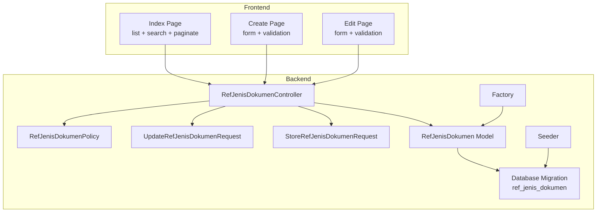
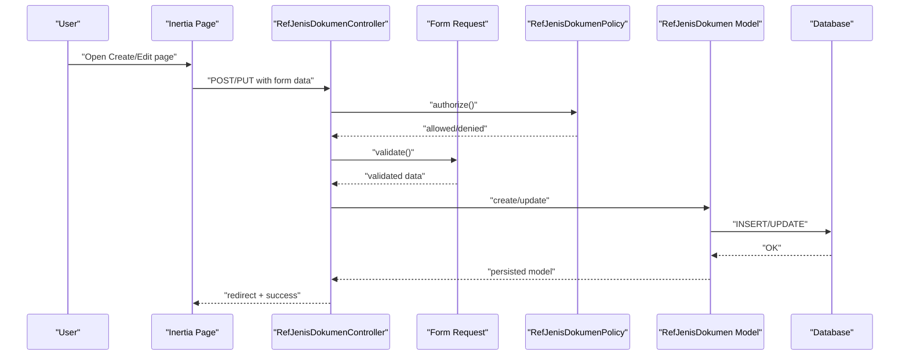
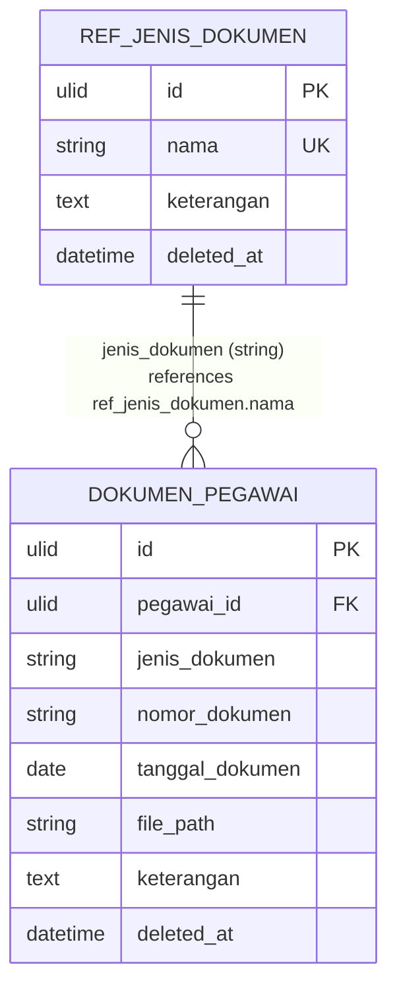
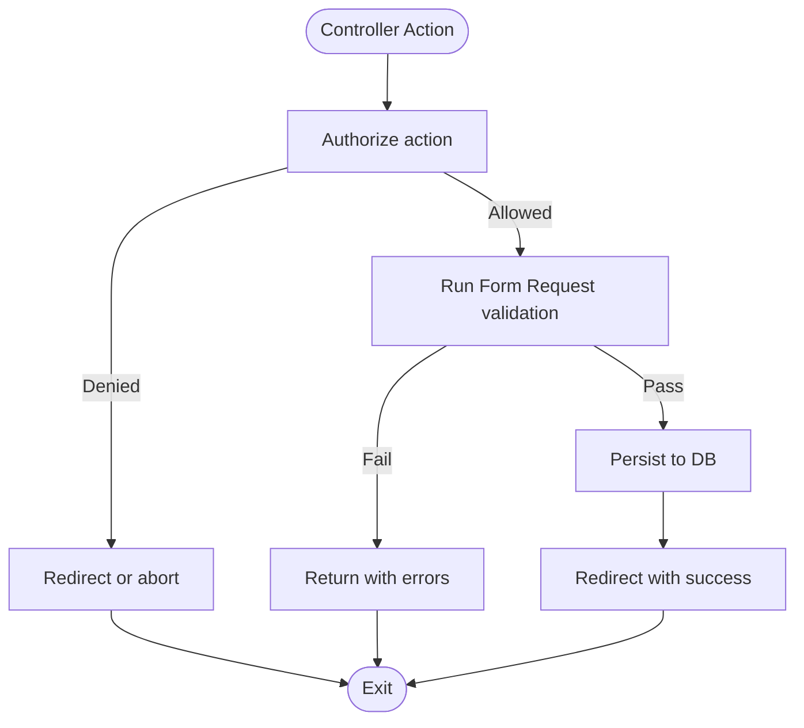
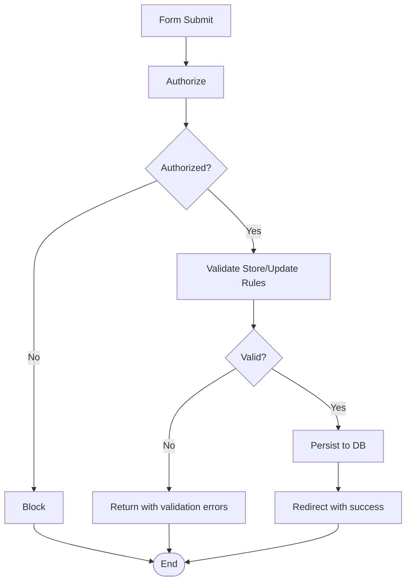
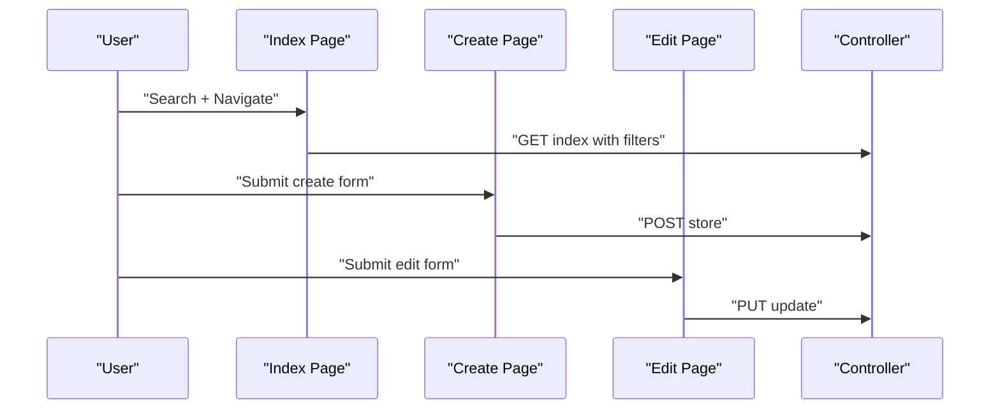
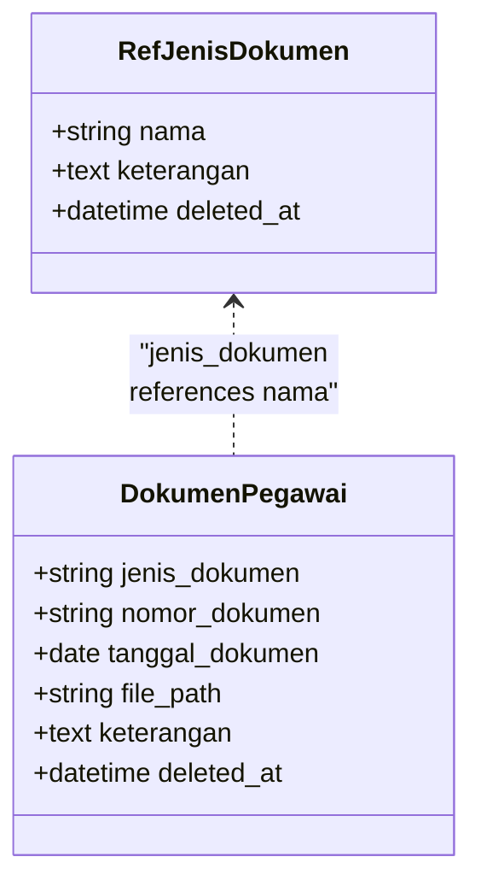
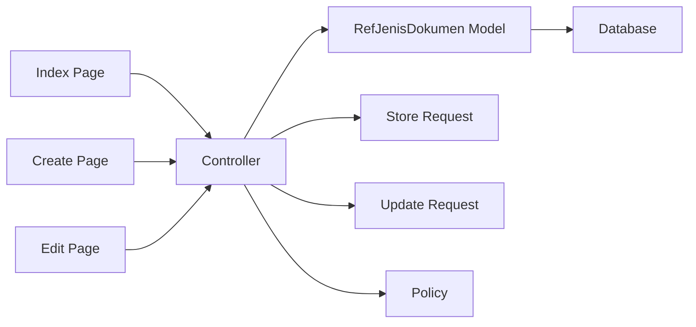

# Document Type Reference Data

<cite>
**Referenced Files in This Document**
- [RefJenisDokumenController.php](file://app/Http/Controllers/Referensi/RefJenisDokumenController.php)
- [RefJenisDokumen.php](file://app/Models/RefJenisDokumen.php)
- [StoreRefJenisDokumenRequest.php](file://app/Http/Requests/Referensi/StoreRefJenisDokumenRequest.php)
- [UpdateRefJenisDokumenRequest.php](file://app/Http/Requests/Referensi/UpdateRefJenisDokumenRequest.php)
- [RefJenisDokumenPolicy.php](file://app/Policies/RefJenisDokumenPolicy.php)
- [create_ref_jenis_dokumen_table.php](file://database/migrations/2026_03_15_162757_create_ref_jenis_dokumen_table.php)
- [RefJenisDokumenFactory.php](file://database/factories/RefJenisDokumenFactory.php)
- [RefJenisDokumenSeeder.php](file://database/seeders/RefJenisDokumenSeeder.php)
- [DokumenPegawai.php](file://app/Models/DokumenPegawai.php)
- [index.tsx](file://resources/js/pages/referensi/jenis-dokumen/index.tsx)
- [create.tsx](file://resources/js/pages/referensi/jenis-dokumen/create.tsx)
- [edit.tsx](file://resources/js/pages/referensi/jenis-dokumen/edit.tsx)
</cite>

## Table of Contents
1. [Introduction](#introduction)
2. [Project Structure](#project-structure)
3. [Core Components](#core-components)
4. [Architecture Overview](#architecture-overview)
5. [Detailed Component Analysis](#detailed-component-analysis)
6. [Dependency Analysis](#dependency-analysis)
7. [Performance Considerations](#performance-considerations)
8. [Troubleshooting Guide](#troubleshooting-guide)
9. [Conclusion](#conclusion)
10. [Appendices](#appendices)

## Introduction
This document explains the Document Type Reference Data system, focusing on the jenis dokumen (document types) reference table and its role in organizing employee documents. It covers the controller-driven CRUD operations, form validation rules, data integrity constraints, database schema, and integration with the employee documents module and the self-service portal. Practical examples demonstrate how document types classify and manage employee records, along with maintenance procedures and common classification scenarios.

## Project Structure
The document type reference data spans backend Laravel components and frontend Inertia/React pages:
- Backend
  - Controller: handles listing, creation, editing, updating, and deletion of document types
  - Model: defines attributes, casting, soft deletes, and primary key
  - Form Requests: enforce validation and authorization rules
  - Policy: gates access for each action
  - Migration: creates the reference table
  - Factory and Seeder: support development and initial population
- Frontend
  - Pages for listing, creating, and editing document types with search and pagination

**Diagram sources**
- [RefJenisDokumenController.php:13-77](file://app/Http/Controllers/Referensi/RefJenisDokumenController.php#L13-L77)
- [RefJenisDokumen.php:10-28](file://app/Models/RefJenisDokumen.php#L10-L28)
- [StoreRefJenisDokumenRequest.php:9-32](file://app/Http/Requests/Referensi/StoreRefJenisDokumenRequest.php#L9-L32)
- [UpdateRefJenisDokumenRequest.php:8-41](file://app/Http/Requests/Referensi/UpdateRefJenisDokumenRequest.php#L8-L41)
- [RefJenisDokumenPolicy.php:7-43](file://app/Policies/RefJenisDokumenPolicy.php#L7-L43)
- [create_ref_jenis_dokumen_table.php:7-24](file://database/migrations/2026_03_15_162757_create_ref_jenis_dokumen_table.php#L7-L24)
- [RefJenisDokumenFactory.php:8-19](file://database/factories/RefJenisDokumenFactory.php#L8-L19)
- [RefJenisDokumenSeeder.php:8-31](file://database/seeders/RefJenisDokumenSeeder.php#L8-L31)
- [index.tsx:31-152](file://resources/js/pages/referensi/jenis-dokumen/index.tsx#L31-L152)
- [create.tsx:12-97](file://resources/js/pages/referensi/jenis-dokumen/create.tsx#L12-L97)
- [edit.tsx:16-101](file://resources/js/pages/referensi/jenis-dokumen/edit.tsx#L16-L101)

**Section sources**
- [RefJenisDokumenController.php:13-77](file://app/Http/Controllers/Referensi/RefJenisDokumenController.php#L13-L77)
- [RefJenisDokumen.php:10-28](file://app/Models/RefJenisDokumen.php#L10-L28)
- [StoreRefJenisDokumenRequest.php:9-32](file://app/Http/Requests/Referensi/StoreRefJenisDokumenRequest.php#L9-L32)
- [UpdateRefJenisDokumenRequest.php:8-41](file://app/Http/Requests/Referensi/UpdateRefJenisDokumenRequest.php#L8-L41)
- [RefJenisDokumenPolicy.php:7-43](file://app/Policies/RefJenisDokumenPolicy.php#L7-L43)
- [create_ref_jenis_dokumen_table.php:7-24](file://database/migrations/2026_03_15_162757_create_ref_jenis_dokumen_table.php#L7-L24)
- [RefJenisDokumenFactory.php:8-19](file://database/factories/RefJenisDokumenFactory.php#L8-L19)
- [RefJenisDokumenSeeder.php:8-31](file://database/seeders/RefJenisDokumenSeeder.php#L8-L31)
- [index.tsx:31-152](file://resources/js/pages/referensi/jenis-dokumen/index.tsx#L31-L152)
- [create.tsx:12-97](file://resources/js/pages/referensi/jenis-dokumen/create.tsx#L12-L97)
- [edit.tsx:16-101](file://resources/js/pages/referensi/jenis-dokumen/edit.tsx#L16-L101)

## Core Components
- RefJenisDokumenController: Implements index, create, store, edit, update, and destroy actions with Inertia rendering and redirects. Authorization checks are performed per action.
- RefJenisDokumen Model: Eloquent model with ulid primary key, fillable attributes, soft deletes, and date casting for deleted_at.
- Form Requests: Validation rules ensure uniqueness of nama, length limits, and optional keterangan. Authorization is enforced via policies.
- Policy: Extends a base policy to define permissions for viewAny, view, create, update, delete, restore, and forceDelete.
- Database Migration: Creates ref_jenis_dokumen with ulid id, string nama, text keterangan, timestamps, and soft deletes.
- Factory and Seeder: Provide realistic test data and initial population for common document types.

**Section sources**
- [RefJenisDokumenController.php:13-77](file://app/Http/Controllers/Referensi/RefJenisDokumenController.php#L13-L77)
- [RefJenisDokumen.php:10-28](file://app/Models/RefJenisDokumen.php#L10-L28)
- [StoreRefJenisDokumenRequest.php:9-32](file://app/Http/Requests/Referensi/StoreRefJenisDokumenRequest.php#L9-L32)
- [UpdateRefJenisDokumenRequest.php:8-41](file://app/Http/Requests/Referensi/UpdateRefJenisDokumenRequest.php#L8-L41)
- [RefJenisDokumenPolicy.php:7-43](file://app/Policies/RefJenisDokumenPolicy.php#L7-L43)
- [create_ref_jenis_dokumen_table.php:7-24](file://database/migrations/2026_03_15_162757_create_ref_jenis_dokumen_table.php#L7-L24)
- [RefJenisDokumenFactory.php:8-19](file://database/factories/RefJenisDokumenFactory.php#L8-L19)
- [RefJenisDokumenSeeder.php:8-31](file://database/seeders/RefJenisDokumenSeeder.php#L8-L31)

## Architecture Overview
The system follows a layered MVC pattern with Inertia for server-rendered SPA-like UX:
- Frontend pages submit forms to the controller actions
- Controller validates input via Form Requests and enforces authorization via Policies
- Model persists data to the ref_jenis_dokumen table with soft deletes
- Employee documents reference document types indirectly via the jenis_dokumen field

**Diagram sources**
- [RefJenisDokumenController.php:13-77](file://app/Http/Controllers/Referensi/RefJenisDokumenController.php#L13-L77)
- [StoreRefJenisDokumenRequest.php:9-32](file://app/Http/Requests/Referensi/StoreRefJenisDokumenRequest.php#L9-L32)
- [UpdateRefJenisDokumenRequest.php:8-41](file://app/Http/Requests/Referensi/UpdateRefJenisDokumenRequest.php#L8-L41)
- [RefJenisDokumenPolicy.php:7-43](file://app/Policies/RefJenisDokumenPolicy.php#L7-L43)
- [RefJenisDokumen.php:10-28](file://app/Models/RefJenisDokumen.php#L10-L28)

## Detailed Component Analysis

### Database Schema and Integrity Constraints
- Table: ref_jenis_dokumen
  - Columns: id (ulid, PK), nama (string, unique), keterangan (text, nullable), timestamps, soft deletes
  - Unique constraint: nama ensures no duplicates
  - Soft deletes: supports recovery without physical removal
- Related model: DokumenPegawai stores jenis_dokumen as a string identifier; this enables decoupling from the reference table while maintaining referential semantics

**Diagram sources**
- [create_ref_jenis_dokumen_table.php:11-17](file://database/migrations/2026_03_15_162757_create_ref_jenis_dokumen_table.php#L11-L17)
- [DokumenPegawai.php:14-36](file://app/Models/DokumenPegawai.php#L14-L36)

**Section sources**
- [create_ref_jenis_dokumen_table.php:7-24](file://database/migrations/2026_03_15_162757_create_ref_jenis_dokumen_table.php#L7-L24)
- [DokumenPegawai.php:10-37](file://app/Models/DokumenPegawai.php#L10-L37)

### CRUD Operations via RefJenisDokumenController
- Index
  - Filters by search term on nama
  - Paginates results with query string preservation
  - Renders with Inertia
- Create/Edit
  - Render forms with Inertia
- Store
  - Validates via StoreRefJenisDokumenRequest
  - Authorizes via policy
  - Persists validated data
- Update
  - Validates via UpdateRefJenisDokumenRequest with ignore rule for uniqueness
  - Authorizes via policy
  - Updates persisted record
- Destroy
  - Authorizes via policy
  - Deletes record (soft delete)

**Diagram sources**
- [RefJenisDokumenController.php:13-77](file://app/Http/Controllers/Referensi/RefJenisDokumenController.php#L13-L77)
- [StoreRefJenisDokumenRequest.php:9-32](file://app/Http/Requests/Referensi/StoreRefJenisDokumenRequest.php#L9-L32)
- [UpdateRefJenisDokumenRequest.php:8-41](file://app/Http/Requests/Referensi/UpdateRefJenisDokumenRequest.php#L8-L41)
- [RefJenisDokumenPolicy.php:7-43](file://app/Policies/RefJenisDokumenPolicy.php#L7-L43)

**Section sources**
- [RefJenisDokumenController.php:13-77](file://app/Http/Controllers/Referensi/RefJenisDokumenController.php#L13-L77)

### Form Validation Rules and Messages
- StoreRefJenisDokumenRequest
  - nama: required, string, max 255, unique on ref_jenis_dokumen.nama
  - keterangan: nullable, string, max 1000
  - Custom messages for user-friendly feedback
- UpdateRefJenisDokumenRequest
  - nama: required, string, max 255, unique ignoring current record id
  - keterangan: nullable, string, max 1000
  - Custom messages for user-friendly feedback

**Diagram sources**
- [StoreRefJenisDokumenRequest.php:9-32](file://app/Http/Requests/Referensi/StoreRefJenisDokumenRequest.php#L9-L32)
- [UpdateRefJenisDokumenRequest.php:8-41](file://app/Http/Requests/Referensi/UpdateRefJenisDokumenRequest.php#L8-L41)

**Section sources**
- [StoreRefJenisDokumenRequest.php:9-32](file://app/Http/Requests/Referensi/StoreRefJenisDokumenRequest.php#L9-L32)
- [UpdateRefJenisDokumenRequest.php:8-41](file://app/Http/Requests/Referensi/UpdateRefJenisDokumenRequest.php#L8-L41)

### Frontend Integration and User Experience
- Index page
  - Search by nama with debounced request
  - Paginated table with edit/delete actions
- Create/Edit pages
  - Controlled form state with Inertia useForm
  - Real-time validation feedback
  - Navigation back to index

**Diagram sources**
- [index.tsx:31-152](file://resources/js/pages/referensi/jenis-dokumen/index.tsx#L31-L152)
- [create.tsx:12-97](file://resources/js/pages/referensi/jenis-dokumen/create.tsx#L12-L97)
- [edit.tsx:16-101](file://resources/js/pages/referensi/jenis-dokumen/edit.tsx#L16-L101)
- [RefJenisDokumenController.php:13-77](file://app/Http/Controllers/Referensi/RefJenisDokumenController.php#L13-L77)

**Section sources**
- [index.tsx:31-152](file://resources/js/pages/referensi/jenis-dokumen/index.tsx#L31-L152)
- [create.tsx:12-97](file://resources/js/pages/referensi/jenis-dokumen/create.tsx#L12-L97)
- [edit.tsx:16-101](file://resources/js/pages/referensi/jenis-dokumen/edit.tsx#L16-L101)

### Integration with Employee Documents and Self-Service Portal
- DokumenPegawai stores jenis_dokumen as a string identifier. While the reference table contains nama as the canonical name, the employee documents table uses a denormalized string field to decouple from potential future schema changes.
- This design allows:
  - Faster queries against dokumen_pegawai without joins
  - Flexibility to rename reference entries without rewriting existing document records
- Self-service portal can present document types from the reference table and allow users to filter or upload documents accordingly.

**Diagram sources**
- [RefJenisDokumen.php:10-28](file://app/Models/RefJenisDokumen.php#L10-L28)
- [DokumenPegawai.php:10-37](file://app/Models/DokumenPegawai.php#L10-L37)

**Section sources**
- [DokumenPegawai.php:10-37](file://app/Models/DokumenPegawai.php#L10-L37)

### Common Classification Scenarios and Maintenance Procedures
- Typical document types
  - SK CPNS, SK PNS, SK Jabatan, SK Pangkat
  - Ijazah, Sertifikat Diklat
  - KGB, Kartu Pegawai
  - Lainnya
- Maintenance
  - Use seeder to initialize baseline types
  - Add new types via Create page; ensure nama uniqueness
  - Update existing types via Edit page; avoid changing nama if referenced by employee documents
  - Soft-deleted types remain recoverable until forced deletion

**Section sources**
- [RefJenisDokumenSeeder.php:8-31](file://database/seeders/RefJenisDokumenSeeder.php#L8-L31)
- [RefJenisDokumenFactory.php:8-19](file://database/factories/RefJenisDokumenFactory.php#L8-L19)
- [RefJenisDokumenController.php:13-77](file://app/Http/Controllers/Referensi/RefJenisDokumenController.php#L13-L77)

## Dependency Analysis
- Controller depends on:
  - Model for persistence
  - Form Requests for validation
  - Policies for authorization
  - Inertia for rendering
- Model depends on:
  - Eloquent traits for ULIDs, factories, and soft deletes
- Frontend pages depend on:
  - Inertia router for navigation
  - UI components for forms and tables

**Diagram sources**
- [RefJenisDokumenController.php:13-77](file://app/Http/Controllers/Referensi/RefJenisDokumenController.php#L13-L77)
- [RefJenisDokumen.php:10-28](file://app/Models/RefJenisDokumen.php#L10-L28)
- [StoreRefJenisDokumenRequest.php:9-32](file://app/Http/Requests/Referensi/StoreRefJenisDokumenRequest.php#L9-L32)
- [UpdateRefJenisDokumenRequest.php:8-41](file://app/Http/Requests/Referensi/UpdateRefJenisDokumenRequest.php#L8-L41)
- [RefJenisDokumenPolicy.php:7-43](file://app/Policies/RefJenisDokumenPolicy.php#L7-L43)
- [index.tsx:31-152](file://resources/js/pages/referensi/jenis-dokumen/index.tsx#L31-L152)
- [create.tsx:12-97](file://resources/js/pages/referensi/jenis-dokumen/create.tsx#L12-L97)
- [edit.tsx:16-101](file://resources/js/pages/referensi/jenis-dokumen/edit.tsx#L16-L101)

**Section sources**
- [RefJenisDokumenController.php:13-77](file://app/Http/Controllers/Referensi/RefJenisDokumenController.php#L13-L77)
- [RefJenisDokumen.php:10-28](file://app/Models/RefJenisDokumen.php#L10-L28)
- [StoreRefJenisDokumenRequest.php:9-32](file://app/Http/Requests/Referensi/StoreRefJenisDokumenRequest.php#L9-L32)
- [UpdateRefJenisDokumenRequest.php:8-41](file://app/Http/Requests/Referensi/UpdateRefJenisDokumenRequest.php#L8-L41)
- [RefJenisDokumenPolicy.php:7-43](file://app/Policies/RefJenisDokumenPolicy.php#L7-L43)
- [index.tsx:31-152](file://resources/js/pages/referensi/jenis-dokumen/index.tsx#L31-L152)
- [create.tsx:12-97](file://resources/js/pages/referensi/jenis-dokumen/create.tsx#L12-L97)
- [edit.tsx:16-101](file://resources/js/pages/referensi/jenis-dokumen/edit.tsx#L16-L101)

## Performance Considerations
- Index pagination reduces payload size and improves responsiveness.
- Unique index on nama prevents duplicate entries and supports fast lookups.
- Soft deletes enable recovery without rebuilding indices.
- Frontend debounced search avoids excessive requests during typing.

## Troubleshooting Guide
- Duplicate nama
  - Symptom: Validation error on nama uniqueness
  - Resolution: Choose a unique name or adjust existing entry
- Missing required fields
  - Symptom: Validation error for nama required
  - Resolution: Fill required fields before submission
- Authorization failures
  - Symptom: Access denied when creating/updating/deleting
  - Resolution: Verify user permissions mapped to RefJenisDokumenPolicy
- Search not filtering
  - Symptom: Index not reflecting search term
  - Resolution: Confirm query string is preserved and route matches controller expectations

**Section sources**
- [StoreRefJenisDokumenRequest.php:9-32](file://app/Http/Requests/Referensi/StoreRefJenisDokumenRequest.php#L9-L32)
- [UpdateRefJenisDokumenRequest.php:8-41](file://app/Http/Requests/Referensi/UpdateRefJenisDokumenRequest.php#L8-L41)
- [RefJenisDokumenPolicy.php:7-43](file://app/Policies/RefJenisDokumenPolicy.php#L7-L43)
- [RefJenisDokumenController.php:13-77](file://app/Http/Controllers/Referensi/RefJenisDokumenController.php#L13-L77)

## Conclusion
The Document Type Reference Data system provides a robust foundation for classifying and organizing employee documents. Through strict validation, authorization, and a clean separation of concerns, it ensures data integrity while enabling flexible maintenance. The design balances developer productivity with operational reliability, supporting both administrative workflows and self-service capabilities.

## Appendices
- Initial dataset examples are provided by the seeder for common document categories such as SK CPNS, SK PNS, SK Jabatan, SK Pangkat, Ijazah, Sertifikat Diklat, KGB, Kartu Pegawai, and Lainnya.

**Section sources**
- [RefJenisDokumenSeeder.php:8-31](file://database/seeders/RefJenisDokumenSeeder.php#L8-L31)