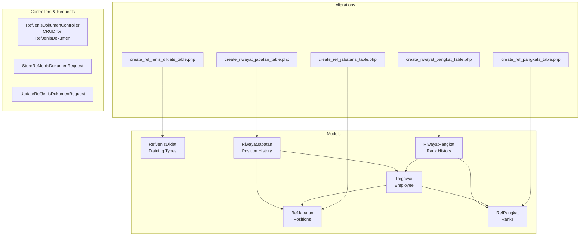
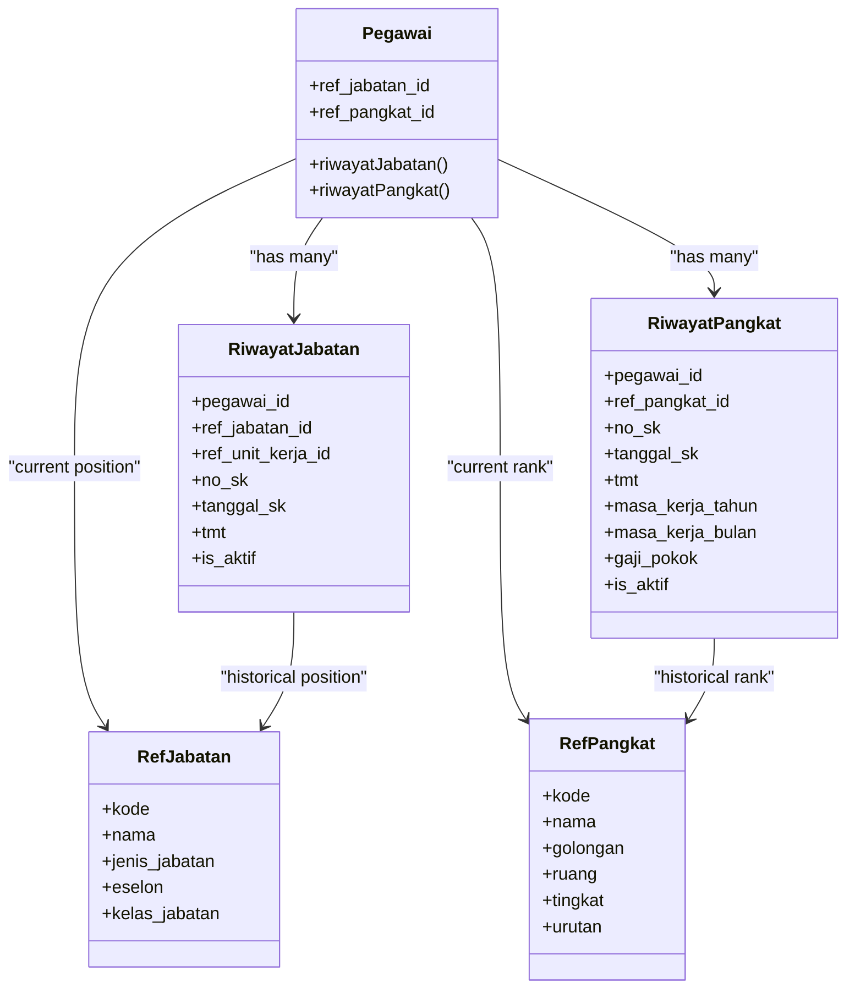
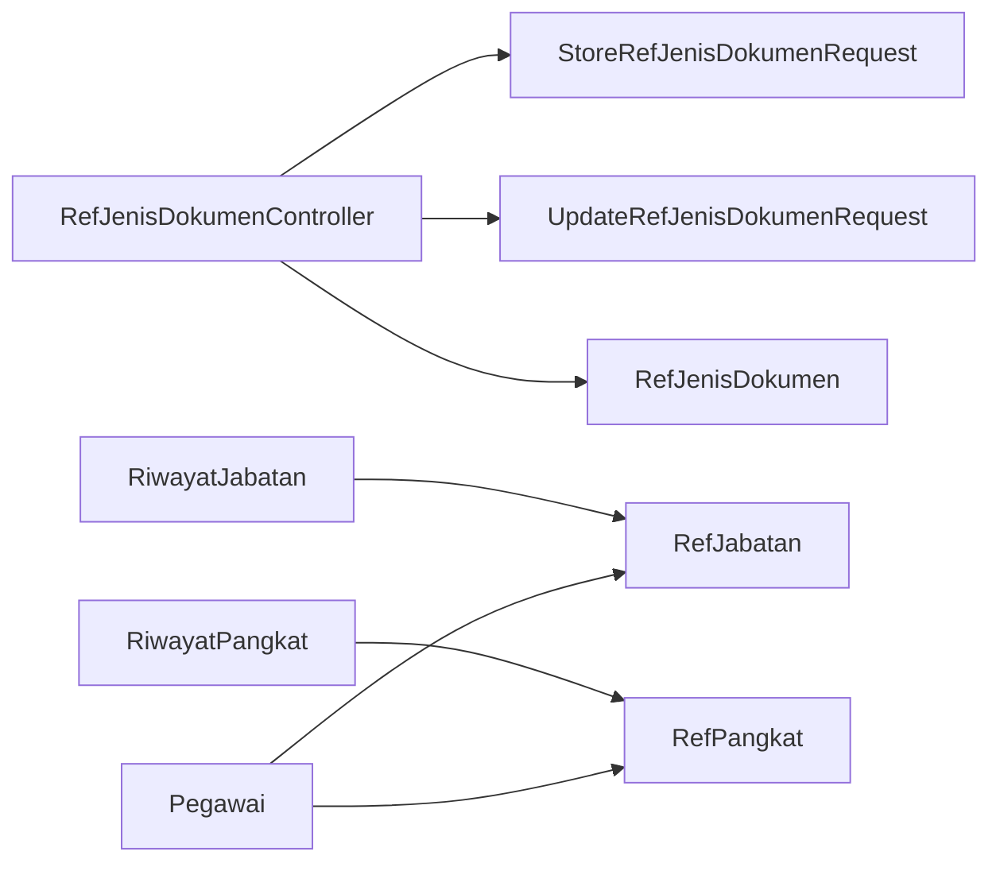

# Position and Rank Reference Data

<cite>
**Referenced Files in This Document**
- [RefJabatan.php](file://app/Models/RefJabatan.php)
- [RefPangkat.php](file://app/Models/RefPangkat.php)
- [RefJenisDiklat.php](file://app/Models/RefJenisDiklat.php)
- [JenisJabatan.php](file://app/Enums/JenisJabatan.php)
- [RefJenisDokumenController.php](file://app/Http/Controllers/Referensi/RefJenisDokumenController.php)
- [StoreRefJenisDokumenRequest.php](file://app/Http/Requests/Referensi/StoreRefJenisDokumenRequest.php)
- [UpdateRefJenisDokumenRequest.php](file://app/Http/Requests/Referensi/UpdateRefJenisDokumenRequest.php)
- [RiwayatJabatan.php](file://app/Models/RiwayatJabatan.php)
- [RiwayatPangkat.php](file://app/Models/RiwayatPangkat.php)
- [Pegawai.php](file://app/Models/Pegawai.php)
- [2026_03_15_022210_create_ref_jabatans_table.php](file://database/migrations/2026_03_15_022210_create_ref_jabatans_table.php)
- [2026_03_15_022210_create_ref_pangkats_table.php](file://database/migrations/2026_03_15_022210_create_ref_pangkats_table.php)
- [2026_03_15_022210_create_ref_jenis_diklats_table.php](file://database/migrations/2026_03_15_022210_create_ref_jenis_diklats_table.php)
- [2026_03_15_030540_create_riwayat_jabatan_table.php](file://database/migrations/2026_03_15_030540_create_riwayat_jabatan_table.php)
- [2026_03_15_031012_create_riwayat_pangkat_table.php](file://database/migrations/2026_03_15_031012_create_riwayat_pangkat_table.php)
</cite>

## Table of Contents
1. [Introduction](#introduction)
2. [Project Structure](#project-structure)
3. [Core Components](#core-components)
4. [Architecture Overview](#architecture-overview)
5. [Detailed Component Analysis](#detailed-component-analysis)
6. [Dependency Analysis](#dependency-analysis)
7. [Performance Considerations](#performance-considerations)
8. [Troubleshooting Guide](#troubleshooting-guide)
9. [Conclusion](#conclusion)

## Introduction
This document explains the Position and Rank Reference Data system that underpins employee career progression tracking. It covers three core reference tables:
- jabatan (positions)
- pangkat (ranks)
- jenis diklat (training types)

It documents how these references integrate with employee records and monitoring systems, the CRUD operations for reference data, validation rules, and data integrity constraints enforced by the database schema. Examples are grounded in the actual codebase to support both HR administrators and developers.

## Project Structure
The Position and Rank Reference Data system spans models, migrations, controllers, form requests, and enums. The following diagram shows the high-level structure and relationships.



**Diagram sources**
- [RefJabatan.php:1-35](file://app/Models/RefJabatan.php#L1-L35)
- [RefPangkat.php:1-34](file://app/Models/RefPangkat.php#L1-L34)
- [RefJenisDiklat.php:1-29](file://app/Models/RefJenisDiklat.php#L1-L29)
- [RiwayatJabatan.php:1-59](file://app/Models/RiwayatJabatan.php#L1-L59)
- [RiwayatPangkat.php:1-59](file://app/Models/RiwayatPangkat.php#L1-L59)
- [Pegawai.php:1-209](file://app/Models/Pegawai.php#L1-L209)
- [2026_03_15_022210_create_ref_jabatans_table.php:1-34](file://database/migrations/2026_03_15_022210_create_ref_jabatans_table.php#L1-L34)
- [2026_03_15_022210_create_ref_pangkats_table.php:1-35](file://database/migrations/2026_03_15_022210_create_ref_pangkats_table.php#L1-L35)
- [2026_03_15_022210_create_ref_jenis_diklats_table.php:1-31](file://database/migrations/2026_03_15_022210_create_ref_jenis_diklats_table.php#L1-L31)
- [2026_03_15_030540_create_riwayat_jabatan_table.php:1-38](file://database/migrations/2026_03_15_030540_create_riwayat_jabatan_table.php#L1-L38)
- [2026_03_15_031012_create_riwayat_pangkat_table.php:1-40](file://database/migrations/2026_03_15_031012_create_riwayat_pangkat_table.php#L1-L40)

**Section sources**
- [RefJabatan.php:1-35](file://app/Models/RefJabatan.php#L1-L35)
- [RefPangkat.php:1-34](file://app/Models/RefPangkat.php#L1-L34)
- [RefJenisDiklat.php:1-29](file://app/Models/RefJenisDiklat.php#L1-L29)
- [RiwayatJabatan.php:1-59](file://app/Models/RiwayatJabatan.php#L1-L59)
- [RiwayatPangkat.php:1-59](file://app/Models/RiwayatPangkat.php#L1-L59)
- [Pegawai.php:1-209](file://app/Models/Pegawai.php#L1-L209)
- [2026_03_15_022210_create_ref_jabatans_table.php:1-34](file://database/migrations/2026_03_15_022210_create_ref_jabatans_table.php#L1-L34)
- [2026_03_15_022210_create_ref_pangkats_table.php:1-35](file://database/migrations/2026_03_15_022210_create_ref_pangkats_table.php#L1-L35)
- [2026_03_15_022210_create_ref_jenis_diklats_table.php:1-31](file://database/migrations/2026_03_15_022210_create_ref_jenis_diklats_table.php#L1-L31)
- [2026_03_15_030540_create_riwayat_jabatan_table.php:1-38](file://database/migrations/2026_03_15_030540_create_riwayat_jabatan_table.php#L1-L38)
- [2026_03_15_031012_create_riwayat_pangkat_table.php:1-40](file://database/migrations/2026_03_15_031012_create_riwayat_pangkat_table.php#L1-L40)

## Core Components
This section documents the three reference tables and their business logic.

- Positions (jabatan)
  - Purpose: Define job positions with classification (e.g., structural, functional, staff), optional grade and class fields, and unique codes/names.
  - Key attributes: code, name, type, optional grade, optional class.
  - Business logic: Supports hierarchical and functional categorization of positions.

- Ranks (pangkat)
  - Purpose: Define official ranks with unique codes/names, groupings (e.g., by pay grade), and ordering (urutan) for progression tracking.
  - Key attributes: code, name, group (golongan), rank (ruang), level (tingkat), order (urutan).
  - Business logic: Enables chronological and numeric ordering for promotion calculations.

- Training Types (jenis diklat)
  - Purpose: Categorize training programs with unique names and optional descriptions.
  - Key attributes: name, description.
  - Business logic: Links training records to standardized categories.

**Section sources**
- [RefJabatan.php:1-35](file://app/Models/RefJabatan.php#L1-L35)
- [RefPangkat.php:1-34](file://app/Models/RefPangkat.php#L1-L34)
- [RefJenisDiklat.php:1-29](file://app/Models/RefJenisDiklat.php#L1-L29)
- [JenisJabatan.php:1-20](file://app/Enums/JenisJabatan.php#L1-L20)

## Architecture Overview
The reference data supports employee career progression through direct relations from employees to positions/ranks and through history tables that record changes over time.



**Diagram sources**
- [Pegawai.php:67-82](file://app/Models/Pegawai.php#L67-L82)
- [RefJabatan.php:16-24](file://app/Models/RefJabatan.php#L16-L24)
- [RefPangkat.php:17-24](file://app/Models/RefPangkat.php#L17-L24)
- [RiwayatJabatan.php:17-27](file://app/Models/RiwayatJabatan.php#L17-L27)
- [RiwayatPangkat.php:17-29](file://app/Models/RiwayatPangkat.php#L17-L29)

## Detailed Component Analysis

### Positions (RefJabatan)
- Model characteristics
  - Uses ULIDs, soft deletes, fillable fields include code, name, type, optional grade/class.
  - Enum casting for position type aligns with business categories.
- Business logic
  - Supports struktural (structural), fungsional (functional), and pelaksana (staff) classifications.
  - Unique code constraint ensures consistent identification.
- Integration
  - Employees reference current position via foreign key.
  - Historical position changes are recorded in RiwayatJabatan.

**Section sources**
- [RefJabatan.php:1-35](file://app/Models/RefJabatan.php#L1-L35)
- [JenisJabatan.php:1-20](file://app/Enums/JenisJabatan.php#L1-L20)
- [2026_03_15_022210_create_ref_jabatans_table.php:14-23](file://database/migrations/2026_03_15_022210_create_ref_jabatans_table.php#L14-L23)
- [Pegawai.php:69-77](file://app/Models/Pegawai.php#L69-L77)
- [RiwayatJabatan.php:39-47](file://app/Models/RiwayatJabatan.php#L39-L47)

### Ranks (RefPangkat)
- Model characteristics
  - Unique code and name; integer urutan enables ordered progression.
  - Soft deletes support archival without loss of historical context.
- Business logic
  - Grouping by golongan and ruang supports pay and administrative grouping.
  - Urutan field allows deterministic ordering for promotions and calculations.
- Integration
  - Employees reference current rank via foreign key.
  - Historical rank changes are recorded in RiwayatPangkat.

**Section sources**
- [RefPangkat.php:1-34](file://app/Models/RefPangkat.php#L1-L34)
- [2026_03_15_022210_create_ref_pangkats_table.php:14-24](file://database/migrations/2026_03_15_022210_create_ref_pangkats_table.php#L14-L24)
- [Pegawai.php:69-77](file://app/Models/Pegawai.php#L69-L77)
- [RiwayatPangkat.php:44-52](file://app/Models/RiwayatPangkat.php#L44-L52)

### Training Types (RefJenisDiklat)
- Model characteristics
  - Unique name with optional description; soft deletes.
- Business logic
  - Standardizes training categorization for training history records.
- Integration
  - Training history records reference training type via foreign key.

**Section sources**
- [RefJenisDiklat.php:1-29](file://app/Models/RefJenisDiklat.php#L1-L29)
- [2026_03_15_022210_create_ref_jenis_diklats_table.php:14-20](file://database/migrations/2026_03_15_022210_create_ref_jenis_diklats_table.php#L14-L20)

### CRUD Operations Through RefJenisDokumenController
Although the controller name mentions "Jenis Dokumen", it demonstrates the CRUD pattern used for reference data maintenance. The same pattern applies to reference tables (positions, ranks, training types) via dedicated controllers.

- Index
  - Authorization check, search/filter by name, paginated results ordered by name.
- Create
  - Authorization check, renders creation form.
- Store
  - Validation via form request, persists validated data.
- Edit
  - Authorization check, renders edit form with existing resource.
- Update
  - Validation via form request, updates resource.
- Destroy
  - Authorization check, deletes resource.

Validation rules and messages ensure data integrity and user-friendly feedback.

**Section sources**
- [RefJenisDokumenController.php:1-78](file://app/Http/Controllers/Referensi/RefJenisDokumenController.php#L1-L78)
- [StoreRefJenisDokumenRequest.php:1-33](file://app/Http/Requests/Referensi/StoreRefJenisDokumenRequest.php#L1-L33)
- [UpdateRefJenisDokumenRequest.php:1-42](file://app/Http/Requests/Referensi/UpdateRefJenisDokumenRequest.php#L1-L42)

### Database Schema and Constraints
The schema enforces uniqueness, referential integrity, and soft-deletes across reference and history tables.

- ref_jabatan
  - Primary key: ulid id
  - Unique constraints: kode
  - Nullable fields: eselon, kelas_jabatan
  - Timestamps and soft deletes
- ref_pangkat
  - Primary key: ulid id
  - Unique constraints: kode
  - Indexed field: urutan
  - Timestamps and soft deletes
- ref_jenis_diklat
  - Primary key: ulid id
  - Unique constraints: nama
  - Timestamps and soft deletes
- riwayat_jabatan
  - Foreign keys: pegawai_id (on delete cascade), ref_jabatan_id (null on delete), ref_unit_kerja_id (null on delete)
  - Boolean flag is_aktif, date fields, nullable pejabat_penetap, timestamps and soft deletes
- riwayat_pangkat
  - Foreign keys: pegawai_id (on delete cascade), ref_pangkat_id (null on delete)
  - Integer masa_kerja_tahun/bulan, decimal gaji_pokok, boolean is_aktif, timestamps and soft deletes

```mermaid
erDiagram
REF_JABATAN {
ulid id PK
string kode UK
string nama
string jenis_jabatan
string eselon
int kelas_jabatan
datetime deleted_at
}
REF_PANGKAT {
ulid id PK
string kode UK
string nama
string golongan
string ruang
string tingkat
int urutan I
datetime deleted_at
}
REF_JENIS_DIKLAT {
ulid id PK
string nama UK
text keterangan
datetime deleted_at
}
RIWAYAT_JABATAN {
ulid id PK
ulid pegawai_id FK
ulid ref_jabatan_id FK
ulid ref_unit_kerja_id FK
string no_sk
date tanggal_sk
date tmt
string pejabat_penetap
boolean is_aktif
text keterangan
datetime deleted_at
}
RIWAYAT_PANGKAT {
ulid id PK
ulid pegawai_id FK
ulid ref_pangkat_id FK
string no_sk
date tanggal_sk
date tmt
int masa_kerja_tahun
int masa_kerja_bulan
decimal gaji_pokok
boolean is_aktif
text keterangan
datetime deleted_at
}
PEGAWAI {
ulid id PK
ulid ref_jabatan_id FK
ulid ref_pangkat_id FK
ulid ref_unit_kerja_id FK
string nip
string nama_lengkap
date tanggal_lahir
enum status_pegawai
datetime deleted_at
}
PEGAWAI ||--o{ RIWAYAT_JABATAN : "has many"
PEGAWAI ||--o{ RIWAYAT_PANGKAT : "has many"
REF_JABATAN ||--o{ RIWAYAT_JABATAN : "historical positions"
REF_PANGKAT ||--o{ RIWAYAT_PANGKAT : "historical ranks"
```

**Diagram sources**
- [2026_03_15_022210_create_ref_jabatans_table.php:14-23](file://database/migrations/2026_03_15_022210_create_ref_jabatans_table.php#L14-L23)
- [2026_03_15_022210_create_ref_pangkats_table.php:14-24](file://database/migrations/2026_03_15_022210_create_ref_pangkats_table.php#L14-L24)
- [2026_03_15_022210_create_ref_jenis_diklats_table.php:14-20](file://database/migrations/2026_03_15_022210_create_ref_jenis_diklats_table.php#L14-L20)
- [2026_03_15_030540_create_riwayat_jabatan_table.php:14-27](file://database/migrations/2026_03_15_030540_create_riwayat_jabatan_table.php#L14-L27)
- [2026_03_15_031012_create_riwayat_pangkat_table.php:14-29](file://database/migrations/2026_03_15_031012_create_riwayat_pangkat_table.php#L14-L29)
- [Pegawai.php:30-39](file://app/Models/Pegawai.php#L30-L39)

**Section sources**
- [2026_03_15_022210_create_ref_jabatans_table.php:1-34](file://database/migrations/2026_03_15_022210_create_ref_jabatans_table.php#L1-L34)
- [2026_03_15_022210_create_ref_pangkats_table.php:1-35](file://database/migrations/2026_03_15_022210_create_ref_pangkats_table.php#L1-L35)
- [2026_03_15_022210_create_ref_jenis_diklats_table.php:1-31](file://database/migrations/2026_03_15_022210_create_ref_jenis_diklats_table.php#L1-L31)
- [2026_03_15_030540_create_riwayat_jabatan_table.php:1-38](file://database/migrations/2026_03_15_030540_create_riwayat_jabatan_table.php#L1-L38)
- [2026_03_15_031012_create_riwayat_pangkat_table.php:1-40](file://database/migrations/2026_03_15_031012_create_riwayat_pangkat_table.php#L1-L40)

### Employee Career Progression Tracking
- Current role and rank
  - Employees maintain current position and rank via foreign keys.
- Historical progression
  - RiwayatJabatan and RiwayatPangkat capture changes with dates (tanggal_sk, tmt), SK numbers, approving officials, and activity flags (is_aktif).
- Practical example
  - Promotion: Add a new RiwayatPangkat record with updated ref_pangkat_id, tmt aligned with promotion effective date, is_aktif set appropriately, and update employee’s current ref_pangkat_id accordingly.
  - Position change: Add a new RiwayatJabatan record with updated ref_jabatan_id and ref_unit_kerja_id, set is_aktif for the active assignment, and update employee’s current ref_jabatan_id.

**Section sources**
- [Pegawai.php:69-77](file://app/Models/Pegawai.php#L69-L77)
- [RiwayatJabatan.php:17-27](file://app/Models/RiwayatJabatan.php#L17-L27)
- [RiwayatPangkat.php:17-29](file://app/Models/RiwayatPangkat.php#L17-L29)

### Monitoring Systems Integration
- Active assignments
  - Use scopes or filters to select is_aktif = true for current assignments.
- Reporting
  - Join Pegawai with RiwayatJabatan/RiwayatPangkat and reference tables to generate reports on promotions, transfers, and service duration.

**Section sources**
- [RiwayatJabatan.php:54-57](file://app/Models/RiwayatJabatan.php#L54-L57)
- [RiwayatPangkat.php:54-57](file://app/Models/RiwayatPangkat.php#L54-L57)

## Dependency Analysis
The following diagram highlights dependencies among models and controllers.



**Diagram sources**
- [RefJenisDokumenController.php:1-78](file://app/Http/Controllers/Referensi/RefJenisDokumenController.php#L1-L78)
- [StoreRefJenisDokumenRequest.php:1-33](file://app/Http/Requests/Referensi/StoreRefJenisDokumenRequest.php#L1-L33)
- [UpdateRefJenisDokumenRequest.php:1-42](file://app/Http/Requests/Referensi/UpdateRefJenisDokumenRequest.php#L1-L42)
- [RiwayatJabatan.php:44-47](file://app/Models/RiwayatJabatan.php#L44-L47)
- [RiwayatPangkat.php:49-52](file://app/Models/RiwayatPangkat.php#L49-L52)
- [Pegawai.php:69-77](file://app/Models/Pegawai.php#L69-L77)

**Section sources**
- [RefJenisDokumenController.php:1-78](file://app/Http/Controllers/Referensi/RefJenisDokumenController.php#L1-L78)
- [StoreRefJenisDokumenRequest.php:1-33](file://app/Http/Requests/Referensi/StoreRefJenisDokumenRequest.php#L1-L33)
- [UpdateRefJenisDokumenRequest.php:1-42](file://app/Http/Requests/Referensi/UpdateRefJenisDokumenRequest.php#L1-L42)
- [RiwayatJabatan.php:1-59](file://app/Models/RiwayatJabatan.php#L1-L59)
- [RiwayatPangkat.php:1-59](file://app/Models/RiwayatPangkat.php#L1-L59)
- [Pegawai.php:1-209](file://app/Models/Pegawai.php#L1-L209)

## Performance Considerations
- Indexing
  - Ensure unique indexes on frequently filtered fields (e.g., ref_pangkat.kode, ref_jabatan.kode).
  - Consider adding indexes on foreign keys used in joins (pegawai_id, ref_jabatan_id, ref_pangkat_id) for history queries.
- Soft deletes
  - Queries should leverage appropriate scopes or filters to avoid scanning deleted rows.
- Pagination
  - Use pagination for listing reference data to limit memory footprint.

## Troubleshooting Guide
- Duplicate entries
  - Unique constraints prevent duplicates on kode (positions) and kode/nama (ranks, training types). Validation rules enforce uniqueness during create/update.
- Orphaned history records
  - Foreign keys are nullable for reference IDs in history tables, allowing records to persist even if a reference is removed. Prefer updating references rather than deleting them.
- Active assignment conflicts
  - Ensure only one active assignment per employee by setting is_aktif appropriately when creating/updating history records.

**Section sources**
- [2026_03_15_022210_create_ref_jabatans_table.php:16-16](file://database/migrations/2026_03_15_022210_create_ref_jabatans_table.php#L16-L16)
- [2026_03_15_022210_create_ref_pangkats_table.php:16-16](file://database/migrations/2026_03_15_022210_create_ref_pangkats_table.php#L16-L16)
- [2026_03_15_022210_create_ref_jenis_diklats_table.php:16-16](file://database/migrations/2026_03_15_022210_create_ref_jenis_diklats_table.php#L16-L16)
- [2026_03_15_030540_create_riwayat_jabatan_table.php:17-17](file://database/migrations/2026_03_15_030540_create_riwayat_jabatan_table.php#L17-L17)
- [2026_03_15_031012_create_riwayat_pangkat_table.php:17-17](file://database/migrations/2026_03_15_031012_create_riwayat_pangkat_table.php#L17-L17)

## Conclusion
The Position and Rank Reference Data system provides a robust foundation for managing employee career progression. The reference tables (jabatan, pangkat, jenis diklat) are integrated with employee records and history tables to track changes over time. The schema enforces data integrity, while controllers and form requests ensure consistent validation and authorization. This design supports HR operations and enables accurate reporting and monitoring of promotions, transfers, and service history.